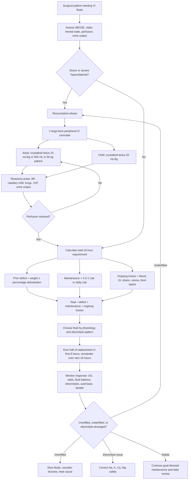

## Fluid Replacement in General Surgery

Fluid replacement is not just "put up a drip." In surgery it is a core management skill because hypovolaemia, third-spacing, electrolyte loss, and iatrogenic over-resuscitation can all kill the patient before the definitive operation is even reached.

The central question is always:

> **What compartment has lost fluid, what has the patient already lost, what will they keep losing, and what physiological target proves that perfusion has been restored?**

This page is written as one integrated management note because the topic is mainly **Mx**: assess volume status, resuscitate shock, calculate deficit, add maintenance, replace ongoing losses, choose the right fluid, correct electrolytes safely, and reassess continuously.

---

### A. Body Fluid Compartments - The Anatomy of Fluid Prescribing

#### 1. Normal Body Water Distribution

| Compartment | Adult male | Adult female | Infant | Why it matters clinically |
|---|---:|---:|---:|---|
| **Total body fluid** | **60% body weight** | **50% body weight** | **80% at birth; about 65% by 1 year** | Determines how large a fluid deficit or sodium deficit really is |
| **Intracellular fluid** | **2/3 of total body fluid** | **2/3 of total body fluid** | Higher proportion than adult | Dextrose water and hypotonic fluids distribute mainly here after glucose metabolism |
| **Extracellular fluid** | **1/3 of total body fluid** | **1/3 of total body fluid** | Larger than adult | This is the surgical resuscitation compartment |
| **Interstitial fluid** | **3/4 of ECF** | **3/4 of ECF** | Large and labile | Expands in oedema, sepsis, burns, pancreatitis, peritonitis |
| **Intravascular plasma** | **1/4 of ECF** | **1/4 of ECF** | Small absolute volume | The target compartment in shock: preload, stroke volume, cardiac output |

#### 2. Why Only a Small Fraction of Crystalloid Stays Intravascular

Normal saline and Hartmann's solution are **crystalloids**. They distribute through the extracellular compartment, not just the bloodstream.

If 1 L of isotonic crystalloid is infused:

- Most distributes into the **interstitial space**
- Roughly a quarter of the extracellular distribution remains **intravascular**
- Therefore, a shocked patient may need repeated boluses before preload improves

This is why **crystalloids are excellent first-line fluids but require reassessment after each bolus**. If the capillary barrier is leaky, even less remains in the circulation.

#### 3. The Starling Principle in One Surgical Sentence

Fluid stays inside capillaries when **hydrostatic pressure pushing out** is balanced by **oncotic pressure pulling in** and an intact endothelial barrier.

In surgical illness:

- **Sepsis / pancreatitis / peritonitis** injure the endothelium -> capillary leak
- Albumin and water leave the vascular space -> interstitial oedema
- Plasma volume falls despite total body water excess
- The patient can be simultaneously **oedematous and intravascularly depleted**

<Callout title="Core Concept">
Hypovolaemia is a problem of **effective circulating volume**, not just total body water. A patient with septic capillary leak may look swollen but still have poor venous return, poor stroke volume, low urine output, and rising lactate.
</Callout>

---

### B. Pathophysiology of Volume Depletion

#### 1. The Haemodynamic Cascade

Loss of intravascular volume causes:

1. **Reduced venous return**
2. **Reduced right ventricular preload**
3. **Reduced left ventricular filling**
4. **Reduced stroke volume** by the Frank-Starling relationship
5. **Reduced cardiac output**
6. **Reduced tissue oxygen delivery**
7. **Anaerobic metabolism -> lactate production -> metabolic acidosis**

The body initially compensates:

| Response | Mechanism | Bedside manifestation |
|---|---|---|
| **Sympathetic activation** | Baroreceptor unloading -> catecholamine release | Tachycardia, cool peripheries, sweating, anxiety |
| **Peripheral vasoconstriction** | Alpha-1 mediated arteriolar constriction | Narrow pulse pressure, delayed capillary refill, cold clammy skin |
| **RAAS activation** | Renin -> angiotensin II -> aldosterone | Sodium and water retention |
| **ADH release** | Osmotic and non-osmotic stimulation | Concentrated urine, oliguria |
| **Thirst** | Hypothalamic osmoreceptors and angiotensin II | Strong thirst unless obtunded |

This is why **tachycardia and falling urine output often precede hypotension**. Blood pressure is maintained until compensation fails. Hypotension is a late and dangerous sign.

#### 2. Third-Space Loss - Why Surgical Patients Need More Fluid Than Expected

Third-spacing is **pathological expansion of the interstitial space** due to capillary leak and inflammation.

Classic causes:

- Acute pancreatitis
- Peritonitis
- Septicaemia
- Major trauma
- Burns
- Bowel obstruction
- Major abdominal surgery

Pathophysiological sequence:

Inflammation -> endothelial glycocalyx injury -> increased permeability -> protein-rich fluid leaves plasma -> interstitial oncotic pressure rises -> more water follows -> oedema -> intravascular depletion -> reduced organ perfusion.

This is why a patient with pancreatitis may require litres of fluid even without visible bleeding, vomiting, or diarrhoea.

---

### C. Clinical Assessment of Hypovolaemia

Fluid prescribing begins at the bedside. The lab values support the assessment; they do not replace it.

#### 1. Adult Volume Depletion

| Sign | About 5% body weight fluid loss | About 10% body weight fluid loss | About 15% body weight fluid loss |
|---|---|---|---|
| **Mucous membrane** | Dry | Very dry | Parched |
| **Pulse rate** | Normal or mildly increased | Clearly increased | Markedly increased |
| **Blood pressure** | Normal | Low | Very low |
| **Orthostatic change** | Absent | Present | Marked: HR rise more than 15 bpm or SBP fall more than 10 mmHg |
| **Urinary flow rate** | Reduced | Very reduced | Minimal / anuria |
| **Sensorium** | Normal | Lethargic | Obtunded |

#### 2. Infants and Children - Why They Deteriorate Suddenly

Children have high total body water, higher metabolic rate, limited renal concentrating ability, and small absolute circulating volume. They can maintain blood pressure with vasoconstriction until late, then crash quickly.

| Finding | Mild dehydration 3-5% | Moderate dehydration 6-9% | Severe dehydration 10% or more |
|---|---|---|---|
| **Pulse** | Normal | Rapid | Rapid and weak or absent |
| **Heart rate** | Normal or 10-15% above baseline | Increased | Markedly increased |
| **Systolic BP** | Normal | Normal to low | Low |
| **Respiration** | Normal | Deep and faster | Deep tachypnoea, or reduced / absent if peri-arrest |
| **Anterior fontanelle** | Normal | Sunken | Markedly sunken |
| **Eyes** | Normal | Sunken | Markedly sunken |
| **Buccal mucosa** | Slightly dry / tacky | Dry | Parched |
| **Skin turgor** | Normal | Reduced | Tenting |
| **Skin perfusion** | Normal | Cool | Cool, mottled, acrocyanotic, delayed capillary refill |
| **Urine output** | Normal or mildly reduced, concentrated | Oliguria | Anuria |
| **Mental state** | Normal | Listless and irritable | Grunting, lethargic, coma |
| **Thirst** | Thirsty | Moderately increased | Very thirsty or too lethargic to indicate thirst |

<Callout title="Exam and Ward Pearl" type="warning">
In children, **hypotension is late**. A tachycardic child with poor perfusion, dry mucosa, reduced urine output, and lethargy is already significantly volume depleted even if the blood pressure still looks acceptable.
</Callout>

---

### D. Management Algorithm

---

### E. Resuscitation vs Replacement vs Maintenance

These are three different prescriptions.

| Term | What it means | Typical indication | Fluid logic |
|---|---|---|---|
| **Resuscitation** | Rapid restoration of effective circulating volume | Shock, severe hypovolaemia, sepsis, bleeding | Isotonic crystalloid bolus, reassess after each bolus |
| **Replacement** | Correction of a known or estimated deficit | Dehydration, vomiting, diarrhoea, NG aspirate, stoma loss, third-space loss | Replace deficit plus ongoing losses |
| **Maintenance** | Daily water and electrolytes for a patient who cannot drink | NPO peri-operative patient | Covers basal water, sodium, potassium, glucose needs |

<Callout title="Do Not Confuse the Three">
A shocked patient does **not** need maintenance fluids first. They need resuscitation. A stable NPO patient does **not** need repeated boluses. They need maintenance. A patient with an ileostomy pouring 2 L/day does **not** need a standard bag only. They need replacement of ongoing losses.
</Callout>

---

### F. Calculating Fluid Replacement

#### 1. The Master Formula

**Fluid replacement = prior fluid deficit + maintenance fluid requirement + ongoing or anticipated losses**

This formula is the whole topic.

#### 2. Prior Fluid Deficit

**Prior fluid deficit in litres = body weight in kg x percentage dehydration**

Examples:

| Patient | Estimated dehydration | Calculation | Deficit |
|---|---:|---|---:|
| 50 kg adult | 5% | 50 x 0.05 | 2.5 L |
| 50 kg adult | 10% | 50 x 0.10 | 5.0 L |
| 20 kg child | 6% | 20 x 0.06 | 1.2 L |

This is only the **pre-existing deficit**. You still need to add maintenance and ongoing losses.

#### 3. Maintenance Requirement - Hourly Rule

| Body weight band | Hourly rule | Daily rule |
|---|---:|---:|
| First 10 kg | 4 mL/kg/hr | 100 mL/kg/day |
| Second 10 kg | 2 mL/kg/hr | 50 mL/kg/day |
| Each kg above 20 kg | 1 mL/kg/hr | 20 mL/kg/day |

Fever increases insensible losses:

- Add about **10% extra fluid for every 1 degree Celsius above 37 degrees Celsius**

#### 4. Maintenance Examples

| Weight | Hourly calculation | Hourly maintenance | Daily maintenance |
|---:|---|---:|---:|
| 10 kg | 10 x 4 | 40 mL/hr | 1000 mL/day |
| 20 kg | 10 x 4 + 10 x 2 | 60 mL/hr | 1500 mL/day |
| 50 kg | 10 x 4 + 10 x 2 + 30 x 1 | 90 mL/hr | 2160 mL/day |
| 70 kg | 10 x 4 + 10 x 2 + 50 x 1 | 110 mL/hr | 2640 mL/day |

#### 5. Ongoing or Anticipated Losses

| Loss type | Examples | Replacement thinking |
|---|---|---|
| **Blood loss** | Trauma, operative bleeding, GI bleeding | Restore circulating volume first; consider blood products if significant haemorrhage |
| **Upper GI loss** | Vomiting, NG aspirate | Often chloride-rich and hydrogen-rich -> hypochloraemic metabolic alkalosis; normal saline with potassium is often logical |
| **Lower GI loss** | Diarrhoea, high-output ileostomy | Bicarbonate and potassium loss -> metabolic acidosis and hypokalaemia; replace volume and electrolytes |
| **Surgical drains / stoma** | Biliary drain, pancreatic drain, ileostomy, fistula | Measure output and replace like-for-like when large |
| **Third-space loss** | Pancreatitis, peritonitis, sepsis | May be invisible; guided by perfusion, urine output, lactate, haematocrit, urea/creatinine |

#### 6. Rate of Replacement

If not in shock:

- Give **half of the calculated replacement requirement in the first 8 hours**
- Give the **remaining half over the next 16 hours**

Why front-load it? Because tissue hypoperfusion is time-sensitive. Waiting 24 hours to correct a large deficit prolongs renal, gut, and microcirculatory ischaemia.

If in shock:

- Do **fluid resuscitation first**
- Then calculate replacement after perfusion is restored

---

### G. Fluid Resuscitation - The Emergency Prescription

#### 1. Adult Resuscitation

| Step | Action |
|---|---|
| **Access** | Establish **2 large-bore peripheral IV cannulae**, ideally 14G or 16G |
| **Initial bolus** | Adult: **10 mL/kg** crystalloid; practically **500 mL in a 50 kg patient** |
| **If severe shock** | Run **1 L 0.9% normal saline or balanced crystalloid full-rate** while preparing definitive haemorrhage/sepsis control |
| **Reassess** | Pulse, BP, mentation, capillary refill, JVP, lung crepitations, urine output |
| **Target** | Restored perfusion, improving urine output, improving lactate/base deficit |

#### 2. Paediatric Resuscitation

| Step | Action |
|---|---|
| **Initial bolus** | **20 mL/kg isotonic crystalloid** |
| **Reassess after each bolus** | HR, capillary refill, respiratory effort, hepatomegaly, lung crepitations, mental state, urine output |
| **Escalate early** | Persistent shock after boluses needs senior help, inotropes, blood products if bleeding, and treatment of the cause |

#### 3. Endpoints of Resuscitation

| Endpoint | Why it matters |
|---|---|
| **Urine output at least 0.5 mL/kg/hr in adults** | Kidney perfusion is a useful real-time marker of effective circulating volume |
| **Improving mental state** | Brain perfusion improving |
| **Warm peripheries and capillary refill improving** | Peripheral vasoconstriction is resolving |
| **Falling lactate / improving base deficit** | Tissue oxygen delivery improving |
| **No new pulmonary oedema** | Avoids crossing from resuscitation into fluid overload |

<Callout title="The Bolus Is a Test">
A fluid bolus is both treatment and diagnostic test. If stroke volume, BP, mentation, and urine output improve, the patient was fluid responsive. If they do not improve and the lungs become wet, the problem may be pump failure, ongoing bleeding, vasodilatation, or obstructive shock rather than simple volume depletion.
</Callout>

---

### H. Choice of Fluid

#### 1. Crystalloids vs Colloids

| Feature | Colloids | Crystalloids |
|---|---|---|
| **Examples** | Albumin, hetastarch, dextran, gelatin / Gelofusine | Normal saline, dextrose, Ringer's lactate / Hartmann's |
| **Main compartment effect** | Expands intravascular compartment more effectively by increasing oncotic pressure | Expands extracellular compartment; only part remains intravascular |
| **Volume needed** | Lower infusion volume | Higher infusion volume |
| **Cost** | More expensive | Less expensive |
| **Key adverse effects** | Allergic/anaphylactoid reactions; AKI/coagulopathy with starches; crossmatch interference with dextran; infection risk with natural products is theoretical/modern screened products are safer | Pulmonary oedema, peripheral oedema, dilutional hypoalbuminaemia if excessive |
| **Practical role** | Select situations, not routine first-line | First-line in most surgical resuscitation and replacement |

#### 2. Normal Saline - 0.9% Sodium Chloride

Normal saline is isotonic but **not physiologically balanced**. It contains a high chloride load.

| Feature | Detail |
|---|---|
| **Best use** | Initial resuscitation; hyponatraemia; hypochloraemia; metabolic alkalosis from vomiting/NG loss |
| **Why useful in vomiting** | Gastric loss removes H+ and Cl- -> metabolic alkalosis. NS replaces chloride, allowing renal bicarbonate excretion |
| **Main risk** | Large volumes cause **hyperchloraemic metabolic acidosis** |
| **Mechanism of acidosis** | Excess chloride reduces strong ion difference and promotes renal bicarbonate handling changes -> non-anion gap metabolic acidosis |
| **Sterile water warning** | Never use sterile water IV for resuscitation: it is profoundly hypotonic and causes haemolysis |

#### 3. Saline Concentrations

| Concentration | Tonicity | Use and warning |
|---|---|---|
| **0.2%, 0.33%, 0.45% saline** | Hypotonic | May be used in selected replacement settings to reduce chloride load, often with dextrose to improve tonicity. Rapid infusion can cause water shifts and haemolysis risk if too hypotonic |
| **0.9% saline** | Isotonic | Good for initial resuscitation; risk of sodium/chloride overload and hyperchloraemic metabolic acidosis with large volumes |
| **3% saline** | Hypertonic | For symptomatic severe hyponatraemia or urgent sodium correction; requires careful monitoring |

#### 4. Dextrose Solutions

5% dextrose is initially isotonic in the bag, but after glucose is metabolised it behaves like **free water**.

| Point | Explanation |
|---|---|
| **Role** | Provides water and small amount of calories; helps prevent starvation ketosis in maintenance fluids |
| **Why not for shock** | Glucose is rapidly metabolised by the liver -> remaining water distributes across all compartments -> minimal intravascular expansion |
| **Common concentrations** | D5, D10, D20, D50 depending on purpose |
| **Risk** | Hyponatraemia if excessive free water is given, especially post-operatively when ADH is high |

#### 5. Hartmann's Solution / Lactated Ringer's

Hartmann's is a balanced crystalloid. It more closely resembles plasma electrolyte composition than normal saline.

| Feature | Detail |
|---|---|
| **Osmolality** | About **278 mmol/kg**; plasma is usually about **285-295 mmol/kg** |
| **Best use** | Replacement of fluid similar to plasma: blood loss before blood products, oedema fluid, small bowel losses, general balanced resuscitation |
| **Buffer** | Lactate is metabolised to bicarbonate, helping buffer acidosis |
| **Chloride advantage** | Lower chloride than NS -> less hyperchloraemic metabolic acidosis |
| **Cautions** | Prolonged use may contribute to hyponatraemia or hyperkalaemia, especially with renal impairment; consider liver failure/lactic acidosis context carefully |

<Callout title="Why Balanced Crystalloids Often Feel Better Physiologically">
Normal saline is "normal" only by tonicity. It has much more chloride than plasma. Balanced crystalloids are closer to plasma, are chloride-restrictive, and contain a buffer. That is why large-volume resuscitation is often better tolerated with Hartmann's/LR than with repeated litres of NS.
</Callout>

#### 6. Albumin

Albumin is a natural colloid that increases plasma oncotic pressure.

| Benefit | Risk / caution |
|---|---|
| Promotes retention of fluid in the intravascular space | If capillary permeability is high, albumin can leak into interstitium and worsen oedema |
| May reduce interstitial oedema when the barrier is intact | Caution in ARDS, burns, sepsis, and other microvascular leak states |
| Useful in selected hypoalbuminaemic or cirrhotic settings | Not routine first-line resuscitation for ordinary surgical dehydration |

---

### I. Standard Ward Fluid: "2D1S Q8H"

The Felix Lai notes describe standard therapy as **2D1S Q8H**:

- **D** = 5% dextrose
- **S** = 0.9% normal saline
- Practical meaning: a repeating maintenance pattern of **two dextrose bags and one saline bag**, usually each over 8 hours, adjusted to patient size, comorbidities, electrolytes, and losses

Why this pattern exists:

- Dextrose supplies free water and prevents starvation ketosis
- Saline supplies extracellular sodium and chloride
- It is a **maintenance starting point**, not an automatic prescription for shock, sepsis, renal failure, heart failure, high-output stoma, or major electrolyte abnormality

<Callout title="Important">
No adult surgical patient should be left on "standard fluids" without daily review. Fluid charts, weight, renal function, Na+, K+, acid-base status, and ongoing losses should change the prescription.
</Callout>

---

### J. Electrolyte Replacement

#### 1. Daily Requirements and Normal Values

| Electrolyte | Daily requirement | Normal serum value | Key surgical relevance |
|---|---:|---:|---|
| **Na+** | 1-2 mmol/kg/day | 136-148 mmol/L | Predominantly extracellular; often already included in replacement fluids |
| **K+** | 0.5-1.0 mmol/kg/day | 3.6-5.0 mmol/L | Predominantly intracellular; prone to deficiency from NG loss, diarrhoea, ileostomy, insulin, alkalosis |
| **Ca2+** | About 5 mmol/day | 2.11-2.55 mmol/L | Usually stable, but may fall in pancreatitis, massive transfusion, hypoparathyroidism |
| **Mg2+** | About 1 mmol/day | 0.7-1.1 mmol/L | Usually stable; low Mg makes hypokalaemia hard to correct |

#### 2. Potassium - The Commonly Missed Deficit

Hypokalaemia is common in surgical patients because of:

- Vomiting / NG aspirate
- Diarrhoea / high-output stoma
- Intracellular shift from insulin
- Metabolic alkalosis driving K+ into cells
- Secondary hyperaldosteronism from volume depletion

Why it matters:

- Low K+ impairs gut smooth muscle -> ileus
- Causes weakness and respiratory muscle dysfunction
- Predisposes to arrhythmias, especially with digoxin or cardiac disease

Principles:

- Do not add potassium until urine output is adequate unless specialist-directed
- Correct magnesium if potassium remains low despite replacement
- Monitor ECG and renal function when giving IV potassium

#### 3. Correction of Hyponatraemia

**Na+ deficit = total body weight x correction factor x (desired serum Na+ - actual serum Na+)**

Correction factor:

- Male: **0.6**
- Female: **0.5**
- Child: **0.6**

Desired serum Na+:

- Usually **136-148 mmol/L**, but acute symptomatic hyponatraemia is corrected initially to remove symptoms, not instantly to normal

Pathophysiology:

- Hyponatraemia means extracellular fluid is hypotonic relative to cells
- Water shifts into brain cells -> cerebral oedema -> headache, confusion, seizures, coma
- If chronic hyponatraemia is corrected too fast, brain cells cannot re-accumulate osmoles quickly -> osmotic demyelination syndrome

Clinical rule:

- **Symptomatic severe hyponatraemia** needs urgent hypertonic saline under close monitoring
- **Chronic/asymptomatic hyponatraemia** needs slow correction and treatment of cause

#### 4. Correction of Hypernatraemia

**Body water deficit in litres = total body weight x correction factor x [(actual serum Na+ / 140) - 1]**

Correction factor:

- Male: **0.6**
- Female: **0.5**
- Child: **0.6**

Replacement schedule from the notes:

- Replace **half of the body water deficit over the first 24 hours**
- Replace the remaining deficit over the next **1-2 days**

Pathophysiology:

- Hypernatraemia means extracellular fluid is hypertonic
- Water leaves brain cells -> cellular dehydration -> confusion, irritability, seizures, coma
- If chronic hypernatraemia is corrected too rapidly, water rushes back into brain cells -> cerebral oedema

#### 5. Chloride and Acid-Base Patterns

| Clinical setting | Likely electrolyte / acid-base issue | Fluid logic |
|---|---|---|
| **Vomiting / NG aspirate** | H+ and Cl- loss -> hypochloraemic metabolic alkalosis; K+ loss | Normal saline plus potassium often corrects the physiology |
| **Diarrhoea / ileostomy** | Bicarbonate loss -> metabolic acidosis; K+ loss | Replace volume, potassium, and bicarbonate-equivalent deficit if severe |
| **Large-volume NS** | Hyperchloraemic metabolic acidosis | Switch to balanced crystalloid if appropriate |
| **Pancreatitis / sepsis** | Lactic acidosis from hypoperfusion, capillary leak | Balanced resuscitation and source control |

---

### K. Monitoring - The Prescription Is Never Finished

#### 1. Minimum Monitoring for IV Fluid Therapy

| Monitor | Why |
|---|---|
| **Vitals** | HR and BP show compensation/failure; tachycardia often precedes hypotension |
| **Strict input/output chart** | Detects under-replacement and hidden high-output losses |
| **Urine output** | Target at least 0.5 mL/kg/hr in adults |
| **Daily weight** | Best simple marker of net fluid balance |
| **Urea/creatinine** | Pre-renal AKI improves with resuscitation; worsening may mean ongoing hypoperfusion or overload/congestion |
| **Na+, K+, Cl-, HCO3-** | Guides fluid choice and electrolyte replacement |
| **Glucose** | Dextrose fluids, sepsis, pancreatitis, diabetes |
| **Lactate / ABG or VBG if unwell** | Tissue perfusion and acid-base physiology |
| **Chest exam / oxygen requirement** | Detects pulmonary oedema from over-resuscitation |

#### 2. Signs of Under-Resuscitation

- Persistent tachycardia
- Orthostatic hypotension
- Cool peripheries
- Dry mucosa
- Poor skin turgor
- Oliguria
- Rising urea/creatinine ratio
- Rising lactate or worsening base deficit
- Lethargy or confusion

#### 3. Signs of Over-Resuscitation

- New oxygen requirement
- Basal crepitations
- Raised JVP
- Peripheral oedema
- Rapid weight gain
- Hyponatraemia from excess hypotonic fluid
- Abdominal compartment physiology in severe pancreatitis/trauma
- Worsening renal function from venous congestion

<Callout title="Fluid Overload Has Pathophysiology Too" type="warning">
Over-resuscitation raises venous pressure. High venous pressure reduces organ perfusion gradient, worsens tissue oedema, impairs oxygen diffusion, and can worsen renal function through renal venous congestion. More fluid is not always more perfusion.
</Callout>

---

### L. Special Surgical Scenarios

#### 1. Post-Operative NPO Patient

Goal:

- Maintenance water
- Maintenance sodium and potassium
- Some glucose to prevent starvation ketosis
- Avoid hyponatraemia from excessive dextrose/free water

Daily review:

- Can the patient drink?
- Is there ileus?
- What is the urine output?
- Are electrolytes stable?
- Are there drains, NG losses, fever, sepsis, or bleeding?

#### 2. Vomiting or NG Aspirate

What is lost:

- H+
- Cl-
- Na+
- Water
- K+ indirectly through renal compensation

Result:

- Hypovolaemia
- Hypochloraemic metabolic alkalosis
- Hypokalaemia

Best physiological replacement:

- 0.9% normal saline to restore chloride
- Add potassium when renal output is adequate
- Replace measured NG loss if high

#### 3. High-Output Ileostomy or Diarrhoea

What is lost:

- Water
- Na+
- K+
- Bicarbonate

Result:

- Hypovolaemia
- Hyponatraemia
- Hypokalaemia
- Metabolic acidosis
- Pre-renal AKI

Management principle:

- Measure output
- Replace ongoing loss
- Correct potassium and magnesium
- Use oral rehydration with sodium/glucose coupling if gut is usable

#### 4. Acute Pancreatitis / Peritonitis / Sepsis

Problem:

- Third-space loss and capillary leak
- Intravascular depletion despite oedema
- SIRS-driven vasodilatation
- Risk of renal, gut, and pancreatic hypoperfusion

Management:

- Early isotonic crystalloid resuscitation
- Prefer balanced crystalloid when large volumes are expected
- Use urine output, lactate, haematocrit, urea/creatinine, and clinical perfusion to guide therapy
- Avoid both under-resuscitation and blind over-resuscitation

#### 5. Blood Loss

Crystalloid is a bridge, not definitive replacement for major haemorrhage.

Principles:

- Control bleeding
- Activate major haemorrhage protocol when appropriate
- Give blood products when oxygen-carrying capacity and coagulation factors are being lost
- Avoid dilutional coagulopathy from excessive crystalloid

---

### M. Common Pitfalls

| Pitfall | Why it is dangerous | Better approach |
|---|---|---|
| Giving maintenance fluids to a shocked patient | Too slow and too little for hypoperfusion | Bolus resuscitation first |
| Continuing "standard fluids" for days | Causes Na+/water imbalance and misses changing losses | Daily reassessment and tailored prescription |
| Using D5 for resuscitation | Minimal intravascular expansion after glucose metabolism | Use isotonic crystalloid |
| Ignoring NG/stoma/drain output | Ongoing losses recreate the deficit | Measure and replace |
| Correcting chronic Na+ disorders too fast | Osmotic demyelination or cerebral oedema | Controlled correction with serial sodium checks |
| Adding K+ in anuric AKI | Hyperkalaemic arrest | Confirm urine output and renal function |
| Repeated NS litres without checking chloride/HCO3- | Hyperchloraemic metabolic acidosis | Consider balanced crystalloid |
| Treating oedema as proof of overload in sepsis | Capillary leak can coexist with intravascular depletion | Assess effective circulating volume |

---

<Callout title="High Yield Summary">

**Core formula**: Fluid replacement = **prior deficit + maintenance + ongoing/anticipated losses**.

**Body water**: Adult male 60% body weight, adult female 50%, infant 80% at birth. ICF = 2/3 TBW; ECF = 1/3 TBW; interstitial = 3/4 ECF; intravascular = 1/4 ECF.

**Hypovolaemia pathophysiology**: Reduced venous return -> reduced preload -> reduced stroke volume -> reduced cardiac output -> tissue hypoperfusion -> lactate/metabolic acidosis. Tachycardia and oliguria precede hypotension.

**Adult dehydration signs**: 5% = dry mucosa, mild tachycardia, reduced urine; 10% = very dry, tachycardic, orthostatic/low BP, lethargic; 15% = parched, severe tachycardia, marked hypotension, obtunded/anuric.

**Children**: BP is preserved until late. Look for tachycardia, delayed capillary refill, sunken eyes/fontanelle, reduced urine, lethargy.

**Resuscitation**: Adults 10 mL/kg crystalloid bolus (about 500 mL in 50 kg). Children 20 mL/kg. Use 2 large-bore IV cannulae in shock and reassess after each bolus.

**Replacement rate**: If not shocked, give half the requirement in the first 8 hours and the remainder over the next 16 hours.

**Maintenance**: 4-2-1 rule: first 10 kg = 4 mL/kg/hr, second 10 kg = 2 mL/kg/hr, each extra kg = 1 mL/kg/hr. Add 10% for each degree Celsius above 37 degrees.

**Ongoing losses**: Blood, vomiting/diarrhoea, NG aspirate, stoma, drains, and third-space loss from pancreatitis, peritonitis, sepsis.

**Fluid choice**: D5 is not for shock. NS is useful for resuscitation and chloride-depletion alkalosis but can cause hyperchloraemic metabolic acidosis. Hartmann's/LR is balanced, lower chloride, lactate-buffered, and useful for large-volume replacement.

**Electrolytes**: Daily Na+ 1-2 mmol/kg/day, K+ 0.5-1.0 mmol/kg/day, Ca2+ about 5 mmol/day, Mg2+ about 1 mmol/day.

**Sodium formulas**: Na+ deficit = weight x correction factor x (desired Na+ - actual Na+). Water deficit in hypernatraemia = weight x correction factor x [(actual Na+ / 140) - 1]. Correction factor: male 0.6, female 0.5, child 0.6.

**Do not overfill**: Fluid overload causes pulmonary oedema, tissue oedema, impaired oxygen diffusion, renal venous congestion, and worse outcomes.

</Callout>

---

<ActiveRecallQuiz
  title="Active Recall - Fluid Replacement"
  items={[
    {
      question: "A 50 kg adult surgical patient is estimated to be 10% dehydrated. Calculate the prior fluid deficit and explain what else must be added to the prescription.",
      markscheme: "Prior deficit = weight x percentage dehydration = 50 x 0.10 = 5 L. This is not the whole prescription. Add maintenance requirement and ongoing/anticipated losses such as vomiting, NG aspirate, stoma/drain output, blood loss, fever, and third-space loss."
    },
    {
      question: "Why can a septic or pancreatitis patient be oedematous but still intravascularly depleted?",
      markscheme: "Inflammation damages the endothelial barrier and glycocalyx, causing capillary leak. Protein-rich plasma fluid moves into the interstitial space, increasing interstitial oncotic pressure and drawing more water out. Total body water may be high, but effective circulating volume is low, causing reduced venous return, low stroke volume, oliguria, and lactate."
    },
    {
      question: "State the adult and paediatric crystalloid bolus doses for hypovolaemic shock and the key reassessment endpoints.",
      markscheme: "Adult: 10 mL/kg, practically 500 mL in a 50 kg patient; in severe shock 1 L isotonic crystalloid may be run full-rate while treating the cause. Child: 20 mL/kg. Reassess pulse, BP, capillary refill, mental state, JVP/lung crepitations, urine output, lactate/base deficit, and signs of overload after each bolus."
    },
    {
      question: "Explain why 5% dextrose is not appropriate for fluid resuscitation.",
      markscheme: "Although D5 is initially isotonic in the bag, glucose is rapidly metabolised, leaving free water. That water distributes across total body water, including intracellular and interstitial compartments, so very little remains intravascular. It does not reliably restore preload or cardiac output in shock."
    },
    {
      question: "A patient with persistent vomiting and NG aspirate develops hypochloraemic metabolic alkalosis. Which fluid is physiologically logical and why?",
      markscheme: "0.9% normal saline, usually with potassium once urine output is adequate. Vomiting/NG aspirate loses H+ and Cl-, causing chloride-depletion alkalosis. Saline restores extracellular volume and chloride, allowing the kidney to excrete bicarbonate and correct the alkalosis."
    },
    {
      question: "Give the 4-2-1 maintenance rule and calculate the hourly maintenance for a 70 kg adult.",
      markscheme: "First 10 kg: 4 mL/kg/hr = 40 mL/hr. Second 10 kg: 2 mL/kg/hr = 20 mL/hr. Each kg above 20 kg: 1 mL/kg/hr = 50 mL/hr. Total = 110 mL/hr."
    },
    {
      question: "Why can large volumes of normal saline cause metabolic acidosis, and what fluid can reduce this risk?",
      markscheme: "Normal saline has a supraphysiological chloride concentration. Large chloride loads reduce the strong ion difference and promote a non-anion gap hyperchloraemic metabolic acidosis. Balanced crystalloids such as Hartmann's/Lactated Ringer's have lower chloride and a buffer, so they reduce this risk."
    },
    {
      question: "Write the formula for sodium deficit in hyponatraemia and body water deficit in hypernatraemia, including correction factors.",
      markscheme: "Hyponatraemia: Na+ deficit = total body weight x correction factor x (desired Na+ - actual Na+). Hypernatraemia: water deficit = total body weight x correction factor x [(actual Na+ / 140) - 1]. Correction factor: male 0.6, female 0.5, child 0.6."
    }
  ]}
/>

## References

[1] Felix Lai notes: General Surgery - Fluid replacement.

[2] NICE Clinical Guideline CG174: Intravenous fluid therapy in adults in hospital.

[3] Surviving Sepsis Campaign Guidelines 2021: international guidelines for management of sepsis and septic shock.

[4] Nelson Textbook of Pediatrics / standard paediatric dehydration assessment principles.

[5] Bailey & Love's Short Practice of Surgery: peri-operative fluid and electrolyte management principles.
