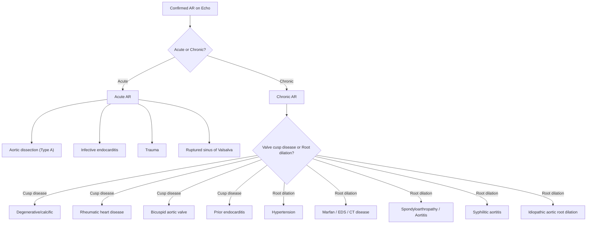
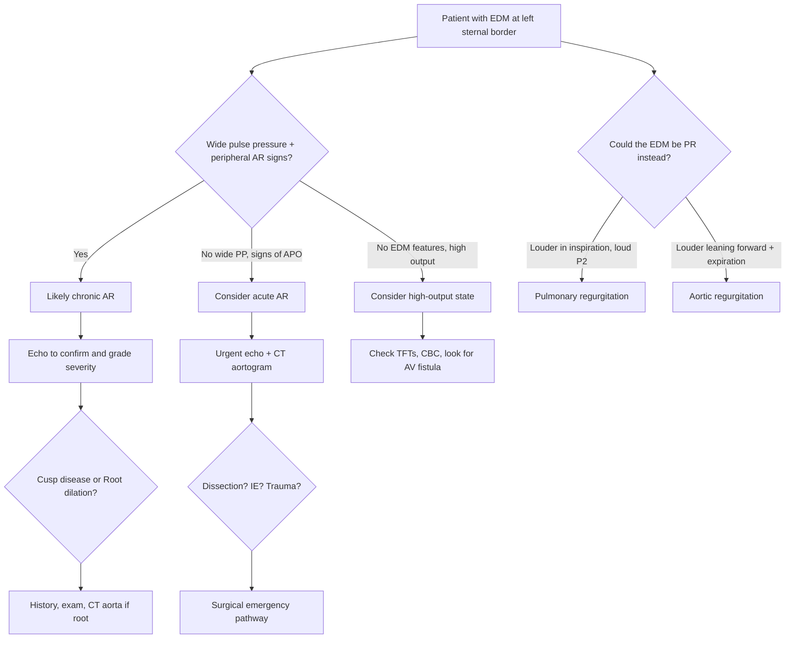

## Differential Diagnosis of Aortic Regurgitation

When you encounter a patient with features suggestive of AR — an early diastolic murmur, a collapsing pulse, wide pulse pressure, or signs of left ventricular volume overload — you need to think systematically. The differential diagnosis operates on **two levels**:

1. **What else could mimic the clinical presentation of AR?** (i.e., the DDx of the early diastolic murmur and the DDx of the wide pulse pressure / bounding pulse)
2. **What is the underlying cause of the AR itself?** (i.e., the aetiological DDx — already covered in detail in the prior section, but important to revisit here as a clinical reasoning exercise)

Let me walk you through both levels from first principles.

---

### Level 1: Differential Diagnosis of the Early Diastolic Murmur

The early diastolic murmur (EDM) is the cardinal auscultatory sign of AR. But it is **not pathognomonic** — other conditions can produce a similar-sounding murmur [4].

| Condition | Murmur Characteristics | How to Differentiate from AR |
|---|---|---|
| ***Pulmonary regurgitation (PR) — Graham-Steell murmur*** | ***High-pitched, early diastolic, decrescendo murmur at the left upper sternal border (pulmonic area)*** | ***Increases with inspiration*** (right-sided murmur → increased venous return during inspiration augments it). AR is ***accentuated by leaning forward with exhalation*** [4]. PR is typically ***associated with loud P₂*** (indicating pulmonary hypertension) and is most commonly secondary to severe pulmonary HTN from mitral stenosis or other causes. No wide pulse pressure or peripheral AR signs. |
| ***Combined AS/AR*** | Both an ejection systolic murmur (ESM) and an early diastolic murmur; ***murmur interrupted by S₂*** | ***Pulsus bisferiens*** (double-peaked carotid pulse) [1]. The pulse character depends on the dominant lesion — if AR dominant → collapsing; if AS dominant → slow-rising. Mixed features on echo [4]. |

> **Why does the Graham-Steell murmur increase with inspiration?** Inspiration increases negative intrathoracic pressure → increases venous return to the right heart → increases the volume of blood regurgitating through the incompetent pulmonary valve. This is the same principle that makes *all* right-sided murmurs louder on inspiration.

> **Why does the AR murmur increase when leaning forward in expiration?** Leaning forward brings the aortic root closer to the chest wall. Expiration reduces the air-filled lung tissue between the heart and stethoscope, improving sound transmission. Additionally, expiration slightly increases intrathoracic pressure, increasing aortic-LV gradient in early diastole [4].

### Level 2: Differential Diagnosis of the Wide Pulse Pressure / Hyperdynamic Circulation

The wide pulse pressure and bounding/collapsing pulse of chronic AR are distinctive, but **other conditions can produce a similar haemodynamic picture**. The key concept: any condition that either (a) markedly increases stroke volume, or (b) causes rapid diastolic arterial run-off, can mimic the peripheral signs of AR.

| Condition | Mechanism of Wide Pulse Pressure | Key Distinguishing Features |
|---|---|---|
| **Patent ductus arteriosus (PDA)** | Continuous L→R shunt from aorta to pulmonary artery → aortic run-off in both systole and diastole → low diastolic BP + high SV | ***Continuous "machinery" murmur*** (crescendo-decrescendo through S₂, not interrupted by S₂) [4]. ***Left parasternal heave*** (RV volume overload from pulmonary overcirculation). Collapsing pulse present. Usually in paediatric patients or young adults with unrepaired CHD. |
| **High-output states** | ↑↑ cardiac output → ↑SV → ↑systolic BP with relatively lower diastolic BP due to ↓SVR | No early diastolic murmur. Look for the underlying cause: **anaemia** (pallor, tachycardia), **thyrotoxicosis** (tremor, weight loss, heat intolerance, goitre, lid lag) [5], **Paget's disease** (bone pain, skull enlargement, ↑ALP), **pregnancy**, **arteriovenous fistula** (thrill/bruit over fistula), **beriberi** (wet — thiamine deficiency), **severe liver disease** (spider naevi, palmar erythema). |
| **Aortic dissection (Type A) with acute AR** | Dissection flap disrupts aortic root → acute AR. But also: tearing chest/back pain, asymmetric BP/pulses, widened mediastinum on CXR | ***Sudden onset, tearing pain radiating to back*** [1][6]. May have signs of malperfusion (stroke, limb ischaemia, mesenteric ischaemia). Acute AR signs — pulmonary oedema dominant, peripheral AR signs often absent. CT aortogram diagnostic. |
| **Significant arteriovenous fistula** | Continuous shunt from arterial to venous system → rapid arterial run-off → low diastolic BP, high SV | Palpable thrill / continuous bruit at fistula site (e.g., dialysis AV fistula, traumatic AV fistula). Branham's sign: compression of the fistula → reflex bradycardia (as peripheral resistance and BP are restored). |

### Level 3: DDx of the Austin-Flint Murmur vs. True Mitral Stenosis

This is a classic exam question. The ***Austin-Flint murmur*** of AR can closely mimic the mid-diastolic rumble of ***mitral stenosis (MS)*** [1][2][4].

| Feature | Austin-Flint Murmur (Functional MS from AR) | True Mitral Stenosis |
|---|---|---|
| **Mechanism** | ***AR jet impinges on anterior mitral leaflet → partial closure → functional obstruction to LA outflow → turbulent flow*** [1][2][4] | Organic fibrosis/calcification of mitral valve → fixed obstruction to LA emptying |
| **Opening snap** | **Absent** | **Present** (snap of rigid mitral leaflets opening) |
| **Pre-systolic accentuation** | ***Absent*** (the AR jet holds the leaflet partially closed throughout diastole, preventing the normal atrial kick from augmenting flow) [2][4] | **Present** in sinus rhythm (atrial contraction forces blood through stenosed valve → crescendo before S₁) |
| **S₁** | Soft (MV closing early due to elevated LVEDP) | **Loud** (rigid MV leaflets slam shut from a widely open position) |
| **Peripheral signs** | Wide pulse pressure, bounding pulse, peripheral AR signs | No wide pulse pressure; may have malar flush, AF |
| **Associated murmur** | ***Early diastolic murmur of AR*** | No EDM (unless coexistent AR) |
| **Echo** | Structurally normal MV; may see MV fluttering from the AR jet | Thickened, calcified, restricted MV leaflets; ↑transmitral gradient |

<Callout title="Austin-Flint vs. True MS — The Two Absent Features" type="idea">
If you hear a mid-diastolic rumble at the apex in a patient with AR, think Austin-Flint. The two features that are **absent** compared with true MS are: (1) **no opening snap** and (2) **no pre-systolic accentuation**. Also look for an **early diastolic murmur** — if present, the rumble is likely Austin-Flint secondary to AR rather than primary MS.
</Callout>

### Level 4: DDx of Chest Pain in a Patient with Known AR

Patients with AR can present with angina, and you need to consider whether the chest pain is from the AR itself or from a coexistent or alternative pathology [1][2][5].

| Diagnosis | Key Features / Mechanism |
|---|---|
| **Angina from AR** | ***↓ diastolic BP → ↓ coronary perfusion; LVH → ↑ O₂ demand. Characteristically worse at night (↓HR → longer diastole → more regurgitation)*** [1]. May occur without epicardial coronary disease. |
| **Coronary artery disease (CAD)** | Coexistent atherosclerotic CAD is common, especially in older patients with degenerative AR. Classical effort-related angina, risk factors for atherosclerosis. Coronary angiography may be needed pre-operatively [1]. |
| ***Aortic dissection*** | ***Type A dissection can cause acute AR + chest/back pain. Tearing, sudden onset, radiating to back. Asymmetric BP/pulses*** [1][6]. This is the critical "must-not-miss" diagnosis. |
| **Infective endocarditis** | AR valve is predisposed to IE. Fever, new/changing murmur, constitutional symptoms, peripheral stigmata (Janeway lesions, Osler nodes, splinter haemorrhages). Can cause acute worsening of AR via cusp destruction [1][2]. |
| **Pericarditis** | Sharp, pleuritic, positional chest pain (better sitting forward). Pericardial rub. Can coexist with aortic root pathology in connective tissue diseases. |

### Level 5: DDx of Dyspnoea in a Patient with AR

When a patient with AR presents with breathlessness, consider whether it is from progressive AR decompensation or an alternative/co-existing cause [1][6].

| Diagnosis | Distinguishing Features |
|---|---|
| **Decompensated AR (LV failure)** | Progressive exertional dyspnoea, orthopnoea, PND. Echo shows severe AR with ↑LVEDP, ↓LVEF, LV dilation. |
| **Mitral valve disease (coexistent)** | RHD often affects both aortic and mitral valves. Look for mid-diastolic rumble (MS) or pansystolic murmur (MR). Echo confirms. |
| **Pulmonary disease (COPD/asthma)** | Wheeze, productive cough, smoking history, obstructive pattern on spirometry. |
| **Pulmonary embolism** | Sudden onset dyspnoea, pleuritic pain, tachycardia, risk factors (immobility, DVT). |
| **Anaemia** | Can exacerbate symptoms of AR (↑demand state). Pallor, fatigue, ↑HR. Check CBC. |

---

### Systematic Approach to the Aetiological Differential

When you have confirmed AR (by echo), you then need to determine the **cause**. This is critical because management differs (e.g., urgent surgery for dissection vs. medical management for mild degenerative AR).

**Clinical clues to the aetiology:**

| Clue | Points Towards |
|---|---|
| ***Young patient, HK, with mitral valve disease*** | ***Rheumatic heart disease*** [1][2] |
| Male, systolic murmur also present, dilated ascending aorta | Bicuspid aortic valve |
| ***Marfanoid habitus (tall, arachnodactyly, lens subluxation)*** | ***Marfan syndrome*** [2] |
| ***Bamboo spine, reduced spinal mobility, enthesitis, HLA-B27+*** | ***Ankylosing spondylitis*** (SpA) — ***remember the "4 As": Apical fibrosis, Anterior uveitis, Aortic regurgitation, Achilles tendinitis*** [7] |
| ***Fever, new murmur, embolic phenomena*** | ***Infective endocarditis*** [1] |
| ***Sudden onset, tearing chest pain, asymmetric pulses*** | ***Aortic dissection*** [1][6] |
| ***Argyll-Robertson pupil, ascending aortic calcification*** | ***Syphilitic aortitis*** (tertiary syphilis) |
| Elderly, hypertension, atherosclerotic risk factors | Degenerative + hypertensive root dilation |
| Constitutional symptoms, ↓pulses, bruits, Asian female of reproductive age | Takayasu arteritis [3] |
| Elderly woman, temporal headache, jaw claudication, very high ESR | Giant cell arteritis (with aortitis) [3] |

<Callout title="The 4 As of Ankylosing Spondylitis" type="idea">
A favourite exam mnemonic: ***Apical fibrosis, Anterior uveitis, Aortic regurgitation, Achilles tendinitis*** [7]. If you see a young male with chronic back pain and an early diastolic murmur — think ankylosing spondylitis with associated aortitis.
</Callout>

---

### Summary Flowchart: Clinical Approach to the DDx of AR Presentation

---

<Callout title="High Yield Summary">

**DDx of Early Diastolic Murmur**: AR vs. PR (Graham-Steell murmur). AR louder leaning forward in expiration; PR louder in inspiration with loud P₂.

**DDx of Wide Pulse Pressure/Bounding Pulse**: AR, PDA (continuous machinery murmur), high-output states (anaemia, thyrotoxicosis, Paget's, AV fistula, pregnancy), aortic dissection with AR.

**Austin-Flint vs. True MS**: Austin-Flint has NO opening snap and NO pre-systolic accentuation. Always look for the EDM of AR.

**DDx of Chest Pain in AR**: AR-related angina (worse at night), coexistent CAD, aortic dissection (must-not-miss), IE, pericarditis.

**Aetiological DDx clues**: RHD (young, HK, mitral involvement), bicuspid AV (male, ESM also), Marfan (habitus), AS/SpA (4 As), IE (fever, embolic), dissection (tearing pain, asymmetric pulses), syphilis (Argyll-Robertson pupil).

**Always ask**: Is this acute or chronic AR? Acute AR = no wide PP, APO, emergency. Think dissection, IE, trauma.

</Callout>

---

<ActiveRecallQuiz
  title="Active Recall - DDx of Aortic Regurgitation"
  items={[
    {
      question: "How do you differentiate the early diastolic murmur of AR from that of pulmonary regurgitation (Graham-Steell murmur) at the bedside?",
      markscheme: "AR: best heard at left sternal border, accentuated by leaning forward in expiration. PR (Graham-Steell): best heard at left upper sternal border (pulmonic area), increases with inspiration, associated with loud P2 indicating pulmonary hypertension. AR has wide pulse pressure and peripheral signs; PR does not."
    },
    {
      question: "Name 3 features that distinguish the Austin-Flint murmur from true mitral stenosis.",
      markscheme: "(1) No opening snap in Austin-Flint (present in true MS). (2) No pre-systolic accentuation in Austin-Flint (present in MS with sinus rhythm). (3) Presence of an early diastolic murmur of AR in Austin-Flint. Also: S1 is soft in Austin-Flint but loud in MS."
    },
    {
      question: "A young male with chronic low back pain and morning stiffness is found to have an early diastolic murmur. What is the likely diagnosis and what mnemonic helps you recall the extra-articular features?",
      markscheme: "Ankylosing spondylitis (axial spondyloarthropathy) with aortic regurgitation from aortitis. Mnemonic: 4 As - Apical fibrosis, Anterior uveitis, Aortic regurgitation, Achilles tendinitis."
    },
    {
      question: "List 4 conditions other than AR that can cause a wide pulse pressure and bounding pulse.",
      markscheme: "Any 4 of: (1) Patent ductus arteriosus, (2) Thyrotoxicosis, (3) Severe anaemia, (4) AV fistula, (5) Pagets disease, (6) Pregnancy, (7) Wet beriberi, (8) Severe liver disease."
    },
    {
      question: "A patient with known chronic AR presents with sudden-onset tearing chest pain radiating to the back and new acute pulmonary oedema. What is the must-not-miss diagnosis and what investigation would you urgently request?",
      markscheme: "Type A aortic dissection causing acute-on-chronic AR. Urgent CT aortogram (CT angiography of the aorta). Also request bedside echo (pericardial effusion, worsening AR, RWMA). This is a surgical emergency."
    }
  ]}
/>

## References

[1] Senior notes: Maksim Medicine Notes.pdf (p5, p15, p18, p35 — Clinical approach, Aortic dissection, Heart failure, Valvular heart disease sections)
[2] Senior notes: Ryan Ho Cardiology.pdf (p54, p155, p158, p160 — Chest Pain, MR, AS, AR sections)
[3] Senior notes: Ryan Ho Rheumatology.pdf (p95–96 — Giant Cell Arteritis, Takayasu Arteritis sections)
[4] Senior notes: Ryan Ho Fundamentals.pdf (p36 — Diastolic Murmurs section)
[5] Senior notes: Ryan Ho Endocrine.pdf (p111 — Acromegaly section, re: high-output states)
[6] Senior notes: Maksim Medicine Notes.pdf (p15 — Aortic dissection section)
[7] Senior notes: Ryan Ho Rheumatology.pdf (p57, p60 — Spondyloarthritis, Ankylosing spondylitis sections)
