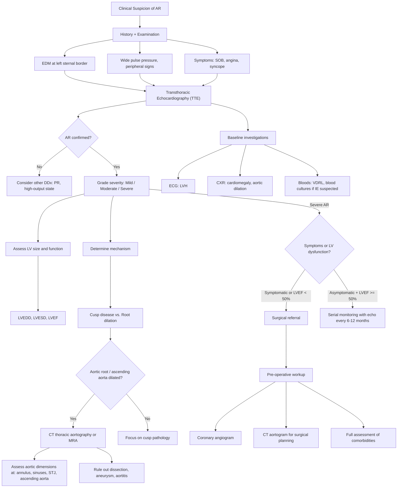

## Diagnostic Criteria, Algorithm and Investigations for Aortic Regurgitation

### Important Principle: AR is Not Diagnosed by "Criteria" — It is Diagnosed by Echocardiography

Unlike conditions such as infective endocarditis (Duke criteria) or rheumatic fever (Jones criteria), AR does not have a formal set of diagnostic criteria with sensitivity/specificity scores. Instead, the diagnosis rests on:

1. **Clinical suspicion** — history, examination (early diastolic murmur, wide pulse pressure, peripheral signs).
2. **Echocardiographic confirmation** — this is the gold standard. Echo tells you: (a) AR is present, (b) its severity (mild/moderate/severe), (c) the mechanism (cusp vs. root), (d) the impact on the LV (size, function), and (e) the aetiology.
3. **Additional investigations** — to determine the cause, assess the aorta, plan for surgery, and evaluate complications.

The key clinical question is not just "is there AR?" but "**is the AR severe enough to warrant intervention, and what is the cause?**"

---

### Echocardiographic Grading of AR Severity

This is the closest thing to "diagnostic criteria" for AR — the echocardiographic parameters used to grade severity per the 2020/2021 ACC/AHA and ESC 2021 guidelines.

#### Qualitative and Semi-Quantitative Parameters

| Parameter | Mild | Moderate | Severe |
|---|---|---|---|
| **Colour Doppler jet width / LVOT diameter** | < 25% | 25–64% | ≥ 65% |
| **Vena contracta width** (narrowest portion of the jet, mm) | < 3 | 3–6 | > 6 |
| **Diastolic flow reversal in descending aorta** | Brief, early diastolic | Intermediate | ***Holodiastolic*** (pan-diastolic reversal indicates severe AR — blood flowing backward throughout all of diastole) |
| **Pressure half-time** (ms) | > 500 | 200–500 | ***< 200*** (rapid equalization of aortic and LV pressures → severe leak) |

> **Why does pressure half-time shorten in severe AR?** Pressure half-time (PHT) measures how quickly the aortic-LV diastolic pressure gradient decays. In severe AR, there is a large regurgitant orifice → blood pours back into the LV rapidly → LV pressure rises quickly → the gradient between aorta and LV disappears fast → short PHT (< 200 ms). In mild AR, only a trickle leaks back → the gradient is maintained for longer → long PHT (> 500 ms).

#### Quantitative Parameters (PISA / Volumetric Method)

| Parameter | Mild | Moderate | Severe |
|---|---|---|---|
| **Regurgitant volume (mL/beat)** | < 30 | 30–59 | ***≥ 60*** |
| **Regurgitant fraction (%)** | < 30 | 30–49 | ***≥ 50*** |
| **Effective regurgitant orifice area (ERO, cm²)** | < 0.10 | 0.10–0.29 | ***≥ 0.30*** |

> **What is ERO?** The effective regurgitant orifice area is the cross-sectional area of the "hole" through which blood regurgitates. It is calculated using the PISA (proximal isovelocity surface area) method on Doppler echocardiography. A larger ERO = a bigger leak = more severe AR.

#### Supportive LV Parameters

| Parameter | Implication |
|---|---|
| ***LV end-diastolic diameter (LVEDD)*** | ***> 75 mm suggests chronic severe volume overload*** [1] |
| ***LV end-systolic diameter (LVESD)*** | ***> 55 mm → LV failing to compensate (indication for surgery even if asymptomatic)*** [1] |
| ***LVEF*** | ***< 50% indicates LV systolic dysfunction — another surgical trigger*** [1] |

<Callout title="Integrated Approach to Severity Grading">
No single echo parameter is sufficient. You must integrate **multiple parameters** — jet width, vena contracta, PHT, regurgitant volume/fraction, ERO, flow reversal, and LV dimensions. If parameters are discordant, err on the side of more detailed quantitative assessment (volumetric/PISA methods) and consider CMR.
</Callout>

---

### Diagnostic Algorithm

The diagnostic approach to AR proceeds in a structured manner: clinical suspicion → echocardiographic confirmation and grading → aetiological workup → assessment for surgical triggers.

---

### Investigation Modalities: Detailed Breakdown

#### 1. Electrocardiogram (ECG)

***ECG: LVH ± strain*** [1][2]

| Finding | Explanation (From First Principles) |
|---|---|
| **LV hypertrophy (LVH) voltage criteria** | Chronic volume overload → eccentric LV dilation + hypertrophy → greater LV muscle mass generates higher voltages. Sokolow-Lyon criteria: S in V1 + R in V5/V6 ≥ 35 mm. Cornell criteria: R in aVL + S in V3 > 28 mm (M) or > 20 mm (F). |
| **LV strain pattern** | ST depression + T-wave inversion in lateral leads (I, aVL, V5, V6). Reflects subendocardial ischaemia from increased wall stress and oxygen demand in the hypertrophied LV. |
| **Left axis deviation** | LV enlargement shifts the mean electrical axis leftward. |
| **Conduction abnormalities** | In advanced cases, LBBB may develop if the hypertrophied septum impinges on the left bundle branch, or if the aortic root pathology (e.g., calcification in bicuspid AV) extends into the conduction system. |
| **Initially normal** | ***In early/compensated AR, the ECG may be entirely normal*** [2]. Do not be falsely reassured by a normal ECG in a patient with clinical AR. |

> The ECG is **not diagnostic** for AR — it shows the *consequences* of AR on the LV. It is a baseline investigation that provides supporting evidence and helps exclude other pathology (e.g., AF, ischaemia).

#### 2. Chest X-ray (CXR)

***CXR: cardiomegaly*** [1], ***dilated aortic arch*** [2]

| Finding | Explanation |
|---|---|
| ***Cardiomegaly*** | LV dilation → enlarged cardiac silhouette with cardiothoracic ratio > 0.5. The apex is displaced downward and to the left, giving the classic "boot-shaped" heart (LV configuration). [1] |
| ***Dilated ascending aorta / aortic arch*** | If the AR is due to aortic root dilation (Marfan, HTN, etc.), the ascending aorta will be widened. Even in cusp disease, the chronically elevated SV can progressively dilate the ascending aorta. [2] |
| **Pulmonary congestion** | In decompensated AR: upper lobe pulmonary venous distension ("cephalization"), Kerley B lines (interstitial oedema), perihilar haziness (alveolar oedema), pleural effusions. Reflects elevated LVEDP transmitted backward. [1] |
| **Aortic valve calcification** | May be visible on a well-penetrated lateral CXR in degenerative or bicuspid AV disease. |

> ***The mid-portion of the ascending aorta is difficult to visualise by echocardiography*** [1] — this is why CXR (and more importantly CT) is essential for assessing aortic root and ascending aortic dimensions when root dilation is the mechanism of AR.

#### 3. Echocardiography (The Gold Standard)

***ECHO*** [1] — Transthoracic echocardiography (TTE) is the **cornerstone investigation** for AR. It answers three fundamental questions: (1) Is there AR, and how severe is it? (2) What is the mechanism? (3) What is the impact on the LV?

##### A. Assessment of AR Severity

| Modality | What It Shows | Key Findings |
|---|---|---|
| **2D Echo** | Valve morphology, cusp number, cusp motion, vegetations, flail leaflet, root dimensions | Bicuspid valve (two cusps with raphe), thickened/retracted cusps (RHD), vegetations (IE), aortic root dilation |
| **Colour-flow Doppler** | Regurgitant jet visualization | **Jet width relative to LVOT** — severe if ≥ 65% of LVOT width. Central jet (root dilation) vs. eccentric jet (cusp prolapse/perforation). |
| **Continuous-wave Doppler** | Pressure half-time, signal density | ***PHT < 200 ms = severe*** (rapid equalization). Dense CW Doppler signal = severe. |
| **Pulsed-wave Doppler** | Diastolic flow reversal in descending aorta | ***Holodiastolic reversal in the descending aorta = severe AR***. This is very specific and one of the most reliable parameters. |
| **PISA method** | ERO, regurgitant volume, regurgitant fraction | Quantitative: severe if ERO ≥ 0.30 cm², RVol ≥ 60 mL, RF ≥ 50%. |

##### B. Assessment of LV Size and Function

| Parameter | Significance | Why It Matters |
|---|---|---|
| ***LVEDD (end-diastolic diameter)*** | ***> 65 mm = significant dilation; > 75 mm = very dilated*** [1] | Reflects chronic volume overload. Part of surgical decision-making in asymptomatic patients. |
| ***LVESD (end-systolic diameter)*** | ***> 50 mm or > 25 mm/m² BSA = at risk; > 55 mm = surgical trigger*** [1] | LVESD is a better predictor of irreversible LV dysfunction than LVEDD because it reflects contractile reserve — a ventricle that remains large at end-systole is failing to empty adequately. |
| ***LVEF*** | ***< 50% = LV systolic dysfunction = surgical trigger even if asymptomatic*** [1] | EF may be "preserved" (> 50%) for a long time in AR because the dilated LV ejects a large total SV. An EF drop below 50% in severe AR is a late and ominous sign — the LV is decompensating. |
| **LV mass index** | Increased in LVH | Reflects the degree of eccentric remodelling. |

##### C. Assessment of the Aortic Root and Ascending Aorta

| Measurement | Normal | Significance |
|---|---|---|
| Aortic annulus diameter | ~23 mm (varies with BSA) | Dilation → central AR |
| Sinuses of Valsalva diameter | ~34 mm | Dilation in Marfan (annuloaortic ectasia) |
| Sinotubular junction diameter | ~30 mm | Dilation pulls cusps apart |
| ***Ascending aorta diameter*** | < 40 mm | ***> 50 mm → indication for surgery even in mild AR (to prevent dissection/rupture)*** [1] |

> ***The mid-portion of the ascending aorta is difficult to visualise by ECHO*** [1] — hence the importance of ***CT thorax*** for complete aortic assessment when root pathology is suspected.

##### D. Transesophageal Echocardiography (TEE)

***TEE*** is more sensitive than TTE for specific indications [1][8]:

| Indication for TEE | Reason |
|---|---|
| ***Suspected infective endocarditis*** | Better sensitivity for detecting vegetations, perivalvular abscesses, cusp perforations. TTE sensitivity ~60-70% vs. TEE ~95%. [8] |
| ***Aortic dissection*** | Visualises intimal flap, true/false lumen, proximal extent of dissection. However, CT aortogram is usually preferred for initial diagnosis [6]. |
| **Prosthetic valve AR** | TTE produces acoustic shadowing from the prosthesis → poor visualisation of regurgitant jets. TEE looks from behind (oesophagus) → avoids the prosthesis shadow. [8] |
| **Inadequate TTE windows** | Obesity, COPD, chest wall deformity → poor acoustic windows on TTE. |
| **Intraoperative guidance** | During valve repair/replacement to assess result. |

#### 4. CT Thoracic Aortography

***CT thorax*** [1] — Essential when echocardiography cannot fully visualise the aorta.

| Indication | What It Shows |
|---|---|
| ***Mid-ascending aorta assessment*** | ***ECHO blind spot — CT fills the gap*** [1]. Precise measurement of aortic dimensions at annulus, sinuses, STJ, and ascending aorta. |
| ***Aortic root aneurysm / dilation measurement*** | Accurate sizing for surgical planning. Critical for Marfan, bicuspid aortopathy, and any patient where root dimensions trigger surgery (> 50 mm, or > 45 mm in Marfan). |
| ***Aortic dissection*** | ***CT aortogram is the investigation of choice: true lumen traceable from normal aorta, compressed by false lumen*** [6]. |
| **Pre-operative planning** | 3D reconstruction for graft sizing, coronary anatomy relative to the annulus. |
| **Follow-up of known aortic dilation** | Serial measurements to track growth rate (> 5 mm/year = rapid expansion, consider surgery). |

> **CT vs. MRI for aortic assessment**: Both are excellent. CT is faster, more widely available, and preferred in acute settings (dissection). MRI avoids radiation and iodinated contrast, making it preferred for serial follow-up of young patients (e.g., Marfan). Both are superior to echo for the mid-ascending aorta.

#### 5. Cardiac MRI (CMR)

CMR is increasingly used when echo findings are equivocal or discordant:

| Role | Details |
|---|---|
| **Quantification of AR severity** | Measures regurgitant volume and fraction directly by comparing LV and RV stroke volumes (by volumetric analysis) or by phase-contrast flow mapping in the aorta. This is the most accurate non-invasive quantification method. |
| **LV volume and function** | CMR is the gold standard for LV volumes and EF — more accurate and reproducible than echo. Important for surgical decision-making in borderline cases. |
| **Aortic morphology** | Excellent for aortic root and ascending aorta dimensions. Preferred for serial follow-up in young patients (no radiation). |
| **Tissue characterisation** | Late gadolinium enhancement (LGE) can detect myocardial fibrosis — a marker of irreversible LV damage. Emerging evidence suggests LGE may help identify patients who have already developed irreversible LV injury despite preserved EF. |

#### 6. Coronary Angiogram

***Coronary angiogram*** [1]

| Indication | Reason |
|---|---|
| **Pre-operative assessment** | ***Before aortic valve surgery, coronary angiography is performed to detect coexistent CAD*** [1]. If significant coronary stenosis is found → simultaneous CABG + valve surgery. |
| **Age > 40 or with CAD risk factors** | Even in younger patients, if multiple risk factors are present, coronary assessment is warranted. |
| **Assessment of AR during catheterisation** | Aortography (injection of contrast into the aortic root) can demonstrate the AR jet visually and semi-quantitatively grade its severity (Sellers grade I-IV). However, this is now largely superseded by echocardiography. |

> **Why is coronary angiography needed before valve surgery?** Patients with severe AR, especially those with risk factors for atherosclerosis, frequently have coexistent CAD. If you replace the valve but leave a 90% LAD stenosis untreated, the patient may have a perioperative MI. Therefore, ***coronary angiography (or CT coronary angiography in lower-risk patients) is a routine part of the pre-operative workup*** [1].

#### 7. Blood Tests

***Blood: VDRL, blood culture (IE)*** [2]

| Test | Indication / Interpretation |
|---|---|
| ***VDRL / RPR + FTA-ABS*** | ***Screen for syphilis as a cause of aortitis*** [2]. VDRL/RPR are non-treponemal screening tests (cheap, sensitive but not specific); FTA-ABS is a confirmatory treponemal test. |
| ***Blood cultures (≥ 3 sets)*** | ***If IE is suspected (fever + new murmur + embolic phenomena)*** [2]. At least 3 sets from different sites to demonstrate persistent bacteraemia. |
| **BNP / NT-proBNP** | Elevated in heart failure from decompensated AR. Helps distinguish cardiac from non-cardiac dyspnoea. Not specific for AR. |
| **CBC** | Anaemia (may exacerbate AR symptoms), leucocytosis (infection/IE), normocytic normochromic anaemia of chronic disease (IE, SLE). |
| **ESR / CRP** | Elevated in IE, aortitis (GCA, Takayasu, spondyloarthropathy), SLE. |
| **RFT** | Baseline renal function (pre-operative, contrast nephropathy risk, cardiorenal syndrome). |
| **LFT** | Hepatic congestion in right heart failure (advanced decompensated AR → biventricular failure). |
| **HLA-B27** | If spondyloarthropathy-associated aortitis is suspected (young male, back pain, enthesitis). |
| **ANA, dsDNA, complement** | If SLE-related Libman-Sacks endocarditis is a consideration. |

#### 8. Exercise Testing

| Role | Details |
|---|---|
| **Assess exercise capacity in "asymptomatic" patients** | Some patients with severe AR unknowingly limit their activity. Exercise testing can unmask symptoms (dyspnoea, ↓BP response) and an abnormal LVEF response to exercise. |
| **Not routinely required** | If the patient is clearly symptomatic, exercise testing is unnecessary and potentially dangerous (as with AS) [1]. |
| **Prognostic value** | Failure to augment LVEF with exercise, or drop in BP, suggests impending decompensation. |

<Callout title="The Essential Investigations for AR — Think in Layers" type="idea">

**Layer 1 — Confirm and grade**: TTE (gold standard). If equivocal → CMR.

**Layer 2 — Assess the aorta**: CT aortography or MRA (especially when root dilation suspected; echo cannot visualise mid-ascending aorta well).

**Layer 3 — Determine cause**: VDRL (syphilis), blood cultures (IE), HLA-B27 (SpA), connective tissue disease workup (Marfan/EDS genetics), inflammatory markers (aortitis).

**Layer 4 — Pre-operative**: Coronary angiogram (coexistent CAD?), full bloods, pulmonary function, frailty assessment.

**Layer 5 — Baseline/monitor**: ECG (LVH, strain), CXR (cardiomegaly, pulmonary congestion), BNP.

</Callout>

---

### Key Diagnostic Pitfalls

<Callout title="Common Mistakes in AR Diagnosis" type="error">

1. **Missing acute AR**: The murmur is short and soft, peripheral signs are absent, the echo may show a normal-sized LV. The clue is acute pulmonary oedema with a new diastolic murmur → urgent echo.

2. **Over-relying on LVEF**: LVEF can remain "normal" (> 50%) for years in severe AR because the large total SV masks early contractile decline. By the time LVEF drops below 50%, significant irreversible myocardial damage may have occurred. This is why **LV dimensions (LVESD > 50 mm) and trends** are equally important.

3. **Forgetting to image the aorta**: If you confirm AR on echo but don't measure the ascending aorta, you may miss a 55 mm aneurysm that independently requires surgery. Always request CT or MRA if the aortic root/ascending aorta is dilated or not well visualised on TTE.

4. **Not doing blood cultures when fever + AR**: AR predisposes to IE. A "known" AR patient with fever must have blood cultures drawn before antibiotics.

</Callout>

---

### Summary Table: Investigation Modalities at a Glance

| Investigation | Key Findings in AR | Why It's Done |
|---|---|---|
| ***ECG*** | ***LVH ± strain pattern*** [1][2] | Baseline, assess LV remodelling consequences |
| ***CXR*** | ***Cardiomegaly, dilated aortic arch*** [1][2], pulmonary congestion | Baseline, assess aortic silhouette, pulmonary status |
| ***TTE*** | AR jet, severity grading, LV size/function, aortic root dimensions, valve morphology | ***Gold standard for diagnosis and severity*** |
| ***TEE*** | Vegetations, abscess, dissection flap, prosthetic valve assessment | When IE/dissection suspected or TTE inadequate |
| ***CT aortography*** | Aortic dimensions, dissection, aneurysm, calcification | ***Mid-ascending aorta (ECHO blind spot)*** [1], surgical planning |
| **CMR** | Regurgitant volume/fraction, LV volumes/EF, myocardial fibrosis | When echo findings equivocal, most accurate quantification |
| ***Coronary angiogram*** | Coronary artery disease assessment | ***Pre-operative workup*** [1] |
| ***Bloods (VDRL, cultures)*** | Syphilis, IE | ***Aetiological workup*** [2] |

---

<Callout title="High Yield Summary">

**There are no formal "diagnostic criteria" for AR** — diagnosis is clinical + echocardiographic.

**Echo is the gold standard**. Key severe AR parameters: jet/LVOT ≥ 65%, vena contracta > 6 mm, PHT < 200 ms, holodiastolic flow reversal in descending aorta, RVol ≥ 60 mL, RF ≥ 50%, ERO ≥ 0.30 cm².

**LV parameters that trigger surgery even in asymptomatic patients**: LVEF < 50%, LVESD > 50 mm (or > 25 mm/m²), LVEDD > 65 mm.

**Ascending aorta > 50 mm** (or > 45 mm in Marfan/bicuspid with risk factors) = indication for aortic surgery regardless of AR severity.

**CT aortography** fills the echo blind spot (mid-ascending aorta) and is essential when root pathology is suspected.

**Pre-operative coronary angiogram** is routine before valve surgery to detect coexistent CAD.

**Bloods for aetiology**: VDRL (syphilis), blood cultures ×3 sets (IE), HLA-B27 (SpA), inflammatory markers (aortitis).

**ECG**: LVH ± strain (may be normal early). **CXR**: cardiomegaly, dilated aortic knuckle, pulmonary congestion.

</Callout>

---

<ActiveRecallQuiz
  title="Active Recall - Diagnosis and Investigations for AR"
  items={[
    {
      question: "What is the gold standard investigation for diagnosing and grading aortic regurgitation? Name 4 echocardiographic parameters that indicate severe AR.",
      markscheme: "Gold standard: Transthoracic echocardiography (TTE). Severe AR parameters (any 4): (1) Jet width/LVOT ratio >= 65%, (2) Vena contracta > 6 mm, (3) Pressure half-time < 200 ms, (4) Holodiastolic flow reversal in descending aorta, (5) Regurgitant volume >= 60 mL/beat, (6) Regurgitant fraction >= 50%, (7) ERO >= 0.30 cm2."
    },
    {
      question: "Explain why pressure half-time shortens in severe AR.",
      markscheme: "In severe AR, a large regurgitant orifice allows rapid backflow of blood into the LV during diastole. This rapidly raises LV diastolic pressure, causing the aortic-LV pressure gradient to equalise quickly. Therefore the time for the gradient to halve (pressure half-time) is short (less than 200 ms). In mild AR, only a small leak occurs, the gradient is maintained longer, and PHT is long (greater than 500 ms)."
    },
    {
      question: "Why is CT aortography important in the workup of AR, and what limitation of echocardiography does it address?",
      markscheme: "The mid-portion of the ascending aorta is difficult to visualise by echocardiography (echo blind spot). CT aortography provides precise measurements of aortic dimensions at annulus, sinuses, STJ and ascending aorta. It is essential for detecting aortic root aneurysm, dissection, and for surgical planning. It also identifies patients who need surgery based on aortic size criteria (e.g. ascending aorta > 50 mm)."
    },
    {
      question: "List 3 LV parameters on echocardiography that serve as triggers for surgery in asymptomatic severe AR, and explain why LVESD is a better predictor of irreversible dysfunction than LVEDD.",
      markscheme: "Surgical triggers: (1) LVEF < 50%, (2) LVESD > 50 mm (or > 25 mm/m2), (3) LVEDD > 65 mm. LVESD is better because it reflects contractile reserve - a ventricle that remains large at end-systole is failing to empty adequately, indicating myocardial dysfunction, whereas LVEDD mainly reflects the degree of volume loading which can be well-compensated."
    },
    {
      question: "Why is coronary angiography routinely performed before aortic valve surgery?",
      markscheme: "To detect coexistent coronary artery disease. If significant coronary stenosis is found, simultaneous CABG can be performed alongside valve surgery. Missing untreated CAD risks perioperative MI. Indicated especially in patients over 40 or with atherosclerotic risk factors."
    },
    {
      question: "Name 3 blood tests you would order to investigate the aetiology of AR, and state what each test is looking for.",
      markscheme: "(1) VDRL/RPR (plus FTA-ABS) - screening for syphilitic aortitis. (2) Blood cultures x3 sets - looking for infective endocarditis if fever/embolic phenomena present. (3) HLA-B27 - if spondyloarthropathy-associated aortitis suspected (young male with inflammatory back pain). Other acceptable answers: ESR/CRP (aortitis), ANA/dsDNA (SLE/Libman-Sacks)."
    }
  ]}
/>

## References

[1] Senior notes: Maksim Medicine Notes.pdf (p6, p35, p37 — Investigations, Valvular heart disease, Terminologies and indications for surgery sections)
[2] Senior notes: Ryan Ho Cardiology.pdf (p160 — Aortic Regurgitation section)
[4] Senior notes: Ryan Ho Fundamentals.pdf (p35–36, p39 — Murmurs sections)
[6] Senior notes: Maksim Medicine Notes.pdf (p15 — Aortic dissection section)
[8] Senior notes: Maksim Medicine Notes.pdf (p6 — Echocardiography section)
