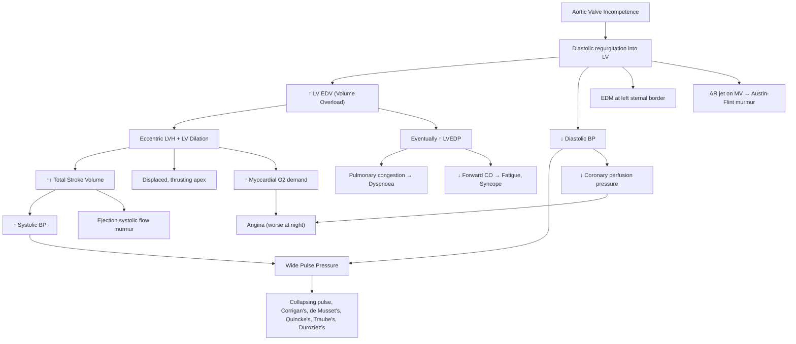

# Aortic Regurgitation (AR)

## Definition

Aortic regurgitation (AR) — also called aortic incompetence or aortic insufficiency — is the ***retrograde flow of blood from the aorta back into the left ventricle (LV) during diastole*** due to failure of the aortic valve to coapt properly. Breaking down the name: "aortic" = pertaining to the aorta; "regurgitation" = backward flow (Latin *re-* = back, *gurgitare* = to flood).

The fundamental problem is a **volume overload** on the LV. Unlike aortic stenosis (pressure overload), AR dumps extra blood back into the ventricle with every heartbeat, forcing it to handle both the normal venous return *plus* the regurgitant volume.

---

## Epidemiology

- **Prevalence**: Trace-to-mild AR is extremely common — detectable echocardiographically in up to 10% of the general adult population. Moderate-to-severe AR is far less common (~0.5–1%).
- **Sex**: More common in males (approximately 3:1 M:F for significant AR), partly because bicuspid aortic valve is more common in males [1].
- **Age distribution**: Depends on aetiology:
  - **Young adults**: Rheumatic heart disease (still the most common cause in Hong Kong and Asia), congenital bicuspid aortic valve.
  - **Middle-aged to elderly**: Degenerative (calcific) disease, aortic root dilatation from hypertension, connective tissue disorders.
- ***In Hong Kong***, rheumatic heart disease remains a significant cause of AR, though degenerative and bicuspid aetiologies are increasingly common as the population ages and rheumatic fever incidence declines [1][2].

---

## Anatomy and Function of the Aortic Valve

### Normal Aortic Valve Anatomy

The aortic valve sits at the junction of the left ventricular outflow tract (LVOT) and the ascending aorta, within the **aortic root**. Understanding its structure is essential because AR can arise from disease of the valve cusps *or* the root.

- **Three semilunar cusps** (right coronary, left coronary, and non-coronary cusps) — named for the coronary ostia that arise from the corresponding sinuses of Valsalva above them.
- **Annulus**: The fibrous ring to which the cusps attach; dilation of this ring → cusps cannot coapt → AR.
- **Sinuses of Valsalva**: Three outpouchings of the aortic root behind each cusp; they create space for cusp opening and house the coronary ostia.
- **Sinotubular junction (STJ)**: The transition from the sinuses to the tubular ascending aorta; dilation here also prevents cusp coaptation.
- **Commissures**: Where adjacent cusps meet; they are suspended at the level of the STJ.

### Normal Function

- During **systole**: LV pressure exceeds aortic pressure → cusps open → blood ejected into aorta.
- During **diastole**: Aortic pressure exceeds LV pressure → cusps fall back and coapt, sealing the outflow tract → no backward leak. The coronary arteries fill primarily in diastole because the cusps are closed and diastolic aortic pressure drives blood into the coronary ostia.

> **Why does diastolic coronary perfusion matter in AR?** In AR, diastolic aortic pressure drops (blood leaks back into the LV instead of staying in the aorta), reducing the driving pressure for coronary filling. This is a key mechanism of angina in AR.

---

## Aetiology

AR can be broadly divided into two categories based on the mechanism: **cusp (valvular) disease** and **aortic root/ascending aorta dilation** [1][2].

### A. Valvular (Cusp) Disease

| Aetiology | Mechanism / Notes |
|---|---|
| ***Degenerative (most common overall)*** | Calcification and fibrosis of cusps → retraction and poor coaptation. Increasingly dominant in ageing populations [1]. |
| ***Rheumatic heart disease (RHD)*** | Chronic rheumatic inflammation → fibrosis, thickening, and retraction of cusps ± commissural fusion. Often coexists with mitral valve disease. ***Still an important cause in Hong Kong and Asia*** [1][2]. |
| ***Congenital bicuspid aortic valve*** | Present in 1–2% of the population (M > F). Two cusps instead of three → unequal mechanical stress → premature degeneration, prolapse, or associated aortopathy → AR (and/or AS). Most common congenital cause [1][2]. |
| ***Infective endocarditis (IE)*** | Vegetation destruction, perforation, or rupture of cusps → acute or acute-on-chronic AR. Can be dramatic and rapidly progressive [1][2]. |
| Myxomatous degeneration | Prolapse of one or more cusps (uncommon compared with mitral valve prolapse). |
| ***Ruptured sinus of Valsalva aneurysm*** | Congenital weakness of the sinus wall → rupture into LV or RV → sudden AR ± L-to-R shunt [2]. |
| ***Trauma*** | Deceleration injury, blunt chest trauma → cusp avulsion or tear → acute AR [2]. |

### B. Aortic Root / Ascending Aorta Dilation (Supravalvular)

When the aortic root dilates, the annulus and STJ stretch apart → the cusps can no longer meet in the middle during diastole → central regurgitant jet.

| Aetiology | Mechanism / Notes |
|---|---|
| ***Hypertension*** | Chronic afterload → progressive aortic root dilation [1]. |
| ***Connective tissue disease: Marfan syndrome, Ehlers-Danlos syndrome (EDS)*** | Defective fibrillin-1 (Marfan) or collagen (EDS) → cystic medial degeneration → aortic root aneurysm and AR. Marfan classically causes annuloaortic ectasia [1][2]. |
| ***Aortic dissection (Type A)*** | Dissection flap disrupts aortic root geometry or detaches a commissure → ***acute severe AR*** — a surgical emergency [1][2]. |
| ***Syphilitic aortitis*** | Tertiary syphilis → vasa vasorum obliterative endarteritis → medial necrosis → ascending aortic dilation → AR. Now rare but historically important [1][2]. |
| ***Inflammatory aortitis: Ankylosing spondylitis (AS), Takayasu arteritis, Giant Cell Arteritis (GCA)*** | Chronic aortitis → fibrosis and dilation of aortic root [1][2][3]. |
| ***Osteogenesis imperfecta*** | Defective type I collagen → aortic root fragility and dilation. |
| Idiopathic aortic root dilation | Age-related dilation of the ascending aorta, particularly in hypertensive elderly patients. |

<Callout title="Acute vs. Chronic AR — Know the Causes" type="error">
Students commonly forget to distinguish **acute** from **chronic** causes:
- **Acute AR**: Aortic dissection (Type A), infective endocarditis, trauma, ruptured sinus of Valsalva. These are emergencies!
- **Chronic AR**: Degenerative, RHD, bicuspid AV, Marfan, HTN, syphilis.
The clinical picture is dramatically different because in acute AR the LV has no time to dilate and compensate.
</Callout>

---

## Pathophysiology

This is the crux of understanding AR. Every clinical feature flows from the pathophysiology.

### Chronic AR — The Compensated Phase

1. **Volume overload**: During diastole, blood leaks back from the aorta into the LV. The LV must now handle **normal venous return (preload) PLUS the regurgitant volume**.
2. **Eccentric LV hypertrophy (dilation)**: To accommodate the increased end-diastolic volume (EDV), the LV dilates. New sarcomeres are laid down *in series* (lengthening myocytes) → **eccentric hypertrophy**. This is in contrast to aortic stenosis, where concentric hypertrophy occurs (sarcomeres in parallel).
3. **Increased stroke volume (SV)**: By the Frank-Starling mechanism, the dilated LV ejects a much larger total SV (up to ***2–3× normal*** [2]) to maintain forward cardiac output despite the regurgitant fraction being "wasted."
4. ***LV EDV is increased but LV EDP (end-diastolic pressure) remains relatively normal*** initially — the LV is compliant because it has had time to remodel [2].
5. **Widened pulse pressure**: The large total SV raises systolic BP, while the regurgitant leak lowers diastolic BP → ***characteristic wide pulse pressure*** → all the eponymous peripheral signs (Corrigan's, de Musset's, Quincke's, etc.) [1][2].
6. **The "largest heart in cardiology"**: Chronic severe AR produces the most dilated LV of any valvular lesion (the so-called *cor bovinum* — "ox heart").

> **Why is the patient asymptomatic for so long?** Because the dilated, compliant LV maintains a normal forward cardiac output and normal filling pressures for years — even decades. Asymptomatic patients with severe AR develop symptoms or LV dysfunction at only ***~5% per year*** [2].

### Chronic AR — The Decompensated Phase

1. **Failing compliance**: Eventually, the LV can no longer dilate without raising filling pressures. ***LV EDP rises*** → transmitted backward → ***pulmonary congestion*** → dyspnoea.
2. **Reduced forward cardiac output**: The LV begins to fail → ***↓CO*** → fatigue, exercise intolerance.
3. **Further decline is rapid**: Once symptomatic or once LVEF falls, the ***mortality rate is 10–20% per year*** without intervention [2].

### Angina in AR — A Double Hit

AR causes angina through two simultaneous mechanisms [1][2]:

| Mechanism | Explanation |
|---|---|
| **↓ Coronary perfusion pressure** | Diastolic BP is low (blood leaks back into LV rather than staying in aorta to perfuse coronaries). Coronary perfusion pressure ≈ diastolic aortic pressure − LV end-diastolic pressure; *both* are working against you in AR. |
| **↑ Myocardial oxygen demand** | The dilated, hypertrophied LV has a greater muscle mass and increased wall stress (LaPlace's law: wall stress ∝ pressure × radius / wall thickness), so it needs more O₂. |

> ***Angina in AR is characteristically worse at night*** [1]. Why? During sleep, heart rate drops → longer diastole → more time for regurgitation per beat → more volume overload, lower diastolic BP, and worse coronary perfusion.

### Acute AR — No Time to Compensate

In acute AR (e.g., ***aortic dissection, IE, trauma***), the LV is of normal size and compliance. A sudden large regurgitant volume floods a non-dilated, non-compliant LV → ***dramatic rise in LV end-diastolic pressure*** → immediately transmitted to the pulmonary veins → ***acute pulmonary oedema***.

Key differences from chronic AR:

| Feature | Chronic AR | Acute AR |
|---|---|---|
| LV size | Massively dilated | Normal |
| LV compliance | Increased (compensated) | Normal (non-compliant) |
| LVEDP | Normal → late ↑ | Acutely very high |
| SV | ↑↑ | Not increased (cannot dilate) |
| Pulse pressure | Wide (bounding pulse) | May be near normal or only mildly wide |
| Clinical picture | Asymptomatic → gradual HF | ***Acute pulmonary oedema*** — surgical emergency [2] |
| Peripheral AR signs | Present | ***Absent or minimal*** ("classical signs may be absent" [2]) |
| Mitral valve | Normal opening | ***Early (premature) MV closure*** — LVEDP exceeds LA pressure before atrial systole even starts [2] |

<Callout title="Acute AR is a Surgical Emergency">
If a patient presents with acute pulmonary oedema and a new early diastolic murmur — think acute AR (dissection, IE, trauma). The classic peripheral signs of chronic AR (bounding pulse, wide pulse pressure) will be **absent** because the LV has not had time to dilate. This is one of the most commonly missed diagnoses. Urgent echocardiography and likely urgent surgery are needed.
</Callout>

---

## Classification

### By Chronicity
- **Acute AR**: Sudden onset, non-dilated LV, presents as acute pulmonary oedema / cardiogenic shock.
- **Chronic AR**: Gradual onset, compensatory LV dilation, long asymptomatic phase before decompensation.

### By Mechanism (Carpentier-like for Aortic Valve)
- **Type 1 — Normal cusp motion, but defective coaptation due to root/annular dilation**: e.g., Marfan, HTN, aortitis.
- **Type 2 — Cusp prolapse (excessive motion)**: e.g., bicuspid AV with prolapsing raphe, myxomatous degeneration, IE with flail cusp.
- **Type 3 — Cusp restriction (reduced motion)**: e.g., rheumatic fibrosis/retraction, calcific degeneration.

### By Severity (Echocardiographic — 2020/2021 ACC/AHA Guidelines)

| Parameter | Mild | Moderate | Severe |
|---|---|---|---|
| Jet width / LVOT width | < 25% | 25–64% | ≥ 65% |
| Vena contracta (mm) | < 3 | 3–6 | > 6 |
| Regurgitant volume (mL/beat) | < 30 | 30–59 | ≥ 60 |
| Regurgitant fraction (%) | < 30 | 30–49 | ≥ 50 |
| ERO (cm²) | < 0.10 | 0.10–0.29 | ≥ 0.30 |
| Pressure half-time (ms) | > 500 | 200–500 | < 200 (rapid equalization) |
| LV size | Normal | Normal or dilated | Usually dilated |

*ERO = effective regurgitant orifice*

---

## Clinical Features

### Symptoms

Every symptom links back to the pathophysiology outlined above.

#### A. Chronic Compensated AR

| Symptom | Pathophysiological Basis |
|---|---|
| ***Awareness of heartbeat / palpitations*** | ***↑SV → hyperdynamic circulation → patient feels forceful, bounding heartbeats***, especially when lying on the left side (LV closer to chest wall) [2]. |
| Generally **asymptomatic** | Compensatory LV dilation maintains forward CO and normal filling pressures for years. |

#### B. Chronic Decompensating / Decompensated AR

| Symptom | Pathophysiological Basis |
|---|---|
| ***Exertional dyspnoea (SOB)*** [1] | ↑LVEDP → pulmonary venous congestion → interstitial/alveolar oedema → ↓gas exchange → breathlessness. |
| ***Fatigue*** [1] | ↓ forward CO → inadequate tissue perfusion → fatigue and exercise intolerance. |
| Orthopnoea, PND | Progressive LV failure → pulmonary congestion worsened by recumbency (↑venous return). |
| ***Chest pain (angina)*** [1] | Dual mechanism: (1) ↓diastolic BP → ↓coronary perfusion pressure; (2) LVH + dilation → ↑myocardial O₂ demand. ***Worse at night*** due to ↓HR → longer diastole → more regurgitation [1]. |
| ***Syncope*** | ↓ forward CO (decompensated) → inadequate cerebral perfusion, especially on exertion. Less common than in AS [2]. |

#### C. Acute AR

| Symptom | Pathophysiological Basis |
|---|---|
| ***Acute severe dyspnoea / respiratory distress*** | Non-dilated LV → sudden ↑LVEDP → ***acute pulmonary oedema*** [2]. |
| Chest pain | May be from the underlying cause (e.g., aortic dissection — tearing, radiating to back) or from acute myocardial ischaemia (sudden drop in diastolic perfusion). |
| Collapse / cardiogenic shock | Sudden ↓forward CO + acute LV failure → hypotension, tachycardia, altered consciousness. |

### Signs

#### General Inspection and Peripheral Signs

The famous eponymous signs of AR are all consequences of the ***wide pulse pressure*** (high SV raises systolic BP, regurgitant leak drops diastolic BP). They are present in **chronic AR** but ***may be absent in acute AR*** [2].

| Sign | Description | Mechanism |
|---|---|---|
| **Wide pulse pressure** | > 50 mmHg; SBP elevated, DBP low (sometimes < 50 mmHg) | ↑SV → ↑SBP; diastolic leak → ↓DBP [1][2]. |
| **Collapsing (water-hammer) pulse** | Rapidly rising, bounding pulse that collapses quickly; best felt by lifting the patient's arm above the heart | Rapid run-off of blood back into LV in diastole → abrupt drop in arterial pressure after systole [2]. |
| ***Corrigan's sign*** | ***Visible carotid pulsation*** | ***Exaggerated SV → forceful systolic distension of carotid arteries*** [1]. |
| ***De Musset's sign*** | ***Head bobbing with each heartbeat*** | ***↑SV → transfer of momentum to head/neck*** [2]. |
| ***Quincke's pulse (sign)*** | ***Capillary pulsation in fingertips or nail beds (alternate flushing and blanching)*** | ***Wide pulse pressure transmitted to capillary bed*** [2]. |
| ***Traube's sign*** | ***"Pistol-shot" systolic and diastolic sounds heard over large arteries (e.g., femoral)*** | ***Rapid systolic distension and diastolic collapse of large arteries*** [2]. |
| ***Duroziez sign*** | ***To-and-fro murmur over the femoral artery when gentle pressure applied with stethoscope*** | ***Forward systolic flow + backward diastolic flow in femoral artery due to regurgitant leak*** [2]. |
| ***Pulsus bisferiens*** | ***A double-peaked pulse in the carotid*** | ***Observed in mixed aortic valve lesions (combined AS + AR)*** — the percussion wave and tidal wave become palpable [1]. |
| Lighthouse sign (Landolfi sign) | Alternating constriction and dilation of the pupil with each heartbeat | Wide pulse pressure transmitted to iris vasculature (rare, exam trivia). |
| Mueller's sign | Visible pulsation of the uvula | Wide pulse pressure transmitted to palatal vessels. |
| Hill's sign | Popliteal SBP exceeds brachial SBP by > 20 mmHg (normally ≤ 10 mmHg difference) | Augmented pulse pressure in lower limbs. A difference > 60 mmHg suggests severe AR. |

<Callout title="Eponymous Signs — Why So Many?">
AR was recognised clinically long before echocardiography existed, so clinicians devised many bedside manoeuvres to assess severity. You don't need to memorise every one, but know the mechanism: **all are manifestations of widened pulse pressure from a high SV and low diastolic pressure**. For exams, the key ones are Corrigan's sign, collapsing pulse, de Musset's, Quincke's, Traube's, and Duroziez's.
</Callout>

#### Precordial Examination

| Sign | Description | Mechanism |
|---|---|---|
| ***Displaced, thrusting (volume-loaded) apex beat*** | Apex displaced downward and laterally, often to the anterior axillary line in severe cases | ***LV dilation (eccentric hypertrophy)*** — the LV enlarges to accommodate the increased EDV [2]. |
| Hyperdynamic precordium | Vigorous cardiac impulse | ↑SV |

#### Auscultation

| Finding | Description | Mechanism |
|---|---|---|
| ***Early diastolic murmur (EDM)*** | ***High-pitched, decrescendo, blowing murmur beginning immediately after A₂ (S2)*** | Blood regurgitates from aorta → LV during diastole; loudest at the start (when aortic-LV pressure gradient is maximal) and fades as pressures equalize [2][4]. |
| ***Best heard at the left sternal border (tricuspid area)*** [2] | Patient ***sitting up, leaning forward, in full expiration*** | Brings the aortic root closer to the chest wall; expiration reduces lung volume between stethoscope and heart [4]. |
| ***Ejection systolic murmur (ESM)*** | Often present, can be loud | ***↑SV causes relative functional aortic stenosis*** even without structural stenosis (flow murmur) [2]. This can be confused with true AS in mixed lesions. |
| ***Austin-Flint murmur*** | ***Mid-diastolic, low-pitched, rumbling murmur at the apex, WITHOUT pre-systolic accentuation*** | ***The AR regurgitant jet impinges on the anterior leaflet of the mitral valve → partially closes it → creates functional mitral stenosis*** [1][2][4]. Distinguishing from true MS: no opening snap, no pre-systolic accentuation (the jet holds the leaflet partially closed throughout diastole). |
| S₃ (third heart sound) | Low-pitched sound in early diastole | Rapid LV filling into a volume-overloaded, dilated LV — indicates decompensation in chronic AR [1]. |
| Soft or absent A₂ | Diminished aortic closure sound | If cusps are destroyed/calcified, they cannot produce a crisp closure sound. |

#### Signs of Severity of AR [1]

These are high-yield for exams — they tell you the AR is haemodynamically significant:

| Sign of Severity | Explanation |
|---|---|
| ***Wide pulse pressure*** | The wider the pulse pressure, the more regurgitant volume [1]. |
| ***Long duration of diastolic murmur (may be holodiastolic)*** | In mild AR, the murmur is short (early diastolic). In severe AR, the pressure gradient persists throughout diastole → the murmur occupies more of diastole [1]. Paradoxically, in very severe acute AR, the murmur may become shorter and softer (rapid pressure equalization). |
| ***S₃*** | Indicates volume overload and LV decompensation [1]. |
| ***Austin-Flint murmur*** | Indicates a large regurgitant jet impacting the mitral valve → severe AR [1]. |
| ***Pulmonary hypertension*** | Elevated LVEDP → pulmonary venous hypertension → pulmonary arterial hypertension [1]. |
| ***Pulmonary congestion (CXR findings)*** | Reflects elevated filling pressures [1]. |
| Displaced apex | Greater LV dilation = more severe volume overload. |
| Short pressure half-time on echo (< 200 ms) | Rapid equalization of aortic and LV diastolic pressures → severe AR. |
| Diastolic flow reversal in the descending aorta | Holodiastolic flow reversal on Doppler indicates severe AR. |

<Callout title="The Paradox of Acute Severe AR Murmur" type="error">
In acute severe AR, the early diastolic murmur may actually be **soft and short** — not loud and long. Why? Because LVEDP rises so quickly in the non-compliant LV that the aortic-LV pressure gradient equalizes rapidly → the murmur is cut short. Don't be falsely reassured by a quiet murmur in an acutely unwell patient with pulmonary oedema!
</Callout>

#### Signs Specific to the Underlying Cause

| Finding | Suggests |
|---|---|
| Fever + new murmur + splinter haemorrhages / Janeway lesions / Osler nodes | Infective endocarditis |
| Marfanoid habitus (tall, arachnodactyly, pectus excavatum, lens subluxation) | Marfan syndrome |
| BP asymmetry, tearing chest/back pain, radial-radial delay | Aortic dissection |
| Ankylosing spondylitis features (bamboo spine, ↓spinal mobility, question-mark posture) | Spondyloarthropathy-related aortitis |
| Argyll-Robertson pupils (accommodation but not to light) | Tertiary syphilis |

---

## Summary of Pathophysiology → Clinical Features Linkage

---

<Callout title="High Yield Summary">

**Definition**: Retrograde diastolic flow from aorta → LV due to aortic valve incompetence.

**Key Aetiologies** (Think: Valve vs. Root):
- *Valve*: Degenerative (MC overall), RHD (MC in young/HK), bicuspid AV, IE, trauma, ruptured sinus of Valsalva.
- *Root dilation*: HTN, Marfan/EDS, aortic dissection, syphilitic aortitis, spondyloarthropathy.
- *Acute AR*: Dissection (Type A), IE, trauma — surgical emergencies!

**Pathophysiology — Chronic**:
- Volume overload → eccentric LV dilation → ↑SV (2–3×) → wide pulse pressure → all peripheral signs.
- LVEDP initially normal (compensated) → eventually rises → pulmonary congestion → LV failure.
- Angina: ↓DBP (↓coronary perfusion) + ↑O₂ demand (LVH), worse at night (↓HR → longer diastole).

**Pathophysiology — Acute**:
- Non-dilated LV → sudden ↑LVEDP → acute pulmonary oedema. No wide pulse pressure. No peripheral signs. Emergency!

**Signs of Severity**: Wide PP, long EDM (holodiastolic), S₃, Austin-Flint murmur, pulmonary HTN, pulmonary congestion, displaced apex.

**Eponymous Signs**: All due to wide pulse pressure — Corrigan's (visible carotid pulsation), de Musset's (head bobbing), Quincke's (nail-bed capillary pulsation), Traube's (pistol shots over arteries), Duroziez's (to-and-fro femoral murmur).

**Austin-Flint murmur**: AR jet impinges on anterior mitral leaflet → functional MS → mid-diastolic rumble at apex WITHOUT pre-systolic accentuation.

**Pulsus bisferiens**: Double-peaked pulse — mixed aortic valve disease (AS + AR).

</Callout>

---

<ActiveRecallQuiz
  title="Active Recall - Aortic Regurgitation (Definition to Clinical Features)"
  items={[
    {
      question: "Explain why angina in AR is characteristically worse at night.",
      markscheme: "At night, heart rate drops leading to longer diastole. Longer diastole means more time for aortic regurgitation per beat, which further lowers diastolic BP (reducing coronary perfusion pressure) and increases LV volume overload (increasing myocardial O2 demand)."
    },
    {
      question: "Why are the classic peripheral signs of AR (e.g., collapsing pulse, wide pulse pressure) typically absent in acute AR?",
      markscheme: "In acute AR, the LV has not had time to dilate and increase stroke volume. Without the compensatory increase in SV, systolic BP does not rise significantly and the pulse pressure is not widened. The predominant presentation is acute pulmonary oedema from sudden rise in LVEDP in a non-compliant LV."
    },
    {
      question: "What is the Austin-Flint murmur? Describe its mechanism and how to distinguish it from true mitral stenosis.",
      markscheme: "A mid-diastolic, low-pitched rumbling murmur heard at the apex caused by the AR regurgitant jet impinging on the anterior mitral valve leaflet, creating functional mitral stenosis. Distinguished from true MS by: (1) no opening snap, (2) no pre-systolic accentuation."
    },
    {
      question: "List the echocardiographic parameters that define severe AR (at least 4).",
      markscheme: "Any 4 of: Jet width/LVOT ratio >=65%, vena contracta >6mm, regurgitant volume >=60 mL/beat, regurgitant fraction >=50%, ERO >=0.30 cm2, pressure half-time <200 ms, holodiastolic flow reversal in descending aorta."
    },
    {
      question: "Contrast the LV remodelling in chronic AR (volume overload) versus chronic AS (pressure overload).",
      markscheme: "Chronic AR causes eccentric hypertrophy - sarcomeres added in series leading to LV dilation with a displaced thrusting apex. Chronic AS causes concentric hypertrophy - sarcomeres added in parallel leading to wall thickening without significant dilation, with a sustained heaving non-displaced apex."
    },
    {
      question: "Name 3 causes of acute AR and explain why it is a surgical emergency.",
      markscheme: "Causes: (1) Aortic dissection (Type A), (2) Infective endocarditis with cusp destruction, (3) Trauma. It is a surgical emergency because the non-dilated LV cannot accommodate the sudden regurgitant volume, leading to acute rise in LVEDP, acute pulmonary oedema, and cardiogenic shock with high mortality without intervention."
    }
  ]}
/>

---

## References

[1] Senior notes: Maksim Medicine Notes.pdf (p35, p37, p15 — Valvular heart disease, Infective endocarditis, Aortic dissection sections)
[2] Senior notes: Ryan Ho Cardiology.pdf (p155–160, p221–222 — Aortic Valve Diseases, Aortic Regurgitation, Aortic Dissection and Aneurysms sections)
[3] Senior notes: Ryan Ho Rheumatology.pdf (p95–96 — Giant Cell Arteritis, Takayasu Arteritis sections)
[4] Senior notes: Ryan Ho Fundamentals.pdf (p36 — Diastolic Murmurs section)
