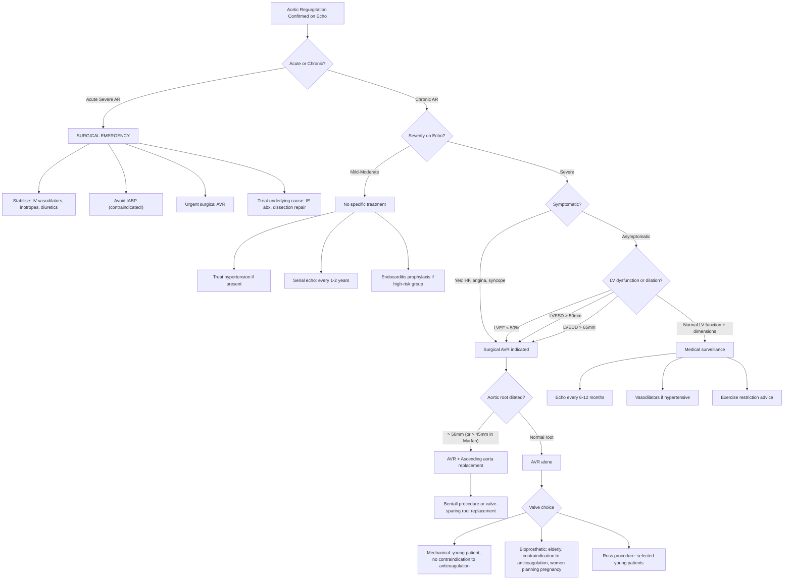

## Management of Aortic Regurgitation

### Guiding Principles

Before diving into specific treatments, understand the three core principles that drive all management decisions in AR:

1. **Timing is everything**: The natural history of chronic severe AR is a long compensated phase (years to decades) followed by a relatively rapid decompensation. The goal is to intervene surgically ***before irreversible LV damage occurs*** — but not so early that you expose a well-compensated patient to unnecessary surgical risk.

2. **Medical therapy cannot fix the valve**: Unlike heart failure from cardiomyopathy where drugs are the mainstay, in AR the fundamental problem is a mechanical valve defect. ***Medical therapy is supportive*** (managing symptoms, controlling blood pressure) but ***cannot reverse the regurgitation or prevent progression***. Definitive treatment is surgical [1][2].

3. **Acute AR ≠ Chronic AR**: Acute severe AR is a surgical emergency. There is essentially no role for prolonged medical optimisation — the patient needs the valve fixed or replaced urgently [2].

---

### Management Algorithm

---

### A. Medical Management

Medical therapy in AR is **supportive, not curative**. Its role is to: (1) manage blood pressure, (2) reduce symptoms of heart failure, and (3) bridge patients to surgery if needed.

#### 1. Vasodilators for Hypertension

***Vasodilators for HT: ACEI/ARB/CCB*** [1]

| Drug Class | Mechanism in AR | When to Use | Notes |
|---|---|---|---|
| ***ACEI (e.g., ramipril, perindopril)*** | Inhibits angiotensin-converting enzyme → ↓angiotensin II → ↓afterload (arteriolar dilation) + ↓aldosterone → ↓preload. In AR: ***↓afterload reduces the diastolic aortic-LV pressure gradient → reduces regurgitant volume → reduces volume overload on LV*** | ***Hypertension (SBP > 140 mmHg) in chronic AR*** [2]. Also for symptomatic HF or LV dysfunction ***if surgery is not contemplated*** [2] | First-line for HT in AR. Also provide neurohormonal blockade (RAAS inhibition) beneficial in LV remodelling. |
| ***ARB (e.g., losartan, valsartan)*** | Same pathway but blocks AT1 receptor directly | Alternative to ACEI if ACEI-intolerant (e.g., cough). | Equivalent efficacy to ACEI in afterload reduction. |
| ***DHP CCB (e.g., nifedipine, amlodipine)*** | Dihydropyridine calcium channel blockers → arterial vasodilation → ***↓afterload*** | ***Hypertension in AR*** [1][2]. Historically, nifedipine was studied specifically in AR. | ***DHP CCBs (dihydropyridine)*** are the appropriate subclass — they are predominantly vasodilatory. Non-DHP CCBs (verapamil, diltiazem) are rate-limiting and should generally be avoided (see below). |

> **Why does afterload reduction help in AR?** Think of it from first principles: in AR, blood can either go forward into the systemic circulation or backward through the leaky valve into the LV. This is a competition between two pathways. If you ***reduce systemic vascular resistance (afterload)***, you make it "easier" for blood to go forward → proportionally less blood regurgitates backward → ↓regurgitant fraction → ↓LV volume overload.

<Callout title="Vasodilators Are NOT Indicated in Asymptomatic Normotensive Patients">
A common misconception: "all patients with AR should be on vasodilators." **Wrong.** Current guidelines (ESC 2021, ACC/AHA 2020) recommend vasodilators ***only if the patient has hypertension*** (SBP > 140 mmHg) or ***symptomatic HF when surgery is not feasible***. There is no proven benefit of vasodilators in asymptomatic, normotensive patients with severe AR — they do not delay the need for surgery [2].
</Callout>

#### 2. Diuretics

***Diuretics*** [1]

| Drug | Mechanism | When to Use |
|---|---|---|
| **Loop diuretics (furosemide/frusemide)** | Inhibit Na-K-2Cl cotransporter in thick ascending limb of loop of Henle → ↓Na and water reabsorption → ↓intravascular volume → ***↓preload → ↓pulmonary congestion*** | Symptomatic HF with pulmonary congestion (dyspnoea, orthopnoea, PND, peripheral oedema) [1]. |
| **Thiazides (hydrochlorothiazide, indapamide)** | Inhibit Na-Cl cotransporter in distal convoluted tubule → milder diuresis + vasodilation | Add-on for refractory fluid overload, or for blood pressure control. |
| **Aldosterone antagonists (spironolactone, eplerenone)** | Block aldosterone in collecting duct → K-sparing diuresis; also inhibit myocardial fibrosis | Symptomatic HF with reduced EF. Proven mortality benefit in HFrEF (RALES trial). |

> Diuretics provide ***symptomatic relief*** by reducing pulmonary and systemic congestion, but they do not alter the natural history of AR. They are a bridge — if the patient needs diuretics for AR-related HF, they likely need surgery.

#### 3. Beta-Blockers — A Nuanced Agent in AR

***ACEI/ARB + BB for symptomatic or LV dysfunction if surgery is not contemplated*** [2]

| Consideration | Explanation |
|---|---|
| **Potential benefit** | In decompensated AR with LV systolic dysfunction (reduced EF), beta-blockers provide the same neurohormonal benefits as in any HFrEF (↓HR → ↓myocardial O₂ demand, ↓sympathetic activation, ↓remodelling). |
| ***Potential harm*** | ***BB can worsen regurgitant fraction due to prolonged diastolic time*** [2]. Slower HR → longer diastole → more time for blood to regurgitate back into the LV per cardiac cycle → ↑regurgitant volume per beat. |
| **Net effect** | In **compensated** AR, the negative effect (↑regurgitation from slower HR) may outweigh the benefit. In **decompensated** AR with significant HFrEF and tachycardia, the benefit of rate control and neurohormonal blockade generally outweighs the risk — but use cautiously and monitor. |
| **Practical approach** | Use beta-blockers in AR only when: (1) there is clear HFrEF and surgery is not planned/possible, (2) there is a coexistent indication (e.g., AF rate control, post-MI), (3) Marfan syndrome (to slow aortic root dilation — but this is for the aortopathy, not the AR per se). |

<Callout title="BB in AR vs. AS — Different Logic" type="error">
In **aortic stenosis**, beta-blockers are generally avoided because they ↓contractility in a pressure-overloaded LV and can precipitate decompensation. In **aortic regurgitation**, the concern is different: ***BB prolongs diastole → more regurgitant time → worse volume overload*** [2]. Different valve lesion, different mechanism of harm, but both warrant caution.
</Callout>

#### 4. Drugs to AVOID in Chronic AR

| Drug | Why Avoid |
|---|---|
| **Intra-aortic balloon pump (IABP)** | ***Absolutely contraindicated in AR***. The IABP inflates in diastole to augment coronary perfusion and deflates in systole to reduce afterload. In AR, diastolic inflation ***increases aortic diastolic pressure → drives MORE blood back through the incompetent valve → catastrophic worsening of AR***. |
| **Non-DHP CCB (verapamil, diltiazem)** | Negative chronotropic and inotropic effects → ↓HR (→ more regurgitation time) and ↓contractility (→ worse forward output). Use DHP CCBs instead. |
| **Excessive preload reduction** | While diuretics help with congestion, over-diuresis can ↓preload excessively → in AR the LV depends on a high EDV (Frank-Starling) to maintain forward CO → excessive preload reduction → ↓CO → cardiogenic shock. |

<Callout title="IABP is CONTRAINDICATED in AR" type="error">
This is a classic exam question. The IABP augments diastolic aortic pressure — which is exactly what you do NOT want in AR because it drives more blood backward through the leaky valve. In acute severe AR with cardiogenic shock, use IV vasodilators (nitroprusside) + inotropes instead.
</Callout>

---

### B. Surgical Management — Aortic Valve Replacement (AVR)

***Valvular replacement*** [1] — ***Surgical AVR: majority of AV cannot be repaired (cf MR)*** [2]

#### Why Repair is Rarely Possible for the Aortic Valve

Unlike the mitral valve (where repair is often preferred and technically feasible), the aortic valve is a much more demanding structure to repair. The three cusps must coapt perfectly under high diastolic pressures, and any imperfection → residual AR. However, in select centres with expertise, aortic valve repair is increasingly performed for:
- Bicuspid aortic valve with cusp prolapse
- Root dilation with normal cusps (valve-sparing root replacement — David or Yacoob procedures)
- Cusp perforation from IE (pericardial patch repair)

For the majority of patients, ***aortic valve replacement*** remains the standard surgical treatment [2].

#### Indications for Surgery

These are critical for exams. The indications follow a logical framework: **symptoms, LV dysfunction, LV dilation, aortic root disease, and acute severe AR** [1][2].

##### Class I Indications (Surgery Recommended — Strong Evidence)

| Indication | Rationale |
|---|---|
| ***Symptomatic severe AR (HF, angina, syncope)*** [1] | Once symptoms develop, prognosis deteriorates rapidly (10–20%/year mortality without surgery [2]). Surgery relieves symptoms and improves survival. |
| ***Asymptomatic severe AR with LVEF < 50%*** [1] | LV systolic dysfunction indicates myocardial damage has already begun. Operating before LVEF drops further improves post-operative outcomes and the chance of LV recovery. |
| ***Asymptomatic severe AR with severe LV dilation: LVESD > 50 mm (or > 25 mm/m² BSA)*** [1] | LVESD reflects contractile reserve. An LVESD > 50 mm predicts future LV dysfunction and symptoms. The older cutoff of ***> 55 mm*** used in some notes [1] has been revised downward to > 50 mm in current 2021 ESC guidelines. |
| ***Severe AR undergoing concomitant cardiac surgery*** (e.g., CABG, other valve surgery) | If you're already opening the chest, fix the leaky valve at the same time. The added risk is minimal compared with the benefit. |
| ***Acute severe AR (e.g., IE, dissection)*** [1] | Surgical emergency — the LV cannot compensate → acute pulmonary oedema / cardiogenic shock. |

##### Class IIa Indications (Surgery Should Be Considered)

| Indication | Rationale |
|---|---|
| ***Asymptomatic severe AR with LVEDD > 65 mm (or > 50 mm in senior notes: LVEDD > 75 mm)*** [1] | Extreme LV dilation predicts future decompensation. Note: the ACC/AHA 2020 uses LVEDD > 65 mm as a Class IIa trigger; senior notes cite > 75 mm which is an older, more conservative threshold [1]. |
| **Asymptomatic severe AR with progressive decline in LVEF to low-normal range (50–55%) on serial imaging** | Falling EF trajectory even if still > 50% suggests early decompensation. |
| **Rapidly increasing LV dimensions on serial echo** | Rate of change matters — a ventricle enlarging quickly is more concerning than one that is stable. |

##### Aortic Root / Ascending Aorta Indications

| Indication | Rationale |
|---|---|
| ***Ascending aorta > 50 mm (regardless of AR severity)*** [1] | Risk of dissection/rupture. Combined aortic root + valve surgery. |
| **Ascending aorta > 45 mm in Marfan syndrome** | Marfan patients have defective fibrillin → higher risk of dissection at smaller diameters. |
| **Ascending aorta > 45 mm in bicuspid AV with additional risk factors** (family history of dissection, aortic growth > 3 mm/year, coarctation, systemic HTN) | Bicuspid aortopathy carries intermediate risk — lower threshold for surgery when risk factors present. |

> **Why the different thresholds for aortic size?** The risk of aortic catastrophe (dissection/rupture) increases exponentially with diameter. Normal ascending aorta is ~30 mm. At 50 mm, the annual risk of dissection/rupture is ~5%. At 60 mm, it is ~7–10%. For Marfan, the tissue is inherently weaker, so the same risk occurs at a smaller diameter (hence 45 mm threshold).

#### Surgical Approaches

***Approach: mid-sternotomy (traditional), hemisternotomy, thoracotomy (smaller incisions)*** [2]

| Approach | Description | When Used |
|---|---|---|
| **Median sternotomy** | Traditional full sternal split → excellent access to the aortic valve, ascending aorta, and coronary arteries | Standard approach for most AVR, especially when concomitant CABG or aortic surgery is needed |
| **Minimally invasive (hemisternotomy, right anterior thoracotomy)** | Partial sternotomy or intercostal approach → smaller incision, less tissue disruption | Isolated AVR without need for aortic root surgery or CABG. Faster recovery, less pain, better cosmesis |

#### Valve Prosthesis Options

***Technique: homograft (from external), PV autotransplant ± root replacement and CABG*** [2]

The choice of valve prosthesis is one of the most important shared decisions in valve surgery:

| Prosthesis Type | Durability | Anticoagulation | Best For |
|---|---|---|---|
| **Mechanical valve** (e.g., bileaflet St. Jude, Medtronic) | ***Lifelong*** (virtually no structural deterioration) | ***Lifelong warfarin required*** (INR 2.5–3.5 for aortic position). Cannot use DOACs — the RE-ALIGN trial showed excess thromboembolic and bleeding events with dabigatran in mechanical valves | ***Younger patients (< 50–60 y)*** who can comply with lifelong anticoagulation and INR monitoring. Avoids reoperation. |
| **Bioprosthetic valve** (e.g., porcine or bovine pericardial) | ***10–20 years*** (structural valve degeneration accelerated in younger patients, slower in elderly) | ***No long-term anticoagulation needed*** (only aspirin ± short-term warfarin for first 3–6 months) | ***Older patients (> 65 y)***, patients with contraindications to anticoagulation (bleeding risk, falls), ***women planning pregnancy*** (warfarin is teratogenic — category X). |
| **Homograft (allograft)** | 15–20 years | No anticoagulation | IE (resistant to re-infection), young patients who want to avoid anticoagulation. Limited availability. |
| **Ross procedure (pulmonary autograft)** | Excellent long-term (autograft grows with patient) | No anticoagulation | ***Selected young patients***, especially children/adolescents. The patient's own pulmonary valve is transplanted to the aortic position, and a homograft replaces the pulmonary valve. Complex surgery requiring expertise. |

> **The Ross procedure in detail**: "Ross" = pulmonary valve **aut**otransplant. The patient's pulmonary valve (which is under lower pressure and less prone to degeneration) is moved to the aortic position. A homograft then replaces the pulmonary valve. Advantages: living tissue that can grow (ideal for children), no anticoagulation, excellent haemodynamics. Disadvantages: technically demanding, two valves at risk instead of one, potential for autograft dilation in the aortic position.

#### Aortic Root Replacement Procedures

When the aortic root is dilated (Marfan, bicuspid aortopathy, etc.), replacing the valve alone is insufficient — you must also replace the diseased aorta.

| Procedure | Description | When Used |
|---|---|---|
| ***Bentall procedure*** | ***Composite replacement of the aortic valve + aortic root + ascending aorta with a mechanical or biological valved conduit. Coronary arteries reimplanted (buttons) into the graft.*** | ***Dilated ascending aorta > 50 mm (or > 45 mm in Marfan) with diseased cusps requiring replacement*** [2]. |
| **Valve-sparing root replacement (David procedure)** | The ascending aorta and root are replaced, but the patient's own aortic valve cusps are preserved and resuspended inside the graft | Aortic root aneurysm with structurally normal cusps (e.g., Marfan with normal leaflets). Avoids need for anticoagulation or bioprosthetic degeneration. |
| **Yacoob (remodelling) procedure** | Root replaced with sinuses recreated; valve preserved | Similar to David but less secure fixation of the annulus; higher risk of late AR recurrence. |

#### Transcatheter AVR (TAVR/TAVI) — NOT for AR

***Transcatheter AVR CANNOT be done (relies on stenotic AV to hold prosthetic valve in place)*** [2]

This is a very important point. TAVI/TAVR works by deploying a stent-mounted valve inside the calcified native aortic valve. The calcified, stenotic valve acts as an anchor — the new valve is wedged into it. In **pure AR without significant stenosis/calcification**, there is nothing to anchor the transcatheter valve against → it will ***migrate or embolise***. Therefore, ***TAVI is contraindicated in isolated AR***.

> Emerging evidence (2023–2025) from newer-generation devices (e.g., JenaValve, J-Valve) shows promise for TAVI in pure AR using clipping mechanisms that grasp the native leaflets, but this is ***not yet standard practice*** and remains investigational or limited to selected centres.

<Callout title="TAVI Cannot Be Used for Pure AR">
TAVI relies on the calcified stenotic valve as an anchor. In pure AR without calcification/stenosis, there is nothing to hold the transcatheter valve in place. Surgical AVR remains the standard. This is a frequently tested concept.
</Callout>

#### Surgical Outcomes

***Outcome and Cx: mortality 1–5%, complications ~5%*** [2]

| Outcome | Details |
|---|---|
| **Operative mortality** | 1–3% for isolated AVR in good-risk patients; up to 5% in higher-risk patients or combined procedures (AVR + CABG + root replacement) [2] |
| **10-year survival** | ~80% post-AVR for severe AR (significantly better than medical management alone in symptomatic patients) |
| **LV recovery** | LVEF usually improves post-operatively, but recovery is less complete if surgery is delayed until LVEF is very low (< 35%) or LVESD is very large — hence the emphasis on timely intervention |

#### Surgical Complications

***General: CVA, bleeding, infection, multiorgan failure. Specific: heart block, heart failure, MI*** [2]

| Complication | Mechanism |
|---|---|
| **CVA (stroke)** | Thromboembolism from cardiopulmonary bypass, air embolism, manipulation of calcified aorta |
| **Bleeding** | Surgical, anticoagulation-related |
| **Infection** | Wound infection, prosthetic valve endocarditis (PVE) — most feared complication. Early PVE (< 60 days): staph; Late PVE (> 60 days): strep, enterococci |
| **Heart block** | The aortic valve annulus is adjacent to the conduction system (AV node, bundle of His). Surgical manipulation, sutures, or oedema can damage these structures → complete heart block requiring permanent pacemaker (2–5% risk) |
| **Paravalvular leak** | Sutures not perfectly seating the prosthesis → residual AR around the sewing ring |
| **Structural valve degeneration** | Bioprosthetic: leaflet calcification, tearing over 10–20 years → need for reoperation (or valve-in-valve TAVI) |
| **Thromboembolism** | Especially with mechanical valves if INR subtherapeutic |
| **Haemolysis** | Shear stress from mechanical valve leaflets → chronic subclinical haemolysis (↑LDH, ↑reticulocytes, ↓haptoglobin). Usually mild. |

---

### C. Management of Acute Severe AR

This is a **medical and surgical emergency**. The patient presents with acute pulmonary oedema ± cardiogenic shock.

| Step | Action | Rationale |
|---|---|---|
| **1. Stabilise** | IV vasodilators (sodium nitroprusside) ± inotropes (dobutamine) | Nitroprusside → ↓afterload → promotes forward flow, ↓regurgitation. Dobutamine → ↑contractility → ↑forward CO. |
| **2. Diuretics** | IV furosemide | ↓pulmonary congestion |
| **3. Avoid IABP** | ***IABP is absolutely contraindicated*** | Diastolic balloon inflation ↑ aortic diastolic pressure → ↑ regurgitant volume → catastrophic worsening |
| **4. Treat the cause** | IE → high-dose IV antibiotics (empirical: vancomycin + ampicillin + gentamicin). Dissection → anti-impulse therapy (labetalol/esmolol + nitroprusside) | Control infection / stabilise dissection before operating |
| **5. Urgent surgery** | ***Emergency surgical AVR*** | Definitive treatment. Do not delay for prolonged medical optimisation — the LV cannot cope. In dissection: aortic root repair ± AVR (often Bentall procedure) |

---

### D. Long-Term Follow-Up and Monitoring

| AR Severity | Follow-Up Protocol | Rationale |
|---|---|---|
| **Mild AR, normal LV** | Clinical review + echo every 2–3 years | Very slow progression; mainly surveillance for change |
| **Moderate AR** | Clinical review + echo every 1–2 years | Intermediate risk of progression |
| **Severe AR, asymptomatic, normal LV function** | Clinical review + echo ***every 6–12 months*** | Close monitoring to detect early LV dysfunction/dilation before symptoms develop (the "window" for optimal surgery) |
| **Post-operative (AVR)** | TTE at 6 weeks post-op (baseline), then annually | Detect paravalvular leak, prosthetic valve dysfunction, LV recovery. Mechanical valves: INR monitoring. |

#### Lifestyle and Activity Advice

| Recommendation | Rationale |
|---|---|
| **Avoid competitive / strenuous isometric exercise** in severe AR | Intense isometric exercise (weightlifting) → acute ↑afterload → ↑regurgitant volume → risk of acute decompensation or arrhythmia |
| **Moderate aerobic exercise is generally safe and encouraged** | Aerobic exercise → peripheral vasodilation → ↓afterload → actually favourable in AR |
| **Endocarditis prophylaxis** | Only for ***high-risk groups*** (prosthetic valve, previous IE, certain congenital HD) during dental procedures. Routine prophylaxis is NOT recommended for native valve AR [1] |

---

### Management Summary Table

| Scenario | Management |
|---|---|
| ***Mild-moderate AR, asymptomatic*** | Serial echo monitoring. Treat HTN if present (ACEI/ARB/DHP CCB). No surgery. |
| ***Severe AR, asymptomatic, normal LV*** | Echo every 6–12 months. Vasodilators only if HTN. Surgery only if LV parameters deteriorate. |
| ***Severe AR, symptomatic (HF/angina)*** [1] | ***Surgical AVR*** + medical optimisation (diuretics, vasodilators as bridge). |
| ***Severe AR, asymptomatic, LVEF < 50%*** [1] | ***Surgical AVR*** (even without symptoms — LV dysfunction = decompensation has begun). |
| ***Severe AR, asymptomatic, LVESD > 50 mm*** [1] | ***Surgical AVR*** (LVESD reflects impaired contractile reserve). |
| ***Severe AR + ascending aorta > 50 mm*** [1] | ***AVR + ascending aortic replacement (Bentall or valve-sparing root)***. |
| ***Acute severe AR*** [1] | ***Emergency surgical AVR***. Medical stabilisation with IV vasodilators + inotropes. No IABP. |
| ***IE-related AR*** [1] | High-dose IV antibiotics ×6 weeks. Surgery if haemodynamically unstable, persistent infection, or abscess. |

---

<Callout title="High Yield Summary">

**Medical therapy**: Supportive only. ***Vasodilators (ACEI/ARB/DHP CCB) for hypertension*** [1]. ***Diuretics*** for HF symptoms [1]. BB use cautiously (prolongs diastole → ↑regurgitation) [2]. Vasodilators NOT indicated in asymptomatic normotensive patients.

**IABP is absolutely contraindicated** in AR (↑diastolic aortic pressure → worsens regurgitation).

**Surgical AVR** is the definitive treatment. ***TAVI cannot be used for pure AR*** (no calcified valve anchor) [2].

**Indications for surgery** (exam must-know):
- ***Symptomatic severe AR (HF, angina, syncope)*** [1]
- ***Asymptomatic severe AR + LVEF < 50%*** [1]
- ***Asymptomatic severe AR + LVESD > 50 mm (or > 55 mm in older guidelines)*** [1]
- ***Asymptomatic severe AR + LVEDD > 65 mm*** [1]
- ***Ascending aorta > 50 mm*** (> 45 mm in Marfan) [1]
- ***Acute severe AR*** [1]
- Concomitant cardiac surgery

**Valve choice**: Mechanical (lifelong, warfarin); Bioprosthetic (10–20 yr, no anticoagulation); Homograft (IE); Ross procedure (young patients).

**Bentall procedure**: Composite valve + aortic root + ascending aorta replacement with coronary reimplantation — for root disease.

**Acute severe AR**: Surgical emergency. IV vasodilators + inotropes → urgent AVR. NO IABP.

</Callout>

---

<ActiveRecallQuiz
  title="Active Recall - Management of Aortic Regurgitation"
  items={[
    {
      question: "Why is the intra-aortic balloon pump (IABP) absolutely contraindicated in aortic regurgitation?",
      markscheme: "The IABP inflates during diastole to augment aortic diastolic pressure (normally to improve coronary perfusion). In AR, this increased diastolic aortic pressure drives more blood backward through the incompetent aortic valve into the LV, catastrophically worsening the regurgitation and pulmonary oedema."
    },
    {
      question: "Explain why afterload reduction (e.g., ACEI/DHP CCB) is beneficial in AR but vasodilators are NOT indicated in asymptomatic normotensive patients.",
      markscheme: "Afterload reduction lowers SVR, making it easier for blood to flow forward into systemic circulation rather than backward through the incompetent valve, thus reducing regurgitant fraction. However, in asymptomatic normotensive patients, the LV is well-compensated and there is no proven benefit in delaying need for surgery or improving outcomes. Vasodilators are only indicated if hypertension is present (SBP > 140 mmHg) or for symptomatic HF when surgery is not feasible."
    },
    {
      question: "Why can TAVI/TAVR not be performed for pure aortic regurgitation?",
      markscheme: "TAVI relies on the calcified, stenotic native aortic valve as an anchor to hold the transcatheter prosthetic valve in place. In pure AR without significant calcification or stenosis, there is nothing to anchor against and the prosthesis would migrate or embolise. Surgical AVR remains the standard for pure AR."
    },
    {
      question: "List 5 indications for surgical aortic valve replacement in AR.",
      markscheme: "(1) Symptomatic severe AR (HF, angina, syncope). (2) Asymptomatic severe AR with LVEF < 50%. (3) Asymptomatic severe AR with LVESD > 50 mm. (4) Asymptomatic severe AR with LVEDD > 65 mm. (5) Ascending aorta > 50 mm (or > 45 mm in Marfan). (6) Acute severe AR. (7) Undergoing concomitant cardiac surgery."
    },
    {
      question: "What is the Bentall procedure and when is it indicated in AR?",
      markscheme: "The Bentall procedure is composite replacement of the aortic valve, aortic root, and ascending aorta with a valved conduit (mechanical or bioprosthetic), with reimplantation of the coronary arteries (as buttons) into the graft. It is indicated when severe AR is accompanied by significant aortic root or ascending aortic dilation (> 50 mm, or > 45 mm in Marfan), such as in Marfan syndrome, bicuspid aortopathy, or aortic dissection involving the root."
    },
    {
      question: "Why should beta-blockers be used cautiously in aortic regurgitation?",
      markscheme: "Beta-blockers slow the heart rate, which prolongs diastole. In AR, diastole is when regurgitation occurs. A longer diastole means more time per beat for blood to leak back through the incompetent valve, increasing the regurgitant volume per beat and worsening LV volume overload. They should only be used when there is a clear indication such as HFrEF with surgery not planned, or for associated conditions like Marfan aortopathy or AF rate control."
    }
  ]}
/>

## References

[1] Senior notes: Maksim Medicine Notes.pdf (p35, p37 — Valvular heart disease, Terminologies and general indications for surgery)
[2] Senior notes: Ryan Ho Cardiology.pdf (p160–161 — Aortic Regurgitation management section)
