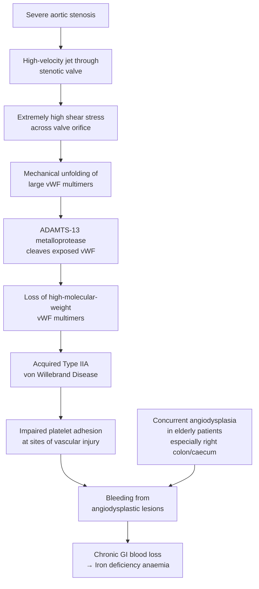

## Complications of Aortic Stenosis

Complications of AS can be divided into two broad categories: (A) complications of the disease itself (untreated AS) and (B) complications related to treatment (post-AVR/TAVI). Both are high-yield for exams. Let's work through each systematically, always linking back to pathophysiology so you understand *why* each complication occurs rather than simply memorising a list.

---

### A. Complications of the Disease (Untreated or Progressive AS)

#### 1. Left Ventricular Failure

***LV failure*** [1]

**Pathophysiology (from first principles):**
- Chronic pressure overload → compensatory concentric LVH → initially maintains cardiac output
- Over time, the compensatory mechanisms become maladaptive:
  - Myocardial fibrosis develops (replacement fibrosis from chronic subendocardial ischaemia + diffuse interstitial fibrosis from excessive collagen deposition)
  - LV compliance worsens progressively → diastolic dysfunction worsens
  - Eventually the LV "gives up" — wall stress overwhelms the hypertrophied muscle → the LV begins to **dilate** (transition from concentric to eccentric hypertrophy)
  - LVEF drops → forward cardiac output falls
  - LVEDP rises → transmitted retrograde to LA → pulmonary veins → **pulmonary oedema**

***Decompensation due to chronic LV pressure overload → rapid deterioration with LV failure (dilated LV) → pulmonary oedema*** [2]

**Clinical manifestations:**
- Acute pulmonary oedema: sudden-onset dyspnoea, orthopnoea, PND, pink frothy sputum, bilateral crackles
- Chronic heart failure: progressive exercise intolerance, ankle swelling (if biventricular failure), fatigue
- Cardiogenic shock in extreme cases: hypotension, cold peripheries, oliguria, confusion

**Why is this the deadliest complication?** Once heart failure symptoms develop, the median survival is only **≈2 years** without intervention [4]. The decompensation is rapid because the hypertrophied LV has very little reserve — it has been running at maximum capacity for years to maintain output against the obstruction, and once it begins to fail, there is a precipitous downward spiral.

**Key point about reversibility:** If AVR is performed **before** extensive irreversible myocardial fibrosis develops, LV function can recover significantly. This is why we intervene as soon as LV dysfunction is detected (LVEF < 50%), even in asymptomatic patients. If intervention is delayed too long, the fibrosis becomes irreversible and LV recovery after AVR is incomplete — the patient has "missed the window."

<Callout title="The Decompensation Cascade" type="error">
Once LV failure begins in AS, it creates a vicious cycle: ↓CO → ↓coronary perfusion → more ischaemia → further ↓contractility → further ↓CO. Additionally, ↑LVEDP → pulmonary congestion → hypoxaemia → further ischaemia. Without relief of the obstruction (AVR), this cycle is self-perpetuating and fatal.
</Callout>

#### 2. Arrhythmias

***Arrhythmias*** [1]

**Pathophysiology:**
The hypertrophied, fibrosed, ischaemic LV creates an ideal substrate for both atrial and ventricular arrhythmias:

| Arrhythmia | Mechanism | Clinical Significance |
|---|---|---|
| **Atrial fibrillation (AF)** | LA hypertrophy and dilatation (from trying to fill the stiff LV) → structural and electrical remodelling of the atria → triggers AF | **Devastating in AS** — loss of atrial kick (which contributes up to 40% of LV filling in the stiff ventricle) causes acute haemodynamic deterioration: ↓CO → pulmonary oedema → cardiogenic shock. New-onset AF in severe AS is a complication that can itself trigger intervention [1] |
| **Ventricular tachycardia (VT)** | LVH → subendocardial ischaemia → myocardial fibrosis → re-entrant circuits within the heterogeneous myocardium (areas of fibrosis interspersed with viable myocardium create the substrate for re-entry) | Can cause syncope or degenerate into VF → sudden cardiac death |
| **Ventricular fibrillation (VF)** | Triggered by VT degeneration, acute ischaemia, or electrolyte abnormalities in the context of LVH | Leading mechanism of sudden cardiac death in AS |
| **Premature ventricular complexes (PVCs)** | Increased automaticity in ischaemic/hypertrophied myocardium | Common; may be a marker of higher arrhythmic risk |

***Sudden cardiac death due to ventricular arrhythmias*** [2]

**Sudden cardiac death (SCD):**
- Occurs in approximately **1% per year** of asymptomatic patients with severe AS
- Much higher in **symptomatic** patients (15–20% of deaths)
- Mechanisms: VT/VF (most common), complete heart block, acute haemodynamic collapse
- This is the reason we cannot be entirely reassured by the asymptomatic state — a small but real risk of SCD exists, and this risk is part of the argument for earlier intervention in "very severe" AS (Vmax ≥ 5.0 m/s)

***Coronary artery disease (85% of cardiac arrest causes), structural heart disease including AS (10%)*** [10]

#### 3. Conduction Abnormalities and Heart Block

***Heart block (calcified conduction system)*** [1]

***3rd degree heart block due to calcification of upper interventricular septal tissue or post-AVR*** [2]

**Pathophysiology (anatomical basis):**
This is one of the most elegant anatomy-pathology correlations in cardiology. Let's trace the anatomy:

1. The **aortic valve annulus** sits directly above the **membranous interventricular septum**
2. The **bundle of His** penetrates through the membranous septum, just below the non-coronary cusp and the right coronary cusp of the aortic valve
3. The **left bundle branch** runs along the left side of the interventricular septum, immediately beneath the aortic valve

When heavy calcification of the aortic valve extends **inferiorly** into the septum:
- It infiltrates and destroys the bundle of His → **complete (3rd degree) heart block**
- It damages the left bundle branch → **left bundle branch block (LBBB)**
- Less commonly, it can affect the right bundle branch or cause fascicular blocks

| Conduction Abnormality | Mechanism | Clinical Significance |
|---|---|---|
| **LBBB** | Calcification extends into the left bundle branch on the LV septal surface | Most common conduction abnormality in AS; may also occur post-AVR/TAVI (mechanical trauma during prosthesis deployment) |
| **1st degree AV block** | Partial impairment of AV conduction through calcified tissue near the AV node/His bundle | Prolonged PR interval; usually asymptomatic; marker of advancing disease |
| **2nd degree AV block (Mobitz type II)** | Intermittent block at or below the His bundle | More concerning; risk of progression to complete heart block |
| **3rd degree (complete) heart block** | Complete destruction of the His bundle by calcification | Requires **permanent pacemaker implantation**; presents with syncope, presyncope, or sudden death if ventricular escape rhythm is unreliable |

**Why is this also a post-procedural complication?**
- **Post-SAVR**: Surgical debridement of calcified annular tissue can mechanically damage the conduction system; occurs in 3–5% of SAVR cases
- **Post-TAVI**: The stent frame of the TAVI prosthesis exerts radial force on the LVOT and septum, directly compressing the His bundle and left bundle branch; **pacemaker requirement is 10–25%** (higher with self-expanding valves that exert continuous radial force, like CoreValve/Evolut; lower with balloon-expandable valves like Edwards SAPIEN)

#### 4. Heyde's Syndrome

***Heyde's syndrome → iron deficiency anaemia*** [1]

***Heyde's syndrome: GI bleed from angiodysplasia in the presence of AS (increased shear stress across aortic valve → vWF degradation, i.e. acquired type IIA vWD)*** [1][5]

**Detailed pathophysiology:**

**Key points about Heyde's syndrome:**
- First described by Edward Heyde in 1958 — noted an association between calcific AS and GI bleeding
- The pathophysiological link was not understood until the discovery of acquired vWD in AS patients
- **Angiodysplasia** (also called arteriovenous malformations) are **degenerative vascular lesions** common in the elderly, especially in the right colon (caecum and ascending colon) [5]
- These lesions are fragile and bleed easily, but in patients with normal vWF, bleeding is usually minor and self-limiting
- In AS patients with acquired vWD, the impaired platelet adhesion means bleeding is **prolonged and recurrent**
- **Correction of AS (AVR) normalises the vWF multimer profile** and resolves the bleeding tendency — this is one of the most satisfying demonstrations of cause-and-effect in medicine

**Clinical presentation:**
- Recurrent painless lower GI bleeding (haematochezia)
- Chronic iron deficiency anaemia: fatigue, pallor, dyspnoea (which may be confounded with AS-related dyspnoea)
- May present as occult blood loss with unexplained anaemia

**Investigation:**
- Colonoscopy: cherry red spots (angiodysplastic lesions) [5]
- Blood: iron studies showing iron deficiency pattern (↓ferritin, ↓iron, ↑TIBC, ↓transferrin saturation)
- Haemostasis: ↓ristocetin cofactor activity, ↓large vWF multimers on multimer gel electrophoresis (confirms acquired type IIA vWD)
- Mesenteric angiogram if colonoscopy inconclusive: "mother-in-law phenomenon" — early filling, delayed emptying [5]

#### 5. Infective Endocarditis

**Pathophysiology:**
- Turbulent, high-velocity flow across the stenotic aortic valve causes **endothelial damage** on the valve leaflets
- Damaged endothelium exposes subendothelial collagen → platelet and fibrin deposition → formation of **non-bacterial thrombotic endocarditis (NBTE)** — a sterile nidus
- During bacteraemia (e.g., from dental procedures, skin infections, IV drug use), bacteria adhere to this nidus → colonisation → vegetation formation → **infective endocarditis (IE)**
- Bicuspid aortic valves are at particularly high risk due to more turbulent flow

**Clinical significance:**
- IE on a stenotic or bicuspid aortic valve can cause acute deterioration:
  - Valve destruction → acute severe AR → acute pulmonary oedema
  - Abscess formation → extension into conduction system → heart block
  - Septic emboli → stroke, splenic infarcts, mycotic aneurysms, Janeway lesions, Osler's nodes
- ***Infective endocarditis despite optimal medical therapy*** is an indication for urgent valve replacement [1]
- Post-AVR, both mechanical and bioprosthetic valves carry a lifelong risk of **prosthetic valve endocarditis (PVE)** — hence the need for **endocarditis prophylaxis** before dental and certain surgical procedures

#### 6. Calcified Emboli

***Calcified emboli in severe calcific AS*** [2]

**Pathophysiology:**
- In severely calcified aortic valves, fragments of calcium can break off during valve movement or during catheter manipulation
- These calcified emboli travel via the arterial circulation to end-organs:
  - **Brain**: stroke or TIA (presenting as acute focal neurological deficit)
  - **Retina**: retinal artery occlusion (sudden painless monocular vision loss; fundoscopy may show Hollenhorst plaques — refractile cholesterol/calcium crystals at retinal arteriolar bifurcations)
  - **Kidneys**: renal infarction
  - **Peripheral arteries**: acute limb ischaemia, blue toe syndrome
- This complication is relatively uncommon but is an important consideration in any patient with severe calcific AS who develops acute embolic events

#### 7. Secondary Pulmonary Hypertension and Right Heart Failure

**Pathophysiology:**
- Long-standing LV failure from AS → chronically elevated LA pressure → transmitted to pulmonary veins → **pulmonary venous hypertension** (passive, post-capillary)
- Over time, chronic pulmonary venous congestion triggers **reactive pulmonary arteriolar vasoconstriction and remodelling** → **mixed pre- and post-capillary pulmonary hypertension**
- Progressive pulmonary hypertension → increased RV afterload → RV hypertrophy → eventually **RV failure**
- RV failure manifests as: elevated JVP, peripheral oedema, hepatomegaly (pulsatile liver if TR develops), ascites, functional tricuspid regurgitation

This represents the **end-stage** of the AS disease process — the pressure overload has cascaded from LV → LA → pulmonary vasculature → RV. By this point, operative risk is significantly higher and outcomes are worse.

#### 8. Sudden Cardiac Death

***Sudden cardiac death due to ventricular arrhythmias*** [2]

**Mechanisms:**
1. **Ventricular arrhythmias** (VT/VF): the most common mechanism. The hypertrophied, ischaemic, fibrosed myocardium is a perfect substrate for re-entrant tachyarrhythmias
2. **Complete heart block**: calcification destroys the conduction system → asystole or very slow ventricular escape rhythm → inadequate cardiac output
3. **Acute haemodynamic collapse**: during exercise, the combination of fixed cardiac output and peripheral vasodilation → catastrophic drop in cerebral perfusion → cardiac arrest
4. **Coronary ischaemia**: acute subendocardial infarction in the context of severe LVH → triggers VF

**Epidemiology:**
- ~1% per year in asymptomatic severe AS (lower than the procedural risk of AVR, which is why we generally observe asymptomatic patients unless very severe)
- Much higher once symptomatic — particularly with exertional syncope, which may be a "warning" near-miss for SCD
- ***If symptoms appear: average survival 2–5 years*** [4] — sudden death contributes significantly to this mortality

---

### B. Complications Related to Treatment (Post-Intervention)

#### 1. Post-Operative Conduction Disturbances

***3rd degree heart block due to calcification of upper IV septal tissue or post-AVR*** [2]

| Setting | Mechanism | Incidence | Management |
|---|---|---|---|
| **Post-SAVR** | Surgical trauma during debridement of calcified annulus damages adjacent His bundle/LBB | LBBB: ~5–10%; Complete heart block needing PPM: 3–5% | Temporary pacing wires placed intraoperatively; if conduction does not recover within 5–7 days → permanent pacemaker |
| **Post-TAVI** | Radial force of stent frame compresses LVOT septum and conduction tissue; deeper implantation → higher risk | LBBB: 15–30%; PPM: 10–25% (self-expanding > balloon-expandable) | Monitoring with temporary pacing; many resolve spontaneously; if persistent → permanent pacemaker |

#### 2. Paravalvular Leak (PVL)

| Setting | Mechanism | Clinical Significance |
|---|---|---|
| **Post-SAVR** | Incomplete seating of prosthesis against annulus; suture dehiscence; annular calcification preventing full apposition | Rare (< 2%); if significant → haemolysis, HF; may require redo surgery |
| **Post-TAVI** | Native calcified leaflets remain in situ → irregular surface → gaps between stent frame and native annulus | More common than SAVR; mild PVL: usually tolerated; moderate/severe PVL: associated with ↑mortality → may need post-dilatation or valve-in-valve |

#### 3. Patient-Prosthesis Mismatch (PPM)

***Prosthesis is too small for the patient → patient remains in aortic stenosis or pathology not completely corrected*** [3]

**Pathophysiology:**
- If the **effective orifice area index (EOAI)** of the prosthetic valve is too small relative to the patient's body surface area, a residual gradient persists across the prosthesis
- Severe PPM (EOAI < 0.65 cm²/m²) → patient effectively **remains in aortic stenosis** despite having had valve replacement
- Consequences: persistent LVH, impaired LV regression, higher long-term mortality, persistent symptoms

**Prevention:**
- Careful pre-operative annular sizing (CT measurements)
- Choose appropriate prosthesis size
- Consider aortic root enlargement procedures (Nicks, Manouguian) if the annulus is too small to accommodate an adequately sized prosthesis
- Stentless valves or sutureless valves may provide larger effective orifice area

#### 4. Structural Valve Degeneration (Bioprosthetic)

| Aspect | Details |
|---|---|
| **Mechanism** | Progressive calcification, fibrosis, and leaflet tearing of the bioprosthetic tissue (porcine or bovine pericardium) over years → stenosis, regurgitation, or both |
| **Timeline** | Usually occurs after **10–15 years** (earlier in younger patients — perhaps due to more vigorous immune response and calcium metabolism; and in patients on dialysis) |
| **Presentation** | Gradually increasing gradient on surveillance echo; new murmur; recurrence of symptoms |
| **Management** | Redo surgical AVR (higher risk than primary operation) OR **valve-in-valve TAVI** (lower risk; a new TAVI prosthesis is deployed inside the degenerated bioprosthesis — this is a major advantage of choosing a bioprosthetic valve initially) |

#### 5. Prosthetic Valve Thrombosis

| Aspect | Mechanical Valve | Bioprosthetic Valve |
|---|---|---|
| **Mechanism** | Blood contact with artificial material → thrombus formation on valve surfaces or within hinge mechanism | Subclinical leaflet thrombosis — discovered incidentally on CT as hypoattenuating leaflet thickening (HALT) with reduced leaflet motion (RELM) |
| **Risk factors** | Subtherapeutic INR (most common trigger); hypercoagulable states | Inadequate early anticoagulation/antiplatelet therapy; low cardiac output states |
| **Presentation** | Acute: cardiogenic shock, embolic stroke. Chronic: gradually increasing gradient | Often subclinical; may cause gradually increasing gradient; clinical significance debated |
| **Management** | Thrombolysis (if non-obstructive or too sick for surgery) or emergency redo surgery (if obstructive with haemodynamic instability) | Therapeutic anticoagulation (warfarin) usually resolves subclinical thrombosis |

#### 6. Prosthetic Valve Endocarditis (PVE)

| Timing | Early PVE (< 12 months post-op) | Late PVE (> 12 months post-op) |
|---|---|---|
| **Organisms** | Nosocomial: *S. aureus*, coagulase-negative staphylococci, Gram-negative rods, fungi | Community-acquired: similar to native valve IE — *Streptococcus*, *Enterococcus*, *S. aureus* |
| **Mechanism** | Contamination during surgery or perioperative bacteraemia → seeding of prosthetic material | Bacteraemia from remote infection → adherence to prosthetic valve |
| **Outcome** | Higher mortality (20–40%); often requires urgent redo surgery | Better prognosis; medical therapy may suffice if no complications |

#### 7. Stroke and Thromboembolism

| Setting | Mechanism | Incidence |
|---|---|---|
| **Mechanical valve** | Thrombus on valve → embolisation to cerebral arteries | Without anticoagulation: 4%/year; with warfarin: 1–2%/year |
| **TAVI** | Catheter manipulation across calcified aortic arch dislodges debris → cerebral embolisation; valve thrombosis | 2–4% at 30 days; cerebral embolic protection devices may reduce this |
| **Post-SAVR** | Air embolism, particulate embolism during surgery; AF-related thromboembolism | 1–2% perioperatively |

#### 8. Bleeding Complications

| Context | Mechanism |
|---|---|
| **Warfarin-related** (mechanical valve) | Lifelong anticoagulation carries ongoing bleeding risk; GI bleeding, intracranial haemorrhage, epistaxis; INR must be monitored closely |
| **DAPT-related** (post-TAVI) | Aspirin + clopidogrel for 3–6 months → bleeding risk, especially in elderly with comorbidities |
| **Acquired vWD resolution post-AVR** | Interestingly, Heyde's syndrome bleeding **resolves** after AVR as vWF multimers normalise — this is a complication that is **cured** by treatment |

#### 9. Haemolysis (Prosthetic Valve-Related)

**Pathophysiology:**
- Blood flowing through or around the prosthetic valve may be subjected to high shear stress → mechanical fragmentation of red blood cells → **intravascular haemolysis**
- More common with **paravalvular leaks** (turbulent, high-velocity jets through the gap between prosthesis and annulus)
- More common with **mechanical valves** than bioprosthetic

**Clinical features:**
- Anaemia (often progressive)
- Jaundice (unconjugated hyperbilirubinaemia)
- Dark urine (haemoglobinuria)
- Raised LDH, reticulocyte count; low haptoglobin
- Blood film: schistocytes (fragmented RBCs), polychromasia

---

### C. Summary Table: All Complications at a Glance

| Category | Complication | Mechanism | Key Clinical Feature |
|---|---|---|---|
| **Disease** | ***LV failure*** [1] | Chronic pressure overload → decompensation → dilatation | Dyspnoea, pulmonary oedema; median survival ≈2 years |
| **Disease** | ***Arrhythmias*** [1] | LVH + fibrosis + ischaemia → re-entrant substrate | AF (acute deterioration), VT/VF (sudden death) |
| **Disease** | ***Heart block*** [1] | ***Calcification of conduction system*** [1] | LBBB, complete heart block → syncope, pacemaker needed |
| **Disease** | ***Heyde's syndrome*** [1] | ***High shear → acquired vWD → GI bleeding*** [1][5] | Iron deficiency anaemia, recurrent GI bleed |
| **Disease** | Infective endocarditis | Endothelial damage → nidus → bacterial colonisation | Fever, new murmur, embolic phenomena |
| **Disease** | ***Calcified emboli*** [2] | Calcium fragments embolise | Stroke, TIA, peripheral ischaemia |
| **Disease** | Pulmonary HTN / RHF | LV failure → LA pressure → pulmonary vasoconstriction | Raised JVP, oedema, hepatomegaly |
| **Disease** | ***Sudden cardiac death*** [2] | VT/VF, complete heart block, acute haemodynamic collapse | Cardiac arrest |
| **Treatment** | ***Heart block post-AVR/TAVI*** [2] | Surgical/mechanical trauma to His bundle/LBB | PPM in 3–5% post-SAVR, 10–25% post-TAVI |
| **Treatment** | Paravalvular leak | Incomplete prosthesis-annulus apposition | Haemolysis, HF; more common post-TAVI |
| **Treatment** | ***Patient-prosthesis mismatch*** [3] | Prosthesis too small for patient | Residual AS; persistent symptoms |
| **Treatment** | Structural valve degeneration | Bioprosthetic calcification/fibrosis over time | Recurrent AS/AR after 10–15 years |
| **Treatment** | Prosthetic valve thrombosis | Thrombus on prosthetic surfaces | Increasing gradient; embolic events |
| **Treatment** | Prosthetic valve endocarditis | Infection of prosthetic material | Fever, new murmur; high mortality |
| **Treatment** | Stroke/thromboembolism | Embolisation from valve/catheter manipulation | Acute neurological deficit |
| **Treatment** | Haemolysis | Shear fragmentation of RBCs by prosthesis/PVL | Anaemia, jaundice, dark urine, schistocytes |

---

<Callout title="High Yield Summary — Complications of Aortic Stenosis">

1. **LV failure** is the most feared complication — median survival ≈2 years without AVR; results from chronic pressure overload → decompensation → dilatation → pulmonary oedema

2. **Arrhythmias** (especially AF and VT/VF) arise from the ischaemic, fibrosed, hypertrophied myocardium; AF is especially devastating because loss of atrial kick causes acute haemodynamic collapse in the stiff LV

3. **Heart block** occurs because the conduction system (His bundle, left bundle branch) lies immediately below the aortic valve annulus; calcification extends into these structures. Also occurs post-SAVR and post-TAVI (10–25% PPM rate with TAVI)

4. **Heyde's syndrome** = acquired type IIA vWD from high shear stress → GI bleeding from angiodysplasia → iron deficiency anaemia; resolves after AVR

5. **Sudden cardiac death** occurs in ≈1%/year of asymptomatic and 15–20% of symptomatic patients; mechanism: VT/VF, complete heart block, or acute haemodynamic collapse

6. **Post-intervention complications:** heart block (most common), paravalvular leak (more in TAVI), patient-prosthesis mismatch (prosthesis too small), structural valve degeneration (bioprosthetic after 10–15 years), prosthetic valve endocarditis, thromboembolism, haemolysis

7. **Calcified emboli** can cause stroke, TIA, or peripheral ischaemia in severe calcific AS

</Callout>

---

<ActiveRecallQuiz
  title="Active Recall - Complications of Aortic Stenosis"
  items={[
    {
      question: "Explain the anatomical basis for why aortic stenosis causes conduction system disease, and name the specific conduction abnormalities that result.",
      markscheme: "The bundle of His penetrates the membranous interventricular septum immediately beneath the aortic valve annulus (between non-coronary and right coronary cusps). The left bundle branch runs along the left side of the interventricular septum, also immediately below the valve. Heavy calcification of the aortic valve extends inferiorly into the septum, infiltrating and destroying these structures. Results in: LBBB (most common), 1st degree AV block, 2nd degree AV block (Mobitz II), and 3rd degree (complete) heart block.",
    },
    {
      question: "Why is new-onset atrial fibrillation a particularly dangerous complication in severe AS?",
      markscheme: "In severe AS, concentric LVH makes the LV stiff with reduced compliance (diastolic dysfunction). The LV becomes heavily dependent on atrial contraction (atrial kick) which contributes up to 40% of LV filling. AF causes loss of coordinated atrial contraction, dramatically reducing LV filling and cardiac output, leading to acute haemodynamic deterioration, pulmonary oedema, and potentially cardiogenic shock. New-onset AF may itself be an indication for intervention.",
    },
    {
      question: "Describe the complete pathophysiological chain of Heyde's syndrome from AS to iron deficiency anaemia.",
      markscheme: "Severe AS → high-velocity jet through stenotic valve → extremely high shear stress → mechanical unfolding of large vWF multimers → enhanced cleavage by ADAMTS-13 protease → loss of high-molecular-weight vWF multimers → acquired type IIA von Willebrand disease → impaired platelet adhesion → recurrent bleeding from angiodysplastic lesions (common in elderly, especially right colon) → chronic GI blood loss → iron deficiency anaemia. Resolves after AVR as shear stress normalises and vWF multimers recover.",
    },
    {
      question: "What is patient-prosthesis mismatch, and how does it manifest clinically?",
      markscheme: "PPM occurs when the effective orifice area of the prosthetic valve indexed to BSA (EOAI) is too small for the patient (severe PPM: EOAI < 0.65 cm2/m2). The patient effectively remains in aortic stenosis despite valve replacement. Manifestations: persistent high transvalvular gradients, impaired LVH regression, persistent or recurrent symptoms (dyspnoea, angina), and increased long-term mortality. Prevention: careful pre-operative annular sizing and appropriate prosthesis selection; consider root enlargement if needed.",
    },
    {
      question: "Compare the rate and mechanism of permanent pacemaker requirement after SAVR versus TAVI.",
      markscheme: "SAVR: PPM rate 3-5%; mechanism is direct surgical trauma to conduction tissue during debridement of calcified annulus and suture placement near the His bundle. TAVI: PPM rate 10-25% (higher with self-expanding valves like CoreValve/Evolut, lower with balloon-expandable like SAPIEN); mechanism is radial force from the stent frame compressing the LVOT septum and conduction tissue (His bundle, left bundle branch); deeper implantation increases the risk.",
    },
    {
      question: "List the mechanisms by which sudden cardiac death occurs in aortic stenosis.",
      markscheme: "1. Ventricular arrhythmias (VT degenerating to VF): from re-entrant circuits in hypertrophied, ischaemic, fibrosed myocardium (most common mechanism). 2. Complete heart block: calcification destroys conduction system leading to asystole or unreliable escape rhythm. 3. Acute haemodynamic collapse: during exercise, fixed cardiac output with peripheral vasodilation causes catastrophic drop in cerebral perfusion. 4. Acute coronary ischaemia: subendocardial infarction in severe LVH triggers VF.",
    },
  ]}
/>

## References

[1] Senior notes: Maksim Medicine Notes.pdf (p35, p37 — Complications of AS: LV failure, arrhythmias, heart block, Heyde's syndrome, general indications for valve replacement including IE)
[2] Senior notes: Ryan Ho Cardiology.pdf (p158 — Complications: sudden cardiac death, 3rd degree heart block, calcified emboli)
[3] Lecture slides: Cardiac Surgery Tutorial_Prof. D Chan.pdf (p60 — EOAI and patient-prosthesis mismatch)
[4] Lecture slides: Cardiac Surgery Tutorial_Prof. D Chan.pdf (p51 — natural history: average survival 2–5 years once symptomatic)
[5] Senior notes: Maksim Surgery Notes.pdf (p97 — Angiodysplasia, Heyde's syndrome, investigations and management)
[10] Senior notes: Ryan Ho Critical Care.pdf (p28 — Cardiac arrest causes: structural heart disease including AS)
