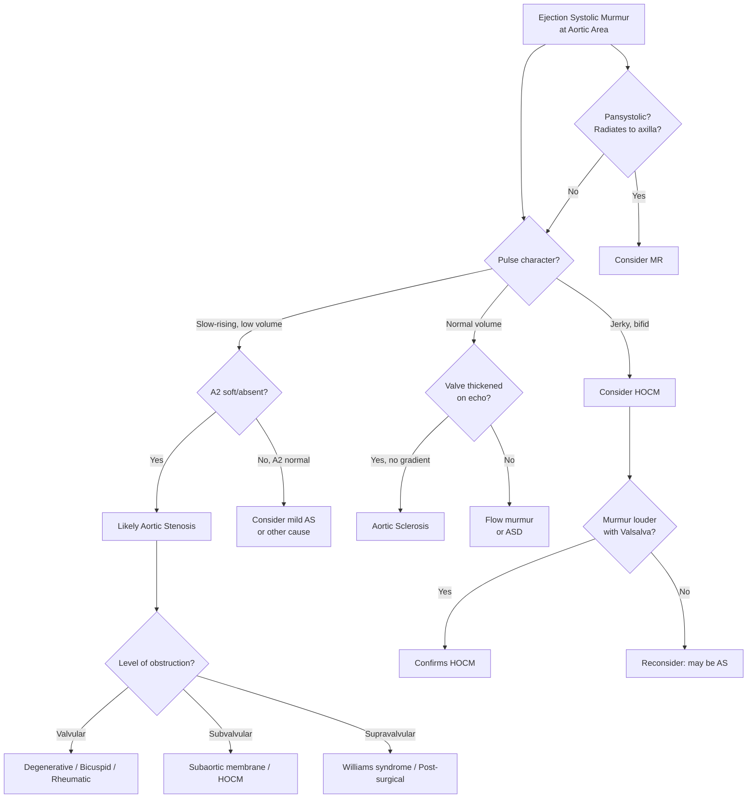

## Differential Diagnosis of Aortic Stenosis

The differential diagnosis of aortic stenosis is best approached by thinking about **what clinical features you are actually trying to differentiate**. In practice, a patient suspected of AS will present with one or more of three things: (1) a systolic murmur, (2) symptoms of angina/syncope/dyspnoea, or (3) signs of LV outflow obstruction on examination. We need to consider mimics for each of these.

Let's work through this systematically.

---

### 1. Differential Diagnosis of the Ejection Systolic Murmur at the Aortic Area

This is the most common clinical scenario — you hear an ESM at the right upper sternal border and need to decide: is this truly AS, or something else? The senior notes specifically highlight three ***important differentials*** [2]:

#### A. Aortic Sclerosis

> ***Aortic sclerosis: normal volume pulse, normal/wide pulse pressure, intact S2 and no LVH*** [2]

| Feature | Aortic Stenosis | Aortic Sclerosis |
|---|---|---|
| **Definition** | Thickening + calcification of leaflets **with** obstruction (gradient present) | Thickening + calcification of leaflets **without** obstruction (no significant gradient) |
| **Pulse** | Slow-rising, low volume | **Normal volume and character** |
| **Pulse pressure** | Narrow | **Normal or wide** |
| **S2 (A2)** | Soft or absent | **Intact, normal A2** |
| **LVH** | Present (ECG/echo) | **Absent** |
| **Murmur** | Loud, late-peaking, radiates to neck | Soft, early-peaking, may not radiate to neck |
| **Echocardiography** | AVA < 1.5 cm², significant gradient | Thickened leaflets but AVA > 1.5 cm², gradient < 20 mmHg |

**Why does this matter?** Aortic sclerosis is extremely common in the elderly (~25% of those > 65 years). It produces a soft ESM but no haemodynamic obstruction. However, aortic sclerosis is a **marker of cardiovascular risk** — these patients have a ~50% increased risk of cardiovascular events, even though the valve itself is not causing symptoms. It is also a precursor lesion that may progress to AS over years/decades. Think of it like fatty streaks in atherosclerosis — not yet causing obstruction, but a warning sign.

<Callout title="Exam Trap: Aortic Sclerosis vs Stenosis" type="error">
The key differentiators are the **pulse character** and **S2**. In aortic sclerosis, pulse volume is normal and A2 is preserved. In aortic stenosis, the pulse is slow-rising and A2 is diminished or absent. If the question gives you "ESM in an elderly patient with normal pulse and normal S2" — think sclerosis, not stenosis.
</Callout>

#### B. Hypertrophic Obstructive Cardiomyopathy (HOCM)

> ***HOCM: jerky pulse, normal S2, murmur increases on standing*** [2]

HOCM produces a **dynamic** LVOT obstruction (as opposed to the fixed obstruction in valvular AS). The asymmetrically hypertrophied interventricular septum bulges into the LVOT, and during systole, the anterior mitral valve leaflet is pulled towards the septum by the Venturi effect (systolic anterior motion, SAM), worsening the obstruction.

| Feature | Aortic Stenosis | HOCM |
|---|---|---|
| **Type of obstruction** | Fixed, valvular | Dynamic, subvalvular |
| **Pulse** | Slow-rising, low volume (parvus et tardus) | **Jerky, bifid** (rapid upstroke then obstruction) |
| **S2** | Soft/absent A2 | **Normal S2** |
| **Murmur location** | Aortic area, radiates to neck | **Left lower sternal border**, does NOT typically radiate to neck |
| **Response to Valsalva / standing** | Murmur **decreases** (↓venous return → ↓flow → less turbulence) | Murmur **increases** (↓venous return → ↓LV cavity size → septum and MV leaflet closer → ↑obstruction) |
| **Response to squatting** | Murmur **increases** (↑venous return → ↑flow → more turbulence) | Murmur **decreases** (↑venous return → ↑LV cavity size → less obstruction) |
| **Family history** | Absent (unless bicuspid AV) | Often positive (autosomal dominant, sarcomeric gene mutations) |
| **Age** | Typically elderly (degenerative) | Typically younger; can present at any age |
| **Echo** | Calcified valve, restricted opening | Asymmetric septal hypertrophy (ASH), SAM of MV |

**Why does the pulse differ?** In AS, the fixed obstruction slows ejection from the start → slow-rising pulse. In HOCM, the initial ejection is **unobstructed** (rapid upstroke) but then the dynamic obstruction kicks in mid-systole (SAM of MV) → sudden deceleration → "jerky" or bifid pulse.

**Why does the murmur response to manoeuvres differ?** This is one of the most commonly tested concepts:
- Manoeuvres that **decrease LV preload** (Valsalva strain phase, standing) → smaller LV cavity → septum and MV leaflet are closer together → MORE obstruction in HOCM → louder murmur. In AS, less blood flows through the fixed stenosis → quieter murmur.
- Manoeuvres that **increase LV preload** (squatting, leg elevation) → larger LV cavity → septum and MV leaflet are further apart → LESS obstruction in HOCM → quieter murmur. In AS, more blood flows through → louder murmur.

#### C. Mitral Regurgitation (MR)

> ***MR: pansystolic murmur best heard at apex with radiation to axilla*** [2]

| Feature | Aortic Stenosis | Mitral Regurgitation |
|---|---|---|
| **Murmur character** | Ejection systolic (crescendo-decrescendo, diamond-shaped) | **Pansystolic** (plateau-shaped, same intensity throughout systole) |
| **Timing** | Begins after S1, ends before S2 | **Begins with S1, extends through S2** |
| **Best heard** | Aortic area (R 2nd ICS) | **Apex** |
| **Radiation** | Neck (carotids) | **Axilla** |
| **S1** | Normal | **Soft** (most reliable differentiator — in MR, the mitral valve doesn't close properly → soft S1) [2] |
| **S2** | Soft/absent A2 | Usually normal |
| **Pulse** | Slow-rising, low volume | Normal or hyperdynamic |

**Why can this be confusing?** Because of the ***Gallavardin phenomenon*** [1] — in elderly patients with heavily calcified AS, the high-frequency components of the AS murmur are selectively transmitted to the apex, where they sound more musical and may mimic MR. The key differentiator is **S1**: in MR, S1 is soft; in AS with Gallavardin phenomenon, S1 is normal. Also, true MR radiates to the axilla, while AS radiates to the neck.

#### D. Other Causes of ESM at the Aortic Area

| Condition | Key Differentiating Features |
|---|---|
| **Pulmonic stenosis** | Best heard at **left** 2nd ICS (pulmonary area), not right; radiates to left shoulder, not neck; may have ejection click; associated with right-sided signs (RV heave, raised JVP) [7] |
| **Flow murmur (innocent/physiological)** | Common in high-output states (pregnancy, anaemia, thyrotoxicosis, fever); soft, early-peaking; no thrill; normal S2; no LVH; disappears when the underlying condition resolves |
| **Atrial septal defect (ASD)** | ESM at pulmonary area due to relative pulmonic stenosis from ↑flow across pulmonary valve; **fixed splitting of S2** is the hallmark (pathognomonic) |
| **Aortic regurgitation with flow murmur** | Severe AR causes ↑stroke volume → ejection flow murmur across the aortic valve; but the dominant murmur is the **early diastolic murmur** of AR; collapsing pulse, wide pulse pressure distinguish this [1] |
| ***Carotid artery atherosclerosis (carotid bruit)*** | Can radiate from neck and be confused with AS murmur radiating to neck; a true **carotid bruit** is best heard directly over the carotid, usually unilateral, and does not have a precordial component; AS murmur radiates bilaterally [2] |

<Callout title="Carotid Bruit vs AS Murmur Radiation" type="idea">
***A carotid bruit from carotid artery atherosclerosis may be unilateral and is heard directly over the carotid, whereas aortic stenosis murmur radiates bilaterally to the neck from the precordium*** [2]. Always auscultate the precordium first — if the murmur is loudest at the aortic area and fades towards the neck, it is radiation from AS. If it is loudest at the neck and doesn't have a clear precordial origin, consider carotid bruit.
</Callout>

---

### 2. Differential Diagnosis by Presenting Symptom

Because AS often presents with one of its three cardinal symptoms rather than a murmur discovered incidentally, you must also consider the broad differentials for each symptom and explain why AS is considered.

#### A. Exertional Angina

The differential for exertional chest pain mimicking AS-related angina:

| Diagnosis | Key Differentiating Features | Why It Mimics/Differs from AS |
|---|---|---|
| **Coronary artery disease (stable angina)** [8] | Atherosclerotic risk factors; typical angina relieved by rest/nitrates; normal pulse character; no ESM | Fixed epicardial coronary stenosis → supply-demand mismatch with exertion. **50% of AS patients have coexistent CAD**, so both may coexist [2] |
| **HOCM** | Younger patient; family history of sudden death; jerky pulse; ESM at LLSB louder with Valsalva | Dynamic LVOT obstruction → similar supply-demand mismatch |
| **Severe pulmonary hypertension** | RV heave; loud P2; signs of right HF; TR murmur | RV pressure overload → RV ischaemia → angina equivalent |
| **Aortic regurgitation** [1] | Collapsing pulse; wide pulse pressure; EDM; displaced thrusting apex | Chest pain in AR is due to ↓diastolic BP (↓coronary perfusion) + ↑LV mass; tends to be **worse at night** (↓HR → longer diastole → more regurgitation) |
| **Severe anaemia** | Pallor; tachycardia; flow murmur; low Hb | ↓O₂ carrying capacity → myocardial ischaemia at lower workload |

#### B. Exertional Syncope

The differential for exertional syncope — this is a critical "red flag" scenario [6]:

| Diagnosis | Key Features | Mechanism |
|---|---|---|
| **Aortic stenosis** | ESM, slow-rising pulse, elderly | Fixed CO + exercise vasodilation → ↓cerebral perfusion |
| **HOCM** | Jerky pulse, young athlete, FHx sudden death | Dynamic LVOT obstruction worsens with exercise (↑contractility, ↓preload) |
| **Pulmonary hypertension / massive PE** | RV signs, hypoxia, risk factors for PE | RVOT obstruction → ↓LV filling → ↓CO |
| **Arrhythmias (VT, VF, complete heart block)** | Palpitations, known structural heart disease | ↓CO from arrhythmia → cerebral hypoperfusion |
| **Anomalous coronary artery origin** | Young patient, exertional syncope/sudden death | Coronary artery compressed between aorta and PA during exercise |

> ***Causes of exercise-related syncope: (1) LVOT obstruction — AS, HCMP; (2) RVOT obstruction — pulmonary HTN; (3) Cardiomyopathy — DCMP, HCMP, ARVD; (4) Coronary artery disease — atherosclerotic, anomalous origin; (5) Arrhythmogenic — VT, SVT, WPWS, LQTS*** [6]

#### C. Heart Failure / Exertional Dyspnoea

| Diagnosis | Key Features | Why It Mimics/Differs from AS |
|---|---|---|
| **Ischaemic cardiomyopathy** | History of MI; regional wall motion abnormality on echo; dilated LV | Systolic dysfunction from myocardial scar |
| **Dilated cardiomyopathy** | Displaced, diffuse apex; S3; global hypokinesis on echo | Volume overload → eccentric hypertrophy (vs. pressure overload in AS) |
| **Hypertensive heart disease** | Longstanding HTN; concentric LVH; diastolic dysfunction | Similar pathophysiology (pressure overload) but no valve obstruction |
| **Mitral stenosis** | Opening snap + mid-diastolic rumble; small pulse; AF; mitral facies | LA obstruction → pulmonary congestion → dyspnoea |
| **Aortic regurgitation** [1] | Collapsing pulse; EDM; displaced apex | Volume overload → LV dilatation → eventual failure |
| **Restrictive/infiltrative cardiomyopathy (e.g., amyloid)** | Diastolic dysfunction; low-voltage ECG; ± "sparkling" myocardium on echo | **Important**: cardiac amyloidosis can cause both diastolic dysfunction AND aortic valve thickening, mimicking degenerative AS. Increasingly recognised as an underdiagnosed cause of "AS" in the elderly |

<Callout title="Cardiac Amyloidosis Masquerading as AS" type="error">
Transthyretin cardiac amyloidosis (ATTR-CM) is increasingly recognised in elderly patients who also have degenerative AS. Up to 10-15% of patients undergoing TAVI for "severe AS" may have coexistent cardiac amyloidosis. Suspect it when: LVH seems out of proportion to the degree of AS, low-voltage ECG despite thick walls (voltage-mass mismatch), or diastolic dysfunction is disproportionately severe. Bone scintigraphy (⁹⁹ᵐTc-PYP or DPD scan) is the non-invasive diagnostic test of choice.
</Callout>

---

### 3. Differential Diagnosis by Level of Obstruction

When you have confirmed LVOT obstruction, you must determine **where** the obstruction is:

| Level | Condition | Key Differentiating Features |
|---|---|---|
| **Supravalvular** | ***Williams syndrome*** [1] | Elfin facies, hypercalcaemia, developmental delay, supravalvular narrowing on echo; BP higher in right arm than left (jet directed preferentially into brachiocephalic artery) |
| | Post-surgical supravalvular ridge | History of previous cardiac surgery |
| **Valvular** | Degenerative, bicuspid, rheumatic | Most common; ejection click may be present in bicuspid (before it calcifies); echo shows valve-level obstruction |
| **Subvalvular (fixed)** | Discrete subaortic membrane | Usually younger patients; no ejection click; progressive AR (jet trauma to aortic valve); echo shows membrane below valve |
| **Subvalvular (dynamic)** | ***HOCM*** | Jerky pulse; murmur varies with manoeuvres; SAM on echo; often familial [2] |

---

### 4. Differential Diagnosis Algorithm

---

### 5. Summary Table: Key Differentials at a Glance

| Condition | Murmur Type | Best Heard | Radiation | Pulse | A2 | Key Manoeuvre |
|---|---|---|---|---|---|---|
| **Aortic stenosis** | ESM (crescendo-decrescendo) | R 2nd ICS | Bilateral neck | Slow-rising, low volume | Soft/absent | Louder with squatting |
| **Aortic sclerosis** | ESM (early-peaking, soft) | R 2nd ICS | ± Neck | **Normal** | **Normal** | — |
| **HOCM** | ESM | LLSB | Does not radiate to neck | **Jerky** | **Normal** | **Louder with Valsalva/standing** |
| **MR** | PSM (plateau) | Apex | Axilla | Normal/hyperdynamic | Normal | — |
| **Pulmonic stenosis** | ESM + ejection click | L 2nd ICS | Left shoulder | Normal | Normal (P2 may be soft) | — |
| **Flow murmur** | ESM (soft, early) | LUSB/pulmonary | None | Normal/hyperdynamic | Normal | Disappears with resolution of high-output state |
| **Carotid bruit** | Continuous or systolic | Over carotid | — | Normal | Normal | Unilateral, no precordial component |

---

<Callout title="High Yield Summary — Differential Diagnosis of Aortic Stenosis">

1. **Three most important DDx of ESM at aortic area:** aortic sclerosis (normal pulse, normal A2, no LVH), HOCM (jerky pulse, normal S2, louder with Valsalva/standing), MR (pansystolic, apex, radiates to axilla, soft S1)

2. **Gallavardin phenomenon** can make AS sound like MR at the apex — differentiate by S1 (soft in MR, normal in AS) and radiation (axilla in MR, neck in AS)

3. **Carotid bruit vs AS radiation:** carotid bruit is usually unilateral, heard directly over carotid, no precordial component; AS radiates bilaterally from aortic area

4. **Response to manoeuvres:** AS murmur decreases with Valsalva/standing (↓flow); HOCM murmur increases (↓LV cavity → ↑obstruction). This is the opposite.

5. **Exertional syncope DDx:** AS, HOCM, pulmonary HTN, arrhythmias, anomalous coronary arteries

6. **Don't miss cardiac amyloidosis** in elderly patients with apparent AS — suspect if LVH disproportionate to AS severity, low-voltage ECG, severe diastolic dysfunction

7. **Always consider coexistent CAD** — 50% of AS patients have significant coronary artery disease

</Callout>

---

<ActiveRecallQuiz
  title="Active Recall - Differential Diagnosis of Aortic Stenosis"
  items={[
    {
      question: "Name three key clinical features that distinguish aortic sclerosis from aortic stenosis.",
      markscheme: "1. Normal pulse volume and character (vs slow-rising in AS). 2. Normal/wide pulse pressure (vs narrow in AS). 3. Intact S2 with normal A2 (vs soft/absent A2 in AS). Also accept: no LVH on ECG/echo.",
    },
    {
      question: "How does the ESM of HOCM respond to Valsalva manoeuvre and squatting, and why? Compare this to AS.",
      markscheme: "HOCM: louder with Valsalva (decreased venous return, smaller LV cavity, septum and MV leaflet closer together, more dynamic obstruction); quieter with squatting (increased venous return, larger LV, less obstruction). AS: opposite - quieter with Valsalva (less flow through fixed stenosis); louder with squatting (more flow). The key is that HOCM has dynamic obstruction affected by LV cavity size, while AS has fixed obstruction affected by flow volume.",
    },
    {
      question: "What is the Gallavardin phenomenon, and how do you differentiate it from true mitral regurgitation?",
      markscheme: "Gallavardin phenomenon: AS murmur heard best at the apex with a more musical quality, mimicking MR. Differentiate by: (1) S1 is soft in MR but normal in AS (most reliable), (2) MR radiates to axilla while AS radiates to neck, (3) MR is pansystolic while AS is ejection systolic with crescendo-decrescendo pattern.",
    },
    {
      question: "List five causes of exercise-related syncope.",
      markscheme: "1. LVOT obstruction (AS, HOCM). 2. RVOT obstruction (pulmonary hypertension). 3. Cardiomyopathy (DCMP, HCMP, ARVC). 4. Coronary artery disease (atherosclerotic, anomalous origin). 5. Arrhythmogenic (VT, SVT, WPW syndrome, long QT syndrome).",
    },
    {
      question: "Why should you consider cardiac amyloidosis in an elderly patient undergoing workup for aortic stenosis?",
      markscheme: "ATTR cardiac amyloidosis coexists in up to 10-15% of elderly patients with apparent severe AS. Suspect it when: LVH is disproportionate to the degree of AS, low-voltage ECG despite thick walls (voltage-mass mismatch), disproportionate diastolic dysfunction, or granular sparkling myocardium on echo. Diagnosis: bone scintigraphy (Tc-99m PYP/DPD scan). Missing it changes management significantly.",
    },
  ]}
/>

## References

[1] Senior notes: Maksim Medicine Notes.pdf (p5, p35, p37 — Valvular heart disease, chest pain DDx, terminologies including Gallavardin phenomenon)
[2] Senior notes: Ryan Ho Cardiology.pdf (p158 — AS differentials: aortic sclerosis, HOCM, MR; Gallavardin phenomenon; carotid bruit vs AS)
[6] Senior notes: Ryan Ho Fundamentals.pdf (p210 — causes of exercise-related syncope including LVOT obstruction)
[7] Senior notes: Ryan Ho Fundamentals.pdf (p39 — systolic and diastolic murmur diagram, locations and radiation)
[8] Senior notes: Ryan Ho Fundamentals.pdf (p199–203 — approach to chest pain, angina pectoris, AS as cause of increased demand)
