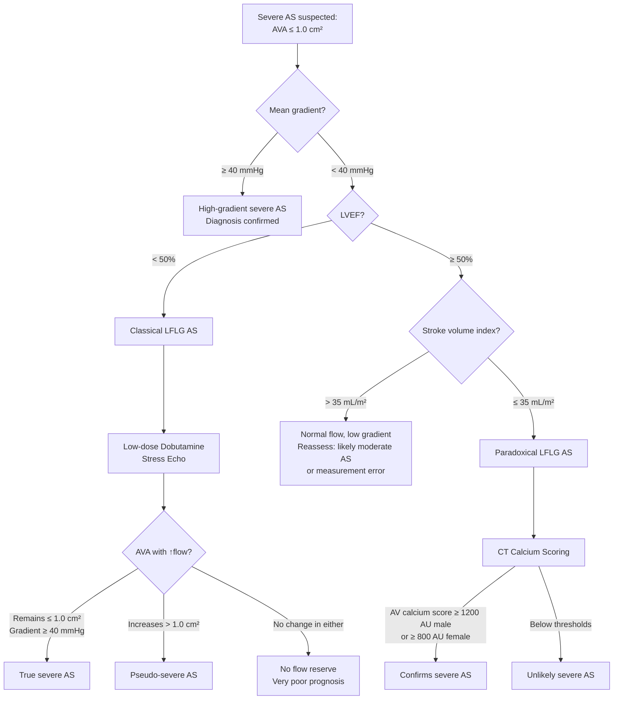
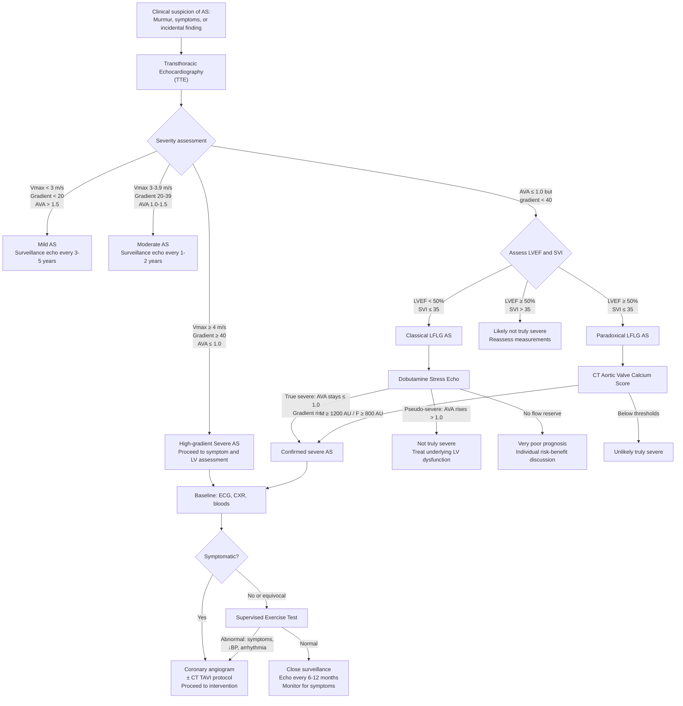

## Diagnosis of Aortic Stenosis: Criteria, Algorithm and Investigations

### 1. Diagnostic Approach — Overview

The diagnosis of aortic stenosis is fundamentally a **two-step process**:

1. **Detection**: Suspecting AS based on clinical features (murmur, symptoms, or incidental finding)
2. **Confirmation and severity grading**: Using echocardiography as the gold standard, supplemented by other investigations to assess consequences, plan management, and exclude coexistent disease

There is no single "diagnostic criterion" for AS the way you have Jones criteria for rheumatic fever or Duke criteria for endocarditis. Instead, the diagnosis rests on **echocardiographic haemodynamic parameters** that define both the presence and severity of obstruction. Let me walk you through each investigation modality, what you're looking for, and why.

---

### 2. Echocardiographic Diagnostic Criteria for Severity

Echocardiography is the **cornerstone investigation** — it simultaneously confirms the diagnosis, grades severity, identifies the aetiology, assesses LV function, and detects associated lesions [1][2].

#### 2.1 Severity Grading (2021 ESC / 2020 ACC/AHA Guidelines)

| Parameter | Normal | Aortic Sclerosis | Mild AS | Moderate AS | Severe AS |
|---|---|---|---|---|---|
| **Peak aortic jet velocity (Vmax)** | < 2.0 m/s | ≤ 2.5 m/s (thickened, no obstruction) | 2.0–2.9 m/s | 3.0–3.9 m/s | ***≥ 4.0 m/s*** [2] |
| **Mean transvalvular pressure gradient** | < 5 mmHg | < 10 mmHg | < 20 mmHg | 20–39 mmHg | ***≥ 40 mmHg*** [2] |
| **Aortic valve area (AVA)** | 3.0–4.0 cm² | > 1.5 cm² | > 1.5 cm² | 1.0–1.5 cm² | ***≤ 1.0 cm²*** [2] |
| **Indexed AVA (AVAi)** | — | — | > 0.85 cm²/m² | 0.60–0.85 cm²/m² | ≤ 0.6 cm²/m² |
| **Velocity ratio (LVOT VTI / AV VTI)** | > 0.50 | > 0.50 | > 0.50 | 0.25–0.50 | < 0.25 |

***Diagnosis of severe AS is defined by transvalvular velocity ≥ 4 m/s, transvalvular pressure gradient ≥ 40 mmHg, aortic valve area ≤ 1 cm²*** [2]

**How are these measured?**

- **Peak jet velocity (Vmax)**: Measured using **continuous-wave (CW) Doppler** across the aortic valve. The Doppler beam measures the maximum velocity of blood flowing through the stenotic orifice. Higher velocity = more severe stenosis (blood must accelerate more to squeeze through a smaller opening — think of a garden hose: squeeze the nozzle, water comes out faster).

- **Mean pressure gradient**: Calculated from the Doppler velocity profile using the **modified Bernoulli equation**:
  > ΔP = 4V²
  
  where ΔP is the instantaneous pressure gradient (mmHg) and V is the instantaneous velocity (m/s). The mean gradient is the time-averaged integral of all instantaneous gradients across systole. This equation derives from fluid dynamics — the kinetic energy of flowing blood is converted from pressure energy as it accelerates through the stenosis.

- **Aortic valve area (AVA)**: Calculated using the **continuity equation**, which is based on conservation of mass (what goes in must come out):
  > AVA = (LVOT area × LVOT VTI) / AV VTI
  
  where LVOT = left ventricular outflow tract, VTI = velocity-time integral (a measure of flow). The LVOT area is calculated from the LVOT diameter (measured in parasternal long-axis view): LVOT area = π × (d/2)². This gives a flow-independent estimate of valve area.

<Callout title="Why Do We Need Both Gradient AND Valve Area?">
The pressure gradient is **flow-dependent** — it depends on how much blood is flowing across the valve. A patient with a truly severe stenosis (small AVA) but very poor LV function (low stroke volume) may generate only a low gradient because there isn't enough blood flow to create a large pressure drop. Conversely, a patient with a mildly stenotic valve but very high cardiac output (e.g., anaemia, pregnancy) may have a deceptively high gradient. The AVA, calculated via the continuity equation, is relatively **flow-independent** and gives a more reliable estimate of anatomical severity. You need both to avoid being fooled.
</Callout>

#### 2.2 The Problem of Low-Flow, Low-Gradient AS

This concept is frequently tested and is explained thoroughly in the senior notes [2]:

***The criteria for transvalvular pressure gradient only apply with sufficient stroke volume*** [2]

***In decreased stroke volume (whether or not LVEF is reduced):*** [2]
- ***Transvalvular gradient and flow is reduced due to decreased blood flow***
- ***Decreased valvular opening force → limited opening of valve that is not severely diseased → underestimation of aortic valvular area may wrongly classify a patient to have severe AS, i.e. pseudo-severe AS where valvular surgery may not reverse the underlying condition*** [2]
- ***However, decreased stroke volume can also be due to progressive LV failure from AS or other pathologies and does NOT rule out co-existence of significant AS*** [2]

There are **four haemodynamic patterns** of severe AS [2]:

| Pattern | AVA | Mean Gradient | Stroke Volume Index | LVEF | Approach |
|---|---|---|---|---|---|
| ***High-gradient severe AS (≥ 50%)*** [2] | ≤ 1.0 cm² | ≥ 40 mmHg | Variable | Variable | Diagnosis is straightforward — meets all criteria |
| ***Classical low-flow, low-gradient (LFLG) AS*** [2] | ≤ 1.0 cm² | < 40 mmHg | ***≤ 35 mL/m² BSA*** [2] | Usually < 50% | ***Low dose dobutamine stress echo*** to differentiate true vs pseudo-severe AS [2] |
| ***Paradoxical LFLG AS*** [2] | ≤ 1.0 cm² | < 40 mmHg | ≤ 35 mL/m² | ***≥ 50% (preserved)*** [2] | CT calcium scoring; often elderly hypertensive women with small, thick-walled LV |
| ***Normal flow, low-gradient AS*** [2] | ≤ 1.0 cm² | < 40 mmHg | > 35 mL/m² | ≥ 50% | Likely measurement error or truly moderate AS; reassess carefully |

**Dobutamine Stress Echocardiography (DSE)** — How it works and what it tells you:

***In LFLG AS, a low dose dobutamine stress study may be indicated to trigger increased stroke volume → allow reassessment of aortic valve area under a high-flow state*** [2]

Dobutamine is a β₁-agonist → increases myocardial contractility → increases stroke volume → increases flow across the aortic valve. Under these conditions:

| Outcome | AVA Response | Gradient Response | Interpretation |
|---|---|---|---|
| **True severe AS** | AVA remains ≤ 1.0 cm² (valve is anatomically fixed) | Gradient rises significantly (≥ 40 mmHg) because ↑flow across a truly stenotic valve | Genuinely severe — benefit from intervention |
| **Pseudo-severe AS** | AVA increases to > 1.0 cm² (valve opens more with ↑force) | Gradient may increase modestly | Not truly severe — the valve was not opening fully due to low flow, not intrinsic stenosis; intervention may not help |
| **No flow reserve** | AVA unchanged, gradient unchanged | Neither parameter changes | Very poor LV function with no contractile reserve; extremely high operative risk; very poor prognosis regardless |

**CT Calcium Scoring for Paradoxical LFLG AS**: In paradoxical LFLG AS (preserved LVEF but low flow), dobutamine stress echo is less useful because the LV function is already preserved. Instead, **non-contrast CT calcium scoring** of the aortic valve provides a flow-independent assessment of disease burden:
- **Male: AV calcium score ≥ 1200 Agatston units (AU)** → confirms severe AS
- **Female: AV calcium score ≥ 800 AU** → confirms severe AS
- (The threshold is lower in women because female aortic valves are smaller and the same calcium burden produces more stenosis)

<Callout title="Exam Pearl: Low-Gradient Severe AS" type="error">
This is a frequent exam pitfall. Remember: **a low gradient does NOT exclude severe AS**. Always check the stroke volume index. If SVI ≤ 35 mL/m², the gradient may be falsely low despite genuine severe stenosis. Order dobutamine stress echo (if LVEF < 50%) or CT calcium scoring (if LVEF ≥ 50%) to confirm.
</Callout>

---

### 3. Complete Investigation Workup

#### 3.1 Baseline Investigations

##### A. 12-Lead ECG

***ECG findings: LVH, LV strain, left axis deviation, conduction block (LBBB)*** [1]

| Finding | Interpretation / Pathophysiology |
|---|---|
| **LVH voltage criteria** (Sokolow-Lyon: S in V1 + R in V5 or V6 ≥ 35 mm; or Cornell: R in aVL + S in V3 > 28 mm in males / > 20 mm in females) | Increased LV muscle mass from concentric hypertrophy → larger electrical vector → taller QRS voltages |
| **LV "strain" pattern**: downsloping ST depression + asymmetric T-wave inversion in lateral leads (I, aVL, V5, V6) [2] | Subendocardial ischaemia from ↑wall stress and ↓coronary perfusion; repolarisation abnormality secondary to LVH. The ST depression is "downsloping" (not horizontal or upsloping), which distinguishes it from ischaemic ST changes |
| **Left axis deviation (LAD)** | LVH shifts the mean QRS axis leftward (more LV mass pulling the vector leftward) |
| **Conduction abnormalities: LBBB, 1st/2nd/3rd degree AV block** | Calcification extends from the aortic valve annulus into the adjacent conduction tissue — the bundle of His and left bundle branch lie immediately beneath the aortic valve. Progressive calcification → conduction delay or block |
| **Left atrial enlargement** (P mitrale: bifid P wave in lead II > 120 ms, or negative component of P wave in V1 > 1 mm deep and > 40 ms) | LA hypertrophies to overcome the stiff LV (increased LV filling pressures require greater atrial contraction force) |
| **Atrial fibrillation** | May develop due to LA dilatation/pressure overload; loss of atrial kick is poorly tolerated in AS |

<Callout title="Important" type="idea">
The ECG is **neither sensitive nor specific** for diagnosing AS — up to 15-20% of patients with severe AS may have a normal ECG (especially elderly women with smaller body habitus). The ECG helps assess consequences (LVH, conduction disease) but cannot confirm or exclude the diagnosis. Always get an echocardiogram.
</Callout>

##### B. Chest X-ray (CXR)

***CXR findings: cardiomegaly, pulmonary oedema, prominent pulmonary arteries*** [1]

| Finding | Interpretation / Pathophysiology |
|---|---|
| **Normal heart size (compensated AS)** | Concentric LVH increases wall thickness but does NOT dilate the LV cavity → cardiothoracic ratio may be normal. This is a key point — a normal-sized heart on CXR does NOT exclude severe AS |
| **Cardiomegaly (decompensated AS)** | LV dilatation occurs only in the decompensated phase when the LV fails and transitions from concentric to eccentric hypertrophy |
| **Pulmonary oedema / upper lobe venous distension** | Elevated LV filling pressures → transmitted to LA → pulmonary veins → pulmonary congestion. Look for the ABCDE pattern: Alveolar oedema (bat-wing), Kerley B lines, Cardiomegaly, upper lobe Diversion, pleural Effusion |
| **Prominent pulmonary arteries** | Indicates secondary pulmonary hypertension from chronic LV failure |
| **Post-stenotic dilatation of ascending aorta** | The high-velocity jet through the stenotic valve impacts the wall of the ascending aorta → localised dilatation just above the valve. This is distinct from generalised aortic dilatation and is a clue to AS even on plain CXR |
| **Aortic valve calcification** | Dense calcification of the aortic valve may be visible, especially on a **lateral CXR**. Heavy calcification correlates with severity |

##### C. Blood Tests

Blood tests are not used to diagnose AS itself but to assess consequences, comorbidities, and fitness for intervention:

| Test | Rationale |
|---|---|
| **Full blood count (CBC)** | Anaemia (worsens angina by ↓O₂ supply; may be from Heyde's syndrome — iron deficiency from GI angiodysplasia bleeding); polycythaemia (uncommon) |
| **Renal function tests (RFT)** | Baseline before contrast studies (angiography) and surgery; renal impairment may result from low cardiac output |
| **Liver function tests (LFT)** | If right heart failure develops → hepatic congestion → raised transaminases/bilirubin |
| **BNP / NT-proBNP** | Elevated in heart failure; useful for prognostication; rising levels in asymptomatic severe AS may prompt earlier intervention. BNP > 400 pg/mL suggests heart failure [9] |
| **Iron studies** | If anaemia detected → investigate for iron deficiency (Heyde's syndrome) |
| **Coagulation screen** | Baseline for surgery; also assess for acquired vWD in Heyde's syndrome (↓ristocetin cofactor activity, ↓large vWF multimers) |
| **Lipid profile, HbA1c, thyroid function** | Assess cardiovascular risk factors and comorbidities that may accelerate progression or affect perioperative risk |
| **Blood culture** | If infective endocarditis is suspected (fever, new/changing murmur, embolic phenomena) |

#### 3.2 The Key Investigation: Echocardiography

***ECHO*** [1] — this is the single most important investigation and is both diagnostic and prognostic.

**Transthoracic echocardiography (TTE)** provides:

| Assessment | What You're Looking For | Why It Matters |
|---|---|---|
| **Valve morphology** | Number of cusps (tricuspid vs bicuspid vs unicuspid); degree of calcification; leaflet thickening; commissural fusion (rheumatic); restricted leaflet motion | Determines aetiology; degree of calcification correlates with severity and prognosis. ***Heavy calcification is a poor prognostic factor*** [2] |
| **Valve haemodynamics** | Peak jet velocity, mean gradient, AVA (all described above) | Grades severity |
| **LV geometry and function** | Concentric LVH (wall thickness, LV mass index); LV cavity dimensions; LVEF (systolic function); diastolic function (E/A ratio, E/e' ratio, deceleration time) | Concentric LVH without dilatation = compensated; dilatation + ↓EF = decompensated. LVEF is a key determinant for intervention timing |
| **Other valve lesions** | Concomitant MR, AR, MS (especially if rheumatic) | Affects surgical planning (may need combined valve surgery) |
| **Aortic root and ascending aorta** | Aortic root dimensions; post-stenotic dilatation; bicuspid aortopathy | Ascending aortic dilatation ≥ 45 mm in bicuspid AV or ≥ 50 mm otherwise may require concomitant aortic surgery |
| **Pulmonary artery systolic pressure** | Estimate from TR jet velocity: PASP = 4V² + estimated RAP | Elevated PASP indicates secondary pulmonary hypertension from LV failure |
| **Associated findings** | Regional wall motion abnormalities (coexistent CAD); pericardial effusion; vegetations (IE) | 50% of AS patients have coexistent CAD [2] |

**Transesophageal echocardiography (TOE/TEE)**: Not routinely needed but useful when:
- TTE image quality is poor (e.g., obesity, COPD)
- Infective endocarditis is suspected (better sensitivity for vegetations, abscesses)
- Intraoperative guidance during valve surgery or TAVI
- Better planimetric measurement of AVA in selected cases

#### 3.3 Exercise Testing

***Exercise testing: not required if symptomatic*** [1]

This is a critically important point with specific rules:

| Scenario | Role of Exercise Testing | Rationale |
|---|---|---|
| **Symptomatic severe AS** | ***CONTRAINDICATED*** | Risk of haemodynamic collapse, fatal arrhythmia, sudden death. The diagnosis is already clear — proceed to intervention |
| **Asymptomatic severe AS** | Useful and recommended (under careful supervision) | Many patients subconsciously limit activity and deny symptoms. A supervised exercise test can **unmask symptoms** (dyspnoea, chest pain, dizziness, syncope) or reveal objective abnormalities (↓BP response, ST changes, arrhythmias) that would change management |
| **Asymptomatic moderate AS with equivocal symptoms** | Useful | Helps determine functional capacity and risk |

**Abnormal exercise test findings** that suggest occult symptoms or high risk:
- Development of symptoms (dyspnoea, angina, pre-syncope/syncope)
- **Fall in systolic BP** (or failure to rise appropriately with exercise) → indicates inability to increase CO
- ST-segment depression → myocardial ischaemia
- Ventricular arrhythmias → substrate from LVH/ischaemia
- Inability to achieve predicted workload

#### 3.4 Coronary Angiography (Invasive)

***Coronary angiogram*** [1]

| Indication | Rationale |
|---|---|
| **Pre-operative assessment before AVR** in patients aged ≥ 40 years (or younger if risk factors present) | ***50% of AS patients have significant coronary artery disease*** [2]. Coexistent CAD must be identified to plan concomitant CABG at the time of valve surgery |
| **Suspected CAD contributing to symptoms** | Angina in AS may be entirely from the valve or from coexistent CAD — must distinguish to plan optimal treatment |

**Alternative: CT coronary angiography** — increasingly used as a less invasive alternative, especially in lower-risk patients or those with a lower pre-test probability of CAD. However, heavy aortic valve calcification can cause artefact that makes coronary assessment difficult.

**During catheterisation**, haemodynamic assessment can also be performed:
- Direct measurement of transvalvular pressure gradient (pull-back gradient across the aortic valve)
- Calculation of AVA using the **Gorlin formula**: AVA = CO / (44.3 × SEP × HR × √ΔP), where SEP = systolic ejection period, HR = heart rate, ΔP = mean gradient. This is the gold standard for AVA calculation but is rarely needed now that echo provides reliable non-invasive estimates.

<Callout title="Gorlin Formula" type="idea">
The Gorlin formula [1] estimates aortic valve area from catheter-measured flow and pressure data. It is named after Richard Gorlin (1926–1997). While historically important and still the gold standard, it has been largely supplanted by echocardiographic continuity equation in routine practice. You should know what it is conceptually but don't need to memorise the full formula — just know it relates AVA to cardiac output, heart rate, and pressure gradient.
</Callout>

#### 3.5 Advanced Imaging

##### A. Cardiac CT

| Application | Purpose |
|---|---|
| **Aortic valve calcium scoring** | Non-contrast CT; quantifies calcium burden (Agatston units); essential for confirming severity in paradoxical LFLG AS (male ≥ 1200 AU, female ≥ 800 AU); flow-independent assessment |
| **Aortic annular sizing for TAVI** | CT is the gold standard for annular measurements to select the correct TAVI prosthesis size; measures annular perimeter, area, diameters; also assesses aortic root anatomy, coronary height, and iliofemoral access route |
| **Ascending aorta assessment** | Dimensions of ascending aorta (important for bicuspid aortopathy — may need concomitant aortic surgery if ≥ 45 mm) |
| **CT coronary angiography** | Non-invasive assessment of coronary arteries (alternative to invasive angiography in selected patients) |

##### B. Cardiac MRI

| Application | Purpose |
|---|---|
| **LV volumes and function** | Most accurate modality for LV volumes and EF (gold standard) — useful when echo windows are poor |
| **Myocardial fibrosis assessment** | Late gadolinium enhancement (LGE) detects replacement fibrosis; T1 mapping detects diffuse interstitial fibrosis. Fibrosis burden correlates with prognosis and may help identify patients who would benefit from earlier intervention, even if asymptomatic |
| **Concomitant cardiomyopathy** | Helps identify coexistent cardiac amyloidosis (characteristic pattern of diffuse subendocardial or transmural LGE), hypertrophic cardiomyopathy, or other infiltrative diseases |

##### C. Bone Scintigraphy (⁹⁹ᵐTc-PYP or DPD scan)

- Used to screen for **transthyretin cardiac amyloidosis (ATTR-CM)** in elderly patients with AS
- Uptake grade ≥ 2 with absent monoclonal protein → diagnostic for ATTR-CM without biopsy
- Important because 10–15% of elderly patients with severe AS may have coexistent ATTR-CM, which alters prognosis and management

#### 3.6 Additional Investigations

##### A. TAVI Assessment Panel

For patients being considered for transcatheter aortic valve implantation (TAVI), a comprehensive multi-modality assessment is required:

| Investigation | Purpose |
|---|---|
| **CT aortogram with TAVI protocol** | Annular sizing, coronary ostia height, aortic root anatomy, ascending aorta, iliofemoral access assessment (diameter, calcification, tortuosity) |
| **Pulmonary function tests** | Baseline respiratory function; frailty assessment |
| **Carotid duplex ultrasound** | Screen for carotid stenosis (risk of peri-procedural stroke) |
| **Dental assessment** | Exclude dental sepsis (risk of prosthetic valve endocarditis) |
| **Frailty scoring** | Gait speed, grip strength, STS score, EuroSCORE II → determine risk profile and suitability for TAVI vs SAVR |

---

### 4. Diagnostic Algorithm — Complete Approach

---

### 5. TAVI-Specific Considerations: Effective Orifice Area Index (EOAI)

***EOAI:*** [3]
- ***Red area = prosthesis is too small for the patient*** [3]
- ***Patient remains in aortic stenosis or pathology not completely corrected*** [3]

After aortic valve replacement (whether surgical AVR or TAVI), it is essential to assess whether the prosthesis is functioning adequately. The **effective orifice area index (EOAI)** is the prosthetic valve effective orifice area indexed to body surface area (BSA):

- EOAI = EOA / BSA
- **Patient-prosthesis mismatch (PPM)** occurs when the prosthetic valve orifice area is too small relative to the patient's body size:
  - Moderate PPM: EOAI 0.65–0.85 cm²/m²
  - Severe PPM: EOAI < 0.65 cm²/m²
- Severe PPM means the patient effectively **remains in aortic stenosis** despite having had valve replacement — the prosthesis creates its own residual obstruction
- This is associated with higher post-operative gradients, worse LV regression, increased mortality
- Prevention: careful pre-operative annular sizing and prosthesis selection; consider aortic root enlargement if the annulus is too small for an adequate prosthesis

---

### 6. Putting It All Together — Investigation Summary Table

| Investigation | Key Findings in AS | Clinical Utility |
|---|---|---|
| ***ECG*** [1] | LVH + strain; LAD; LBBB/AV block; LAE; AF | Assess LV consequences and conduction disease |
| ***CXR*** [1] | Normal (compensated) or cardiomegaly + pulmonary oedema (decompensated); post-stenotic aortic dilatation; valve calcification | Baseline; assess decompensation |
| ***Echocardiography (TTE)*** [1][2] | Valve morphology, Vmax, mean gradient, AVA, LVEF, LV dimensions, diastolic function, PASP | **Gold standard** for diagnosis and severity grading |
| ***Exercise testing*** [1] | Unmask symptoms, ↓BP response, ST changes, arrhythmias | Only in **asymptomatic** severe AS; **contraindicated if symptomatic** |
| ***Coronary angiogram*** [1][2] | Identify coexistent CAD | Pre-operative; 50% have significant CAD |
| **Dobutamine stress echo** [2] | True vs pseudo-severe in classical LFLG AS | Discordant AVA and gradient with low LVEF |
| **CT calcium scoring** | AV calcium Agatston score | Paradoxical LFLG AS confirmation |
| **CT aortogram / TAVI protocol** | Annular sizing, access route, coronary height | Pre-TAVI planning |
| **Cardiac MRI** | LV volumes, EF, fibrosis (LGE, T1 mapping) | When echo is inadequate; fibrosis assessment |
| **BNP / NT-proBNP** [9] | Elevated in decompensation | Prognostication; trigger for closer follow-up |

---

<Callout title="High Yield Summary — Diagnosis of Aortic Stenosis">

1. **Echocardiography is the gold standard** for diagnosing and grading AS severity

2. **Severe AS criteria**: Vmax ≥ 4.0 m/s, mean gradient ≥ 40 mmHg, AVA ≤ 1.0 cm² — you need concordance among these

3. **Low gradient does NOT exclude severe AS**: Always check stroke volume index. Classical LFLG (low EF) → dobutamine stress echo. Paradoxical LFLG (preserved EF) → CT calcium scoring (M ≥ 1200, F ≥ 800 AU)

4. **Dobutamine stress echo** differentiates true severe AS (AVA stays ≤ 1.0, gradient rises) from pseudo-severe AS (AVA increases > 1.0) and identifies patients with no flow reserve (very poor prognosis)

5. **Exercise testing is CONTRAINDICATED in symptomatic AS** but useful to unmask symptoms in asymptomatic severe AS

6. **Coronary angiography** is required pre-operatively in most patients — 50% have coexistent CAD

7. **ECG findings**: LVH + strain, LAD, LBBB/heart block (calcification into conduction system)

8. **CXR may be NORMAL** in compensated AS — concentric LVH does not enlarge the cardiac silhouette

9. **Patient-prosthesis mismatch**: EOAI must be adequate after valve replacement; if too small, patient remains in AS

</Callout>

---

<ActiveRecallQuiz
  title="Active Recall - Diagnosis of Aortic Stenosis"
  items={[
    {
      question: "What are the three echocardiographic parameters that define severe aortic stenosis and their threshold values?",
      markscheme: "1. Peak aortic jet velocity (Vmax) >= 4.0 m/s. 2. Mean transvalvular pressure gradient >= 40 mmHg. 3. Aortic valve area (AVA) <= 1.0 cm2. All three should be concordant for straightforward diagnosis.",
    },
    {
      question: "A 75-year-old man has AVA 0.8 cm2 but mean gradient only 25 mmHg with LVEF 30%. What is this pattern called, and what investigation would you order to clarify severity?",
      markscheme: "Classical low-flow, low-gradient (LFLG) severe AS. Order low-dose dobutamine stress echocardiography. If AVA remains <= 1.0 cm2 and gradient rises >= 40 mmHg with increased flow = true severe AS. If AVA increases > 1.0 cm2 = pseudo-severe AS. If no change in either = no flow reserve (very poor prognosis).",
    },
    {
      question: "Why is exercise testing contraindicated in symptomatic severe AS but recommended in asymptomatic severe AS?",
      markscheme: "In symptomatic severe AS, exercise risks haemodynamic collapse, fatal arrhythmia, or sudden death because the fixed obstruction cannot accommodate increased cardiac demand plus peripheral vasodilation. In asymptomatic severe AS, supervised exercise testing safely unmasks occult symptoms (dyspnoea, syncope, angina), abnormal BP response (failure to rise or drop in SBP), ST changes, or arrhythmias that would change management toward intervention.",
    },
    {
      question: "What is the modified Bernoulli equation and the continuity equation, and what does each measure in AS?",
      markscheme: "Modified Bernoulli: Delta P = 4V-squared; converts Doppler-measured peak velocity into instantaneous pressure gradient across the valve. Continuity equation: AVA = (LVOT area x LVOT VTI) / AV VTI; based on conservation of mass, calculates aortic valve area. Gradient is flow-dependent; AVA is relatively flow-independent.",
    },
    {
      question: "An 82-year-old woman has AVA 0.9 cm2, mean gradient 30 mmHg, LVEF 60%, and SVI 32 mL/m2. What pattern is this, and what confirmatory test would you use?",
      markscheme: "Paradoxical low-flow, low-gradient AS with preserved LVEF. Use CT aortic valve calcium scoring. If calcium score >= 800 Agatston units (female threshold) this confirms severe AS. Often seen in elderly hypertensive women with small thick-walled LVs and restrictive physiology.",
    },
    {
      question: "What is patient-prosthesis mismatch and why does it matter?",
      markscheme: "Patient-prosthesis mismatch (PPM) occurs when the effective orifice area of the prosthetic valve indexed to BSA (EOAI) is too small for the patient. Severe PPM: EOAI < 0.65 cm2/m2. The patient effectively remains in aortic stenosis despite valve replacement, leading to persistent high gradients, impaired LV regression, and increased mortality. Prevented by careful pre-operative annular sizing and appropriate prosthesis selection.",
    },
  ]}
/>

## References

[1] Senior notes: Maksim Medicine Notes.pdf (p35 — Valvular heart disease investigations: ECG, CXR, ECHO, coronary angiogram, exercise testing)
[2] Senior notes: Ryan Ho Cardiology.pdf (p158–159 — AS investigations, classification by transvalvular gradient, LFLG AS, dobutamine stress echo, echo criteria)
[3] Lecture slides: Cardiac Surgery Tutorial_Prof. D Chan.pdf (p60 — EOAI and patient-prosthesis mismatch)
[9] Senior notes: Maksim Medicine Notes.pdf (p18 — BNP/NT-proBNP in heart failure diagnosis)
