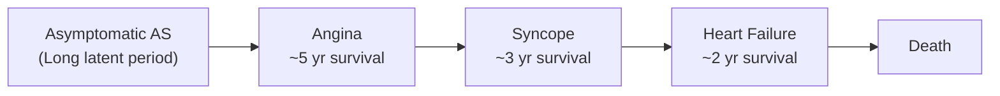
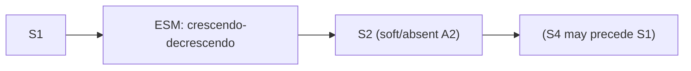

# Aortic Stenosis

## 1. Definition

Aortic stenosis (AS) is the pathological narrowing or obstruction of the aortic valve orifice, resulting in impedance to left ventricular outflow during systole. The name itself is informative: "aortic" = pertaining to the aorta/aortic valve; "stenosis" (Greek *stenōsis*) = narrowing. This creates a fixed obstruction that the left ventricle must overcome with every heartbeat, leading to a progressive pressure-overload state.

The obstruction can occur at three anatomical levels:
- **Valvular** (most common by far): the valve leaflets themselves are thickened, calcified, or fused
- **Subvalvular**: a fibrous membrane or muscular ridge below the valve (includes hypertrophic obstructive cardiomyopathy, HOCM)
- **Supravalvular**: narrowing of the ascending aorta above the valve (e.g., Williams syndrome)

For the purposes of these notes, we focus on **valvular aortic stenosis** unless otherwise specified.

<Callout title="Key Concept">
AS is the most common valvular heart disease requiring intervention in the developed world. Once symptomatic, the prognosis is dismal without treatment — worse than many cancers, including colon cancer [1][2].
</Callout>

---

## 2. Epidemiology

### Prevalence
- ***> 5% of people aged > 75 years have aortic valve disease*** [3]
- ***> 1 in 20 people in the elderly population have aortic valve disease*** [3]
- ***Prevalence approximately 14% in those > 75 years old*** (including aortic sclerosis and stenosis) [3]
- The prevalence is rising globally because populations are ageing — AS is fundamentally a disease of wear-and-tear in most patients

### Age and Sex Distribution
- Degenerative calcific AS: typically presents in the 7th–9th decade; **slightly more common in females** at the oldest ages [2]
- Bicuspid aortic valve AS: typically presents in the 6th–7th decade; **more common in males** (bicuspid AV occurs in 1–2% of the population, M > F ~3:1) [2]
- Rheumatic AS: presents earlier (3rd–5th decade), more common in developing countries and regions where rheumatic heart disease remains prevalent

### Hong Kong Context
- Hong Kong has an ageing population with increasing life expectancy (~85 years), so degenerative calcific AS is increasingly common
- Rheumatic heart disease has declined substantially but is still seen in older patients and immigrants from mainland China and Southeast Asia
- Bicuspid aortic valve remains a significant cause in middle-aged patients presenting to cardiac surgery units in Hong Kong
- AS is one of the most common reasons for cardiac surgery referral at centres such as Queen Mary Hospital and Grantham Hospital

---

## 3. Risk Factors

The risk factors for **degenerative calcific AS** overlap considerably with atherosclerotic risk factors, because the disease process shares similar pathological mechanisms (endothelial injury, lipid infiltration, inflammation, calcification):

| Risk Factor | Mechanism |
|---|---|
| Advanced age | Cumulative mechanical stress and endothelial injury over decades |
| Hypertension | Increased mechanical shear stress on valve leaflets |
| Hyperlipidaemia / Hypercholesterolaemia | Lipid infiltration into valve leaflets → inflammatory cascade → calcification |
| Diabetes mellitus | Accelerated vascular and valvular calcification |
| Smoking | Endothelial injury, oxidative stress |
| Chronic kidney disease / ESRD | Disordered calcium-phosphate metabolism → accelerated calcification |
| Male sex | Higher prevalence of bicuspid AV; earlier presentation |
| Bicuspid aortic valve | Abnormal haemodynamic stress on two leaflets instead of three → premature degeneration |
| Hyperuricaemia | Associated with calcific valve disease (mentioned in senior notes) [1] |
| Paget's disease of bone | Altered calcium metabolism |
| Previous rheumatic fever | Commissural fusion |

<Callout title="Atherosclerosis ≠ AS, but they share risk factors" type="idea">
Although degenerative AS shares risk factors with atherosclerosis, statins have NOT been shown to slow the progression of established AS in randomised controlled trials (SEAS, SALTIRE, ASTRONOMER trials). This is because by the time AS is established, the dominant process is osteoblastic calcification, not lipid accumulation. However, lipid-lowering in early aortic sclerosis may have some benefit — this remains under investigation.
</Callout>

---

## 4. Anatomy and Function of the Aortic Valve

### Normal Anatomy
The aortic valve sits at the junction between the left ventricular outflow tract (LVOT) and the ascending aorta. It is a **semilunar valve** with three cusps (leaflets):

1. **Right coronary cusp** (gives rise to the right coronary artery ostium)
2. **Left coronary cusp** (gives rise to the left coronary artery ostium)
3. **Non-coronary cusp** (posterior, no coronary artery)

Each cusp is a crescent-shaped ("semilunar" = half-moon) pocket of tissue. Behind each cusp is a small dilation of the aortic root called the **sinus of Valsalva**.

### Normal Valve Area and Function
- Normal aortic valve area (AVA): **3.0–4.0 cm²**
- The valve opens during systole to allow unimpeded ejection of blood from the LV into the aorta
- The valve closes during diastole, preventing backflow, and the coronary arteries fill during diastole (this is crucial for understanding why AS causes angina)

### Structural Composition
- Valve leaflets are composed of three layers:
  - **Ventricularis** (facing LV): rich in elastin — allows flexibility
  - **Spongiosa** (middle): glycosaminoglycans — acts as shock absorber
  - **Fibrosa** (facing aorta): dense collagen — provides structural strength
- Normally avascular in adults; neovascularity develops in diseased valves
- Contains valve interstitial cells (VICs) that can undergo osteoblastic differentiation in disease

### Relationship to Conduction System
The aortic valve annulus is in close anatomical proximity to the:
- **Bundle of His** and **left bundle branch** — which traverse the membranous interventricular septum just below the aortic valve
- This explains why **calcification of AS can extend into the conduction system**, causing heart block (particularly LBBB or complete heart block) [1][2]
- This also explains why **aortic valve replacement (AVR) can cause post-operative conduction abnormalities**

---

## 5. Etiology

### Overview of Causes by Age Group

***The three main causes of aortic stenosis are:*** [3][4]

| Age Group | Most Common Cause | Key Features |
|---|---|---|
| ***< 60 years*** | ***Congenital (bicuspid/unicuspid aortic valve)*** | Abnormal valve architecture → turbulent flow → premature calcification; bicuspid AV in 1–2% of population [2] |
| ***60–75 years*** | ***Calcified bicuspid aortic valve*** | Usually male; bicuspid valve degenerates 10–20 years earlier than a tricuspid valve [2] |
| ***> 75 years*** | ***Degenerative calcification (senile/calcific AS)*** | Most common overall; associated with atherosclerotic risk factors [2] |

Additionally:
- ***Rheumatic heart disease*** — commissural fusion ± calcification; nearly always associated with mitral valve involvement (~95%) [2][3]
- ***Other rare causes:*** [1]
  - Infective endocarditis (vegetations causing obstruction or destruction)
  - Hyperuricaemia (crystal deposition)
  - ***Williams syndrome*** — supravalvular AS (deletion of elastin gene on chromosome 7; "elfin facies," hypercalcaemia, developmental delay)
  - Paget's disease of bone
  - Radiation-induced valvular disease
  - Systemic lupus erythematosus (Libman-Sacks endocarditis)
  - Ochronosis (alkaptonuria)

### Detailed Pathophysiology by Etiology

#### A. Degenerative Calcific Aortic Stenosis (Most Common Overall)

This is essentially a disease of **"active biology, not passive wear-and-tear"**:

1. **Initiation phase** (similar to atherosclerosis):
   - Endothelial injury from mechanical stress (especially on the aortic side of leaflets where shear stress is highest)
   - Lipid infiltration (LDL, Lp(a)) into the fibrosa layer
   - Oxidation of lipids → recruitment of macrophages and T-lymphocytes
   - Inflammatory cytokine release (TNF-α, IL-1β, IL-6, TGF-β)

2. **Propagation phase** (diverges from atherosclerosis):
   - Valve interstitial cells (VICs) undergo **osteoblastic differentiation** (phenotypic switch)
   - Active bone formation within the valve leaflets — with hydroxyapatite deposition, bone morphogenetic proteins (BMP-2, BMP-4), and Runx2 transcription factor expression
   - This is why established AS does not respond to statins — it's an osteoblastic process, not just lipid accumulation

3. **End result**:
   - Progressive thickening, stiffening, and calcification of leaflets
   - Reduced leaflet mobility → progressive narrowing of orifice
   - **Aortic sclerosis** (thickening without obstruction) → **Aortic stenosis** (thickening with obstruction)

#### B. Bicuspid Aortic Valve

- **Congenital malformation** where the aortic valve has only two cusps instead of three
- Occurs in ~1–2% of the population; most common congenital cardiac malformation
- The two cusps experience **abnormal and asymmetric mechanical stress** → accelerated degeneration and calcification
- Typically presents with significant AS 10–20 years earlier than degenerative calcific AS
- **Associated conditions:**
  - Coarctation of the aorta (important to check!)
  - Ascending aortic aneurysm/dilatation (bicuspid aortopathy — due to intrinsic connective tissue abnormality of the aortic wall, NOT just haemodynamic effects)
  - Turner syndrome (45,XO) — associated with both bicuspid AV and coarctation
  - VSD (less common association)

#### C. Rheumatic Heart Disease

- Caused by Group A Streptococcal pharyngitis → molecular mimicry → autoimmune valvulitis
- **Commissural fusion** is the hallmark → leads to a "fish-mouth" or "buttonhole" orifice
- Almost always involves the **mitral valve** as well (~95% co-involvement) [2]
- More common in developing countries; in Hong Kong, seen in older patients or immigrants
- Can cause mixed AS/AR (combined stenosis and regurgitation)

#### D. Congenital (Unicuspid) Valve

- Rare; causes severe obstruction even in infancy/childhood
- Often presents with critical AS in neonates

<Callout title="Exam Pearl" type="idea">
If you see AS in a patient < 60 years → think **bicuspid aortic valve** first. If AS is associated with mitral valve disease → think **rheumatic heart disease**. If AS is in a patient > 75 years → think **degenerative calcific AS**.
</Callout>

---

## 6. Pathophysiology

This section is crucial — understanding the pathophysiology of AS explains virtually every clinical feature, investigation finding, and management decision. Let's build it from first principles.

### 6.1 The Core Problem: Fixed Obstruction to LV Outflow

The stenotic aortic valve creates a **pressure gradient** between the LV and the aorta during systole. The LV must generate much higher pressures than normal to push blood through the narrowed orifice.

**Gorlin formula** [1]: This formula relates the pressure gradient across the valve to the valve area, heart rate, and cardiac output. In simple terms:
- Smaller valve area → higher pressure gradient for the same cardiac output
- Higher cardiac output (e.g., exercise) → higher pressure gradient for the same valve area

### 6.2 Compensatory Phase: Concentric Left Ventricular Hypertrophy

According to the **Law of Laplace**: Wall stress = (Pressure × Radius) / (2 × Wall thickness)

When LV pressure increases chronically:
- The LV responds by **increasing wall thickness** (concentric hypertrophy) to normalise wall stress
- This is an **adaptive** mechanism initially — it allows the LV to generate the high pressures needed without excessive oxygen consumption
- The apex beat remains **sustained and heaving** but is **NOT displaced** (because the LV cavity does not dilate — this is concentric, not eccentric, hypertrophy)

***Cardiac output is initially maintained at the cost of a steadily increasing aortic valve pressure gradient*** [2]

### 6.3 Consequences of Concentric LVH

The hypertrophied LV becomes **thick and stiff** (reduced compliance). This has several critical consequences:

#### A. Diastolic Dysfunction

- The stiff, hypertrophied LV does not relax properly during diastole
- Higher filling pressures are needed to fill the LV adequately
- The **left atrium hypertrophies** to generate the extra "kick" needed (atrial contraction contributes up to 40% of LV filling in severe AS, compared to ~20% normally)
- This generates an **S4 gallop** (sound of blood hitting a stiff ventricle during atrial contraction)
- Loss of atrial contraction (e.g., onset of atrial fibrillation) can cause **acute haemodynamic deterioration** because the LV is so dependent on the atrial kick

<Callout title="Why AF is Dangerous in AS" type="error">
Patients with severe AS tolerate AF very poorly. The loss of atrial kick means the stiff LV is underfilled → dramatic drop in cardiac output → acute pulmonary oedema or syncope. This is a medical emergency. Never forget to check the rhythm in any AS patient who acutely deteriorates.
</Callout>

#### B. Angina

***Angina occurs because of a supply-demand mismatch:*** [2]

**Increased demand:**
- ***Increased LV muscle mass*** requires more oxygen [2]
- ***Increased wall stress*** (elevated intracavitary pressures) increases myocardial oxygen consumption

**Decreased supply:**
- ***Increased LV diastolic pressure impedes coronary flow into the myocardium*** [2]
- Coronary arteries fill during diastole; elevated LV diastolic pressure means the transmural pressure gradient driving coronary flow is reduced
- Subendocardial ischaemia occurs first (subendocardium is most vulnerable to ischaemia because it is furthest from the epicardial coronary arteries and is most compressed during systole)
- **50% of patients with AS have coexistent coronary artery disease** [2] — this compounds the ischaemia

This is why angina in AS occurs **even without coronary artery disease**.

#### C. Exertional Syncope

***Exertional syncope occurs because of inability to increase cardiac output + decreased SVR due to peripheral vasodilation → sudden decrease in BP leading to syncope*** [2]

Let's unpack this:
- During exercise, skeletal muscle arterioles dilate → systemic vascular resistance (SVR) drops
- Normally, the heart compensates by increasing cardiac output
- In severe AS, the cardiac output is **fixed** — the stenotic valve is the bottleneck and cannot accommodate increased flow
- The result: a fall in systemic BP → cerebral hypoperfusion → syncope
- Additional mechanism: exercise may trigger **ventricular arrhythmias** in the hypertrophied, ischaemic LV → another cause of syncope/sudden death

### 6.4 Decompensation Phase

***Decompensation occurs due to chronic LV pressure overload → rapid deterioration with LV failure (dilated LV) → pulmonary oedema*** [2]

Eventually, the compensatory mechanisms fail:
- The LV can no longer maintain adequate wall thickness relative to the pressure load
- LV wall stress rises → the LV begins to **dilate** (transition from concentric hypertrophy to eccentric hypertrophy/dilatation)
- LVEF falls → forward cardiac output drops
- LV end-diastolic pressure rises further → transmitted back to LA → pulmonary veins → **pulmonary oedema**
- If pulmonary hypertension develops → right heart failure (peripheral oedema, ascites, JVP elevation)

### 6.5 Natural History: The Critical Transition from Asymptomatic to Symptomatic

This is one of the most important concepts in AS:

***Natural History of AS:*** [4]
- ***The classic symptoms are: SOB (dyspnoea), LOC (syncope), chest pain (angina)*** [4]
- ***If symptoms appear: average survival is only 2–5 years*** [4]
- ***Without intervention, once symptomatic:*** [4]
  - Angina → mean survival ~5 years
  - Syncope → mean survival ~3 years
  - Heart failure → mean survival ~2 years

***The disease progresses slowly during the asymptomatic phase, but once symptoms appear, there is a dramatic increase in mortality*** [4].

- Average aortic valve area decreases by ~0.1 cm²/year
- Average peak gradient increases by ~7 mmHg/year
- Average jet velocity increases by ~0.3 m/s/year

<Callout title="Clinical Pearl: Sudden Death in AS">
Sudden cardiac death occurs in ~1% of asymptomatic patients per year, but in up to 15–20% of symptomatic patients. The mechanisms include ventricular arrhythmias (from LVH and ischaemia), complete heart block, and acute haemodynamic collapse. This is why symptomatic AS is an urgent indication for intervention.
</Callout>

---

## 7. Classification of Aortic Stenosis

### 7.1 By Level of Obstruction

| Level | Examples |
|---|---|
| **Supravalvular** | Williams syndrome, post-surgical (e.g., supra-aortic ridge), familial supravalvular AS |
| **Valvular** (most common) | Degenerative calcific, bicuspid AV, rheumatic |
| **Subvalvular** | Discrete fibromuscular membrane, HOCM (dynamic LVOT obstruction), tunnel-type subaortic stenosis |

### 7.2 By Severity (Echocardiographic Criteria — 2020/2021 ESC/AHA Guidelines)

| Parameter | Mild | Moderate | Severe |
|---|---|---|---|
| **Aortic valve area (AVA)** | > 1.5 cm² | 1.0–1.5 cm² | **< 1.0 cm²** (or < 0.6 cm²/m² indexed) |
| **Mean pressure gradient** | < 20 mmHg | 20–40 mmHg | **> 40 mmHg** |
| **Peak aortic jet velocity (Vmax)** | < 3.0 m/s | 3.0–4.0 m/s | **> 4.0 m/s** |
| **Velocity ratio (LVOT/AV)** | > 0.50 | 0.25–0.50 | < 0.25 |

***Poor prognostic factors include: heavy calcification, jet velocity > 4 m/s*** [2]

<Callout title="Low-Flow, Low-Gradient Severe AS" type="error">
A common exam pitfall: A patient with a severely calcified, immobile aortic valve but a **low gradient** ( < 40 mmHg) and **low AVA** ( < 1.0 cm²). This can occur in two scenarios:

1. **Classical low-flow, low-gradient AS** (LVEF < 50%): The LV is too weak to generate a high gradient. Use **dobutamine stress echo** — if AVA remains < 1.0 cm² with increasing flow, it is "true severe AS." If AVA increases to > 1.0 cm², it is "pseudo-severe AS."

2. **Paradoxical low-flow, low-gradient AS** (LVEF ≥ 50%): Small, hypertrophied LV with a low stroke volume index ( < 35 mL/m²) despite preserved EF. Seen in elderly hypertensive women. Genuinely severe AS but generates low gradients. Use CT calcium scoring to confirm.

Both are **genuinely severe** and carry a poor prognosis. Do not be falsely reassured by a low gradient!
</Callout>

### 7.3 By Symptom Status

| Category | Description |
|---|---|
| **Asymptomatic** | No symptoms at rest or with exertion; managed with surveillance |
| **Symptomatic** | Angina, syncope, or heart failure symptoms; **indication for intervention** |

---

## 8. Clinical Features

### 8.1 Symptoms

The **classic triad** of symptoms in AS (mnemonic: **"ASH"** — Angina, Syncope, Heart failure; or think **"SAD"** — Syncope, Angina, Dyspnoea):

| Symptom | Pathophysiological Basis | Details |
|---|---|---|
| ***Angina on exertion*** [1] | Supply-demand mismatch: ↑O₂ demand (LVH, ↑wall stress) + ↓O₂ supply (↑LVEDP impedes coronary flow + possible coexistent CAD in 50%) | Occurs in ~35% of patients with severe AS; may occur even without epicardial CAD |
| ***Syncope on exertion*** [1] | Fixed CO cannot increase with exercise + peripheral vasodilation → ↓cerebral perfusion; also ventricular arrhythmias from ischaemic/hypertrophied myocardium | Occurs in ~15% of patients; exertional syncope is a **red flag** for severe AS |
| ***Heart failure symptoms (SOBOE → orthopnoea → PND)*** [1] | LV decompensation → ↑LVEDP → ↑LA pressure → pulmonary congestion → dyspnoea | Dyspnoea is the most common presenting symptom (~50%); worst prognosis of the triad |
| Reduced exercise tolerance | Fixed cardiac output limits ability to increase flow during exertion; may also be due to diastolic dysfunction | May be subtle and insidious, especially in the elderly who reduce activity subconsciously |
| Palpitations | LVH predisposes to atrial and ventricular arrhythmias; loss of atrial kick in AF causes acute deterioration | AF, PVCs, and VT all more common |

<Callout title="'Masking' of Symptoms in the Elderly" type="error">
Elderly patients often subconsciously reduce their physical activity to avoid symptoms. They may deny symptoms because they attribute their limitations to "just getting old." Always perform a careful functional assessment and consider exercise testing in seemingly asymptomatic patients with severe AS.
</Callout>

### 8.2 Complications Presenting as Symptoms

| Complication | Mechanism |
|---|---|
| ***LV failure*** [1] | Progressive pressure overload → decompensation → LV dilatation → ↓EF |
| ***Arrhythmias*** [1] | LVH → myocardial fibrosis → re-entrant circuits → AF, VT, VF |
| ***Heart block*** [1] | ***Calcification extends into the conduction system*** (bundle of His, left bundle branch lie adjacent to the aortic valve annulus) |
| ***Heyde's syndrome → iron deficiency anaemia*** [1] | ***High shear stress across the stenotic aortic valve → mechanical degradation of large vWF multimers → acquired type IIA von Willebrand disease → GI bleeding from angiodysplasia*** (Heyde's syndrome) [1][5] |
| Infective endocarditis | Turbulent flow across abnormal valve → endothelial damage → nidus for infection |
| Calcified emboli | Severe calcific AS → calcified debris embolisation → stroke or peripheral embolism |
| Sudden cardiac death | Ventricular arrhythmias (VT/VF) in ischaemic, hypertrophied myocardium; acute haemodynamic collapse |

### 8.3 Signs

Let's go through the signs systematically, connecting each to the underlying pathophysiology:

#### General Inspection
- Patient may appear well (if compensated) or in heart failure (if decompensated)
- Look for signs of **heart failure**: elevated JVP, peripheral oedema, tachypnoea
- Malar flush may be present if pulmonary hypertension has developed (similar to mitral stenosis)

#### Pulse
- ***Low-volume, slow-rising pulse*** (pulsus **parvus et tardus** — "parvus" = small, "tardus" = slow) [1][2]
  - **Why?** The stenotic valve limits the rate and volume of blood ejection into the aorta → the arterial pulse rises slowly and reaches a lower peak
  - Best felt at the **carotid artery** (brachial/radial pulses may be unreliable in elderly with stiff arteries)
- ***Narrow pulse pressure*** [1]
  - **Why?** Reduced stroke volume means lower systolic pressure; diastolic pressure is maintained or slightly elevated → narrow pulse pressure

<Callout title="Caution in the Elderly" type="error">
In elderly patients with stiff, non-compliant arteries (arteriosclerosis), the classic slow-rising pulse may be masked. The stiff arteries transmit the pressure wave more rapidly, making the pulse feel more normal or even bounding despite severe AS. Do not rely on pulse character alone — always get an echocardiogram.
</Callout>

#### Blood Pressure
- Typically **low systolic BP** with narrow pulse pressure
- However, AS and systemic hypertension frequently coexist, especially in the elderly

#### Jugular Venous Pressure (JVP)
- Normal unless right heart failure has developed secondary to pulmonary hypertension
- May show a prominent **'a' wave** if RV hypertrophy/reduced compliance develops

#### Precordial Palpation

| Finding | Pathophysiological Basis |
|---|---|
| ***Sustained, heaving apex beat*** [1][2] | Concentric LVH → sustained powerful contraction (heaving = pressure overload); apex is NOT displaced unless decompensation with LV dilatation has occurred |
| ***Systolic thrill at aortic area (right 2nd intercostal space)*** [1][2] | Palpable vibration from turbulent flow through the stenotic valve; a thrill indicates at least moderate-to-severe AS |
| Thrill may also be felt in the **suprasternal notch** and over the **carotids** | Turbulence transmitted along the aorta and great vessels |

#### Auscultation

This is high-yield and frequently examined:

| Finding | Pathophysiological Basis |
|---|---|
| ***Ejection systolic murmur (ESM)*** | Turbulent flow through the stenotic valve during systole; crescendo-decrescendo ("diamond-shaped") pattern because flow velocity increases then decreases during systole |
| Best heard at **aortic area** (right 2nd ICS, parasternal) | Closest surface landmark to the aortic valve |
| ± **Radiates to bilateral carotids (neck)** | Turbulent flow transmitted along the direction of blood flow in the aorta and carotid arteries |
| ***Harsh quality, described as "saw cutting wood"*** [2] | High-velocity turbulent jet through a rigid, calcified orifice |
| ***Soft or absent A2*** (aortic component of S2) [1][2] | Calcified, immobile valve leaflets cannot "snap" shut properly; in severe AS, A2 may be inaudible |
| ***Reverse (paradoxical) splitting of S2*** [1] | Prolonged LV ejection time (because it takes longer to empty through a stenotic valve) → A2 is delayed beyond P2; normally A2 precedes P2, but in AS the order is reversed |
| ***S4 (fourth heart sound)*** [1][2] | Atrial contraction against a stiff, non-compliant, hypertrophied LV → audible "thump" just before S1 |
| ***Late systolic peaking of a long murmur*** [1] | In severe AS, peak flow velocity occurs later in systole → the peak of the crescendo-decrescendo murmur shifts later; an early-peaking murmur suggests milder AS |
| S3 (third heart sound) | If present, indicates LV systolic dysfunction/decompensation (dilated LV with high filling pressures); ominous sign |

**Severity assessment by auscultation:**

| Feature | Mild AS | Severe AS |
|---|---|---|
| Murmur peaking | Early systolic peaking | ***Late systolic peaking*** |
| Murmur duration | Short | ***Long*** |
| A2 | Normal | ***Soft or absent*** |
| S4 | Absent | ***Present*** |
| Systolic thrill | Absent | ***Present*** |
| S2 splitting | Normal | ***Paradoxical (reversed)*** |

#### Special Auscultatory Phenomena

- ***Gallavardin phenomenon*** [1]: In elderly patients with heavily calcified AS, the murmur may be best heard at the **apex** and may have a more musical quality, mimicking **mitral regurgitation**. This occurs because the high-frequency components of the AS murmur are selectively transmitted to the apex. Don't be fooled — listen at both the aortic area and apex, and check for radiation to the neck (AS) vs. axilla (MR).

- ***Pulmonary hypertension signs*** [1]: If long-standing AS has caused LV failure → pulmonary hypertension → loud P2, right heart failure signs
- ***Pulmonary congestion signs*** [1]: Bilateral basal crackles on lung auscultation if decompensated

<Callout title="Signs of Severity — Summary" type="idea">

The following signs point to **severe AS** [1][2]:
- ***Low-volume, slow-rising pulse***
- ***Narrow pulse pressure***
- ***Heaving, sustained apex (undisplaced)***
- ***Palpable systolic thrill***
- ***Soft/absent A2***
- ***Reversed (paradoxical) splitting of S2***
- ***S4***
- ***Late systolic peaking of a long, harsh ESM***
- ***Pulmonary hypertension / pulmonary congestion***
</Callout>

---

## 9. Investigations (Briefly, to be Expanded Later)

For completeness of the clinical picture before diagnosis:

| Investigation | Expected Findings | Rationale |
|---|---|---|
| **ECG** | ***LVH (Sokolow-Lyon or Cornell criteria), LV strain pattern (ST depression + T inversion in lateral leads), left axis deviation, conduction block (LBBB, 1st/2nd/3rd degree AV block)*** [1] | LVH from pressure overload; conduction block from calcification into septum |
| **CXR** | ***Cardiomegaly (if decompensated), pulmonary oedema, prominent pulmonary arteries, post-stenotic dilatation of ascending aorta, ± aortic valve calcification*** [1] | Heart size may be normal in compensated AS (concentric LVH does not enlarge the cardiac silhouette); calcification may be visible on lateral CXR |
| **Echocardiography** | Valve morphology, AVA, gradients, jet velocity, LVEF, LV wall thickness, associated lesions | Gold standard for diagnosis and severity assessment |
| **Coronary angiogram** | Assess for coexistent CAD | Required pre-operatively in most patients ≥ 40 years (50% have coexistent CAD) |
| ***Exercise testing*** | ***Not required if symptomatic*** [1]; can unmask symptoms in "asymptomatic" patients | Contraindicated in symptomatic severe AS (risk of syncope, arrhythmia, death) |

<Callout title="Exercise Testing in AS" type="error">
***Exercise testing is NOT required if the patient is symptomatic*** [1]. It is **contraindicated in symptomatic severe AS** because of the risk of fatal arrhythmia or haemodynamic collapse. It is only used in **asymptomatic patients with severe AS** to unmask symptoms or assess haemodynamic response, and must be done under close supervision.
</Callout>

---

## 10. Additional Important Concepts

### Heyde's Syndrome (Detailed)

***Heyde's syndrome = GI bleeding from angiodysplasia in the presence of aortic stenosis*** [1][5]

Mechanism:
1. Blood passes through the severely stenotic aortic valve at **high velocity and high shear stress**
2. This **mechanically unfolds and cleaves large von Willebrand factor (vWF) multimers** (the ADAMTS-13 metalloprotease is more effective under high shear)
3. Large vWF multimers are essential for **platelet adhesion** at sites of vascular injury
4. Their loss creates an **acquired type IIA von Willebrand disease**
5. Patients become prone to **mucocutaneous bleeding**, particularly from **angiodysplastic lesions** (which are common in the elderly, especially in the right colon/caecum)
6. This manifests as **iron deficiency anaemia** from chronic GI blood loss
7. **Correction of the AS** (e.g., AVR) normalises vWF multimers and resolves the bleeding tendency

This is a beautiful example of how haemodynamics affect haemostasis!

### Pulsus Bisferiens [1]

***Observed in mixed aortic valve lesions (combined AS + AR)*** — a pulse with two systolic peaks. The first peak is due to rapid ejection (percussion wave) and the second is due to reflected wave (tidal wave). This occurs when there is both a stenotic component (slow rise) and a regurgitant component (increased stroke volume from regurgitation).

---

## 11. Summary of Pathophysiology → Clinical Features Map

| Pathophysiology | Clinical Feature |
|---|---|
| Fixed LVOT obstruction → ↑LV pressure | Pressure-overloaded LV → concentric LVH |
| Concentric LVH → stiff LV | S4 gallop, diastolic dysfunction |
| Stiff LV → dependent on atrial kick | AF causes acute deterioration |
| ↑LV mass + ↑wall stress + ↑LVEDP → ischaemia | Angina (even without CAD) |
| Fixed CO + exercise-induced vasodilation | Exertional syncope |
| LV decompensation → ↑LVEDP → pulmonary congestion | Dyspnoea, orthopnoea, PND, pulmonary oedema |
| Slow ejection through stenotic valve | Slow-rising, low-volume pulse; narrow pulse pressure |
| Prolonged LV ejection time | Paradoxical splitting of S2; late-peaking ESM |
| Calcified, immobile leaflets | Soft/absent A2; systolic thrill |
| Calcification → conduction system | LBBB, heart block |
| High shear stress → vWF degradation | Heyde's syndrome (GI bleeding) |
| LVH → fibrosis → arrhythmogenic substrate | AF, VT, VF, sudden cardiac death |

---

<Callout title="High Yield Summary">

**Aortic Stenosis — Key Points:**

1. **Most common valvular heart disease** requiring intervention in the developed world; prevalence > 5% in those > 75 years

2. **Three main aetiologies:** degenerative calcific (elderly), bicuspid AV (middle-aged), rheumatic (associated with MV disease)

3. **Pathophysiology:** Fixed LVOT obstruction → concentric LVH → diastolic dysfunction → eventual decompensation with LV dilatation and failure

4. **Classic triad of symptoms** (SAD): **S**yncope, **A**ngina, **D**yspnoea — once symptomatic, prognosis is 2–5 years without intervention

5. **Key signs of severity:** Slow-rising pulse, narrow pulse pressure, heaving undisplaced apex, systolic thrill, soft/absent A2, reversed S2 splitting, S4, late-peaking long ESM

6. **Angina mechanism:** Supply-demand mismatch (↑demand from LVH; ↓supply from elevated LVEDP compressing coronary perfusion)

7. **Syncope mechanism:** Fixed CO + exercise-induced vasodilation → cerebral hypoperfusion; also ventricular arrhythmias

8. **Heyde's syndrome:** High shear → acquired type IIA vWD → GI bleeding from angiodysplasia

9. **Heart block:** Calcification extends from aortic annulus into adjacent conduction tissue (His bundle, left bundle branch)

10. **Exercise testing is contraindicated in symptomatic severe AS**

11. **Once symptomatic:** Angina ~5 yr survival, Syncope ~3 yr, Heart failure ~2 yr without intervention

</Callout>

---

<ActiveRecallQuiz
  title="Active Recall - Aortic Stenosis (Definition to Clinical Features)"
  items={[
    {
      question: "Name the three most common aetiologies of aortic stenosis and the age group each typically affects.",
      markscheme: "1. Degenerative calcific AS (> 75y, most common overall). 2. Bicuspid aortic valve (60-75y, most common in young/middle-aged). 3. Rheumatic heart disease (any age, ~95% with MV co-involvement). Accept congenital unicuspid for neonates.",
    },
    {
      question: "Explain why a patient with severe AS develops angina even in the absence of coronary artery disease.",
      markscheme: "Supply-demand mismatch. Demand is increased due to increased LV muscle mass and increased wall stress. Supply is decreased because elevated LV diastolic pressure impedes coronary perfusion (coronary arteries fill in diastole). Subendocardium is most vulnerable. Accept mention of 50% having coexistent CAD.",
    },
    {
      question: "What is Heyde's syndrome? Explain the pathophysiological mechanism.",
      markscheme: "GI bleeding from angiodysplasia associated with aortic stenosis. Mechanism: high shear stress across stenotic valve cleaves large vWF multimers causing acquired type IIA von Willebrand disease, leading to impaired platelet adhesion and bleeding from angiodysplastic lesions (usually right colon). Resolves after AVR.",
    },
    {
      question: "Why does severe AS cause a paradoxical (reversed) splitting of S2?",
      markscheme: "LV ejection time is prolonged because blood must be pushed through a stenotic valve for longer. This delays aortic valve closure (A2) so that A2 occurs after P2 instead of before it. Normally A2 precedes P2; in AS, the order reverses (paradoxical splitting).",
    },
    {
      question: "A 78-year-old woman with known severe AS develops new-onset atrial fibrillation and acute pulmonary oedema. Explain why AF is so poorly tolerated in AS.",
      markscheme: "In AS, concentric LVH makes the LV stiff with reduced compliance (diastolic dysfunction). The LV is heavily dependent on atrial contraction (atrial kick) for adequate filling (up to 40% of LV filling). AF causes loss of coordinated atrial contraction, dramatically reducing LV filling, causing acute drop in cardiac output and acute rise in LA/pulmonary pressures, leading to pulmonary oedema.",
    },
    {
      question: "What is the average survival once each of the three cardinal symptoms of AS develops (without intervention)?",
      markscheme: "Angina: approximately 5 years. Syncope: approximately 3 years. Heart failure (dyspnoea): approximately 2 years. Overall average survival 2-5 years once symptomatic.",
    },
  ]}
/>

---

## References

[1] Senior notes: Maksim Medicine Notes.pdf (p35, p37 — Valvular heart disease, terminologies, indications for valve replacement)
[2] Senior notes: Ryan Ho Cardiology.pdf (p158–160 — Aortic Stenosis, Aortic Regurgitation)
[3] Lecture slides: Cardiac Surgery Tutorial_Prof. D Chan.pdf (p48–49 — epidemiology, causes of AS)
[4] Lecture slides: Cardiac Surgery Tutorial_Prof. D Chan.pdf (p50–51 — natural history of AS, symptom onset and survival)
[5] Senior notes: Maksim Surgery Notes.pdf (p97 — Angiodysplasia, Heyde's syndrome)
[6] Senior notes: Ryan Ho Fundamentals.pdf (p210, p215, p281 — syncope, heart failure, lower GI bleeding/angiodysplasia)
