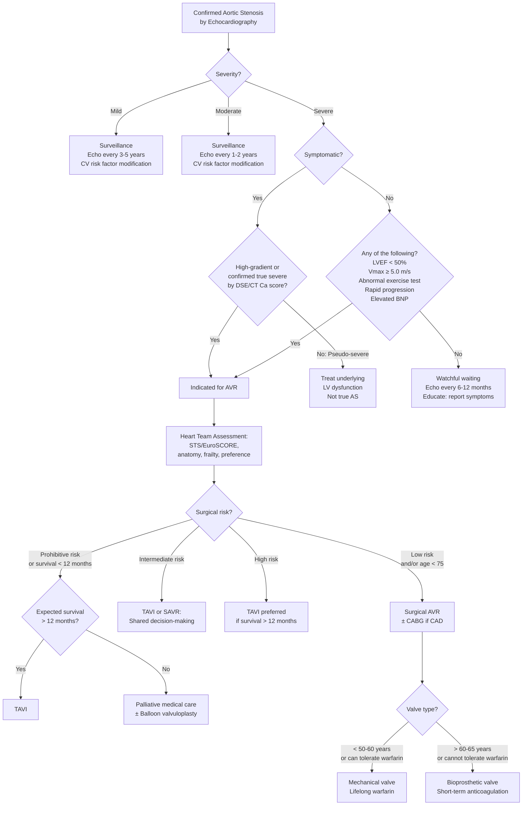

## Management of Aortic Stenosis

### 1. Foundational Principles

Before diving into specific treatments, let's establish the guiding principles that govern every management decision in AS. If you understand these, the algorithm becomes intuitive rather than memorised.

**Principle 1: There is no effective medical therapy that slows the progression of AS or improves survival.**

Unlike coronary artery disease or heart failure with reduced EF, where we have a rich pharmacological armamentarium (ACEIs, beta-blockers, statins), there is **no drug** that reverses or halts the calcification process in established AS. Statins were trialled extensively (SEAS, SALTIRE, ASTRONOMER) and **failed** — because established AS is driven by osteoblastic calcification, not lipid accumulation.

***No medication*** [3] — this is the stark reality. The only definitive treatment is **mechanical relief of the obstruction** by valve replacement.

**Principle 2: The decision to intervene hinges on the presence of symptoms or LV dysfunction.**

***Indication of surgery: Severe valve problem with: Symptom or Ventricular dysfunction*** [3]

This is the central decision point. Why? Because:
- During the **asymptomatic phase**, the risk of sudden death (~1%/year) is lower than the procedural risk of valve replacement
- Once **symptoms** appear, the prognosis deteriorates catastrophically (2–5 year survival without intervention) [4], making the procedural risk clearly worthwhile
- **LV dysfunction** (LVEF < 50%) in the absence of symptoms indicates that the myocardium is failing under the pressure load — waiting for symptoms at this point risks irreversible myocardial damage

**Principle 3: Preload is critical — drugs that reduce preload are dangerous.**

***Conservative if mild, asymptomatic… avoid drugs that decrease preload: LV output is dependent on adequate preload (with markedly increased afterload)*** [2]

Why? In severe AS, the LV faces a massive fixed afterload (the stenotic valve). The only way the LV can maintain cardiac output is through:
1. Vigorous contraction (maintained by the compensatory LVH)
2. **Adequate preload** (stretching the LV during diastole via the Frank-Starling mechanism)

If you reduce preload (with diuretics, nitrates, vasodilators), the LV cannot fill adequately → cardiac output drops precipitously → hypotension → syncope → cardiac arrest. This is why these drugs are used with extreme caution or avoided entirely in severe AS.

**Principle 4: The choice between SAVR and TAVI depends on surgical risk, anatomy, and patient preference.**

This is the modern management frontier — matching the right procedure to the right patient.

---

### 2. Medical Management (Conservative)

Medical therapy in AS is **purely palliative or preventive** — it does NOT change the natural history.

#### 2.1 When to Use Medical Management Alone

***Conservative if mild, asymptomatic (only 20% will progress over 20 years)*** [2]

- **Mild AS**: No intervention needed; surveillance only
- **Moderate AS**: Surveillance with serial echocardiography
- **Severe asymptomatic AS with preserved LV function and no exercise-induced abnormalities**: Watchful waiting with regular surveillance (but threshold for intervention is getting lower with improving procedural outcomes)
- **Patients unfit for any intervention**: Palliative medical therapy only

#### 2.2 Cardiovascular Risk Factor Modification

***Statin therapy to treat hypercholesterolaemia (progression associated with atherosclerotic risk factors)*** [2]

| Measure | Rationale |
|---|---|
| **Control hypertension** | Reduces additional LV afterload; use ACEIs/ARBs cautiously at low doses with careful monitoring; avoid aggressive vasodilation |
| **Statin therapy** | For hyperlipidaemia management and cardiovascular risk reduction; does NOT slow AS progression once established, but still indicated for overall CV risk [2] |
| **Diabetes management** | Reduces cardiovascular risk |
| **Smoking cessation** | General cardiovascular health |
| **Weight management and exercise** | Gentle exercise is safe in compensated asymptomatic AS; avoid strenuous isometric exercise |

#### 2.3 Drugs to AVOID or Use with Extreme Caution

***Avoid drugs that decrease preload: LV output dependent on adequate preload (with markedly increased afterload)*** [2]

| Drug Class | Why Dangerous in Severe AS | Notes |
|---|---|---|
| ***Diuretics*** [2] | Reduce preload → ↓LV filling → ↓CO → hypotension, syncope | May be cautiously used in small doses if patient has overt pulmonary oedema (decompensated AS), but must be done carefully with close haemodynamic monitoring |
| ***Vasodilators (including nitrates)*** [2] | Reduce afterload AND preload → in a system where afterload is fixed by the valve, the only effect is ↓preload → ↓CO → catastrophic hypotension | GTN spray/sublingual nitrate can cause profound hypotension in severe AS. Avoid as anti-anginal |
| **Beta-blockers (high dose)** | In severe AS with borderline LV function, negative inotropy may precipitate decompensation | Low-dose beta-blockers may be used cautiously for rate control in AF, but avoid high doses |
| **ACEIs/ARBs (high dose)** | Reduce afterload → similar mechanism to vasodilators; however, low-dose ACEI/ARB is increasingly considered safe and possibly beneficial for coexisting hypertension | Start low, go slow; monitor BP closely |

<Callout title="The Nitrate Trap" type="error">
A classic exam scenario: an elderly patient with severe AS presents with chest pain. The junior doctor gives sublingual GTN for presumed angina. The patient becomes profoundly hypotensive and loses consciousness. **Why?** Nitrates cause venodilation (↓preload) and mild arterial vasodilation (↓afterload). In severe AS, the fixed valvular obstruction means the LV cannot increase stroke volume to compensate for ↓preload → acute ↓CO → syncope. **Never give nitrates for angina in severe AS unless you are in a monitored setting with vasopressor backup.**
</Callout>

#### 2.4 Medical Management of Decompensated AS (Bridge Therapy)

When a patient with severe AS presents with acute heart failure while awaiting definitive intervention:

| Agent | Role | Mechanism | Caution |
|---|---|---|---|
| **IV frusemide** | Reduce pulmonary congestion | Loop diuretic → ↓preload → ↓pulmonary oedema | Use smallest effective dose; over-diuresis → ↓CO |
| **Dobutamine** | Inotropic support if cardiogenic shock | β₁-agonist → ↑contractility → ↑CO | Does not address the obstruction; temporising measure only |
| **Nitroprusside** (ICU setting only) | Careful afterload reduction if severe HF | Direct vasodilator → ↓afterload | Requires invasive BP monitoring; risk of catastrophic hypotension |
| **IABP** (intra-aortic balloon pump) | Mechanical circulatory support | Augments diastolic coronary perfusion; reduces afterload during systole | Bridge to definitive intervention |

---

### 3. Definitive Treatment: Valve Replacement

***Most of the aortic valve disease — very difficult to repair*** [3]

Unlike mitral valve disease where repair is often preferred over replacement, the aortic valve is rarely repairable because:
- Calcification destroys the leaflet tissue → nothing healthy to reconstruct
- The tri-leaflet geometry is difficult to restore
- Repair durability for AS is poor compared to replacement

Therefore, the definitive treatment is **aortic valve replacement (AVR)**, either surgical or transcatheter.

#### 3.1 Indications for Intervention

##### A. General Indications for Valve Replacement [1][2][3]

***General indications for valvular replacement:*** [1]
- ***Symptomatic (heart failure) despite optimal medical therapy***
- ***Asymptomatic, but severe disease defined by:***
  - ***Severe stenosis/regurgitation by ECHO criteria***
  - ***LV dilatation: LV end-systolic diameter***
  - ***LV systolic dysfunction: Impaired LVEF < 50%***
  - ***Complications, e.g. new-onset AF, pulmonary HT***
- ***Infective endocarditis despite optimal medical therapy***

##### B. Specific Indications for AVR in Severe AS (2021 ESC / 2020 ACC/AHA)

***Surgical AV replacement: more aggressive than MV due to markedly increased complication rate*** [2]

| Indication | Class | Explanation |
|---|---|---|
| ***Symptomatic severe high-gradient AS*** | **Class I** (must do) | Symptoms = angina, syncope, or HF; once present, median survival is 2–5 years without intervention [4] |
| ***Symptomatic severe LFLG AS with LVEF < 50%, confirmed true severe by dobutamine stress echo*** [2] | **Class I** | True severe AS despite low gradient; LV failure is FROM the AS; relieving obstruction allows LV recovery |
| ***Symptomatic paradoxical LFLG AS with LVEF ≥ 50%, confirmed by CT calcium scoring*** [2] | **Class IIa** | Genuinely severe AS despite seemingly preserved function; low flow from restrictive physiology |
| ***Asymptomatic severe AS with LVEF < 50%*** (without another cause for ↓EF) [2] | **Class I** | LV is failing silently from pressure overload; waiting for symptoms risks irreversible damage |
| ***Asymptomatic very severe AS (Vmax ≥ 5.0 m/s)*** [2] | **Class IIa** | Very high-risk lesion with high event rate even without symptoms (~5%/year sudden death risk) |
| ***Asymptomatic severe AS with abnormal exercise test (↓BP, symptoms)*** [2] | **Class IIa** | Unmasked symptoms on exercise = effectively symptomatic |
| ***During concomitant cardiac surgery*** (e.g., CABG, other valve surgery) [2] | **Class I/IIa** | Opportunity to address severe AS during an already planned open-heart procedure; avoids second operation |
| **Asymptomatic severe AS with rapid progression** (↑Vmax ≥ 0.3 m/s/year) | **Class IIa** | Markers of imminent symptom onset |
| **Asymptomatic severe AS with elevated BNP** (consistently > 3× age/sex-corrected normal) | **Class IIa** | Neurohormonal activation suggests subclinical decompensation |
| **Asymptomatic severe AS with severe valve calcification** + Vmax progression ≥ 0.3 m/s/year | **Class IIa** | Combined risk factors predict rapid transition to symptomatic disease |

<Callout title="Key Concept: Why Is Intervention for AS More Aggressive Than for MR/MS?">
***Surgical AV replacement is more aggressive than MV due to markedly increased complication rate*** [2]. This means we intervene EARLIER in AS than in many other valve diseases because:
1. The mortality once symptomatic is catastrophic (worse than colon cancer)
2. Sudden death is a real risk even in the asymptomatic phase (≈1%/year)
3. Once the LV decompensates, the operative risk rises dramatically and LV recovery may be incomplete
4. AVR has excellent outcomes when performed before irreversible myocardial damage
</Callout>

#### 3.2 Surgical Aortic Valve Replacement (SAVR)

SAVR has been the gold standard for over 50 years and remains the reference treatment for many patients.

##### A. Approach and Technique

| Aspect | Details |
|---|---|
| **Access** | Median sternotomy (traditional, full access); mini-sternotomy (upper hemisternotomy — less trauma, faster recovery); right anterior thoracotomy (minimally invasive) |
| **Cardiopulmonary bypass (CPB)** | Required — the heart must be arrested to operate on the aortic valve. Blood is diverted through the heart-lung machine, which oxygenates and circulates it while the heart is stopped with cardioplegia |
| **Procedure** | Aortotomy → excision of diseased native valve and annular debridement → sizing of annulus → implantation of prosthetic valve → closure of aortotomy → weaning from CPB |

##### B. Prosthetic Valve Options

***The choice of type of prosthetic heart valve should be a shared decision-making process that accounts for the patient's values and preferences and includes discussion of the indications for and risks of anticoagulant therapy and the potential need for and risk associated with reintervention*** [3]

| Type | Examples | Advantages | Disadvantages | Typical Indication |
|---|---|---|---|---|
| **Mechanical valve** | St. Jude (bileaflet tilting disc), Medtronic Hall, Starr-Edwards (ball-and-cage, historical) | Extremely durable (last 20–30+ years); low structural failure rate | ***Requires lifelong anticoagulation (warfarin, INR 2.5–3.5)*** → risk of bleeding; audible click; teratogenic (warfarin in pregnancy) | **Younger patients (< 50–60 years)** who can tolerate lifelong anticoagulation; want to avoid reoperation |
| **Bioprosthetic (tissue) valve** | Porcine (e.g., Hancock, Carpentier-Edwards), bovine pericardial (e.g., Edwards Perimount), homograft (human cadaveric) | **No need for long-term anticoagulation** (only 3–6 months warfarin or antiplatelet); lower thromboembolic risk | **Limited durability (10–20 years)** → structural valve degeneration → may need reoperation or valve-in-valve TAVI | **Older patients (> 60–65 years)** who are expected to outlive the valve OR who cannot tolerate anticoagulation; women of childbearing age (avoid warfarin) |

**How to decide: The "55–65 zone"**

- **< 50 years**: Generally mechanical (longer durability needed; lower reoperation risk; can tolerate warfarin)
- **50–65 years**: Shared decision-making; increasingly bioprosthetic with the advent of valve-in-valve TAVI as a fallback for future degeneration
- **> 65 years**: Generally bioprosthetic (expected lifespan matches valve durability; avoid anticoagulation risks in elderly)

***Patient preferences after understanding risk and benefits*** [3] — the patient MUST be part of this conversation. Some younger patients prefer a bioprosthesis to avoid warfarin (lifestyle factors, contact sports, pregnancy planning), accepting the risk of future reintervention.

##### C. Special Considerations

| Scenario | Approach |
|---|---|
| **Concomitant coronary artery disease** | Combined AVR + CABG in a single operation; mortality slightly higher than isolated AVR (~3–5% vs 1–3%) but avoids a second procedure |
| **Bicuspid AV with ascending aortic dilatation** | AVR + ascending aortic replacement (Bentall procedure or separate supracoronary graft) if ascending aorta ≥ 45 mm (≥ 50 mm for tricuspid AV) |
| **Small aortic root** | Risk of ***patient-prosthesis mismatch (PPM)*** → ***prosthesis is too small for the patient → patient remains in aortic stenosis or pathology not completely corrected*** [3]. Solutions: aortic root enlargement (Nicks, Manouguian, or Konno procedures) or use of stentless/sutureless valve; or TAVI with supra-annular positioning |

##### D. Outcomes and Complications

| Outcome | Details |
|---|---|
| **Operative mortality** | Isolated SAVR: 1–3%; AVR + CABG: 3–5% |
| **Long-term survival** | Excellent if performed before irreversible LV damage; 10-year survival ~60–70% |
| **Complications** | See below in complications section; key ones: ***heart block (3rd degree AV block due to calcification of upper IV septal tissue or post-AVR)*** [2], stroke, bleeding, wound infection, prosthetic valve endocarditis, structural valve degeneration (bioprosthetic), thromboembolism (mechanical) |

#### 3.3 Transcatheter Aortic Valve Implantation (TAVI / TAVR)

TAVI is the transformative innovation of the last two decades. The name tells you what it is: "trans" = across, "catheter" = tube-based delivery system; the valve is implanted via a catheter without open-heart surgery.

##### A. Concept and Mechanism

A bioprosthetic valve mounted on a collapsible stent frame is delivered via a catheter (usually through the femoral artery — "transfemoral" approach) and deployed within the diseased native aortic valve without excising it. The native calcified leaflets are pushed aside by the expanding stent frame, and the new valve sits inside the old one.

##### B. Access Routes

| Route | Description | When Used |
|---|---|---|
| **Transfemoral (TF)** | Through femoral artery → retrograde up aorta to aortic valve | **Default** route; least invasive; best outcomes |
| **Transapical (TA)** | Through small left thoracotomy → direct puncture of LV apex | When iliofemoral arteries are too small, calcified, or tortuous for transfemoral access |
| **Transaortic (TAo)** | Through mini-sternotomy → direct puncture of ascending aorta | Alternative when TF not feasible |
| **Subclavian/axillary** | Through subclavian/axillary artery | Alternative when TF not feasible |
| **Transcaval** | Through IVC → puncture into aorta | Rare; investigational |

##### C. Indications (2021 ESC / 2020 ACC/AHA)

***TAVI for patients with high surgical risk and post-TAVI survival > 12 months*** [2]

| Risk Category | Recommended Approach | Rationale |
|---|---|---|
| **Low surgical risk** (STS/EuroSCORE II < 4%) | ***Surgical AVR*** [2] — but TAVI is now increasingly accepted based on PARTNER 3 and Evolut Low Risk trials | SAVR has the longest track record; TAVI durability data beyond 10 years is limited |
| **Intermediate surgical risk** (STS 4–8%) | **TAVI or SAVR** — shared decision-making; TAVI increasingly preferred especially if transfemoral access is feasible | PARTNER 2 and SURTAVI trials showed non-inferiority of TAVI |
| **High surgical risk** (STS > 8%) | ***TAVI preferred*** [2] | Lower procedural risk than SAVR; comparable or superior outcomes |
| **Prohibitive surgical risk / inoperable** | **TAVI** if expected survival > 12 months | Only option for definitive treatment; better than medical therapy alone |
| **Extreme frailty / expected survival < 12 months** | **Palliative medical care** | Futility of intervention; TAVI will not improve quality or quantity of life |

***Use STS score / EuroSCORE to stratify risk*** [2]

**Age-based guidance (simplified, 2021 ESC):**
- **< 75 years**: Favour SAVR (unless high/prohibitive risk)
- **≥ 75 years**: Favour TAVI (especially if transfemoral access feasible)
- This is a simplification — the Heart Team (cardiologist + cardiac surgeon + anaesthetist + geriatrician) should make individualised decisions

##### D. TAVI-Specific Complications

| Complication | Mechanism | Incidence |
|---|---|---|
| **Vascular access complications** | Large-bore catheter through iliofemoral arteries → dissection, perforation, pseudoaneurysm | 5–15% (decreasing with newer lower-profile devices) |
| **Conduction disturbances / need for permanent pacemaker** | TAVI stent frame exerts radial force on the LVOT and interventricular septum → compression of the bundle of His/left bundle branch | 10–25% (higher with self-expanding valves like CoreValve; lower with balloon-expandable like SAPIEN) |
| **Paravalvular leak (PVL)** | Unlike SAVR where the native valve is excised and the prosthesis is sewn to the annulus, in TAVI the native calcified leaflets remain → gaps between stent frame and irregular native annulus | More common than SAVR; mild PVL usually tolerated; moderate/severe PVL associated with worse outcomes |
| **Stroke** | Manipulation of catheters across calcified aortic arch → embolisation of debris | 2–4%; cerebral embolic protection devices reduce this |
| ***Coronary obstruction*** | Displaced native calcified leaflets obstruct coronary ostia | Rare (< 1%) but catastrophic; more common with low coronary heights and bulky calcification |
| **Valve thrombosis** | Thrombus formation on bioprosthetic leaflets | Clinical: rare; subclinical (on CT): more common; uncertain clinical significance; usually responds to anticoagulation |
| **Annular rupture** | Over-sizing of prosthesis relative to annulus | Very rare; lethal if uncontained |

***TAVI may induce MI → PCI beforehand*** [2] — this refers to the risk that coronary obstruction during TAVI can cause acute MI, and that significant coexistent CAD should ideally be treated with PCI before or at the time of TAVI.

##### E. TAVI vs SAVR — Key Differences

| Feature | SAVR | TAVI |
|---|---|---|
| **Approach** | Open heart surgery (sternotomy + CPB) | Catheter-based (usually transfemoral) |
| **Native valve** | Excised | Left in situ (pushed aside) |
| **Paravalvular leak** | Very low (valve sewn to annulus) | Higher (native valve creates irregular surface) |
| **Pacemaker need** | 3–5% | 10–25% |
| **Stroke** | Lower with newer TAVI devices | Historically higher but now comparable |
| **Recovery time** | 1–2 weeks in hospital; 6–12 weeks full recovery | 1–3 days; rapid mobilisation |
| **Durability** | Well-established (mechanical > 20 years; bioprosthetic 10–20 years) | Limited long-term data (5–10 year data encouraging) |
| **Valve-in-valve option** | Need redo surgery (higher risk) | **TAVI valve-in-valve** for degenerated bioprosthetic (either surgical bioprosthesis or prior TAVI) — this is changing the landscape of valve selection |

#### 3.4 Percutaneous Aortic Balloon Valvuloplasty (BAV)

***Percutaneous aortic balloon dilatation: poor results with up to 50% recurrence within 6 months → usually only as bridge to surgery if severe symptoms*** [2]

| Aspect | Details |
|---|---|
| **Procedure** | Balloon catheter advanced retrogradely across the aortic valve → inflation → fractures calcific deposits → ↑valve area |
| **Results** | Modest and **temporary** improvement in gradient and symptoms |
| **Restenosis rate** | **≈50% within 6 months** — the fractured calcium re-accumulates rapidly |
| **Indications** | (1) Bridge to SAVR or TAVI in haemodynamically unstable patients; (2) Palliative in patients unfit for any definitive intervention; (3) Diagnostic — to assess whether symptoms improve with relief of obstruction (especially in LFLG AS to determine if LV dysfunction is reversible) |
| **NOT a definitive treatment** | Does NOT improve long-term survival; only buys time |

---

### 4. Surveillance of Asymptomatic AS

For patients who do not yet meet intervention criteria, structured surveillance is essential:

| Severity | Echo Interval | Clinical Review |
|---|---|---|
| **Mild AS** (Vmax 2.0–2.9 m/s) | Every **3–5 years** | Annual clinical review; patient education to report symptoms |
| **Moderate AS** (Vmax 3.0–3.9 m/s) | Every **1–2 years** | 6-monthly clinical review |
| **Severe AS** (Vmax ≥ 4.0 m/s), asymptomatic | Every **6–12 months** | Every 6 months; consider exercise testing to unmask symptoms |
| **Very severe AS** (Vmax ≥ 5.0 m/s) | Every **6 months** | Consider early intervention even if asymptomatic |

---

### 5. Special Populations

| Population | Considerations |
|---|---|
| **Elderly (> 80 years)** | TAVI preferred if transfemoral access feasible; frailty assessment critical; avoid futile intervention if life expectancy < 12 months |
| **Bicuspid AV** | SAVR preferred (TAVI outcomes in bicuspid AV are less predictable due to asymmetric calcification and elliptical annulus, though newer-generation TAVI devices are improving); assess ascending aorta for concomitant aortopathy |
| **Concomitant CAD** | SAVR + CABG if surgical; PCI before TAVI if transcatheter approach chosen [2] |
| **Pregnancy** | Severe AS + pregnancy is high-risk; ideally intervene before pregnancy; if symptomatic during pregnancy, balloon valvuloplasty can be performed as a bridge |
| **Concurrent severe AR + AS (mixed disease)** | SAVR required; TAVI relies on the native stenotic valve to anchor the prosthesis — in pure AR without calcific stenosis, ***transcatheter AVR CANNOT be done (relies on stenotic AV to hold prosthetic valve in place)*** [2] |
| **Infective endocarditis** | ***Infective endocarditis despite optimal medical therapy*** is an indication for surgery [1]; SAVR with thorough debridement; TAVI generally contraindicated in active IE |

---

### 6. Management Algorithm — Complete Decision Tree

---

### 7. Post-Intervention Management

| Aspect | Mechanical Valve | Bioprosthetic Valve (SAVR or TAVI) |
|---|---|---|
| **Anticoagulation** | Lifelong warfarin (INR 2.5–3.5 for aortic position); avoid DOACs (RE-ALIGN trial showed harm with dabigatran in mechanical valves) | Warfarin for 3–6 months post-SAVR (INR 2.0–3.0), then switch to aspirin alone; or aspirin + clopidogrel for 3–6 months post-TAVI, then aspirin alone |
| **Endocarditis prophylaxis** | Lifelong antibiotic prophylaxis for dental/surgical procedures (prosthetic valve is high-risk for IE) | Same as mechanical |
| **Surveillance echo** | Annual TTE to assess prosthetic valve function (gradient, regurgitation, LV recovery) | Annual TTE; watch for structural valve degeneration (increasing gradient, new regurgitation) especially after 5–10 years |
| **LV recovery** | Expect LVH regression over 6–18 months if intervention was timely; incomplete regression if delayed | Same |
| **Activity** | No contact sports (risk of bleeding with warfarin; risk of valve damage) | Generally unrestricted after recovery |

---

<Callout title="High Yield Summary — Management of Aortic Stenosis">

1. ***No medication can halt or reverse AS progression*** — definitive treatment is valve replacement

2. ***Indication for intervention: severe AS with symptoms OR ventricular dysfunction*** — this is the cardinal rule

3. ***Avoid preload-reducing drugs in severe AS*** (diuretics, nitrates, vasodilators) — the LV depends on adequate preload to maintain output against the fixed obstruction

4. **SAVR** = gold standard, especially for low/intermediate risk and younger patients; choose mechanical (lifelong warfarin) vs bioprosthetic (limited durability) based on age, lifestyle, and shared decision-making

5. **TAVI** = preferred for high/prohibitive surgical risk, elderly (≥ 75 years), transfemoral access feasible; higher pacemaker rates and paravalvular leak than SAVR

6. ***Balloon valvuloplasty: poor results, 50% recurrence within 6 months*** — bridge to definitive therapy only

7. ***Most aortic valves cannot be repaired*** — unlike mitral valve, replacement is almost always necessary

8. ***Patient-prosthesis mismatch***: prosthesis too small → patient remains in AS; prevent by careful sizing

9. ***TAVI cannot be done for pure AR*** — relies on the calcified stenotic native valve to anchor the prosthesis

10. ***Valve choice is a shared decision-making process accounting for patient values and preferences***

</Callout>

---

<ActiveRecallQuiz
  title="Active Recall - Management of Aortic Stenosis"
  items={[
    {
      question: "Why are nitrates and diuretics dangerous in severe aortic stenosis? Explain the haemodynamic mechanism.",
      markscheme: "In severe AS, the LV faces a fixed, markedly increased afterload from the stenotic valve. Cardiac output is maintained by the Frank-Starling mechanism and depends on adequate preload. Nitrates and diuretics reduce preload (venodilation, volume depletion). With reduced preload and fixed afterload, the LV cannot increase stroke volume to compensate, leading to precipitous fall in cardiac output, hypotension, syncope, and potentially cardiac arrest.",
    },
    {
      question: "List the indications for aortic valve intervention in asymptomatic severe AS.",
      markscheme: "1. LVEF < 50% without another cause. 2. Very severe AS with Vmax >= 5.0 m/s. 3. Abnormal exercise test (symptoms, fall in BP, arrhythmia). 4. Rapid progression (Vmax increase >= 0.3 m/s/year). 5. Markedly elevated BNP (> 3x age/sex normal). 6. During concomitant cardiac surgery. 7. Severe valve calcification with rapid progression.",
    },
    {
      question: "A 72-year-old man with severe symptomatic AS has STS score 2% and good transfemoral access. What procedure would you recommend, and what valve type would you discuss?",
      markscheme: "Low surgical risk (STS < 4%). Either SAVR or TAVI is acceptable; SAVR is traditionally preferred at age < 75 with low risk, but TAVI increasingly accepted. Discuss both options (shared decision-making). For valve type: at age 72, bioprosthetic valve is generally preferred (avoid lifelong warfarin; expected lifespan approximately matches valve durability of 10-20 years; valve-in-valve TAVI available as future option if degeneration occurs).",
    },
    {
      question: "What is the role of balloon aortic valvuloplasty in the management of AS, and why is it not a definitive treatment?",
      markscheme: "Balloon valvuloplasty provides temporary improvement by fracturing calcific deposits and increasing valve area. However, it has up to 50% restenosis rate within 6 months because the calcium re-accumulates. It does not improve long-term survival. Used only as: (1) Bridge to SAVR/TAVI in haemodynamically unstable patients, (2) Palliative in patients unfit for any definitive intervention, (3) Diagnostic to assess if symptoms improve with obstruction relief (especially in LFLG AS).",
    },
    {
      question: "Why can TAVI not be performed for isolated severe aortic regurgitation without stenosis?",
      markscheme: "TAVI relies on the calcified, stenotic native aortic valve to anchor and hold the prosthetic stent-valve in position. In pure AR without calcific stenosis, there is no rigid scaffold for the TAVI prosthesis to grip against, and the device would migrate/embolise. Therefore, surgical AVR is required for pure AR. This is mentioned specifically in the notes on AR management.",
    },
    {
      question: "Compare mechanical and bioprosthetic aortic valve prostheses in terms of durability, anticoagulation requirement, and typical patient selection.",
      markscheme: "Mechanical: durable (20-30+ years), requires lifelong warfarin (INR 2.5-3.5), risk of bleeding; best for younger patients (< 50-60 years) who can tolerate anticoagulation and want to avoid reoperation. Bioprosthetic: limited durability (10-20 years), no long-term anticoagulation needed (only 3-6 months warfarin or antiplatelet), risk of structural valve degeneration requiring reoperation; best for older patients (> 60-65 years) or those who cannot tolerate anticoagulation. Choice should be shared decision-making between patient and Heart Team.",
    },
  ]}
/>

## References

[1] Senior notes: Maksim Medicine Notes.pdf (p35, p37 — Valvular heart disease management, general indications for valvular replacement)
[2] Senior notes: Ryan Ho Cardiology.pdf (p159 — AS treatment approach: conservative, SAVR, TAVI, balloon dilatation, indications; p161 — AR management and TAVI limitation for pure AR)
[3] Lecture slides: Cardiac Surgery Tutorial_Prof. D Chan.pdf (p36 — treatment principles: no medication, indication of surgery; p56 — aortic valve not repairable; p60 — EOAI and patient-prosthesis mismatch; p70 — shared decision-making for prosthetic valve choice)
[4] Lecture slides: Cardiac Surgery Tutorial_Prof. D Chan.pdf (p51 — natural history: average survival 2–5 years once symptomatic)
