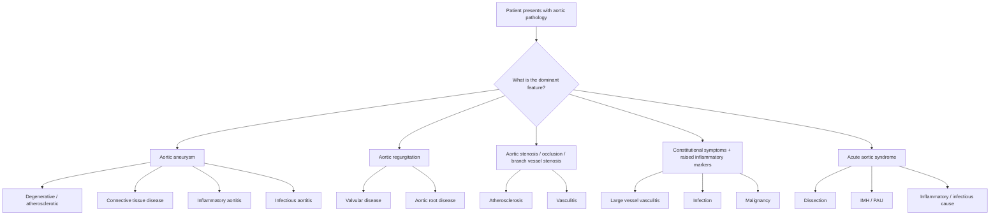
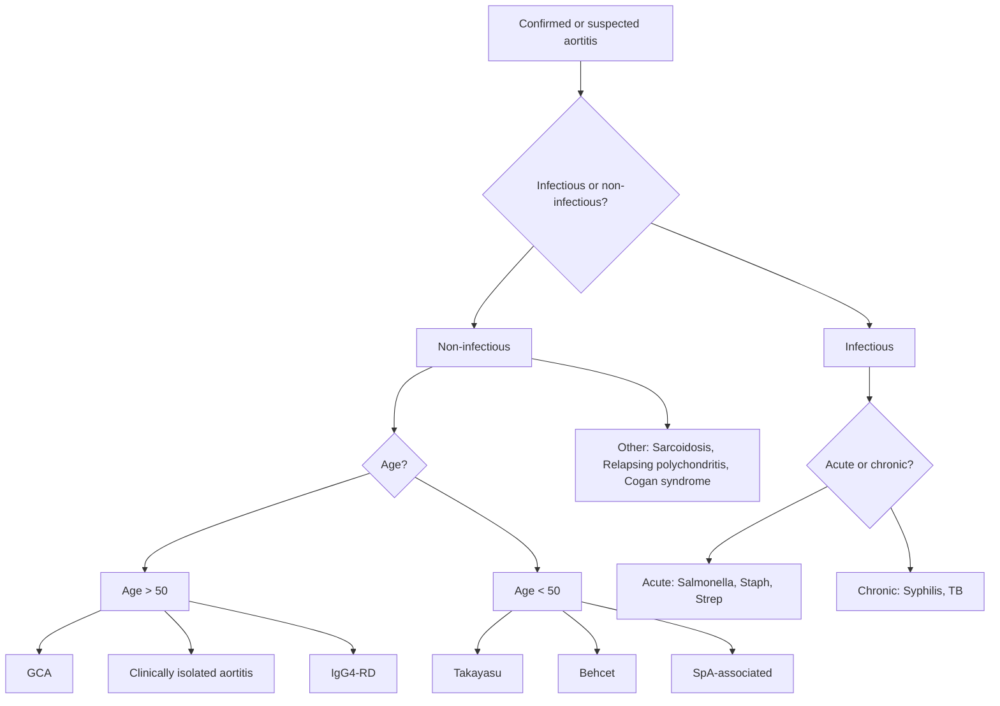

## Differential Diagnosis of Aortitis

When you encounter a patient in whom you suspect aortitis — whether the presentation is unexplained aortic aneurysm, new aortic regurgitation, constitutional symptoms with raised inflammatory markers, or asymmetric pulses — the differential diagnosis must be approached systematically. The challenge is twofold: (1) distinguishing aortitis from non-inflammatory aortic pathology, and (2) identifying the specific cause of the aortitis itself.

Let me walk you through this the way you'd think at the bedside.

---

### A. Framework for Approaching the Differential Diagnosis

The differential depends entirely on **how the patient presents**. Aortitis rarely declares itself with a sign saying "I am aortitis." Instead, you encounter one of several clinical scenarios, and aortitis sits within a broader differential for each:

---

### B. Differential Diagnosis by Clinical Scenario

#### Scenario 1: Patient Found to Have an Aortic Aneurysm

This is perhaps the most common way aortitis comes to attention — an aneurysm is discovered (often incidentally), and the question is whether it is "ordinary" degenerative/atherosclerotic or something else.

| Differential | Key Features | Why it's on the differential |
|---|---|---|
| **Degenerative / atherosclerotic aneurysm** (commonest) | Elderly male, smoking history, ***95% associated with atherosclerosis*** [1][5], ***97% infrarenal*** [2], often asymptomatic, ***pulsatile and expansile mass*** [5] | By far the most common cause of AAA. Typically infrarenal, fusiform, in an elderly man with cardiovascular risk factors. |
| ***Connective tissue disease*** | Younger patient, Marfanoid habitus (tall, arachnodactyly, pectus), joint hypermobility (EDS), family history. ***Marfan's, Ehlers-Danlos IV*** [1] | These conditions cause structural weakness of the aortic wall (fibrillin-1 deficiency in Marfan, collagen III deficiency in EDS IV) → aneurysm at a younger age, often involving the ascending aorta/root. |
| **GCA-related aortitis** | Age > 50, F > M, temporal headache, jaw claudication, PMR symptoms, ***ESR > 50***, ***temporal artery tenderness/decreased pulsation*** [4] | GCA causes thoracic aortic aneurysm (ascending > arch). Risk is 17× higher than age-matched controls. May present silently. |
| **Takayasu arteritis** | ***Females < 50 years, especially Asians***, ***absent/weak pulses (60%), bruits (80%), asymmetric BP (50%)*** [3][6] | Can cause aneurysmal dilatation (especially of the aortic arch/descending aorta) in addition to stenosis. |
| **IgG4-related aortitis** | Middle-aged male, ***storiform fibrosis, lymphoplasmacytic infiltrate of mainly IgG4+ plasma cells*** [7], thick periaortic fibrosis on CT, may have other IgG4-RD features (AIP, sclerosing cholangitis, sialadenitis). ***Group 2 phenotype: retroperitoneal fibrosis ± aortitis*** [7] | Presents as inflammatory AAA. The aneurysm is surrounded by a thick rind of soft tissue (unlike simple atherosclerotic AAA). Responds to steroids. |
| **Infectious (mycotic) aortitis** | Fever, leucocytosis, positive blood cultures, saccular aneurysm with rapid expansion, air/gas in aortic wall on CT. ***Non-typhoid Salmonella, Staphylococcus, Syphilis*** [5] | Organisms seed atherosclerotic plaque or the wall via vasa vasorum. Saccular morphology, unusual location, or rapid growth should raise suspicion. |
| **Syphilitic aortitis** | ***Ascending aorta involvement***, AR, coronary ostial stenosis, "tree-bark" intima. ***Syphilitic aortitis*** as a cause of ***aortic root dilatation (supravalvular)*** [2][8] | Tertiary syphilis. Obliterative endarteritis of vasa vasorum → ascending aortic aneurysm. Now rare but still seen. |
| **Behçet disease** | ***Oral ulcers, urogenital ulcers, ocular inflammation***, ***HLA-B51***, young male along Silk Road (Turkey, Middle East, ***China***) [3] | Behçet can cause saccular aortic aneurysms with high rupture risk. Arterial involvement is less common than venous but carries worse prognosis. |

<Callout title="Red Flags for Non-Atherosclerotic Aneurysm" type="idea">
Suspect an inflammatory or infectious cause when the aneurysm is:
- In an **unusual location** (ascending aorta, arch, suprarenal)
- In a **young patient** without typical atherosclerotic risk factors
- **Saccular** rather than fusiform
- **Rapidly expanding** on serial imaging
- Surrounded by **periaortic soft tissue thickening** on CT (IgG4-RD, infectious)
- Associated with **constitutional symptoms** (fever, weight loss, raised ESR/CRP)
</Callout>

---

#### Scenario 2: Patient Presents with Aortic Regurgitation

The question here is whether the AR is due to **valve cusp disease** or **aortic root/ascending aortic dilatation** — the latter being the domain of aortitis.

***Aetiology of AR*** [2][8]:

| Category | Causes | Mechanism |
|---|---|---|
| ***Cusp disease*** | ***Degenerative (MC), RHD, congenital (bicuspid AV), IE, aortic dissection*** [8] | Primary damage to the valve leaflets themselves |
| ***Aortic root dilatation (supravalvular)*** | ***Hypertension, syphilitic aortitis, inflammatory (AS/SpA), CT disease (Marfan's, EDS)*** [8] | The annulus dilates → cusps are pulled apart → coaptation failure → regurgitation. The cusps themselves may be structurally normal. |

For aortitis-related AR, think:
- **Syphilitic aortitis**: ascending aortic aneurysm → root dilatation → AR. Also causes coronary ostial stenosis → angina.
- ***Spondyloarthropathy (AS, ReA)***: ***aortitis, AI, conduction defects*** [9]. The mechanism is a ***sclerosing inflammatory process involving aortic root, AV cusps and IV septum*** [9]. Fibrosis thickens and retracts the cusps + may extend into the conduction system → heart block.
- **GCA**: ascending aortic aneurysm/dilatation → AR.
- **Relapsing polychondritis**: aortic root inflammation → AR (10–15% of cases).
- **Behçet disease**: aortic root involvement (less common).

---

#### Scenario 3: Patient Presents with Asymmetric Pulses, Bruits, or Limb Claudication

This is the "stenotic/occlusive" presentation of large vessel vasculitis. The differential here includes:

| Differential | Key Features |
|---|---|
| **Takayasu arteritis** | ***Pulseless disease***, ***females < 50, Asians***, ***bruits (80%), absent/weak pulses (60%), limb claudication (70%), asymmetric BP (50%)*** [3][6] |
| **GCA (large vessel)** | > 50 years, may have temporal headache/PMR, bruits over subclavian/axillary, upper limb claudication |
| **Atherosclerosis** | Older patient with CV risk factors, ***Leriche syndrome*** (gradual occlusion of terminal aorta → absent femoral pulses, intermittent claudication, gluteal pain, impotence) [5]. Lower limb predominant. |
| **Aortic coarctation** | Young patient, upper limb hypertension with weak femoral pulses, rib notching on CXR. Congenital. |
| **Fibromuscular dysplasia (FMD)** | Young to middle-aged women, "string of beads" on angiography, most commonly renal arteries → renovascular HTN |
| **Mid-aortic syndrome** | Narrowing of the abdominal aorta ± renal arteries in children/young adults. May be due to Takayasu, FMD, NF1, Williams syndrome, or idiopathic. |

---

#### Scenario 4: Patient Presents with FUO / Constitutional Symptoms + Raised Inflammatory Markers

Aortitis (especially large vessel vasculitis) is an important and often under-recognised cause of **fever of unknown origin (FUO)** in the elderly. The differential is broad:

| Category | Examples |
|---|---|
| **Infection** | IE, TB, occult abscess, osteomyelitis, mycotic aneurysm |
| **Malignancy** | Lymphoma, solid organ tumour |
| **Connective tissue disease** | SLE, RA, adult-onset Still's disease |
| **Large vessel vasculitis** | GCA (***commonest form of primary vasculitis*** [3]), Takayasu |
| **Medium/small vessel vasculitis** | PAN (***systemic necrotizing ANCA-negative vasculitis affecting medium-sized arteries*** [3]), ANCA vasculitis |
| **Other inflammatory** | IgG4-RD, sarcoidosis |

***Common to all vasculitides: unexplained systemic illness with constitutional symptoms, with no evidence of malignancy / infection / drug-induced / other CTD*** [4].

<Callout title="Exam Pearl — FUO in the Elderly" type="idea">
In an elderly patient with FUO + very high ESR (often > 100), always consider GCA even without classic temporal headache. PET-CT showing diffuse FDG uptake in the aorta and great vessels can clinch the diagnosis. Up to 20% of GCA patients present with FUO as the dominant feature.
</Callout>

---

#### Scenario 5: Acute Aortic Syndrome

When a patient presents with acute severe chest/back pain and imaging shows an acute aortic pathology, the differential includes:

| Entity | Mechanism |
|---|---|
| **Aortic dissection** | Intimal tear → blood enters media → false lumen |
| **Intramural haematoma (IMH)** | Rupture of vasa vasorum → haematoma within media without intimal tear |
| **Penetrating atherosclerotic ulcer (PAU)** | Atherosclerotic plaque ulcerates through intima → haematoma in media |
| **Ruptured aortic aneurysm** | ***Classical triad: severe abdominal/back pain, pulsatile mass, hypotension*** [1][5] |
| **Inflammatory aortitis with acute complication** | Any aortitis causing dissection or rupture (GCA, Takayasu, Behçet, infectious) |

The key point is that pre-existing aortitis is a **risk factor** for dissection. ***Vasculitis, e.g. Takayasu arteritis*** is listed as a risk factor for aortic dissection [2].

---

### C. Differential Diagnosis of Aortitis by Cause — Distinguishing Among the Aetiologies

Once you've established that the aortic pathology is inflammatory (i.e., true aortitis), the next step is differentiating among the causes. This is the core differential diagnosis question.

#### Key Distinguishing Features

| Feature | GCA | Takayasu | Syphilitic | Mycotic | IgG4-RD | SpA |
|---|---|---|---|---|---|---|
| **Age** | > 50 (avg 70) | < 50 (10–40) | Any (decades after infection) | Any (often elderly) | Middle-aged | Young adult |
| **Sex** | F > M | F >> M | M > F | M > F | M > F | M > F |
| **Ethnicity** | N. Europeans > Asians | ***Asians*** [3][6] | Universal | Universal | Asians | Universal |
| **Aorta location** | Ascending/thoracic | Arch + abdominal | Ascending | Infrarenal | Infrarenal | Root only |
| **Dominant pathology** | Aneurysm | Stenosis > aneurysm | Aneurysm + AR | Pseudoaneurysm, saccular | Inflammatory AAA | AR + conduction block |
| **Pathology** | Granulomatous | Granulomatous | Lymphoplasmacytic, vasa vasorum endarteritis | Suppurative | ***Storiform fibrosis, IgG4+ plasma cells*** [7] | Root fibrosis |
| **Key Ix** | Temporal artery Bx, PET-CT | CTA/MRA | Treponemal serology (RPR, TPHA, FTA-Abs) | Blood cultures, CT | Serum IgG4, tissue Bx | HLA-B27, MRI SIJ |
| **Other features** | ***Headache, jaw claudication, PMR, AAION*** [4][10] | ***Absent pulses, bruits, asymmetric BP, claudication*** [3][6] | Argyll Robertson pupils, tabes dorsalis | Fever, sepsis, rapid aneurysm growth | ***AIP, sialadenitis, RPF*** [7] | ***IBP, sacroiliitis, enthesitis, uveitis*** [9] |

---

### D. Important Mimics — Conditions That Can Look Like Aortitis But Aren't

| Mimic | Why it mimics aortitis | How to distinguish |
|---|---|---|
| **Atherosclerotic AAA with periaortic inflammation** | Can have perianeurysmal soft tissue on CT, raised ESR/CRP | Usually thin rim of reaction around thrombus, not the thick rind of IgG4-RD. No other IgG4-RD features. |
| **Aortic intramural haematoma** | Aortic wall thickening on CT | Crescentic high-density within the wall on non-contrast CT, no enhancement. Not inflammatory. |
| **Erdheim-Chester disease** | Histiocytic disorder causing periaortic infiltration ("coated aorta") | Non-Langerhans histiocytosis. BRAF V600E mutation in 50%. Bone pain, long bone sclerosis on X-ray. |
| **Retroperitoneal fibrosis (idiopathic)** | Encasement of aorta and ureters | May actually be IgG4-RD in many cases. If not IgG4-RD, consider drug-induced (methysergide, ergotamine) or malignancy-associated. |
| **Periaortic lymphadenopathy (lymphoma, metastatic disease)** | Can encase aorta on CT | Discrete nodes rather than diffuse soft tissue. Biopsy distinguishes. |

<Callout title="Common Exam Mistake" type="error">
Students often forget that **clinically isolated aortitis** exists — this is granulomatous aortitis found incidentally on histology of resected aortic aneurysm, with no systemic disease at the time. It accounts for 4–8% of thoracic aortic surgical specimens. These patients need follow-up because some later develop full-blown GCA or Takayasu.
</Callout>

---

### E. Practical Approach — How to Work Through the DDx at the Bedside

When you suspect aortitis, the clinical reasoning flows like this:

1. **Is this really inflammatory?**
   - Constitutional symptoms? Raised ESR/CRP? Periaortic soft tissue on imaging? PET-CT showing FDG uptake?
   - If no → likely degenerative/atherosclerotic.

2. **Is it infectious?**
   - Fever with positive blood cultures? Recent bacteraemia? Saccular aneurysm with rapid expansion? Gas in the aortic wall?
   - If yes → mycotic aneurysm (Salmonella, Staph). Check syphilis serology as well.

3. **If non-infectious, what is the age?**
   - **> 50**: GCA (check for headache, jaw claudication, PMR, visual symptoms, temporal artery). IgG4-RD (check for other organ involvement). Clinically isolated aortitis (diagnosis of exclusion on histology).
   - **< 50**: Takayasu (check for absent pulses, bruits, asymmetric BP, limb claudication). Behçet (check for oral/genital ulcers, uveitis, pathergy). SpA (check for inflammatory back pain, sacroiliitis, enthesitis, uveitis).

4. **What aortic segment is involved?**
   - Ascending → syphilis, GCA, SpA, relapsing polychondritis
   - Arch → Takayasu, GCA
   - Infrarenal → IgG4-RD, infectious, atherosclerotic (with inflammatory component)

5. **What is the dominant aortic pathology?**
   - Aneurysm → GCA, syphilitic, mycotic, IgG4-RD
   - Stenosis → Takayasu (predominantly), GCA
   - AR → syphilitic, SpA, GCA, Takayasu

---

<Callout title="High Yield Summary — Differential Diagnosis of Aortitis">

**By presentation:**
- Aortic aneurysm → atherosclerotic (commonest), CTD (Marfan, EDS), GCA, Takayasu, IgG4-RD, mycotic, syphilitic, Behçet
- Aortic regurgitation → cusp disease (degenerative, RHD, bicuspid, IE) vs. root dilatation (syphilitic, SpA, GCA, Marfan)
- Asymmetric pulses / stenosis → Takayasu, GCA, atherosclerosis, coarctation, FMD
- FUO + high ESR → GCA (think "aortitis without a temporal headache"), Takayasu, PAN, infection

**By age:**
- > 50 years → GCA, IgG4-RD, syphilitic (late), clinically isolated aortitis
- < 50 years → Takayasu, Behçet, SpA-associated, infectious

**Must-know mimics:** Atherosclerotic AAA, IMH, Erdheim-Chester, RPF, periaortic lymphadenopathy

**Hong Kong relevance:** Takayasu (Asian predilection), non-typhoid Salmonella mycotic aneurysm, IgG4-RD (increasingly recognised in Asians)

</Callout>

---

<ActiveRecallQuiz
  title="Active Recall - Differential Diagnosis of Aortitis"
  items={[
    {
      question: "A 35-year-old Chinese woman presents with upper limb claudication, absent left radial pulse, and a blood pressure discrepancy of 30 mmHg between arms. ESR is elevated. What is the most likely diagnosis and what are two other differential diagnoses you should consider?",
      markscheme: "Most likely: Takayasu arteritis (young Asian female, absent pulses, BP asymmetry, raised ESR). DDx: (1) Atherosclerotic subclavian stenosis (less likely given age), (2) Aortic coarctation, (3) Fibromuscular dysplasia, (4) GCA (less likely given age under 50)."
    },
    {
      question: "A 68-year-old man has a CT showing a saccular infrarenal aortic aneurysm with periaortic gas and soft tissue stranding. He has fever and blood cultures grow non-typhoid Salmonella. What is the diagnosis, and why does Salmonella have tropism for this location?",
      markscheme: "Mycotic (infected) aortic aneurysm due to non-typhoid Salmonella. Salmonella has tropism for damaged or atherosclerotic endothelium. The infrarenal aorta is the site most affected by atherosclerosis (due to turbulent flow at the bifurcation, sparse vasa vasorum limiting wall nutrition, and high mechanical stress), so Salmonella seeds pre-existing atherosclerotic plaques here via haematogenous spread."
    },
    {
      question: "A 75-year-old woman with PMR and a very high ESR is found to have a thoracic aortic aneurysm on CT. What aortitis should you suspect, and what investigation would best confirm aortic inflammation even if biopsy is not feasible?",
      markscheme: "Suspect GCA-related aortitis (age over 50, PMR overlap, very high ESR, thoracic aortic aneurysm). PET-CT (FDG-PET) showing diffuse increased metabolic uptake in the aortic wall and great vessels would confirm active large vessel inflammation non-invasively."
    },
    {
      question: "Name three features that should raise suspicion that an aortic aneurysm is inflammatory or infectious rather than a simple atherosclerotic aneurysm.",
      markscheme: "1) Unusual location (ascending aorta, arch, suprarenal). 2) Young patient without typical atherosclerotic risk factors. 3) Saccular morphology or rapid expansion. 4) Periaortic soft tissue thickening on CT. 5) Constitutional symptoms with raised inflammatory markers (fever, weight loss, elevated ESR/CRP). 6) Positive blood cultures. Any three acceptable."
    },
    {
      question: "Explain why ankylosing spondylitis can cause both aortic regurgitation and heart block, linking the pathology to the anatomy.",
      markscheme: "AS causes a sclerosing inflammatory process (aortitis) at the aortic root. Fibrosis thickens and retracts the aortic valve cusps leading to aortic regurgitation. The fibrosis extends from the base of the cusps into the adjacent membranous interventricular septum, which contains the bundle of His and proximal conduction system, causing progressive AV block (first degree to complete heart block)."
    }
  ]}
/>

## References

[1] Lecture slides: GC 199. Pulsating abdominal mass aortic aneurysm.pdf (p4, p20)
[2] Senior notes: Ryan Ho Cardiology.pdf (p160, p222)
[3] Senior notes: Ryan Ho Rheumatology.pdf (p94–96, p98, p159)
[4] Senior notes: Maksim Medicine Notes.pdf (p311, p332)
[5] Senior notes: Maksim Surgery Notes.pdf (p161, p163, p166)
[6] Senior notes: Ryan Ho Rheumatology.pdf (p96)
[7] Senior notes: Maksim Medicine Notes.pdf (p335)
[8] Senior notes: Maksim Medicine Notes.pdf (p35)
[9] Senior notes: Ryan Ho Rheumatology.pdf (p57–58, p60)
[10] Senior notes: Ryan Ho Neurology.pdf (p65)
