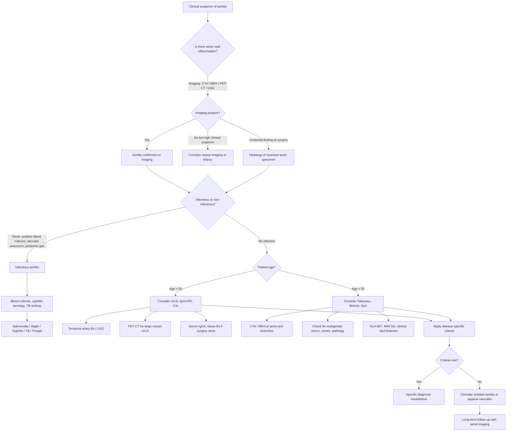

## Diagnostic Criteria, Algorithm, and Investigations for Aortitis

Aortitis presents a unique diagnostic challenge because **there is no single unified diagnostic criterion for "aortitis" as a whole**. Unlike conditions such as rheumatoid arthritis or SLE, where a single classification system exists, the diagnosis of aortitis requires two steps: (1) confirming that the aortic wall is inflamed, and (2) identifying the underlying cause. Each underlying cause has its own diagnostic criteria or approach.

Let me walk you through this logically.

---

## A. Why There Are No Universal "Aortitis Diagnostic Criteria"

The reason is simple: aortitis is a **pathological process**, not a disease. It is like saying "hepatitis" — you need to specify what kind (viral, autoimmune, drug-induced, etc.). The diagnostic approach therefore involves:

1. **Suspecting aortitis** (clinical features + imaging)
2. **Confirming aortic wall inflammation** (imaging ± histology)
3. **Determining the underlying cause** (applying disease-specific criteria)

---

## B. Disease-Specific Diagnostic Criteria

### B1. Giant Cell Arteritis (GCA)

***ACR Classification Criteria (1990) — "BATHE" mnemonic (≥ 3/5)*** [4]:

| Criterion | Detail | Rationale |
|---|---|---|
| ***B — Biopsy evidence*** | Necrotizing arteritis with predominant mononuclear cells / multinucleated giant cells (granuloma) | Histological confirmation of granulomatous vasculitis — the gold standard |
| ***A — Age ≥ 50y*** | Onset of disease at age 50 or older | GCA is exceedingly rare below 50; this criterion separates it from Takayasu |
| ***T — Tenderness / decreased pulsation of temporal artery*** | New tenderness or decreased pulsation of temporal artery, unrelated to atherosclerosis of cervical arteries | Temporal artery is superficially accessible and commonly involved in GCA |
| ***H — new onset localised Headache*** | New type of headache or localised pain in the head | Reflects inflammation of cranial arteries and stimulation of nociceptive neurones |
| ***E — ESR > 50*** | Elevated ESR > 50 mm/h (Westergren method) | Systemic inflammatory response; GCA characteristically causes very high ESR (often > 100) |

<Callout title="Critical Exam Point">

***For visual S/S, do NOT wait for biopsy result → start empirical steroids*** [4]. Treatment must not be delayed — the risk of permanent blindness from AAION far outweighs any benefit of waiting for histological confirmation. Biopsy remains positive for up to 2 weeks after starting steroids.
</Callout>

**2022 ACR/EULAR Updated Classification Criteria for GCA** (point-based system):
- These newer criteria incorporate vascular imaging (temporal artery ultrasound showing **halo sign**, or cross-sectional/PET imaging showing large vessel involvement) alongside traditional clinical and laboratory features.
- They distinguish **cranial GCA** (headache, jaw claudication, visual symptoms, temporal artery abnormality) from **large-vessel GCA** (limb claudication, asymmetric BP, aortic involvement).
- A score ≥ 6 classifies as GCA (applied to patients aged ≥ 50 with new-onset signs/symptoms not better explained by another diagnosis).

### B2. Takayasu Arteritis

**ACR Classification Criteria (1990) (≥ 3/6)**:

| Criterion | Detail |
|---|---|
| 1. Age at disease onset ≤ 40 years | Younger age distinguishes from GCA |
| 2. Claudication of extremities | Development of fatigue and discomfort in muscles of ≥ 1 extremity during use, especially upper limbs |
| 3. Decreased brachial artery pulse | Decreased pulsation of one or both brachial arteries |
| 4. BP difference > 10 mmHg | Difference of > 10 mmHg systolic between arms |
| 5. Bruit over subclavian artery or aorta | Bruit audible on auscultation over one or both subclavian arteries or abdominal aorta |
| 6. Arteriogram abnormality | Arteriographic narrowing or occlusion of the entire aorta, its primary branches, or large arteries in proximal upper or lower extremities, not due to atherosclerosis, FMD, or similar causes |

***Investigations: ESR/CRP↑, angiogram (CTA/MRA)*** [4][6].

***Dx based on clinical finding + vascular imaging*** [6].

<Callout title="Limitation of ACR Criteria">
The 1990 ACR criteria were designed for **classification** (for research purposes), not for **diagnosis** in clinical practice. They have reasonable sensitivity (~90%) but imperfect specificity. In practice, the diagnosis of Takayasu relies on clinical suspicion + characteristic vascular imaging findings + exclusion of alternatives.
</Callout>

### B3. Behçet Disease

***International Study Group (ISG) Criteria (1990)*** [3]:
- **Mandatory**: Recurrent oral ulceration (≥ 3 episodes in 12 months)
- **Plus ≥ 2 of**:
  - Recurrent genital ulceration
  - Eye lesions (uveitis, retinal vasculitis)
  - Skin lesions (erythema nodosum, pseudofolliculitis, papulopustular lesions, acneiform nodules)
  - Positive pathergy test

### B4. IgG4-Related Disease

***Diagnostic approach*** [7]:
- ***Serum IgG4*** (elevated in ~60–70%, but not required for diagnosis — can be normal)
- ***Tissue biopsy with immunostaining***: > 10 IgG4+ plasma cells per HPF, elevated IgG4:IgG ratio ( > 40%)
- ***Hallmark histological features***: ***lymphoplasmacytic tissue infiltrate of mainly IgG4+ plasma cells***, ***"storiform" pattern of fibrosis***, obliterative phlebitis [7]

The **2019 ACR/EULAR IgG4-RD Classification Criteria** use an inclusion/exclusion approach followed by a weighted scoring system across clinical, serological, and histopathological domains. A total score ≥ 36 classifies as IgG4-RD.

### B5. Spondyloarthropathy-Associated Aortitis

No specific criteria for the aortitis itself. The diagnosis rests on establishing the SpA diagnosis and finding aortic involvement on imaging/echocardiography:

- ***Modified New York criteria for AS (1984)***: radiological sacroiliitis + ≥ 1 clinical criterion [9]
- ***ASAS criteria for axSpA***: imaging arm (sacroiliitis on MRI/XR + ≥ 1 SpA feature) or clinical arm (HLA-B27 + ≥ 2 SpA features) [4]
- ***Extra-articular manifestations of AS — "4As" mnemonic***: ***Apical fibrosis, Anterior uveitis, Aortic regurgitation, Achilles tendinitis*** [9]
- The aortitis in SpA ***probably represents a sclerosing inflammatory process involving aortic root, AV cusps and IV septum*** [9]

### B6. Infectious Aortitis

No formal diagnostic criteria. Diagnosis is clinical + microbiological + imaging:
- Positive blood cultures (Salmonella, Staphylococcus, etc.)
- Imaging showing saccular aneurysm, periaortic gas, rapid expansion
- Syphilitic aortitis: treponemal serology (RPR/VDRL for screening, TPHA/FTA-Abs for confirmation)

### B7. Clinically Isolated Aortitis (CIA)

- Diagnosis of **exclusion**: granulomatous or lymphoplasmacytic aortitis found on histology of resected aortic specimen, with no identifiable systemic disease after thorough workup.
- These patients require long-term follow-up (some develop systemic vasculitis years later).

---

## C. Diagnostic Algorithm

Here is a practical approach to diagnosing aortitis, moving from clinical suspicion to confirmed aetiology:

---

## D. Investigation Modalities — Detailed Breakdown

### D1. Blood Tests (First-Line)

| Test | Expected Findings in Aortitis | Interpretation / Why |
|---|---|---|
| **CBC** | ***NcNc anaemia***, ***thrombocytosis*** [10], leucocytosis (infection) | Anaemia of chronic disease (IL-6 suppresses erythropoiesis, sequesters iron). Thrombocytosis = reactive (IL-6 stimulates megakaryopoiesis). Leucocytosis with neutrophilia in bacterial aortitis. |
| **ESR** | ***Characteristically very high (reaching 100 mm/h)*** in GCA [3]; elevated in Takayasu and most inflammatory causes | ESR measures the rate at which RBCs settle in a tube — elevated when acute-phase proteins (fibrinogen, immunoglobulins) increase and cause RBC rouleaux formation. Non-specific but very sensitive for systemic inflammation. |
| **CRP** | Elevated in all active aortitis | CRP is synthesised by hepatocytes in response to IL-6. More specific and rapid marker than ESR. Rises within hours and falls quickly with treatment — useful for monitoring. |
| **Serum IgG4** | Elevated in IgG4-RD (but normal in ~30–40%) | Screening test for IgG4-RD. Elevated levels ( > 135 mg/dL) are suggestive but not diagnostic — false positives occur in other inflammatory conditions, and false negatives in up to 30%. |
| **ANCA** | Usually negative in large vessel vasculitis. Positive in ANCA vasculitis (rare cause of aortitis). ***p-ANCA = anti-MPO, c-ANCA = anti-PR3*** [4] | Helps exclude ANCA vasculitis as a cause. If positive, consider GPA/MPA with aortic involvement. |
| **ANA, anti-dsDNA, complement** | Relevant if SLE-related aortitis suspected | SLE can rarely cause aortitis. |
| ***HLA-B27*** | ***Present in 80–90% of AS*** [9] | Supports diagnosis of axSpA if clinical features present. Not diagnostic on its own but increases confidence. |
| **Blood cultures** | Positive in infectious aortitis (Salmonella, Staph, Strep) | Essential in any patient with fever + aortic pathology. At least 3 sets from different sites before antibiotics. |
| **Syphilis serology** | RPR/VDRL (screening, non-treponemal), TPHA/FTA-Abs (confirmatory, treponemal) | Syphilitic aortitis is tertiary — RPR may be non-reactive in late syphilis (prozone phenomenon or seroreversion), so always send treponemal tests. FTA-Abs remains positive for life. |
| **ALP** | ***↑ALP*** in GCA [10] and severe AS [9] | Mechanism not entirely clear in GCA — may relate to hepatic inflammation or as an acute-phase reactant. In AS, reflects active bone metabolism. |
| **Procalcitonin** | Elevated in bacterial infection, usually normal in autoimmune inflammation | Helps differentiate infectious from non-infectious aortitis. Procalcitonin is released by C-cells of the thyroid and neuroendocrine cells in response to bacterial endotoxin, NOT in sterile inflammation. |

<Callout title="ESR vs CRP in Aortitis">
Both are elevated in active aortitis. **ESR** is slow to rise and slow to fall — it reflects disease burden over weeks. **CRP** rises within 6 hours and falls within days — better for monitoring acute flares and treatment response. In GCA, the ESR is classically very high ( > 100), but **normal ESR does not exclude GCA** (up to 5% have normal ESR at presentation).
</Callout>

---

### D2. Imaging — The Cornerstone of Aortitis Diagnosis

#### D2a. CT Angiography (CTA)

***CT angiography: use of rapid injection of a large intravenous bolus of contrast to opacify vessels for CT imaging*** [11].

***Applications include: aneurysms and dissection*** [11].

| Feature | Findings in Aortitis | Interpretation |
|---|---|---|
| **Wall thickening** | Circumferential or eccentric thickening of the aortic wall ( > 2–3 mm) | Inflammatory infiltration and oedema of the wall. The single most important imaging sign of aortitis on CTA. |
| **Mural enhancement** | Enhancement of the thickened wall on contrast-enhanced CT (especially delayed phase) | Active inflammation with increased vascularity/permeability of the wall. Double-ring sign: enhancing inner and outer rings with lower-density middle layer (inflamed intima/adventitia surrounding oedematous media). |
| **Aneurysm** | Dilatation of the aortic lumen ( > 50% of normal diameter) | Loss of wall integrity due to medial destruction → outward expansion. |
| **Stenosis** | Narrowing or occlusion of the aorta or branch vessels | Intimal thickening → luminal compromise. More common in Takayasu. |
| **Periaortic soft tissue** | Thick rind of soft tissue surrounding the aorta, especially infrarenal | IgG4-RD: thick, homogeneous periaortic fibrosis. Infectious: irregular soft tissue ± gas. |
| **Calcification** | Linear calcification in the aortic wall | Long-standing/burnt-out disease. Also seen in atherosclerosis. |
| **Saccular aneurysm with gas** | Saccular outpouching with air within or around the wall | Strongly suggests **mycotic aneurysm** (gas-forming organisms or communication with bowel). |
| **Dissection** | ***Intimal flap, true and false lumen. True lumen is compressed by false lumen*** [2] | Aortitis-related dissection. |

**For AAA specifically**: ***USG abdomen: confirm diagnosis and surveillance of AAA size (surgery if ≥ 5.5 cm)***; ***CT abdomen + pelvis with contrast: preoperative assessment of anatomy for suitability for EVAR*** [5].

#### D2b. MR Angiography (MRA)

MRA has the advantage of **no ionizing radiation** and excellent soft tissue contrast. It is particularly useful for:

| Application | Advantage |
|---|---|
| **Detecting wall oedema** | T2-weighted images with fat suppression show oedema (bright signal) in the inflamed wall — sensitive marker of active inflammation |
| **Wall thickening and enhancement** | Post-gadolinium T1-weighted images show wall enhancement (similar to CTA but without radiation) |
| **Stenosis assessment** | Time-of-flight or contrast-enhanced MRA shows stenosis and occlusion of branches |
| **Serial follow-up** | No radiation → ideal for repeated imaging in young patients (e.g., Takayasu) |
| **Aortic dissection** | ***Highly sensitive and specific (almost 100%)*** [2]. Identifies intimal flaps, great vessel anatomy. |

**Limitations**: time-consuming, need to disconnect monitoring devices, gadolinium contraindicated in severe renal impairment, less available in emergency settings.

#### D2c. FDG-PET/CT (18F-Fluorodeoxyglucose Positron Emission Tomography)

This is increasingly the **investigation of choice** for diagnosing large vessel vasculitis and monitoring treatment response. Let me explain why from first principles:

- **Principle**: FDG is a glucose analogue that is taken up by metabolically active cells. Activated inflammatory cells (macrophages, lymphocytes) in the aortic wall have very high glucose metabolism → they take up FDG avidly.
- **Result**: Diffuse increased FDG uptake in the aortic wall and/or its major branches indicates active vascular inflammation.
- **Grading**: Visual grading against liver uptake — Grade 0 (no uptake), Grade 1 (< liver), Grade 2 (= liver), Grade 3 ( > liver). Grade ≥ 2 is considered positive for vasculitis.

| Strength | Limitation |
|---|---|
| Detects inflammation **before** structural damage occurs (earlier than CTA/MRA) | Cannot reliably detect inflammation in vessels < 4 mm diameter (limited spatial resolution) |
| Whole-body assessment — identifies aortitis + branch involvement simultaneously | FDG uptake can be seen in atherosclerosis (usually focal/patchy vs. diffuse/smooth in vasculitis) |
| Useful for monitoring treatment response (uptake decreases with successful therapy) | Must be performed **before** starting steroids (or within the first 3 days) — steroids rapidly suppress macrophage FDG uptake |
| Most useful for GCA (large vessel GCA) and Takayasu | Expensive, involves radiation, limited availability |

<Callout title="High Yield — PET-CT Timing">
PET-CT should ideally be performed **before starting glucocorticoids** or within the first 72 hours. After this window, steroid-induced suppression of inflammatory cell metabolism dramatically reduces sensitivity. However, in GCA with visual symptoms, **never delay steroids for the sake of imaging** — vision takes priority.
</Callout>

#### D2d. Ultrasound

**Temporal Artery Ultrasound (for GCA)**:

***Temporal artery ultrasound (halo sign)*** [4]:
- The **"halo sign"** is a dark (hypoechoic) rim around the temporal artery lumen on colour Doppler ultrasound.
- *Why does this happen?* The halo represents oedematous, inflamed vessel wall surrounding the narrowed lumen.
- Sensitivity: ~77% and specificity: ~96% for GCA (in experienced hands).
- Increasingly used as **first-line investigation** in the 2022 ACR/EULAR pathway — may replace temporal artery biopsy in some settings if performed by an experienced sonographer.

**Abdominal Aorta Ultrasound (for AAA)**:
- First-line for measuring aortic diameter and surveillance of known AAA.
- Cannot reliably detect wall inflammation (unlike CTA/MRA/PET).
- ***USG abdomen: confirm diagnosis and surveillance of AAA size*** [5].

**Colour Doppler USG of head, neck, and lower limb vessels**:
- Used in GCA to assess temporal, axillary, subclavian arteries for halo sign, stenosis, or occlusion [3].

#### D2e. Conventional Angiography (DSA — Digital Subtraction Angiography)

- The **historical gold standard** for Takayasu arteritis — shows stenoses, occlusions, and aneurysms.
- Now largely replaced by CTA/MRA for diagnosis (less invasive) [11].
- Still used when **interventional treatment** is planned (angioplasty, stenting).
- ***Angiogram (CTA/MRA)*** for Takayasu [4].
- Limitation: shows only the lumen, not the wall. Cannot detect early inflammation without luminal changes.

---

### D3. Histopathology — The Definitive Investigation (When Available)

***Investigations: biopsy if tissue accessible, angiography if tissue inaccessible*** [4].

#### D3a. Temporal Artery Biopsy (TABx) — for GCA

***Temporal artery biopsy: diagnostic features*** [10]:
- ***Must order urgently (< 24–48h) or else risk permanent visual impairment*** [10]
- ***May be falsely negative due to patchy inflammation*** [10] — this is called **"skip lesions"** (segments of normal artery interspersed with inflamed segments). To minimise false negatives, a specimen **≥ 1 cm** in length is recommended.
- ***Consult NS for biopsy (1 side, 1 cm long)*** [4].

| Histological Finding | Significance |
|---|---|
| Granulomatous inflammation in the media | Hallmark of GCA — giant cells destroying the internal elastic lamina |
| Giant cells at the intima-media junction | Multinucleated cells engulfing fragments of the internal elastic lamina |
| Fragmentation of the internal elastic lamina | Confirmed on elastic stain (Verhoeff-van Gieson) — specific feature |
| Lymphoplasmacytic infiltrate | CD4+ T cells and macrophages predominantly |
| Intimal hyperplasia | Contributes to luminal stenosis → ischaemic symptoms |

**Important**: A negative biopsy does NOT exclude GCA (sensitivity ~85–90% with adequate specimen length). If clinical suspicion is high and biopsy is negative, consider:
- Contralateral temporal artery biopsy
- Imaging (PET-CT, temporal artery USG)
- Treating empirically and observing response

#### D3b. Aortic Wall Biopsy (At Surgery)

When the aorta is resected for aneurysm repair, the specimen should **always be sent for histopathology**. This is how clinically isolated aortitis and unsuspected GCA/Takayasu are often diagnosed.

| Pattern | Suggests |
|---|---|
| **Granulomatous with giant cells** | GCA, Takayasu, sarcoidosis |
| **Lymphoplasmacytic with storiform fibrosis** | ***IgG4-RD — storiform fibrosis, IgG4+ plasma cells*** [7] |
| **Neutrophilic / suppurative** | Bacterial mycotic aneurysm |
| **Caseous granulomas** | Tuberculosis |
| **Obliterative endarteritis of vasa vasorum** | Syphilis |
| **Non-specific chronic inflammation** | Non-specific; consider clinically isolated aortitis |

#### D3c. IgG4 Immunostaining

- Applied to aortic wall tissue or other biopsied tissue (salivary gland, pancreas, etc.)
- ***> 10 IgG4+ plasma cells per HPF, ↑ IgG4:IgG ratio*** [7]
- Combined with storiform fibrosis and obliterative phlebitis → diagnostic triad of IgG4-RD

---

### D4. Additional Targeted Investigations

| Investigation | When to Order | What You're Looking For |
|---|---|---|
| **Echocardiography (TTE/TEE)** | Suspected aortic regurgitation, aortic root dilatation | ***ECHO & CT thorax (mid-portion of ascending aorta difficult to be visualised by ECHO)*** [8]. TTE: aortic valve morphology, AR severity, LV dimensions. TEE: better for ascending aorta/root detail. |
| ***ECG*** | Suspected conduction defects (SpA-associated aortitis), MI from coronary ostial stenosis | ***ECG: LVH +/- strain*** [8] in chronic AR. First-degree AV block → complete heart block in SpA. ST changes if coronary ostial stenosis (syphilitic). |
| ***CXR*** | All patients | ***CXR: cardiomegaly*** [8] (if AR → LV dilatation). Widened mediastinum (thoracic aortic aneurysm/dissection). Calcification of ascending aorta (syphilitic — "eggshell" calcification). |
| **Syphilis serology** | All aortitis patients (especially ascending aorta involvement) | RPR/VDRL (non-treponemal — screens for active disease). TPHA/FTA-Abs (treponemal — confirmatory, remains positive for life). |
| **Tuberculin skin test / IGRA** | If TB aortitis suspected | TB aortitis is rare but must be excluded in endemic areas. |
| **HLA-B27** | If SpA suspected | ***Present in 80–90% of AS*** [9]. Supports diagnosis but not diagnostic alone. |
| **Pathergy test** | If Behçet suspected | ***Skin prick with 20G needle → +ve if pustule-like lesion/papules after 48h*** [3] |

---

### D5. Putting It All Together — Investigation Strategy by Suspected Aetiology

| Suspected Cause | First-Line Ix | Second-Line / Confirmatory Ix | Key Diagnostic Finding |
|---|---|---|---|
| **GCA** | ESR/CRP, CBC, temporal artery USG | Temporal artery Bx (urgent!), PET-CT for large vessel GCA | ***ESR > 50, halo sign on USG, granulomatous arteritis on Bx*** [4][10] |
| **Takayasu** | ESR/CRP, CTA or MRA of aorta and branches | Conventional angiography (if intervention planned) | Concentric wall thickening with stenosis/occlusion of aortic branches on CTA/MRA |
| **IgG4-RD** | Serum IgG4, CTA (periaortic soft tissue) | Tissue biopsy with IgG4 immunostaining | ***> 10 IgG4+ plasma cells/HPF, storiform fibrosis, obliterative phlebitis*** [7] |
| **Infectious** | Blood cultures (×3), CRP, procalcitonin, syphilis serology, CTA | Surgical specimen culture/Gram stain/histology | Positive cultures, saccular aneurysm ± gas on CTA |
| **SpA-associated** | HLA-B27, ESR/CRP, MRI SIJ, echocardiography | Clinical assessment for SpA features | ***Sacroiliitis on imaging + SpA features + AR/conduction defect*** [9] |
| **Behçet** | Clinical assessment (ISG criteria), pathergy test, CTA | Angiography, tissue biopsy if needed | ***Recurrent oral ulcers + ≥ 2 other criteria*** [3] |

---

<Callout title="High Yield Summary — Diagnosis of Aortitis">

**No unified diagnostic criteria exist for "aortitis"** — diagnosis requires confirming aortic wall inflammation + identifying the cause.

**Key Imaging Modalities:**
- **CTA**: First-line for structural assessment (wall thickening, aneurysm, stenosis, periaortic changes)
- **MRA**: Excellent for wall oedema (T2), no radiation, ideal for young patients and serial follow-up
- **PET-CT**: Best for detecting active inflammation (before structural changes), must be done before or within 72h of starting steroids
- **Temporal artery USG**: Halo sign — increasingly first-line for GCA

**Key Blood Tests:**
- ESR/CRP (all), blood cultures (infectious), syphilis serology (all ascending aorta), IgG4 (suspected IgG4-RD), ANCA (exclude ANCA vasculitis), HLA-B27 (SpA)

**Key Histological Patterns:**
- Granulomatous + giant cells → GCA/Takayasu
- Lymphoplasmacytic + storiform fibrosis → IgG4-RD
- Suppurative/neutrophilic → bacterial
- Vasa vasorum endarteritis → syphilis

**GCA-specific:**
- ACR criteria "BATHE" (≥ 3/5): Biopsy, Age ≥ 50, Temporal artery, Headache, ESR > 50
- Temporal artery Bx: urgent, ≥ 1 cm, skip lesions cause false negatives
- Never delay steroids for biopsy if visual symptoms present

</Callout>

---

<ActiveRecallQuiz
  title="Active Recall - Diagnosis of Aortitis"
  items={[
    {
      question: "List the 5 ACR classification criteria for Giant Cell Arteritis using the BATHE mnemonic.",
      markscheme: "B = Biopsy showing necrotizing arteritis with mononuclear/giant cell infiltration. A = Age at onset 50 or older. T = Tenderness or decreased pulsation of temporal artery. H = new onset localised Headache. E = ESR greater than 50 mm/h. Need 3 or more of 5 for classification."
    },
    {
      question: "Why should PET-CT ideally be performed before starting glucocorticoids in suspected large vessel vasculitis, and what is the maximum acceptable delay?",
      markscheme: "Glucocorticoids rapidly suppress macrophage metabolic activity, reducing FDG uptake and causing false-negative results. PET-CT should ideally be done before steroids or within the first 72 hours (3 days) of starting treatment. However, in GCA with visual symptoms, steroids must not be delayed for imaging."
    },
    {
      question: "A temporal artery biopsy in a patient with suspected GCA comes back negative. Does this exclude GCA? What are two possible next steps?",
      markscheme: "No, a negative biopsy does not exclude GCA. Sensitivity is approximately 85-90% due to skip lesions (patchy inflammation with normal segments between affected areas). Next steps: (1) Contralateral temporal artery biopsy, (2) Imaging with PET-CT or temporal artery ultrasound looking for halo sign, (3) Treat empirically if clinical suspicion remains high and observe for steroid response."
    },
    {
      question: "What are the three histological hallmarks of IgG4-related disease on tissue biopsy?",
      markscheme: "1) Dense lymphoplasmacytic infiltrate with abundant IgG4-positive plasma cells (greater than 10 per HPF with elevated IgG4 to total IgG ratio). 2) Storiform (whorled/cartwheel-like) fibrosis. 3) Obliterative phlebitis (inflammation and obliteration of small veins within the tissue)."
    },
    {
      question: "Compare the relative advantages of CTA, MRA, and PET-CT in the investigation of aortitis.",
      markscheme: "CTA: Best for structural assessment (wall thickening, aneurysm, stenosis, periaortic changes, calcification, gas), fast, widely available, but involves radiation and iodinated contrast. MRA: Excellent soft tissue contrast, detects wall oedema on T2-weighted images (active inflammation), no radiation (ideal for young patients and serial follow-up), but time-consuming and less available in emergencies. PET-CT: Best for detecting active inflammation before structural changes occur, whole-body assessment, useful for monitoring treatment response, but must be done before steroids, expensive, and limited spatial resolution for small vessels."
    }
  ]}
/>

## References

[2] Senior notes: Ryan Ho Cardiology.pdf (p160, p220–222)
[3] Senior notes: Ryan Ho Rheumatology.pdf (p95–96, p98)
[4] Senior notes: Maksim Medicine Notes.pdf (p311, p323, p332–333)
[5] Senior notes: Maksim Surgery Notes.pdf (p161)
[6] Senior notes: Ryan Ho Rheumatology.pdf (p96)
[7] Senior notes: Maksim Medicine Notes.pdf (p335)
[8] Senior notes: Maksim Medicine Notes.pdf (p35)
[9] Senior notes: Ryan Ho Rheumatology.pdf (p58, p60)
[10] Senior notes: Ryan Ho Neurology.pdf (p65)
[11] Senior notes: Ryan Ho Diagnostic Radiology.pdf (p43)
