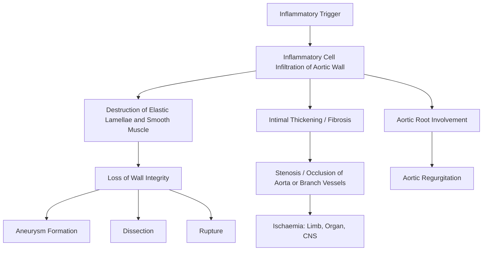

# Aortitis

## 1. Definition

Aortitis literally means inflammation of the aorta ("aort-" = aorta, "-itis" = inflammation). It is a histopathological and clinical entity characterised by inflammatory cell infiltration of one or more layers of the aortic wall (intima, media, adventitia), leading to wall weakening, aneurysm formation, stenosis, dissection, or aortic valve dysfunction.

Think of it this way: the aorta is the largest artery in the body, and when its wall becomes inflamed, the structural integrity of its elastic lamellae and smooth muscle is compromised. The downstream consequences depend on *which* layer is primarily affected and *how much* destruction occurs.

Aortitis is not a single disease — it is a **manifestation** of many different underlying conditions (infectious, autoimmune, autoinflammatory). The clinical importance lies in two facts:
1. It can be clinically silent until a catastrophic complication occurs (rupture, dissection).
2. It may be the first presentation of a systemic vasculitis or infection.

<Callout title="Key Concept">
Aortitis is inflammation of the aortic wall. It is a pathological process, not a single diagnosis. Always think: "What is causing this aortitis?" — the answer determines management.
</Callout>

---

## 2. Epidemiology

### 2.1 Overall Prevalence

- True population prevalence is difficult to determine because many cases are subclinical or discovered incidentally on surgical/autopsy specimens.
- In large surgical series, **clinically isolated aortitis** (inflammation found on histology of resected aortic aneurysm specimens without prior diagnosis of systemic disease) is found in **4–8% of thoracic aortic surgical specimens** [1][2].
- Giant cell arteritis (GCA) is the **commonest cause of aortitis** in Western populations, with an incidence of ~20/100,000/year in those > 50 years old [3].
- Takayasu arteritis is more prevalent in **Asian populations** (incidence ~1–2/million/year globally, but higher in Japan, India, and Southeast Asia) and is the more relevant large-vessel vasculitis in younger Hong Kong patients [3][4].

### 2.2 Demographics

| Feature | GCA-related aortitis | Takayasu-related aortitis | Infectious aortitis |
|---------|---------------------|--------------------------|---------------------|
| **Age** | > 50 years (avg 70y) | < 50 years (10–40y) | Any age |
| **Sex** | F:M = 2:1 | F:M = 8–9:1 | M > F |
| **Ethnicity** | More common in Northern Europeans; less common in Asians | More common in Asians | Universal |

### 2.3 Hong Kong Context

- ***Takayasu arteritis*** is relatively more important in Hong Kong/Asian populations compared to Western settings [4].
- **Infectious aortitis** — particularly mycotic aneurysms from **non-typhoid *Salmonella*** — is a well-recognised entity in Hong Kong and Southeast Asia, especially in immunocompromised or elderly patients [1][5].
- ***Syphilitic aortitis***, once a classic cause, is now rare but still seen occasionally, particularly in high-risk populations (MSM, HIV co-infection). Hong Kong has seen a resurgence of syphilis cases in recent years, so this should remain on the differential [2].
- IgG4-related aortitis is increasingly recognised in Asian populations.

---

## 3. Anatomy and Function of the Aorta (Relevant to Understanding Aortitis)

### 3.1 Gross Anatomy

The aorta is divided into:

- **Aortic root**: Contains the sinuses of Valsalva, from which the coronary arteries arise. The aortic valve sits here.
- **Ascending aorta**: From the sinotubular junction to the brachiocephalic trunk origin.
- **Aortic arch**: Gives off brachiocephalic trunk, left common carotid, left subclavian.
- **Descending thoracic aorta**: From the left subclavian to the diaphragm.
- **Abdominal aorta**: From the diaphragm to the bifurcation at L4. Gives off coeliac trunk, SMA, renal arteries, IMA, and others.

**Why does anatomy matter for aortitis?**
- Different diseases preferentially affect different segments:
  - **GCA**: thoracic aorta (ascending > arch > descending)
  - **Takayasu**: aortic arch and abdominal aorta
  - **Syphilis**: ascending aorta (especially the vasa vasorum-rich proximal portion)
  - **Atherosclerotic/infectious**: infrarenal abdominal aorta (where vasa vasorum are sparse and atherosclerosis is most severe)

### 3.2 Histological Layers

| Layer | Components | Function | Relevance to Aortitis |
|-------|-----------|----------|----------------------|
| **Intima** | Endothelium + subendothelial connective tissue | Barrier, anti-thrombotic surface | Site of atherosclerotic plaque; PAU starts here |
| **Media** | Concentric elastic lamellae + smooth muscle cells + collagen | Provides tensile strength and elasticity (Windkessel function) | Main target in GCA and Takayasu; destruction → aneurysm/dissection |
| **Adventitia** | Collagen, vasa vasorum, nervi vasorum, lymphatics | Nutrition of outer media; structural support | IgG4-related disease often involves adventitia; syphilitic aortitis targets vasa vasorum here |

### 3.3 Vasa Vasorum

The **vasa vasorum** ("vessels of vessels") are small arteries that supply the outer two-thirds of the aortic media and adventitia. They are most dense in the:
- Ascending aorta and aortic arch
- Descending thoracic aorta

They are **sparse or absent** in the infrarenal abdominal aorta (which relies on diffusion from the lumen).

**Why is this important?**
- ***Syphilitic aortitis*** classically involves the ascending aorta because *Treponema pallidum* causes **obliterative endarteritis of the vasa vasorum** → ischaemic necrosis of the media → scarring, weakening, aneurysm formation [2].
- Infectious agents can seed the aortic wall via the vasa vasorum.
- ***Intramural haematoma (IMH)***: rupture of vasa vasorum within the medial layer without intimal injury [2].

### 3.4 Function

The aorta serves two main functions:
1. **Conduit**: Delivers oxygenated blood from the LV to the systemic circulation.
2. **Windkessel function**: The elastic recoil of the aortic wall during diastole converts pulsatile flow into more continuous flow, maintaining diastolic perfusion pressure (especially important for coronary perfusion).

When aortitis destroys elastic fibres → the wall loses compliance → aneurysmal dilatation → risk of rupture/dissection.

---

## 4. Etiology (with Focus on Hong Kong)

The causes of aortitis can be broadly divided into **non-infectious (autoimmune/inflammatory)** and **infectious**.

### 4.1 Non-Infectious Aortitis

#### 4.1.1 Large Vessel Vasculitis

**A. Giant Cell Arteritis (GCA)**

- **The most common cause of aortitis overall** [3].
- Granulomatous arteritis of the aorta and its major branches.
- *Typically affects individuals > 50 years old, F:M = 2:1, more common in Northern Europeans but occurs in all ethnicities* [3].
- Aortic involvement (large vessel GCA) is present in **40–80%** of GCA patients on imaging (PET-CT), even when clinically silent.
- ***Often co-exists with polymyalgia rheumatica (PMR): 40–50% GCA has PMR, 10% PMR has GCA*** [3].
- Can cause **thoracic aortic aneurysm** (especially ascending), aortic dissection, aortic stenosis of branch vessels.
- Risk of thoracic aortic aneurysm is **17× higher** than age-matched controls.

**B. Takayasu Arteritis**

- ***Granulomatous inflammation affecting aortic arch and abdominal aorta, a.k.a. "pulseless disease"*** [4].
- ***Usually affects females < 50 years old*** [4].
- ***More common in Asians*** — especially relevant in Hong Kong [4].
- ***Also known as: pulseless disease, aortic arch syndrome, occlusive thromboaortopathy*** [4].
- ***Histology: granulomatous inflammation, most commonly affecting aortic arch and abdominal aorta*** [4].
- ***Epidemiology: uncommon, usually affects F (80–90%) of reproductive age (10–40y) especially in Asians*** [4].

<Callout title="GCA vs. Takayasu — How to Tell Them Apart">

Both are granulomatous large vessel vasculitides. The key distinguishing factor is **age**: GCA > 50 years, Takayasu < 50 years. Histologically, they can look identical. Some experts consider them a spectrum of the same disease.

In Hong Kong, **Takayasu is relatively more common** than in Western populations.
</Callout>

#### 4.1.2 Other Vasculitides

**C. Behçet Disease**

- ***Systemic vasculitis of unknown aetiology*** [3].
- ***More common along ancient Silk Road (Turkey, Middle East, China)*** [3].
- ***Vascular disease: remarkably affects A/Vs of all sizes*** [3].
- Can cause aortitis, aortic aneurysms (often saccular), and arterial/venous thrombosis.
- ***Strongly associated with HLA-B51 in Asians*** [3].

**D. ANCA-associated Vasculitis**

- Granulomatosis with polyangiitis (GPA) and microscopic polyangiitis (MPA) can rarely involve the aorta.
- Eosinophilic granulomatosis with polyangiitis (EGPA) has occasional aortic involvement reported.
- These are primarily small vessel vasculitides — aortic involvement is uncommon.

**E. Relapsing Polychondritis**

- Autoimmune destruction of cartilage; 10–15% develop aortitis (ascending aorta) with aortic regurgitation.

**F. Spondyloarthropathies (SpA)**

- ***Ankylosing spondylitis (AS)*** is associated with ***aortitis, AI (aortic insufficiency), conduction defects*** [3].
- The aortitis in AS characteristically involves the **aortic root** → causes fibrosis at the base of the aortic valve cusps → aortic regurgitation.
- Reactive arthritis (ReA) can also rarely cause aortitis with ***AI, conduction defects*** [3].

#### 4.1.3 Non-Vasculitic Inflammatory Aortitis

**G. IgG4-Related Disease (IgG4-RD)**

- Increasingly recognised cause of aortitis, especially in Asian populations.
- Characterised by dense lymphoplasmacytic infiltration rich in IgG4-positive plasma cells, storiform fibrosis, and obliterative phlebitis.
- Typically affects the **infrarenal abdominal aorta** → inflammatory abdominal aortic aneurysm (perianeurysmal fibrosis).
- Distinguished from ordinary atherosclerotic AAA by the **thick, shiny, white retroperitoneal fibrosis** encasing the aorta and ureters.
- Responds to **corticosteroids** (unlike atherosclerotic aneurysm).
- Elevated serum IgG4 (though not always).

**H. Sarcoidosis**

- Rare cause of granulomatous aortitis.

**I. Clinically Isolated Aortitis (CIA)**

- Found incidentally on histology after aortic surgery for aneurysm.
- No identifiable systemic disease at time of diagnosis.
- May represent **limited or early GCA/Takayasu** — these patients need long-term follow-up as some develop systemic vasculitis later.
- Found in **4–8% of thoracic aortic surgical specimens**.

### 4.2 Infectious Aortitis

#### 4.2.1 Bacterial

**A. Mycotic Aneurysm / Infected Aortic Aneurysm**

The term "mycotic" is a historical misnomer (coined by Osler) — it does not mean fungal. It refers to any infected aneurysm.

***Relevant organisms (especially in Hong Kong):*** [1][5]
- ***Non-typhoid Salmonella*** (***most common cause of mycotic aortic aneurysm in Asia/Hong Kong***) — seeds atherosclerotic plaques, especially in elderly/immunocompromised.
- ***Staphylococcus aureus*** — haematogenous seeding, often acute/fulminant.
- ***Streptococcus species***
- Gram-negative organisms (E. coli, Klebsiella)
- ***Syphilis (Treponema pallidum)*** — tertiary syphilis [2].

| Feature | Non-typhoid Salmonella | Staphylococcus | Syphilis |
|---------|----------------------|----------------|----------|
| Setting | Elderly, atherosclerotic, DM, immunosuppressed | IV drug use, bacteraemia | Untreated tertiary syphilis |
| Location | Infrarenal aorta (atherosclerotic) | Any segment | Ascending aorta |
| Course | Subacute–acute | Acute, fulminant | Chronic (years–decades) |
| Aneurysm type | Saccular, often with rapid expansion | Pseudoaneurysm | Fusiform or saccular ascending |

**B. Syphilitic Aortitis** (in more detail)

- Occurs in **tertiary syphilis** (10–30 years after primary infection).
- *Treponema pallidum* causes **obliterative endarteritis of the vasa vasorum** in the ascending aorta.
- This leads to:
  - Ischaemic destruction of the media (loss of elastic fibres and smooth muscle)
  - "Tree-barking" appearance of the intima (wrinkling due to medial scarring)
  - Aneurysm of the ascending aorta (saccular or fusiform)
  - ***Aortic root dilatation → aortic regurgitation (supravalvular)*** [2]
  - Coronary ostial stenosis (from intimal thickening at the aortic root → angina)
- Now rare in developed countries but still encountered.

#### 4.2.2 Mycobacterial

- *Mycobacterium tuberculosis*: TB aortitis is rare but reported, especially in endemic regions.
- Can cause mycotic aneurysms, usually from contiguous spread from adjacent infected lymph nodes or vertebral bodies.

#### 4.2.3 Fungal

- True fungal aortitis (Aspergillus, Candida) is very rare, almost exclusively in severely immunocompromised patients (post-transplant, prolonged neutropenia).

#### 4.2.4 Viral

- HIV, CMV, HBV, HCV — may contribute to aortitis/arteritis indirectly via immune mechanisms.

### 4.3 Other / Rare Causes

- **Radiation aortitis**: Following thoracic radiation (e.g., for lymphoma, breast cancer). Causes intimal and medial fibrosis → stenosis or aneurysm, typically 10–20 years after exposure.
- **Drug-induced**: Rare. Fluoroquinolones (ciprofloxacin, levofloxacin) are associated with aortic aneurysm and dissection — the mechanism may involve MMP upregulation in the aortic wall.
- **Cogan syndrome**: Interstitial keratitis + vestibuloauditory dysfunction + aortitis (resembles Takayasu in a Western patient).

---

## 5. Pathophysiology

### 5.1 General Pathophysiological Framework

Regardless of the cause, aortitis follows a common pathological pathway:

### 5.2 Pathophysiology by Disease Category

#### 5.2.1 Granulomatous Aortitis (GCA / Takayasu)

1. **Initiation**: Unknown antigen (possibly elastin or another aortic wall component) is presented to dendritic cells in the adventitia via the vasa vasorum.
2. **T-cell activation**: CD4+ T-helper cells infiltrate the adventitia and media → produce IFN-γ and IL-17.
3. **Macrophage activation**: IFN-γ activates macrophages → form multinucleated giant cells → produce **MMPs (matrix metalloproteinases)** and **reactive oxygen species** → digest elastic lamellae.
4. **Intimal hyperplasia**: PDGF and VEGF from activated macrophages drive smooth muscle cell migration and proliferation into the intima → concentric intimal thickening → **stenosis** (especially in Takayasu).
5. **Medial destruction**: Loss of elastic fibres → wall weakens → **aneurysm** (especially in GCA).
6. **Neovascularisation**: VEGF promotes new vessel formation in the media (normally avascular) → further inflammatory cell infiltration.

**Key distinction**: Takayasu tends to cause more **stenosis** (especially in younger, thicker-walled arteries with more fibroproliferative response), while GCA tends to cause more **aneurysmal** disease (in older, already degenerating arteries).

***Pathology: subacute granulomatous inflammation of large/medium sized arteries with lymphocyte, plasma cell, neutrophil and giant cell infiltration*** [3].

#### 5.2.2 Syphilitic Aortitis

1. *T. pallidum* spirochetes colonise the **vasa vasorum** of the ascending aorta during secondary/early latent syphilis.
2. **Obliterative endarteritis** of the vasa vasorum → endothelial swelling and perivascular inflammation → luminal narrowing.
3. Ischaemic injury to the **outer media** (which depends on vasa vasorum for oxygen) → necrosis and loss of elastic fibres and smooth muscle.
4. Replacement by **scar tissue** → patchy medial scarring.
5. Intimal wrinkling over scarred media → characteristic **"tree-bark" appearance** grossly.
6. Wall weakening → **aneurysm of the ascending aorta** (the area richest in vasa vasorum).
7. Aortic root dilatation → **aortic valve cusps are pulled apart** (the cusps themselves are normal, but the annulus is dilated) → **aortic regurgitation**.
8. Intimal fibrosis around coronary ostia → **coronary ostial stenosis** → angina (classically exertional).

#### 5.2.3 Infectious/Mycotic Aortitis

1. Organisms reach the aortic wall via:
   - **Haematogenous seeding** (most common): bacteraemia → organisms lodge in pre-existing atherosclerotic plaque or intimal damage.
   - **Contiguous spread**: from adjacent infection (e.g., vertebral osteomyelitis, para-aortic abscess).
   - **Direct inoculation**: trauma, iatrogenic (post-catheterisation, post-graft).
2. **Bacterial invasion** of the arterial wall → acute/subacute neutrophilic inflammation.
3. **Rapid destruction** of media and adventitia → weakened wall → pseudoaneurysm or saccular aneurysm with high rupture risk.
4. Classically **Salmonella** has tropism for atherosclerotic endothelium → seeds on pre-existing plaques in the infrarenal aorta → rapid expansion.

***Enhancement of proteolytic activity (elevated Matrix metalloproteinases [MMP])*** is a key mechanism in both atherosclerotic and inflammatory aneurysm formation [1].

#### 5.2.4 IgG4-Related Aortitis

1. Unknown trigger → activation of T-follicular helper cells and cytotoxic CD4+ T cells.
2. IgG4-positive plasma cells and lymphocytes infiltrate the **adventitia** predominantly.
3. **Storiform fibrosis** (matted, whorled pattern) develops.
4. **Obliterative phlebitis** (inflammation and obliteration of small veins within the wall).
5. Dense periaortic fibrosis → often encases ureters → hydronephrosis.
6. Responds dramatically to **corticosteroids** (unlike most other aneurysms).

#### 5.2.5 Spondyloarthropathy-Associated Aortitis

1. Chronic inflammation at the **aortic root** (near the insertion of the aortic valve cusps).
2. **Fibrosis** extends from the base of the cusps into the membranous interventricular septum.
3. Aortic valve cusps become **thickened and retracted** → aortic regurgitation.
4. Fibrosis extending into the conduction system → **AV block** (first degree, progressing to complete).
5. This pattern is characteristic: ***aortitis, AI (aortic insufficiency), conduction defects*** [3].

---

## 6. Classification

### 6.1 By Etiology

| Category | Examples |
|----------|----------|
| **Large vessel vasculitis** | GCA, Takayasu |
| **Medium/small vessel vasculitis with aortic involvement** | Behçet, PAN (rare), ANCA vasculitis (rare) |
| **Spondyloarthropathy-associated** | AS, ReA |
| **Other autoimmune/inflammatory** | IgG4-RD, sarcoidosis, relapsing polychondritis, Cogan syndrome |
| **Infectious** | Salmonella, Staph, Streptococcus, Syphilis, TB, fungal |
| **Clinically isolated aortitis** | No identifiable systemic disease |
| **Other** | Radiation, drug-induced |

### 6.2 By Anatomical Location

| Location | Common causes |
|----------|---------------|
| **Ascending aorta / aortic root** | GCA, syphilis, AS/SpA, relapsing polychondritis |
| **Aortic arch** | Takayasu, GCA |
| **Descending thoracic** | GCA, Takayasu |
| **Abdominal aorta** | IgG4-RD, Takayasu, infectious (Salmonella), atherosclerotic inflammatory |

### 6.3 By Histopathological Pattern

| Pattern | Diseases |
|---------|----------|
| **Granulomatous** | GCA, Takayasu, sarcoidosis, TB |
| **Lymphoplasmacytic** | IgG4-RD, syphilis |
| **Neutrophilic/suppurative** | Bacterial mycotic aneurysm |
| **Mixed** | Behçet, PAN |
| **Giant cell-rich** | GCA, Takayasu |

<Callout title="High Yield Classification Point">
When you see "granulomatous aortitis" on a pathology report after aortic surgery, the main differential is GCA vs. Takayasu vs. isolated aortitis vs. sarcoidosis vs. infection (TB, syphilis). Age is the most important distinguishing factor.
</Callout>

---

## 7. Clinical Features

### 7.1 Symptoms

The clinical features of aortitis are often **non-specific** and may be **silent** until complications develop. The symptoms can be divided into:

#### 7.1.1 Constitutional / Systemic Symptoms

- **Fever, malaise, weight loss, night sweats, fatigue**
  - *Why?* Aortitis is an inflammatory process → production of pro-inflammatory cytokines (IL-1, IL-6, TNF-α) → systemic inflammatory response → fever, anorexia, weight loss.
  - ***Constitutional symptoms (40%)*** are noted in Takayasu arteritis [4].
  - ***Fever (50%, usually low grade), fatigue, weight loss*** in GCA [3].
  - In infectious aortitis, fever can be high-grade and spiking (bacteraemia).

#### 7.1.2 Pain

- **Chest pain, back pain, abdominal pain**
  - *Why?* Inflammation of the aortic wall stretches pain-sensitive nerve fibres in the adventitia (nervi vasorum). Rapid expansion of an inflammatory aneurysm distends the wall → pain.
  - Chest pain (ascending/arch aortitis), interscapular pain (descending thoracic), abdominal/back pain (abdominal aortitis).
  - Pain may be vague and indolent in chronic aortitis, or sudden and severe if dissection/impending rupture occurs.
  - ***Abdominal / back / loin / groin pain: due to compression on nerves and organs*** in AAA [1].

#### 7.1.3 Symptoms from Vascular Stenosis / Occlusion

- ***Limb claudication (70%)*** in Takayasu [4].
  - *Why?* Inflammatory intimal thickening → stenosis of aortic branch vessels → reduced blood flow to limbs → intermittent ischaemic pain on exertion (claudication), typically upper limb (subclavian involvement) in Takayasu vs. lower limb in PAD.
- **Jaw claudication** in GCA.
  - *Why?* Ischaemia of the masseter muscle due to inflammation/stenosis of branches of the external carotid artery.
  - ***Jaw claudication (1/2) (due to ischaemia of masseter muscle)*** [3].
  - ***Pathognomonic!*** [3].
- **Angina** — from coronary ostial stenosis (syphilitic aortitis, Takayasu) or from aortic regurgitation (reduced diastolic BP → reduced coronary perfusion).
- **Mesenteric angina** (postprandial abdominal pain, food fear, weight loss) — from stenosis of coeliac trunk or SMA (Takayasu, GCA).
- **Visual symptoms**:
  - ***Amaurosis fugax (transient), can progress into permanent visual loss (15–20%)*** [3].
  - ***Due to arteritic acute ischaemic optic neuropathy (AAION)*** [3].
  - This is specific to GCA (ophthalmic/posterior ciliary artery involvement), not typical of aortitis alone.
- **Neurological symptoms**: TIA, stroke (carotid/vertebral stenosis), syncope.
- **Renovascular hypertension**: renal artery stenosis → activation of RAAS → secondary hypertension.
  - ***HTN ( > 50%) due to renal artery stenosis*** in Takayasu [4].
- ***Subclavian steal syndrome*** in Takayasu [4] — stenosis of proximal subclavian artery → retrograde flow down the ipsilateral vertebral artery → vertebrobasilar insufficiency on arm exercise (dizziness, syncope).

#### 7.1.4 Symptoms from Aortic Regurgitation

- Palpitations, awareness of heartbeat (compensated phase — due to increased stroke volume).
- Progressive dyspnoea on exertion, orthopnoea, PND (decompensated phase — LV failure).
- ***Angina: due to reduced diastolic BP and increased ventricular demand*** [2].
- ***Aortic root dilatation (supravalvular): hypertension, infection (syphilitic aortitis), inflammatory (AS), CT disease (Marfan's, EDS)*** as causes of AR [2].

#### 7.1.5 Symptoms from Aneurysm

- Often **asymptomatic** until rupture or dissection.
- Compressive symptoms:
  - Hoarseness (recurrent laryngeal nerve compression — thoracic aortic aneurysm)
  - Dysphagia (oesophageal compression — "dysphagia aortica")
  - Stridor/cough (tracheal/bronchial compression)
  - SVC syndrome (rare)

#### 7.1.6 Symptoms Specific to the Underlying Disease

- **GCA**: new-onset headache (temporal), scalp tenderness, PMR symptoms (shoulder/pelvic girdle pain and stiffness).
- **Takayasu**: upper limb fatigue, Raynaud's phenomenon, arthralgias.
- **Behçet**: ***oral ulcers, urogenital ulcers, ocular inflammation, skin lesions*** [3].
- **AS/SpA**: inflammatory back pain, morning stiffness, enthesitis.
- **IgG4-RD**: symptoms from other organ involvement (autoimmune pancreatitis, lacrimal/salivary gland enlargement, retroperitoneal fibrosis with flank pain/hydronephrosis).
- **Syphilis**: history of primary chancre, secondary rash (usually decades prior).

---

### 7.2 Signs

#### 7.2.1 Cardiovascular Signs

- ***Asymmetric BP (50%)*** in Takayasu [4].
  - *Why?* Stenosis of one subclavian artery → lower BP reading in the affected arm. A difference of > 10 mmHg systolic between arms is significant; > 20 mmHg is very concerning.
- ***Absent/weak pulses (60%): most commonly radial, often asymmetric*** in Takayasu [4].
  - *Why?* Inflammatory stenosis or occlusion of subclavian, axillary, or brachial arteries. This is why Takayasu is called ***"pulseless disease"*** [4].
- ***Bruits (80%): usually audible over subclavian, brachial, carotid, abdominal vessels*** in Takayasu [4].
  - *Why?* Turbulent blood flow through a stenosed artery generates audible vibrations (bruits).
- **Hypertension**: secondary to renal artery stenosis (RAAS activation) or aortic coarctation-like stenosis.
- ***Early diastolic murmur (EDM)*** if aortic regurgitation develops [2].
  - Best heard at left sternal edge with patient sitting up, leaning forward, at end-expiration.
  - ***Ejection systolic murmur also common (↑SV)*** if significant AR present [2].
  - ***Austin Flint murmur: mid-diastolic low-pitched murmur*** (regurgitant jet impinging on anterior mitral leaflet → functional MS) [2].
- Signs of **wide pulse pressure** (in AR):
  - ***Collapsing (water-hammer) pulse***
  - ***Displaced, thrusting apex*** (LV dilatation)
  - ***Duroziez sign***, ***Quincke's pulse***, ***Traube's sign***, ***De Musset's sign*** [2].
- **Pulsatile abdominal mass**: if inflammatory AAA (typically epigastric, expansile).
  - ***Physical examination: pulsatile and expansile mass (usually in epigastrium)*** [1].

#### 7.2.2 Signs Specific to GCA

- ***Temporal artery: prominent, tender, non-pulsatile*** [3].
- ***Scalp tenderness*** [3].
- ***Fundus: chalky white, swollen optic disc with haemorrhage (NAION as d/dx)*** [3].

#### 7.2.3 Signs of Aortic Aneurysm Complications

- Signs of rupture: haemodynamic instability (hypotension, tachycardia), peritonism, Grey Turner/Cullen sign (retroperitoneal haemorrhage).
- Signs of dissection: ***asymmetric BP and pulse between arms (e.g., radial-radial delay for Type A, radial-femoral delay for Type B)*** [2].
- Signs of distal embolisation: blue toes, livedo reticularis, absent distal pulses.

#### 7.2.4 Signs Specific to Underlying Disease

| Disease | Specific Signs |
|---------|---------------|
| **GCA** | Tender, thickened, non-pulsatile temporal artery; scalp tenderness |
| **Takayasu** | Absent radial pulses, BP discrepancy, subclavian/carotid bruits |
| **Behçet** | Oral aphthous ulcers, genital ulcers, pathergy test positive, hypopyon |
| **AS** | Loss of lumbar lordosis, reduced chest expansion, question mark posture |
| **IgG4-RD** | Parotid/lacrimal gland enlargement, orbital pseudotumour |
| **Syphilis** | Argyll Robertson pupils, Charcot joints, tabes dorsalis (tertiary) |
| **Infectious** | Fever, leucocytosis, septic emboli (splinter haemorrhages, Janeway lesions) |

<Callout title="Clinical Pearl — Aortitis Presenting as FUO" type="idea">
Aortitis (especially GCA or Takayasu) is an important cause of **fever of unknown origin (FUO)** in the elderly. If an elderly patient has fever, raised ESR/CRP, and weight loss without an obvious source, think about large vessel vasculitis. PET-CT showing aortic uptake clinches the diagnosis.
</Callout>

<Callout title="Clinical Pearl — When to Suspect Aortitis" type="idea">
Think of aortitis when you see:
1. Inflammatory back/chest/abdominal pain + raised inflammatory markers
2. New-onset aortic regurgitation in a younger patient without traditional risk factors
3. Aortic aneurysm in an unusual location (ascending, arch) or an unusual patient (young woman)
4. Asymmetric pulses/BP with constitutional symptoms
5. FUO in the elderly with high ESR/CRP
</Callout>

---

## 8. Summary Table: Quick Comparison of Major Causes of Aortitis

| Feature | GCA | Takayasu | Syphilitic | Infectious (mycotic) | IgG4-RD | SpA-associated |
|---------|-----|---------|------------|---------------------|---------|----------------|
| Age | > 50 | < 50 | Any (tertiary) | Any (elderly) | Middle-aged | Young adults |
| Sex | F > M | F >> M | M > F | M > F | M > F | M > F |
| Aortic segment | Thoracic (ascending) | Arch + abdominal | Ascending | Infrarenal | Infrarenal | Root |
| Main pathology | Granulomatous, medial destruction | Granulomatous, intimal thickening/stenosis | Vasa vasorum endarteritis | Suppurative, rapid wall destruction | Lymphoplasmacytic, storiform fibrosis | Root fibrosis |
| Main complication | Aneurysm, dissection, AR | Stenosis, aneurysm, HTN | AR, ascending aneurysm, coronary ostial stenosis | Pseudoaneurysm, rupture, sepsis | Inflammatory AAA, hydronephrosis | AR, conduction block |
| Key investigation | PET-CT, temporal artery Bx | CTA/MRA | Treponemal serology | Blood cultures, CT | Serum IgG4, biopsy | HLA-B27, imaging |
| Treatment | Steroids ± tocilizumab | Steroids + MTX/AZA | Penicillin | Surgery + antibiotics | Steroids ± rituximab | Biologics for SpA |

---

<Callout title="High Yield Summary">

**Definition**: Aortitis = inflammation of the aortic wall; a pathological process with many causes.

**Key Causes (Hong Kong focus)**:
- Non-infectious: GCA (> 50y, commonest overall), Takayasu (< 50y, more common in Asians), Behçet, IgG4-RD, spondyloarthropathies
- Infectious: Non-typhoid Salmonella (most common mycotic aneurysm in Asia), Syphilis (ascending aorta), Staph aureus, TB

**Pathophysiology**: Inflammatory cell infiltration → medial destruction (elastic fibres/SMC) → aneurysm ± stenosis ± AR ± dissection/rupture.

**Clinical Features**:
- Constitutional: fever, weight loss, fatigue
- Pain: chest/back/abdominal (adventitial inflammation, aneurysm expansion)
- Vascular: asymmetric pulses/BP, bruits, claudication (stenosis)
- Cardiac: AR (root dilatation), conduction defects (SpA)
- End-organ ischaemia: stroke, mesenteric ischaemia, renovascular HTN, visual loss

**Must-know distinctions**:
- GCA vs. Takayasu: Age ( > 50 vs. < 50)
- GCA: temporal headache, jaw claudication, AAION, PMR
- Takayasu: pulseless disease, BP asymmetry, bruits, young Asian female
- Syphilitic: ascending aorta, tree-bark intima, AR, coronary ostial stenosis
- Mycotic (Salmonella): infrarenal, rapid expansion, saccular, high rupture risk
- IgG4-RD: infrarenal inflammatory AAA, periaortic fibrosis, steroid-responsive

</Callout>

---

<ActiveRecallQuiz
  title="Active Recall - Aortitis"
  items={[
    {
      question: "A 72-year-old woman presents with new-onset temporal headache, jaw claudication, and ESR of 95 mm/h. What is the most likely diagnosis, what immediate investigation should be ordered, and what urgent treatment should be started even before the result?",
      markscheme: "Giant cell arteritis. Temporal artery biopsy should be ordered urgently (within 24-48h). Start high-dose prednisolone (1mg/kg/d or 60mg/d) immediately without waiting for biopsy result, to prevent permanent visual loss from AAION."
    },
    {
      question: "Name three key clinical differences between Giant Cell Arteritis and Takayasu Arteritis.",
      markscheme: "1) Age: GCA older than 50, Takayasu younger than 50. 2) GCA causes temporal headache and jaw claudication; Takayasu causes absent pulses and limb claudication. 3) GCA more common in Northern Europeans; Takayasu more common in Asian females."
    },
    {
      question: "Explain the pathophysiology of aortic regurgitation in syphilitic aortitis, starting from the initial infection.",
      markscheme: "T. pallidum causes obliterative endarteritis of the vasa vasorum in the ascending aorta. This leads to ischaemic necrosis of the outer media with loss of elastic fibres and smooth muscle. The weakened wall dilates (ascending aortic aneurysm), and the aortic annulus stretches apart, pulling the valve cusps apart (cusps are structurally normal). This causes supravalvular aortic regurgitation."
    },
    {
      question: "In Hong Kong, what is the most common organism causing mycotic (infected) aortic aneurysm, and why does it preferentially affect the infrarenal aorta?",
      markscheme: "Non-typhoid Salmonella. It preferentially seeds pre-existing atherosclerotic plaques, which are most common in the infrarenal abdominal aorta (the area most prone to atherosclerosis due to turbulent flow, sparse vasa vasorum, and high mechanical stress)."
    },
    {
      question: "What is IgG4-related aortitis? Describe the characteristic histological findings and the typical anatomical location.",
      markscheme: "IgG4-related aortitis is a form of inflammatory aortitis caused by IgG4-related disease. Histology shows dense lymphoplasmacytic infiltrate rich in IgG4-positive plasma cells, storiform (matted/whorled) fibrosis, and obliterative phlebitis. It typically affects the infrarenal abdominal aorta, presenting as an inflammatory AAA with thick periaortic retroperitoneal fibrosis that may encase the ureters."
    },
    {
      question: "A young man with known ankylosing spondylitis develops exertional dyspnoea and an early diastolic murmur. What is the mechanism of his cardiac disease?",
      markscheme: "AS causes chronic inflammation and fibrosis at the aortic root, thickening and retracting the aortic valve cusps, leading to aortic regurgitation (AI). The fibrosis can also extend into the membranous interventricular septum, causing conduction defects (AV block). The EDM indicates aortic regurgitation. Exertional dyspnoea reflects progressive LV volume overload and decompensation."
    }
  ]}
/>

## References

[1] Lecture slides: GC 199. Pulsating abdominal mass aortic aneurysm.pdf (p4)
[2] Senior notes: Ryan Ho Cardiology.pdf (p160, p221–222)
[3] Senior notes: Ryan Ho Rheumatology.pdf (p58, p95–96, p98)
[4] Senior notes: Maksim Medicine Notes.pdf (p332); Ryan Ho Rheumatology.pdf (p96)
[5] Senior notes: Maksim Surgery Notes.pdf (p161)
