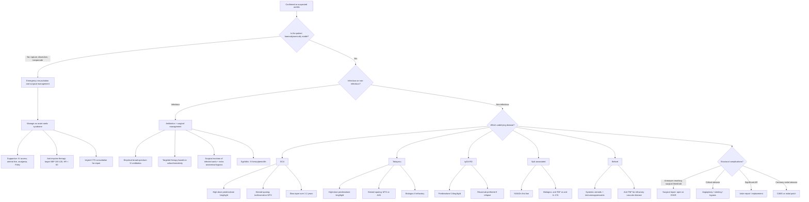

## Management of Aortitis

The management of aortitis is fundamentally driven by **two parallel goals**: (1) treat the underlying cause of the inflammation, and (2) manage the structural complications that the inflammation has produced (aneurysm, stenosis, aortic regurgitation, dissection). Think of it as putting out the fire *and* repairing the building at the same time.

Let me organise this systematically.

---

## A. Overall Management Algorithm

---

## B. Principles of Management

Before diving into specifics, let me lay out the key principles:

1. **Treat the inflammation first** — in most non-infectious aortitis, immunosuppression is the cornerstone. Operating on an actively inflamed aorta is associated with higher complication rates (anastomotic aneurysm, graft dehiscence) because inflamed tissue holds sutures poorly.

2. **Surgical intervention for structural complications** — aneurysm repair, valve replacement, revascularisation. The timing depends on urgency (emergency for rupture/dissection, elective for stable aneurysm reaching size threshold).

3. **Treat the infection before (or simultaneously with) surgery** in infectious aortitis — antibiotics alone are rarely sufficient; the infected aortic wall must be excised.

4. **Long-term surveillance** — aortitis can recur, and structural complications can develop years after initial treatment. Serial imaging is mandatory.

5. **Cardiovascular risk factor modification** — applies to all patients with aortic disease.

---

## C. Management by Aetiology

### C1. Giant Cell Arteritis (GCA)

GCA-related aortitis management is centred on **glucocorticoids**, with the critical imperative of preventing irreversible visual loss.

#### C1a. Glucocorticoids — First-Line

***Urgent high-dose systemic corticosteroids: prednisolone 1–2 mg/kg/d → slowly tapered 1–2y*** [3].

***High-dose prednisolone 1 mg/kg/day: save vision of other eye and prevent brainstem stroke*** [4].

| Scenario | Regimen | Rationale |
|---|---|---|
| **GCA without visual/neurological complications** | ***Prednisolone 1 mg/kg/d (usually 40–60 mg/d) PO*** | Suppresses granulomatous inflammation; most patients respond dramatically within 48–72h |
| **GCA with visual symptoms (AAION, amaurosis fugax)** | ***IV methylprednisolone 250–1000 mg/d for 3 days*** → then switch to oral 1 mg/kg/d | Higher bioavailability and faster onset with IV pulse therapy; aim to rescue any remaining viable retinal ganglion cells before irreversible ischaemic damage |
| **GCA with stroke/neurological complications** | IV methylprednisolone pulse → oral high-dose | Same principle as visual loss |

***Tx started upon presumed clinical dx even despite –ve initial Ix*** [3].

***For visual S/S, do NOT wait for biopsy result → start empirical steroids*** [4].

**Why steroids work in GCA**: The granulomatous inflammation is driven by T-cell and macrophage activation producing IFN-γ, IL-6, and MMPs. Glucocorticoids suppress transcription of these pro-inflammatory cytokines by binding to the glucocorticoid receptor → translocating to the nucleus → inhibiting NF-κB and AP-1. They also induce apoptosis of inflammatory cells. The result is rapid suppression of vessel wall inflammation.

**Tapering**: This is the art:
- Maintain initial dose for 2–4 weeks until symptoms resolve and ESR/CRP normalise.
- Then reduce by ~10 mg every 2 weeks down to 20 mg/d.
- Below 20 mg/d, reduce by 2.5 mg every 2–4 weeks.
- Below 10 mg/d, reduce by 1 mg every 1–2 months.
- Total duration: ***slowly tapered 1–2y*** [3]. Many patients need 18–24 months; some need longer.
- Monitor ESR/CRP at each dose reduction — if flare, increase dose back up.

***Prognosis: usually a/w dramatic response to steroid (complete resolution of S/S ≤ 48–72h of Tx)*** [3].

<Callout title="Steroid Side Effects — Must Be Addressed">
Long-term steroid use causes: osteoporosis (give calcium + vitamin D + bisphosphonate), hyperglycaemia (monitor glucose), hypertension, cataracts, adrenal suppression, weight gain, skin thinning, increased infection risk, and mood disturbance. These are especially problematic in the elderly GCA population. This is why steroid-sparing agents are essential.
</Callout>

#### C1b. Steroid-Sparing Agents

***Steroid-sparing agents: tocilizumab (anti-IL6), methotrexate upon relapsing disease*** [3].

| Agent | Mechanism | Indication | Evidence |
|---|---|---|---|
| **Tocilizumab** (anti-IL-6 receptor mAb) | Blocks IL-6 signalling → IL-6 is the master cytokine driving systemic inflammation in GCA (causes fever, raised ESR/CRP, acute-phase response). By blocking IL-6R, you cut off the inflammatory cascade at its most important node. | ***First-line steroid-sparing agent*** for GCA (2024 ACR/EULAR guidelines). Recommended for all GCA patients at diagnosis to reduce steroid exposure. | GiACTA trial: tocilizumab + steroid taper achieved sustained remission at 52 weeks in ~56% vs ~14% with steroid taper alone. |
| **Methotrexate** | Folate antagonist → inhibits purine synthesis → suppresses rapidly dividing inflammatory cells (lymphocytes). Also has anti-inflammatory effects via adenosine release. | Second-line steroid-sparing agent. Consider if tocilizumab unavailable, contraindicated, or patient has relapsing disease. | Modest benefit in meta-analyses; reduces relapse rate and cumulative steroid dose. |

**Tocilizumab dosing**: 162 mg SC weekly or IV 8 mg/kg Q4w.

**Important caveat with tocilizumab**: It normalises CRP and ESR even during active disease (because it blocks the very cytokine that drives CRP production). This means **you cannot rely on ESR/CRP to monitor disease activity** while the patient is on tocilizumab — use clinical assessment and imaging instead.

#### C1c. Aspirin

Low-dose aspirin (75–100 mg/d) is sometimes recommended in GCA to reduce the risk of ischaemic complications (visual loss, stroke) — the rationale is that GCA causes intimal hyperplasia and thrombosis. However, evidence is mixed, and recent guidelines are less emphatic about universal aspirin.

#### C1d. Surgical Management of GCA Complications

- **Thoracic aortic aneurysm**: Repair if ascending aorta > 55 mm (or > 50 mm in the context of active aortitis/rapid growth). Elective repair should ideally be performed after controlling inflammation with steroids.
- ***Aortic root disease: dilated ascending aorta > 50 mm*** is an indication for surgery even if asymptomatic [8].
- **Aortic regurgitation**: ***Valvular replacement*** if symptomatic or if ***LVEF < 50%*** or ***LV dilation: End-systolic diameter > 55 mm or end-diastolic diameter > 75 mm*** [8].

---

### C2. Takayasu Arteritis

The management of Takayasu follows a similar immunosuppressive approach but with more emphasis on revascularisation for stenotic disease and longer-term need for disease-modifying therapy in a younger population.

#### C2a. Induction — Glucocorticoids

***High dose steroids + steroid-sparing agents (MTX/AZA)*** [4].

***High-dose corticosteroids: 1 mg/kg/d up to 2–4w then taper*** [6].

- Prednisolone 1 mg/kg/d (max 60 mg/d) for 2–4 weeks, then gradual taper over 6–12 months.
- ~60% of patients achieve remission with steroids alone, but ~50% relapse during taper.

#### C2b. Steroid-Sparing Agents (Maintenance)

***Steroid-sparing agents: usually methotrexate or azathioprine*** [6].

| Agent | Dose | Notes |
|---|---|---|
| **Methotrexate** | 15–25 mg PO/SC weekly | First choice; good evidence for maintaining remission and reducing steroid dose. Give with folic acid to reduce side effects. |
| **Azathioprine** | 2–2.5 mg/kg/d | Alternative if MTX not tolerated. Check TPMT/NUDT15 before starting (pharmacogenomics — deficiency leads to severe myelosuppression). |
| **Mycophenolate mofetil** | 2–3 g/d | Used if MTX and AZA fail. |

#### C2c. Biologics (Refractory Disease)

| Agent | Mechanism | Indication |
|---|---|---|
| **Tocilizumab** (anti-IL-6R) | Same as in GCA — blocks IL-6 | Refractory/relapsing Takayasu. TAKT trial showed superiority over placebo in maintaining remission. |
| **Anti-TNF agents** (infliximab, adalimumab) | Block TNF-α → reduce granulomatous inflammation | Used in refractory disease; open-label data suggest efficacy in ~50–60%. |

#### C2d. Revascularisation for Stenotic Disease

Because Takayasu is predominantly a **stenotic** disease (unlike GCA, which is predominantly aneurysmal), revascularisation procedures are often needed:

| Modality | Indication | Considerations |
|---|---|---|
| ***Percutaneous transluminal balloon angioplasty (PTA) ± stenting*** [12] | Short-segment stenosis (e.g., subclavian, renal artery) | Less invasive; preferred for focal lesions. High restenosis rate in Takayasu (30–50%) — the inflamed arterial wall tends to re-stenose. |
| **Surgical bypass** | Long-segment stenosis, failed angioplasty, critical ischaemia | Preferred for complex, multi-vessel disease. Autologous vein grafts preferred over synthetic (lower infection risk in immunosuppressed patients). |
| **Aortic aneurysm repair** | Aneurysm reaching surgical threshold (similar principles to atherosclerotic aneurysm) | Open repair or EVAR depending on anatomy and fitness. |

**Critical principle**: ***Revascularisation should ideally be performed during disease quiescence (inactive phase)*** — operating on actively inflamed vessels leads to higher rates of anastomotic failure, restenosis, and graft thrombosis. Control inflammation first with immunosuppression, then operate electively.

---

### C3. IgG4-Related Aortitis

***Glucocorticoids as first-line treatment e.g. prednisolone 0.6 mg/kg/day*** [7].

***± other immunosuppressants: rituximab preferred over AZA/MTX/MMF*** [7].

| Step | Treatment | Detail |
|---|---|---|
| **Induction** | Prednisolone 0.6 mg/kg/d (usually 30–40 mg/d) for 2–4 weeks | IgG4-RD is characteristically **steroid-responsive** — dramatic improvement in symptoms, imaging findings, and serum IgG4 levels. |
| **Taper** | Reduce by 5 mg every 1–2 weeks to 5–10 mg/d maintenance | Relapse is common on discontinuation (~30–50%), hence maintenance needed. |
| **Maintenance / Relapse** | ***Rituximab*** (anti-CD20 monoclonal antibody) | Preferred steroid-sparing agent. Depletes B cells → reduces IgG4-producing plasma cell precursors. Effective for both induction and maintenance. Dose: 1 g IV × 2 doses 2 weeks apart, then Q6 months for maintenance. |
| **Alternatives** | AZA, MTX, MMF | If rituximab unavailable or contraindicated. Less preferred. |

**Why rituximab is preferred over conventional immunosuppressants**: IgG4-RD is a B-cell driven disease (IgG4-positive plasma cells are the effector cells). Rituximab targets CD20 on B cells, depleting the precursors of these pathogenic plasma cells. It is more targeted and effective than non-specific immunosuppressants like AZA or MTX.

**Surgical management**: If the aneurysm is large enough to warrant repair, the same surgical principles apply as for atherosclerotic AAA. However, many IgG4-related inflammatory aneurysms *shrink* with steroid therapy — so a trial of medical treatment before committing to surgery is reasonable if the aneurysm is not at imminent risk of rupture. Also, if there is ureteric obstruction from retroperitoneal fibrosis, ureteric stenting may be needed.

---

### C4. Spondyloarthropathy-Associated Aortitis

The aortitis in SpA is managed through treatment of the underlying SpA plus specific management of cardiac complications.

#### C4a. Treatment of Underlying SpA

***NSAIDs or COX-2 inhibitor as first line*** [9].

***Anti-TNF or anti-IL-17A as second line*** [9].

| Step | Agent | Notes |
|---|---|---|
| **1st line** | ***NSAIDs (e.g., naproxen 500 mg BD, ibuprofen 800 mg TDS, celecoxib 200 mg BD)*** [9] | ~70–80% report substantial relief. Have modest disease-modifying effect with continuous use. |
| **2nd line** | ***Biologics: TNF-α inhibitor (etanercept, infliximab, adalimumab) or anti-IL-17A (secukinumab)*** [9] | Indicated if ***persistent high disease activity (BASDAI ≥ 4) despite adequate trial of NSAIDs involving 2–3 NSAIDs with ≥ 2 months each*** [9]. ***C/I: active infection, latent TB, demyelinating disease, heart failure, malignancy*** [9]. |

#### C4b. Management of Cardiac Complications

- **Aortic regurgitation**: Medical management with vasodilators (***ACEI/ARB/CCB***) to reduce afterload [8]. ***Valvular replacement*** when symptomatic or when LV dysfunction develops [8].
- **Conduction defects**: Monitor ECG. Permanent pacemaker if symptomatic high-degree AV block.
- The aortitis itself in SpA does not typically respond to conventional DMARDs (sulphasalazine, MTX) — it is the biologics (anti-TNF) that may slow progression.

---

### C5. Behçet Disease

Aortitis and arterial aneurysms in Behçet carry a **high mortality** and are among the most dangerous vascular complications.

| Component | Treatment |
|---|---|
| **Immunosuppression** | High-dose corticosteroids (prednisolone 1 mg/kg/d) + cyclophosphamide or azathioprine for arterial aneurysms |
| **Biologics** | Anti-TNF (infliximab/adalimumab) for refractory vascular disease |
| **Surgery** | Aneurysm repair if needed, BUT surgery in active Behçet is fraught with complications (pseudoaneurysm at anastomosis, wound dehiscence). Immunosuppression must be optimised before and after surgery. |
| **Anticoagulation** | Controversial — VTE is common in Behçet, but arterial aneurysms can rupture with anticoagulation. Individualised decision. |

<Callout title="Behçet — Surgery is High Risk" type="error">
Behçet vascular disease is notoriously difficult to manage surgically. The inflamed vessel wall holds sutures poorly, and pseudoaneurysms at anastomotic sites are common. Endovascular approaches (stent grafts) may reduce this risk compared to open surgery, but data are limited. Always ensure adequate immunosuppression perioperatively.
</Callout>

---

### C6. Infectious Aortitis (Mycotic Aneurysm)

Infectious aortitis is a **surgical emergency** — antibiotics alone are almost never curative because the infected, necrotic aortic wall cannot heal.

#### C6a. Antimicrobial Therapy

| Scenario | Empirical Regimen | Duration |
|---|---|---|
| **Pending cultures** | Broad-spectrum: IV vancomycin + piperacillin-tazobactam (or meropenem) | Until culture and sensitivity available |
| ***Non-typhoid Salmonella*** | IV ceftriaxone 2 g/d (or ciprofloxacin if susceptible) | Minimum 6 weeks IV; some advocate lifelong oral suppressive therapy |
| ***Staphylococcus aureus*** | IV flucloxacillin (MSSA) or vancomycin (MRSA) | Minimum 6 weeks IV |
| ***Syphilitic aortitis*** | ***IV benzylpenicillin G 3–4 MU Q4h for 10–14 days*** (or IM benzathine penicillin if non-neurosyphilis) | Per syphilis treatment guidelines. Note: treating the syphilis will not reverse existing structural damage (aneurysm, AR), but will halt further progression. |

**Why prolonged antibiotics are needed**: The aortic wall is relatively avascular (especially the media), and biofilm on prosthetic grafts or thrombus makes organisms difficult to eradicate. Short courses lead to recurrence.

#### C6b. Surgical Management

***Graft excision with extra-anatomical bypass*** [5] is the classical approach for infected aortic aneurysms.

| Step | Detail | Rationale |
|---|---|---|
| 1. Debridement | Excise all infected aortic tissue with wide margins | Remove the nidus of infection — necrotic, pus-filled wall will not heal |
| 2. Reconstruction | **Option A**: Extra-anatomical bypass (e.g., axillofemoral bypass) + aortic stump ligation | Routes the graft through clean tissue planes, away from the infected field. Lower risk of graft infection but poorer long-term patency. |
| | **Option B**: In-situ reconstruction with antibiotic-soaked graft or cryopreserved allograft | Graft placed in the same anatomical position. Better haemodynamics and patency. Risk of re-infection, but reduced with antibiotic-impregnated grafts (rifampicin-soaked Dacron). |
| | **Option C**: EVAR (endovascular stent graft) as bridge or definitive in high-risk patients | Less invasive; may be used as temporising measure in septic, haemodynamically unstable patients. Long-term durability in infected field is uncertain. |
| 3. Prolonged antibiotics | Minimum 6 weeks IV post-surgery, often lifelong oral suppression | Sterilise the operative field and prevent recurrent infection |

---

### C7. Clinically Isolated Aortitis

- Discovered incidentally on histology after aortic aneurysm repair.
- No systemic disease identified.
- Management:
  1. Thorough workup to exclude systemic vasculitis (ESR/CRP, ANCA, IgG4, syphilis serology, autoantibodies).
  2. If all negative → **observation with serial imaging** (CTA or MRA at 3–6 months, then annually).
  3. Some experts advocate a short course of glucocorticoids, but this is controversial.
  4. Long-term follow-up is essential — ~15–20% may develop overt GCA or Takayasu over subsequent years.

---

## D. Management of Structural Complications (Regardless of Aetiology)

### D1. Aortic Aneurysm

***Surgical management indications*** [5]:

| Criterion | Threshold |
|---|---|
| ***AAA ≥ 5.5 cm (UK Small Aneurysm Trial) / 5 cm (local HK consensus)*** [5] | Size-based threshold |
| ***Rapidly expanding AAA (> 1 cm/year or > 0.5 cm/6 months)*** [5] | Growth rate |
| ***Symptomatic AAA e.g. pain, distal embolisation*** [5] | Symptoms indicate impending rupture |
| Thoracic aortic aneurysm > 55 mm (or > 50 mm in connective tissue disease/aortitis) | Lower threshold for inflammatory aneurysms |

**Conservative management for sub-threshold aneurysm** [5]:
- ***CV risk factor modification: smoking cessation, BP control, statin, aspirin, weight loss, exercise*** [5]
- ***USG monitoring: yearly for 3.0–3.9 cm, Q6m for 4.0–5.4 cm*** [5]

***Open repair vs EVAR*** [5]:
- ***EVAR: less 30-day morbidity and mortality, shorter hospitalisation, rapid return of QoL*** [5]
- ***Open: lower risk of rupture / re-intervention in the long run*** [5]
- ***No significant difference in long-term morbidity and mortality*** [5]

For inflammatory aneurysms (IgG4-RD, GCA), medical therapy may reduce aneurysm size, so a trial of immunosuppression is warranted before committing to surgery in non-urgent cases.

### D2. Aortic Dissection

***Management of aortic dissection*** [2][13]:

| Component | Detail |
|---|---|
| ***Supportive*** | ***NPO, complete bed rest, O2, cardiac monitor, analgesia*** [2] |
| ***Monitoring*** | ***Book CCU / ICU bed for intensive monitoring of BP/P, ECG, I/O*** [2] |
| ***Anti-impulse therapy*** | ***Target SBP 100–120 (MAP 60–75), HR 60–70*** [2] |
| ***1st line*** | ***IV labetalol*** (***α1 blocker + non-selective β blocker*** [2]) or ***esmolol***; alternative: ***diltiazem/verapamil (non-DHP CCB) if BB contraindicated*** [13] |
| ***2nd line*** | ***IV sodium nitroprusside (with labetalol pre-Tx)*** [13] — must give beta-blocker first to prevent reflex tachycardia |
| ***Surgery — Type A*** | ***ALL Type A → usually open repair*** [13]. ***Bentall procedure if AV, root, ascending aorta replaced*** [13]. |
| ***Surgery — Type B*** | ***If complicated*** (organ ischaemia, aneurysm, rupture, retrograde dissection, Marfan's) → ***endovascular stent-grafting vs open*** [13] |
| ***Long-term*** | ***Lifelong antihypertensive therapy to aim target BP < 120/80 mmHg*** [13]. ***Serial imaging (MRA/CTA at 3, 6, 12 mo)*** [13]. |

***Hydralazine is C/I in aortic dissection*** [2] — it causes reflex tachycardia which increases aortic wall shear stress (dP/dt), promoting further dissection.

### D3. Aortic Regurgitation

***Management of AR*** [8]:

| Component | Detail |
|---|---|
| **Medical** | ***Diuretics; Vasodilators for HT: ACEI/ARB/CCB*** [8] — reduce afterload → decrease regurgitant volume → delay LV decompensation |
| ***Valvular replacement*** | When symptomatic (HF, angina), or if asymptomatic with ***LVEF < 50%***, or ***LV dilation (ESD > 55 mm or EDD > 75 mm)***, or ***dilated ascending aorta > 50 mm*** [8] |
| ***Acute severe AR*** | ***Surgical emergency (e.g., IE)*** [8] → valve replacement |

### D4. Aortic Stenosis / Branch Vessel Stenosis

- ***PTA ± stenting*** for focal stenosis [12].
- ***Bypass surgery*** for long-segment or failed endovascular treatment.
- ***Endarterectomy*** at specific sites (e.g., carotid, femoral bifurcation) [5].
- Always control underlying inflammation before elective revascularisation.

---

## E. Long-Term Monitoring and Follow-Up

| Component | Detail |
|---|---|
| **Disease activity** | Serial ESR/CRP (except on tocilizumab — use clinical + imaging). For IgG4-RD: serum IgG4 levels. |
| **Imaging surveillance** | CTA or MRA at 3, 6, 12 months after diagnosis, then annually. More frequent if aneurysm present. PET-CT to assess treatment response if needed. |
| **Steroid side effects** | Bone densitometry (DEXA) at baseline; calcium + vitamin D + bisphosphonate if indicated. Monitor glucose, BP, weight, eyes (cataracts/glaucoma). |
| **Immunosuppressant monitoring** | MTX: CBC + LFT Q2–4 weeks initially, then Q3 months. AZA: CBC + LFT similarly. Rituximab: immunoglobulin levels, hepatitis B screening before starting. |
| **Cardiovascular risk** | BP control, lipid management, smoking cessation, antiplatelet therapy as appropriate. |
| **Screening for new complications** | Annual echocardiography if aortic root disease. ECG for conduction defects (SpA). Ophthalmological review (GCA). |

---

## F. Summary Table — Treatment by Aetiology

| Aetiology | First-Line | Steroid-Sparing | Surgery | Special Considerations |
|---|---|---|---|---|
| **GCA** | Prednisolone 1 mg/kg/d | Tocilizumab (preferred), MTX | Aneurysm repair, AVR if needed | Never delay steroids for visual symptoms |
| **Takayasu** | Prednisolone 1 mg/kg/d | MTX, AZA; tocilizumab/anti-TNF if refractory | PTA ± stenting, bypass for stenosis; aneurysm repair | Revascularise in quiescent phase |
| **IgG4-RD** | Prednisolone 0.6 mg/kg/d | Rituximab (preferred) | Aneurysm repair if needed; ureteric stenting for RPF | Trial of steroids may shrink aneurysm |
| **SpA** | NSAIDs | Anti-TNF, anti-IL-17A | AVR, pacemaker for heart block | Oral steroids risk psoriasis flare in PsA |
| **Behçet** | Prednisolone + CYC/AZA | Anti-TNF (infliximab) | Aneurysm repair (high complication risk) | Immunosuppression perioperatively is critical |
| **Mycotic** | IV antibiotics (ceftriaxone for Salmonella, flucloxacillin/vancomycin for Staph) | N/A | Excision + extra-anatomical bypass or in-situ graft | Lifelong suppressive antibiotics may be needed |
| **Syphilitic** | IV benzylpenicillin | N/A | AVR for AR, aneurysm repair | Structural damage is irreversible; treatment halts progression |

---

<Callout title="High Yield Summary — Management of Aortitis">

**Core Principle**: Treat the inflammation AND the structural complications.

**GCA**: High-dose prednisolone immediately (never delay for visual symptoms). Tocilizumab as first-line steroid-sparing. Taper over 1–2 years. Dramatic response expected within 48–72h.

**Takayasu**: Prednisolone + MTX/AZA. Biologics for refractory disease. Revascularise during quiescent phase — operating on actively inflamed vessels leads to failure.

**IgG4-RD**: Prednisolone 0.6 mg/kg/d → rituximab if relapse. Aneurysm may shrink with medical therapy.

**SpA-associated**: NSAIDs first, then anti-TNF/anti-IL-17A. AVR for significant AR. Pacemaker for heart block.

**Infectious**: IV antibiotics (prolonged) + surgical excision of infected aorta ± extra-anatomical bypass. Syphilitic: IV penicillin (halts progression but does not reverse structural damage).

**Aortic dissection**: Anti-impulse therapy (labetalol), SBP 100–120, HR < 60. Type A = ALL go to surgery. Type B = surgery only if complicated.

**AR management**: Vasodilators (ACEI/ARB/CCB). Valve replacement if symptomatic, LVEF < 50%, LV dilated, or ascending aorta > 50 mm.

**Long-term**: Serial imaging, steroid side-effect monitoring, CV risk factor modification.

</Callout>

---

<ActiveRecallQuiz
  title="Active Recall - Management of Aortitis"
  items={[
    {
      question: "A 74-year-old woman with confirmed GCA develops sudden visual loss in one eye. What is the immediate management, and why must you not wait for temporal artery biopsy results?",
      markscheme: "Immediate IV methylprednisolone 250-1000 mg/d for 3 days, then switch to oral prednisolone 1 mg/kg/d. Do not wait for biopsy because AAION causes irreversible retinal ganglion cell death within hours. The goal is to save the vision of the other eye and prevent further ischaemic complications (brainstem stroke). Biopsy remains positive for up to 2 weeks after starting steroids."
    },
    {
      question: "Why is tocilizumab the preferred steroid-sparing agent in GCA, and what is the important monitoring caveat when using it?",
      markscheme: "Tocilizumab blocks IL-6 receptor. IL-6 is the master cytokine driving systemic inflammation in GCA (fever, raised ESR/CRP, acute-phase response). GiACTA trial showed superior sustained remission versus steroid taper alone. Caveat: tocilizumab normalises CRP and ESR even during active disease because it blocks the cytokine that drives CRP production. Therefore ESR/CRP cannot be relied upon to monitor disease activity while on tocilizumab; clinical assessment and imaging must be used instead."
    },
    {
      question: "Why should elective revascularisation in Takayasu arteritis be performed during the quiescent (inactive) phase of the disease?",
      markscheme: "Operating on actively inflamed vessels leads to higher rates of anastomotic failure, graft dehiscence, pseudoaneurysm formation, and restenosis because the inflamed vessel wall is oedematous, friable, and holds sutures poorly. Controlling inflammation first with immunosuppression allows the wall to heal and fibroses, providing better tissue quality for surgical repair."
    },
    {
      question: "What is the preferred immunosuppressive strategy for IgG4-related aortitis and why is rituximab preferred over methotrexate or azathioprine?",
      markscheme: "First-line: prednisolone 0.6 mg/kg/d. For relapse or steroid-sparing: rituximab (anti-CD20) is preferred. Rituximab is preferred because IgG4-RD is a B-cell driven disease with IgG4-positive plasma cells as effector cells. Rituximab depletes CD20-positive B cells, which are the precursors of pathogenic plasma cells. It is more targeted and effective than non-specific immunosuppressants like AZA or MTX."
    },
    {
      question: "A patient with a mycotic aortic aneurysm due to non-typhoid Salmonella is started on IV ceftriaxone. Why are antibiotics alone insufficient, and what is the surgical approach?",
      markscheme: "Antibiotics alone are insufficient because the infected, necrotic aortic wall cannot heal and serves as a persistent nidus of infection. Biofilm on thrombus further protects organisms. Surgical approach: excision of all infected aortic tissue with wide margins, followed by either (1) extra-anatomical bypass (routes graft through clean tissue planes, lower re-infection risk but poorer patency) or (2) in-situ reconstruction with antibiotic-soaked graft (better haemodynamics but risk of re-infection). Prolonged IV antibiotics (minimum 6 weeks) and potentially lifelong oral suppressive therapy are needed post-operatively."
    }
  ]}
/>

## References

[2] Senior notes: Maksim Medicine Notes.pdf (p15)
[3] Senior notes: Ryan Ho Rheumatology.pdf (p95)
[4] Senior notes: Maksim Medicine Notes.pdf (p311, p332)
[5] Senior notes: Maksim Surgery Notes.pdf (p162)
[6] Senior notes: Ryan Ho Rheumatology.pdf (p96)
[7] Senior notes: Maksim Medicine Notes.pdf (p335)
[8] Senior notes: Maksim Medicine Notes.pdf (p35)
[9] Senior notes: Ryan Ho Rheumatology.pdf (p58, p60, p62)
[12] Senior notes: Ryan Ho Diagnostic Radiology.pdf (p84–85)
[13] Senior notes: Ryan Ho Cardiology.pdf (p221)
