## Complications of CA Lung

Complications of lung cancer arise from four major sources: (1) the disease itself (local, regional, and distant), (2) paraneoplastic syndromes, (3) treatment side effects, and (4) procedural complications from diagnostic and staging investigations. On a ward round, you need to anticipate and recognise each of these — they are what actually kills patients and drives emergency presentations.

---

### 1. Complications of the Disease Itself

These complications are essentially the **advanced clinical features** of the tumour, but framed from a management perspective — i.e., the things that go wrong that require urgent action.

#### 1.1 Oncological Emergencies

These are the "don't miss" complications. If you recognise them, the patient lives. If you don't, they die or suffer irreversible harm.

##### A. Superior Vena Cava Obstruction (SVCO)

- **Mechanism**: Tumour mass or enlarged right paratracheal/precarinal lymph nodes compress or invade the thin-walled SVC → obstruction of venous return from the head, neck, and upper limbs → venous hypertension proximal to the obstruction.
- **Why it's dangerous**: Progressive cerebral oedema (venous congestion → raised ICP), laryngeal oedema (airway compromise).
- **Most common cause**: ***Lung cancer (especially SCLC — central, aggressive)*** and lymphoma account for ~90% of malignant SVCO [2].
- **Management**: ***Palliative RT for complications (e.g., SVCO, cord compression)*** [1]. SVC stenting provides rapid relief. SCLC responds quickly to chemotherapy alone. Dexamethasone reduces peritumoral oedema. Head elevation, loop diuretics for symptomatic relief.
- **Prognosis**: SVCO itself is rarely immediately fatal, but it indicates locally advanced disease.

##### B. Malignant Spinal Cord Compression

- **Mechanism**: Vertebral body metastasis → collapse/expansion into the spinal canal → compression of the spinal cord or cauda equina → ischaemia and demyelination → paraplegia if untreated.
- **Presentation**: Back pain (often precedes neurological symptoms by weeks) → bilateral lower limb weakness → sensory level → urinary retention (an LMN sign if cauda equina, or overflow if UMN cord compression) → faecal incontinence.
- **Why it's dangerous**: Once established neurological deficit has persisted > 48 hours, recovery is unlikely even with treatment.
- **Management**: ***Palliative RT for complications (e.g., SVCO, cord compression)*** [1]. Dexamethasone 16 mg stat then 8 mg BD (reduces peritumoral oedema → buys time). Urgent MRI whole spine. Surgical decompression if single level + good prognosis + life expectancy > 3 months. Emergency RT if multi-level or poor prognosis.

##### C. Cardiac Tamponade

- **Mechanism**: Malignant pericardial effusion (direct invasion or haematogenous spread to the pericardium) → fluid accumulates in the pericardial sac → compresses the heart → impaired diastolic filling → reduced cardiac output → cardiogenic shock.
- **Presentation**: Beck's triad (hypotension, distended neck veins, muffled heart sounds). Pulsus paradoxus (exaggerated drop in systolic BP > 10 mmHg on inspiration). Electrical alternans on ECG (QRS complexes of alternating height due to swinging heart within the effusion).
- **Management**: Emergency pericardiocentesis (usually echo-guided subcostal approach). Pericardial drain insertion. Consider pericardial window surgery for recurrent effusions.

##### D. Massive Haemoptysis

- **Mechanism**: Tumour erodes into a pulmonary artery branch or bronchial artery → catastrophic bleeding into the airway → death from asphyxiation (drowning in blood), not from haemorrhage.
- **Management**: Protect airway: position patient **lateral on the bleeding side** (so blood doesn't flood the good lung). Intubation with a **double-lumen endotracheal tube** (preferred) to isolate the bleeding lung. Flexible bronchoscopy → bronchial artery embolisation (BAE) → emergency lung resection (last resort) [7].

##### E. Airway Obstruction

- **Mechanism**: Endobronchial tumour growth or extrinsic compression by lymph nodes → critical narrowing of trachea/main bronchus → stridor → respiratory failure.
- **Management**: ***Bronchoscopic laser therapy or stenting to relieve airway obstruction*** [2]. Emergency debulking with Nd:YAG laser. Self-expanding metallic stent to maintain airway patency. External beam RT or brachytherapy for longer-term palliation.

<Callout title="Oncological Emergencies — Must Know for Exams" type="error">
The 5 oncological emergencies in lung cancer you must recognise:
1. **SVCO** → RT / stent / chemo (SCLC)
2. **Cord compression** → dexamethasone + urgent MRI + RT/surgery
3. **Cardiac tamponade** → pericardiocentesis
4. **Massive haemoptysis** → protect airway + BAE
5. **Airway obstruction** → laser / stent

All of these can present as the **first presentation** of the cancer.
</Callout>

#### 1.2 Malignant Pleural Effusion (MPE)

***Occurs in 50% of all metastatic malignancy, especially NSCLC*** [7].

- **Mechanism**: ***Direct invasion from neighbouring structures, haematogenous spread, lymphatic obstruction*** [7]. Tumour cells on the pleura increase vascular permeability → exudative effusion. Lymphatic obstruction impairs normal pleural fluid reabsorption.
- **Clinical impact**: Progressive dyspnoea, reduced exercise tolerance. Indicates M1a disease (stage IV) — i.e., incurable by surgery.
- **Management**:
  - ***Repeated chest drain every few weeks*** [7]
  - ***Chemical pleurodesis (1st line)*** if recurrent [7]
  - ***Surgical pleurodesis*** if good performance status [7]
  - ***Long-term ambulatory indwelling pleural catheter (IPC)*** if short life expectancy or trapped lung [7]
  - ***Pleuroperitoneal shunt (e.g., Denver shunt)*** if short life expectancy or trapped lung [7]

> Trapped lung: When tumour encases the visceral pleura, the lung cannot re-expand even after fluid drainage → pleurodesis fails (because the two pleural surfaces cannot make contact). In this situation, IPC or shunt is appropriate [7].

#### 1.3 Post-Obstructive Pneumonia and Lung Abscess

- **Mechanism**: Endobronchial tumour blocks a bronchus → mucus stagnation distal to the obstruction → bacterial superinfection → pneumonia → may progress to abscess formation (especially with anaerobic organisms).
- **Clinical clue**: ***Unresolving pneumonia*** or recurrent pneumonia in the same lobe [2]. The classic exam trap — always suspect underlying malignancy.
- **Management**: Antibiotics (cover anaerobes if abscess suspected — e.g., amoxicillin-clavulanate, metronidazole). Bronchoscopy to relieve obstruction (debulk/stent). Treat the underlying cancer.

#### 1.4 Metabolic and Paraneoplastic Complications

| Complication | Mechanism | Key Points |
|---|---|---|
| **Hyponatraemia (SIADH)** | SCLC → ectopic ADH → water retention → dilutional hyponatraemia | ***Management of complications, e.g., electrolyte imbalance*** [2]. Fluid restriction (1st line). If severe/symptomatic: hypertonic saline (3% NaCl, very cautiously — risk of osmotic demyelination if corrected too fast). |
| **Hypercalcaemia** | SCC → ectopic PTHrP; any subtype → osteolytic bone metastases | Rehydration (aggressive IV NS), loop diuretics (only after rehydration), bisphosphonates (zoledronic acid — inhibits osteoclast activity), denosumab (anti-RANKL). Definitive: treat the cancer. |
| **Ectopic Cushing's** | SCLC → ectopic ACTH → adrenal cortisol overproduction | Hypokalaemic metabolic alkalosis, severe proximal myopathy, immunosuppression. May require ketoconazole/metyrapone to control cortisol before definitive cancer treatment. |
| **Hypercoagulability (Trousseau syndrome)** | Tumour secretes tissue factor, mucin → activation of coagulation cascade | DVT, PE, migratory thrombophlebitis. Cancer-associated VTE: treat with LMWH or DOAC (rivaroxaban, apixaban, edoxaban). |

#### 1.5 Brain Metastases

- ***Brain metastasis often implies poor prognosis (survival ≤ 6 months)*** [18].
- ***Untreated: 1 month. Surgery + WBRT: ~10–12 months*** [18].
- Complications of brain mets: raised ICP (headache, vomiting, papilloedema, decreased consciousness), seizures, focal neurological deficits, personality/cognitive change.
- Management: ***Dexamethasone + AED for symptomatic relief*** [18]. ***Surgery ± adjuvant RT if solitary operable lesion*** [18]. ***SRS for small/inoperable lesions*** [18]. ***WBRT if multiple bulky tumours*** [18].

---

### 2. Complications of Treatment

#### 2.1 Surgical Complications

***VATS lobectomy*** has improved outcomes compared to open thoracotomy, but complications still occur.

From the HK VATS experience [3]:

***Complications reported include persistent air leak over 10 days, wound infection, supraventricular tachycardia, and recurrence of tumour over the utility thoracotomy scar*** [3].

***Significantly more postoperative complications occurred in the thoracotomy group*** compared to VATS [3], ***the majority of which were prolonged air leaks*** [3].

| Complication | Mechanism | Management |
|---|---|---|
| ***Persistent air leak (> 7 days)*** [3] | Failure of the staple line or visceral pleural defect → air leaks from lung parenchyma into the pleural space via chest drain | Conservative: maintain chest drain with suction → most seal spontaneously. If > 10–14 days: pleurodesis (chemical or surgical), endobronchial valve (EBV) placement [7]. ***NEVER clamp a bubbling drain*** (risk of tension pneumothorax) [7]. |
| **Pneumonia / respiratory failure** | ***↑risk if ppoFEV₁ or ppoDLCO < 40% predicted*** [2]. Post-operative atelectasis (hypoventilation, mucus retention) → secondary infection. | Chest physiotherapy (incentive spirometry/Triflow — ***10× per 30 minutes*** [3]), early mobilisation (***sit out day 1, self-mobilising by day 3*** [3]), antibiotics. |
| **Bronchopleural fistula (BPF)** | Dehiscence (breakdown) of the bronchial stump → communication between bronchial tree and pleural space → pneumothorax, empyema | ***Continue chest drain with low wall suction → CT thorax to localise → pleurodesis or surgery*** [7]. This is the most feared surgical complication — mortality is high. |
| ***Supraventricular tachycardia*** [3] | Post-operative autonomic irritation, sympathetic surge, pericardial inflammation, electrolyte disturbance → atrial fibrillation or SVT | Rate control (metoprolol, diltiazem), correct electrolytes (Mg²⁺, K⁺), amiodarone if refractory. |
| ***Wound infection*** [3] | Surgical site contamination | Antibiotics, wound care. Less common with VATS (smaller incisions). |
| ***Tumour recurrence at thoracotomy scar*** [3] | Tumour cell implantation during surgery | Rare but reported. Reason to minimise tissue handling and use specimen retrieval bags. |
| **Post-pneumonectomy pulmonary oedema** | The remaining lung receives the entire cardiac output → increased hydrostatic pressure → oedema. Also, lymphatic disruption. | Restrict IV fluids post-pneumonectomy (aim for fluid negative balance). This complication has ~50% mortality. |
| **Right-sided heart failure** | Pneumonectomy reduces the pulmonary vascular bed → ↑pulmonary vascular resistance → ↑RV afterload → RV failure | More common after right pneumonectomy (larger vascular bed removed). Avoid excessive fluid loading. |
| **Empyema** | Infection of the pleural space, especially if BPF | Chest drain, antibiotics, consider decortication if chronic. |

**Post-operative care pathway** (from the VATS clinical pathway) [3]:
- ***Day 0***: Intensive monitoring, chest drain to suction, IV fluids, IV antibiotics, PCA analgesia, sit up in bed as tolerated, begin Triflow use
- ***Day 1***: Off O₂, off suction, off PCA, off IV fluids, resume Aspirin/Plavix, post-op chest physiotherapy, sit out all day, mobilise
- ***Day 2***: ***Off chest drain if: no air leak, output acceptable, lung expanded on CXR***
- ***Day 3–5***: ***Discharge if patient safe, mobile, independent***
- CXR is performed: after off suction, after drain removal, and before discharge [3]

#### 2.2 Radiation Therapy Complications

| Complication | Timing | Mechanism | Management |
|---|---|---|---|
| ***Acute radiation pneumonitis*** | ***4–12 weeks after RT*** [2] | RT damages alveolar epithelial cells and capillary endothelium → inflammatory exudate in alveoli → impaired gas exchange | ***S/S: dry cough, SOB, low-grade fever, pleuritic chest pain*** [2]. ***HRCT: GGO (acute) → consolidation (organising phase) conforming to RT field (diagnostic)*** [2]. ***Mx: observe if minimal; otherwise steroids*** [2]. ***Expect clinical + radiological response in 3–4 days. Continue steroid for 3–4 weeks before tapering*** [2]. |
| ***Fibrotic radiation pneumonitis*** | ***6–12 months after RT*** [2] | Chronic fibrotic change in the irradiated lung parenchyma → permanent volume loss | Irreversible. ***Use of steroid does not reduce long-term risk of fibrosis*** [2]. Manage with bronchodilators, supplemental O₂ if needed. |
| **Radiation oesophagitis** | During/shortly after concurrent chemoRT | RT damages oesophageal mucosa → inflammation, ulceration | Dysphagia, odynophagia. Manage with PPI, viscous lidocaine, soft diet. Usually self-limiting. Can progress to stricture. |
| **Radiation myelopathy** | Months to years | Direct damage to spinal cord (if cord is within the radiation field) | Progressive weakness, sensory loss. Irreversible. Dose limit: 45–50 Gy to the spinal cord. |
| **Radiation-induced cardiac disease** | Years | Pericarditis, coronary artery disease, cardiomyopathy | More relevant with mediastinal RT. Monitor long-term cardiac risk. |

<Callout title="Radiation Pneumonitis vs Lymphangitis Carcinomatosis" type="error">
Both can cause progressive dyspnoea after treatment. The key differentiator is that ***radiation pneumonitis conforms to the RT field*** [2] (sharp geometric borders on HRCT), while lymphangitis carcinomatosis is diffuse with septal thickening (Kerley B lines). Getting this distinction wrong can lead to inappropriate steroid treatment or missed disease progression.
</Callout>

#### 2.3 Chemotherapy Complications

| Drug | Key Toxicities | Mechanism |
|---|---|---|
| **Cisplatin** | Nephrotoxicity (dose-limiting), ototoxicity, peripheral neuropathy, severe nausea/vomiting | Direct tubular damage (requires aggressive IV hydration + monitoring of Cr, Mg²⁺). Damage to hair cells of cochlea. Axonal degeneration of sensory nerves. Stimulates CTZ → severe emesis (always give 5-HT3 antagonist + dexamethasone + NK1 antagonist). |
| **Carboplatin** | Myelosuppression (dose-limiting — especially thrombocytopenia), nausea (less than cisplatin) | Less nephrotoxic than cisplatin (no need for aggressive hydration). Dose calculated by AUC using Calvert formula (considers GFR). |
| **Etoposide** | Myelosuppression (neutropenia), alopecia, secondary leukaemia (AML — years later) | Topoisomerase II inhibition → can cause balanced translocations at MLL gene → secondary AML (~1–2% risk). |
| **Pemetrexed** | Myelosuppression, mucositis, rash, diarrhoea | Antifolate → must supplement with **folic acid + vitamin B12** to reduce toxicity (folic acid daily for ≥ 5 doses before first pemetrexed, B12 IM every 9 weeks). |
| **General** | Neutropenic sepsis | Chemotherapy destroys rapidly dividing cells including bone marrow → neutropenia → susceptibility to infection → life-threatening sepsis. Febrile neutropenia (fever + ANC < 0.5 × 10⁹/L) is a medical emergency — IV broad-spectrum antibiotics (e.g., piperacillin-tazobactam) within 1 hour. |

#### 2.4 Targeted Therapy Complications

| Drug Class | Key Toxicities | Mechanism |
|---|---|---|
| **EGFR TKIs** (osimertinib, gefitinib, erlotinib) | Skin rash (acneiform — face, trunk), diarrhoea, paronychia, ***interstitial lung disease/pneumonitis*** (rare but potentially fatal) | EGFR is expressed in skin and GI epithelium → blocking it causes dermatological and GI side effects. ILD: immune-mediated pneumonitis — must stop TKI immediately + steroids. |
| **ALK TKIs** (alectinib, crizotinib, lorlatinib) | Visual disturbance (crizotinib), peripheral oedema, hepatotoxicity, bradycardia, hyperlipidaemia (lorlatinib), CNS effects (lorlatinib — mood changes, cognitive slowing) | Variable off-target kinase effects. Monitor LFTs regularly. |

#### 2.5 Immunotherapy Complications (Immune-Related Adverse Events — irAEs)

Checkpoint inhibitors (pembrolizumab, durvalumab, atezolizumab, nivolumab) work by "releasing the brakes" on the immune system. The trade-off is that the unleashed immune system can attack normal tissues → **autoimmune-like toxicities affecting virtually any organ**:

| Organ | irAE | Incidence | Management |
|---|---|---|---|
| **Skin** | Rash, pruritus, vitiligo | ~30–40% (most common) | Topical steroids, antihistamines. Rarely requires treatment interruption. |
| **GI** | Colitis (diarrhoea, bloody stool, abdominal pain) | ~10–20% | Grade 1–2: loperamide + budesonide. Grade 3–4: hold immunotherapy + high-dose IV methylprednisolone. If steroid-refractory: infliximab (anti-TNF). |
| **Liver** | Hepatitis (↑AST/ALT) | ~5–10% | Monitor LFTs every cycle. Grade 3–4: hold immunotherapy + steroids. If refractory: mycophenolate mofetil. |
| **Endocrine** | Thyroiditis (hypo > hyper), hypophysitis (pituitary inflammation), adrenalitis, Type 1 DM | ~10–15% | TFTs every cycle. Thyroid: thyroxine replacement if hypothyroid. Hypophysitis: hydrocortisone replacement (often permanent). Type 1 DM: insulin. |
| **Lung** | ***Pneumonitis*** | ~3–5% (but potentially fatal) | Most feared pulmonary complication. Cough, dyspnoea, GGO/organising pneumonia on CT. Grade 1: monitor. Grade 2: hold immunotherapy + oral prednisolone. Grade ≥ 3: permanently discontinue + IV methylprednisolone. |
| **Neurological** | Myasthenia gravis, Guillain-Barré, encephalitis | ~1% | Rare but serious. High-dose steroids, IVIG, plasmapheresis. Permanently discontinue immunotherapy. |
| **Cardiac** | Myocarditis | < 1% | Rare but ~50% mortality. Troponin monitoring. High-dose steroids. Permanently discontinue. |

<Callout title="Immunotherapy Pneumonitis — Critical Distinction">
You must distinguish **immunotherapy-induced pneumonitis** (which requires stopping the drug and giving steroids) from **disease progression** (which requires escalating treatment) and **infection** (which requires antibiotics, not steroids). All three can present with new dyspnoea + new infiltrates on CT during treatment. Get a BAL (bronchoscopy with lavage) if in doubt.
</Callout>

---

### 3. Complications of Diagnostic and Staging Procedures

#### 3.1 CT-Guided FNAC / Transthoracic Needle Biopsy

***Complications of CT-guided FNAC*** [1]:
- ***Pneumothorax (50%)*** — but ***< 10% require drainage*** [1]. Most are small and self-resolving. Risk factors: emphysematous lungs, deep lesions requiring traversal of aerated lung, smaller lesion size.
- ***Haemothorax*** [1] — from intercostal artery injury or laceration of pulmonary vasculature.
- ***Missed lesion*** [1] — especially small or mobile lesions.
- ***Pleural seeding*** [1] — tumour cells deposited along the needle tract. Rare (~0.003–0.009%) [14].
- ***Air embolism*** [1] — extremely rare but potentially fatal. Air enters the pulmonary vein → systemic embolism (coronary or cerebral). Prevented by ensuring the needle stylet is in place during positioning.

More comprehensive complication rates from radiology notes [14]:
- ***Pneumothorax: 10–30%, 1/3 require chest drain*** [14]
- ***Haemoptysis: 2–12%, usually mild*** [14]
- ***Vascular damage: bleeding, arteriovenous fistulas, pseudoaneurysm*** [14]
- ***Infection*** [14]
- ***Organ injury*** [14]
- ***Needle tract tumour seeding (rare, 0.003–0.009%)*** [14]

#### 3.2 Bronchoscopy Complications

| Complication | Details |
|---|---|
| Bleeding | From biopsy site. Usually minor and self-limiting. Rarely significant enough to require intervention. |
| Pneumothorax | Especially after transbronchial biopsy. ~1–4%. |
| Bronchospasm | Particularly in asthmatic/COPD patients. |
| Respiratory depression | From sedation. |
| Laryngospasm | Reflex vagal response to airway instrumentation. |

#### 3.3 Chest Drain Complications [7]

***Complications*** [7]:
- ***Failed procedure*** [7]
- ***Puncture-related: pneumothorax, haemothorax/haemoptysis, surgical emphysema, organ perforation, damage to neurovascular bundle, bronchopleural fistula, segmentation (pockets formed by scar after each puncture)*** [7]
- ***Drain-related: re-expansion pulmonary oedema (in pleural effusion — avoid drain > 1.5 L in 30 minutes), blockage, dislodgement*** [7]
- ***Infection (e.g., empyema)*** [7]

#### 3.4 Pleurodesis Complications [7]

***Chemical pleurodesis complications*** [7]:
- ***Fever*** [7] — expected inflammatory response
- ***Pain*** [7] — ***avoid NSAID (inflammatory action essential)*** [7]. Use opioids or paracetamol instead.
- ***ARDS*** [7] — ***use larger particle talc to prevent systemic absorption*** [7]. Small particle talc can cross the pleural membrane → systemic inflammatory response → ARDS. Current recommendation: use graded (large-particle) talc.
- ***Cardiac arrest*** [7] — ***higher risk in very ill patients with poor general condition*** [7]. Likely vagal-mediated.

---

### 4. Long-Term Complications and Prognosis

#### 4.1 Why Lung Cancer Has Poor Prognosis

***CA lung has poor prognosis because*** [2]:
1. ***Late presentation*** [2] — most patients are symptomatic only when disease is locally advanced or metastatic
2. ***Early lymph node metastasis renders disease inoperable*** [2] — N2 disease precludes curative surgery
3. ***Advanced stage is inoperable (dependent on lung volume)*** [2] — patients with COPD from smoking have insufficient lung reserve to tolerate resection

#### 4.2 Disease Recurrence After Curative Treatment

| Type | Timing | Mechanism | Surveillance |
|---|---|---|---|
| **Local recurrence** | Months to years | Residual microscopic disease at resection margins or in regional lymph nodes | CT thorax Q6 months for 2 years, then annually for 5 years (at minimum). |
| **Distant recurrence** | Months to years | Micrometastases present at diagnosis but undetectable by imaging → grow over time | Same surveillance. Symptoms: new bone pain, headache, weight loss. |
| **Second primary lung cancer** | Years | Field cancerisation — the entire bronchial epithelium was exposed to carcinogens → multiple areas can undergo malignant transformation independently | Annual LDCT in continued smokers. Risk of second primary is ~1–2% per year. |

#### 4.3 Treatment-Related Long-Term Complications

| Complication | Cause | Timeline |
|---|---|---|
| **Chronic radiation fibrosis** | Thoracic RT | 6–12 months post-RT; permanent |
| **Secondary malignancy** | Alkylating agents (cisplatin), etoposide | Etoposide → secondary AML (~1–2%, years later). RT → secondary cancers in radiation field (years–decades). |
| **Permanent endocrinopathy** | Immunotherapy-induced hypophysitis or thyroiditis | During or after immunotherapy; often requires lifelong hormone replacement. |
| **Neurocognitive decline** | Whole-brain RT (PCI in SCLC) | Progressive. Reason why SRS is now preferred over WBRT where possible. |
| **Peripheral neuropathy** | Cisplatin, taxanes | Often irreversible. "Stocking-glove" distribution. Affects fine motor function and proprioception. |

---

### 5. Summary — Complications at a Glance

```mermaid
graph TD
    A["Complications of CA Lung"] --> B["Disease-Related"]
    A --> C["Treatment-Related"]
    A --> D["Procedural"]
    
    B --> B1["Oncological Emergencies: SVCO, Cord Compression, Tamponade, Massive Haemoptysis, Airway Obstruction"]
    B --> B2["Malignant Pleural Effusion"]
    B --> B3["Post-Obstructive Pneumonia / Abscess"]
    B --> B4["Paraneoplastic: SIADH, Hypercalcaemia, Cushing's, VTE"]
    B --> B5["Brain Metastases: Raised ICP, Seizures"]
    
    C --> C1["Surgical: Air Leak, BPF, Pneumonia, Empyema, SVT"]
    C --> C2["RT: Pneumonitis, Fibrosis, Oesophagitis"]
    C --> C3["Chemotherapy: Neutropenic Sepsis, Nephrotoxicity, Ototoxicity"]
    C --> C4["Targeted Therapy: Pneumonitis, Skin Rash, Hepatotoxicity"]
    C --> C5["Immunotherapy: irAEs in Any Organ"]
    
    D --> D1["CT-Guided Biopsy: Pneumothorax, Haemoptysis, Seeding"]
    D --> D2["Bronchoscopy: Bleeding, Pneumothorax"]
    D --> D3["Chest Drain: Re-Expansion Oedema, Infection"]
    D --> D4["Pleurodesis: ARDS, Cardiac Arrest, Fever, Pain"]
```

---

<Callout title="High Yield Summary — Complications of CA Lung">

**Disease-related:**
- 5 oncological emergencies: SVCO, cord compression, tamponade, massive haemoptysis, airway obstruction
- MPE in 50% of metastatic NSCLC → pleurodesis (1st line chemical), IPC if trapped lung
- Post-obstructive pneumonia → always suspect CA lung in unresolving/recurrent pneumonia in same lobe
- Paraneoplastic metabolic crises: SIADH (hyponatraemia), hypercalcaemia, ectopic Cushing's

**Treatment-related:**
- Surgical: persistent air leak (most common), BPF (most feared), post-op pneumonia, SVT
- RT: acute radiation pneumonitis (4–12 weeks, responds to steroids), fibrotic change (6–12 months, irreversible)
- Chemo: neutropenic sepsis (febrile neutropenia = emergency), cisplatin nephrotoxicity, etoposide → secondary AML
- Immunotherapy: irAEs affecting any organ (pneumonitis, colitis, hepatitis, endocrinopathy, myocarditis) — hold drug + steroids for grade ≥ 2

**Procedural:**
- CT-guided biopsy: pneumothorax 10–30% (most don't need drain), haemoptysis 2–12%
- Pleurodesis: avoid NSAIDs (inflammation needed), use large-particle talc (avoid ARDS), pain, fever

**Why prognosis is poor:** Late presentation + early LN metastasis + insufficient lung reserve in smokers

</Callout>

---

<ActiveRecallQuiz
  title="Active Recall - Complications of CA Lung"
  items={[
    {
      question: "Name the 5 oncological emergencies that can complicate lung cancer and give one key management step for each.",
      markscheme: "1. SVCO - SVC stenting or palliative RT. 2. Spinal cord compression - dexamethasone 16 mg stat then urgent MRI whole spine. 3. Cardiac tamponade - echo-guided pericardiocentesis. 4. Massive haemoptysis - lie patient on bleeding side, double-lumen intubation, bronchial artery embolisation. 5. Airway obstruction - bronchoscopic laser debulking or stenting."
    },
    {
      question: "A patient develops dyspnoea and ground-glass opacity on CT 8 weeks after completing thoracic radiotherapy for stage III NSCLC. The opacity conforms sharply to the RT field. What is the diagnosis and management?",
      markscheme: "Acute radiation pneumonitis (typically 4-12 weeks post-RT). Diagnostic clue: opacity conforming to the radiation field on HRCT. Management: observe if minimal symptoms; if symptomatic give corticosteroids (prednisolone). Expect response in 3-4 days. Continue steroids for 3-4 weeks then taper. Note: steroids do not prevent long-term fibrosis."
    },
    {
      question: "Why should NSAIDs be avoided after chemical pleurodesis, and what complication can arise from using small-particle talc?",
      markscheme: "NSAIDs suppress the inflammatory response, which is essential for pleurodesis to work (the mechanism depends on sclerosant causing inflammation leading to fibrosis and obliteration of the pleural space). Small-particle talc can cross the pleural membrane and cause systemic absorption leading to ARDS. Recommendation: use large-particle (graded) talc."
    },
    {
      question: "List 3 reasons why CA lung has a poor overall prognosis.",
      markscheme: "1. Late presentation - most patients are symptomatic only when locally advanced or metastatic. 2. Early lymph node metastasis renders disease inoperable (N2 disease precludes surgery). 3. Advanced stage is inoperable due to insufficient lung volume in patients with smoking-related COPD, preventing curative resection."
    },
    {
      question: "A patient receiving pembrolizumab for stage IV NSCLC develops grade 3 diarrhoea with bloody stool. What is the likely diagnosis, and what is the management algorithm?",
      markscheme: "Immune-related colitis (irAE). Management: (1) Hold pembrolizumab immediately. (2) IV methylprednisolone (high-dose systemic steroids). (3) If steroid-refractory after 3 days, add infliximab (anti-TNF). (4) Permanently discontinue immunotherapy for grade 3-4 colitis. (5) Investigate with stool studies to exclude infective cause (C. difficile), and consider colonoscopy."
    }
  ]}
/>

## References

[1] Senior notes: Maksim Medicine Notes.pdf (p.52, Lung Cancer — NSCLC treatment, complications of CT-guided FNAC, palliative RT indications)
[2] Senior notes: Ryan Ho Respiratory.pdf (p.126–128, 141–150, Lung Cancer — prognosis, radiation pneumonitis, supportive treatment, airway management, reasons for poor prognosis; asbestos-related lung disease and CA lung risk)
[3] Lecture slides: GC 196. Minimally Invasive Thoracic Surgery.pdf (p.22–49, 123 — VATS complications, HK experience, post-op care pathway, persistent air leak, SVT, wound infection, tumour recurrence at scar)
[7] Senior notes: Maksim Medicine Notes.pdf (p.292–296, Malignant pleural effusion, pleurodesis complications, chest drain complications, trapped lung, re-expansion pulmonary oedema)
[14] Senior notes: Ryan Ho Diagnostic Radiology.pdf (p.80, Complications of image-guided biopsy — pneumothorax rates, haemoptysis, tumour seeding)
[18] Senior notes: Ryan Ho Neurology.pdf (p.165, Brain metastasis — prognosis, management with dexamethasone, SRS, WBRT)
