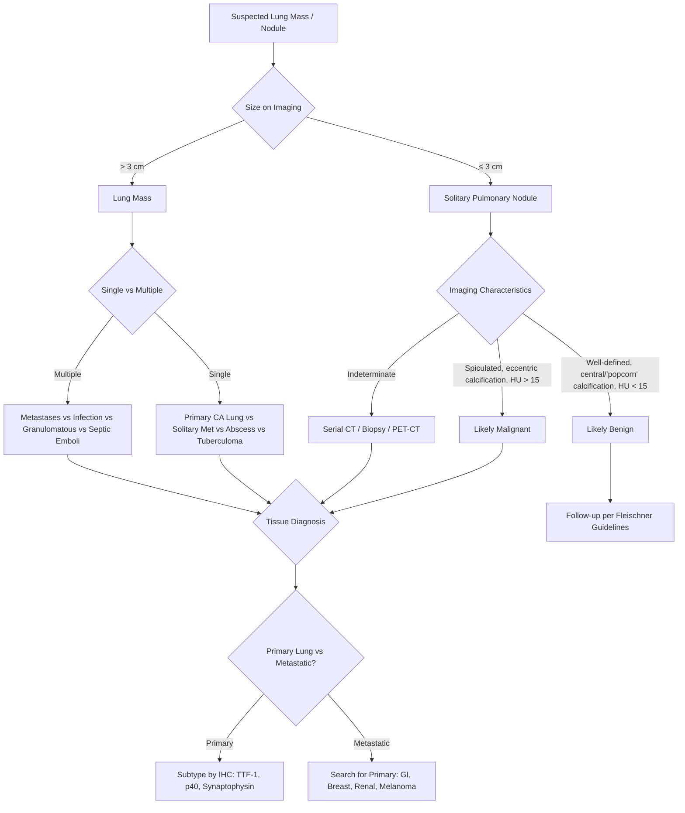

## Differential Diagnosis of CA Lung

When you encounter a patient with a suspected lung mass, the clinical challenge is not simply "is this lung cancer?" — it is "what else could this be, and how do I systematically narrow down the list?" The differential diagnosis depends heavily on the **clinical presentation** (i.e., what brought the patient in) and the **radiological appearance** (solitary nodule vs mass vs multiple nodules vs diffuse infiltrate). Let me walk you through this the way you'd think on a ward round.

---

### 1. Conceptual Framework — How to Think About the DDx

The differential for a suspected lung malignancy can be approached from several angles:

1. **Radiological appearance** — What does the CXR/CT show?
   - Solitary pulmonary nodule (≤ 3 cm) vs mass ( > 3 cm)
   - Multiple nodules
   - Cavitating lesion
   - Hilar/mediastinal mass
   - Pleural effusion
   - Diffuse infiltrate / lymphangitic pattern

2. **Presenting symptom** — What brought the patient in?
   - Chronic cough / haemoptysis
   - Dyspnoea
   - Constitutional symptoms (weight loss, cachexia)
   - Incidental finding on imaging

3. **Tissue of origin** — Even if confirmed as a lung mass, is it:
   - Primary bronchial carcinoma?
   - Other primary lung malignancy?
   - Metastatic deposit from elsewhere?

<Callout title="The First Principle of DDx">
A lung mass on imaging is **not** lung cancer until proven otherwise. In many populations, **up to 70% of incidentally discovered pulmonary nodules are benign** [7][8]. The DDx is broad, and the approach must be systematic to avoid both missing a cancer and performing unnecessary invasive procedures on benign disease.
</Callout>

---

### 2. Differential Diagnosis by Radiological Pattern

#### A. Solitary Pulmonary Nodule (SPN) — ≤ 3 cm

A **nodule** is defined as a rounded opacity ≤ 3 cm; a **mass** is > 3 cm [7]. This distinction matters because masses are much more likely to be malignant.

| Category | Specific Diagnoses | Key Distinguishing Features |
|---|---|---|
| **Primary lung malignancy** | Adenocarcinoma, SCC, SCLC, large cell, carcinoid tumour | Spiculated margins, eccentric calcification, enhancement on contrast CT (HU > 15), pleural retraction, growth on serial imaging [8][9] |
| **Metastatic deposit** | From breast, colorectal, renal, melanoma, sarcoma, head & neck | Usually well-circumscribed and multiple (but can be solitary); known primary elsewhere; round "cannonball" appearance [7] |
| **Granuloma** | TB, histoplasmosis, sarcoidosis | Well-circumscribed, central/uniform/"popcorn" calcification, stable over time. TB very common in HK — always consider [8][9] |
| **Benign tumour** | ***Hamartoma*** | Most common benign lung tumour. ***Fat-containing*** on CT (pathognomonic), ***"popcorn" calcification***, well-circumscribed [8][9] |
| **Lung abscess** | Bacterial (Klebsiella, Staph aureus, anaerobes), fungal (Aspergillus) | Cavitating lesion with air-fluid level, thick irregular wall, fever, productive cough with foul-smelling sputum |
| **AVM** | Pulmonary arteriovenous malformation | Well-circumscribed, feeding vessel visible on CT, associated with HHT (hereditary haemorrhagic telangiectasia — Osler-Weber-Rendu) [8][9] |
| **Pulmonary sequestration** | Congenital abnormal lung tissue | ***Connected to blood supply but not the bronchial tree (therefore not ventilated)*** [8]. Recurrent infections in same location. |
| **Inflammatory pseudotumour** | Organising pneumonia, IgG4-related disease | Can mimic malignancy on imaging; may need biopsy to distinguish |
| **Extrapulmonary density** | ***Nipple shadow, pleural mass, bone lesion, skin lesion, electrodes*** [7] | On CXR only — eliminated by CT or repeat CXR with nipple markers |

**Characteristics distinguishing benign from malignant nodules** [7][8][9]:

| Feature | Malignant (30% of SPNs) | Benign (70% of SPNs) |
|---|---|---|
| **Size** | ***> 2 cm*** | ***< 2 cm*** |
| **Location** | ***Upper lobe more likely*** malignant | Lower lobe slightly more likely benign |
| **Margin** | ***Spiculated*** (corona radiata sign — irregular, sunburst-like projections into surrounding parenchyma; reflects desmoplastic reaction to invading tumour) | ***Well-defined, smooth*** |
| **Calcification** | ***Eccentric*** (or absent) | ***Central, "popcorn" (hamartoma), laminated, diffuse*** [8][9] |
| **Contrast enhancement** | ***HU > 15*** (vascular tumour takes up contrast) | ***HU < 15*** (avascular/fibrotic) [7] |
| **Growth** | Doubling time 20–400 days | Stable > 2 years (very reassuring) |
| **Patient factors** | Age > 50, smoking, family history, prior cancer | Age < 40, non-smoker |

> ***Consider other predictors for malignancy: age, smoking, family history*** [7]. ***Compare with previous film*** [7] — if a nodule has been stable for > 2 years, it is almost certainly benign.

#### B. Lung Mass ( > 3 cm)

A lesion > 3 cm is a **mass**, and the probability of malignancy increases dramatically. The differential narrows:

| Diagnosis | Key Features |
|---|---|
| **Primary bronchial carcinoma** | Most likely diagnosis. Spiculated, enhancing, may have chest wall/mediastinal invasion. |
| **Metastatic tumour** | Usually round, well-circumscribed. May be solitary. Requires search for primary. |
| **Lymphoma** | Usually mediastinal/hilar lymphadenopathy dominant; anterior mediastinal mass. Young patient. B symptoms (fever, night sweats, weight loss). |
| **Lung abscess** | Cavitating with air-fluid level. Acute/subacute illness with fever, productive cough. |
| **Organising pneumonia / round pneumonia** | May mimic mass; usually responds to antibiotics. More common in children. |
| **Large granuloma / tuberculoma** | Especially in HK where TB is endemic. Calcification, upper lobe. |

#### C. Multiple Pulmonary Nodules [7]

| Category | Diagnoses |
|---|---|
| **Metastatic disease** | Most common cause of multiple pulmonary nodules in adults. "Cannonball" metastases (renal, colorectal, sarcoma, melanoma, testicular). |
| **Infection** | ***Abscess*** (bacterial — multiple, with cavitation), ***granulomatous lung disease (TB, fungal, GPA)*** [7] |
| **Granulomatous / autoimmune** | ***Granulomatosis with polyangiitis (GPA/Wegener's)*** — cavitating nodules + upper respiratory involvement + glomerulonephritis. ***Rheumatoid nodules*** (Caplan syndrome in coal miners). ***Sarcoidosis*** [7]. |
| **Septic emboli** | IV drug use, infective endocarditis. Multiple peripheral nodules with feeding vessel sign, may cavitate. |
| **Benign** | Multiple hamartomas (rare), lymphangioleiomyomatosis (young women) |

#### D. Cavitating Lesion [8][9]

A cavitating lesion has a **centre darker than the periphery** (air within the lesion) ± **air-fluid level** [8][9]. The wall thickness is a key discriminator:

> ***Wall thickness: ↑thickness → ↑chance of tumour*** [8][9]

Mnemonic for cavitating lung lesions: **CAVITY**
- **C**ancer — ***most frequently SCC*** [8][9] (central necrosis in large tumours)
- **A**utoimmune granulomas — ***Wegener's (GPA), RA nodules*** [8][9]
- **V**ascular — ***emboli*** (pulmonary infarction can cavitate) [8][9]
- **I**nfection — ***abscess, TB*** [8][9] (TB: upper lobe, apical; abscess: dependent segments)
- **T**rauma — ***pneumatoceles*** [8][9]
- **Y**outh — ***airway malformation, cyst, pulmonary sequestration*** [8][9]

Other clue: ***a whitish ball within a cavity indicates aspergilloma*** [8][9] (mycetoma — a fungal ball of Aspergillus colonising a pre-existing cavity, classically in old TB cavities. Shows the "air crescent sign" on CT).

#### E. Hilar / Mediastinal Mass

| Diagnosis | Key Features |
|---|---|
| **Central bronchial carcinoma** (SCC, SCLC) | Most common cause of unilateral hilar mass in an adult smoker |
| **Lymphoma** | Bilateral hilar lymphadenopathy (especially Hodgkin's — "bulky mediastinal disease"). Anterior mediastinum. |
| **Sarcoidosis** | Bilateral symmetrical hilar lymphadenopathy (BHL) — classically stage I/II sarcoidosis. Young, Black patients. Non-caseating granulomas. |
| **TB** | Unilateral hilar lymphadenopathy (especially primary TB in children/young adults). Paratracheal nodes. |
| **Thymoma** | Anterior mediastinum. Associated with myasthenia gravis. |
| **Retrosternal goitre** | Superior mediastinum, continuous with thyroid on CT. |

---

### 3. Differential Diagnosis by Presenting Symptom

Because many patients with suspected CA lung present not with a visible mass, but with a **symptom**, here are the key DDx organised by the symptom that brings them in:

#### A. Chronic Cough ( > 8 weeks) [7]

| Category | Differentials |
|---|---|
| **Respiratory (productive)** | ***COPD, TB, bronchiectasis, malignancy*** [7] |
| **Respiratory (dry)** | ***Postnasal drip, post-viral cough, asthma, lung fibrosis*** [7] |
| **GI** | ***GORD, recurrent aspiration*** [7] — acid reflux stimulates vagal cough receptors in the lower oesophagus and larynx |
| **Cardiac** | ***Heart failure*** [7] — pulmonary congestion stimulates J-receptors in the alveolar walls |
| **Drug-induced** | ***ACEI*** (↑bradykinin accumulation in the lungs → cough), ***beta-blockers (bronchospasm)*** [7] |

> The classic exam scenario: A 60-year-old smoker with a **change in the character of chronic cough**, especially if accompanied by haemoptysis or weight loss → CA lung until proven otherwise.

#### B. Haemoptysis [7]

| Category | Differentials |
|---|---|
| **Airway disease** | ***CA lung, nasopharyngeal carcinoma (NPC — important in HK!), bronchiectasis*** [7] |
| **Parenchymal disease** | ***TB, pneumonia, lung abscess*** [7] |
| **Vascular disease** | ***PE, LV failure (CHF, mitral stenosis — pink frothy sputum), vasculitis (Goodpasture's syndrome, GPA, MPA), HHT*** [7] |
| **Others** | ***Bleeding tendency, anticoagulants, pulmonary endometriosis*** (rare, catamenial haemoptysis) [7] |

<Callout title="NPC in HK" type="idea">
Nasopharyngeal carcinoma is an important DDx for haemoptysis in Hong Kong due to its high endemic prevalence (strongly associated with EBV and Southern Chinese ethnicity). Always examine the nasopharynx in a haemoptysis work-up, especially if associated with unilateral conductive hearing loss, nasal obstruction, or cranial nerve palsies.
</Callout>

#### C. Dyspnoea [7]

| Acuity | Key Differentials |
|---|---|
| ***Acute*** | ***Pneumothorax, PE, acute pulmonary oedema (APO), asthma exacerbation, AECOPD*** [7] |
| ***Subacute*** | ***Pneumonia, TB, pleural effusion*** [7] |
| ***Chronic*** | ***COPD, malignancy, interstitial lung disease (ILD)*** [7] |
| **Cardiac** | ***CHF, ACS, arrhythmia*** [7] |
| **Metabolic** | ***Anaemia, metabolic acidosis, hyperthyroidism*** [7] |
| **Neuromuscular** | ***Myasthenia gravis, GBS, stroke*** [7] |
| **Psychological** | Anxiety, hyperventilation syndrome [7] |

#### D. Constitutional Symptoms (Weight Loss + Cachexia)

In a patient with weight loss and a lung mass, the differential includes:
- **Primary lung cancer** (most common)
- **TB** — particularly relevant in HK. Weight loss, night sweats, chronic cough, upper lobe cavitary disease.
- **Lymphoma** — B symptoms (fever, night sweats, > 10% weight loss in 6 months)
- **Metastatic cancer** — lung is a common site for metastases from many primaries
- **HIV/AIDS-related opportunistic infections** — immunocompromised patients may present with lung masses (Kaposi sarcoma, lymphoma, atypical infections)

#### E. Back Pain / Bony Pain [10]

If a patient presents with back pain and is subsequently found to have a lung mass:

| DDx Category | Diagnoses |
|---|---|
| **Malignant** | ***Primary lung cancer with bone metastasis; other primary with bone mets (breast, prostate, thyroid, kidney — "paired organ" primaries)*** [10] |
| **Infective** | ***TB spine (Pott's disease), epidural abscess*** [10] |
| **Degenerative** | Spondylosis, disc prolapse [10] |
| **Fracture** | Osteoporotic compression fracture, pathological fracture [10] |
| **Inflammatory** | Ankylosing spondylitis [10] |

---

### 4. Distinguishing Primary Lung Cancer from Lung Metastases

This is a critical distinction because it completely changes management. A **solitary lung mass** in a patient with a known extracranial malignancy is ***not*** metastasis in 10–15% of cases [11] — it could be a new primary lung cancer, and this has curative implications.

| Feature | Primary Lung Cancer | Lung Metastasis |
|---|---|---|
| **Number** | Usually solitary | Often multiple (but can be solitary) |
| **Margins** | Spiculated, irregular | Round, well-circumscribed ("cannonball") |
| **Location** | Upper lobe predominance | Random distribution (haematogenous seeding) — often peripheral, basal |
| **Associated findings** | Hilar/mediastinal lymphadenopathy, endobronchial component | Known extrathoracic primary, other organ metastases |
| **Histology** | Matches bronchial subtypes (ADC, SCC, etc.) | Matches the primary tumour histology |
| **IHC** | TTF-1+ (adenocarcinoma), p40+ (SCC) | Organ-specific markers (e.g., ER/PR for breast, CDX2 for colorectal, PAX8 for renal) |

<Callout title="Exam Pearl — Solitary Brain Lesion in Known Cancer" type="error">
***10–15% of solitary cerebral mass lesions in patients with pre-existing cancer are NOT metastasis*** [11] — they may be primary brain tumours or brain abscesses. Do not assume all lesions in cancer patients are metastatic without tissue confirmation when it would change management.
</Callout>

---

### 5. Approach to Hepatomegaly in Context of Suspected Lung Cancer [12]

When you find a **hard, irregular, non-tender hepatomegaly** in a patient with a lung mass, the differential for the liver lesion includes:

| Diagnosis | Key Features |
|---|---|
| **Hepatic metastases from lung cancer** | Most likely if known/suspected lung primary. CT shows hypovascular lesions (***lung cancer typically produces hypovascular mets***) [13]. |
| **HCC** | Background chronic liver disease (HBV/HCV, cirrhosis). Arterial enhancement with portal venous washout on triphasic CT. ***AFP > 400 ng/mL almost diagnostic*** [13]. |
| **Other metastases** | If the lung mass itself is a metastasis, the liver lesion may also be from the same primary (e.g., colorectal cancer metastatic to both lung and liver). |
| **Benign lesions** | Haemangioma (peripheral nodular enhancement, centripetal fill-in), FNH, adenoma — important not to assume malignancy without imaging characterisation. |

---

### 6. DDx Decision-Making Algorithm

---

### 7. Summary Table — Key DDx for CA Lung by Presentation

| Presentation | Top Differentials to Exclude | Key Discriminators |
|---|---|---|
| Solitary lung nodule/mass | TB granuloma, hamartoma, metastasis, abscess, organising pneumonia | Imaging features, stability on serial imaging, biopsy |
| Multiple lung nodules | Metastases, TB, GPA, septic emboli, sarcoidosis | Clinical context, distribution pattern, cavitation |
| Cavitating lesion | SCC, TB, abscess, GPA, infarct | Wall thickness, clinical features, microbiology |
| Haemoptysis | Bronchiectasis, TB, PE, NPC | Volume, imaging, bronchoscopy |
| Chronic cough in smoker | COPD, TB, bronchiectasis, GORD, ACEI cough | Sputum studies, PFTs, imaging, medication review |
| SVC obstruction | Lymphoma, thymoma, fibrosing mediastinitis | Imaging, biopsy |
| Pancoast syndrome | Neurogenic tumour (schwannoma), TB of lung apex, metastasis to apex | MRI of thoracic inlet, biopsy |
| Brain metastasis with unknown primary | Primary brain tumour, brain abscess | Imaging features, search for primary, stereotactic biopsy |

<Callout title="High Yield Summary — DDx of CA Lung">

1. **Not all lung nodules are cancer** — 70% of incidentally found pulmonary nodules are benign [7][8].
2. **Key benign mimics**: TB granuloma (very common in HK), hamartoma (fat + popcorn calcification), lung abscess, organising pneumonia, AVM.
3. **Malignant DDx**: primary lung cancer, metastatic deposit (search for primary!), lymphoma, carcinoid.
4. **Cavitating lesions**: SCC is the most common malignant cause; TB and abscess are the most common infectious causes [8][9].
5. **Always distinguish primary lung cancer from lung metastasis** — different management entirely. Use IHC (TTF-1 for lung adenocarcinoma, p40 for lung SCC).
6. **Haemoptysis DDx in HK**: always consider NPC (nasopharyngeal carcinoma) alongside CA lung and TB.
7. **10–15% of solitary brain lesions in known cancer patients are NOT metastasis** [11] — don't assume.
8. **Compare with previous films** [7] — stability over > 2 years is very reassuring for benign aetiology.

</Callout>

---

<ActiveRecallQuiz
  title="Active Recall - DDx of CA Lung"
  items={[
    {
      question: "A 55-year-old male smoker has a CXR showing a 2.5 cm solitary pulmonary nodule with spiculated margins. List 4 imaging features that favour malignancy over a benign nodule.",
      markscheme: "1. Spiculated margins (corona radiata sign). 2. Size > 2 cm. 3. Eccentric or absent calcification. 4. Contrast enhancement HU > 15. Other acceptable answers: upper lobe location, pleural retraction, growth on serial imaging, heterogeneous attenuation."
    },
    {
      question: "Give the mnemonic for causes of cavitating lung lesions and name the most common malignant cause.",
      markscheme: "CAVITY: Cancer, Autoimmune (GPA/Wegener, RA nodules), Vascular (emboli), Infection (abscess, TB), Trauma (pneumatoceles), Youth (airway malformation, cyst, sequestration). Most common malignant cause is squamous cell carcinoma (SCC)."
    },
    {
      question: "A patient with known colon cancer is found to have a solitary 3 cm lung mass. How would you distinguish a new primary lung cancer from a solitary colorectal metastasis? Name 2 imaging and 2 histological/IHC features.",
      markscheme: "Imaging: (1) Spiculated margins and hilar lymphadenopathy favour primary lung cancer; round well-circumscribed margins favour metastasis. (2) Endobronchial component on CT/bronchoscopy favours primary. IHC: (1) TTF-1 positive favours primary lung adenocarcinoma. (2) CDX2 positive favours colorectal origin. Also CK7+/CK20- for lung vs CK7-/CK20+ for colorectal."
    },
    {
      question: "Name 3 important differentials for haemoptysis that are particularly relevant in Hong Kong, and explain why each is important locally.",
      markscheme: "1. CA lung - 1st cause of cancer death in HK. 2. Tuberculosis - still endemic in HK, common cause of haemoptysis especially with cavitary disease. 3. Nasopharyngeal carcinoma (NPC) - high endemic prevalence in Southern Chinese due to EBV association; can present with blood-stained nasal discharge or haemoptysis."
    },
    {
      question: "What proportion of solitary cerebral mass lesions in patients with pre-existing cancer are NOT metastasis, and why does this matter clinically?",
      markscheme: "10-15% are not metastasis - they may be primary brain tumours or brain abscesses. This matters because assuming all lesions are metastatic without tissue confirmation may lead to incorrect staging (e.g. labelling a patient as stage IV and denying curative treatment when the brain lesion is actually a separate treatable pathology)."
    }
  ]}
/>

## References

[7] Senior notes: Maksim Medicine Notes.pdf (p.278–281, Respiratory Medicine — DDx of cough, haemoptysis, dyspnoea, and incidental lung nodules)
[8] Senior notes: Ryan Ho Respiratory.pdf (p.43, Approach to solitary pulmonary nodule and cavitating lesions)
[9] Senior notes: Ryan Ho Fundamentals.pdf (p.236, Approach to lung nodules and cavitating lesions)
[10] Senior notes: Maksim Surgery Notes.pdf (p.222–223, Approach to spine diseases — DDx of back pain and cauda equina syndrome)
[11] Senior notes: Ryan Ho Neurology.pdf (p.164,
