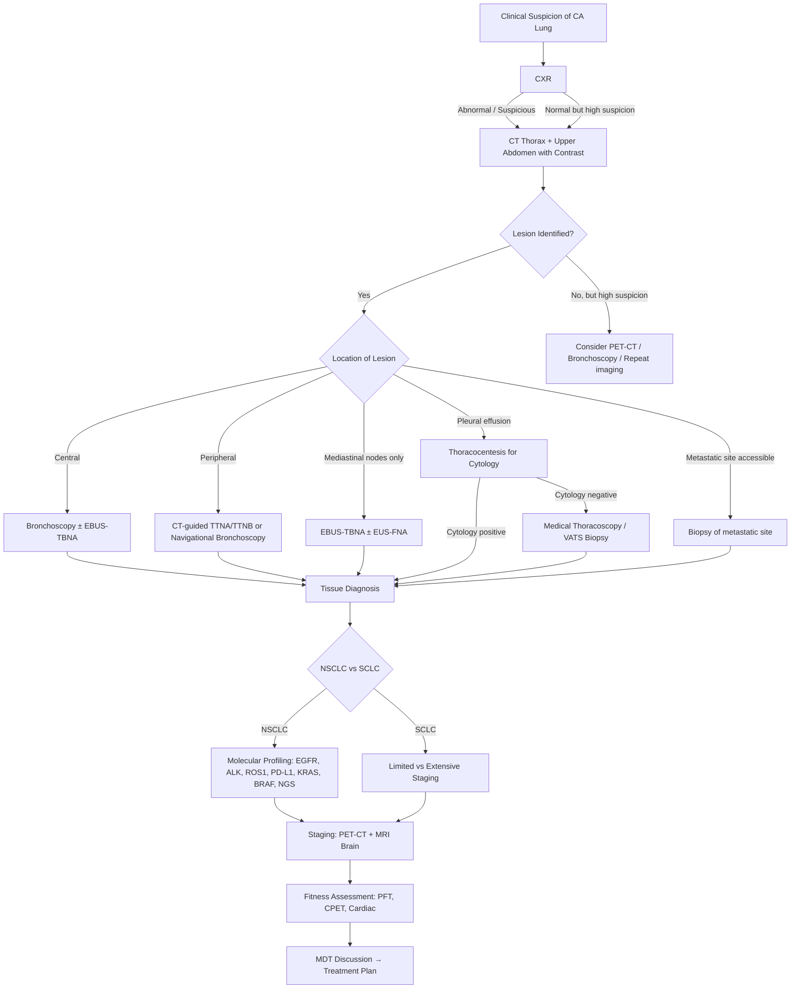

## Diagnostic Criteria, Algorithm, and Investigations for CA Lung

---

### 1. Overview — What Does "Diagnosing Lung Cancer" Actually Mean?

Unlike some conditions (e.g., diabetes, rheumatoid arthritis) that have neat diagnostic criteria with cut-off values, **lung cancer does not have a single set of "diagnostic criteria"**. Instead, diagnosis requires the integration of three pillars:

1. **Clinical suspicion** — symptoms, signs, risk factors
2. **Radiological assessment** — imaging to identify and characterise the lesion
3. **Tissue diagnosis** — histological/cytological confirmation (**mandatory before any definitive treatment**)

Plus a fourth essential step before treatment:
4. **Staging** — determining the extent of disease (TNM for NSCLC; limited vs extensive for SCLC)
5. **Molecular profiling** — identifying actionable driver mutations (EGFR, ALK, ROS1, PD-L1, etc.)
6. **Fitness assessment** — can the patient tolerate the proposed treatment?

Think of it as: **Suspect → Image → Biopsy → Stage → Profile → Treat**.

<Callout title="The Cardinal Rule">
***You cannot treat lung cancer without a tissue diagnosis.*** [2] Even if the imaging is "classic," you need histology to (a) confirm it is cancer, (b) determine the subtype (NSCLC vs SCLC, and which NSCLC subtype), and (c) obtain material for molecular testing. The only exception is the patient who is too frail for any biopsy AND too frail for any treatment — in which case tissue diagnosis would not change management.
</Callout>

---

### 2. Initial Investigations — The Baseline Work-Up

When you suspect lung cancer (e.g., a smoker with chronic cough, haemoptysis, weight loss, or an incidental finding on CXR), the initial work-up proceeds in layers.

#### A. Blood Tests

| Test | Rationale / What to Look For |
|---|---|
| **CBC** | Anaemia of chronic disease (↓Hb), thrombocytosis (reactive — common in malignancy), polycythaemia (paraneoplastic — rare, via ectopic EPO). Leukocytosis may suggest post-obstructive infection. |
| **LFTs (liver function tests)** | Deranged LFTs (especially ↑ALP, ↑GGT) suggest liver metastases. Also serves as baseline before chemotherapy (hepatotoxic drugs). |
| **RFTs (renal function tests)** | Baseline for chemotherapy (cisplatin is nephrotoxic). Hypercalcaemia from bone mets or PTHrP can cause renal impairment. |
| **LDH** | Non-specific tumour marker; elevated in extensive disease, especially SCLC. Prognostic value. |
| **Calcium, phosphate** | Hypercalcaemia from PTHrP (SCC) or bone metastases. |
| **CRP / ESR** | Non-specific inflammatory markers; elevated in malignancy and infection. |
| **Coagulation profile** | Baseline for biopsy procedures. Also relevant if considering anticoagulation for VTE (cancer-associated thrombosis). |
| **ABG** | Assess oxygenation — particularly if dyspnoeic. Type 1 respiratory failure (↓PaO₂, normal/↓PaCO₂) in large effusion, lymphangitis carcinomatosis, or extensive parenchymal disease. |

#### B. Sputum Studies

| Test | Rationale |
|---|---|
| **Sputum cytology** | Can occasionally identify malignant cells (especially central tumours shedding into the airway). Low sensitivity (~40-60% for central, much lower for peripheral tumours). ***Useful for patients unfit for invasive biopsy*** [2]. Collect **early morning sputum × 3 samples** to maximise yield. |
| **Sputum AFB smear + TB culture** | **Always** exclude TB in HK — TB is endemic and can mimic CA lung radiologically (upper lobe mass, cavitation, constitutional symptoms). |
| **Sputum Gram stain + C/ST** | If post-obstructive pneumonia is suspected. |

---

### 3. Radiological Assessment — The Imaging Ladder

Imaging is done in a stepwise fashion: CXR → CT → PET-CT (± MRI). Each modality adds information.

#### A. Chest X-Ray (CXR)

- **Role**: ***Raises suspicion of malignancy (non-diagnostic)*** [2]. It is the first-line imaging for any patient presenting with respiratory symptoms.
- **Sensitivity**: Limited — can miss lesions < 1–2 cm, retrocardiac/apical tumours, and early-stage disease. **A normal CXR does not exclude lung cancer.**

***CXR features of CA lung*** [2]:

| CXR Finding | Interpretation |
|---|---|
| ***1 — Unilateral hilar mass*** | ***Central tumour or hilar lymph node enlargement*** [2] |
| ***2 — Peripheral pulmonary opacity*** | ***Irregular but well-circumscribed ± cavitation (mimics abscess)*** [2] |
| ***3 — Collapsed lung*** | ***Tumour obstruction of bronchus or nodal compression on main bronchus*** [2] — look for volume loss signs (raised hemidiaphragm, mediastinal shift toward the lesion, reduced rib spaces) |
| ***4 — Pleural effusion*** | ***Tumour invasion of pleural space; less commonly parapneumonic effusion secondary to obstruction*** [2] |
| ***5 — Broadening of mediastinum*** | ***Paratracheal lymphadenopathy*** [2] |
| ***6 — Enlarged cardiac shadow*** | ***Malignant pericardial effusion*** [2] |
| ***7 — Elevated hemidiaphragm*** | ***Phrenic nerve palsy*** [2] |
| ***8 — Rib destruction*** | ***Direct invasion or blood-borne metastasis; osteolytic in nature*** [2] |

Other CXR patterns to recognise:
- **Golden S sign**: RUL collapse with a concave lateral border of the collapsed lobe — the "S" is formed by the mass compressing the horizontal fissure [7].
- **Reticulonodular shadowing**: if diffuse, consider lymphangitis carcinomatosis.

<Callout title="CXR Collapse Patterns — High Yield for Exams">
- ***RUL collapse***: Golden S sign (mass compression on horizontal fissure) [7]
- ***LUL collapse***: Luftsichel sign (compensatory enlarged LLL wraps around medial LUL, creating a crescent of hyperaerated lung around the aortic knuckle) [7]
- ***LLL collapse***: Sail sign (triangular opacity behind the heart) [7]
- ***RLL collapse***: Triangular opacity in the right lower zone, loss of right hemidiaphragm silhouette [7]
</Callout>

#### B. Contrast CT Thorax + Upper Abdomen

This is the **workhorse investigation** for lung cancer — it simultaneously serves diagnostic, staging, and biopsy-planning functions.

***CT is favoured because of low cost, speed of examination, and simultaneous evaluation of intrathoracic and abdominal organs*** [2].

| Function | Details |
|---|---|
| ***Diagnostic*** | Radiological features of the mass: size, margins (spiculated vs smooth), density, cavitation, enhancement. Assess extent of local disease. [2] |
| ***Guide biopsy*** | ***Assess location → plan biopsy method*** [2] — a peripheral lesion may be sampled by CT-guided transthoracic needle biopsy; a central lesion by bronchoscopy. |
| ***Staging (modality of choice)*** [2] | Assess T (tumour size, invasion of chest wall/mediastinum/other structures), N (lymph node status), M (liver, adrenal metastases). |
| ***Treatment planning*** | ***RT planning: assessment of anatomic relationship, disease extent and surrounding tissue thickness*** [2]. Also ***assess treatment response*** on follow-up CT [2]. |

**Coverage**: ***Must cover liver and adrenals*** [2] — because these are common sites of lung cancer metastasis. This is why it's "CT thorax + upper abdomen," not just "CT thorax."

**Key caveats for CT staging** [2]:

- ***Nodal metastasis depends on size criteria: > 10 mm on short axis*** (or SUV > mediastinal blood pool on PET-CT) ***considered malignant nodes*** [2].
  - ***Caveat 1: Cannot tell between reactive vs metastatic*** [2] — a 12 mm node could be reactive inflammation, not cancer. This is why pathological confirmation is often needed.
  - ***Caveat 2: Cannot detect microscopic metastasis*** [2] — a 6 mm node could harbour tumour cells.
  - ***→ Usually require further confirmation by biopsy*** [2].
- ***Poor soft tissue visualisation → indeterminate chest wall and mediastinal invasion*** [2]. ***Presence of these precludes surgical resection because a good resection margin cannot be achieved*** [2]. MRI is better for soft tissue assessment.

**CT characteristics of the primary lesion** [14][9]:

| Feature | Malignant | Benign |
|---|---|---|
| **Shape/outline** | ***Irregular or infiltrative*** [14] → spiculated, lobulated | Well-circumscribed, round/oval |
| **Calcification** | Eccentric or absent | Central, uniform, "popcorn" (hamartoma), laminated |
| **Enhancement** | HU > 15 | HU < 15 (minimal or none) |
| **Other** | Pleural retraction, heterogeneous attenuation | Fat-containing (hamartoma — pathognomonic) |

#### C. Whole-Body PET/CT (18F-FDG PET/CT)

PET-CT has become a near-standard part of lung cancer staging, though its routine use remains debated.

***Principle*** [2]:
> ***Injection of 18FDG tracer → tissues with ↑metabolic rate show ↑glucose uptake → tracer retained because FDG cannot be incorporated into glycolysis*** (it gets phosphorylated by hexokinase to FDG-6-phosphate, which cannot proceed further in glycolysis and becomes trapped) ***→ tissues with ↑metabolic rate will "light up"*** [2].

- ***SUVmax > 2.5 considered suspicious for malignancy*** [2].
- ***PET alone has low resolution → combination with CT provides anatomical detail*** [2].

| Advantage | Limitation |
|---|---|
| ***High sensitivity for occult metastasis*** [2] — detects bone, adrenal, contralateral lung, and distant nodal metastases that CT alone might miss | ***No evidence for improvement in overall survival*** [2] |
| ***Useful in marginally resectable or high surgical risk cases to ↓risk of futile surgery*** [2] | False positives: infection, inflammation (TB, sarcoidosis, pneumonia) |
| Helpful in evaluating mediastinal nodes (functional rather than purely size-based) | False negatives: low-grade tumours (carcinoid, lepidic-predominant adenocarcinoma, mucinous adenocarcinoma), small lesions < 8 mm |
| Can detect unsuspected second primaries | ***PET-CT is NOT good for brain — background activity is too hypermetabolic*** [2] (the brain uses ~20% of total body glucose) |

<Callout title="PET-CT and the Brain" type="error">
***PET-CT is not good for detecting brain metastases because the normal brain has very high background FDG uptake*** [2]. If you need to assess for brain metastases, use ***contrast MRI brain*** (or CT brain if MRI is contraindicated). Always order brain imaging separately if there is clinical suspicion (headache, focal neurology, seizures) or if the patient has a high-risk tumour type (adenocarcinoma, SCLC).
</Callout>

#### D. MRI Thorax

- ***Advantage: Good soft tissue differentiation*** [2].
- ***Disadvantage: Only anatomical detail, expensive, longer scan time*** [2].
- ***Indications*** [2]:
  - ***Staging of Pancoast tumour (frequent soft tissue invasion)*** [2][9] — MRI is the modality of choice for evaluating brachial plexus, subclavian vessel, chest wall, and vertebral body invasion.
  - ***Assessment of chest wall/brachial plexus invasion*** [2][9].
  - Also useful for evaluating mediastinal invasion when CT is equivocal.

#### E. Brain Imaging

- ***Contrast MRI brain*** is the gold standard for detecting brain metastases [2].
- ***CT brain with contrast*** if MRI is contraindicated (pacemaker, claustrophobia).
- ***Not routinely done in all patients*** — guided by symptoms (headache, focal neurology, confusion, seizures) [2].
- However, in some centres, MRI brain is performed routinely for:
  - Stage III NSCLC being considered for curative treatment
  - All SCLC (high propensity for brain metastasis)
  - Advanced adenocarcinoma

#### F. Bone Imaging

- **Bone scan (99mTc-MDP)**: Traditional modality; high sensitivity but low specificity. Now largely superseded by PET-CT.
- If PET-CT is not available, bone scan is used for patients with bone pain or elevated ALP.
- MRI whole spine: if cord compression is suspected (back pain + neurological symptoms).

#### G. Summary of Imaging Algorithm

| Clinical Scenario | Imaging Approach |
|---|---|
| Initial work-up | CXR → CT thorax + upper abdomen with contrast |
| Staging | PET/CT (whole body) ± MRI brain |
| Pancoast tumour | MRI thoracic inlet |
| Suspected brain mets | Contrast MRI brain |
| Suspected cord compression | MRI whole spine (urgent) |
| Suspected liver mets | Triphasic CT or MRI liver |

---

### 4. Tissue Diagnosis — How to Get Pathology

***A tissue diagnosis is always required*** [2]. The choice of biopsy method depends on the **location of the tumour** and **accessibility**. The general principle is: **sample the highest-stage site** — because this gives you both diagnosis and staging in one step. For example, if there is a lung mass with a suspicious supraclavicular node, biopsy the node (if positive, it confirms N3 → stage IIIB/C and avoids unnecessary mediastinal staging).

#### A. Methods of Obtaining Tissue

| Method | Indication | How It Works | Key Points |
|---|---|---|---|
| ***Sputum cytology*** | ***Patient unfit for invasive biopsy*** [2] | Patient coughs up sputum → cytologist examines for malignant cells | Low sensitivity (30–65%), especially for peripheral tumours. Requires **3 early morning samples**. |
| ***Conventional bronchoscopy*** [2] | ***Usually only for directly visualised lesions*** [2] | Flexible bronchoscope inserted via nose/mouth into airways → directly visualise endobronchial tumour | ***Modalities: (1) Saline washing, (2) Brushing, (3) Endobronchial forceps biopsy*** for directly visualised lesions [2]. ***Transbronchial biopsy or needle aspiration*** for lesions close to airways [2]. ***Bronchoalveolar lavage (BAL)*** for peripheral lesions [2]. Yield is ~80% for central tumours, much lower for peripheral. |
| ***EBUS-TBNA*** (Endobronchial Ultrasound – Transbronchial Needle Aspiration) | ***Diagnosis and staging by sampling central tumours and paratracheal/subcarinal/hilar lymph nodes*** [2] | Ultrasound probe on the tip of the bronchoscope → real-time visualisation → needle aspiration through the bronchial wall into the target node/mass | ***Also used to R/O alternative dx for mediastinal lymphadenopathy (e.g., TB, sarcoidosis, lymphoma)*** [2]. ***Limitation: Cannot access some lymph node stations (levels 3a, 5, 6, 8, 9) and peripheral tumours*** [2]. |
| ***EUS-FNA*** (Endoscopic Ultrasound – Fine Needle Aspiration) | ***Subcarinal and para-oesophageal nodes*** [2] | Ultrasound on oesophageal endoscope → needle through oesophageal wall into mediastinal nodes | Complements EBUS — accesses nodes that EBUS cannot reach (stations 8, 9, and some station 7). |
| ***CT-guided transthoracic needle aspiration/biopsy (TTNA/TTNB)*** | ***Sample peripheral nodules when other modalities are not available*** [2] | ***CT-guided*** [2] — radiologist advances a needle percutaneously through the chest wall into the peripheral lesion | ***Fine needle biopsy is quite accurate (80–95% accuracy) and safe (< 2% complication rate)*** [14]. ***Risk: pneumothorax*** [2] (~15–25%, but only ~5% require chest drain). Also risk of haemorrhage. ***Contraindications: uncorrected bleeding diathesis (platelet < 50,000, INR > 1.5), inaccessible lesion, uncooperative patient*** [14]. |
| ***Electromagnetic navigation bronchoscopy*** | ***Peripheral lesions*** [2] | New technique using electromagnetic field to guide bronchoscope to peripheral lesions (like GPS for the bronchial tree) | ***Image-guided*** [2]; increasing availability. Particularly useful when CT-guided biopsy carries high pneumothorax risk (e.g., emphysematous lungs). |
| ***Mediastinoscopy*** | ***Mediastinal nodes when less invasive strategies fail*** [2] | ***Scope through pretracheal plane*** [2] under GA → directly visualise and biopsy paratracheal and subcarinal nodes | ***Risk of injury of great vessels*** [2]. Being replaced by EBUS-TBNA in many centres. |
| ***VATS*** [2] | ***Suspicious lesions amenable to wedge resection; otherwise inaccessible nodes; pleural biopsy*** [2] | Minimally invasive surgery under GA with thoracoscope | Can be both diagnostic (wedge resection for frozen section) and therapeutic (proceed to lobectomy if malignant). |
| ***Diagnostic thoracocentesis*** [2] | Pleural effusion | Needle aspiration of pleural fluid → send for cytology | ***Diagnosis only, no histopathological information*** [2] (cytology, not histology). Positive cytology for malignant cells = confirmed malignant pleural effusion (M1a). |
| ***Medical thoracoscopy (pleuroscopy)*** [2] | Pleural disease — especially when thoracocentesis cytology is negative | ***Semi-rigid instrument with one port of entry through flexible trocar → allows direct visualisation of pleural cavity → ↑yield*** [2] | Can simultaneously perform ***drain + biopsy + pleurodesis*** [7]. Requires IV sedation (cf. GA in VATS). |
| ***Sampling of metastatic disease*** [2] | ***M1a–c or N3 scalene/supraclavicular nodes*** [2] | ***By appropriate route: thoracocentesis, liver FNAC, adrenal FNAC, supraclavicular node biopsy*** [2] | Always sample the **highest stage site** — gives diagnosis + staging simultaneously. |

<Callout title="Tissue Diagnosis Strategy — Sample the Highest Stage" type="idea">
If a patient has a lung mass + enlarged supraclavicular lymph node + suspicious liver lesion, biopsy the **liver** (M1b) or the **supraclavicular node** (N3) first. If positive, it simultaneously gives you the tissue diagnosis AND confirms advanced stage, avoiding unnecessary mediastinal staging procedures. This principle saves time, reduces risk, and avoids futile surgery.
</Callout>

#### B. What to Do with the Tissue — Pathological Assessment

Once you have tissue, the pathologist will determine:

1. **Is it malignant?** — Confirm cancer vs benign disease (TB granuloma, sarcoidosis, organising pneumonia, etc.)
2. **What type?** — NSCLC vs SCLC. If NSCLC, which subtype (adenocarcinoma vs SCC vs large cell)?
   - **IHC panel**: TTF-1 (adenocarcinoma), p40/p63 (SCC), synaptophysin/chromogranin (SCLC/neuroendocrine) [1]
3. **Is it primary lung or metastasis?**
   - ***CK-7 (CA lung), CK-19 (CA breast), CK-20 (CRC), TTF-1 (lung adenocarcinoma / thyroid carcinoma)*** [15]
   - If TTF-1+ and CK7+ → primary lung adenocarcinoma
   - If CDX2+ and CK20+ → colorectal metastasis
   - If ER/PR+ → breast metastasis
   - If PAX8+ → renal/gynaecological origin
4. **Molecular profiling** (for non-squamous NSCLC and never-smokers with SCC):
   - **EGFR mutation** — test by PCR (e.g., cobas® EGFR Mutation Test, NGS)
   - **ALK rearrangement** — test by IHC (screening) → confirmed by FISH or NGS
   - **ROS1 rearrangement** — IHC → FISH/NGS
   - **PD-L1 expression** (TPS — tumour proportion score) — IHC (22C3 antibody)
   - **KRAS** (especially G12C), **BRAF V600E**, **MET**, **RET**, **NTRK** — increasingly tested via next-generation sequencing (NGS) panels
   - **Comprehensive genomic profiling** via NGS is now the preferred approach (tests multiple targets simultaneously from a single tissue sample)

5. **PD-L1 testing**: Important for immunotherapy eligibility:
   - TPS ≥ 50%: may receive pembrolizumab monotherapy (1st line, no chemo)
   - TPS 1–49%: pembrolizumab + chemotherapy
   - TPS < 1%: chemotherapy ± immunotherapy combinations

---

### 5. Staging

#### A. NSCLC — TNM 8th Edition (AJCC/UICC, 2017; still current 2025–2026)

***AJCC8 TNM staging for CA lung*** [2]:

**T — Primary Tumour:**

| T Stage | Criteria |
|---|---|
| ***Tis*** | ***Carcinoma in situ*** [2] |
| ***T1*** | ***Tumour ≤ 3 cm in greatest dimension, surrounded by lung or visceral pleura, without bronchoscopic evidence of invasion more proximal than the lobar bronchus*** [2] |
| ***T1a(mi)*** | ***Minimally invasive adenocarcinoma*** [2] |
| ***T1a*** | ***Tumour ≤ 1 cm*** [2] |
| ***T1b*** | ***Tumour > 1 cm but ≤ 2 cm*** [2] |
| ***T1c*** | ***Tumour > 2 cm but ≤ 3 cm*** [2] |
| ***T2*** | ***Tumour > 3 cm but ≤ 5 cm; or involves main bronchus regardless of distance from carina but without involvement of carina; or invades visceral pleura; or associated with atelectasis/obstructive pneumonitis extending to hilar region involving part or all of the lung*** [2] |
| T2a | > 3 cm but ≤ 4 cm |
| T2b | > 4 cm but ≤ 5 cm |
| T3 | > 5 cm but ≤ 7 cm; or direct invasion of chest wall (including superior sulcus tumours), phrenic nerve, parietal pericardium; or separate tumour nodule(s) in the same lobe |
| T4 | > 7 cm; or invasion of diaphragm, mediastinum, heart, great vessels, trachea, recurrent laryngeal nerve, oesophagus, vertebral body, carina; or separate tumour nodule(s) in a different ipsilateral lobe |

**N — Regional Lymph Nodes:**

| N Stage | Criteria |
|---|---|
| N0 | No regional lymph node metastasis |
| N1 | Ipsilateral peribronchial and/or hilar nodes and intrapulmonary nodes |
| N2 | Ipsilateral mediastinal and/or subcarinal nodes |
| N3 | Contralateral mediastinal/hilar; ipsilateral or contralateral scalene/supraclavicular nodes |

**M — Distant Metastasis:**

| M Stage | Criteria |
|---|---|
| M0 | No distant metastasis |
| M1a | Separate tumour nodule in contralateral lobe; pleural/pericardial nodules; malignant pleural/pericardial effusion |
| M1b | Single extrathoracic metastasis (including single distant lymph node) |
| M1c | Multiple extrathoracic metastases in one or more organs |

**Stage Grouping (Simplified):**

| Stage | TNM | 5-Year Survival (approx.) |
|---|---|---|
| IA1 | T1a N0 M0 | ~90% |
| IA2 | T1b N0 M0 | ~85% |
| IA3 | T1c N0 M0 | ~80% |
| IB | T2a N0 M0 | ~73% |
| IIA | T2b N0 M0 | ~65% |
| IIB | T1-2 N1 M0 or T3 N0 M0 | ~56% |
| IIIA | T1-2 N2 M0 or T3 N1 M0 or T4 N0-1 M0 | ~36% |
| IIIB | T1-2 N3 M0 or T3-4 N2 M0 | ~26% |
| IIIC | T3-4 N3 M0 | ~13% |
| IVA | Any T, Any N, M1a-b | ~10% |
| IVB | Any T, Any N, M1c | ~< 5% |

#### B. SCLC — Limited vs Extensive

| Stage | Definition | Proportion |
|---|---|---|
| **Limited disease** | Confined to one hemithorax + ipsilateral supraclavicular nodes (can be encompassed in a single radiation field) | ~30% |
| **Extensive disease** | Anything beyond limited disease (contralateral lung, distant mets, malignant pleural effusion) | ~70% |

> Why this simpler system? Because SCLC almost always presents with disseminated disease, and the key treatment decision is simply: "Can I give concurrent chemoradiation (limited) or chemo ± immunotherapy only (extensive)?"

#### C. Mediastinal Staging — Risk-Stratified Approach

This is from the senior notes and represents the systematic approach to confirming N stage [2]:

| Risk Category | Criteria | Approach |
|---|---|---|
| ***Low risk*** | ***Peripheral tumours with stage IA1–3*** | ***Upfront lobectomy + mediastinal lymph node dissection*** (risk of occult N2 disease is low) [2] |
| ***Moderate risk*** | ***Central stage IA, any stage IB–II, adenocarcinoma, young age*** | ***Biopsy of primary tumour by appropriate route. Pre-op mediastinal staging by EBUS-TBNA ± EUS-FNA*** (risk of occult N2 disease 10–15%) [2] |
| ***High risk*** | ***T3–4 disease without obvious mediastinal involvement*** | ***Biopsy of primary tumour by appropriate route. Pre-treatment mediastinal staging by EBUS-TBNA ± EUS-FNA*** [2] |
| ***Suspected mediastinal mets*** | ***FDG-avid or enlarged N2/3 mediastinal nodes or mediastinal involvement*** | ***Targeted mediastinal biopsy at highest suspected stage by EBUS-TBNA ± EUS-FNA for staging and diagnosis → invasive biopsy if initial test negative/non-diagnostic*** [2] |
| ***Metastatic disease*** | ***M1a–c or N3 scalene or supraclavicular nodes*** | ***Sampling of metastatic disease by appropriate route (e.g., thoracocentesis, liver and adrenal FNAC)*** [2] |

---

### 6. Fitness Assessment — Can the Patient Tolerate Treatment?

Even if a tumour is technically resectable by staging, you must assess whether the patient can survive the surgery.

#### A. Lung Function Assessment [2]

***Mandatory in potentially operable cases to assess lung reserve*** [2].

| Test | How It's Used | Key Thresholds |
|---|---|---|
| ***Spirometry: FEV₁ and DLCO*** [2] | ***Calculate predicted postoperative values (ppoFEV₁, ppoDLCO)*** [2] | ***↑risk for major respiratory complications (pneumonia, stump failure, mortality) if either ppoFEV₁ or ppoDLCO < 40% predicted*** [2]. ***Post-op mechanical ventilation likely if ppo ≤ 30% predicted*** [2]. |
| | ***Method: ppo = pre-op value × (19 − number of resected segments) / 19*** [2] (the lung has 19 segments total) | |

Example: If pre-op FEV₁ = 2.0 L (80% predicted) and you plan right lower lobectomy (5 segments):
- ppoFEV₁ = 2.0 × (19 − 5) / 19 = 2.0 × 14/19 = 1.47 L (~59% predicted) → acceptable.

#### B. Exercise Testing [2]

| Test | Threshold |
|---|---|
| ***6-minute walk test / shuttle walk test*** | ***Able to walk > 400 m*** [2] |
| ***Stair climbing test*** | ***5 flights of stairs (FOS) for pneumonectomy, 3 FOS for lobectomy, 1 FOS for GA operation*** [2] |
| ***Cardiopulmonary exercise test (CPET)*** | ***VO₂ max (maximal oxygen consumption per unit body weight, mL/kg/min)*** [2]: > 20 (not increased risk), < 15 (↑risk of perioperative complications), ***< 10 (very high risk for perioperative complications or death)*** [2] |

#### C. Cardiac Assessment [2]

***2nd most common cause of perioperative morbidity/mortality*** [2] (after respiratory complications).

- **Modalities**: ECG for all; ***consider echocardiogram or even cardiac catheterisation in those with signs/symptoms*** [2] of cardiac disease.

---

### 7. Special Investigations for Paraneoplastic Syndromes

If clinical features suggest a paraneoplastic syndrome, directed investigations include:

| Suspected Syndrome | Key Investigations |
|---|---|
| SIADH | Paired serum and urine osmolality, serum Na+, urine Na+ (serum osm < 275, urine osm > 100, urine Na+ > 40, euvolaemic hyponatraemia) |
| Ectopic Cushing's | ***ACTH level (high), LDDST (no suppression), HDDST (no suppression — unlike pituitary Cushing's which suppresses)*** [16][17], 24h urinary free cortisol, ***CXR for any obvious CA lung*** [16] |
| Hypercalcaemia | Serum Ca²+ (corrected), PTH (suppressed if PTHrP-mediated), PTHrP level |
| LEMS | Anti-VGCC antibodies, nerve conduction studies (incremental response with repetitive nerve stimulation — opposite of myasthenia gravis) |

---

### 8. Investigations for Pleural Effusion in Suspected CA Lung

If a pleural effusion is present, thoracocentesis is performed [7]:

**Pleural fluid analysis** [7]:

| Test | Interpretation |
|---|---|
| **Appearance** | Straw-coloured (transudate), turbid (empyema), milky (chylothorax), **bloody** (malignancy, PE, trauma) [7] |
| **Light's criteria** (Protein, LDH) | Exudative if any one: (1) pleural protein/serum protein > 0.5, (2) pleural LDH/serum LDH > 0.6, (3) pleural LDH > 2/3 upper limit of normal serum LDH. Malignant effusions are **exudative**. |
| **pH** | < 7.2 suggests empyema or advanced malignant effusion (poor prognosis for pleurodesis) |
| **Glucose** | Low (< 3.3 mmol/L) in empyema, RA, malignancy, TB |
| **ADA** | ***> 30 suggests TB*** [7] |
| **Cell count and differential** | Lymphocyte-predominant: TB, malignancy, lymphoma. Neutrophil-predominant: parapneumonic. |
| **Microbiology** | Gram stain, AFB smear, bacterial culture, TB culture, MTB-PCR [7] |
| **Cytology** | ***20 mL × 3 if suspect malignant effusion*** [7] — sensitivity ~60% for malignant pleural effusion (one sample ~50%, three samples ~70%) |

If cytology is negative but clinical suspicion remains high → proceed to **medical thoracoscopy** (pleuroscopy) or **VATS pleural biopsy** for definitive tissue diagnosis [2][7].

---

### 9. Screening for Lung Cancer

| Modality | Utility |
|---|---|
| ***CXR screening*** | ***Not useful*** [7] — multiple trials (including the PLCO trial) showed no mortality reduction with CXR screening. |
| ***Annual low-dose CT (LDCT) thorax*** [7] | ***Recommended for high-risk individuals*** [7]: ***age 55–74 years (some guidelines extend to 50–80y), current or former smokers (≥ 20 pack-years, quit < 15 years ago), fit for curative surgery*** [7]. Based on NLST and NELSON trials showing ~20% reduction in lung cancer mortality. |

> Note: There is currently no population-wide lung cancer screening programme in Hong Kong (as of 2025–2026), though some private centres offer it. The HK government has been evaluating the feasibility of a targeted LDCT screening programme.

---

### 10. Fleischner Society Guidelines for Incidental Pulmonary Nodules (2017)

For nodules found incidentally (not in a known cancer patient), the Fleischner Society provides follow-up recommendations based on size, morphology (solid vs subsolid), and patient risk factors [7]:

**Solid nodules in patients ≥ 35 years:**

| Size | Low Risk | High Risk |
|---|---|---|
| < 6 mm | No routine follow-up | Optional CT at 12 months |
| 6–8 mm | CT at 6–12 months, then consider CT at 18–24 months | CT at 6–12 months, then CT at 18–24 months |
| > 8 mm | Consider CT at 3 months, PET-CT, or tissue sampling | Consider CT at 3 months, PET-CT, or tissue sampling |

**Subsolid (ground-glass / part-solid) nodules:**
- GGO < 6 mm: no routine follow-up
- GGO ≥ 6 mm: CT at 6–12 months → if persistent, CT every 2 years for minimum 5 years
- Part-solid ≥ 6 mm: CT at 3–6 months → if persistent and solid component ≥ 6 mm, consider PET-CT or biopsy

---

### 11. Comprehensive Diagnostic Algorithm

---

<Callout title="High Yield Summary — Diagnosis of CA Lung">

1. **No formal "diagnostic criteria"** — diagnosis requires clinical suspicion + imaging + tissue confirmation.
2. **CXR raises suspicion; CT thorax + upper abdomen with contrast is the key staging modality.** Must cover liver and adrenals.
3. **CXR features**: hilar mass, peripheral opacity, collapse, effusion, mediastinal widening, elevated hemidiaphragm, rib destruction, pericardial effusion.
4. **PET-CT**: high sensitivity for occult metastasis; SUVmax > 2.5 suspicious. NOT useful for brain (too hypermetabolic).
5. **MRI**: for Pancoast tumours (soft tissue/brachial plexus invasion) and brain metastases.
6. **Tissue diagnosis is mandatory**: choose method based on location — bronchoscopy (central), EBUS-TBNA (mediastinal nodes), CT-guided TTNA (peripheral), thoracocentesis/pleuroscopy (effusion). Always sample highest-stage site first.
7. **Pathological assessment**: subtype by IHC (TTF-1, p40, synaptophysin); molecular profiling (EGFR, ALK, ROS1, PD-L1, NGS) mandatory for all non-squamous NSCLC.
8. **TNM 8th edition** for NSCLC; limited vs extensive for SCLC.
9. **Mediastinal staging**: risk-stratified approach — peripheral IA can go straight to surgery; higher risk needs EBUS-TBNA ± EUS-FNA pre-operatively.
10. **Fitness**: ppoFEV₁ and ppoDLCO ≥ 40% predicted; VO₂ max > 15; stair climbing ≥ 3 FOS for lobectomy.
11. **Screening**: annual LDCT for high-risk (age 55–74, ≥ 20 pack-years, current/recent smoker). CXR screening is NOT useful.

</Callout>

---

<ActiveRecallQuiz
  title="Active Recall - Diagnosis and Staging of CA Lung"
  items={[
    {
      question: "List 5 CXR features that may suggest lung cancer.",
      markscheme: "Any 5 of: (1) Unilateral hilar mass, (2) Peripheral pulmonary opacity, (3) Lung collapse/atelectasis, (4) Pleural effusion, (5) Mediastinal widening/paratracheal lymphadenopathy, (6) Enlarged cardiac shadow (pericardial effusion), (7) Elevated hemidiaphragm (phrenic nerve palsy), (8) Rib destruction."
    },
    {
      question: "Why is PET-CT not a good modality for detecting brain metastases? What should you use instead?",
      markscheme: "The normal brain has very high background FDG uptake (uses approximately 20% of total body glucose), making it difficult to distinguish metastatic lesions from normal brain tissue. Use contrast-enhanced MRI brain instead (gold standard for brain metastases)."
    },
    {
      question: "A patient has a 4 cm peripheral lung mass. The ppoFEV1 is calculated at 35% predicted. What does this mean for surgical planning, and how is ppoFEV1 calculated?",
      markscheme: "ppoFEV1 of 35% predicted is below the 40% threshold, indicating increased risk for major respiratory complications. ppoFEV1 is calculated by: pre-op FEV1 multiplied by (19 minus number of resected segments) divided by 19. The lung has 19 segments total. This patient would likely need further exercise testing (CPET) and may be unfit for lobectomy."
    },
    {
      question: "Explain the principle of risk-stratified mediastinal staging. What is the approach for a peripheral T1aN0 adenocarcinoma versus a central T2 adenocarcinoma?",
      markscheme: "Risk-stratified approach: Peripheral T1a N0 is low risk for occult N2 disease - can proceed to upfront lobectomy with intraoperative mediastinal lymph node dissection. Central T2 adenocarcinoma is moderate risk (10-15% occult N2) - requires biopsy of primary tumour plus pre-operative mediastinal staging by EBUS-TBNA plus or minus EUS-FNA before surgery."
    },
    {
      question: "A patient with lung adenocarcinoma has an exudative pleural effusion with bloody appearance. Three samples of pleural fluid cytology are negative. What is the next step?",
      markscheme: "Proceed to medical thoracoscopy (pleuroscopy) or VATS pleural biopsy. Thoracoscopy allows direct visualisation of the pleural cavity with higher diagnostic yield, and can simultaneously perform drainage, biopsy, and pleurodesis if malignant effusion is confirmed."
    },
    {
      question: "What molecular tests are mandatory for all non-squamous NSCLC before starting treatment? Name at least 4 targets.",
      markscheme: "EGFR mutation, ALK rearrangement, ROS1 rearrangement, PD-L1 expression (TPS). Additional targets now commonly tested via NGS panels: KRAS (especially G12C), BRAF V600E, MET exon 14 skipping, RET rearrangement, NTRK fusion. Comprehensive genomic profiling via NGS is preferred."
    }
  ]}
/>

## References

[1] Senior notes: Maksim Medicine Notes.pdf (p.51, Lung Cancer — Pathology, IHC markers)
[2] Senior notes: Ryan Ho Respiratory.pdf (p.141–147, Lung Cancer — Epidemiology, Radiological Assessment, Tissue Diagnosis, Staging, Fitness Assessment, Mediastinal Staging)
[7] Senior notes: Maksim Medicine Notes.pdf (p.278–281, Respiratory Medicine — Pleural effusion, clinical approach, investigations, Fleischner guidelines, screening)
[9] Senior notes: Ryan Ho Fundamentals.pdf (p.236, Approach to lung nodules — benign vs malignant features)
[14] Senior notes: Ryan Ho Diagnostic Radiology.pdf (p.39, 43, 62, 79 — CT interpretation, interventional radiology, fine needle biopsy)
[15] Senior notes: Maksim Surgery Notes.pdf (p.124–125, IHC for liver metastasis of unknown origin)
[16] Senior notes: Ryan Ho Endocrine.pdf (p.63, Cushing's syndrome — HDDST, ectopic ACTH, CXR for CA lung)
[17] Senior notes: Ryan Ho Fundamentals.pdf (p.437, Cushing's syndrome work-up)
