# CA Lung (Bronchial Carcinoma)

---

## 1. Definition

Lung cancer (CA lung) refers to malignant neoplasms arising from the epithelium of the respiratory tract. The vast majority (~95%) are **bronchial carcinomas** — cancers originating from bronchial epithelium or bronchial mucous glands. The term "lung cancer" in clinical practice almost always refers to bronchial carcinoma unless otherwise specified.

Other primary lung malignancies (lymphoma, sarcoma, carcinoid tumours) are rare. The lung is also a very common site for **metastatic** deposits from distant primaries (breast, colorectal, renal, ovarian, etc.), which must always be distinguished from a primary lung cancer.

The word "carcinoma" comes from Greek *karkinos* (crab) — the ancient Greeks thought tumours with their spreading tendrils resembled crabs.

---

## 2. Epidemiology

### 2.1 Global Perspective

- **Leading cause of cancer deaths worldwide** — both in incidence and mortality [2].
- Approximately 2.2 million new cases per year globally (GLOBOCAN 2022 data).
- 5-year survival remains poor overall (~20–25%), though this has improved with targeted therapies and immunotherapy.

### 2.2 Hong Kong Perspective

This is high yield for HKU exams:

- ***2nd most common cancer by incidence*** (2nd in males, 3rd in females) [2].
- ***1st in cancer mortality*** (1st in both sexes) [2] — i.e., lung cancer kills more people in HK than any other cancer.
- ***Demographics: M:F ≈ 2:1*** (compared to 5–6:1 in Western countries) [2].
  - Why the narrower sex gap in HK? Because a significant proportion of female lung cancer patients in HK are **non-smokers** (> 60% of females with CA lung in HK have never smoked) [2]. This is a distinctive East Asian pattern.
- ***Peak incidence: 60–70 years*** [2].
- ***85% are NSCLC; 60–75% have hilar lymph node involvement at presentation*** [2] — meaning most patients present at an advanced stage.

### 2.3 Sex-Specific Patterns in HK

| | Males | Females |
|---|---|---|
| Smoking status | ~80% smokers | ***< 40% smokers*** [2] |
| Predominant histology | SCC / SCLC (smokers) | ***> 75% adenocarcinoma*** [2] |
| Molecular drivers | Variable | EGFR mutation much more common |

<Callout title="Why do non-smoking Asian women get lung cancer?">
This is a classic exam question. Postulated causes include: (1) ***passive smoking*** [2], (2) ***cooking fume exposure*** (especially wok cooking with high-temperature oils — generates polycyclic aromatic hydrocarbons) [2], (3) higher prevalence of ***EGFR driver mutations*** in Asian adenocarcinomas (~55% in HK vs ~15% in Caucasians) [2], and (4) possible genetic susceptibility. The exact answer is multifactorial and not fully understood.
</Callout>

---

## 3. Risk Factors

### 3.1 Environmental / Modifiable

| Risk Factor | Mechanism | Details |
|---|---|---|
| ***Cigarette smoking*** | Carcinogens (benzopyrene, nitrosamines) cause DNA damage → accumulation of oncogenic mutations (p53, KRAS) | ***Responsible for ~90% of CA lung; 40× death rate in smokers*** [2]. Risk falls after cessation but never returns to baseline [2]. Dose-response: pack-years matter. |
| ***Passive (secondhand) smoking*** | Same carcinogens at lower dose | ~1.3× relative risk. Particularly relevant in HK female non-smokers [1][2]. |
| ***Asbestos exposure*** | Chronic inflammation → fibrosis → malignant transformation | Synergistic with smoking (multiplicative, not additive risk). ***Ask occupation: renovation/demolition workers*** [2]. Can cause mesothelioma (pleural) or bronchial carcinoma. |
| ***Cooking fumes*** | PAHs, aldehydes from high-temperature stir-frying | Particularly relevant in HK and Chinese populations [2]. |
| ***Radiation exposure*** | Direct DNA damage | Thoracic RT for prior malignancy; radon gas exposure (natural radioactive gas in some buildings/mines) [2]. |
| ***Air pollution*** | PM2.5 particulates cause chronic airway inflammation and oxidative DNA damage | Growing recognition as independent risk factor. |

### 3.2 Host / Non-Modifiable

| Risk Factor | Details |
|---|---|
| ***Family history*** | ***1.5× risk if positive family history*** [2] |
| ***Previous lung disease*** | Idiopathic pulmonary fibrosis (IPF), COPD — chronic inflammation and scarring provide a nidus for malignant transformation [2] |
| ***Previous TB*** | "Scar tumours" — ***classically described in textbooks*** [2]. Chronic granulomatous inflammation → fibrosis → malignant change (typically adenocarcinoma in scar tissue). |
| ***Genetic drivers*** | ***EGFR mutation (55% in local adenocarcinoma)*** — much more common in Asians [2]; ***ALK translocation (5%)*** [2]; ***KRAS mutation (5–10%)*** [2]. These are both risk factors and therapeutic targets. |

<Callout title="Smoking and Lung Cancer — Key Numbers for Exams" type="idea">
- 90% of lung cancers are attributable to smoking.
- 40× increased death rate in heavy smokers vs non-smokers.
- Risk falls after quitting but ***still rises with age faster than never-smokers*** [2] — i.e., the damage is partially irreversible.
- Pack-years = (packs/day) × (years smoked). > 20 pack-years = significant risk.
</Callout>

---

## 4. Anatomy and Function (Relevant to CA Lung)

Understanding the anatomy is critical because lung cancer symptoms are determined by **where** the tumour is and **what structures it invades**.

### 4.1 Bronchial Tree

- **Trachea** → **Right and left main bronchi** → **Lobar bronchi** (3 right, 2 left) → **Segmental bronchi** → terminal/respiratory bronchioles → alveoli.
- Central tumours (SCC, SCLC) arise from main/lobar bronchi → early endobronchial symptoms (cough, haemoptysis, obstruction).
- Peripheral tumours (adenocarcinoma, large cell) arise in smaller airways/alveoli → may be asymptomatic until large or invading pleura.

### 4.2 Mediastinal Structures (Why Regional Spread Matters)

The mediastinum is a tight space packed with critical structures. A growing central tumour or enlarged lymph nodes can compress any of these:

| Structure | Consequence of Compression/Invasion |
|---|---|
| **Recurrent laryngeal nerve (RLN)** | Hoarseness of voice (left RLN loops under aortic arch — left-sided tumours more commonly cause this) |
| **Phrenic nerve** | Diaphragmatic paralysis → elevated hemidiaphragm on CXR |
| **Oesophagus** | Dysphagia |
| **Superior vena cava (SVC)** | SVC obstruction syndrome |
| **Pericardium** | Pericardial effusion ± tamponade |
| **Sympathetic chain / stellate ganglion** | Horner's syndrome (miosis, ptosis, anhidrosis, enophthalmos) |
| **Brachial plexus (C8–T1)** | Arm pain, weakness, small muscle wasting |
| **Thoracic duct** | Chylothorax (rare) |
| **Vertebral body** | Cord compression, back pain |

### 4.3 Lung Apex (Pancoast Tumour Territory)

The lung apex sits in close relation to:
- **Brachial plexus** (lower trunk: C8, T1)
- **Stellate ganglion** (sympathetic chain)
- **Subclavian vessels**
- **1st and 2nd ribs**

A tumour at the apex (**Pancoast tumour**, also called superior sulcus tumour) can invade all of these → producing the classic **Pancoast syndrome** (see Clinical Features below).

### 4.4 Lymphatic Drainage

- **Hilar nodes** → **Mediastinal nodes** → **Supraclavicular nodes** (especially left supraclavicular = **Virchow's node** / **Troisier's sign**).
- Lymph node staging (N staging) is critical for operability:
  - N0 = no nodes
  - N1 = ipsilateral hilar/peribronchial
  - N2 = ipsilateral mediastinal/subcarinal
  - N3 = contralateral mediastinal/hilar, or any supraclavicular

### 4.5 Common Sites of Distant Metastasis

Lung cancer has a propensity to metastasise to (mnemonic: **BLAB** — Brain, Liver, Adrenals, Bone):
- **Brain** — lung is the most common primary to metastasise to the brain
- **Liver**
- **Adrenal glands** — bilateral adrenal metastases can rarely cause adrenal insufficiency
- **Bone** — typically lytic lesions (unlike prostate which is sclerotic)
- Also: contralateral lung, skin, distant lymph nodes

---

## 5. Aetiology and Pathogenesis

### 5.1 Molecular Pathogenesis — From First Principles

Lung cancer develops through a **stepwise accumulation of genetic mutations** leading to progressively increasing degrees of epithelial dysplasia, eventually crossing the threshold to invasive carcinoma [2].

Think of it as a conveyor belt:
> Normal epithelium → Squamous metaplasia → Dysplasia (mild → moderate → severe) → Carcinoma in situ → Invasive carcinoma

This process is **highly heterogeneous** — different subtypes have different driver mutations and different cells of origin [2].

### 5.2 Key Driver Mutations and Molecular Targets

| Mutation/Alteration | Prevalence in HK Adenocarcinoma | Significance |
|---|---|---|
| ***EGFR mutation*** | ***~55%*** [2] | Most common actionable driver in Asian adenocarcinoma. Much higher than Caucasians (~15%). Targeted by TKIs (gefitinib, erlotinib, osimertinib). |
| ***ALK translocation*** | ***~5%*** [2] | EML4-ALK fusion. Targeted by crizotinib, alectinib. Typically younger, non-smokers. |
| ***KRAS mutation*** | ***5–10%*** [2] | More common in Western populations. Historically "undruggable" but sotorasib now targets KRAS G12C. |
| **ROS1 rearrangement** | ~1–2% | Similar to ALK; responds to crizotinib. |
| **PD-L1 expression** | Variable | Not a mutation but a biomarker for immunotherapy response. |
| **p53 mutation** | Very common (~50% all subtypes) | Tumour suppressor loss. Not directly targetable but important in pathogenesis. |
| **BRAF V600E** | ~1–2% | Targetable with dabrafenib + trametinib. |

<Callout title="EGFR in Asian Lung Cancer — Why It Matters So Much">
In HK/East Asia, ***EGFR mutation is present in ~55% of adenocarcinomas*** [2]. This means more than half of adenocarcinoma patients in HK have a targetable mutation. EGFR TKIs (tyrosine kinase inhibitors) dramatically improved survival in these patients. This is why **molecular testing is mandatory for all non-squamous NSCLC** in current practice. Never start treatment without knowing the EGFR status.
</Callout>

### 5.3 Carcinogenesis by Smoking

Tobacco smoke contains > 60 known carcinogens:
1. **Initiation**: Carcinogens (polycyclic aromatic hydrocarbons, nitrosamines) form DNA adducts → point mutations in tumour suppressors (p53, RB) and oncogenes (KRAS).
2. **Promotion**: Chronic inflammation from smoke → reactive oxygen species → further DNA damage and proliferative signalling.
3. **Progression**: Accumulation of mutations → clonal expansion → invasive carcinoma.

The **field cancerisation** concept: the entire bronchial epithelium is exposed to smoke, so multiple areas may undergo premalignant change simultaneously. This explains why smokers can develop **second primary** lung cancers even after resection of the first.

---

## 6. Classification

### 6.1 Histological Classification (WHO)

The fundamental division is into **Non-Small Cell Lung Cancer (NSCLC)** (~85%) and **Small Cell Lung Cancer (SCLC)** (~15%). This distinction is the single most important one because it determines the entire management approach.

| Feature | Adenocarcinoma (ADC) | Squamous Cell Carcinoma (SCC) | Large Cell Carcinoma (LCLC) | Small Cell Carcinoma (SCLC) |
|---|---|---|---|---|
| **% of all lung cancers** | ***~40–55%*** [1][2] | ***~20–30%*** [1][2] | ***~5–10%*** [1][2] | ***~5–15%*** [1][2] |
| **Smoking association** | ***Weakest*** (but still significant) [1] | ***Strongest*** [1] | Moderate | ***Strong*** [1] |
| **Typical location** | ***Peripheral*** [1] | ***Central*** [1] | ***Peripheral*** [1] | ***Central*** [1] |
| **Cell of origin** | Type II pneumocytes / Clara cells | Bronchial squamous epithelium (via metaplasia) | Undifferentiated large cells | Neuroendocrine cells (Kulchitsky cells) |
| **IHC markers** | ***TTF-1*** [1] | ***p40, p63*** [1] | Often negative | ***Synaptophysin, Chromogranin*** [1] |
| **Key demographics** | Young females, non-smokers (especially in Asia) | Older male smokers | Non-specific | Male smokers |
| **Growth rate** | Moderate | Moderate | Moderate–fast | ***Very fast, tend to metastasize early*** [1] |
| **Molecular targets** | EGFR, ALK, ROS1, KRAS, BRAF | Rare actionable mutations | Rare | Rarely tested (chemo is mainstay) |
| **Key feature** | Most common subtype; glandular differentiation; mucin production | Keratin pearls, intercellular bridges; can cavitate (central necrosis) | Diagnosis of exclusion (no glandular/squamous/neuroendocrine features) | ***"Oat cell" carcinoma*** [1]; very high mitotic rate; crush artefact on biopsy; strong paraneoplastic associations |

### 6.2 Why the NSCLC vs SCLC Distinction Matters

| | NSCLC | SCLC |
|---|---|---|
| **Surgery** | ***Potentially curative if early stage*** | Almost never surgical (usually disseminated at diagnosis) |
| **Chemosensitivity** | Moderate | ***Very chemosensitive*** (but almost always relapses) |
| **Radiosensitivity** | Moderate | ***Very radiosensitive*** |
| **Staging system** | TNM staging (I–IV) | Limited vs Extensive disease |
| **Prognosis** | Better overall (especially with targeted therapy) | Very poor (median survival ~10–12 months even with treatment) |

### 6.3 Adenocarcinoma Subtypes (2021 WHO Classification)

Important for understanding prognosis:
- **Adenocarcinoma in situ (AIS)** — ≤ 3 cm, purely lepidic growth, 100% cure with resection
- **Minimally invasive adenocarcinoma (MIA)** — ≤ 3 cm, predominantly lepidic, invasion ≤ 5 mm, near 100% cure
- **Invasive adenocarcinoma** — subdivided by predominant pattern:
  - Lepidic (best prognosis)
  - Acinar
  - Papillary
  - Micropapillary (worst prognosis)
  - Solid (worst prognosis)

### 6.4 Staging Overview (Brief — Will Expand in Diagnosis Section)

**NSCLC**: Uses TNM 8th edition (2017, still current in 2025–2026):
- Stage I–II: potentially resectable
- Stage III: locally advanced (IIIA may be resectable, IIIB/IIIC usually not)
- Stage IV: metastatic (palliative intent)

**SCLC**: Traditionally uses Veterans Administration Lung Study Group (VALSG) system:
- **Limited disease**: confined to one hemithorax + ipsilateral supraclavicular nodes (can be encompassed in a single radiation field)
- **Extensive disease**: anything beyond limited disease

---

## 7. Clinical Features

### 7.1 Overview — Why Many Present Late

Most lung cancers are diagnosed at an advanced stage because:
1. **Peripheral tumours** (adenocarcinoma) can grow silently — the lung parenchyma has no pain receptors. Only when they reach the pleura (which has somatic innervation) or a major airway do symptoms appear.
2. **Central tumours** (SCC, SCLC) may produce early airway symptoms (cough, haemoptysis), but these are often dismissed as "smoker's cough" by the patient.
3. There is no established population-wide screening programme in HK (unlike low-dose CT screening recommended in the US for high-risk groups).

<Callout title="Clinical Pearl" type="idea">
***Any change in the character of a chronic cough in a smoker — or new haemoptysis — warrants a CXR at minimum.*** A "normal" CXR does not exclude lung cancer (especially small peripheral lesions or retrocardiac/apical tumours). If clinical suspicion is high, proceed to CT thorax.
</Callout>

### 7.2 Symptoms

I'll organise symptoms by mechanism — this is how you should think about them on a ward round.

#### A. Constitutional Symptoms (Non-Specific)

| Symptom | Pathophysiological Basis |
|---|---|
| ***Malaise, fatigue*** | Tumour-derived cytokines (TNF-α, IL-6) cause systemic inflammation and catabolism |
| ***Weight loss, cachexia*** | Cancer cachexia syndrome: tumour releases proteolysis-inducing factor (PIF) and lipid-mobilising factor (LMF) → skeletal muscle wasting and fat loss. Also mediated by TNF-α ("cachectin"). |
| ***Loss of appetite (anorexia)*** | Central appetite suppression by tumour-derived cytokines acting on the hypothalamus |
| ***Fever*** | Tumour necrosis releasing pyrogens; also post-obstructive pneumonia |

#### B. Symptoms from Endobronchial Growth (Central Tumours)

These occur when the tumour grows **within or compresses the airway lumen**.

| Symptom | Pathophysiological Basis |
|---|---|
| ***Cough*** [1] | Irritation of cough receptors in the bronchial mucosa by tumour mass. May be dry or productive. A **change in the character of a chronic cough** in a smoker is a red flag. |
| ***Haemoptysis*** [1] | Tumour is vascular and friable → erosion of mucosal blood vessels → blood-streaked sputum. Massive haemoptysis (rare but lethal) occurs if tumour erodes into a pulmonary artery or bronchial artery. |
| ***Shortness of breath (SOB)*** [1] | Partial or complete bronchial obstruction → distal atelectasis (collapse) → reduced functional lung volume. Also from large pleural effusions. |
| ***Wheeze / Stridor*** [1] | Fixed, monophonic wheeze from partial airway obstruction (unlike the polyphonic wheeze of asthma/COPD). Stridor occurs with tracheal/main bronchus obstruction — an emergency. |
| ***Post-obstructive pneumonia*** | Tumour blocks bronchus → mucus stagnation distal to obstruction → bacterial superinfection. Suspect lung cancer in any patient with **recurrent or non-resolving pneumonia** in the same lobe. |

<Callout title="Exam Tip" type="error">
A common exam scenario: "A 65-year-old smoker presents with recurrent right lower lobe pneumonia." The key differential is **post-obstructive pneumonia due to endobronchial tumour**. Always think CA lung in recurrent/non-resolving pneumonia in a smoker.
</Callout>

#### C. Symptoms from Regional Spread / Local Invasion

These depend on which mediastinal or thoracic structure is invaded.

##### i. Pleura
| Symptom | Pathophysiological Basis |
|---|---|
| ***Pleural effusion*** [1] | Tumour cells seed the pleura → irritation and increased vascular permeability → exudative effusion. Also lymphatic obstruction impairs pleural fluid reabsorption. |
| ***Pleuritic chest pain*** [1] | Parietal pleura (innervated by intercostal nerves) is invaded or inflamed by tumour. Visceral pleura has no somatic innervation, so pain only occurs when the parietal pleura is involved. |

##### ii. Pericardium
| Symptom | Pathophysiological Basis |
|---|---|
| ***Pericardial effusion ± cardiac tamponade*** [1] | Direct tumour invasion or metastatic seeding of the pericardium → fluid accumulation → if rapid/large, compresses the heart → reduced cardiac filling → tamponade (Beck's triad: hypotension, distended neck veins, muffled heart sounds). |

##### iii. Recurrent Laryngeal Nerve (RLN) and Oesophagus
| Symptom | Pathophysiological Basis |
|---|---|
| ***Hoarseness of voice*** [1] | Left RLN loops under the aortic arch and then ascends to the larynx in the tracheo-oesophageal groove. Tumours of the left hilum or aortopulmonary window lymph nodes can compress/invade it → unilateral vocal cord paralysis → hoarse, breathy voice. Right RLN loops under the right subclavian artery (higher up), so right-sided tumours less commonly cause this. |
| ***Dysphagia*** [1] | Direct compression/invasion of the oesophagus by tumour or enlarged subcarinal lymph nodes. The oesophagus lies posterior to the trachea in the mediastinum. |

##### iv. Pancoast Syndrome (Superior Sulcus Tumour)

A **Pancoast tumour** is a tumour at the lung apex invading the structures of the thoracic inlet. The resulting clinical syndrome is called **Pancoast syndrome** [1]:

| Component | Structure Involved | Clinical Feature |
|---|---|---|
| ***Horner's syndrome*** [1] | Stellate ganglion (T1 sympathetic ganglion) | **Miosis** (pupil constriction — loss of sympathetic pupil dilator), **ptosis** (drooping eyelid — loss of sympathetic innervation to Müller's muscle), **anhidrosis** (loss of facial sweating on ipsilateral side), **enophthalmos** (apparent sinking of the eye). Mnemonic: **MAP** — Miosis, Anhidrosis, Ptosis. |
| ***Brachial plexopathy*** [1] | Lower trunk of brachial plexus (C8, T1) | Pain radiating down the medial arm/forearm (T1 dermatome), numbness in medial 1.5 fingers (ulnar nerve territory). |
| ***Small hand muscle wasting*** [1] | T1 nerve root → intrinsic hand muscles | Claw hand appearance, weakness of finger abduction/adduction (interossei), thumb opposition (thenar eminence — but T1 involvement mainly affects hypothenar/interossei). |
| ***Shoulder pain*** [1] | Invasion of chest wall, ribs, and adjacent soft tissues | Deep, boring, constant pain in the shoulder/scapular region. |

<Callout title="Why is Horner's Syndrome Always on the Same Side as the Tumour?">
The sympathetic chain runs ipsilaterally from the hypothalamus → brainstem → C8–T2 (ciliospinal centre of Budge) → exits the spinal cord → synapses in the stellate ganglion (at the lung apex) → postganglionic fibres travel along the internal carotid artery to reach the eye. A Pancoast tumour destroys the stellate ganglion on the same side → ipsilateral Horner's syndrome.
</Callout>

##### v. Superior Vena Cava Obstruction (SVCO)

| Symptom | Pathophysiological Basis |
|---|---|
| ***Puffy face / facial oedema*** [1] | Compression/invasion of the SVC by tumour or enlarged right paratracheal lymph nodes → obstruction of venous return from the head and upper limbs → raised venous pressure → oedema of the face, neck, and upper limbs. |
| ***Dilated chest veins / collateral veins*** [1] | Blood finds alternative venous drainage pathways → dilated superficial veins over the anterior chest wall (collateral circulation). |
| ***Pemberton's sign*** [1] | Raising both arms above the head for > 1 minute → further compresses the thoracic inlet → worsening facial congestion, cyanosis, and JVP elevation. This is a clinical bedside test for SVC obstruction or thoracic inlet narrowing. |
| Headache, visual disturbance | Raised intracranial venous pressure (the internal jugular veins drain into the SVC). |
| **Arm swelling** | Venous congestion of the upper extremities. |

> SVCO is most commonly caused by **lung cancer** (especially SCLC, which is central and aggressive) or **lymphoma**. It is an **oncological emergency** — can progress to cerebral oedema if untreated.

##### vi. Other Local Structures

| Symptom/Sign | Structure | Pathophysiological Basis |
|---|---|---|
| ***Phrenic nerve palsy → elevated hemidiaphragm*** [1] | Phrenic nerve (C3, C4, C5 — "C3, 4, 5 keeps the diaphragm alive") | Tumour or lymph nodes compress/invade the phrenic nerve as it descends along the mediastinum → diaphragmatic paralysis → hemidiaphragm rises on the affected side (seen on CXR). Patient may report orthopnoea. |
| ***Lymphangitis carcinomatosis*** [1] | Pulmonary lymphatic channels | Tumour cells spread through pulmonary lymphatics → diffuse lymphatic obstruction → interstitial oedema, septal thickening → progressive dyspnoea, dry cough. CXR/CT shows reticular/reticulonodular pattern with septal (Kerley B) lines. |

#### D. Symptoms from Distant Metastases

| Site | Symptoms | Pathophysiological Basis |
|---|---|---|
| ***Supraclavicular / cervical lymph nodes*** [1] | Painless, hard, fixed lump in the neck | Lymphatic spread via mediastinal → supraclavicular lymph nodes. Left supraclavicular (Virchow's node) suggests thoracic/abdominal malignancy. |
| ***Liver*** [1] | Right upper quadrant discomfort, ***hepatomegaly, deranged LFTs*** [1] | Haematogenous spread → hepatic metastases → liver capsule (Glisson's capsule) stretching → pain. Hepatocyte destruction → elevated transaminases and ALP. |
| ***Adrenal glands*** [1] | Usually asymptomatic; rarely ***glucocorticoid insufficiency*** [1] (Addisonian crisis) | Bilateral adrenal metastases → destruction of > 90% of adrenal cortical tissue → adrenal insufficiency (hypotension, hyponatraemia, hyperkalaemia). Often found incidentally on staging CT. |
| ***Bone*** [1] | ***Bone pain, back pain, pathological fractures, hypercalcaemia, cord compression*** [1] | Lytic bone metastases (osteoclast activation by tumour-derived PTHrP, RANKL, IL-6) → weakened bone → fractures. Vertebral body involvement → collapse → spinal cord compression (oncological emergency). |
| ***Brain*** [1] | ***Unilateral limb weakness, seizures*** [1], headache, personality change, nausea/vomiting | Haematogenous spread across the blood-brain barrier → space-occupying lesion → raised ICP, focal neurological deficits depending on location. Lung is the **most common primary** to metastasise to the brain. |

<Callout title="Spinal Cord Compression — Don't Miss This" type="error">
Any lung cancer patient presenting with **back pain + lower limb weakness/sensory level/urinary retention** → suspect spinal cord compression. This is an **oncological emergency**. Needs urgent MRI whole spine and dexamethasone. Delay → irreversible paraplegia.
</Callout>

#### E. Paraneoplastic Syndromes

Paraneoplastic syndromes are clinical manifestations caused by substances produced by the tumour (hormones, antibodies, cytokines) rather than by direct tumour invasion. They can be the **presenting feature** and may precede the diagnosis of cancer by months.

| Syndrome | Tumour Type | Mechanism | Clinical Features |
|---|---|---|---|
| **SIADH** (Syndrome of Inappropriate ADH secretion) | ***SCLC*** | Ectopic ADH (vasopressin) secretion → water retention → dilutional hyponatraemia | Confusion, seizures, nausea, concentrated urine, low serum Na+, low serum osmolality with inappropriately concentrated urine |
| **Ectopic Cushing's syndrome** | ***SCLC*** | Ectopic ACTH secretion → bilateral adrenal hyperplasia → cortisol excess | Hypertension, hypokalaemic metabolic alkalosis, hyperglycaemia, proximal myopathy, moon face. Note: rapid onset so classic Cushingoid features may not have time to develop. |
| **Hypercalcaemia of malignancy** | ***SCC*** (most commonly) | Ectopic PTHrP (parathyroid hormone-related peptide) → acts on PTH receptors → osteoclast activation, renal calcium reabsorption | "Bones, stones, abdominal moans, psychic groans" — bone pain, renal stones, constipation, confusion. Also from osteolytic bone metastases (any subtype). |
| **Lambert-Eaton Myasthenic Syndrome (LEMS)** | ***SCLC*** | Antibodies against **presynaptic voltage-gated calcium channels (VGCC)** at the neuromuscular junction → reduced ACh release | Proximal muscle weakness (improves with repeated use — opposite to myasthenia gravis), hyporeflexia, autonomic dysfunction (dry mouth). |
| **Cerebellar degeneration** | ***SCLC*** | Anti-Hu, anti-Yo antibodies → autoimmune destruction of Purkinje cells | Progressive cerebellar ataxia, dysarthria, nystagmus |
| **Peripheral neuropathy** | ***SCLC*** | Anti-Hu (ANNA-1) antibodies → sensory > motor neuropathy | Numbness, paraesthesia, sensory ataxia |
| **Dermatomyositis / Polymyositis** | Any | Autoimmune — tumour antigens cross-react with muscle antigens | Proximal muscle weakness, heliotrope rash, Gottron's papules, elevated CK |
| **Hypertrophic pulmonary osteoarthropathy (HPOA)** | ***NSCLC*** (especially adenocarcinoma) | Unknown mechanism — possibly VEGF, PDGF. Results in periosteal new bone formation. | **Clubbing** (earliest sign), painful wrist/ankle swelling, bone pain. X-ray: periosteal reaction in long bones (distal tibia, radius, ulna). May resolve after tumour resection. |
| **Clubbing** | ***NSCLC*** (especially SCC and ADC) | Likely due to VEGF and PDGF release → endothelial proliferation in nail bed | Loss of the normal angle between nail and nail bed (Lovibond angle > 180°). Check by Schamroth's test (loss of diamond-shaped window). |
| **Thrombophilia / migratory thrombophlebitis (Trousseau syndrome)** | Any | Tumour secretes procoagulants (tissue factor, mucin) → hypercoagulable state | DVT, PE, migratory superficial thrombophlebitis. Cancer patients have 4–7× increased VTE risk. |
| **Gynaecomastia** | Large cell carcinoma | Ectopic β-hCG secretion → aromatase stimulation → oestrogen excess | Bilateral breast enlargement in males |

<Callout title="Paraneoplastic Syndromes — Key Associations for Exams">
- **SCLC** = SIADH, ectopic Cushing's, LEMS, anti-Hu neuropathy
- **SCC** = Hypercalcaemia (PTHrP), clubbing
- **Adenocarcinoma** = HPOA, clubbing
- **Large cell** = Gynaecomastia (β-hCG)

Think of SCLC as the "endocrine" cancer — it comes from neuroendocrine cells and loves to secrete hormones.
</Callout>

### 7.3 Signs

On examination, you are looking for signs that confirm the symptoms above and help stage the disease.

#### A. General Inspection
- **Cachexia** — temporal wasting, prominent ribs, loose skin
- **Clubbing** — check Schamroth's test (loss of the diamond window between opposing fingernails)
- **Tar staining** of fingers — confirms smoking history
- **Pallor** — anaemia of chronic disease
- **Lymphadenopathy** — palpate cervical and supraclavicular nodes (especially left = Virchow's node)
- **Horner's syndrome** — miosis, ptosis, anhidrosis (check pupil asymmetry, eyelid position)
- **Hoarseness** — listen to the voice before you even examine

#### B. Chest Examination

| Sign | What It Indicates |
|---|---|
| **Dull percussion + reduced breath sounds + reduced vocal resonance** on one side | Pleural effusion (fluid between the visceral and parietal pleura) |
| **Dull percussion + reduced breath sounds + bronchial breathing above the level** | Lobar collapse (atelectasis) due to endobronchial obstruction |
| **Fixed monophonic wheeze** | Partial airway obstruction by tumour (localised to one area — unlike diffuse polyphonic wheeze of COPD/asthma) |
| **Stridor** | Tracheal or main bronchus obstruction — ominous sign |
| **Tracheal deviation** | Towards the lesion if collapse; away if large effusion |
| **Reduced chest expansion on one side** | Effusion, collapse, or chest wall invasion |
| **Dilated superficial chest veins** | SVCO — blood finding alternative drainage routes |

#### C. Extrathoracic Signs

| Sign | What It Indicates |
|---|---|
| **Hepatomegaly** (hard, irregular, non-tender) | Liver metastases |
| **Tender bony points** (vertebrae, ribs, long bones) | Bone metastases |
| **Focal neurological deficits** | Brain metastases |
| **Wasting of small muscles of the hand** | T1 root involvement (Pancoast) |
| **Pemberton's sign** | SVCO |
| **Pericardial rub or muffled heart sounds** | Pericardial involvement |

---

## 8. Special Topics from Lecture Slides

### 8.1 Minimally Invasive Thoracic Surgery (MITS) in CA Lung

From the lecture slides [3]:

- ***Video-assisted thoracoscopic surgery (VATS)*** has revolutionised the surgical approach to early-stage lung cancer [3].
- ***VATS lobectomy*** is now the standard of care for stage I–II NSCLC where anatomical resection is feasible [3].
- ***Advantages of VATS over open thoracotomy*** [3]:
  - ***Smaller incisions*** → less postoperative pain
  - ***Faster recovery*** → shorter hospital stay
  - ***Reduced postoperative complications*** (wound infection, respiratory complications)
  - ***Equivalent oncological outcomes*** to open surgery in terms of survival and recurrence
- ***Robotic-assisted thoracic surgery (RATS)*** is gaining popularity, offering 3D visualisation and articulating instruments, but cost remains a barrier [3].
- ***VATS can also be used for*** [3]:
  - ***Diagnostic procedures***: pleural biopsy, wedge resection for diagnosis
  - ***Staging***: mediastinal lymph node sampling
  - ***Therapeutic procedures***: pleurodesis for malignant pleural effusion

<Callout title="High Yield — VATS in Lung Cancer">
***VATS lobectomy is the standard approach for early-stage (I–II) NSCLC*** [3]. It achieves equivalent oncological outcomes to open thoracotomy with less morbidity. Key benefits: ***less pain, faster recovery, shorter hospital stay, fewer complications*** [3].
</Callout>

### 8.2 Surgical Oncology Principles Applied to CA Lung

From the lecture slides [5]:

- ***Surgery may cure cancer*** — this is the title and key message of the lecture [5].
- ***The goal of curative surgery is complete (R0) resection*** — removal of all macroscopic and microscopic tumour with negative margins [5].
- ***For lung cancer, anatomical resection (lobectomy or pneumonectomy) with systematic mediastinal lymph node dissection is the standard curative operation*** [5].
- ***Sublobar resection (wedge or segmentectomy)*** may be acceptable for:
  - ***Small (≤ 2 cm) peripheral tumours***
  - ***Patients with insufficient pulmonary reserve for lobectomy*** [5]
  - Recent evidence (JCOG0802 and CALGB 140503 trials) supports segmentectomy for tumours ≤ 2 cm with equivalent outcomes to lobectomy
- ***Neoadjuvant therapy*** (chemotherapy ± immunotherapy before surgery) is increasingly used for stage II–IIIA NSCLC to downstage the tumour and improve resectability [5].
- ***Multidisciplinary team (MDT) approach*** is essential — involving thoracic surgeon, medical oncologist, radiation oncologist, radiologist, pathologist, and respiratory physician [5].

### 8.3 Gastric Cancer Lecture — Relevance to CA Lung

From the gastric cancer lecture [6], the general principle of cancer staging and imaging is universal:

- ***Cross-sectional imaging (CT with contrast) is the mainstay of staging for all solid organ cancers*** [6].
- ***PET-CT is useful for detecting distant metastases and assessing mediastinal lymph node involvement*** — this principle applies to both gastric and lung cancers.

### 8.4 Large Liver (Hepatomegaly) — Relevance to CA Lung

From the liver lecture [4]:

- ***Hepatomegaly in a cancer patient must raise suspicion for hepatic metastases*** [4].
- ***Lung cancer is one of the most common causes of liver metastases*** [4].
- Clinical features of liver metastases: ***hard, irregular, non-tender hepatomegaly; elevated ALP and GGT (cholestatic pattern); progressive jaundice if extensive*** [4].

---

## 9. Summary of Key Pathophysiological Connections

To tie it all together — here is a concept map of how pathology drives clinical features:

```mermaid
graph TD
    A["Primary Tumour"] --> B["Endobronchial Growth"]
    A --> C["Local/Regional Invasion"]
    A --> D["Distant Metastasis"]
    A --> E["Paraneoplastic Syndromes"]
    
    B --> B1["Cough, Haemoptysis"]
    B --> B2["Airway Obstruction → SOB, Wheeze, Stridor"]
    B --> B3["Post-obstructive Pneumonia"]
    
    C --> C1["Pleura → Effusion, Pleuritic Pain"]
    C --> C2["RLN → Hoarseness"]
    C --> C3["Phrenic N → Elevated Hemidiaphragm"]
    C --> C4["SVC → SVCO Syndrome"]
    C --> C5["Apex → Pancoast Syndrome"]
    C --> C6["Pericardium → Effusion/Tamponade"]
    C --> C7["Oesophagus → Dysphagia"]
    
    D --> D1["Brain → Neuro Deficits, Seizures"]
    D --> D2["Bone → Pain, Fractures, Cord Compression"]
    D --> D3["Liver → Hepatomegaly, dLFT"]
    D --> D4["Adrenal → Insufficiency"]
    
    E --> E1["SCLC: SIADH, Cushing's, LEMS"]
    E --> E2["SCC: Hypercalcaemia"]
    E --> E3["Any: HPOA, Clubbing, VTE"]
```

---

<Callout title="High Yield Summary">

**Key Points for CA Lung (Definition → Clinical Features):**

1. **Definition**: Bronchial carcinoma = malignant neoplasm from bronchial epithelium. 95% of lung cancers.
2. **Epidemiology (HK)**: 2nd in incidence, **1st in mortality**. M:F = 2:1. Female non-smokers with adenocarcinoma/EGFR mutation is a distinctive HK pattern. Peak 60–70y. 85% NSCLC.
3. **Risk factors**: Smoking (90%), passive smoking, asbestos, cooking fumes, radiation, radon, family history, IPF, previous TB. EGFR mutation in 55% of local adenocarcinoma.
4. **Classification**: NSCLC (adenocarcinoma [peripheral, TTF-1+], SCC [central, p40+], large cell) vs SCLC (central, neuroendocrine markers, fast, early metastasis).
5. **Clinical features by mechanism**:
   - Constitutional: cachexia, weight loss (cytokine-mediated)
   - Endobronchial: cough, haemoptysis, SOB, wheeze/stridor
   - Regional: pleural effusion, RLN palsy (hoarseness), phrenic palsy, SVCO, Pancoast syndrome, pericardial effusion, dysphagia, lymphangitis carcinomatosis
   - Metastatic: BLAB (Brain, Liver, Adrenals, Bone)
   - Paraneoplastic: SCLC → SIADH, Cushing's, LEMS; SCC → hypercalcaemia; NSCLC → HPOA, clubbing
6. **Surgical principles**: VATS lobectomy is standard for early-stage NSCLC. R0 resection is the goal. MDT approach is essential.

</Callout>

---

<ActiveRecallQuiz
  title="Active Recall - CA Lung (Definition to Clinical Features)"
  items={[
    {
      question: "A 62-year-old male smoker presents with a persistent cough, weight loss, and hoarseness of voice. Which nerve is most likely affected, and why is it more commonly affected on the left side?",
      markscheme: "Left recurrent laryngeal nerve. It loops under the aortic arch and ascends in the tracheo-oesophageal groove, making it vulnerable to compression by left hilar tumours or aortopulmonary window lymph nodes. The right RLN loops under the subclavian artery (higher up) and has a shorter intrathoracic course."
    },
    {
      question: "Name the components of Pancoast syndrome and explain the anatomical basis for each.",
      markscheme: "1. Horner syndrome (miosis, ptosis, anhidrosis) - invasion of stellate ganglion (sympathetic chain). 2. Brachial plexopathy with medial arm/forearm pain - invasion of lower trunk of brachial plexus (C8-T1). 3. Small hand muscle wasting - T1 nerve root involvement. 4. Shoulder pain - chest wall/rib invasion. All due to apical tumour invasion of thoracic inlet structures."
    },
    {
      question: "Why is the epidemiology of lung cancer in Hong Kong distinctive compared with Western countries? Name 3 key differences.",
      markscheme: "1. Narrower M:F ratio (2:1 vs 5-6:1) because many female patients are non-smokers (>60% never smoked). 2. Female predominant histology is adenocarcinoma (>75%) with higher EGFR mutation rate (~55% locally vs ~15% in Caucasians). 3. Still 2nd in incidence but 1st in cancer mortality in HK. Peak incidence 60-70 years; 85% NSCLC at presentation."
    },
    {
      question: "Compare NSCLC and SCLC in terms of typical location, growth pattern, and metastatic behaviour.",
      markscheme: "NSCLC (adenocarcinoma, SCC, large cell): usually peripheral (adenocarcinoma) or central (SCC); slower growth; metastasises later. SCLC: central/hilar; neuroendocrine origin; very aggressive with early widespread metastasis (brain, liver, bone, adrenals). SCLC is strongly smoking-related and rarely amenable to surgery (chemoradiotherapy mainstay)."
    },
    {
      question: "A patient with lung cancer develops hyponatraemia and confusion. Which paraneoplastic syndrome is most likely, what tumour type is classically associated, and what is the mechanism?",
      markscheme: "SIADH (syndrome of inappropriate ADH secretion). Classically associated with SCLC (small cell lung cancer). Ectopic ADH secretion from tumour cells causes water retention → dilutional hyponatraemia. Other SCLC paraneoplastic syndromes: ectopic ACTH (Cushing's), Lambert-Eaton myasthenic syndrome (LEMS). SCC more commonly causes hypercalcaemia via PTHrP."
    },
    {
      question: "What does the mnemonic BLAB stand for in lung cancer metastases, and name one clinical feature you would expect from each site.",
      markscheme: "Brain, Liver, Adrenals, Bone. Brain: headache, seizures, focal neurology. Liver: hepatomegaly, elevated ALP/GGT, jaundice if extensive. Adrenals: often asymptomatic; may cause adrenal insufficiency if bilateral. Bone: bone pain, pathological fracture, spinal cord compression if vertebral."
    }
  ]}
/>

## References

[1] Senior notes: Maksim Medicine Notes.pdf (CA lung — definition, epidemiology, clinical features, Pancoast syndrome)
[2] Senior notes: Ryan Ho Respiratory.pdf (Lung cancer epidemiology in HK, risk factors, classification)
[3] Lecture slides: GC 202. Surgery may cure your cancer Surgical oncology.pdf (Surgical principles, VATS lobectomy)
[4] Senior notes: Ryan Ho GI.pdf (Hepatic metastases — clinical features and work-up)
