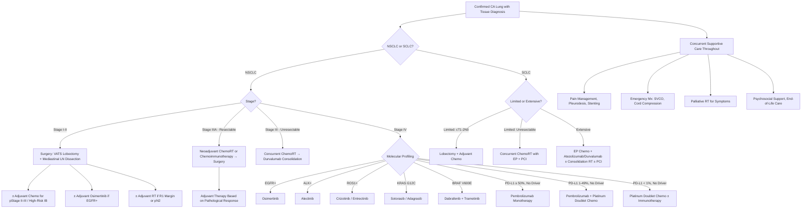

## Management of CA Lung

---

### 1. Overarching Principles — How to Think About Lung Cancer Treatment

Before diving into specifics, understand the logic tree that drives every treatment decision:

1. **Is it NSCLC or SCLC?** — This is the first branch. These are treated as completely different diseases.
2. **What is the stage?** — Determines curative vs palliative intent.
3. **What are the molecular markers?** (NSCLC only) — Determines whether targeted therapy or immunotherapy can be used.
4. **Is the patient fit enough?** — Performance status (ECOG), lung reserve, cardiac status.
5. **What does the MDT recommend?** — All lung cancer patients should be discussed at a ***multidisciplinary team (MDT) meeting*** [3] involving thoracic surgeon, medical oncologist, radiation oncologist, respiratory physician, radiologist, and pathologist.

The fundamental treatment modalities are:
- **Surgery** — the only treatment that can truly "cure" solid tumours (by completely removing them) [5]
- **Radiation therapy (RT)** — kills cancer cells by damaging DNA with ionising radiation
- **Chemotherapy** — cytotoxic drugs that kill rapidly dividing cells
- **Targeted therapy** — drugs directed against specific molecular drivers (EGFR TKIs, ALK inhibitors, etc.)
- **Immunotherapy** — checkpoint inhibitors that unleash the patient's immune system against the cancer
- **Supportive/palliative care** — symptom control, quality of life

---

### 2. NSCLC Management — Stage-by-Stage

***For NSCLC, treatment and prognosis depends heavily on staging and molecular markers*** [2]:
- ***Surgery for early stages (i.e., stage I–II + selected stage III)*** [2]
- ***Concurrent chemoirradiation for unresectable stage III (e.g., N2+ disease)*** [2]
- ***Systemic treatment for stage IV*** [2]

#### 2.1 Resectable NSCLC (Stage I, II, Selected IIIA)

##### A. Criteria for Resectability [2]

Three conditions must ALL be met:

| Criterion | Details |
|---|---|
| ***Appropriate stage*** | ***Stage I, stage II, T3N1, selected T4N0–1*** [2] |
| ***NO mediastinal involvement*** | ***N2 precludes resection*** [2] — confirmed by EBUS-TBNA/mediastinoscopy. Why? Because N2 disease means tumour has spread beyond what can be reliably cleared by surgery alone; outcomes are better with chemoradiation ± surgery. |
| ***Adequate cardiac and lung reserve*** | Patient must survive the operation and the postoperative period with remaining lung function [2] |

##### B. Surgical Options

***Surgical approach: now nearly all can be done under VATS*** [2].

***VATS lobectomy*** is the standard of care for early-stage NSCLC [3]. Why VATS over open thoracotomy? ***Smaller incisions → less postoperative pain, faster recovery, shorter hospital stay, reduced postoperative complications, with equivalent oncological outcomes*** [3].

| Operation | Description | Indication |
|---|---|---|
| ***Lobectomy*** | ***Gold standard for CA lung*** [2]. Removal of the entire lobe containing the tumour. | Standard operation for stage I–II NSCLC with adequate lung reserve |
| ***Sublobar resection (segmentectomy / wedge resection)*** | Removal of less than a full lobe | ***For those who cannot tolerate full lobectomy + primary tumour ≤ 3 cm*** [2]. Recent evidence (JCOG0802, CALGB 140503) supports segmentectomy for tumours ≤ 2 cm with equivalent survival. Wedge resection has slightly higher local recurrence. |
| ***Sleeve lobectomy*** | ***Lobectomy + resection of a segment of bronchus involved → rejoin the rest of the lung to the main bronchus*** [2] | ***Alternative to pneumonectomy for tumour close to main bronchus*** [2]. Preserves more lung tissue. Like cutting out a segment of a sleeve (shirt sleeve analogy) and sewing the remaining parts together. |
| ***Pneumonectomy*** | Removal of the entire lung | ***May be required for proximal tumours*** [2] that cannot be managed by sleeve lobectomy. Carries higher morbidity/mortality. Requires sufficient contralateral lung reserve. |
| ***± en bloc resection of chest wall*** | Lobectomy with resection of involved chest wall (ribs, intercostal muscles) | ***In tumours invading chest wall (T3)*** [2]. Achieves R0 resection margins. |

All curative resections include ***+ mediastinal lymph node dissection (usually routine in resectable NSCLC)*** [2]. This is both therapeutic (removes potentially involved nodes) and prognostic (pathological staging determines need for adjuvant therapy).

<Callout title="The Goal of Surgery — R0 Resection">
***The goal of curative surgery is complete (R0) resection — removal of all macroscopic and microscopic tumour with negative margins*** [5]. R0 = no residual tumour. R1 = microscopic residual. R2 = macroscopic residual. Only R0 gives the best chance of cure. This is why adequate margins and mediastinal lymph node dissection are critical.
</Callout>

##### C. Adjuvant Therapy After Surgery

| Adjuvant Treatment | Indication | Rationale |
|---|---|---|
| ***Adjuvant chemotherapy*** | ***Pathologic stage II–III or high-risk stage IB*** [2] | Micrometastatic disease may already be present even after complete resection. Adjuvant cisplatin-based doublet chemotherapy (e.g., cisplatin + vinorelbine) improves 5-year survival by ~5% in stage II–III. |
| ***Adjuvant RT*** | ***Positive surgical margin, or mediastinal LN involvement detected intraoperatively*** [2] | To sterilise residual microscopic disease at the resection margin or in the mediastinum. |
| ***Adjuvant targeted therapy*** | EGFR-mutant stage IB–IIIA (after complete resection + adjuvant chemo) | Osimertinib (3rd-gen EGFR TKI) for 3 years — ADAURA trial showed dramatic improvement in DFS. Now standard of care (2024–2026 guidelines). |
| ***Adjuvant immunotherapy*** | PD-L1 ≥ 1%, stage II–IIIA, after complete resection + adjuvant chemo | Atezolizumab (IMpower010 trial) for 1 year. |

##### D. Neoadjuvant Therapy (Before Surgery)

***Neoadjuvant therapy*** is increasingly used, particularly for stage II–IIIA NSCLC [5]:

| Approach | Details |
|---|---|
| **Neoadjuvant chemoimmunotherapy** | Nivolumab + platinum-doublet chemotherapy × 3 cycles before surgery (CheckMate 816 trial). Dramatically improved pathological complete response (pCR) rates. Now standard for resectable stage IB ( ≥ 4 cm)–IIIA. |
| ***Neoadjuvant chemoRT (if N2)*** [1] | For potentially resectable N2 disease — downstage the mediastinal nodes before surgery. |

> Why neoadjuvant? (1) Tumour may shrink → easier/safer surgery. (2) Treats micrometastatic disease early. (3) In-vivo chemosensitivity test — if the tumour doesn't respond, you know the chemo isn't working. (4) Better drug delivery before surgical disruption of blood supply.

##### E. Definitive RT (Non-Surgical Curative Option)

***Definitive RT: as alternative if medically unfit or refuse surgery*** [2].

- **Stereotactic ablative body radiotherapy (SABR/SBRT)**: High-dose, precisely targeted RT delivered in 3–8 fractions. For stage I–II NSCLC in patients who are medically inoperable. Achieves ~85–90% local control rates — comparable to surgery for stage I disease.
- **Conventional RT**: Lower-dose daily fractions over 6 weeks. Inferior to SABR/SBRT but may be used if SABR is not available.

---

#### 2.2 Locally Advanced NSCLC (Stage III — Unresectable)

***Concurrent chemoirradiation as treatment of choice*** [2]:

| Component | Details |
|---|---|
| ***Chemotherapy regimen*** | ***Usually cisplatin + etoposide or weekly carboplatin + paclitaxel*** [2]. Cisplatin is a platinum compound that cross-links DNA → prevents replication. Etoposide is a topoisomerase II inhibitor → prevents DNA unwinding. |
| ***Radiotherapy*** | ***Usually full-dose IMRT (60 Gy in 30 daily fractions)*** [2]. IMRT = intensity-modulated radiation therapy — shapes the radiation beam to conform to the tumour, sparing surrounding normal tissue. |
| ***Consolidation immunotherapy*** | ***± Durvalumab (anti-PD-L1) if no progression after concurrent chemoirradiation*** [2] — PACIFIC trial showed significant OS improvement (~47% vs 34% at 5 years). Now standard for unresectable stage III with PD-L1 ≥ 1%. Given for up to 12 months. |

> Why "concurrent" (not sequential)? Because giving chemo and RT simultaneously is synergistic — chemo sensitises cancer cells to radiation (radiosensitisation), improving local control and survival. The trade-off is more toxicity (especially oesophagitis and pneumonitis).

***Cisplatin + etoposide + full-dose IMRT (2 Gy × 30 days)*** [1] — this is the classic regimen. Note from the lecture slides that the dose is 2 Gy per fraction × 30 fractions = 60 Gy total.

---

#### 2.3 Advanced / Metastatic NSCLC (Stage IV)

This is where the revolution has happened. Treatment has moved from "one-size-fits-all chemotherapy" to precision medicine based on molecular profiling.

##### A. Molecular-Guided Treatment Algorithm

***Initial genetic testing to identify driver mutations as biomarkers*** [2]:
- ***Indications: ALL adenocarcinoma and ALL never or minimal remote smokers*** [2]
- ***Sample required*** [2]:
  - ***On biopsy sample: traditional method, but risk of resistance heterogeneity*** [2]
  - ***On plasma/urine (i.e., liquid biopsy): detection of cell-free DNA in plasma and urine → minimally invasive (allows serial testing) and representative of dominant tumour molecular profile*** [2]
- ***Mutation testing: current standard of care is to perform EGFR, ALK, and ROS1 analyses, but 10% of patients have other potentially actionable mutations (e.g., other EGFR, cMET, BRAF V600, NTRK, HER2)*** [2]

##### B. Treatment by Molecular Subtype

| Molecular Subtype | Prevalence (HK) | First-Line Treatment | Mechanism | Key Points |
|---|---|---|---|---|
| **EGFR mutation** | ~55% of adenocarcinoma [2] | ***Osimertinib*** (3rd-gen EGFR TKI) | "Osimertinib" — targets EGFR (epidermal growth factor receptor) tyrosine kinase. Blocks the signal that tells cancer cells to grow and divide. 3rd generation = also active against T790M resistance mutation. | FLAURA trial: osimertinib superior to 1st-gen TKIs (gefitinib/erlotinib). Median OS ~38 months. Also penetrates BBB (treats/prevents brain mets). |
| **ALK rearrangement** | ~5% of adenocarcinoma [2] | ***Alectinib*** (2nd-gen ALK TKI) | ALK = anaplastic lymphoma kinase. EML4-ALK fusion creates a constitutively active kinase → drives proliferation. Alectinib blocks this. | ALEX trial: alectinib superior to crizotinib. Good CNS penetration. Lorlatinib (3rd-gen) for resistance. |
| **ROS1 rearrangement** | ~1–2% | ***Crizotinib*** or ***entrectinib*** | ROS1 is structurally similar to ALK. Crizotinib inhibits both ALK and ROS1. | Respond well to ALK inhibitors due to structural homology. |
| **KRAS G12C** | ~5–10% [2] | ***Sotorasib*** or ***adagrasib*** | KRAS = Kirsten rat sarcoma viral oncogene. G12C = specific glycine-to-cysteine mutation. Sotorasib covalently binds the cysteine, locking KRAS in its inactive state. | Historically "undruggable" — sotorasib was a breakthrough (2021). |
| **BRAF V600E** | ~1–2% | ***Dabrafenib + trametinib*** | BRAF = serine/threonine kinase in the MAPK pathway. V600E = constitutively active. Dabrafenib inhibits BRAF; trametinib inhibits MEK (downstream). | Dual blockade of the same pathway — more effective than either alone. |
| **MET exon 14 skipping** | ~3% | ***Capmatinib*** or ***tepotinib*** | MET = mesenchymal-epithelial transition factor. Exon 14 skipping → impaired MET degradation → constitutive signalling. | |
| **RET rearrangement** | ~1–2% | ***Selpercatinib*** or ***pralsetinib*** | RET = rearranged during transfection. Fusion → constitutively active kinase. | |
| **NTRK fusion** | < 1% | ***Larotrectinib*** or ***entrectinib*** | NTRK = neurotrophic tyrosine receptor kinase. Tumour-agnostic indication. | |
| **No actionable mutation, PD-L1 ≥ 50%** | Variable | ***Pembrolizumab monotherapy*** | Anti-PD-1 monoclonal antibody. Blocks PD-1 on T cells → prevents tumour from "hiding" from the immune system via PD-L1/PD-1 interaction. | KEYNOTE-024 trial. |
| **No actionable mutation, PD-L1 1–49%** | Variable | ***Pembrolizumab + platinum-doublet chemotherapy*** | Immunotherapy + chemo synergy — chemo causes immunogenic cell death, releasing tumour antigens, enhancing the immune response. | KEYNOTE-189 trial. |
| **No actionable mutation, PD-L1 < 1%** | Variable | ***Platinum-doublet chemotherapy ± ipilimumab/nivolumab*** | Chemotherapy backbone: cisplatin/carboplatin + pemetrexed (non-squamous) or gemcitabine (squamous). | CheckMate 9LA or KEYNOTE-189 (chemo + pembro still used regardless of PD-L1 in some guidelines). |

<Callout title="Why EGFR-Mutant Patients Should NOT Receive Immunotherapy">
Counterintuitively, EGFR-mutant and ALK-rearranged NSCLC responds **poorly** to checkpoint inhibitors. The tumour microenvironment in these driver-mutated cancers tends to be immunologically "cold" (low tumour mutational burden, few neoantigens). Furthermore, combining EGFR TKIs with immunotherapy increases toxicity (especially pneumonitis) without improving efficacy. Always test for driver mutations FIRST — if present, use targeted therapy, not immunotherapy.
</Callout>

##### C. Liquid Biopsy — A Modern Tool

***Detection of cell-free DNA (cfDNA) in plasma and urine*** [2]:
- Tumour cells release fragments of DNA into the bloodstream as they die → circulating tumour DNA (ctDNA).
- Can detect driver mutations (EGFR, ALK, etc.) without invasive tissue biopsy.
- ***Minimally invasive, allows serial testing*** [2] (monitor treatment response, detect resistance mutations).
- ***Representative of dominant tumour molecular profile*** [2] (overcomes intratumour heterogeneity — samples from all tumour sites, not just one biopsy site).
- Limitation: lower sensitivity than tissue biopsy, especially at low tumour burden. If liquid biopsy is negative, tissue biopsy should still be performed.

---

#### 2.4 Special Situations in NSCLC

##### A. Solitary Brain Metastasis

***Solitary brain metastasis: surgery + RT*** [1].

| Approach | Details |
|---|---|
| **Surgery + adjuvant RT** | If solitary, operable, symptomatic, good performance status, controlled systemic disease [18] |
| **Stereotactic radiosurgery (SRS)** | ***Now more preferred*** [18] over WBRT as adjuvant. For small/inoperable lesions or small oligometastases ( < 3 cm) [18]. |
| **Whole-brain RT (WBRT)** | ***If not eligible for SRS/surgery, e.g., multiple bulky tumours*** [18]. Treats micrometastases but has significant neurocognitive side effects. |
| **Systemic therapy** | EGFR TKIs (especially osimertinib) and ALK TKIs (alectinib, lorlatinib) have good CNS penetration — may be sufficient for brain mets in driver-mutated NSCLC. |
| ***Dexamethasone + AED*** | ***For symptomatic relief*** [18] — dexamethasone reduces peritumoral vasogenic oedema; AEDs for seizure prophylaxis if seizures present. |

##### B. Malignant Pleural Effusion (M1a)

***Occurs in 50% of all metastatic malignancy, especially NSCLC*** [7]:

| Treatment | Details |
|---|---|
| ***Repeated chest drain*** | ***Every few weeks*** [7] — temporary relief but recurrence is almost inevitable |
| ***Chemical pleurodesis (1st line for recurrent MPE)*** [7] | ***Agents: talc (5 g in 100 mL NS), minocycline (300 mg in 100 mL NS), autologous blood*** [7]. Mechanism: sclerosing agent causes intense pleural inflammation → fibrosis → obliteration of the pleural space → prevents re-accumulation. ***Procedure: connect chest drain → apply sclerosant when lung re-expanded → clamp for 1–2 h → release → continue drainage until output < 150 mL/day × 2 days + CXR shows lung re-expanded*** [7]. |
| ***Surgical pleurodesis*** | ***Consider if good performance status*** [7]. VATS pleurodesis with mechanical abrasion or pleurectomy. ***Recurrence ~3%*** [7]. |
| ***Long-term ambulatory indwelling pleural catheter (IPC)*** | ***Consider if short life expectancy or trapped lung*** [7]. Patient drains at home. |
| ***Pleuroperitoneal shunt (e.g., Denver shunt)*** | ***Consider if short life expectancy or trapped lung*** [7]. Diverts fluid from pleural space to peritoneum. |

> What is a "trapped lung"? When the visceral pleura is encased by tumour (malignant cortex), the lung cannot re-expand even after fluid drainage. Pleurodesis will fail because the two pleural surfaces cannot come into contact. In this situation, IPC or shunt is preferred.

<Callout title="Chemical Pleurodesis — Important Procedural Detail" type="error">
***If co-existing pneumothorax or bubbling chest drain: do NOT clamp the drain*** (risk of tension pneumothorax). Instead, ***hang up the drain to ~50 cm above patient to drain air but not the sclerosant*** [7]. This allows air to escape while keeping the sclerosant in the pleural space. Also: ***avoid NSAIDs*** post-pleurodesis — ***inflammatory action is essential*** [7] for the pleurodesis to work. If you suppress the inflammation, the pleurodesis fails.
</Callout>

##### C. SVCO, Cord Compression, Airway Obstruction

These are **oncological emergencies** managed alongside the main treatment:

| Emergency | Management |
|---|---|
| ***SVCO*** | ***Palliative RT*** [1] (SVC stenting if severe/urgent, chemotherapy if SCLC — highly chemo-responsive). Dexamethasone, head elevation, loop diuretics. |
| ***Cord compression*** | Urgent MRI whole spine → dexamethasone 16 mg/day → surgical decompression (if single level, good prognosis) or emergency RT (if multiple levels or poor prognosis). |
| ***Airway obstruction*** | ***Bronchoscopic laser therapy or stenting to relieve airway obstruction*** [2]. Emergency if stridor present. |
| ***Bone pain*** | ***Palliative RT for bone metastases*** [1] (single fraction 8 Gy or 20 Gy in 5 fractions). Bisphosphonates or denosumab for skeletal-related events. |

---

### 3. SCLC Management

SCLC is fundamentally different from NSCLC:
- ***Metastases tend to occur early*** [2] — most patients present with extensive disease.
- ***Very chemosensitive and radiosensitive*** — high initial response rates (~60–80%).
- ***Almost invariably relapses*** — median survival even with treatment is ~10–12 months for extensive disease.
- ***Surgery is rarely indicated*** — because occult metastases are almost always present.

#### 3.1 cT1–2 N0 M0 Limited Disease (Very Rare — < 5% of SCLC)

***For cT1–2 N0 M0 limited stage disease*** [2]:
- ***Primary surgery: lobectomy + mediastinal LN sampling/dissection*** [2]
- ***Adjuvant chemotherapy: 4 cycles of cisplatin-based chemotherapy*** [2]
- ***± adjuvant chemo/RT if LN involvement identified intraoperatively*** [2]

> This is the only scenario where surgery plays a role in SCLC — and it's rare because most SCLC presents centrally with nodal involvement.

#### 3.2 Unresectable Limited-Stage SCLC (LS-SCLC)

***For unresectable limited stage disease (i.e., included in single RT field = TNM I–IIIB)*** [2]:

| Component | Details |
|---|---|
| ***Chemoirradiation (mainstay)*** | ***Usually 4 cycles of etoposide + cisplatin (EP) + thoracic EBRT*** [2]. RT should begin early (within 1st or 2nd cycle of chemo). |
| ***Prophylactic cranial irradiation (PCI)*** | ***If respond well to initial chemo/RT without brain mets*** [2]. ***Rationale: occult brain mets occur frequently in SCLC without neurological symptoms → brain mets often as sole site of relapse*** [2]. ***Effect: PCI → ↑overall survival + ↓incidence of brain metastasis*** [2]. |

> Why PCI? The blood-brain barrier prevents most chemotherapy drugs from reaching the brain. So even if the body tumour is controlled, microscopic brain deposits survive and grow. Irradiating the whole brain prophylactically eliminates these before they become clinically apparent. Trade-off: neurocognitive decline.

#### 3.3 Extensive-Stage SCLC (ES-SCLC)

***For extensive stage disease*** [2]:

| Component | Details |
|---|---|
| ***Induction chemotherapy (mainstay)*** | ***Usually given for 4–6 cycles*** [2]. Standard: platinum (cisplatin or carboplatin) + etoposide. |
| ***+ Immunotherapy*** | ***± Atezolizumab (PD-L1 monoclonal antibody)*** [2] — IMpower133 trial: adding atezolizumab to chemo improved OS (12.3 vs 10.3 months). Now standard first-line. Alternative: durvalumab (CASPIAN trial). |
| ***Further thoracic EBRT ± PCI*** | ***If good response to initial chemotherapy*** [2]. Consolidation thoracic RT can improve local control. PCI remains controversial in ES-SCLC (EORTC showed benefit; Japanese trial did not). |

---

### 4. Supportive and Palliative Care

***Supportive treatment*** [2]:

| Intervention | Details |
|---|---|
| ***Analgesics for pain relief*** [2] | WHO pain ladder: Step 1 (paracetamol ± NSAID) → Step 2 (weak opioid, e.g., codeine, tramadol) → Step 3 (strong opioid, e.g., morphine, oxycodone, fentanyl). ± Adjuvants (gabapentin/pregabalin for neuropathic pain, dexamethasone for raised ICP). |
| ***Cough suppression*** [2] | Codeine, dextromethorphan. Low-dose morphine for intractable cough. |
| ***Pleurodesis for malignant pleural effusion*** [2] | As described above. |
| ***Bronchoscopic laser therapy or stenting*** | ***To relieve airway obstruction*** [2]. Laser (Nd:YAG) debulks endobronchial tumour. Self-expanding metal stents maintain airway patency. |
| ***Management of complications*** | ***Electrolyte imbalance*** [2] (hyponatraemia from SIADH, hypercalcaemia from PTHrP), bone pain (palliative RT + bisphosphonates), cord compression, brain mets. |
| ***Other support*** | ***End-of-life care, psychosocial support*** [2]. Smoking cessation counselling. Nutritional support. Advance care planning. |

---

### 5. Treatment Summary Tables

#### NSCLC Treatment by Stage [1][2]

| Stage | Definition | Treatment | 5-Year OS |
|---|---|---|---|
| ***I*** | ***Isolated lesions*** | ***Surgery + adjuvant chemo*** (if high-risk IB) | ***~80%*** [1] |
| ***II*** | ***Hilar node spread*** | ***Surgery + adjuvant chemo*** | ***~60%*** [1] |
| ***IIIA*** | ***Potentially resectable*** | ***Neoadjuvant chemoRT (if N2) → Surgery*** [1]; or concurrent chemoRT | ***~40%*** [1] |
| ***IIIB*** | ***Unresectable*** | ***ChemoRT: cisplatin + etoposide + full-dose IMRT (2 Gy × 30 days) ± durvalumab*** [1]. ***± Targeted therapy*** [1]. ***Solitary brain metastasis: surgery + RT*** [1]. ***Palliative RT for complications (e.g., SVCO, cord compression)*** [1]. ***Supportive Tx: pleurodesis (MPE), bronchoscopic stenting, analgesic*** [1]. | ***~20%*** [1] |
| ***IV*** | ***Metastatic*** | Molecular-guided systemic therapy (TKIs, immunotherapy, chemotherapy) | ***~4%*** [1] |

#### SCLC Treatment Summary [2]

| Stage | Treatment | Median OS |
|---|---|---|
| cT1–2 N0 M0 | Surgery + adjuvant chemo (± RT if LN+) | ~2–3 years |
| Limited (unresectable) | Concurrent chemo/RT (EP × 4 + thoracic EBRT) + PCI | ~15–20 months |
| Extensive | Chemo (EP × 4–6) + atezolizumab/durvalumab ± consolidation thoracic RT ± PCI | ~12–13 months |

---

### 6. Comprehensive Management Algorithm

---

### 7. Key Drug Mechanisms — From First Principles

Understanding drug names and their mechanisms helps you remember them:

| Drug | Word Roots / Name Logic | Mechanism |
|---|---|---|
| **Cis-platin** | "Cis" = same side (geometry of the platinum molecule) | Platinum compound that cross-links DNA strands → prevents DNA replication and transcription → cell death. Dose-limiting toxicity: nephrotoxicity (always hydrate). |
| **Carbo-platin** | "Carbo" = contains a carboxylate group instead of chloride | Less nephrotoxic than cisplatin but more myelosuppressive. |
| **Etoposide** | Named after the podophyllotoxin it derives from | Topoisomerase II inhibitor → prevents DNA from unwinding during replication → DNA strand breaks → apoptosis. |
| **Pem-etrex-ed** | "Etrex" relates to its antifolate action | Multi-targeted antifolate → inhibits thymidylate synthase, DHFR, GARFT → blocks DNA and RNA synthesis. Used in non-squamous NSCLC (squamous has high thymidylate synthase → resistant). Must give with folic acid + B12 supplementation. |
| **Osimer-tinib** | "-tinib" = tyrosine kinase inhibitor | 3rd-generation EGFR TKI. Covalently binds EGFR (including T790M resistance mutation). Also penetrates blood-brain barrier. |
| **Alec-tinib** | "-tinib" = TKI | 2nd-generation ALK inhibitor. Better CNS penetration than crizotinib. |
| **Pembrolizu-mab** | "-mab" = monoclonal antibody; "lizu" = humanised | Anti-PD-1 monoclonal antibody. PD-1 = "programmed death-1" — a checkpoint receptor on T cells. Tumours express PD-L1 to engage PD-1, telling T cells to "stand down." Pembrolizumab blocks this → T cells remain active against the tumour. |
| **Durvalumab** | "-mab" = monoclonal antibody | Anti-PD-L1 monoclonal antibody. Same pathway as pembrolizumab but blocks the ligand (PD-L1) on the tumour rather than the receptor (PD-1) on the T cell. |
| **Atezolizumab** | "-zumab" = humanised monoclonal antibody | Anti-PD-L1. Used in ES-SCLC and NSCLC. |
| **Sotora-sib** | "-sib" reflects its KRAS-targeting mechanism | Covalently and irreversibly binds KRAS G12C in its inactive (GDP-bound) state → locks it inactive → blocks downstream MAPK signalling. |

---

### 8. Contraindications to Specific Treatments

| Treatment | Key Contraindications |
|---|---|
| **Surgery** | Medically unfit (ppoFEV₁ or ppoDLCO < 30% predicted, VO₂ max < 10), N2+ disease (relative), M1 disease (absolute, except oligometastatic scenarios), patient refusal |
| **Cisplatin** | Severe renal impairment (GFR < 30), hearing loss, peripheral neuropathy, unable to tolerate aggressive hydration |
| **EGFR TKIs** | No EGFR mutation (will be ineffective). Significant hepatic impairment. ILD/pneumonitis (TKI-induced pneumonitis can be fatal). |
| **Immunotherapy (anti-PD-1/PD-L1)** | Active autoimmune disease (risk of severe immune-related adverse events — pneumonitis, colitis, hepatitis, endocrinopathy). Organ transplant recipients (risk of graft rejection). Active untreated brain mets (relative). EGFR/ALK positive (poor response + ↑toxicity). |
| **Radiotherapy** | Poor lung function (risk of radiation pneumonitis), previous RT to same field (cumulative dose limits), very large radiation field (too much normal tissue damage) |
| **Pleurodesis** | Trapped lung (visceral pleura encasement — lung cannot re-expand → pleurodesis will fail). Parapneumonic effusion/empyema (difficult drainage and decortication) [7]. |

---

<Callout title="High Yield Summary — Management of CA Lung">

**NSCLC:**
1. **Stage I–II**: ***Surgery (VATS lobectomy) + mediastinal LN dissection*** [2][3]. ± Adjuvant chemo (stage II–III), ± adjuvant osimertinib (EGFR+), ± adjuvant RT (R1/pN2).
2. **Stage IIIA (resectable)**: Neoadjuvant chemo(immuno)therapy → surgery. Or neoadjuvant chemoRT if N2 [1].
3. **Stage III (unresectable)**: ***Concurrent chemoRT (cisplatin + etoposide + IMRT 60 Gy) → durvalumab consolidation*** [1][2].
4. **Stage IV**: Molecular-guided — EGFR → osimertinib; ALK → alectinib; no driver → immunotherapy ± chemo (based on PD-L1). ***Never give immunotherapy to EGFR/ALK+ patients.***
5. **Resectability criteria**: Appropriate stage + no N2+ + adequate cardiopulmonary reserve [2].
6. **Fitness thresholds**: ppoFEV₁/DLCO ≥ 40%; VO₂ max > 15; 3 FOS for lobectomy, 5 FOS for pneumonectomy [2].

**SCLC:**
1. **Limited (cT1–2 N0)**: Surgery + adjuvant chemo [2].
2. **Limited (unresectable)**: Concurrent chemoRT (EP × 4 + EBRT) + PCI [2].
3. **Extensive**: Chemo (EP × 4–6) + atezolizumab/durvalumab ± consolidation RT ± PCI [2].

**Supportive/Emergencies:**
- MPE → pleurodesis (1st line: chemical) or IPC [7].
- SVCO → palliative RT/stenting.
- Cord compression → dexamethasone + urgent RT/surgery.
- Airway obstruction → bronchoscopic laser/stenting [2].

</Callout>

---

<ActiveRecallQuiz
  title="Active Recall - Management of CA Lung"
  items={[
    {
      question: "What are the 3 criteria for resectability in NSCLC?",
      markscheme: "1. Appropriate stage (I, II, T3N1, selected T4N0-1). 2. No mediastinal (N2) involvement. 3. Adequate cardiac and lung reserve (ppoFEV1 and ppoDLCO at least 40% predicted)."
    },
    {
      question: "A patient with stage IV lung adenocarcinoma is found to have an EGFR exon 19 deletion. What is the first-line treatment, and why should immunotherapy be avoided?",
      markscheme: "First-line: osimertinib (3rd-generation EGFR TKI). Immunotherapy should be avoided because EGFR-mutant tumours have an immunologically 'cold' tumour microenvironment (low tumour mutational burden, few neoantigens) leading to poor response, and combining EGFR TKIs with immunotherapy increases toxicity (especially pneumonitis) without improving efficacy."
    },
    {
      question: "Explain the rationale for prophylactic cranial irradiation in limited-stage SCLC.",
      markscheme: "Occult brain metastases occur frequently in SCLC without neurological symptoms because chemotherapy cannot cross the blood-brain barrier adequately. Brain metastases are often the sole site of relapse. PCI irradiates the whole brain to eliminate microscopic brain deposits before they become clinically apparent, resulting in increased overall survival and decreased incidence of brain metastasis."
    },
    {
      question: "A patient with recurrent malignant pleural effusion has a trapped lung. Why will pleurodesis fail, and what alternative treatments are available?",
      markscheme: "Pleurodesis requires the visceral and parietal pleural surfaces to come into contact so that the sclerosant can induce inflammation and fibrosis to obliterate the space. In trapped lung, the visceral pleura is encased by tumour (malignant cortex), preventing lung re-expansion, so the pleural surfaces cannot meet. Alternatives: long-term ambulatory indwelling pleural catheter (IPC) for home drainage, or pleuroperitoneal shunt (e.g., Denver shunt)."
    },
    {
      question: "What is the standard concurrent chemoradiation regimen for unresectable stage III NSCLC, and what consolidation therapy follows?",
      markscheme: "Chemotherapy: cisplatin + etoposide (or carboplatin + paclitaxel). Radiotherapy: full-dose IMRT at 60 Gy in 30 daily fractions (2 Gy per fraction). Followed by consolidation immunotherapy with durvalumab (anti-PD-L1) for up to 12 months if no progression (PACIFIC trial), particularly if PD-L1 is 1% or more."
    },
    {
      question: "Name the surgical options for NSCLC resection from smallest to largest extent. What is the gold standard? When would you use a sleeve lobectomy?",
      markscheme: "From smallest to largest: wedge resection, segmentectomy, lobectomy, sleeve lobectomy, pneumonectomy. Gold standard is lobectomy. Sleeve lobectomy is used as an alternative to pneumonectomy when the tumour is close to the main bronchus - it involves lobectomy plus resection of the involved bronchial segment with reanastomosis, preserving more lung tissue."
    }
  ]}
/>

## References

[1] Senior notes: Maksim Medicine Notes.pdf (p.52, Lung Cancer — NSCLC treatment table, staging, surgical management)
[2] Senior notes: Ryan Ho Respiratory.pdf (p.146–150, Lung Cancer — Resectable NSCLC, locally advanced, advanced, SCLC management, supportive treatment, molecular testing, fitness assessment)
[3] Lecture slides: GC 196. Minimally Invasive Thoracic Surgery.pdf (VATS lobectomy, advantages over open thoracotomy)
[5] Lecture slides: GC 202. Surgery may cure your cancer Surgical oncology.pdf (R0 resection, neoadjuvant therapy, MDT approach)
[7] Senior notes: Maksim Medicine Notes.pdf (p.292–294, Malignant pleural effusion, pleurodesis — chemical and surgical, IPC, shunt)
[18] Senior notes: Ryan Ho Neurology.pdf (p.165, Brain metastasis management — surgery, SRS, WBRT, dexamethasone)
