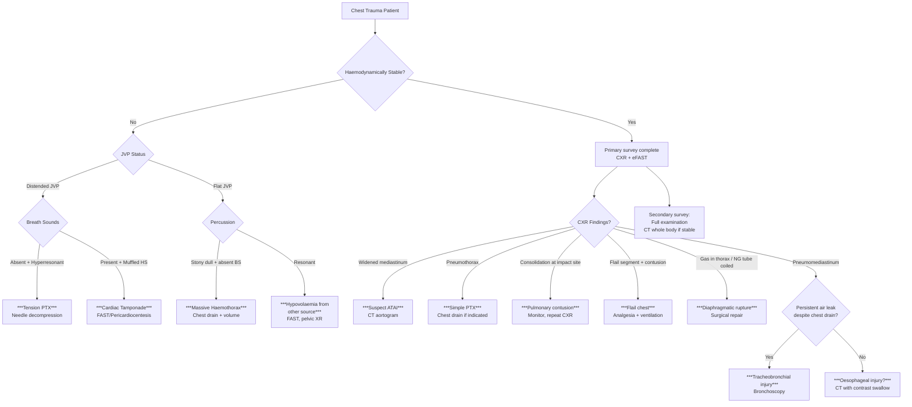

## Differential Diagnosis of Chest Injury

When a patient presents with chest trauma, your clinical job is not just to identify that there *is* a chest injury — it's to work out *which specific injury (or injuries)* are present, because each has a different management pathway. In polytrauma, multiple injuries coexist, so you're essentially running through a mental checklist. But equally important is distinguishing traumatic chest pathology from non-traumatic causes of acute chest pain/dyspnoea that may mimic trauma presentations (e.g., the patient who crashed their car *because* they had an MI, not the other way around).

This section approaches the DDx in two ways:
1. **Differential diagnosis *within* chest trauma** — i.e., which specific traumatic injury is causing the patient's clinical picture?
2. **Differential diagnosis of acute chest pain/dyspnoea** — i.e., ruling out non-traumatic mimics.

---

### 1. Systematic Differential Diagnosis Within Chest Trauma

The key to differential diagnosis in chest trauma is thinking **by anatomical structure** and **by clinical presentation**. The mechanism of injury guides your pre-test probability for each diagnosis.

#### 1.1 By Presenting Clinical Syndrome

In practice, a trauma patient presents with one or more of these syndromes. Each syndrome has a differential *within* the trauma context.

##### A. Shock + Chest Trauma

The critical question here is: **What type of shock?** The answer narrows the differential enormously.

| Type of Shock | Mechanism | Differentials | Key Distinguishing Features |
|---|---|---|---|
| ***Hypovolaemic*** | Blood loss → ↓circulating volume → ↓preload → ↓CO | ***Massive haemothorax***, intercostal artery bleeding, great vessel injury with mediastinal haemorrhage, associated intra-abdominal injury (splenic/hepatic — especially with lower rib fractures) [10] | ***Flat neck veins***, tachycardia, pale/cold, stony dull to percussion on affected side, blood on chest drain |
| ***Obstructive*** | Mechanical obstruction to cardiac filling or output | ***Tension pneumothorax, cardiac tamponade*** [4][5] | ***Distended neck veins*** (key differentiator from hypovolaemic). Tension PTX: absent breath sounds + hyperresonance + tracheal deviation. Tamponade: muffled heart sounds, pulsus paradoxus, electrical alternans |
| ***Cardiogenic*** | Pump failure | ***Myocardial contusion*** (severe), traumatic valvular injury, myocardial infarction (may be the *cause* of the trauma, e.g., patient had MI → crashed car) | Pulmonary oedema, gallop rhythm, ECG changes, ↑troponin, poor response to fluid resuscitation |

<Callout title="Clinical Pearl — JVP is Your Best Friend in Trauma" type="idea">
At the bedside, the **JVP** is the single most useful sign to differentiate shock type in chest trauma. ***Distended neck veins = obstructive (tamponade or tension PTX). Flat neck veins = hypovolaemic (haemothorax, intra-abdominal bleeding)***. If the JVP is elevated and the patient is hypotensive — you must immediately rule out tension PTX and tamponade before anything else [4][5].
</Callout>

##### B. Respiratory Distress + Chest Trauma

| Differential | Why This Causes Respiratory Distress | Key Distinguishing Features |
|---|---|---|
| ***Tension pneumothorax*** | Progressive positive pressure → lung collapse + mediastinal shift → ↓ventilation bilaterally + ↓venous return | ***Clinical diagnosis*** — absent BS, hyperresonance, tracheal deviation, obstructive shock. ***Do NOT wait for CXR*** [4] |
| ***Open pneumothorax*** | Chest wall defect → equilibration of intrapleural and atmospheric pressure → lung collapse | ***Visible chest wall wound with audible air movement ("sucking wound")***. Wound ***> 2/3 diameter of trachea*** → air preferentially enters wound [1] |
| ***Simple pneumothorax*** | Air in pleural space → partial lung collapse → ↓ventilation on that side → V/Q mismatch | ↓breath sounds + hyperresonance, but patient haemodynamically stable. ***CXR: rim of hyperlucency without lung markings*** [4][3] |
| ***Massive haemothorax*** | Blood compresses lung → atelectasis + hypovolaemia → ↓O₂ delivery | ***Stony dull percussion***, ↓BS, shock. ***> 1500 mL on chest drain*** [1] |
| ***Flail chest with pulmonary contusion*** | Paradoxical wall movement + underlying contusion → intrapulmonary shunt → hypoxaemia | ***Paradoxical chest wall movement***, visible/palpable crepitus, ***worsening hypoxaemia over 24-48h*** (contusion evolves) [3] |
| ***Pulmonary contusion*** (without flail) | Haemorrhage into alveoli → shunt → hypoxaemia | ***CXR: non-lobar consolidation*** at site of impact. May not be apparent on initial CXR — ***evolves over 6-24h*** [3] |
| ***Tracheobronchial rupture*** | Massive air leak from disrupted airway → persistent pneumothorax, pneumomediastinum | ***Persistent air leak despite functioning chest drain***, massive subcutaneous emphysema, ***fallen lung sign*** on CXR |
| ***Diaphragmatic rupture*** | Herniation of abdominal viscera → compression of lung | ***Bowel sounds in chest***, elevated hemidiaphragm, ***gastric bubble/NG tube in thorax*** on CXR [3] |

##### C. Chest Pain After Trauma (Stable Patient)

Once the immediately life-threatening injuries are excluded, the stable patient with post-traumatic chest pain has a different DDx:

| Differential | Features |
|---|---|
| **Rib fractures** (isolated) | Point tenderness, crepitus, pain on coughing/deep breathing, ***CXR may miss up to 50%*** [3] |
| **Sternal fracture** | Anterior chest pain, palpable step deformity. Suspect ***myocardial contusion*** underneath |
| **Costochondral separation** | Pain at costochondral junction, often missed on imaging |
| ***Myocardial contusion*** | Anterior chest pain, arrhythmias, ECG changes (ST-T, new RBBB). ***Think of this with any sternal/anterior chest impact*** |
| **Traumatic pericarditis** | Pleuritic chest pain relieved by sitting forward, pericardial friction rub, diffuse ST elevation [6] |
| ***Aortic injury (ATAI)*** | May be relatively asymptomatic initially ("contained rupture"). ***Widened mediastinum on CXR is the key screening finding*** [3] |
| ***Oesophageal perforation*** | Post-penetrating injury or after forceful vomiting. ***Mackler's triad, Hamman's sign, pneumomediastinum*** [7] |

---

#### 1.2 By Mechanism of Injury — Expected Injury Patterns

This is where your history of the mechanism becomes the most powerful diagnostic tool. Each mechanism predicts a pattern.

| Mechanism | Expected Injuries (Think of These) |
|---|---|
| ***Frontal RTA (driver, steering wheel)*** | Sternal fracture, myocardial contusion, bilateral anterior rib fractures, bilateral pulmonary contusion, ***ATAI (deceleration)***, cardiac tamponade |
| ***Lateral RTA (T-bone)*** | Ipsilateral rib fractures, flail chest, splenic injury (left), hepatic injury (right), diaphragmatic rupture, ***pelvic fracture*** |
| ***Pedestrian hit by vehicle*** | Depends on impact point. Chest impact → rib fractures, pulmonary contusion. ***Associated head injury, long bone fractures*** |
| ***Fall from height*** | Bilateral calcaneal fractures, vertebral fractures, bilateral pulmonary contusion, ***ATAI (vertical deceleration)***, diaphragmatic rupture |
| ***Stab wound to chest*** [1] | ***Haemothorax, pneumothorax, cardiac tamponade*** (if in "cardiac box"), great vessel injury. ***Wound deeper than platysma in neck → operative exploration*** [1] |
| ***Chopping wound*** [1] | Similar to stab but more tissue destruction, ***nerve and vascular injury at the wound site*** [1] |
| ***Blast injury*** | ***Blast lung*** (barotrauma), tympanic membrane rupture, penetrating fragment injuries, burns |
| ***Crush injury*** | Flail chest, bilateral pulmonary contusion, traumatic asphyxia (superior vena cava syndrome from prolonged thoracic compression) |

---

### 2. Differential Diagnosis: Non-Traumatic Mimics

This is crucial because sometimes the medical condition *caused* the trauma (e.g., MI → car crash), or a pre-existing condition coexists and confounds the picture. ***Always consider whether a medical event preceded the injury*** [11][12].

#### 2.1 Acute Chest Pain DDx (Trauma vs. Non-Trauma)

The standard acute chest pain differential applies and must be considered even in trauma [11][12][13]:

| System | ***Potentially Life-Threatening*** | ***Relatively Benign*** |
|---|---|---|
| ***CVS*** | ***Acute coronary syndrome (ACS)***, ***aortic dissection***, ***myopericarditis ± cardiac tamponade*** | ***Stable angina*** |
| ***Pulmonary*** | ***Pulmonary embolism***, ***tension/massive pneumothorax***, ***pneumonia*** | ***Small pneumothorax*** |
| ***GI*** | ***Boerhaave's perforation***, ***PUD perforation*** | ***GERD*** |
| ***Chest wall*** | — | ***Musculoskeletal pain, costochondritis, rib fracture, herpes zoster*** |
| ***Psychological*** | — | ***Panic attack*** |

> This table is taken directly from the standard clinical approach to acute chest pain [11][12].

<Callout title="Don't Forget: The Chicken or the Egg?" type="error">
***A 60-year-old driver has an RTA. He has chest pain. Is the chest pain FROM the crash (steering wheel injury → myocardial contusion) or did he have an MI/arrhythmia that CAUSED the crash?*** Always get a pre-crash history: Did the patient have chest pain or feel unwell BEFORE the accident? Were they feeling dizzy or did they lose consciousness? This changes management entirely — the patient may need PCI alongside trauma management.
</Callout>

#### 2.2 Key Discriminating Features Between Traumatic and Non-Traumatic Causes

| Feature | Traumatic Chest Injury | Non-Traumatic Cause |
|---|---|---|
| **History** | Clear mechanism of trauma | Symptoms preceded the trauma, or no trauma history |
| **Pain character** | Localised, pleuritic (rib fractures), related to impact site | ACS: dull, central, radiating to jaw/arm. Aortic dissection: tearing, radiating to back [13] |
| **ECG** | May show sinus tachycardia, new RBBB (myocardial contusion) | STEMI (ST elevation in coronary territory), PE (S1Q3T3, RV strain), pericarditis (diffuse concave-up ST elevation with PR depression) [6] |
| **Troponin** | May be mildly elevated (contusion, trauma-related demand ischaemia) | Significantly elevated and rising in serial measurements (ACS) |
| **CXR** | Rib fractures, pneumothorax, haemothorax, pulmonary contusion, widened mediastinum | Pneumonia (lobar consolidation), heart failure (cardiomegaly, Kerley B lines, bat-wing oedema), PE (may be normal or show Hampton's hump/Westermark's sign) |
| **D-dimer** | Non-specific elevation (trauma activates coagulation) | Useful to rule out PE in low pre-test probability [14] |

---

### 3. Differentiating Specific Traumatic Chest Injuries From Each Other

The most important bedside distinction is between the immediately life-threatening injuries (because each has a specific, time-critical intervention).

| Feature | ***Tension PTX*** | ***Cardiac Tamponade*** | ***Massive Haemothorax*** |
|---|---|---|---|
| **Neck veins** | ***Distended*** | ***Distended*** | ***Flat*** |
| **Breath sounds** | ***Absent ipsilateral*** | Normal or ↓bilateral | ***Absent ipsilateral*** |
| **Percussion** | ***Hyperresonant*** | Normal | ***Stony dull*** |
| **Tracheal deviation** | ***Away from affected side*** | Midline | Away from affected side (if large) |
| **Heart sounds** | Normal | ***Muffled*** | Normal |
| **Underlying pathophysiology** | Positive pressure → ↓VR | Pericardial blood → ↓diastolic filling | Blood loss → ↓circulating volume |
| **Immediate treatment** | ***Needle decompression → chest drain*** [4] | ***Pericardiocentesis*** (subxiphoid) [1] | ***Chest drain + volume resuscitation ± thoracotomy*** [1] |

<Callout title="Exam Favourite" type="idea">
The tension PTX vs. cardiac tamponade distinction is a common exam question. Both present with ***hypotension + distended neck veins***. The key differentiators are: (1) ***Breath sounds*** — absent in tension PTX, present in tamponade; (2) ***Percussion*** — hyperresonant in tension PTX, normal in tamponade; (3) ***Tracheal deviation*** — present in tension PTX, absent in tamponade. Remember: tamponade is a ***central*** problem (heart), tension PTX is a ***lateral*** problem (pleural space).
</Callout>

---

### 4. Diagnostic Algorithm for Chest Injury DDx

The following flowchart represents the systematic approach to narrowing the differential in a chest trauma patient, incorporating the ATLS primary and secondary survey framework [1][2][10].

---

### 5. Special Differential Diagnosis Scenarios

#### 5.1 Left-Sided Pleural Effusion/Pneumothorax Without Rib Fractures

This combination should raise suspicion for:
- ***Oesophageal rupture*** (Boerhaave's or penetrating) — because the left posterolateral distal oesophagus is the most common rupture site → contamination of left pleural space [7]
- ***Diaphragmatic rupture*** with herniation of abdominal contents [3]
- ***Thoracic duct injury*** → chylothorax (rare, usually with penetrating left supraclavicular/mediastinal trauma)

#### 5.2 Widened Mediastinum on CXR

DDx beyond ATAI [3]:
- ***Aortic dissection*** (non-traumatic — consider if risk factors present: hypertension, Marfan's, cocaine)
- Mediastinal haematoma from vertebral fracture
- Thymic/mediastinal mass (incidental finding)
- Technical factors: AP projection (magnifies mediastinum vs. PA), supine positioning, patient rotation
  - ***In trauma, CXR is often AP supine — this artefactually widens the mediastinum***. Always consider this before panicking, but err on the side of further imaging (CT aortogram) if concerned.

#### 5.3 ***Penetrating Neck Injury*** [1]

***Penetrating injury to the neck*** is closely related to chest injury because structures traversing the thoracic inlet can be injured. The lecture slides specifically highlight [1]:
- ***Exsanguinating external bleeding*** (may be from ***external jugular vein***)
- ***Expanding haematoma*** → requires ***endotracheal intubation to protect airway*** then ***operative exploration***
- ***If unsure of diagnosis*** or ***wound deeper than platysma*** → operative exploration or CT angiography

The neck is traditionally divided into three zones for penetrating injuries:
| Zone | Boundaries | Structures at Risk | Management Approach |
|---|---|---|---|
| **Zone I** | Clavicles/sternal notch to cricoid | Great vessels, trachea, oesophagus, thoracic duct, lung apices | CT angiography → selective exploration (difficult surgical access) |
| **Zone II** | Cricoid to angle of mandible | Carotid/jugular, larynx, trachea, oesophagus | Traditionally: mandatory exploration if platysma violated. Modern: selective approach with CT angiography |
| **Zone III** | Angle of mandible to skull base | Distal carotid/vertebral arteries, pharynx | CT angiography → angiography/embolisation (difficult surgical access) |

#### 5.4 Associated Abdominal Injuries

***Lower rib fractures (10th-12th)*** should trigger consideration of abdominal organ injury [3][10]:
- **Left lower ribs** → ***Splenic injury*** (delayed rupture possible — patient may be stable initially then deteriorate hours/days later) [10]
- **Right lower ribs** → ***Hepatic injury***
- **Bilateral lower ribs** → ***Renal injury***

This is why a FAST scan is essential even in patients presenting primarily with chest trauma — ***the diaphragm is not a boundary for injury patterns***.

#### 5.5 ***Spinal Fracture*** [10]

***Thoracic spinal fractures*** are part of the chest trauma DDx because:
- They coexist with other thoracic injuries (especially in high-energy mechanisms)
- They can cause ***spinal cord injury*** → ***paraplegia*** [15]
- ***Vertebral fractures can cause mediastinal haematoma*** → widening on CXR (mimicking ATAI)
- They contribute to ***neurogenic shock*** (loss of sympathetic tone below the level of injury → vasodilation + bradycardia → hypotension with paradoxical bradycardia — unlike hypovolaemic shock which has tachycardia)

---

### 6. Summary Table: Pattern Recognition for Chest Injury DDx

| Clinical Finding | Most Likely Diagnosis | Pathophysiological Reasoning |
|---|---|---|
| Shock + flat JVP + stony dull percussion | ***Massive haemothorax*** | Blood loss (hypovolaemia) + fluid in pleural space (dull percussion) |
| Shock + distended JVP + absent BS + hyperresonance | ***Tension PTX*** | Positive intrapleural pressure → ↓VR (JVD) + air (hyperresonance) |
| Shock + distended JVP + muffled HS + pulsus paradoxus | ***Cardiac tamponade*** | Blood in pericardium → ↓diastolic filling → ↓CO |
| Paradoxical chest wall movement + worsening hypoxia | ***Flail chest + pulmonary contusion*** | Free-floating rib segment + underlying alveolar haemorrhage |
| Persistent PTX despite chest drain + massive subcutaneous emphysema | ***Tracheobronchial rupture*** | Continuous air leak from disrupted airway |
| Widened mediastinum + high-speed deceleration | ***ATAI*** | Aortic shear at isthmus → contained rupture → mediastinal haematoma |
| Bowel sounds in chest + elevated hemidiaphragm | ***Diaphragmatic rupture*** | Visceral herniation through torn diaphragm into thorax |
| Vomiting → chest pain → subcutaneous emphysema | ***Oesophageal rupture (Boerhaave's)*** | Full-thickness rupture → air leaks into mediastinum |
| Sternal fracture + arrhythmia + anterior chest impact | ***Myocardial contusion*** | Bruising of RV myocardium → electrical instability |
| ***Sucking wound on chest wall*** | ***Open PTX*** | Chest wall defect allows air entry → lung collapse |

---

<Callout title="High Yield Summary">

**Key DDx Framework for Chest Trauma:**

1. **By shock type**: Hypovolaemic (massive haemothorax → flat JVP) vs. Obstructive (tension PTX or tamponade → distended JVP) vs. Cardiogenic (myocardial contusion). JVP is the key bedside differentiator.

2. **By mechanism**: Blunt deceleration → ATAI, pulmonary contusion. Blunt compression → rib fractures, flail chest, cardiac contusion. Penetrating → haemo/pneumothorax, tamponade, vascular injury.

3. **Don't forget non-traumatic mimics**: ACS (may have caused the trauma), PE, spontaneous PTX, aortic dissection. Always ask if symptoms preceded the trauma.

4. **Tension PTX vs. Tamponade**: Both have hypotension + JVD. Tension PTX has absent BS + hyperresonance + tracheal deviation. Tamponade has muffled HS + pulsus paradoxus + normal BS.

5. **Rib fracture associations**: Upper ribs → great vessel/mediastinal injury. Lower ribs → splenic/hepatic injury. Paediatric rib fractures without high-energy mechanism → consider NAI.

6. **Penetrating neck wounds deeper than platysma → operative exploration or CT angiography** [1].

</Callout>

---

<ActiveRecallQuiz
  title="Active Recall - Chest Injury DDx"
  items={[
    {
      question: "A chest trauma patient is hypotensive with distended neck veins. How do you differentiate tension pneumothorax from cardiac tamponade at the bedside?",
      markscheme: "Both have hypotension + JVD (obstructive shock). Tension PTX: absent breath sounds ipsilaterally, hyperresonant percussion, tracheal deviation away from affected side. Tamponade: breath sounds present bilaterally, muffled heart sounds, pulsus paradoxus, no tracheal deviation. Tension PTX is a lateral problem; tamponade is a central problem."
    },
    {
      question: "A 55-year-old driver is brought in after a frontal RTA. He has chest pain radiating to his jaw, ST elevation on ECG, and a steering wheel imprint on his chest. What two conditions must you differentiate and how?",
      markscheme: "Acute coronary syndrome (MI that may have caused the crash) vs. myocardial contusion from steering wheel impact. Key differentiators: (1) Pre-crash history - did chest pain precede the accident? (2) ECG pattern - STEMI follows coronary territory; contusion shows diffuse changes or new RBBB. (3) Serial troponins - ACS shows typical rise and fall; contusion may have single elevation. (4) Echo - ACS shows regional wall motion abnormality in coronary territory; contusion shows RV dysfunction. Both may coexist."
    },
    {
      question: "What chest injury should you suspect if there is a left-sided pleural effusion without rib fractures after blunt abdominal trauma?",
      markscheme: "Diaphragmatic rupture (left more common than right due to liver protection). Also consider oesophageal rupture. Look for: bowel sounds in chest, gastric bubble in thorax on CXR, NG tube coiling into thorax. CT with coronal reconstruction or contrast swallow confirms diagnosis."
    },
    {
      question: "A trauma patient has a chest drain in situ but there is persistent bubbling and the pneumothorax is not resolving. What is the most likely diagnosis and why?",
      markscheme: "Tracheobronchial rupture (injury usually within 2.5 cm of carina). The disrupted airway provides a continuous air leak that the chest drain cannot control. Look for massive subcutaneous emphysema and fallen lung sign on CXR. Requires bronchoscopy for diagnosis and likely surgical repair."
    },
    {
      question: "List the key CXR findings suggesting acute traumatic aortic injury and explain why each occurs.",
      markscheme: "Widened mediastinum (>8cm) from mediastinal haematoma; loss of aortic knuckle (haematoma obscures normal contour); thickened paratracheal stripe (blood tracking along trachea); tracheal/NG tube deviation to right (haematoma pushes structures); left apical pleural cap (blood tracking over apex); depression of left main bronchus (haematoma pushes bronchus down). All result from contained aortic rupture with mediastinal haematoma."
    }
  ]}
/>

## References

[1] Lecture slides: GC 182. Chopped and stabbed wound in gang fight Nerves and vascular injury; Classification of injuries.pdf
[2] Lecture slides: GC 175. A bus hit a train Multiple trauma; Disaster management.pdf
[3] Senior notes: Ryan Ho Radiology.pdf (Chapter 1: Radiology in Trauma)
[4] Senior notes: Maksim Medicine Notes.pdf (p291, Pneumothorax)
[5] Senior notes: Ryan Ho Respiratory.pdf (p151-152, Pneumothorax)
[6] Senior notes: Ryan Ho Cardiology.pdf (p172, Diseases of Pericardium)
[7] Senior notes: Maksim Surgery Notes.pdf (p58-59, Esophageal perforation / Boerhaave's)
[10] Senior notes: Maksim Surgery Notes.pdf (p42, Trauma / FAST scan)
[11] Senior notes: Maksim Medicine Notes.pdf (p5, Chest Pain DDx)
[12] Senior notes: Ryan Ho Fundamentals.pdf (p199-203, Chest Pain)
[13] Senior notes: Ryan Ho Cardiology.pdf (p54-58, Chest Pain)
[14] Senior notes: Ryan Ho Haemtology.pdf (p131, VTE)
[15] Senior notes: Ryan Ho Neurology.pdf (p168, Approach to Paraplegia)
