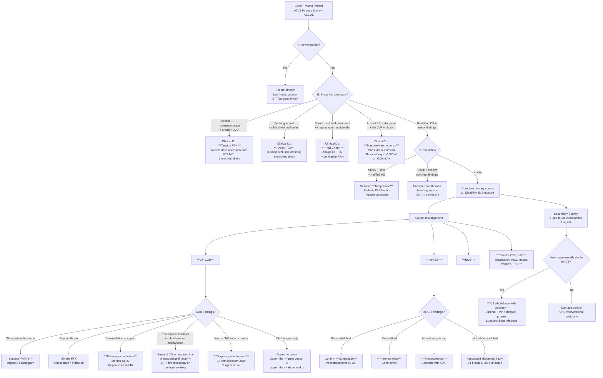

## Diagnostic Criteria, Diagnostic Algorithm, and Investigation Modalities for Chest Injury

### 1. Diagnostic Principles — Why Chest Trauma Diagnosis is Different

Unlike many medical conditions, chest trauma does not have a single set of "diagnostic criteria" in the way that, say, ARDS has the Berlin criteria or rheumatic fever has the Jones criteria. Instead, diagnosis in chest trauma operates on a **pattern-recognition and exclusion** model within the ATLS framework. The diagnosis of each specific injury relies on a combination of:

1. **Mechanism of injury** (raises pre-test probability)
2. **Clinical findings** (many immediately life-threatening injuries are **clinical diagnoses** — especially tension PTX)
3. **Bedside investigations** (CXR, eFAST)
4. **Advanced imaging** (CT — the gold standard for the stable patient)

The key philosophical point: ***In an unstable trauma patient, treatment precedes definitive diagnosis. You decompress first, image later*** [4][10].

---

### 2. Diagnostic Criteria for Specific Chest Injuries

While there aren't overarching "diagnostic criteria" for chest trauma as a whole, individual injuries do have defined diagnostic features:

#### 2.1 Tension Pneumothorax

> ***This is a CLINICAL diagnosis. Do NOT wait for CXR or any imaging*** [4][5].

**Diagnostic criteria (all clinical):**
- ***Severe respiratory distress***
- ***Obstructive shock: hypotension + elevated JVP***
- ***Ipsilateral absent breath sounds + hyperresonance***
- ***Tracheal deviation to contralateral side*** (may be absent in splinted mediastinum, e.g., malignancy/fibrosis)
- ***Immediate improvement after needle decompression confirms the diagnosis*** (therapeutic and diagnostic simultaneously)

<Callout title="Why No Imaging?" type="error">
Sending a patient with suspected tension PTX for CXR wastes precious minutes. The positive intrapleural pressure progressively worsens venous return compromise — cardiac arrest can occur within minutes. The diagnosis is made clinically and confirmed by the response to decompression. If you're wrong (rare), a needle in the chest of a patient who doesn't have tension PTX causes minimal harm. If you delay in a patient who does have it, they die.
</Callout>

#### 2.2 Massive Haemothorax

**Diagnostic criteria:**
- ***> 1500 mL of blood drained immediately on chest tube insertion***, OR
- ***> 200 mL/hour of ongoing drainage for 2-4 consecutive hours*** [1]
- These are the indications for **thoracotomy** — they define the injury as "massive" and imply a source (usually intercostal artery, internal mammary artery, or great vessel) that will not stop without surgical intervention.

#### 2.3 Flail Chest

**Diagnostic criteria:**
- ***≥ 3 consecutive ribs fractured in ≥ 2 places each*** (creating a free-floating segment), OR
- ***≥ 2 ribs fractured bilaterally with sternal separation***
- ***Paradoxical chest wall movement*** on inspection
- ***Underlying pulmonary contusion*** (the cause of significant morbidity) typically confirmed on CXR/CT

#### 2.4 Cardiac Tamponade

**Diagnostic criteria** (clinical + bedside):
- ***Beck's triad: hypotension + distended neck veins + muffled heart sounds*** [1]
- ***Pulsus paradoxus > 10 mmHg*** (exaggerated SBP drop on inspiration)
- ***FAST/echocardiography: pericardial fluid collection with RA/RV diastolic collapse*** [3][10]
- ***Electrical alternans on ECG*** (alternating QRS amplitude)

#### 2.5 Acute Traumatic Aortic Injury (ATAI)

**Diagnostic criteria** (radiological):
- ***CXR screening***: widened mediastinum ( > 8 cm on AP), loss of aortic knuckle, thickened paratracheal stripe, tracheal/NG deviation to right, left apical cap, depression of left main bronchus [3]
- ***CT aortogram (definitive)***: intimal flap, pseudoaneurysm, mediastinal haematoma, extravasated contrast, periaortic haematoma [3]
- ***80-85% occur at the aortic isthmus*** [3]

#### 2.6 Pneumothorax (Simple)

**Diagnostic criteria (radiological):**
- ***Erect CXR***: visible visceral pleural edge with radiolucency and no lung markings peripheral to it [3][4]
- ***Supine CXR*** (common in trauma — patient cannot sit up): ***deep sulcus sign, double diaphragm sign, increased sharpness of mediastinal/cardiac borders, depression of ipsilateral hemidiaphragm*** [3]
- **Size classification** [4]:
  - ***Small: < 2 cm*** between lung edge and chest wall at level of hilum
  - ***Large: ≥ 2 cm*** (≈ ↓50% lung volume)
  - ***Formula: % pneumothorax = (1 - average lung diameter³ / average hemithorax diameter³) × 100%***
  - ***1 cm on PA CXR ≈ 27% hemithorax***

#### 2.7 Pulmonary Contusion

**Diagnostic criteria:**
- ***CXR: non-lobar consolidation*** at site of impact, appearing within 6 hours [3]
- ***CT is more sensitive***: ground-glass opacification and consolidation not respecting lobar boundaries
- ***Clinical correlation***: worsening hypoxaemia over 24-48 hours despite treatment
- ***Key distinguishing feature from pneumonia***: contusion follows the anatomical distribution of impact, not lobar anatomy; appears early; no infectious prodrome

#### 2.8 Diaphragmatic Rupture

**Diagnostic criteria:**
- ***CXR***: elevated hemidiaphragm, gas-filled viscus above diaphragm, NG tube coiled in thorax [3]
- ***CT with coronal/sagittal reconstruction***: direct visualisation of diaphragmatic discontinuity with herniated viscera
- ***Contrast studies*** (barium meal/water-soluble contrast): confirm bowel in thorax [3]
- ***Often diagnosed late*** — presentation can be insidious with a small defect that enlarges over time [3]

#### 2.9 Oesophageal Perforation

**Diagnostic criteria:**
- ***Clinical: Mackler's triad*** (vomiting + excruciating chest pain + subcutaneous emphysema) [7]
- ***CXR: pneumomediastinum, surgical emphysema, left pleural effusion*** [7]
- ***CT with oral water-soluble contrast***: localises the site of perforation (contrast extravasation) [7]
- ***Hamman's sign***: mediastinal crunching synchronous with heartbeat [7]

---

### 3. Master Diagnostic Algorithm for Chest Trauma

The following algorithm integrates the ATLS approach with the diagnostic modalities, showing the decision pathway from initial assessment to definitive diagnosis.

---

### 4. Investigation Modalities — Comprehensive Guide

#### 4.1 Bedside / Immediate Investigations

##### A. Clinical Assessment (Primary Survey)

This is technically the first "investigation." Many immediately life-threatening injuries are **clinical diagnoses**:

| Injury | Clinical Diagnosis Sufficient? | Rationale |
|---|---|---|
| ***Tension PTX*** | **YES** — treat without imaging | Delay kills. Clinical findings are pathognomonic |
| ***Open PTX*** | **YES** — visible wound | Obvious external wound with air movement |
| ***Massive haemothorax*** | **Partially** — clinical + chest drain output | Need chest drain to confirm volume |
| ***Cardiac tamponade*** | **Partially** — clinical + FAST | Beck's triad may be incomplete; FAST confirms |
| ***Flail chest*** | **YES** — inspection + palpation | Paradoxical movement + crepitus |

##### B. Chest X-Ray (CXR)

The **single most important initial imaging investigation** in chest trauma. Obtained as part of the ***trauma series*** (***AP CXR, AP pelvis***) [3][10]. Note that in modern practice, CT has largely replaced the lateral C-spine XR, but CXR remains essential [10].

<Callout title="Supine CXR Pitfalls" type="error">
In trauma, CXR is almost always taken ***AP supine*** (patient cannot sit up). This has important implications:
- ***Mediastinum appears wider*** (AP magnification + supine redistribution of blood) — don't panic about "widened mediastinum" before considering technique
- ***Pneumothorax is easily missed*** — air rises anteriorly in the supine patient, not to the apex. Look for ***deep sulcus sign, double diaphragm sign*** [3]
- ***Small haemothorax may layer posteriorly*** → appears as diffuse haziness rather than a meniscus
</Callout>

**Systematic CXR interpretation in trauma (use a checklist approach):**

| Structure | What to Look For | Injury Suggested |
|---|---|---|
| **Airway/Trachea** | Deviation, subcutaneous emphysema | Tension PTX (away), massive atelectasis (toward), pneumomediastinum |
| **Bones** | Rib fractures (cortical breaks, esp lateral), sternal fracture, scapula fracture, clavicle fracture | ***CXR may miss up to 50% of rib fractures*** [3]. Upper rib fractures → suspect great vessel injury. Lower ribs → suspect abdominal organ injury [3] |
| **Cardiac silhouette** | Enlarged (globular/"water bottle" shape) | ***Pericardial effusion / tamponade*** (but may be normal acutely) |
| **Diaphragm** | Elevated hemidiaphragm, gas above diaphragm, NG tube in thorax | ***Diaphragmatic rupture*** [3] |
| **Effusion/fluid** | Blunted CP angle, meniscus, diffuse haziness (supine) | ***Haemothorax*** |
| **Fields (lung)** | Consolidation (non-lobar), hyperlucency | ***Pulmonary contusion*** (consolidation at impact site) [3], ***pneumothorax*** (hyperlucency) |
| **Gadgets** | ET tube position, chest drain, NG tube position | Malpositioned devices, NG tube in thorax (diaphragmatic rupture) |
| **Heart/mediastinum** | ***Widened mediastinum ( > 8 cm)***, abnormal aortic contour, thickened paratracheal stripe | ***ATAI*** [3] |

> The mnemonic **"ABCDEFGH"** (Airway, Bones, Cardiac, Diaphragm, Effusion, Fields, Gadgets, Heart/mediastinum) helps ensure you don't miss anything.

**Key CXR signs and their pathological basis:**

| CXR Sign | Pathological Basis | Condition |
|---|---|---|
| ***Visible visceral pleural edge*** | Air separates visceral from parietal pleura → visible white line | ***Pneumothorax (erect CXR)*** [3] |
| ***Deep sulcus sign*** | In supine patient, free air collects anteroinferiorly → extends costophrenic sulcus deeper than normal | ***Pneumothorax (supine CXR)*** [3] |
| ***Double diaphragm sign*** | Air outlines both the dome and anterior insertion of diaphragm | ***Pneumothorax (supine CXR)*** [3] |
| ***Meniscus sign*** | Fluid curves upward at periphery due to capillary action and gravity | ***Pleural effusion / haemothorax*** [16] |
| ***Widened mediastinum*** | Mediastinal haematoma from contained aortic rupture expands the mediastinal contour | ***ATAI*** [3] |
| ***Loss of aortic knuckle*** | Haematoma obscures the normal aortic arch contour | ***ATAI*** [3] |
| ***Ring around artery sign*** | Gas surrounding the pulmonary artery | ***Pneumomediastinum*** [3] |
| ***Continuous diaphragm sign*** | Gas trapped posterior to pericardium allows visualisation of entire diaphragm as a continuous line | ***Pneumomediastinum*** [3] |
| ***Naclerio's V sign*** | Gas extending along descending aorta intersects with gas along medial left hemidiaphragm, forming a V | ***Pneumomediastinum*** [3] |
| ***Subcutaneous emphysema*** | Gas densities tracking in soft tissue planes | Pneumothorax, tracheobronchial injury, open wound [3] |
| ***Callus formation on ribs*** | Healing fracture (10-14 days) — implies ***old injury*** | Important for timing injury (relevant in NAI in children, medicolegal) [3] |

##### C. Extended Focused Assessment with Sonography for Trauma (eFAST)

***FAST is a standardised bedside ultrasound approach to detect free fluid*** [3][10]. The "extended" version (eFAST) adds **thoracic views** for pneumothorax and haemothorax.

| ***eFAST View*** | ***Structures Assessed*** | ***Pathology Detected*** |
|---|---|---|
| ***Subxiphoid (transverse)*** | ***Pericardial space, left liver*** | ***Pericardial effusion*** (tamponade), left liver injury [10] |
| ***Right upper quadrant / perihepatic (longitudinal)*** | ***Morison's pouch (hepatorenal recess), right subphrenic, right paracolic gutter*** | Free intraperitoneal fluid, right liver/kidney injury [10] |
| ***Left upper quadrant / perisplenic (longitudinal)*** | ***Splenorenal space, left subphrenic*** | Free fluid, splenic/left kidney injury [10] |
| ***Pelvic (transverse + longitudinal)*** | ***Pouch of Douglas / rectovesical space*** | Free pelvic fluid, bladder injury [10] |
| ***Bilateral thoracic*** | ***Pleural space, lung surface*** | ***Pneumothorax*** (absent lung sliding = "stratosphere sign" on M-mode), ***haemothorax*** (anechoic fluid above diaphragm) |

**Key eFAST concepts:**

- ***FAST positive*** (free fluid detected) in an ***unstable patient*** → immediate operative intervention (laparotomy or thoracotomy depending on location) [10][17]
- ***FAST positive in a stable patient*** → proceed to CT for detailed evaluation [3][10]
- ***FAST negative does NOT exclude injury*** → ***intra-parenchymal lacerations may not produce free fluid*** [3]. If clinical suspicion remains, proceed to CT.

> ***Diagnostic Peritoneal Lavage (DPL)***: An older technique largely replaced by FAST/CT, but still useful in ***haemodynamically unstable patients when FAST is equivocal or unavailable*** [17]. Positive if: ***frank blood or bowel content aspirated, or unspun specimen shows RBC ≥ 100,000/mm³ or WCC ≥ 500/mm³*** [17]. ***A negative DPL in a shocked patient may signify retroperitoneal bleeding*** [17].

##### D. ECG

**Why ECG in chest trauma?** Three reasons:
1. **Detect myocardial contusion**: New arrhythmias (sinus tachycardia, AF, PVCs, VT), ST-T changes, ***new RBBB*** (because the RV is the most anterior chamber and most vulnerable) [16]
2. **Rule out ACS as the cause of trauma**: ST elevation in a coronary territory suggests MI preceded the injury [12]
3. **Detect tamponade**: ***Low-voltage QRS, electrical alternans*** [6]
4. **Detect PE**: ***S1Q3T3, RV strain pattern (inverted T V1-4, RBBB, RAD), P pulmonale*** [16]

| ECG Finding | Suggests | Pathophysiological Basis |
|---|---|---|
| ***Sinus tachycardia*** | Pain, hypovolaemia, sympathetic response | Most common and least specific finding |
| ***New RBBB*** | ***Myocardial contusion*** | RV free wall contusion disrupts right bundle conduction |
| ***ST-T changes (non-territorial)*** | ***Myocardial contusion, pericarditis*** | Diffuse myocardial oedema/inflammation |
| ***ST elevation (territorial)*** | ***ACS (MI)*** — may be the cause of trauma | Coronary occlusion → transmural ischaemia |
| ***Low-voltage QRS*** | ***Pericardial effusion/tamponade*** | Fluid around heart attenuates electrical signal [6][16] |
| ***Electrical alternans*** | ***Large pericardial effusion*** | Heart swings in fluid → alternating QRS axis [6] |
| ***Diffuse concave-up ST elevation + PR depression*** | ***Pericarditis*** | Diffuse pericardial inflammation [6] |
| ***S1Q3T3*** | ***PE*** (may coexist with trauma) | Acute RV strain from pulmonary artery obstruction [16] |

##### E. Arterial Blood Gas (ABG) / Venous Blood Gas (VBG)

**Why ABG in chest trauma?**
- Quantifies severity of respiratory compromise (PaO₂, PaCO₂)
- Identifies type of respiratory failure:
  - ***Type 1 RF (↓PaO₂, ↓/N PaCO₂)***: V/Q mismatch or shunt — pneumothorax, pulmonary contusion, haemothorax
  - ***Type 2 RF (↓PaO₂, ↑PaCO₂)***: Hypoventilation — flail chest with exhaustion, cervical spinal cord injury, drug overdose
- ***Lactate***: marker of tissue hypoperfusion. ***Elevated lactate ( > 2 mmol/L) in trauma indicates shock*** — correlates with injury severity and mortality [16]
- ***Base deficit***: Negative base excess (base deficit > 6) indicates significant haemorrhage/shock and is used as a resuscitation endpoint

---

#### 4.2 Blood Investigations

| Blood Test | Key Findings in Chest Trauma | Clinical Significance |
|---|---|---|
| ***CBC*** | ↓Hb (haemorrhage), ↑WCC (stress response/infection) | Serial Hb monitoring for ongoing bleeding. ***Initial Hb may be normal despite significant haemorrhage*** because haemodilution takes time (the "compensated" phase) [16] |
| ***Coagulation (PT/INR, aPTT, fibrinogen)*** | ↑PT/INR in massive haemorrhage, DIC | Baseline for resuscitation. ***Trauma-induced coagulopathy*** (TIC) occurs in ~25% of major trauma patients — driven by tissue injury + shock + haemodilution + hypothermia + acidosis ("lethal triad": hypothermia, acidosis, coagulopathy) |
| ***Group and crossmatch (T+S)*** | — | ***Essential in ALL trauma patients*** — anticipate need for blood products |
| ***Cardiac enzymes (Troponin)*** | ↑in myocardial contusion, ACS | ***Troponin may be elevated in any cause of myocardial injury*** — trauma, contusion, demand ischaemia from shock, or true ACS [12]. Serial measurement helps differentiate (ACS shows typical rise-and-fall pattern) |
| ***L/RFT*** | ↑urea/Cr (AKI from shock), ↑ALT/AST (shock liver, hepatic injury), electrolyte disturbance | Monitor for organ dysfunction secondary to hypoperfusion [16] |
| ***Lactate*** | ***↑ > 2 mmol/L*** indicates inadequate tissue perfusion | Prognostic marker; serial lactate clearance guides resuscitation adequacy [16] |
| ***D-dimer*** | Elevated in trauma (non-specific) | ***Not useful for ruling out PE in the trauma setting*** (trauma itself activates coagulation → always elevated). Only useful in non-trauma settings with low pre-test probability [16] |
| ***Amylase*** | ↑in pancreatic/duodenal injury, parotid injury | Mildly elevated amylase in trauma may indicate hollow viscus injury [17] |

<Callout title="The 'Lethal Triad' of Trauma" type="idea">
***Hypothermia + Acidosis + Coagulopathy*** = the "lethal triad" or "trauma triad of death." Each element worsens the others in a vicious cycle:
- **Hypothermia** → impairs clotting enzyme function → worsens coagulopathy
- **Acidosis** (lactic acid from shock) → impairs clotting factor function → worsens coagulopathy
- **Coagulopathy** → continued bleeding → worsens hypothermia and acidosis

This is why ***damage control resuscitation*** emphasises early blood product replacement (1:1:1 ratio of PRBC:FFP:platelets), permissive hypotension, and prevention of hypothermia.
</Callout>

---

#### 4.3 Advanced Imaging

##### A. CT (Computed Tomography) — The Gold Standard

***CT is the gold standard for evaluating the stable chest trauma patient*** [3][10][18].

**Advantages** [3]:
- ***Fast: completed in ~15 seconds***
- ***Excellent anatomical correlation***
- ***Very high sensitivity for visceral injury, free fluid, free gas, and vascular injury***
- No superimposition (unlike plain XR) — 3D images [18]

**Contrast phases and their purpose** [10]:

| Phase | Timing After Contrast | What It Detects | Why |
|---|---|---|---|
| ***Arterial phase*** | ~25-30 seconds | ***Active bleeding points, pseudoaneurysms, vascular injury*** | Contrast extravasation = active haemorrhage ("blush"). Pseudoaneurysm shows focal contrast collection within vessel wall |
| ***Portovenous phase*** | ~60-70 seconds | ***Visceral organ injury (most important phase)*** [10] | Parenchymal organs enhance maximally → lacerations/haematomas appear as non-enhancing defects within enhancing parenchyma |
| ***Delayed phase*** | ~5-10 minutes | ***Urinary extravasation*** | Contrast has been excreted by kidneys → if renal pelvis/ureter/bladder is injured, contrast leaks outside the urinary tract |
| ***Lung window*** | Same scan, different display | ***Pneumothorax, contusion, atelectasis*** | Air and lung parenchyma best visualised with lung window settings |
| ***Bone window*** | Same scan, different display | ***Fractures (ribs, spine, sternum, scapula)*** | Cortical detail best seen with bone window settings |

**Specific CT findings by injury:**

| Injury | CT Finding | Interpretation |
|---|---|---|
| ***ATAI*** | ***Intimal flap, mediastinal haematoma, periaortic haematoma, pseudoaneurysm, contrast extravasation*** [3] | CT aortogram is ***fast with very high sensitivity***. True lumen compressed by false lumen; true lumen traceable from normal aorta [11] |
| ***Pneumothorax*** | Clearly defined air pocket in pleural space; much more sensitive than CXR (detects "occult" pneumothorax invisible on supine CXR) | Important for identifying small PTX that may expand with positive pressure ventilation (relevant if patient needs GA) |
| ***Pulmonary contusion*** | Ground-glass opacification and/or consolidation not respecting lobar boundaries, in distribution of impact | ***CT detects contusion earlier and with greater sensitivity than CXR*** — CXR may take 6+ hours to show changes |
| ***Haemothorax*** | Hyperdense (30-70 HU) fluid in pleural space (blood is denser than transudate/water at ~0-20 HU) | Can estimate volume and assess for clotted haemothorax |
| ***Diaphragmatic rupture*** | Direct discontinuity of diaphragm, herniated viscera above diaphragm, "collar sign" (constriction of herniated organ at the diaphragmatic defect), "dependent viscera sign" (viscera lying against posterior chest wall without diaphragm support) [3] | ***Coronal and sagittal reconstructions essential*** for diaphragmatic rupture (axial cuts may miss it) |
| ***Tracheobronchial injury*** | Pneumomediastinum, discontinuity of airway wall, "fallen lung sign" (lung falls peripherally because bronchial attachment is lost) | Often requires bronchoscopy for definitive diagnosis |
| ***Oesophageal perforation*** | Pneumomediastinum, periesophageal fluid/air, contrast extravasation (with oral contrast) [7] | ***CT with water-soluble oral contrast*** is the definitive investigation [7] |
| ***Myocardial contusion*** | Often normal CT; may show small pericardial effusion | CT is not the primary diagnostic tool — ***echo and ECG/troponin*** are more useful |
| ***Rib fractures*** | Cortical break, displacement, callus (if old) | ***CT detects rib fractures that CXR misses*** (CXR misses up to 50%) [3] |

##### B. CT Aortogram

- ***Specific protocol for evaluating the aorta*** — contrast timed to maximally enhance the aortic lumen [3][11]
- ***Indicated when CXR shows widened mediastinum or mechanism suggests deceleration injury***
- ***Findings***: mediastinal haematoma, intimal flap, pseudoaneurysm, extravasated contrast, displaced oesophagus, bilateral haemothoraces [3]

##### C. CT Angiography (CTA) — for Vascular Injury

- For evaluating ***penetrating injuries*** where vascular damage is suspected (e.g., ***penetrating neck wounds***) [1]
- For evaluating extremity vascular injury (e.g., absent pulses after penetrating injury)

##### D. Other Imaging Modalities

| Modality | Indication in Chest Trauma | Advantages / Disadvantages |
|---|---|---|
| ***Echocardiography (TTE/TEE)*** | ***Cardiac tamponade*** (confirms pericardial fluid + chamber collapse), ***myocardial contusion*** (wall motion abnormalities), ***valvular injury***, ***aortic dissection*** (TEE more sensitive for aortic pathology [11]) | Fast, portable (TTE). TEE more sensitive but requires sedation/intubation. Cannot assess non-cardiac structures |
| ***Bronchoscopy*** | ***Tracheobronchial injury*** — definitive diagnosis. Also for airway toilet, foreign body removal | Directly visualises the airway tear. May be therapeutic (clearing blood/debris) |
| ***Contrast swallow (water-soluble)*** | ***Oesophageal perforation*** — confirms site and extent [7] | Use water-soluble contrast first (Gastrografin); barium is used if water-soluble is negative (higher sensitivity but causes severe mediastinitis if it leaks) |
| ***Angiography (DSA)*** | ***ATAI*** (historical gold standard), vascular injury, ***embolisation of bleeding vessels*** | Invasive, catheter-related complications. Now mostly used therapeutically (embolisation) rather than diagnostically (CT has replaced it) [3] |
| ***MRI*** | ***Spinal cord injury assessment***, soft tissue detail | Excellent soft tissue contrast but slow, not suitable for unstable patients, difficult to monitor patient in scanner [19] |
| ***Plain XR (C-spine, pelvis)*** | ***Spinal clearance, pelvic fracture*** | Readily available. C-spine lateral XR must show C7-T1 to detect fractures [3]. Largely replaced by CT in major trauma centres |

---

### 5. Integration: Putting It All Together

#### 5.1 Investigation Priorities by Clinical Scenario

| Scenario | Investigation Priority | Rationale |
|---|---|---|
| ***Unstable patient (primary survey)*** | Clinical diagnosis + bedside FAST → immediate intervention | ***CT is contraindicated*** in haemodynamic instability — the patient may arrest in the scanner. Treat first, image later [10][17] |
| ***Stabilised patient*** | CXR + eFAST + ECG + bloods → CT whole body with contrast | CT provides definitive diagnosis of all injuries; the multi-phase protocol covers vascular, visceral, and urological injuries [10] |
| ***Penetrating chest trauma*** | CXR + eFAST → ***diagnostic laparoscopy/thoracoscopy ± CT*** [10] | Penetrating injuries may have missed hollow viscus damage (missed on FAST); low threshold for operative exploration |
| ***Suspected ATAI (widened mediastinum)*** | ***Urgent CT aortogram*** [3] | 90% die within 4 months if untreated; CT is fast and highly sensitive [3] |
| ***Suspected tamponade*** | ***Bedside FAST/echo*** → pericardiocentesis or surgical window | Don't wait for formal echo if patient is crashing |
| ***Blast injury*** | CXR + CT + audiometry (tympanic membrane) | Blast lung may not be immediately apparent; tympanic membrane rupture is a marker of significant blast exposure |

#### 5.2 When to Repeat Investigations

| Investigation | When to Repeat | Why |
|---|---|---|
| ***CXR*** | 6-24 hours post-injury; after chest drain insertion; after any deterioration | ***Pulmonary contusion worsens over 24-48h*** [3]; need to confirm drain position; new findings may emerge |
| ***ABG/Lactate*** | Every 2-4 hours in critically ill; as guided by clinical status | Serial lactate clearance guides resuscitation; worsening ABG may indicate evolving contusion or ARDS |
| ***Troponin*** | ***Repeat at 6-12 hours if first is normal*** [12] | Troponin takes 4-6 hours to rise; a single normal value does not exclude myocardial injury |
| ***Hb*** | Serial (every 4-6 hours initially) | Initial Hb may be falsely normal; falling trend indicates ongoing haemorrhage |
| ***CT*** | If clinical deterioration not explained by initial CT; delayed presentation (e.g., delayed splenic rupture) | New or evolving injuries; ***cerebral contusions are not worst until day 4-5*** [20] |

---

<Callout title="High Yield Summary">

**Key Diagnostic Principles:**
1. ***Tension PTX is a clinical diagnosis — never wait for imaging. Treat immediately with needle decompression***
2. ***Massive haemothorax: defined by > 1500 mL on initial chest drain or > 200 mL/hr for 2-4 hours → thoracotomy***
3. ***CXR is first-line imaging but has limitations in supine trauma patients (misses PTX, underestimates haemothorax, may artefactually widen mediastinum)***
4. ***eFAST: 5 views — subxiphoid, RUQ, LUQ, pelvis, bilateral thoracic. Positive + unstable = OR. Negative does NOT exclude injury***
5. ***CT is the gold standard for the stable patient — multi-phase protocol: arterial (bleeding), portovenous (visceral injury — most important phase), delayed (urinary leak), lung + bone windows***
6. ***CXR signs of ATAI: widened mediastinum, loss of aortic knuckle, thickened paratracheal stripe → CT aortogram***
7. ***Pneumothorax on supine CXR: deep sulcus sign, double diaphragm sign***
8. ***ECG: look for new RBBB (myocardial contusion), electrical alternans (tamponade), STEMI pattern (ACS as cause of trauma)***
9. ***Serial investigations are essential: pulmonary contusion worsens over 24-48h, troponin rises over 4-6h, Hb drops with haemodilution***
10. ***DPL criteria: RBC ≥ 100,000/mm³ or WCC ≥ 500/mm³ in unspun specimen → positive***

</Callout>

---

<ActiveRecallQuiz
  title="Active Recall - Chest Injury Diagnosis"
  items={[
    {
      question: "List the CXR signs of pneumothorax on a supine film and explain why the classic erect CXR findings may be absent.",
      markscheme: "Supine CXR signs: deep sulcus sign (air collects anteroinferiorly), double diaphragm sign (air outlines anterior diaphragmatic insertion), increased sharpness of cardiac/mediastinal borders, depression of ipsilateral hemidiaphragm, relative lucency of hemithorax. Classic apical lucency is absent because in the supine position, free air rises anteriorly (not apically), so the visceral pleural edge is not seen at the apex."
    },
    {
      question: "Name the 5 standard eFAST views and what each assesses.",
      markscheme: "1. Subxiphoid (transverse): pericardial effusion, left liver injury. 2. Right upper quadrant/perihepatic (longitudinal): Morison's pouch, right subphrenic space, right liver and kidney. 3. Left upper quadrant/perisplenic (longitudinal): splenorenal space, left subphrenic, spleen and left kidney. 4. Pelvic (transverse + longitudinal): pouch of Douglas/rectovesical space, bladder. 5. Bilateral thoracic: pneumothorax (absent lung sliding) and haemothorax."
    },
    {
      question: "A stable trauma patient undergoes CT whole body. What are the four contrast phases and what does each detect?",
      markscheme: "1. Arterial phase (~25-30s): active bleeding points and pseudoaneurysms. 2. Portovenous phase (~60-70s): visceral organ injury (most important phase). 3. Delayed phase (~5-10min): urinary extravasation from renal/ureteric/bladder injury. 4. Non-contrast with lung and bone windows: pneumothorax, pulmonary contusion, rib/spinal fractures."
    },
    {
      question: "What ECG findings would you expect in myocardial contusion, and why is the right ventricle most commonly affected?",
      markscheme: "ECG: sinus tachycardia, new RBBB, ST-T changes (non-territorial), premature ventricular contractions, atrial fibrillation, rarely VT. The RV is most commonly affected because it is the most anterior cardiac chamber and lies directly behind the sternum, making it most vulnerable to direct anterior chest wall impact (e.g., steering wheel)."
    },
    {
      question: "Why is D-dimer not useful for ruling out PE in the trauma setting?",
      markscheme: "D-dimer is a fibrin degradation product that rises when the coagulation cascade is activated. Trauma itself causes widespread tissue injury, activating coagulation and fibrinolysis. Therefore D-dimer is universally elevated in trauma patients regardless of whether PE is present, making it non-specific and unable to discriminate PE from the baseline trauma-related elevation. It is only useful in non-trauma settings with low pre-test probability."
    },
    {
      question: "What are the criteria for a positive Diagnostic Peritoneal Lavage and when might it be useful over FAST?",
      markscheme: "Positive DPL: aspiration of frank blood or bowel content, or unspun specimen showing RBC >=100,000/mm3 or WCC >=500/mm3. DPL may be useful when: FAST is equivocal, FAST is unavailable, or in haemodynamically unstable patients where CT is not possible. A negative DPL in a shocked patient may signify retroperitoneal bleeding (DPL only samples the peritoneal cavity)."
    }
  ]}
/>

## References

[1] Lecture slides: GC 182. Chopped and stabbed wound in gang fight Nerves and vascular injury; Classification of injuries.pdf
[3] Senior notes: Ryan Ho Radiology.pdf (Chapter 1: Radiology in Trauma)
[4] Senior notes: Maksim Medicine Notes.pdf (p291, Pneumothorax)
[5] Senior notes: Ryan Ho Respiratory.pdf (p151-152, Pneumothorax)
[6] Senior notes: Ryan Ho Cardiology.pdf (p172, Diseases of Pericardium)
[7] Senior notes: Maksim Surgery Notes.pdf (p58-59, Esophageal perforation / Boerhaave's)
[10] Senior notes: Maksim Surgery Notes.pdf (p42, Trauma / FAST scan)
[11] Senior notes: Maksim Medicine Notes.pdf (p15, Aortic dissection)
[12] Senior notes: Ryan Ho Cardiology.pdf (p58 and p131, Acute Chest Pain and Cardiac Biomarkers)
[16] Senior notes: Ryan Ho Critical Care.pdf (p17, Shock investigations)
[17] Lecture slides: GC 188. Hit by a van, in shock with internal bleeding Abdominal injury.pdf
[18] Senior notes: Ryan Ho Diagnostic Radiology.pdf (p13 and p36, Plain Film and CT)
[19] Lecture slides: GC 110. Paraplegia Spinal cord compression Transverse myelitis Spinal dysraphism Neuroimaging III Spinal Cord.pdf
[20] Senior notes: Ryan Ho Neurology.pdf (p204, Cerebral Contusion)
