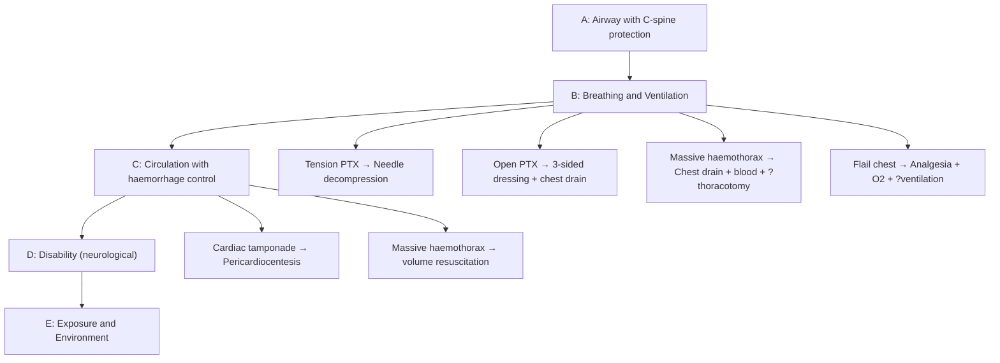

# Chest Injury

## 1. Definition

Chest injury (thoracic trauma) refers to any trauma to the chest wall, pleural space, lungs, tracheobronchial tree, heart, great vessels, oesophagus, or diaphragm resulting from external mechanical forces. It encompasses a spectrum from isolated rib fractures to immediately life-threatening conditions such as tension pneumothorax, massive haemothorax, and cardiac tamponade.

The word "thorax" comes from the Greek *thorax* = breastplate/chest. Trauma to this region is particularly dangerous because the thorax houses two critical organ systems — the respiratory system (gas exchange) and the cardiovascular system (circulation). Any disruption to either can be rapidly fatal.

> ***Chest trauma accounts for ~25% of all trauma deaths and is a contributing factor in another ~25%*** [1]. It is the second most common cause of trauma death after head injury.

<Callout title="Key Concept">
Most life-threatening chest injuries can be diagnosed clinically and managed with relatively simple procedures (e.g., chest decompression, chest drain). Only ~10-15% of chest injuries require formal thoracotomy. This is why the ATLS primary survey approach is so critical — you can save lives with a needle, a tube, and clinical acumen.
</Callout>

---

## 2. Epidemiology and Risk Factors

### Epidemiology

- **Global**: Trauma is the leading cause of death in people < 40 years old [2][3]. Road traffic accidents (RTAs) account for ~50% of trauma deaths, followed by homicides (~20%), suicides (~15%), falls (~10%), and burns (~5%) [3].
- **Hong Kong context**: RTAs remain the predominant mechanism. Hong Kong's dense urban environment, heavy traffic, and high-rise buildings contribute to both vehicular trauma and falls from height. Interpersonal violence (***gang fights with chopping/stabbing wounds***) is also a significant mechanism, particularly in certain districts [1].
- Chest injuries occur in ~50% of multiply-injured patients.
- ***Blunt chest trauma*** accounts for **>80%** of thoracic injuries in civilian settings (most commonly RTAs, falls). ***Penetrating chest trauma*** (stab wounds, gunshot wounds) is less common in Hong Kong compared to Western countries but still significant in the context of interpersonal violence [1].

### Risk Factors

| Risk Factor | Mechanism / Explanation |
|---|---|
| Young males (15-44 years) | Risk-taking behaviour, occupational exposure, interpersonal violence |
| RTAs (no seatbelt, high speed) | ***Deceleration injury*** → aortic shear at isthmus; steering wheel impact → sternal/rib fractures, cardiac contusion |
| Falls from height | Common in Hong Kong (high-rise buildings, construction); axial loading + lateral impact |
| Interpersonal violence | ***Stab wounds, chopping wounds*** — common in gang fights; penetrating mechanism [1] |
| Elderly / osteoporosis | Lower-energy mechanisms can cause rib fractures; reduced respiratory reserve → complications |
| Pre-existing lung disease (COPD, TB) | Less respiratory reserve → even minor injuries can precipitate respiratory failure |
| Alcohol / drug intoxication | Impaired protective reflexes, delayed presentation, aspiration risk |
| Occupational hazards | Construction workers (falls, crush injuries), industrial explosions (blast injury) |

---

## 3. Anatomy and Function — Why Chest Injury Matters

Understanding the anatomy is essential because the type and location of injury directly predicts the clinical consequences.

### 3.1 Chest Wall

- **Ribs**: 12 pairs. The 4th–10th ribs are most commonly fractured [3]. The upper ribs (1st–3rd) are protected by the scapula, clavicle, and thick muscles — fracture of these ribs implies ***high-energy trauma*** and should alert you to ***mediastinal/great vessel injury*** [3]. The lower ribs (10th–12th) overlie the spleen (left) and liver (right) — fractures here suggest ***intra-abdominal organ injury*** [3].
- **Sternum**: Sternal fractures suggest significant anterior force (e.g., steering wheel, seatbelt) and should prompt evaluation for ***myocardial contusion***.
- **Intercostal neurovascular bundle**: Runs along the inferior border of each rib (vein-artery-nerve, from top to bottom). This is why chest drains are inserted **just above** the rib to avoid the bundle, and why rib fractures can cause significant bleeding.
- **Muscles**: Intercostals (external, internal, innermost), diaphragm. The diaphragm is the primary muscle of respiration — rupture causes herniation of abdominal contents into the thorax.

### 3.2 Pleural Space

- A potential space between the visceral pleura (adherent to lung) and parietal pleura (lines chest wall). Normally contains only a thin film of serous fluid (~5-15 mL) for lubrication.
- **Why does air in the pleural space collapse the lung?** Because the lung has intrinsic elastic recoil pulling it inward, while the chest wall has elastic recoil pulling it outward. The negative intrapleural pressure (~-5 cmH₂O at rest) keeps the lung expanded. If air enters (pneumothorax), pressure equalises → lung collapses.
- **Why does tension pneumothorax cause shock?** A one-way valve mechanism allows air in but not out → progressive positive pressure → mediastinal shift → ***compression of the contralateral lung AND kinking of the great veins (SVC/IVC) → decreased venous return → obstructive shock*** [4][5].

### 3.3 Lungs

- Right lung: 3 lobes; Left lung: 2 lobes (cardiac notch).
- Lung parenchyma is highly vascular — contusion causes bleeding into airways → ***appears as consolidation on CXR*** [3].
- The tracheobronchial tree can rupture with severe deceleration or crush injury → pneumomediastinum, persistent air leak.

### 3.4 Mediastinum

- **Anterior**: thymus, internal mammary vessels.
- **Middle**: heart, pericardium, great vessels (aorta, SVC, IVC, pulmonary arteries/veins), trachea, main bronchi, oesophagus, phrenic/vagus nerves.
- **Posterior**: descending aorta, oesophagus, thoracic duct, azygos vein, thoracic vertebral bodies.
- The **aortic isthmus** (junction of the mobile aortic arch and the fixed descending aorta, just distal to the left subclavian artery) is the most vulnerable point for ***deceleration injury*** — this is where 80-85% of traumatic aortic injuries occur [3]. Think of it like holding a rope at one end and whipping it — the point of fixation takes the maximum shear force.

### 3.5 Heart and Pericardium

- The pericardium is a fibrous sac containing 15-50 mL of fluid [6]. It is relatively non-distensible in the acute setting.
- **Why does a small pericardial effusion cause tamponade in trauma but not in chronic effusions?** Because in chronic effusions (e.g., malignancy), the pericardium stretches gradually and can accommodate up to 1-2L. In acute trauma, even 100-200 mL of blood can dramatically increase intrapericardial pressure → compress the chambers (especially the thin-walled right atrium/ventricle) → impair diastolic filling → decreased cardiac output → ***obstructive shock (Beck's triad: hypotension, distended neck veins, muffled heart sounds)*** [1].

### 3.6 Diaphragm

- A dome-shaped musculotendinous sheet separating the thorax from the abdomen.
- Rupture is more common on the **left** (because the liver provides a protective buttress on the right) [3].
- Rupture allows abdominal viscera (stomach, colon, spleen) to herniate into the thorax → ***compresses lung, may strangulate herniated viscera***.

### 3.7 Oesophagus

- Posterior mediastinal structure, ***has no serosa*** → inherently more susceptible to perforation and poor healing [7].
- Rupture → contamination of mediastinum with gastric contents and bacteria → ***mediastinitis*** (a surgical emergency with high mortality).

---

## 4. Etiology (Mechanisms of Injury)

> ***The mechanism of injury determines the pattern of injuries you expect — always elicit a detailed mechanism in the history*** [1][2].

### 4.1 Classification of Mechanisms

***Classification of injuries*** [1]:

| Mechanism | Description | Common Chest Injuries |
|---|---|---|
| ***Blunt injury*** | Impact without penetration of body surface (RTAs, falls, assaults, crush) | Rib fractures, flail chest, pulmonary contusion, pneumothorax, haemothorax, cardiac contusion, aortic injury, diaphragmatic rupture, tracheobronchial injury |
| ***Penetrating injury*** | Object breaches body surface (***stab wounds, chopping wounds, gunshot wounds***) [1] | Open pneumothorax, haemothorax, cardiac tamponade, vascular injury, oesophageal perforation |
| ***Blast injury*** | Explosion generating a pressure wave | Primary: barotrauma (blast lung, tympanic membrane rupture); Secondary: penetrating fragments; Tertiary: blunt from being thrown; Quaternary: burns, inhalation |
| ***Iatrogenic*** | Medical procedures | CVC insertion → pneumothorax; OGD → oesophageal perforation; mechanical ventilation → barotrauma |

### 4.2 Blunt Chest Trauma — Pathophysiology by Mechanism

***Blunt injury*** is the most common mechanism in Hong Kong [1][2].

1. **Direct impact (compression)**: The chest wall is compressed between the impacting force and the spine/posterior chest wall. This directly fractures ribs, compresses the heart (cardiac contusion), and can rupture the lung parenchyma (contusion). *Example: steering wheel impact, fall onto chest.*

2. **Deceleration (shearing)**: When the body rapidly decelerates (e.g., high-speed RTA, fall from height), structures of different densities or those tethered at different points experience shear forces at their points of attachment. This is the mechanism behind:
   - ***Aortic injury at the isthmus***: The relatively mobile aortic arch shears against the fixed descending aorta [3].
   - Tracheobronchial injury at the carina.
   - Mesenteric tears (abdominal).

3. **Blast/overpressure**: A pressure wave travels through tissues. Air-containing organs (lungs, bowel, middle ear) are most susceptible because of the air-tissue interface. The pressure wave causes disruption at these interfaces → ***blast lung*** (haemorrhagic alveolitis, pulmonary contusion).

### 4.3 Penetrating Chest Trauma — Pathophysiology

***Penetrating injury*** [1]:

- ***Stab wounds***: Low-velocity, localised damage along the tract of the weapon. The injury is predictable based on the weapon trajectory and depth of penetration. ***In gang fights, chopping and stabbing wounds are common*** [1].
- ***Gunshot wounds***: Higher velocity → greater energy transfer → more tissue destruction. The injury zone extends beyond the wound tract (cavitation effect). The path may be unpredictable (bullet tumbling, fragmentation, ricocheting off bone).

<Callout title="Clinical Pearl - Penetrating Chest Trauma" type="idea">
***Any penetrating wound between the nipples anteriorly, the scapula tips posteriorly, and the clavicles superiorly should be assumed to involve the heart, great vessels, or mediastinum until proven otherwise*** [1]. This is the "cardiac box" or "zone of danger."
</Callout>

### 4.4 Hong Kong-Specific Considerations

- **RTAs**: The most common mechanism. ***A bus hit a train*** scenario represents a ***mass casualty incident (MCI) / disaster*** [2], requiring triage and disaster management protocols.
- **Falls from height**: Very common due to construction and high-rise buildings. Vertical deceleration → bilateral calcaneal fractures, spinal fractures, and thoracic/abdominal injuries.
- ***Gang fights***: ***Chopped and stabbed wounds*** are a recognised pattern of interpersonal violence in Hong Kong [1]. These present with ***nerve and vascular injuries*** as well as chest/abdominal penetration.
- **Burns/scalds**: ***Scalds*** can affect the chest wall and airway [8]. Circumferential chest burns can cause a restrictive physiology requiring ***escharotomy***.
- **Industrial/construction injuries**: Crush injuries, falls from scaffolding.

---

## 5. Classification of Chest Injuries

### 5.1 By Timing of Life-Threat (ATLS Classification)

This is the most clinically useful classification. The ATLS approach divides chest injuries into those identified during the **primary survey** (immediately life-threatening) and those identified during the **secondary survey** (potentially life-threatening).

#### ***Immediately Life-Threatening (Primary Survey — "ATOM-FC")***

These **6 conditions** must be identified and treated during the primary survey. They will kill the patient within minutes if not addressed.

| Condition | Mnemonic Letter | Key Feature |
|---|---|---|
| ***Airway obstruction*** | A | Stridor, inability to ventilate |
| ***Tension pneumothorax*** | T | Obstructive shock + absent breath sounds + tracheal deviation |
| ***Open pneumothorax*** ("sucking chest wound") | O | Wound > 2/3 tracheal diameter → air preferentially enters through wound |
| ***Massive haemothorax*** | M | > 1500 mL blood in pleural space → hypovolaemic shock |
| ***Flail chest*** with pulmonary contusion | F | Paradoxical chest wall movement; the underlying contusion causes the real problem |
| ***Cardiac tamponade*** | C | Beck's triad (hypotension, JVD, muffled heart sounds) |

<Callout title="Exam Tip" type="error">
Students often think flail chest itself causes respiratory failure. Actually, it's the ***underlying pulmonary contusion*** that is the primary cause of hypoxaemia. The paradoxical movement of the flail segment causes pain (which splints breathing) and mechanical disadvantage, but the contusion is what kills. This is why treatment focuses on analgesia + ventilatory support rather than surgical fixation of the flail segment (in most cases).
</Callout>

#### ***Potentially Life-Threatening (Secondary Survey — "ATOMICS")***

These are identified during the secondary survey. They may not be immediately obvious but can deteriorate.

| Condition | Notes |
|---|---|
| ***Aortic injury*** (ATAI) | Deceleration mechanism; widened mediastinum on CXR |
| ***Tracheobronchial injury*** | Persistent air leak despite chest drain; pneumomediastinum |
| ***Oesophageal injury*** | Left pneumothorax/hydrothorax without rib fractures; Hamman's sign |
| ***Myocardial contusion*** | Blunt anterior chest trauma; arrhythmias; ECG changes |
| ***Pulmonary contusion*** (without flail) | Appears as consolidation on CXR; worsens over 24-48h |
| ***Diaphragmatic rupture*** | Herniation of abdominal viscera; more common on left [3] |
| ***Simple pneumothorax / haemothorax*** | Not immediately life-threatening but needs monitoring/drainage |

### 5.2 By Anatomical Structure

| Structure | Injuries |
|---|---|
| **Chest wall** | Rib fractures, flail chest, sternal fracture, clavicle fracture, scapula fracture |
| **Pleural space** | Pneumothorax (simple, tension, open), haemothorax, haemopneumothorax |
| **Lung parenchyma** | Pulmonary contusion, pulmonary laceration/traumatic lung cyst |
| **Tracheobronchial tree** | Tracheal rupture, bronchial rupture |
| **Heart/pericardium** | Cardiac tamponade, myocardial contusion, commotio cordis, cardiac rupture |
| **Great vessels** | ***Acute traumatic aortic injury (ATAI)***, subclavian/carotid injury, pulmonary vessel injury |
| **Oesophagus** | Perforation (penetrating injury, Boerhaave's) |
| **Diaphragm** | Rupture (blunt > penetrating, left > right) |
| **Thoracic spine** | Fracture-dislocation (associated with spinal cord injury) |

---

## 6. Pathophysiology of Key Chest Injuries

### 6.1 Pneumothorax

"Pneumo" (Greek: *pneuma* = air) + "thorax" (Greek: chest). Air in the chest cavity.

#### Simple (Closed) Pneumothorax
- Air enters the pleural space via a breach in the visceral pleura (lung parenchyma injury) or parietal pleura (chest wall injury).
- The communication seals → no further air entry → intrapleural pressure is negative but less negative than normal → partial lung collapse.
- ***If < 15% lung volume and asymptomatic → may observe with O₂ therapy (promotes reabsorption of nitrogen; O₂ is absorbed 4× faster than N₂)*** [4].

#### ***Tension Pneumothorax***
> ***This is a CLINICAL diagnosis. Do NOT wait for CXR. Treat immediately*** [4][5].

- **Pathophysiology**: A ***one-way valve mechanism*** allows air to enter the pleural space during inspiration but prevents it from escaping during expiration → progressive accumulation → ***positive intrapleural pressure → mediastinal shift → compression of contralateral lung (worsening hypoxia) + kinking of IVC/SVC → decreased venous return → obstructive shock*** [4][5].
- **Causes**: ***Penetrating chest trauma, rib fracture with lung laceration, positive pressure ventilation (barotrauma), failed/blocked chest drain*** [1].
- **Clinical features**: ***Severe respiratory distress, tachycardia, hypotension, distended neck veins (due to impaired venous return), tracheal deviation AWAY from affected side, absent breath sounds + hyperresonance on affected side*** [4].
- **V/Q mismatch**: The collapsed lung has no ventilation but still receives some blood flow (shunt); the contralateral compressed lung also has impaired ventilation → profound hypoxaemia.

#### Open Pneumothorax ("Sucking Chest Wound")
- A defect in the chest wall that remains open → ***air preferentially enters through the wound if the defect is > 2/3 the diameter of the trachea*** (path of least resistance, since resistance is proportional to 1/radius⁴ by Poiseuille's law).
- Result: equilibration of intrapleural and atmospheric pressure → lung collapse → ***pendulum respiration*** (mediastinal swing).
- ***Management: three-sided occlusive dressing (allows air out during expiration but seals during inspiration) followed by definitive closure and chest drain*** [1].

### 6.2 Haemothorax

"Haemo" (Greek: *haima* = blood) + "thorax."

- Blood accumulates in the pleural space from injured ***intercostal vessels, internal mammary vessels, lung parenchyma, or great vessels***.
- **Why does haemothorax cause shock?** Two mechanisms:
  1. **Hypovolaemic shock**: Each hemithorax can hold 2-3L of blood. ***Massive haemothorax*** is defined as ***> 1500 mL of blood immediately drained on chest tube insertion, or > 200 mL/hour for 2-4 consecutive hours*** → indication for ***thoracotomy*** [1].
  2. **Compression of lung**: Blood occupies space → atelectasis → V/Q mismatch → hypoxaemia.

### 6.3 Flail Chest

- **Definition**: ***≥ 3 consecutive ribs fractured in ≥ 2 places*** (or ≥ 2 ribs fractured with bilateral costochondral separations) → a free-floating segment of chest wall.
- **Paradoxical movement**: During inspiration, the negative intrapleural pressure draws the flail segment INWARD (instead of outward with the rest of the chest wall). During expiration, the segment moves OUTWARD.
- **Why does this cause respiratory failure?**
  1. **Underlying pulmonary contusion** (the real killer) — direct lung parenchymal damage → haemorrhage and oedema into alveoli → intrapulmonary shunt → hypoxaemia.
  2. **Pain** → splinting → hypoventilation → atelectasis → infection.
  3. **Mechanical disadvantage** → reduced tidal volume.
- ***Treatment priority: analgesia (epidural/paravertebral block), oxygen, positive pressure ventilation if needed. Internal pneumatic splinting with positive pressure ventilation is the definitive management if mechanical ventilation is required*** [1].

### 6.4 Cardiac Tamponade

- **Mechanism**: Blood accumulates in the pericardial sac (most commonly from penetrating injury to the heart, especially the right ventricle — the most anterior chamber).
- **Pathophysiology**: The fibrous pericardium is non-distensible in the acute setting → even small volumes (100-200 mL) → ↑intrapericardial pressure → ***compression of cardiac chambers (especially thin-walled RA and RV in diastole) → impaired diastolic filling → ↓stroke volume → ↓cardiac output → obstructive shock*** [1][5].
- **Compensatory mechanisms**: Initially, sympathetic activation → tachycardia + vasoconstriction to maintain BP. This is why the patient may look "stable" initially before sudden decompensation.
- ***Beck's triad: hypotension, distended neck veins, muffled heart sounds*** [1].
- ***Pulsus paradoxus***: Exaggerated drop in systolic BP > 10 mmHg during inspiration. Mechanism: during inspiration, increased venous return to the right heart → RV distension → the interventricular septum bulges into the LV (because total cardiac volume is fixed by the non-distensible pericardium) → reduced LV filling → ↓stroke volume → ↓systolic BP.
- ***Kussmaul's sign***: Paradoxical rise in JVP on inspiration (because the RV cannot accommodate the increased venous return).
- ***Electrical alternans on ECG***: Alternating amplitude of QRS complexes due to the heart "swinging" in the pericardial fluid.

### 6.5 Acute Traumatic Aortic Injury (ATAI)

- ***Mechanism: high-speed deceleration (RTA, fall from height)*** [3].
- ***Site: aortic isthmus (80-85%)*** — where the mobile aortic arch meets the fixed descending aorta (tethered by the ligamentum arteriosum and intercostal arteries) [3].
- ***Lethality: 80-90% die at the scene. Of those reaching hospital, 30% die within 6h, 50% within 24h, 90% within 4 months if untreated*** [3].
- **Pathophysiology**: Shear force → intimal tear ± medial disruption → contained rupture (if the adventitia holds) → pseudoaneurysm. If the adventitia ruptures → free rupture → exsanguination.
- ***CXR clues: widened mediastinum ( > 8 cm), abnormal aortic contour/loss of aortic knuckle, thickened paratracheal stripe, deviation of trachea/NG tube to right, left apical pleural cap, depression of left main bronchus*** [3].
- **CT aortogram** is the definitive investigation (fast, high sensitivity) [3].

### 6.6 Pulmonary Contusion

- **Definition**: Bruising of lung parenchyma → ***haemorrhage and oedema into the alveoli and interstitium***.
- **Pathophysiology**: Direct impact → disruption of alveolocapillary membrane → blood and plasma leak into alveoli → consolidation + intrapulmonary shunt → hypoxaemia. ***Worsens over 24-48 hours*** as the inflammatory response peaks (similar to ARDS pathophysiology — diffuse alveolar damage) [3][9].
- ***CXR: consolidation that does NOT respect lobar boundaries (unlike pneumonia). Appears within 6 hours of injury*** [3].
- ***CT is more sensitive than CXR*** for detecting early/subtle contusion.
- Key difference from ARDS: pulmonary contusion is localised to the area of impact (though severe bilateral contusion can progress to ARDS).

### 6.7 Diaphragmatic Rupture

- ***Left side > right side*** (liver protects the right hemidiaphragm) [3].
- **Mechanism**: Blunt abdominal/thoracic trauma → sudden increase in intra-abdominal pressure against a fixed diaphragm.
- **Pathophysiology**: Defect in diaphragm → pressure gradient between abdomen (positive) and thorax (negative) → progressive herniation of abdominal viscera (stomach, colon, spleen, omentum) into the thorax.
- ***Presentation is often insidious*** — the initial defect may be small, and organs herniate gradually over days to weeks [3].
- ***Risk: strangulation of herniated viscera*** (a surgical emergency) [3].
- **CXR clues**: Elevated hemidiaphragm, gas-filled viscus in thorax (gastric bubble), nasogastric tube coiled in thorax [3].

### 6.8 Tracheobronchial Injury

- **Mechanism**: Severe deceleration, crush injury, penetrating trauma.
- ***80% occur within 2.5 cm of the carina***.
- **Pathophysiology**: Airway rupture → massive air leak → ***pneumomediastinum, subcutaneous emphysema, persistent pneumothorax despite chest drain*** (the air leak cannot be controlled because air is continuously escaping from the ruptured airway).
- ***CXR: pneumomediastinum signs*** — ring around artery sign, continuous diaphragm sign, Naclerio's V sign, subcutaneous emphysema [3].
- **Fallen lung sign**: The collapsed lung falls peripherally/dependently (away from the hilum) rather than toward the hilum, because the bronchus is disrupted → the lung is no longer tethered to the mediastinum.

### 6.9 Oesophageal Injury

- **Penetrating trauma** or ***Boerhaave's syndrome*** (spontaneous rupture from forceful vomiting) [7].
- ***The oesophagus has no serosa*** → poor healing, rapid contamination of mediastinum [7].
- **Pathophysiology**: Perforation → leakage of gastric contents and saliva into mediastinum → ***chemical mediastinitis → bacterial mediastinitis → sepsis*** (mortality 20-40% even with treatment; approaches 100% if untreated for > 24h).
- ***Mackler's triad: vomiting, excruciating chest pain, subcutaneous emphysema*** [7].
- ***Hamman's sign: mediastinal crunching/clicking sound synchronous with heartbeat*** (due to mediastinal emphysema) [7].

### 6.10 Myocardial Contusion (Blunt Cardiac Injury)

- **Mechanism**: Direct sternal impact (steering wheel, fall onto anterior chest).
- **Pathophysiology**: Bruising of myocardium → myocardial oedema + haemorrhage → cellular dysfunction → ***arrhythmias*** (most dangerous consequence) and reduced contractility.
- The **right ventricle** is most commonly affected (most anterior chamber).
- **Clinical features**: May be asymptomatic. Chest pain (similar to pericarditis). Arrhythmias (sinus tachycardia, atrial fibrillation, premature ventricular contractions, ventricular tachycardia). Rarely → cardiogenic shock if severe contusion.
- **ECG**: ST-T changes, new RBBB, arrhythmias.
- **Troponin**: May be elevated (but non-specific in polytrauma).
- ***Echo***: Wall motion abnormalities, pericardial effusion.

---

## 7. Clinical Features

### 7.1 Symptoms

| Symptom | Pathophysiological Basis |
|---|---|
| **Chest pain** | Rib fractures (somatic pain from periosteum), pleural irritation (pleuritic — sharp, worse with inspiration), myocardial/pericardial involvement (visceral pain — heavy, central), chest wall muscle/soft tissue injury |
| **Dyspnoea / shortness of breath** | Pneumothorax (lung collapse → ↓ventilation), haemothorax (compression atelectasis + hypovolaemia), flail chest (mechanical disadvantage + contusion), pulmonary contusion (intrapulmonary shunt), pain-induced splinting (→ hypoventilation) |
| **Haemoptysis** | Pulmonary contusion (bleeding into airways), tracheobronchial injury (direct airway damage), lung laceration |
| **Dysphagia / odynophagia** | Oesophageal injury (mucosal disruption → pain on swallowing), cervical spine/soft tissue injury (local swelling compressing oesophagus) |
| **Sensation of "air under skin"** | Subcutaneous emphysema from pneumomediastinum, open chest wound, tracheobronchial injury |
| **Palpitations / syncope** | Myocardial contusion (arrhythmias), cardiac tamponade (↓CO), massive blood loss (hypovolaemia → presyncope/syncope) |
| **Abdominal pain** | Lower rib fractures with underlying hepatic/splenic injury; diaphragmatic injury |
| **Referred shoulder pain** (Kehr's sign) | Diaphragmatic injury/irritation → referred pain via phrenic nerve (C3-C5: "C3, 4, 5 keeps the diaphragm alive") |

### 7.2 Signs

#### General / Systemic Signs

| Sign | Pathophysiological Basis |
|---|---|
| ***Tachycardia*** | Sympathetic response to pain, hypoxaemia, hypovolaemia. Often the ***earliest sign of shock*** — the heart beats faster to compensate for reduced stroke volume (CO = HR × SV) |
| ***Hypotension*** | Late sign of hypovolaemia (in young adults, BP may be maintained until ~30% blood volume is lost due to sympathetic compensation); also in obstructive shock (tamponade, tension PTX) |
| ***Tachypnoea*** | Hypoxaemia → peripheral chemoreceptors (carotid body) → increased respiratory drive; pain → shallow rapid breaths; metabolic acidosis from shock → compensatory hyperventilation |
| ***Central cyanosis*** | Desaturation of Hb when > 5 g/dL of deoxygenated Hb present → blue discolouration of tongue and lips. Caused by hypoxaemia from any mechanism (shunt, V/Q mismatch, hypoventilation). Late sign — indicates severe hypoxaemia (SpO₂ typically < 85%) |
| ***Altered consciousness*** | Cerebral hypoperfusion (shock) or hypoxaemia → decreased O₂ delivery to brain. Also consider concurrent head injury in polytrauma |
| ***Cold, clammy extremities*** | Sympathetic vasoconstriction → preferential blood flow to vital organs (heart, brain) at the expense of skin and periphery. Sign of compensated shock |
| **Distended neck veins (elevated JVP)** | ***Obstructive shock*** — tamponade or tension PTX. Venous blood cannot return to the right heart → venous congestion → JVD. ***Not seen in hypovolaemic shock*** (veins are flat due to low circulating volume) |

<Callout title="Important Distinction" type="error">
***Distended neck veins + hypotension + chest trauma = think obstructive shock (tamponade or tension PTX). Flat neck veins + hypotension + chest trauma = think hypovolaemic shock (massive haemothorax, splenic/hepatic injury).*** This single observation can help you differentiate the two at the bedside.
</Callout>

#### Chest Wall Signs

| Sign | Pathophysiological Basis |
|---|---|
| **Visible wound / bruising** | Direct evidence of mechanism (penetrating wound, seatbelt mark → think aortic injury, sternal fracture) |
| **Chest wall tenderness / crepitus over ribs** | Rib fracture — bony crepitus from fractured ends grating against each other. Tenderness from periosteal irritation |
| ***Paradoxical chest wall movement*** | Flail segment moves INWARD on inspiration, OUTWARD on expiration — because the flail segment is no longer mechanically coupled to the intact rib cage and moves in response to pleural pressure changes rather than chest wall muscular action |
| ***Subcutaneous emphysema*** ("bubble-wrap" / "Rice Krispie" sensation on palpation) [3] | Air tracking into subcutaneous tissues from: pneumothorax extending into chest wall, pneumomediastinum, tracheobronchial rupture, open pneumothorax |
| ***Sucking wound*** | Open pneumothorax — audible air entry/exit through the wound during respiration |
| ***Splinting*** | Patient voluntarily restricts chest wall movement on the injured side to reduce pain (rib fractures). This leads to hypoventilation → atelectasis → secondary pneumonia |

#### Percussion and Auscultation Signs

| Sign | Condition | Pathophysiological Basis |
|---|---|---|
| ***Hyperresonance to percussion*** | Pneumothorax | Air in pleural space increases resonance (like tapping an empty drum) |
| ***Dullness (stony dull) to percussion*** | Haemothorax | Blood (fluid) in pleural space dampens percussion (like tapping a full drum) |
| ***Absent / decreased breath sounds*** | Pneumothorax or haemothorax | Air or blood in pleural space → lung collapse → no air movement → no breath sounds. Can also occur with massive pulmonary contusion |
| ***Tracheal deviation (away from affected side)*** | Tension PTX, massive haemothorax | Positive pressure or volume in one hemithorax pushes the mediastinum to the opposite side |
| ***Tracheal deviation (towards affected side)*** | Massive atelectasis / lung collapse | Loss of lung volume on affected side → negative pressure "pulls" mediastinum toward it |
| ***Muffled / distant heart sounds*** | Cardiac tamponade | Fluid around the heart attenuates sound transmission |
| ***Pericardial friction rub*** | Traumatic pericarditis | Inflamed pericardial surfaces rub against each other — high-pitched scratching sound [6] |
| ***Hamman's sign (mediastinal crunch)*** | Pneumomediastinum | Air in mediastinum produces crackling/crunching sounds synchronous with heartbeat [7] |
| ***Bowel sounds in chest*** | Diaphragmatic rupture with herniation | Bowel has herniated through the ruptured diaphragm into the thorax [3] |

#### Specific Constellation Signs

| Sign Cluster | Diagnosis | Explanation |
|---|---|---|
| ***Beck's triad: hypotension + JVD + muffled heart sounds*** | Cardiac tamponade | ↓CO (hypotension), impaired venous return (JVD), fluid around heart (muffled sounds) |
| ***Pulsus paradoxus ( > 10 mmHg SBP drop in inspiration)*** | Cardiac tamponade | Fixed pericardial volume → septal shift during inspiration → ↓LV filling → ↓SBP |
| ***Kussmaul's sign (JVP rises on inspiration)*** | Cardiac tamponade / constrictive pericarditis | RV cannot accommodate ↑venous return during inspiration |
| ***Electrical alternans on ECG*** | Large pericardial effusion | Heart "swings" in fluid → alternating QRS axis |
| ***Mackler's triad: vomiting + chest pain + subcutaneous emphysema*** | Oesophageal rupture (Boerhaave's) | Forceful vomiting → full-thickness rupture → mediastinal air [7] |
| ***Widened mediastinum + loss of aortic knuckle on CXR*** | Aortic injury (ATAI) | Mediastinal haematoma from contained aortic rupture [3] |

---

## 8. Special Populations and Considerations

### 8.1 Elderly Patients
- **Reduced physiological reserve**: Pre-existing cardiopulmonary disease, medications (beta-blockers may mask tachycardia, anticoagulants increase bleeding risk).
- **Osteoporotic ribs**: Fracture with lower energy → higher morbidity per rib fractured.
- ***Each additional rib fracture in elderly patients increases pneumonia risk by ~27% and mortality by ~19%*** [literature].
- **Blunted sympathetic response**: Tachycardia may be absent → "look-well" patient who is actually in compensated shock.

### 8.2 Paediatric Patients
- **Compliant chest wall**: Children have very flexible ribs → ***significant internal organ injury can occur WITHOUT rib fractures***. If a child has rib fractures, suspect very high-energy mechanism (or NAI — non-accidental injury).
- **Higher metabolic rate**: Decompensate more quickly.
- **Small blood volume**: Relatively smaller absolute volume → smaller blood loss is proportionally more significant.

### 8.3 Pregnant Patients
- **Physiological changes**: ↑blood volume (by ~40%), ↑heart rate, ↓BP (physiological) → may mask haemorrhage.
- **Elevated diaphragm**: Chest drain insertion should be 1-2 intercostal spaces higher than usual.
- **Supine hypotension**: Gravid uterus compresses IVC → always tilt to left lateral position (or manual left uterine displacement) in supine patients.

---

## 9. Initial Clinical Approach (ATLS Framework)

> ***The approach to chest trauma follows ATLS principles: primary survey (ABCDE) with simultaneous resuscitation → adjuncts (CXR, FAST) → secondary survey → definitive care*** [1][2].

### Primary Survey: Identify and Treat Immediately Life-Threatening Injuries

### Secondary Survey: Identify Potentially Life-Threatening Injuries

- ***Full head-to-toe examination including log roll*** [2].
- ***Trauma series***: AP CXR, AP pelvis XR. (Lateral C-spine XR largely replaced by CT in modern practice but still relevant in resource-limited settings.) [2][3]
- ***FAST scan***: To detect pericardial effusion and intra-abdominal free fluid [2][3][10].

> ***FAST scan assesses 4 windows: subxiphoid (pericardial), right upper quadrant/Morison's pouch (hepatorenal), left upper quadrant (splenorenal), pelvis (pouch of Douglas). ± Extended FAST (eFAST) includes bilateral thoracic views for pneumothorax and haemothorax*** [3][10].

- **CT whole body** ("trauma CT"): Gold standard for stable patients to fully evaluate all injuries [2][3].
  - ***Arterial phase: for bleeding points and pseudoaneurysms***
  - ***Portovenous phase (most important): visceral injury***
  - ***Delayed phase: urinary extravasation***
  - ***Lung and bone windows*** [10]

<Callout title="Critical Decision Point" type="idea">
***Unstable patient with chest trauma → DO NOT send to CT. Perform bedside interventions (needle decompression, chest drain, pericardiocentesis, resuscitative thoracotomy) and FAST scan. CT is only for the haemodynamically stable or stabilised patient*** [1][2].
</Callout>

---

## 10. Summary of Pathophysiology by Injury Type

| Injury | Mechanism → Pathophysiology → Clinical Consequence |
|---|---|
| ***Tension PTX*** | Valve mechanism → ↑intrapleural pressure → mediastinal shift → ↓venous return → ***obstructive shock*** |
| ***Open PTX*** | Chest wall defect > 2/3 trachea → equalised pressures → lung collapse → ***respiratory failure*** |
| ***Massive haemothorax*** | Vascular injury → blood in pleural space → ***hypovolaemia + lung compression*** |
| ***Flail chest*** | Multiple rib fractures → paradoxical movement → pain + ***underlying contusion → shunt → hypoxaemia*** |
| ***Cardiac tamponade*** | Blood in pericardium → ↑intrapericardial pressure → ↓diastolic filling → ***obstructive shock*** |
| ***ATAI*** | Deceleration shear → intimal tear at isthmus → ***contained rupture (if adventitia intact) or free rupture → exsanguination*** |
| ***Pulmonary contusion*** | Direct impact → alveolocapillary damage → haemorrhage/oedema → ***intrapulmonary shunt → hypoxaemia*** |
| ***Diaphragmatic rupture*** | ↑abdominal pressure → diaphragm tear → visceral herniation → ***lung compression ± visceral strangulation*** |
| ***Tracheobronchial injury*** | Direct disruption → massive air leak → ***persistent PTX despite drainage*** |
| ***Oesophageal rupture*** | Full-thickness tear → mediastinal contamination → ***mediastinitis → sepsis*** |

---

<Callout title="High Yield Summary">

**Definition**: Chest injury = trauma to chest wall, pleural space, lungs, airways, heart, great vessels, oesophagus, or diaphragm.

**Epidemiology**: Trauma = #1 killer < 40 years. Chest injuries in ~25% of trauma deaths. Blunt > penetrating in Hong Kong. RTAs most common mechanism.

**Immediately life-threatening (ATOM-FC)**: Airway obstruction, Tension PTX, Open PTX, Massive haemothorax, Flail chest (with pulmonary contusion), Cardiac tamponade.

**Potentially life-threatening**: Aortic injury, Tracheobronchial injury, Oesophageal injury, Myocardial contusion, Pulmonary contusion, Diaphragmatic rupture, Simple PTX/haemothorax.

**Key pathophysiology concepts**:
- Tension PTX: valve → ↑pressure → ↓VR → obstructive shock (clinical diagnosis, treat immediately)
- Tamponade: non-distensible pericardium → ↓diastolic filling → ↓CO (Beck's triad)
- ATAI: deceleration shear at aortic isthmus → 80-90% die at scene → widened mediastinum on CXR
- Pulmonary contusion: alveolocapillary damage → shunt → hypoxaemia (worsens over 24-48h)
- Flail chest: underlying contusion is the real killer, not the paradoxical movement
- Oesophageal rupture: no serosa → rapid mediastinitis (Mackler's triad)

**Approach**: ATLS primary survey (ABCDE) with simultaneous resuscitation → adjuncts (CXR, eFAST) → secondary survey → CT (if stable) → definitive care.

**Rib fracture associations**: Upper ribs (1st-2nd) → great vessel/mediastinal injury. Lower ribs (10th-12th) → hepatic/splenic injury. 4th-10th → most commonly fractured.

</Callout>

---

<ActiveRecallQuiz
  title="Active Recall - Chest Injury"
  items={[
    {
      question: "Name the 6 immediately life-threatening chest injuries identified in the primary survey (mnemonic ATOM-FC).",
      markscheme: "Airway obstruction, Tension pneumothorax, Open pneumothorax, Massive haemothorax, Flail chest with pulmonary contusion, Cardiac tamponade."
    },
    {
      question: "Explain the pathophysiology of tension pneumothorax leading to obstructive shock.",
      markscheme: "One-way valve mechanism allows air entry into pleural space but not exit. Progressive positive intrapleural pressure causes mediastinal shift, compresses contralateral lung (worsening hypoxia), and kinks IVC/SVC reducing venous return and cardiac output, leading to obstructive shock."
    },
    {
      question: "Why does acute traumatic aortic injury most commonly occur at the aortic isthmus?",
      markscheme: "The aortic isthmus is the junction between the mobile aortic arch and the fixed descending aorta (tethered by ligamentum arteriosum and intercostal arteries). During high-speed deceleration, maximum shear force occurs at this transition point."
    },
    {
      question: "A trauma patient has hypotension, distended neck veins, and muffled heart sounds. What is the diagnosis and underlying pathophysiology?",
      markscheme: "Cardiac tamponade (Beck's triad). Blood accumulates in non-distensible pericardium, increasing intrapericardial pressure, compressing cardiac chambers (especially RA/RV), impairing diastolic filling, reducing stroke volume and cardiac output."
    },
    {
      question: "Why is the underlying pulmonary contusion, rather than the paradoxical chest wall movement, the main cause of hypoxaemia in flail chest?",
      markscheme: "Pulmonary contusion causes disruption of the alveolocapillary membrane leading to haemorrhage and oedema in alveoli, creating intrapulmonary shunt (perfusion without ventilation). The paradoxical movement mainly causes pain and mechanical disadvantage but does not directly cause significant gas exchange impairment."
    },
    {
      question: "What are the CXR signs suggesting acute traumatic aortic injury?",
      markscheme: "Widened mediastinum (>8cm), abnormal aortic contour/loss of aortic knuckle, thickened paratracheal stripe, tracheal/NG tube deviation to right, left apical pleural cap, depression of left main bronchus, left haemothorax."
    }
  ]}
/>

## References

[1] Lecture slides: GC 182. Chopped and stabbed wound in gang fight Nerves and vascular injury; Classification of injuries.pdf
[2] Lecture slides: GC 175. A bus hit a train Multiple trauma; Disaster management.pdf
[3] Senior notes: Ryan Ho Radiology.pdf (Chapter 1: Radiology in Trauma)
[4] Senior notes: Maksim Medicine Notes.pdf (p291, Pneumothorax)
[5] Senior notes: Ryan Ho Respiratory.pdf (p151-152, Pneumothorax)
[6] Senior notes: Ryan Ho Cardiology.pdf (p172, Diseases of Pericardium)
[7] Senior notes: Maksim Surgery Notes.pdf (p58-59, Esophageal perforation / Boerhaave's)
[8] Lecture slides: GC 190. I have a scald Burn.pdf
[9] Senior notes: Ryan Ho Respiratory.pdf (p37, ARDS pathophysiology)
[10] Senior notes: Maksim Surgery Notes.pdf (p42, Trauma / FAST scan)
