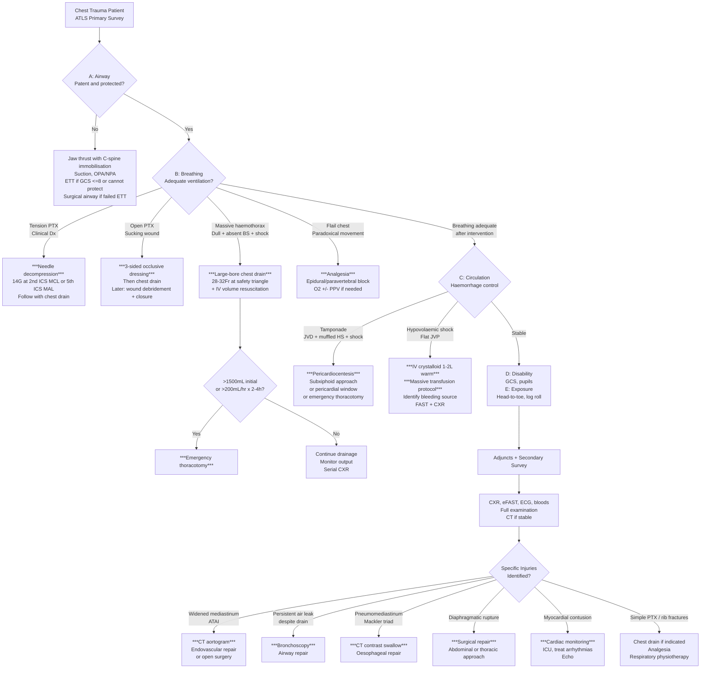

## Management of Chest Injury

### 1. Overarching Management Principles

Management of chest injury follows a **layered, systematic approach** rooted in ATLS principles. The beauty of chest trauma management is that ***the majority of life-threatening chest injuries (~85-90%) can be managed with simple interventions — oxygen, needle decompression, chest drain, and volume resuscitation. Only 10-15% require formal thoracotomy*** [1][10].

The management framework can be conceptualised in three phases:

1. **Immediate resuscitation** (primary survey) — simultaneous assessment and treatment of immediately life-threatening injuries
2. **Stabilisation and definitive diagnosis** (secondary survey + investigations) — once the patient is no longer dying
3. **Definitive management** — injury-specific treatment, which may be non-operative or operative

> ***The key philosophical principle: "Treat first, investigate later" in the unstable patient. Resuscitation takes priority over diagnosis*** [2][10].

---

### 2. Master Management Algorithm

---

### 3. Management by Phase

#### 3.1 Phase 1: Immediate Resuscitation (Primary Survey — ABCDE)

> ***Patients are assessed and treatment priorities established based on their injuries, vital signs, and injury mechanisms. ABCDEs of trauma care: A — Airway and C-spine protection, B — Breathing and ventilation, C — Circulation with haemorrhage control, D — Disability/Neurologic status, E — Exposure/Environmental control*** [2].

##### A: Airway with C-Spine Protection

| Intervention | Indication | Technique | Why |
|---|---|---|---|
| ***Jaw thrust*** | First-line airway opening in trauma | Lift mandible anteriorly without extending the neck | Displaces tongue from posterior pharynx. ***Preferred over head-tilt chin-lift in trauma because it does not move the C-spine*** [21] |
| ***Suction*** | Blood, secretions, vomit in airway | Rigid Yankauer suction | Clears airway of obstructing material |
| ***Oropharyngeal airway (OPA)*** | Unconscious patient needing BVM | Curved tube over tongue; size from incisor to angle of mandible | Prevents tongue from falling back. ***NEVER insert in a conscious patient (gag reflex → vomiting → aspiration)*** [21] |
| ***Nasopharyngeal airway (NPA)*** | Semi-conscious patient or trismus | Soft tube through nostril into nasopharynx | Tolerated by semi-conscious patients. C/I in suspected ***basal skull fracture*** (risk of intracranial placement) |
| ***Endotracheal intubation (ETT)*** | ***GCS ≤ 8***, unable to protect airway, need for ventilation | ***Gold standard for definitive airway*** [21]. Rapid sequence induction (RSI) with in-line C-spine stabilisation | Provides definitive airway protection + allows positive pressure ventilation |
| ***Surgical airway (cricothyroidotomy)*** | ***"Can't intubate, can't oxygenate" (CICO)*** scenario | Needle or surgical cricothyroidotomy through cricothyroid membrane | Emergency rescue airway. Tracheostomy is more definitive but takes longer and is done in a controlled setting |

<Callout title="C-Spine Protection" type="error">
***Every chest trauma patient should be assumed to have a cervical spine injury until proven otherwise***. Maintain ***manual in-line stabilisation (MILS)*** during all airway manoeuvres. A hard collar alone is insufficient — it restricts but does not eliminate movement. Log-roll for any repositioning [2].
</Callout>

##### B: Breathing and Ventilation — Management of Immediately Life-Threatening Injuries

###### 1. Tension Pneumothorax

| Step | Intervention | Details |
|---|---|---|
| **Immediate** | ***Needle decompression*** | ***14G angiocath inserted at 2nd ICS mid-clavicular line (MCL)*** [4] OR ***5th ICS mid-axillary line (MAL)*** — the latter is preferred in some guidelines due to thinner chest wall at this site. Listen for hissing sound → converts tension PTX to simple open PTX |
| **Follow-up** | ***Chest drain insertion*** | ***5th ICS, safety triangle*** (bounded by lateral border of pectoralis major, anterior border of latissimus dorsi, and a line at the level of the nipple). Use ***24Fr for air*** [4]. Connect to underwater seal |
| **Supportive** | ***High-flow O₂*** | 15L/min via non-rebreather mask. ***Promotes absorption of pleural air (O₂ is absorbed ~4× faster than N₂)*** [4] |

**Why 2nd ICS MCL for needle and 5th ICS for drain?** The 2nd ICS MCL is easy to find quickly in an emergency (midpoint of clavicle, 2 ribs down). It's a needle — you just need to decompress. The chest drain goes into the safety triangle (5th ICS) because this allows the drain to sit in a good position for continued drainage, and the triangle is safer (avoids the breast, internal mammary artery, and abdominal organs).

> ***O₂ therapy in pneumothorax: avoid HFNC and NIPPV (positive pressure may worsen PTX)*** [4]. ***CPAP is a relative contraindication*** [22].

###### 2. Open Pneumothorax

| Step | Intervention | Details |
|---|---|---|
| **Immediate** | ***Three-sided occlusive dressing*** | Tape an occlusive dressing (e.g., plastic film, Asherman chest seal) on three sides. ***During expiration***, the untaped edge opens → air escapes. ***During inspiration***, the dressing seals against the wound → prevents air entry. This converts an open PTX to a closed one and prevents progression to tension PTX |
| **Follow-up** | ***Chest drain*** (at a SEPARATE site) | Never put the chest drain through the wound (contamination risk). Insert at safety triangle |
| **Definitive** | ***Wound debridement and surgical closure*** | Once the patient is stabilised in the OR |

<Callout title="Why Not a Four-Sided Dressing?" type="error">
If you seal all four sides, you create a valve mechanism — air can enter the pleural space via the lung laceration during breathing but cannot escape through the sealed wound. This ***converts an open PTX into a tension PTX*** — making things much worse. The three-sided dressing is a one-way valve that allows air OUT but not IN.
</Callout>

###### 3. Massive Haemothorax

| Step | Intervention | Details |
|---|---|---|
| **Immediate** | ***Large-bore chest drain (28-32Fr)*** + ***IV volume resuscitation*** | Drain blood to re-expand lung + allow autotransfusion. Simultaneously replace circulating volume with ***warm crystalloid (NS or Hartmann's) 1-2L***, then ***blood products*** [10] |
| **Assess output** | Monitor drain volume | ***> 1500 mL initial drainage → thoracotomy*** [1]. ***> 200 mL/hr for 2-4 consecutive hours → thoracotomy*** |
| **Definitive** | ***Emergency thoracotomy*** if indicated | Identify and control the bleeding source (intercostal artery ligation, internal mammary artery repair, lung tractotomy, great vessel repair) |
| **Supportive** | ***Massive transfusion protocol (MTP)*** | 1:1:1 ratio of PRBC:FFP:platelets. Aim to correct the ***"lethal triad"*** (hypothermia, acidosis, coagulopathy). ***Tranexamic acid 1g IV loading within 3 hours of injury*** [23] |

**Why autotransfusion?** Blood collected from a fresh haemothorax can be returned to the patient through autotransfusion devices. This is the patient's own blood — no crossmatch needed, no transfusion reaction risk, and it's immediately available.

###### 4. Flail Chest with Pulmonary Contusion

| Step | Intervention | Details | Rationale |
|---|---|---|---|
| **Analgesia** | ***Epidural or paravertebral nerve block*** (gold standard) | Thoracic epidural with continuous infusion of local anaesthetic ± opioid. Alternative: intercostal nerve blocks, IV PCA with opioids | ***Pain is the biggest enemy*** — it causes splinting → hypoventilation → atelectasis → pneumonia → respiratory failure. Excellent regional analgesia breaks this cycle [1] |
| **Oxygenation** | ***Supplemental O₂*** | Titrate to SpO₂ > 94% | Compensate for V/Q mismatch from contusion |
| **Ventilation** | ***Positive pressure ventilation (PPV) if needed*** | Via CPAP/BiPAP (non-invasive) or ETT + mechanical ventilation (invasive) | ***PPV provides "internal pneumatic splinting"*** — the positive pressure holds the flail segment in position + recruits atelectatic alveoli + reduces shunt from contusion [22] |
| **Fluid management** | ***Judicious IV fluids*** | Avoid fluid overload | Contused lung is already oedematous — excess fluid worsens pulmonary oedema and ARDS development |
| **Physiotherapy** | ***Chest physiotherapy*** | Incentive spirometry, deep breathing exercises, assisted coughing | Prevents atelectasis and sputum retention |
| **Surgical fixation** | ***Rib fixation (selected cases)*** | Open reduction and internal fixation of fractured ribs with plates/splints | Reserved for patients failing to wean from ventilator, severe chest wall deformity, or planned thoracotomy for other indications. Evidence increasingly supports early fixation in selected patients |

##### C: Circulation with Haemorrhage Control

###### Cardiac Tamponade

| Step | Intervention | Details |
|---|---|---|
| **Immediate** | ***Pericardiocentesis*** (bridge to definitive surgery) | ***Subxiphoid approach***: 15cm 18G needle inserted at 45° to skin, directed toward left shoulder tip, under ECG or USS guidance. Aspirate blood — even ***20-50 mL can dramatically improve haemodynamics*** (because the non-distensible pericardium means small volumes have huge effects on pressure) |
| **If pericardiocentesis fails or reaccumulates** | ***Pericardial window*** or ***emergency thoracotomy*** | Subxiphoid pericardial window creates a drainage path. Emergency thoracotomy allows direct cardiac repair |
| **Definitive** | ***Surgical repair of cardiac injury*** | Median sternotomy or left anterolateral thoracotomy. Repair the cardiac wound (usually RV — most anterior chamber) |
| **Supportive** | ***Aggressive IV fluid resuscitation*** | ***Preload-dependent state*** — the patient needs high filling pressures to overcome the compressive effect of pericardial blood. ***Avoid drugs that decrease preload (nitrates, diuretics)*** |

<Callout title="Why Does Even 20 mL Make a Difference?" type="idea">
The pericardium in acute tamponade is operating on the ***steep part of the pressure-volume curve***. At normal volumes (15-50 mL), the pericardium is compliant. But once the pericardial space is full, even a tiny additional volume causes a massive increase in pressure (because the fibrous pericardium has reached its distensibility limit). Conversely, removing even a small amount drops the pressure dramatically. This is why pericardiocentesis is so effective as a temporising measure.
</Callout>

###### Volume Resuscitation Principles

***Resuscitation highlights*** [10]:
- ***NS/Hartmann's 1-2L then assess response*** [10]
- ***Stop haemorrhage*** [10]:
  - ***Direct pressure*** (external haemorrhage)
  - ***Pelvic binding, PASG, external fixation, angiographic embolisation*** [10]
  - ***AVOID vessel clamping or tourniquets*** [10]
  - ***Intra-op haemorrhage control (4P): Pressure, Packing, Positioning, Procedure (suture, ligation)*** [10]

| Resuscitation Concept | Explanation |
|---|---|
| ***Damage control resuscitation*** | Permissive hypotension (target SBP 80-90 mmHg until surgical haemorrhage control), 1:1:1 blood products, avoid crystalloid overload, prevent/treat the lethal triad |
| ***Massive Transfusion Protocol (MTP)*** | Activated when > 10 units PRBC expected in 24h OR > 4 units in 1h. Pre-packed coolers of PRBC:FFP:platelets in 1:1:1 ratio |
| ***Tranexamic acid (TXA)*** | ***1g IV loading dose within 3 hours of injury, then 1g over 8 hours*** [23]. Mechanism: inhibits plasminogen activation → reduces fibrinolysis → stabilises clot. ***CRASH-2 trial showed significant reduction in mortality from bleeding when given within 3 hours*** |
| ***Permissive hypotension*** | Maintaining SBP 80-90 mmHg (rather than targeting normal BP) until surgical haemorrhage control is achieved. Rationale: aggressive fluid resuscitation before haemostasis can "pop the clot" by raising BP and diluting clotting factors |

##### D: Disability
- GCS assessment
- Pupil responses
- Identify associated head/spinal cord injury

##### E: Exposure/Environment
- ***Complete undressing for head-to-toe examination***
- ***Prevent hypothermia*** (warm blankets, warm IV fluids, warm environment) — hypothermia worsens coagulopathy

---

#### 3.2 Phase 2: Stabilisation and Secondary Survey

After addressing all immediately life-threatening injuries:

1. ***Complete secondary survey: head-to-toe examination including log roll*** [2]
2. ***Adjunct investigations: CXR, eFAST, ECG, bloods, ± CT whole body*** [10]
3. ***Continuous monitoring: BP/P, SpO₂, cardiac monitor, urine output, temperature***
4. ***Reassess and repeat primary survey*** — the patient's condition can change rapidly

---

#### 3.3 Phase 3: Definitive Management by Specific Injury

##### A. Simple Pneumothorax (Traumatic)

| Scenario | Management | Rationale |
|---|---|---|
| Small ( < 2 cm), asymptomatic, no need for PPV | ***Observation + high-flow O₂ + serial CXR*** | Small traumatic PTX may resolve with O₂ therapy alone. ***O₂ promotes reabsorption by reducing partial pressure of nitrogen in blood — creates a gradient for nitrogen to move from pleural space into blood*** [4] |
| ***Large (≥ 2 cm) or symptomatic*** | ***Chest drain*** [4] | Air needs active drainage; unlikely to reabsorb quickly enough |
| ***Patient going to theatre/needing PPV*** | ***Chest drain BEFORE intubation*** | PPV can convert a simple PTX to a tension PTX — the positive pressure forces more air into the pleural space through the lung defect |
| ***Bilateral PTX*** | ***Chest drain bilaterally*** [4] | No functioning lung to compensate |

##### B. Haemothorax (Non-Massive)

| Scenario | Management | Rationale |
|---|---|---|
| Small, stable | ***Chest drain (28-32Fr)*** + monitoring | Larger bore drain needed because blood clots can block smaller drains. Drains blood → re-expands lung + monitors for ongoing bleeding |
| Retained/clotted haemothorax | ***VATS (video-assisted thoracoscopic surgery)*** or ***intrapleural fibrinolytics (tPA)*** | Undrained blood → organises → fibrothorax → trapped lung. Early VATS (within 3-5 days) is preferred to lyse clots and drain completely |

##### C. Acute Traumatic Aortic Injury (ATAI)

| Phase | Management | Details |
|---|---|---|
| **Immediate** | ***Anti-impulse therapy*** | ***IV beta-blocker (esmolol/labetalol)*** to target ***HR < 80 bpm and SBP 100-120 mmHg***. This reduces the rate of rise of aortic pressure (dP/dt) — the shear force that propagates the tear. ***Same principle as medical management of aortic dissection*** [11] |
| **Definitive** | ***Thoracic endovascular aortic repair (TEVAR)*** — now first-line [3] | Endovascular stent-graft placed across the injury site via femoral artery. Less invasive than open surgery, lower paraplegia risk, shorter recovery. Replaced open repair as the standard of care for most ATAI |
| **Alternative** | ***Open surgical repair*** | Reserved for patients not suitable for TEVAR (e.g., anatomical constraints, very young patients where long-term stent durability is uncertain). Involves left thoracotomy, cross-clamp aorta, graft interposition |

> ***80-90% of ATAI patients die at the scene. Of those reaching hospital, 30% die within 6 hours, 50% within 24 hours, 90% within 4 months if untreated*** [3]. This underscores the urgency of diagnosis and treatment.

##### D. Tracheobronchial Injury

| Phase | Management | Details |
|---|---|---|
| **Airway control** | ***Intubation*** (may need bronchoscopic guidance to place ETT beyond the injury) | Conventional intubation may worsen the injury or fail to ventilate the affected lung |
| **Drainage** | ***Chest drain*** (may need multiple drains or large-bore due to massive air leak) | Controls the pneumothorax even if persistent air leak continues |
| **Definitive** | ***Surgical repair*** (bronchial repair or resection) | Usually performed via thoracotomy. Small tears may heal conservatively with adequate drainage |

##### E. Oesophageal Injury

| Phase | Management | Details |
|---|---|---|
| **Supportive** | ***NPO, IV fluids, broad-spectrum antibiotics*** [7] | Prevents ongoing contamination of mediastinum; treats established/incipient mediastinitis |
| **Early ( < 4-6h)** | ***Primary surgical repair*** [7] | Direct repair with tissue flap reinforcement (intercostal muscle, pleural, diaphragmatic flap). Best outcomes when repaired early |
| **Late ( > 24h)** | ***Damage control***: T-tube drainage, endo-vac therapy, wide drainage ± eventual oesophagectomy with delayed reconstruction [7] | Late presentations have established mediastinitis and tissue necrosis → primary repair often fails |
| **Conservative** | ***Cameron's criteria***: contained perforation with no sepsis, draining back into oesophagus | ***NPO, TPN/feeding jejunostomy, broad-spectrum antibiotics, drainage*** [7] |

##### F. Diaphragmatic Rupture

| Phase | Management | Details |
|---|---|---|
| **Acute** | ***Surgical repair*** | **Abdominal approach** (laparotomy) preferred in acute setting — allows inspection of abdominal viscera for concurrent injury. Repair with direct suture ± mesh reinforcement |
| **Delayed/chronic** | ***Thoracic approach*** (thoracotomy/VATS) | In delayed presentations, adhesions between herniated viscera and thoracic structures are better addressed from above |
| **Emergency** | ***If strangulation of herniated viscera*** → immediate laparotomy | Herniated bowel can strangulate → ischaemia → gangrene → sepsis [3] |

##### G. Myocardial Contusion

| Phase | Management | Details |
|---|---|---|
| **Monitoring** | ***Continuous ECG monitoring for 24-48 hours in ICU/CCU*** | Risk of arrhythmias (VT, VF, AF, heart block) — most dangerous in the first 24 hours |
| **Arrhythmias** | ***Treat per ACLS protocols*** | Antiarrhythmics (amiodarone for VT/VF), atropine/pacing for bradycardia |
| **Pump failure** | ***Inotropes (dobutamine) if cardiogenic shock*** | Rarely needed; indicates severe contusion |
| **Imaging** | ***Echocardiography*** | Wall motion abnormalities, pericardial effusion, valvular injury |

##### H. Rib Fractures (Isolated)

| Component | Management | Rationale |
|---|---|---|
| ***Analgesia*** | ***Multimodal: paracetamol + NSAIDs + opioids*** (oral or PCA). Consider intercostal nerve block or thoracic epidural for multiple fractures | Adequate pain control → patient can breathe deeply and cough → prevents atelectasis and pneumonia. ***NSAID caution: avoid if pleurodesis planned (anti-inflammatory action inhibits the inflammatory adhesion process essential for pleurodesis)*** [4] |
| ***Respiratory physiotherapy*** | Deep breathing exercises, incentive spirometry, assisted coughing | Prevents sputum retention, atelectasis, secondary pneumonia |
| ***Activity*** | Early mobilisation | Bed rest → atelectasis → pneumonia (especially in elderly) |
| ***Monitoring*** | Serial CXR, SpO₂ | Watch for delayed complications: pneumothorax, haemothorax, contusion evolution |

> ***Rib fractures do NOT require treatment on their own*** [3]. Their significance is as a ***marker of associated injuries*** (upper ribs → great vessel, lower ribs → abdominal organs) and as a cause of ***pain-related respiratory compromise***.

---

### 4. Special Procedures in Detail

#### 4.1 Chest Drain (Tube Thoracostomy) — Comprehensive Guide

**Indications** [4]:
- ***Pneumothorax***: haemodynamically unstable, bilateral PTX, PSP ≥ 2 cm or symptomatic, SSP ≥ 1 cm or symptomatic
- ***Haemothorax / chylothorax***
- ***Pleural effusion***: bilateral effusion failing medical treatment, malignancy, complicated parapneumonic effusion / empyema
- ***Post-operative***: thoracic/cardiac surgery, thoracoscopy
- ***Instillation of agents*** (e.g., talc, tPA)

**Technique** [4]:

| Step | Detail |
|---|---|
| 1. **Pre-medication** | IM pethidine 50mg for analgesia |
| 2. **Position** | ***Supine at 45°, arm behind head*** (opens up rib spaces) |
| 3. **Site** | ***Safety triangle: 5th ICS, bounded by lateral border of pectoralis major anteriorly, anterior border of latissimus dorsi posteriorly*** |
| 4. **Size** | ***Smaller for air (24Fr), larger for blood/pus (28-32Fr)*** — trocar NOT recommended (risk of organ injury) |
| 5. **Aseptic technique** | Chlorhexidine skin preparation, sterile draping |
| 6. **Local anaesthesia** | Infiltrate all layers of thoracic wall including the pleura. ***Aspirate each layer before injection to ensure not in a vessel. Aspirate pleural cavity to confirm air/fluid before inserting drain*** |
| 7. **Incision** | ***Just above the rib*** (to avoid the intercostal neurovascular bundle — VAN — running along the inferior border of the rib above) |
| 8. **Blunt dissection** | Through muscles and pleura with artery forceps (finger sweep to confirm pleural space) |
| 9. **Insert drain** | ***Aim apical for air, basal for fluid*** |
| 10. **Connect** | ***Immediately connect to underwater seal (2 cm H₂O)*** with bottle at least 1m below patient level |
| 11. **Confirm** | Ask patient to cough/breathe deeply; check for swinging. ***Secure with suture (purse-string or anchor stitch). Confirm position with CXR*** |

**Three-bottle chest drain system** [4]:
| Chamber | Function | Parameters |
|---|---|---|
| ***A: Suction control*** | Limits suction force by depth of tube in water | Height of water column = negative pressure transmitted to chest |
| ***B: Underwater seal (2cm H₂O)*** | ***One-way valve*** to prevent back-leak of air during inspiration | — |
| ***C: Air leak monitor*** | Blue ball rises on inspiration, drops on expiration | ***Swinging*** (normal respiratory variation), ***bubbling*** (air leak present) |
| ***D: Collection*** | Collects drained fluid | Monitor colour and volume |

**Removal criteria** [4]:
- ***No air leak*** (no bubbling) for > 24 hours
- ***Fluid output < 150-200 mL/day***
- ***Lung fully re-expanded on CXR***
- ***Remove during expiration or Valsalva*** (to prevent air entry)

#### 4.2 Emergency Thoracotomy (Resuscitative Thoracotomy)

This is a ***last-resort, heroic procedure*** performed in the emergency department or operating theatre.

**Indications:**
- ***Penetrating chest trauma with witnessed cardiac arrest or agonal rhythms*** (best outcomes — survival up to 35% for isolated stab wound to heart)
- ***Blunt trauma with cardiac arrest*** (very poor outcomes — survival < 2%)
- ***Massive haemothorax not responding to chest drain and resuscitation***
- ***Cardiac tamponade not responding to pericardiocentesis***

**Approach:** ***Left anterolateral thoracotomy*** (5th intercostal space) — allows:
- ***Opening the pericardium*** to relieve tamponade
- ***Direct cardiac massage*** (open CPR is more effective than closed chest compressions)
- ***Cross-clamping the descending aorta*** (redirects blood to heart and brain)
- ***Clamping the pulmonary hilum*** (stops massive pulmonary haemorrhage)
- ***Identification and repair of cardiac/great vessel injuries***

**Contraindications:**
- Blunt trauma with no signs of life and prolonged CPR (futile)
- Patients with multiple severe injuries and no chance of meaningful survival

#### 4.3 Pericardiocentesis

**Technique (subxiphoid approach):**
1. Patient semi-recumbent at 45° (pools blood inferiorly)
2. ***18G spinal needle*** attached to syringe, inserted 1-2 cm below and to the left of the xiphoid process
3. ***Directed at 45° toward the left shoulder tip***
4. Advance slowly while aspirating — ECG monitoring (ST elevation or ectopics suggest needle touching myocardium → withdraw slightly)
5. ***Aspirate as much blood as possible*** — even 20 mL can be dramatically effective
6. Can leave a catheter in situ for continued drainage (Seldinger technique)

**Limitations:** Blood in tamponade often clots → difficult to aspirate. Pericardiocentesis is a ***bridge to definitive surgery***, not definitive treatment.

---

### 5. Ventilatory Support in Chest Trauma

| Modality | Indication | Mechanism | Contraindications/Cautions |
|---|---|---|---|
| ***High-flow O₂ (non-rebreather)*** | All chest trauma patients initially | Maximises FiO₂ (up to 0.85), promotes PTX reabsorption | — |
| ***CPAP*** | ***Chest wall trauma (flail chest)*** [22], APO | Provides continuous positive pressure → "internal pneumatic splinting" of flail segment + recruits atelectatic alveoli | ***Untreated pneumothorax*** (insert chest drain first!), haemodynamic instability, facial/upper airway trauma [22] |
| ***BiPAP*** | T2RF secondary to chest wall/neuromuscular injury | IPAP reduces CO₂, EPAP maintains alveolar recruitment | Same as CPAP; avoid in uncooperative/vomiting patient [22] |
| ***Mechanical ventilation (invasive)*** | Severe respiratory failure despite NIV, GCS ≤ 8, need for surgery | Full ventilatory support via ETT | ***Use low tidal volume (6-8 mL/kg) to prevent barotrauma/volutrauma*** — especially important in contused lungs (risk of ARDS progression) |
| ***ECMO*** | Refractory hypoxaemia despite maximal ventilatory support | Extracorporeal membrane oxygenation — blood is oxygenated outside the body | Available only in specialised centres. Consider in severe pulmonary contusion/ARDS |

---

### 6. Pharmacological Management Summary

| Drug | Indication in Chest Trauma | Dose/Route | Mechanism | Key Points |
|---|---|---|---|---|
| ***Tranexamic acid (TXA)*** | ***Haemorrhagic shock / significant bleeding*** | ***1g IV over 10 min within 3 hours, then 1g over 8h*** | Inhibits plasminogen → reduces fibrinolysis → stabilises clot | ***CRASH-2 trial: ↓mortality if given within 3h. No benefit and possible harm if given after 3h*** [23] |
| ***Morphine / Fentanyl*** | Severe pain | IV titration | μ-opioid receptor agonist → analgesia + anxiolysis | Caution: respiratory depression, hypotension. Use with naloxone availability |
| ***Paracetamol*** | Baseline analgesia (multimodal) | 1g IV/PO Q6H | Central COX inhibition + serotonergic pathway modulation | Safe ceiling of 4g/day; hepatotoxic in overdose |
| ***NSAIDs (ketorolac)*** | Rib fracture pain | 30mg IV or 10mg PO | COX inhibition → ↓prostaglandins → ↓inflammation and pain | ***Avoid if pleurodesis planned*** (pleurodesis requires inflammation) [4]. Avoid in renal impairment/hypovolaemia |
| ***Local anaesthetics (bupivacaine)*** | Epidural/paravertebral/intercostal blocks | Titrated to effect | Blocks voltage-gated Na⁺ channels → prevents nerve impulse propagation | Gold standard analgesia for multiple rib fractures and flail chest |
| ***Beta-blockers (esmolol/labetalol)*** | ***ATAI / aortic dissection*** | IV infusion, titrate to HR < 80 and SBP 100-120 | ↓HR and ↓dP/dt → ↓shear force on aortic wall | ***Must achieve HR control before adding vasodilators*** (vasodilators alone cause reflex tachycardia → ↑shear force) [11] |
| ***Antibiotics (cefuroxime ± metronidazole)*** | Open/penetrating wounds, oesophageal perforation | IV | Prevent wound infection and mediastinitis | ***Plus tetanus prophylaxis*** for all open wounds [24] |
| ***Tetanus prophylaxis*** | All open/penetrating chest wounds | IM tetanus toxoid ± immunoglobulin depending on vaccination status | Active immunisation (toxoid) ± passive immunisation (immunoglobulin) | Check vaccination status; if unknown or incomplete, give both toxoid and immunoglobulin [24] |

---

### 7. Operative vs. Non-Operative Management Decision Points

| Injury | Non-Operative Management | Operative Management |
|---|---|---|
| ***Simple PTX*** | O₂, observation, aspiration, chest drain | Rarely needed (only for persistent air leak) |
| ***Tension PTX*** | Needle decompression → chest drain | Only if drain fails or underlying pathology needs surgery |
| ***Massive haemothorax*** | Chest drain + volume resuscitation | ***Thoracotomy if > 1500 mL initial or > 200 mL/hr*** |
| ***Cardiac tamponade*** | Pericardiocentesis (temporary bridge) | ***Pericardial window or thoracotomy*** (definitive) |
| ***ATAI*** | Anti-impulse therapy (bridge) | ***TEVAR (1st line) or open repair*** |
| ***Flail chest*** | Analgesia + NIV/MV (most patients) | Rib fixation (selected cases — failure to wean, severe deformity) |
| ***Pulmonary contusion*** | O₂, judicious fluids, MV if needed | Not typically surgical |
| ***Tracheobronchial injury*** | Small tears may heal with drain alone | ***Surgical repair for large/complete disruptions*** |
| ***Oesophageal injury*** | ***Cameron's criteria*** (contained, no sepsis) | ***Primary repair ( < 4-6h) or damage control (late)*** |
| ***Diaphragmatic rupture*** | Not appropriate — will not heal spontaneously | ***Surgical repair always needed*** |
| ***Rib fractures*** | Analgesia + physiotherapy (standard of care) | Fixation only in selected cases |

---

### 8. Damage Control Surgery in Chest Trauma

***Damage control surgery (DCS)*** is a staged approach for the physiologically decompensated patient (the "lethal triad" of hypothermia, acidosis, coagulopathy):

| Stage | Action | Rationale |
|---|---|---|
| **Stage 1** | ***Abbreviated surgery*** — control haemorrhage (packing, ligation), control contamination (staple off bowel leaks), temporary closure | Stop the bleeding and contamination. The patient is too sick for a prolonged definitive operation |
| **Stage 2** | ***ICU resuscitation*** — warm the patient, correct acidosis, replace blood products, correct coagulopathy | Restore physiology before returning to the OR |
| **Stage 3** | ***Definitive repair*** — return to OR in 24-48 hours for definitive reconstruction | Patient is now physiologically stable enough to tolerate a longer operation |

---

<Callout title="High Yield Summary">

**Management Framework:**
1. ***ATLS Primary Survey (ABCDE)*** with simultaneous resuscitation. Treat life-threats as you find them.
2. ***85-90% of chest injuries managed with simple procedures***: O₂, needle decompression, chest drain, volume resuscitation. Only 10-15% need thoracotomy.

**Key Interventions:**
- ***Tension PTX → Needle decompression (14G, 2nd ICS MCL or 5th ICS MAL) → Chest drain***
- ***Open PTX → Three-sided dressing → Chest drain at separate site***
- ***Massive haemothorax → Chest drain (28-32Fr) + volume. Thoracotomy if > 1500 mL initial or > 200 mL/hr***
- ***Cardiac tamponade → Pericardiocentesis (subxiphoid) → Pericardial window/thoracotomy***
- ***Flail chest → Analgesia (epidural) + O₂ + PPV if needed. Internal pneumatic splinting***
- ***ATAI → Anti-impulse therapy (beta-blocker) → TEVAR (first line)***

**Pharmacology:**
- ***TXA 1g IV within 3 hours (CRASH-2)***
- ***Avoid HFNC/NIPPV in untreated PTX***
- ***Avoid NSAIDs if pleurodesis planned***
- ***Beta-blocker before vasodilator in ATAI***

**Chest Drain:**
- ***Safety triangle, 5th ICS. Just above the rib (avoid VAN). 24Fr for air, 28-32Fr for blood/pus***
- ***Connect to underwater seal. Remove when no air leak, output < 150 mL/day, lung expanded***

**Damage Control:**
- ***Lethal triad (hypothermia + acidosis + coagulopathy) → abbreviated surgery → ICU resuscitation → definitive repair***
- ***MTP: 1:1:1 PRBC:FFP:platelets***

</Callout>

---

<ActiveRecallQuiz
  title="Active Recall - Chest Injury Management"
  items={[
    {
      question: "A patient with penetrating chest trauma has a sucking wound. Describe the immediate management and explain why you use a three-sided (not four-sided) occlusive dressing.",
      markscheme: "Apply a three-sided occlusive dressing over the wound. During inspiration, the dressing seals against the wound preventing air entry. During expiration, the untaped edge lifts, allowing trapped air to escape. A four-sided dressing is dangerous because it seals the wound completely, but air can still enter the pleural space via the lung laceration during breathing. With no exit route, this converts an open pneumothorax into a tension pneumothorax. After the dressing, insert a chest drain at a separate site, then definitive wound debridement and closure."
    },
    {
      question: "What are the indications for emergency thoracotomy after a massive haemothorax?",
      markscheme: "Greater than 1500 mL of blood drained immediately on initial chest tube insertion, OR greater than 200 mL per hour of ongoing drainage for 2-4 consecutive hours. These criteria indicate a source of bleeding (e.g., intercostal artery, internal mammary artery, great vessel) that will not stop spontaneously and requires surgical control."
    },
    {
      question: "Explain the role of tranexamic acid in chest trauma, including the evidence, timing, and mechanism.",
      markscheme: "TXA inhibits plasminogen activation, reducing fibrinolysis and stabilising blood clots at injury sites. Dose: 1g IV loading within 3 hours of injury, then 1g over 8 hours. CRASH-2 trial demonstrated significant reduction in mortality from bleeding when given within 3 hours. No benefit and possible harm if given after 3 hours. Indicated in all significant trauma with haemorrhage."
    },
    {
      question: "Why is a thoracic epidural considered the gold standard analgesic approach for multiple rib fractures and flail chest?",
      markscheme: "Multiple rib fractures cause severe pain leading to splinting, hypoventilation, atelectasis, sputum retention, and secondary pneumonia. Thoracic epidural delivers continuous local anaesthetic directly to the intercostal nerve roots, providing excellent segmental analgesia without systemic sedation or respiratory depression (unlike systemic opioids). This allows the patient to breathe deeply, cough effectively, and participate in chest physiotherapy, breaking the cycle of pain-induced respiratory compromise."
    },
    {
      question: "Describe the immediate anti-impulse therapy for acute traumatic aortic injury and explain why beta-blockers must be given before vasodilators.",
      markscheme: "Anti-impulse therapy aims to reduce aortic wall shear stress by lowering heart rate (target HR less than 80 bpm) and blood pressure (target SBP 100-120 mmHg). First-line: IV beta-blocker (esmolol or labetalol). Beta-blockers must be given before vasodilators because vasodilators (e.g., nitroprusside) cause reflex tachycardia, which increases dP/dt (rate of rise of aortic pressure), increasing shear force on the injured aortic wall and risking propagation or rupture. Beta-blockers blunt this reflex."
    },
    {
      question: "List the indications for chest drain insertion in traumatic pneumothorax.",
      markscheme: "Haemodynamically unstable patient, bilateral pneumothorax, large PSP (>=2cm or symptomatic), SSP (>=1cm or symptomatic), patient requiring positive pressure ventilation or general anaesthesia, tension PTX after initial needle decompression, and haemopneumothorax."
    }
  ]}
/>

## References

[1] Lecture slides: GC 182. Chopped and stabbed wound in gang fight Nerves and vascular injury; Classification of injuries.pdf
[2] Lecture slides: GC 175. A bus hit a train Multiple trauma; Disaster management.pdf
[3] Senior notes: Ryan Ho Radiology.pdf (Chapter 1: Radiology in Trauma)
[4] Senior notes: Maksim Medicine Notes.pdf (p291-295, Pneumothorax and Chest Drain)
[7] Senior notes: Maksim Surgery Notes.pdf (p58-59, Esophageal perforation / Boerhaave's)
[10] Senior notes: Maksim Surgery Notes.pdf (p42, Trauma / FAST scan)
[11] Senior notes: Maksim Medicine Notes.pdf (p15, Aortic dissection)
[21] Senior notes: Ryan Ho Critical Care.pdf (p7, Airway Management)
[22] Senior notes: Maksim Medicine Notes.pdf (p286, NIV / BiPAP / CPAP)
[23] Senior notes: Maksim Surgery Notes.pdf (p355-356, Head injury management — TXA / CRASH trials)
[24] Senior notes: Maksim Surgery Notes.pdf (p213, Principles of Trauma Management — Anti-sepsis)
