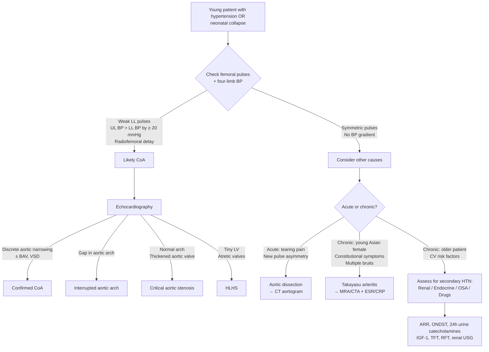

## Differential Diagnosis of Coarctation of the Aorta

The differential diagnosis of CoA is best understood by thinking about **what the clinician actually encounters at the bedside** — because CoA rarely presents with a sign saying "I am a coarctation." Instead, it presents as one of several clinical scenarios, and you must differentiate it from other conditions that produce similar features.

The key clinical scenarios that prompt a differential include:
1. **Neonatal shock / collapse** (duct-dependent presentation)
2. **Hypertension in a young person** (non-duct-dependent presentation)
3. **Upper-lower limb blood pressure gradient / radiofemoral delay**
4. **Systolic murmur at the left upper sternal border / interscapular region**

Let's work through each systematically.

---

### 1. Differential Diagnosis by Clinical Scenario

#### Scenario A: Neonatal Collapse / Shock on Day 2–7 of Life

When a neonate who was well at birth suddenly deteriorates with shock, poor perfusion, and metabolic acidosis, the differential centres on **duct-dependent lesions** — conditions where the systemic (or pulmonary) circulation depends on a patent ductus arteriosus for survival. Once the duct closes, catastrophe follows.

| Condition | Why it mimics CoA | How to differentiate |
|---|---|---|
| ***Coarctation of the aorta (CoA)*** | The index condition: duct closure removes perfusion to the lower body → shock, oliguria, absent femoral pulses | **Weak/absent femoral pulses** with palpable upper limb pulses; upper-lower BP gradient; **echo shows discrete aortic narrowing** |
| **Interrupted aortic arch (IAA)** | Complete discontinuity of the aortic arch (vs. narrowing in CoA) → even more severe obstruction; 100% duct-dependent | Echo shows a **gap** (no continuity) in the aortic arch rather than a narrowing. More commonly associated with **DiGeorge syndrome (22q11.2 deletion)** → check for hypocalcaemia, absent thymic shadow |
| **Critical aortic stenosis** | Severe valvular obstruction to LV outflow → duct-dependent systemic circulation | **Systolic thrill at aortic area**; echo shows thickened, restricted aortic valve rather than arch narrowing. Femoral pulses are weak but **symmetrically** reduced (both UL and LL are equally affected because the obstruction is at the valve, not in the arch) |
| **Hypoplastic left heart syndrome (HLHS)** | Underdeveloped LV, mitral valve, aortic valve → entire systemic circulation is duct-dependent via RV | **Single S2** (absent aortic component); echo shows tiny LV, atretic/stenotic mitral and aortic valves. Cyanosis is more prominent because of mixing |
| **Sepsis / Septic shock** | Non-cardiac cause of neonatal collapse with poor perfusion, metabolic acidosis | **Fever or hypothermia**, elevated inflammatory markers (CRP, procalcitonin), positive blood cultures. **Pulses are symmetrically reduced** (no upper-lower gradient). Echo shows normal cardiac anatomy |
| **Metabolic disorders** (e.g., congenital adrenal hyperplasia, organic acidaemias) | Can present with shock, poor feeding, metabolic acidosis in the first week of life | Ambiguous genitalia (CAH — 21-hydroxylase deficiency); **hyperK + hypoNa** (CAH); elevated ammonia / specific organic acids. **Normal cardiac anatomy on echo** |

<Callout title="The Duct-Dependent DDx Rule">
When a neonate collapses on day 2–3 of life, always think: **"Is there a duct-dependent cardiac lesion?"** Start **IV prostaglandin E₁ (PGE₁)** first, then sort out the exact diagnosis with echocardiography. You don't need a definitive diagnosis before starting PGE₁ — the treatment is the same for all duct-dependent lesions initially, and delay kills.
</Callout>

---

#### Scenario B: Hypertension in a Young Person

This is the classic presentation of non-duct-dependent CoA — a young person (child, adolescent, or young adult) found to have unexplained hypertension. The differential here is the differential of **secondary hypertension**, which is critical for exams [3].

***Secondary hypertension (5%)*** accounts for a minority of all hypertension cases but is much more likely in young patients (< 40 years) [3].

| Category | Conditions | Key Differentiating Features |
|---|---|---|
| ***Cardiac: CoA*** | Coarctation of the aorta | **Upper > lower limb BP gradient (≥ 20 mmHg), radiofemoral delay, ESM at interscapular region, rib notching on CXR** [1][3] |
| ***Renal*** | ***CKD, glomerulonephritis, renovascular disease (renal artery stenosis, renal vein thrombosis), polycystic kidney disease*** | Elevated creatinine, proteinuria/haematuria, renal bruit (RAS), palpable kidneys (PCKD). Renal artery stenosis: young female with fibromuscular dysplasia or older patient with atherosclerotic RAS [3] |
| ***Endocrine*** | ***Primary hyperaldosteronism (Conn syndrome)*** | HypoK + metabolic alkalosis, elevated aldosterone-to-renin ratio (ARR). No specific S/S [3] |
| | ***Cushing syndrome*** | ***Steroid use, proximal muscle weakness***, moon face, buffalo hump, striae, central obesity. Overnight dexamethasone suppression test (ONDST) [3] |
| | ***Phaeochromocytoma*** | ***Paroxysmal headache, palpitation, sweating*** (classic triad). 24h urine catecholamines + fractionated metanephrines [3][4][5] |
| | ***Acromegaly*** | ***Headache, visual field disturbance, increasing glove and shoe size***. Elevated IGF-1 [3] |
| | ***Hyperthyroidism*** | ***Heat intolerance, weight loss despite good appetite***. TFT [3] |
| ***Respiratory*** | ***Obstructive sleep apnoea (OSA)*** | ***Heavy snoring, morning headache, excessive daytime sleepiness (EDS)*** [3] |
| ***Drug-induced*** | ***Immunosuppressants, sympathomimetics (nasal decongestants), steroids*** | Drug history is key [3] |
| ***Vascular*** | Takayasu arteritis | Similar to CoA: asymmetric pulses/BP, bruits. But: **constitutional symptoms** (fever, weight loss, fatigue), **elevated ESR/CRP**, affects **young Asian females (10–40 years)**, involves **multiple arterial territories** (carotid, subclavian, renal, abdominal aorta). MRA/CTA shows **diffuse arterial wall thickening and stenosis** of the aorta and branches [7] |
| | Mid-aortic syndrome (abdominal CoA) | Narrowing of the **abdominal** aorta (below diaphragm) — may be due to Takayasu arteritis, neurofibromatosis type 1, Williams syndrome, or fibromuscular dysplasia. Unlike juxtaductal CoA, the upper limb pulses are normal; instead, there may be **renal artery stenosis** and **mesenteric ischaemia** |
| ***Essential hypertension*** | ***Essential hypertension (95%)*** | Diagnosis of exclusion after secondary causes have been ruled out [3] |

<Callout title="Exam Approach to Young Hypertension" type="idea">
When approaching a young patient with hypertension in an exam, the structured differential is: **Renal → Endocrine → Respiratory → Cardiac → Drug-induced** [3]. CoA falls under the cardiac category. The key screening investigations are: fundoscopy, ECG, CXR, RFT, ARR, ONDST, 24h urine catecholamines, IGF-1, TFT, and **four-limb BP measurement** (the last one catches CoA) [3].
</Callout>

---

#### Scenario C: Upper-Lower Limb Blood Pressure Gradient / Radiofemoral Delay

This is the most specific clinical finding for CoA. However, a few other conditions can also produce asymmetric pulses or BP gradients:

| Condition | Mechanism of Pulse/BP Asymmetry | How to Differentiate from CoA |
|---|---|---|
| **Coarctation of the aorta** | Discrete aortic narrowing → reduced flow to lower body | ***Upper limb BP > Lower limb BP; radiofemoral delay*** [1] |
| **Aortic dissection** | Dissection flap occludes branch vessels → asymmetric perfusion | ***Sudden onset, tearing chest/back pain, radial-radial delay (Type A) or radial-femoral delay (Type B)*** [6]. Widened mediastinum on CXR. CT aortogram shows intimal flap with true and false lumen |
| **Takayasu arteritis** | Granulomatous inflammation → stenosis of aorta and branches → ***absent/weak pulses (60%), asymmetric BP (50%)*** | ***Constitutional symptoms***, ***bruits (80%)***, affects ***young Asian females***, involves ***multiple vascular territories*** [7]. MRA shows diffuse wall thickening |
| **Peripheral arterial disease (atherosclerotic)** | Atherosclerotic stenosis/occlusion of iliac or femoral arteries → reduced LL pulses | ***Older patient with CV risk factors***, ***intermittent claudication*** [8], absent pedal pulses, trophic skin changes. ABI < 0.9. No upper limb hypertension (the obstruction is peripheral, not at the aortic arch level) |
| **Supravalvular aortic stenosis (Williams syndrome)** | Narrowing above the aortic valve → turbulent flow preferentially into the brachiocephalic trunk → **higher BP in right arm than left arm** (Coanda effect) | Elfin facies, intellectual disability, hypercalcaemia, friendly personality. **Right arm BP > Left arm BP** (unlike CoA where both upper limbs are equally elevated vs. lower limbs) |
| **Leriche syndrome** | ***Gradual occlusion of terminal aorta → absent femoral pulses, intermittent claudication, gluteal pain, impotence*** [8] | Older patient, bilateral absent femoral pulses, **no upper limb hypertension** (the aorta proximal to the bifurcation is normal). CT angiography shows infrarenal aortic occlusion |
| **Subclavian steal syndrome** | Stenosis/occlusion of proximal subclavian artery → retrograde flow in vertebral artery → reduced BP in ipsilateral arm | **One arm has lower BP** (not the legs). Symptoms of vertebrobasilar insufficiency (dizziness, visual disturbance) on exercising the affected arm. **Legs are normal** |

<Callout title="Critical Distinction: CoA vs Aortic Dissection" type="error">
Both CoA and **Type B aortic dissection** can produce a radial-femoral delay with upper > lower limb BP. The crucial difference is **tempo**: CoA is a **chronic, congenital** condition in a **young patient with LVH and collaterals**, whereas dissection is an **acute emergency** with ***sudden onset tearing chest/back pain*** [6] and ***widened mediastinum on CXR*** [6]. In dissection, the pulse asymmetry is **new**; in CoA, it has been present since birth. Also, aortic dissection risk factors include ***uncontrolled hypertension, connective tissue disease (Marfan), vasculitis (Takayasu), pregnancy*** [6] — and CoA itself is a risk factor for dissection!
</Callout>

---

#### Scenario D: Systolic Murmur at the Left Upper Sternal Border

CoA produces an ***ESM at the LUSB radiating to the left interscapular region*** [1]. Other conditions that produce murmurs in this region include:

| Condition | Murmur Characteristics | Differentiating Features |
|---|---|---|
| **Coarctation of the aorta** | ***ESM at LUSB → left interscapular*** ± ***continuous murmur from collaterals*** [1] | Radiofemoral delay, upper-lower BP gradient |
| **Aortic stenosis (valvular)** | ESM at right upper sternal border (RUSB), radiates to carotids | ***Low-volume, slow-rising pulse; narrow pulse pressure; systolic thrill*** [9]. No upper-lower BP gradient |
| **Pulmonary stenosis** | ESM at LUSB, radiates to left infraclavicular region | Wide splitting of S2 (delayed P2). RV impulse. No upper-lower BP gradient. Echo confirms valvular PS |
| **ASD (Atrial septal defect)** | Soft ESM at LUSB (flow murmur from increased flow across pulmonary valve) | **Fixed wide splitting of S2**. No radiofemoral delay |
| **Innocent (Still's) murmur** | Soft ESM at LLSB, vibratory quality, changes with position | Normal pulses, normal BP, no other abnormal findings. Disappears by adolescence |
| **Patent ductus arteriosus** | Continuous "machinery" murmur at LUSB | **Bounding pulses** (wide pulse pressure), continuous murmur with late systolic accentuation. Contrast with CoA where pulses are **reduced** in lower limbs |

---

### 2. Diagnostic Decision Framework (Mermaid Diagram)

---

### 3. Key Conditions to Compare with CoA

#### 3.1 CoA vs. Interrupted Aortic Arch (IAA)

| Feature | CoA | IAA |
|---|---|---|
| Anatomy | **Narrowing** of the aorta | **Complete discontinuity** (gap) of the aortic arch |
| Severity | Variable (mild → critical) | Always critical; 100% duct-dependent |
| Genetic association | ***Turner syndrome*** [1] | **DiGeorge syndrome (22q11.2 deletion)** — hypocalcaemia, T-cell deficiency, absent thymic shadow |
| Presentation | May present later if non-duct-dependent | **Always neonatal collapse** |
| Associated lesions | ***BAV, VSD*** [1] | VSD (almost universal), truncus arteriosus |

#### 3.2 CoA vs. Takayasu Arteritis

| Feature | CoA | Takayasu Arteritis |
|---|---|---|
| Nature | Congenital structural defect | Acquired inflammatory vasculitis |
| Age | Present from birth (detected at any age) | ***10–40 years*** [7] |
| Sex | ***M > F (59:41)*** [1] | ***F >> M (80–90%)*** [7] |
| Ethnicity | All ethnicities | ***Especially Asians*** [7] |
| Inflammation | Absent | ***Elevated ESR/CRP, constitutional symptoms*** [7] |
| Distribution | Discrete at aortic isthmus | ***Diffuse involvement of aorta and branches*** [7] |
| Imaging | Focal narrowing at isthmus on echo/CTA | Diffuse wall thickening and multi-segment stenoses on MRA/CTA |
| Treatment | Surgical/interventional repair | ***Steroids + steroid-sparing agents*** [7] |

#### 3.3 CoA vs. Renal Artery Stenosis

Both produce hypertension via RAAS activation, but the mechanism is different:

- **CoA**: The kidneys receive low perfusion pressure because of the aortic obstruction *upstream* of the renal arteries → RAAS activation is a **secondary** phenomenon. BP is elevated in the upper limbs (above the obstruction).
- **Renal artery stenosis (RAS)**: The obstruction is at the level of the renal artery itself → the kidneys are directly hypoperfused. BP is elevated **systemically** (no upper-lower gradient). A **renal bruit** may be heard. Causes include **fibromuscular dysplasia** (young women) and **atherosclerosis** (older patients) [3].

---

### 4. Summary of Differential Diagnosis by Presentation

| Clinical Scenario | Top Differentials |
|---|---|
| Neonatal collapse (day 2) with absent femoral pulses | **CoA, interrupted aortic arch, critical AS, HLHS**, sepsis, metabolic (CAH) |
| Young person with hypertension | **CoA**, renal causes (CKD, RAS, PCKD), endocrine (Conn, Cushing, phaeochromocytoma, acromegaly, thyrotoxicosis), OSA, drugs, Takayasu, essential HTN [3] |
| Upper-lower limb BP gradient / radiofemoral delay | **CoA**, aortic dissection (acute), Takayasu arteritis, supravalvular AS (Williams) |
| ESM at LUSB radiating to back | **CoA**, pulmonary stenosis, ASD (flow murmur) |
| Rib notching on CXR | **CoA** (most common cause), Takayasu arteritis, subclavian artery obstruction, neurofibromatosis, SVC obstruction (causes notching of upper ribs from enlarged collateral veins — a mimic but different mechanism) |

> **High-Yield Exam Point**: In any question about a young person with hypertension, **always check for radiofemoral delay and four-limb BP** before settling on essential hypertension. CoA is one of the most commonly missed diagnoses in clinical practice because clinicians forget to feel the femoral pulses [1][3].

---

<Callout title="High Yield Summary">

**Neonatal collapse DDx**: CoA, interrupted aortic arch, critical AS, HLHS — all duct-dependent lesions treated initially with **IV PGE₁**. Also consider sepsis and metabolic causes (CAH). Differentiate by **echocardiography**.

**Young hypertension DDx** [3]: Structured as **Renal → Endocrine → Respiratory → Cardiac → Drug-induced**. CoA is the cardiac cause. Screen with ***ARR, ONDST, 24h urine catecholamines, IGF-1, TFT*** [3] and critically **four-limb BP**.

**Key differentiators for CoA**: ***Radiofemoral delay, UL > LL BP gradient ≥ 20 mmHg, ESM at left interscapular region, rib notching on CXR*** [1].

**CoA vs. Takayasu**: CoA is congenital/focal/M > F; Takayasu is acquired/diffuse/inflammatory/F >> M/Asians [7].

**CoA vs. Aortic dissection**: CoA is chronic with LVH and collaterals; dissection is acute with ***sudden tearing pain and new pulse asymmetry*** [6].

**CoA vs. Interrupted aortic arch**: Narrowing vs. complete gap; Turner vs. DiGeorge syndrome.
</Callout>

---

<ActiveRecallQuiz
  title="Active Recall - Differential Diagnosis of CoA"
  items={[
    {
      question: "A 3-day-old neonate presents with shock, absent femoral pulses, and metabolic acidosis. List four duct-dependent cardiac lesions in the differential diagnosis and the unifying initial management.",
      markscheme: "Duct-dependent lesions: (1) Coarctation of the aorta, (2) Interrupted aortic arch, (3) Critical aortic stenosis, (4) Hypoplastic left heart syndrome. Unifying initial management: IV prostaglandin E1 (alprostadil) to reopen the ductus arteriosus and maintain distal perfusion."
    },
    {
      question: "How would you distinguish CoA from Takayasu arteritis in a young woman with asymmetric pulses and hypertension?",
      markscheme: "CoA: congenital, focal narrowing at aortic isthmus, M > F, no systemic inflammation, rib notching on CXR. Takayasu: acquired, diffuse involvement of aorta and branches, F >> M, constitutional symptoms (fever, weight loss, fatigue), elevated ESR/CRP, multiple bruits over subclavian/carotid/abdominal vessels, affects young Asian females. Imaging: CoA shows focal isthmus narrowing; Takayasu shows diffuse arterial wall thickening on MRA/CTA."
    },
    {
      question: "A 25-year-old male has BP 170/100 in both arms and 120/80 in both legs. Name five categories of secondary hypertension you should consider and one screening investigation for each.",
      markscheme: "(1) Cardiac — CoA: four-limb BP measurement (already done, showing gradient). (2) Renal — CKD/RAS/PCKD: RFT + renal USG. (3) Endocrine — primary hyperaldosteronism: aldosterone-to-renin ratio (ARR); Cushing: overnight dexamethasone suppression test (ONDST); phaeochromocytoma: 24h urine catecholamines and fractionated metanephrines. (4) Respiratory — OSA: sleep study/polysomnography. (5) Drug-induced: detailed drug history."
    },
    {
      question: "Both CoA and Type B aortic dissection can cause radial-femoral delay. How do you differentiate them clinically?",
      markscheme: "CoA: chronic/congenital condition, young patient, established LVH (heaving apex), collateral murmurs over chest, rib notching on CXR, no acute pain. Aortic dissection: acute presentation with sudden-onset tearing chest/back pain, new pulse asymmetry, widened mediastinum on CXR, may have aortic regurgitation murmur. CT aortogram shows intimal flap with true and false lumen in dissection."
    },
    {
      question: "What genetic syndrome should be suspected in a female infant with CoA and short stature, and what cardiac anomaly should be screened for in a neonate with interrupted aortic arch and hypocalcaemia?",
      markscheme: "Female infant with CoA + short stature: Turner syndrome (45,X) — present in 10-20% of Turner patients. Neonate with interrupted aortic arch + hypocalcaemia: DiGeorge syndrome (22q11.2 deletion) — associated with thymic aplasia (T-cell deficiency), hypoparathyroidism (hypocalcaemia), and cardiac defects including IAA and truncus arteriosus."
    }
  ]}
/>

---

## References

[1] Senior notes: Ryan Ho Cardiology.pdf (Section 3.7.4, p190)
[3] Senior notes: Maksim Medicine Notes.pdf (Section 5.1 Hypertension DDx, p78)
[4] Senior notes: Maksim Surgery Notes.pdf (Section Phaeochromocytoma, p205)
[5] Senior notes: Ryan Ho Endocrine.pdf (Section Phaeochromocytoma, p66)
[6] Senior notes: Maksim Medicine Notes.pdf (Section 1.4 Aortic dissection, p15)
[7] Senior notes: Ryan Ho Rheumatology.pdf (Section 3.6.2 Takayasu Arteritis, p96)
[8] Senior notes: Maksim Surgery Notes.pdf (Section Chronic limb ischaemia, p166)
[9] Senior notes: Maksim Medicine Notes.pdf (Section 1.8 Valvular heart disease — Aortic stenosis, p35)
