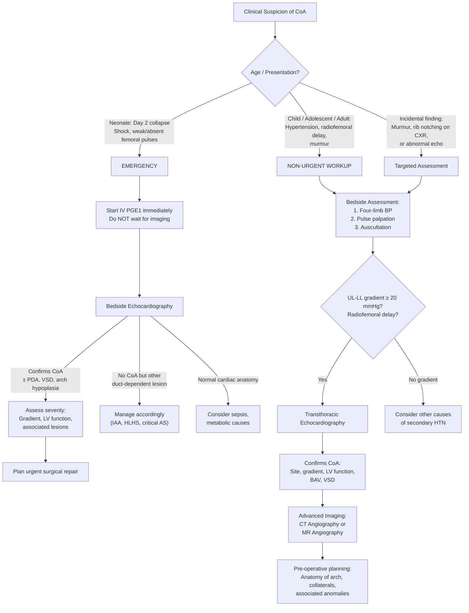
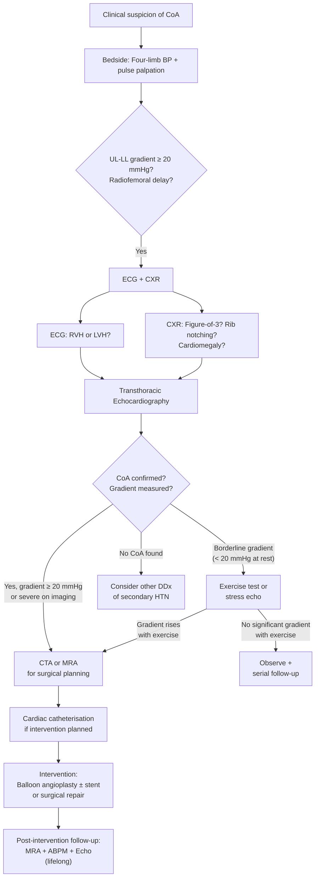

## Diagnostic Criteria, Algorithm, and Investigations for Coarctation of the Aorta

### 1. Diagnostic Criteria

Unlike many medical conditions (e.g., rheumatoid arthritis with ACR/EULAR criteria, or heart failure with Framingham criteria), CoA does **not** have a formal set of "diagnostic criteria" with point scores. Instead, the diagnosis is established by a **combination of clinical findings and confirmatory imaging**. Think of it as a two-step process:

**Step 1: Clinical Suspicion** → based on bedside findings
**Step 2: Confirmatory Imaging** → echocardiography (first-line) ± advanced imaging (CT/MR angiography)

#### 1.1 Clinical Diagnostic Features (What Makes You Suspect CoA)

| Feature | Significance |
|---|---|
| ***Radiofemoral delay*** [1][10] | The **cardinal clinical sign**. Femoral pulse arrives later than radial pulse because blood reaches the legs via tortuous collaterals rather than directly through the narrowed aorta. ***D/dx: coarctation of aorta, aortic dissection, severe UL/aortoiliac vasculopathy*** [10] |
| **Upper limb – lower limb systolic BP gradient ≥ 20 mmHg** | Normally, leg systolic BP is equal to or slightly higher than arm BP (due to peripheral pulse amplification). A reversal of this relationship with ≥ 20 mmHg gradient is highly suggestive of CoA [1] |
| ***Weak lower limb pulses*** | ***Only reliable sign before ductus closes*** in neonates [1] |
| ***ESM at LUSB radiating to left interscapular region*** [1] | Turbulent flow across the coarctation site; interscapular radiation is characteristic because the descending aorta is a posterior structure |
| **Hypertension in a young person** | CoA should be excluded in any patient < 40 years with unexplained hypertension |
| **Associated features** | ***Bicuspid aortic valve*** (ejection click), Turner syndrome stigmata, signs of LVH |

<Callout title="The Clinical Diagnosis Rule">
**If you find radiofemoral delay + upper limb hypertension + upper-lower limb BP gradient ≥ 20 mmHg in any patient, CoA is the diagnosis until proven otherwise.** Proceed directly to echocardiography for confirmation. You don't need a CT before echo — echo is faster, radiation-free, and gives you haemodynamic data.
</Callout>

#### 1.2 Imaging Diagnostic Criteria

The diagnosis is **confirmed** when imaging demonstrates:

1. **Anatomical narrowing** of the aorta (typically at the isthmus, near the ductus/ligamentum arteriosum insertion)
2. **Haemodynamic significance**: a peak systolic pressure gradient ≥ 20 mmHg across the coarctation on echocardiography or catheterisation (this is also one of the ***indications for repair*** [1])
3. **Diastolic run-off pattern** on Doppler: persistent forward flow in diastole ("diastolic tail") — this indicates the gradient is significant enough that blood is still being forced across the narrowing during diastole

> **Indication for intervention** [1]: ***Proximal hypertension, > 20 mmHg gradient, severe CoA on imaging studies*** — these three criteria are used to decide who needs repair.

---

### 2. Diagnostic Algorithm

The approach differs by clinical scenario. Here is a comprehensive diagnostic algorithm:

---

### 3. Investigation Modalities

Let's go through each investigation systematically, understanding **what it shows, why, and how to interpret it**.

#### 3.1 Bedside Investigations

##### A. Four-Limb Blood Pressure Measurement

This is the **single most important bedside investigation** and should be performed in every patient with suspected CoA.

| Parameter | How to Perform | Expected Finding in CoA |
|---|---|---|
| Upper limb BP | Measure in both arms (right arm preferred as it is always pre-coarctation; left subclavian may occasionally arise at or below the coarctation in rare variants) | Elevated (systolic HTN) |
| Lower limb BP | Use appropriately sized thigh cuff on the leg; measure with Doppler over dorsalis pedis or posterior tibial artery | Low relative to upper limb |
| Gradient | Calculate: Right arm systolic BP – Higher ankle systolic BP | ***≥ 20 mmHg is significant and is an indication for repair*** [1] |

**Why right arm specifically?** The right subclavian artery arises from the brachiocephalic trunk — the first branch of the aortic arch — and is therefore **always proximal** to any coarctation. The left subclavian artery is the third branch and in rare cases may arise at or distal to the coarctation, giving a falsely low left arm reading.

**Why is leg BP normally ≥ arm BP?** This is due to **peripheral pulse amplification**: as the pulse wave travels distally through progressively narrower, stiffer arteries, the systolic peak gets amplified (the pulse wave reflects off branch points and sums with the forward wave). In CoA, this amplification cannot compensate for the massive pressure drop across the obstruction.

##### B. Pulse Oximetry — Pre-ductal vs. Post-ductal SpO₂

| Site | What it Represents | Finding in Critical CoA with R→L PDA Shunt |
|---|---|---|
| Right hand (pre-ductal) | Oxygenated blood from LV | Normal SpO₂ (95–100%) |
| Either foot (post-ductal) | Mixed blood: deoxygenated from RV via PDA + whatever LV output gets past the CoA | Lower SpO₂ (may be < 90%) |
| **Differential** | **Pre-ductal – Post-ductal SpO₂ difference** | **≥ 3% difference is significant** → differential cyanosis |

This is a quick, non-invasive way to screen for duct-dependent lesions in neonates. It forms part of the **newborn pulse oximetry screening** programme used in many centres (including Hong Kong since pilot programmes). If differential cyanosis is detected, echocardiography is urgent.

##### C. Pulse Palpation

***All peripheral arterial pulses should be assessed and compared bilaterally on their rate, rhythm, delays, character, and volume*** [10].

| Finding | Mechanism | Interpretation |
|---|---|---|
| ***Radiofemoral delay*** | Blood reaches femoral artery via long, tortuous collateral pathway → delayed arrival | ***D/dx: CoA, aortic dissection, severe UL/aortoiliac vasculopathy*** [10] |
| Diminished femoral pulse volume | Reduced flow through narrowed aorta → less blood reaching lower limbs | Correlates with severity of obstruction |
| Bounding upper limb pulses | Relative hypertension proximal to coarctation | Contrast with weak lower limb pulses |

---

#### 3.2 Electrocardiogram (ECG)

The ECG in CoA reflects the **haemodynamic burden** on the ventricles, which differs by age/severity:

| Scenario | ***ECG Finding*** | Pathophysiological Explanation |
|---|---|---|
| ***Neonatal / Duct-dependent CoA*** | ***RVH*** (right axis deviation, dominant R wave in V1, deep S in V5–V6) [1] | In fetal life and early neonatal life, the RV is the dominant ventricle. In duct-dependent CoA, the RV continues to support systemic circulation via the PDA → RVH persists instead of the normal postnatal transition to LV dominance |
| ***Older child / Adult CoA*** | ***LVH*** (left axis deviation, tall R in V5–V6, deep S in V1–V2, ± ST-T strain pattern) [1] | Chronic LV pressure overload from pumping against the fixed obstruction → compensatory concentric LVH. Similar pattern to ***aortic stenosis: LVH, LV strain, left axis deviation*** [9] |

**Key point**: A normal ECG does **not** exclude CoA. Mild-to-moderate CoA may not produce enough LV pressure overload to cause ECG changes, especially in well-compensated patients with good collaterals.

<Callout title="ECG Transition with Age" type="idea">
In a neonate with CoA who survives without immediate repair, the ECG pattern **transitions** over weeks to months from RVH → normal → LVH, as the RV involutes and the LV takes over against the chronic obstruction. This parallels the normal neonatal ECG transition, but the eventual LVH is pathological.
</Callout>

---

#### 3.3 Chest X-Ray (CXR)

The CXR is often the investigation that first raises suspicion of CoA, particularly in older children and adults. The findings are **classic and exam-favourite**:

| ***CXR Finding*** | Appearance | Pathophysiological Explanation |
|---|---|---|
| ***"Figure of 3" sign (or "reverse E" sign)*** | The aortic knuckle shows a double contour: (1) pre-stenotic dilatation of the left subclavian/proximal descending aorta, (2) the indentation of the coarctation itself, and (3) post-stenotic dilatation of the descending aorta → forms a "3" shape [1] | Pre-stenotic dilatation occurs because of increased pressure and turbulence proximal to the narrowing. Post-stenotic dilatation occurs because of the **Bernoulli effect**: high-velocity jet through the narrow segment creates a low-pressure zone immediately distal to it, and the turbulent flow damages the aortic wall, causing it to dilate |
| **"Reverse 3" or "E" sign on barium swallow** | If a barium swallow is performed (historical), the oesophagus is indented by the aorta, creating a reverse "3" or "E" shape | The dilated segments of aorta compress the adjacent oesophagus |
| ***Rib notching (Roesler sign)*** | Scalloping/erosion of the **inferior surface** of the **posterior ribs**, typically **ribs 3–8** bilaterally [1] | ***Enlargement of intercostal arteries as collaterals*** [1] → pulsatile, dilated intercostal arteries erode the undersurface of the ribs over time. Ribs 1–2 are spared because their intercostals arise from the costocervical trunk (proximal to the coarctation). Not visible before age 5–6 years (collaterals need years to develop) |
| ***Cardiomegaly + increased pulmonary vascular markings*** | Enlarged cardiac silhouette with prominent pulmonary vasculature | ***In infants/neonates with HF*** [1]: LV failure → pulmonary venous congestion → increased markings. In older patients: LVH causes cardiomegaly. Apply the ***CXR ABCDE of heart failure: Alveolar oedema, Kerley B lines, Cardiomegaly, Dilated upper lobe vessels, pleural Effusion*** [11] |
| **Dilated ascending aorta** | Prominent ascending aortic shadow | Pre-stenotic dilatation and/or associated bicuspid aortic valve aortopathy |

<Callout title="Unilateral Rib Notching" type="idea">
If rib notching is **unilateral** (left-sided only), this may indicate that the coarctation is located **between** the left common carotid artery and the left subclavian artery origin — meaning the left subclavian is distal to the coarctation. In this variant, only the left intercostal arteries serve as collaterals (right-sided intercostals receive normal flow from the right subclavian). Conversely, if an **aberrant right subclavian artery** arises distal to the coarctation, rib notching may be **bilateral** but the right arm BP will be low (losing its reliability as a pre-coarctation reference).
</Callout>

---

#### 3.4 Echocardiography

***Echocardiography demonstrates the site and severity of the coarctation and measures the systolic pressure gradient*** [1]. It is the **first-line confirmatory imaging** for CoA.

##### Modalities Used

| Echocardiographic Technique | What It Shows |
|---|---|
| **2D / B-mode imaging** | Directly visualises the **narrowing** of the aorta. Shows the posterior shelf at the isthmus. Measures the diameter of the aortic arch segments. Identifies associated lesions (BAV, VSD, arch hypoplasia, mitral valve anomalies) |
| **Colour-flow Doppler** | Shows **turbulent flow** (aliasing) at the coarctation site — colour changes from blue/red to a mosaic pattern at the narrowing, indicating high-velocity turbulent flow |
| **Continuous-wave (CW) Doppler** | Measures the **peak and mean pressure gradient** across the coarctation. A ***peak gradient > 20 mmHg*** is haemodynamically significant [1]. Also shows the characteristic **"diastolic tail"** pattern |
| **Pulsed-wave (PW) Doppler** | Assesses flow patterns in the descending aorta: in significant CoA, there is blunted pulsatile flow with persistent forward diastolic flow |

##### Key Doppler Findings and Their Interpretation

| Finding | Interpretation | Why? |
|---|---|---|
| **Peak systolic gradient > 20 mmHg** | Haemodynamically significant coarctation | The modified Bernoulli equation (ΔP = 4V²) converts peak velocity to pressure gradient. V > 2.2 m/s ≈ gradient > 20 mmHg |
| **"Diastolic tail" (persistent forward diastolic flow)** | Severe obstruction with significant pressure gradient persisting into diastole | In a normal aorta, flow ceases or reverses briefly in diastole. When there is a tight obstruction, the proximal aortic pressure remains high enough to drive flow across the narrowing even during diastole — creating a "tail" on the Doppler spectral trace |
| **Blunted abdominal aortic pulsatility** | Reduced pulse pressure distal to the coarctation | The obstruction dampens the systolic peak and the collateral flow fills in the diastolic trough → the descending aorta sees a continuous, low-pulsatility flow pattern |

##### Caveats of Echocardiographic Gradient

<Callout title="Gradient Paradox" type="error">
A **low Doppler gradient does NOT always mean mild CoA**. In two situations, the gradient can be misleadingly low:

1. **Excellent collateral circulation**: well-developed collaterals decompress the proximal aorta and provide alternative flow to the distal aorta, reducing the pressure difference across the coarctation itself. The patient still has significant obstruction, but the gradient is artificially low.
2. **Poor LV function**: a failing LV cannot generate enough force to create a high gradient. This is particularly relevant in neonates with acute heart failure after duct closure.

Always interpret the gradient **in the context of the clinical picture and LV function**.
</Callout>

##### Assessment of Associated Lesions

Echocardiography must also assess:

| Associated Lesion | Echocardiographic Finding |
|---|---|
| ***Bicuspid aortic valve (BAV)*** | Two cusps seen in short-axis view (instead of three); may have raphe; assess for AS/AR [1] |
| ***VSD*** | Colour-flow Doppler shows left-to-right shunt across interventricular septum [1] |
| ***Transverse arch hypoplasia*** | Arch dimensions measured: Z-score < -2 indicates hypoplasia [1] |
| **LV function** | EF, LV dimensions (end-diastolic/end-systolic diameters); ***reduced EF in acute HF*** [11] |
| **LVH** | Increased septal and posterior wall thickness |
| **Mitral valve anomalies** | Parachute mitral valve, supravalvular ring (Shone complex) |
| **PDA** | Colour flow from pulmonary artery to descending aorta (right-to-left = cyanotic, left-to-right = acyanotic) |

---

#### 3.5 CT Angiography (CTA)

***CT angiography uses rapid injection of a large intravenous bolus of contrast to opacify vessels for CT imaging*** [12]. It is a **key pre-operative investigation** and is increasingly used as the **gold standard for anatomical delineation** in older children and adults.

| Aspect | Detail |
|---|---|
| **When to use** | ***Pre-operative assessment of anatomy*** — detailed 3D reconstruction of the coarctation site, arch anatomy, collateral vessels, and associated vascular anomalies. Also used for **post-repair surveillance** |
| **Advantages** | Excellent spatial resolution; 3D reconstruction; fast acquisition; widely available; ***can be used in place of more invasive conventional angiography*** [12] |
| **Disadvantages** | ***Radiation dose; contrast allergy/nephropathy*** [13]; not ideal for serial follow-up in children (cumulative radiation) |
| **Key findings** | Focal narrowing at the isthmus with pre- and post-stenotic dilatation; enlarged collateral vessels (internal mammary, intercostals, scapular); associated arch anomalies; ascending aortic dilatation (if BAV aortopathy) |

##### CTA Interpretation Pearls

- **Measure the coarctation diameter** relative to the reference descending aorta at the diaphragmatic level. A ratio < 0.5 generally indicates severe narrowing.
- **Map the collateral pathways**: internal mammary → intercostal is the most important. The degree of collateral development gives an indirect measure of chronicity and severity.
- **Check the ascending aorta**: an ascending aortic diameter > 40 mm in an adult suggests **aortopathy** (common with BAV) and may require concomitant repair.
- **Look for associated berry aneurysms**: while brain CTA is not routinely done, if clinical suspicion is high (family history of SAH), intracranial CTA can be added. ***Cerebral aneurysms are associated with CoA*** [2].

---

#### 3.6 MR Angiography (MRA) / Cardiac MRI

MRA is considered the **gold standard for follow-up imaging** after CoA repair, and is increasingly used for initial diagnosis in older children and adults.

| Aspect | Detail |
|---|---|
| **When to use** | ***Demonstrates length and severity of coarctation*** [1]. Ideal for serial follow-up (no radiation). Excellent for assessing the aortic arch in 3D. Also used to assess LV mass and function (cardiac MRI) |
| **Advantages** | No ionising radiation (critical for children requiring serial imaging); excellent soft-tissue contrast; simultaneous assessment of aortic anatomy AND cardiac function (ventricular volumes, mass, EF); gadolinium-enhanced MRA provides 3D vascular images comparable to CTA |
| **Disadvantages** | Longer acquisition time (requires sedation/anaesthesia in young children); claustrophobia; contraindicated with certain implants (though modern stents are generally MRI-conditional); gadolinium contraindicated in severe renal impairment (risk of nephrogenic systemic fibrosis) |
| **Key findings** | Same anatomical delineation as CTA. Additionally, **phase-contrast MRI** can quantify flow velocities and calculate the gradient non-invasively, and can detect collateral flow volume |

##### MRI-Specific Sequences

| Sequence | Purpose |
|---|---|
| **Gadolinium-enhanced 3D MRA** | Anatomical delineation of coarctation site, arch anatomy, collaterals |
| **Cine SSFP (steady-state free precession)** | Assess LV function, wall motion, LV mass (for LVH quantification) |
| **Phase-contrast velocity mapping** | Non-invasive measurement of flow velocity and gradient at the coarctation site; quantify collateral flow |
| **Late gadolinium enhancement (LGE)** | Detect myocardial fibrosis (from chronic LV pressure overload) — a marker of adverse remodelling |

<Callout title="CTA vs. MRA: When to Choose Which?">

| Factor | CTA | MRA |
|---|---|---|
| Speed | Fast (seconds) | Slow (30–60 minutes) |
| Radiation | Yes | No |
| Serial follow-up | Less ideal (cumulative radiation) | **Preferred** for lifelong surveillance |
| Spatial resolution | Superior | Good but slightly inferior |
| Haemodynamic data | Limited | **Phase-contrast flow quantification** |
| Sedation in children | Rarely needed | Often needed |
| Emergency setting | **Preferred** (fast, widely available) | Not ideal |
| Post-stent imaging | Good (less artefact) | Artefact from metallic stents may limit views |

**Rule of thumb**: CTA for initial/pre-operative planning and emergencies; MRA for long-term follow-up.
</Callout>

---

#### 3.7 Cardiac Catheterisation and Angiography

This was historically the **gold standard** for CoA diagnosis but is now largely reserved for **therapeutic intervention** rather than pure diagnosis, as non-invasive imaging (echo, CTA, MRA) provides adequate diagnostic information.

| Aspect | Detail |
|---|---|
| **When to use** | (1) When non-invasive imaging is inconclusive. (2) ***When intervention is planned: balloon angioplasty ± stenting*** [1]. (3) To measure invasive haemodynamic gradients if echo gradient is ambiguous (e.g., well-developed collaterals dampening the gradient) |
| **Technique** | Catheter inserted (usually femoral artery approach) → advanced retrogradely to the aorta → contrast injection → fluoroscopic imaging. Pressure measurements taken proximal and distal to the coarctation |
| **Key findings** | (1) **Direct pressure gradient**: peak-to-peak systolic gradient ≥ 20 mmHg confirms haemodynamic significance. (2) **Anatomical visualisation**: site, length, and severity of narrowing. (3) **Collateral filling**: contrast seen in enlarged intercostal and internal mammary arteries |
| **Advantages** | ***Can be done intra-operatively: guides endovascular intervention*** [13]; provides definitive haemodynamic data |
| **Disadvantages** | Invasive; ***risks include contrast allergy, contrast nephropathy, arterial injury (dissection, embolism, pseudoaneurysm)*** [13] |

---

#### 3.8 Blood Tests

***Bloods: severe metabolic acidosis due to ischaemic colitis and AKI upon duct closure*** [1].

| Test | Finding | Interpretation |
|---|---|---|
| **Arterial blood gas (ABG)** | ***Severe metabolic acidosis*** (low pH, low HCO₃⁻, elevated lactate) [1] | ***Ischaemic colitis*** (gut hypoperfusion) + ***AKI*** (renal hypoperfusion) after duct closure → anaerobic metabolism → lactic acidosis |
| **Renal function (Cr, urea)** | Elevated creatinine and urea | AKI from renal hypoperfusion (kidneys are distal to the coarctation) |
| **Lactate** | Elevated | Tissue hypoperfusion → anaerobic glycolysis → lactate accumulation. Also elevated in ***ischaemic gut/shock*** [6] |
| **BNP / NT-proBNP** | Elevated | ***Released from ventricles during overload*** [11] → marker of heart failure. Helps distinguish cardiac from non-cardiac causes of neonatal shock |
| **Troponin** | May be mildly elevated | Myocardial stress from acute pressure overload → subendocardial ischaemia |
| **CBC** | Polycythaemia (in chronic cyanotic CoA with R→L PDA) or normocytic anaemia (in chronic HF) | Chronic hypoxaemia stimulates EPO → polycythaemia; alternatively, chronic HF causes anaemia of chronic disease |
| **Karyotype (46,XX → 45,X?)** | Turner syndrome (45,X) | ***CoA is associated with Turner syndrome*** [1]. Screen any **female** with CoA, especially if phenotypic features are present |

---

#### 3.9 Additional / Supplementary Investigations

| Investigation | When to Consider | Purpose |
|---|---|---|
| **Ankle-Brachial Index (ABI)** | Older patients with suspected CoA or for quantifying lower limb perfusion. ***ABI = ipsilateral ankle systolic BP / higher arm systolic BP*** [14]. ***Normal = 0.90–1.30*** [14] | In CoA, the ABI will be **reduced** (< 0.9), similar to peripheral arterial disease but for a completely different reason (proximal aortic obstruction vs. distal atherosclerotic disease). This can be a useful adjunct in adults |
| **Exercise testing** | Older children and adults with borderline resting gradients | Exercise unmasks latent gradients: during exercise, cardiac output increases and the fixed obstruction limits flow → the gradient increases. A rise of > 20 mmHg in the upper-lower limb gradient during exercise is significant |
| **Brain MRA / CTA** | Family history of SAH, or known CoA being worked up pre-operatively | Screen for ***berry aneurysms*** (present in ~10% of CoA patients) [2]. ***Ix for cerebral aneurysm: angiography (DSA, CTA, MRA)*** [2] |
| **Renal ultrasound / Doppler** | Persistent hypertension after CoA repair | Assess for concomitant renal artery stenosis or renal parenchymal disease contributing to residual hypertension |
| **Ambulatory BP monitoring (ABPM)** | Post-repair follow-up | Detects masked hypertension and abnormal diurnal BP patterns (loss of nocturnal dipping) — common even after successful CoA repair |

---

### 4. Summary: Diagnostic Investigation Pathway

| Stage | Investigation | Key Finding | Purpose |
|---|---|---|---|
| **Bedside** | Four-limb BP, pulse palpation, pulse oximetry | UL-LL gradient ≥ 20 mmHg, radiofemoral delay, differential SpO₂ | Raise clinical suspicion |
| **First-line** | ***Echocardiography*** [1] | Discrete aortic narrowing, Doppler gradient, diastolic tail, associated lesions (BAV, VSD) | **Confirm diagnosis** |
| **Supportive** | ECG | ***RVH (neonate) or LVH (older)*** [1] | Assess haemodynamic burden |
| **Supportive** | CXR | ***"Figure of 3" sign, rib notching, cardiomegaly*** [1] | Support diagnosis, assess HF |
| **Supportive** | Bloods | ***Metabolic acidosis, elevated Cr, lactate*** [1] | Assess end-organ damage (neonatal) |
| **Pre-operative** | ***CTA or MRA*** [1][12] | 3D anatomy of coarctation, arch, collaterals | ***Demonstrates length and severity*** [1]; surgical planning |
| **Therapeutic** | Cardiac catheterisation | Invasive gradient measurement, anatomy | ***When intervention is planned*** [1] |
| **Follow-up** | MRA (preferred), ABPM, echo | Residual/re-coarctation, persistent HTN, aneurysm formation | Lifelong surveillance |

---

### 5. Interpretation Framework: Putting It All Together

---

<Callout title="High Yield Summary">

**Diagnosis of CoA is clinical + echocardiographic:**
- **Clinical**: Radiofemoral delay, UL-LL systolic BP gradient ≥ 20 mmHg, weak LL pulses, ESM at left interscapular region
- **Echo (first-line confirmation)**: ***Demonstrates site and severity of coarctation and measures systolic pressure gradient*** [1]. Look for diastolic tail on Doppler, and assess associated lesions (BAV, VSD, arch hypoplasia)
- **CXR classics**: ***"Figure of 3" sign, rib notching (ribs 3–8), cardiomegaly*** [1]
- **ECG**: ***RVH in neonates, LVH in older patients*** [1]
- **Bloods in neonatal collapse**: ***Severe metabolic acidosis from ischaemic colitis and AKI*** [1]
- **Advanced imaging**: CTA for pre-operative planning; ***MRA demonstrates length and severity*** [1] and is preferred for lifelong follow-up (no radiation)
- **Catheterisation**: reserved for ***intervention (balloon angioplasty ± stent)*** [1], not purely diagnostic

**Indications for repair** [1]: ***Proximal HTN, > 20 mmHg gradient, severe CoA on imaging studies***

**Pitfall**: A low echo gradient does NOT exclude significant CoA — may be dampened by excellent collaterals or poor LV function.
</Callout>

---

<ActiveRecallQuiz
  title="Active Recall - Diagnosis of CoA"
  items={[
    {
      question: "What is the first-line confirmatory investigation for suspected CoA, and what three key pieces of information does it provide?",
      markscheme: "Transthoracic echocardiography. It provides: (1) Anatomical site and morphology of the coarctation (discrete shelf vs. long-segment hypoplasia), (2) Haemodynamic gradient across the coarctation (peak systolic gradient via CW Doppler), (3) Assessment of associated lesions (bicuspid aortic valve, VSD, arch hypoplasia, LV function)."
    },
    {
      question: "Explain the 'diastolic tail' sign on Doppler echocardiography in CoA and what it signifies.",
      markscheme: "The diastolic tail is persistent forward flow across the coarctation during diastole, seen as a continuous forward-flow signal extending beyond the systolic peak on CW Doppler. It signifies a severe obstruction: the pressure gradient between proximal and distal aorta is so large that it persists even during diastole, driving continued antegrade flow. Normally, aortic flow ceases or briefly reverses in diastole."
    },
    {
      question: "Name three classic CXR findings in CoA and explain the pathophysiology of each.",
      markscheme: "(1) Figure-of-3 sign: pre-stenotic dilatation of proximal aorta + indentation at coarctation + post-stenotic dilatation (Bernoulli effect and turbulent jet damage). (2) Rib notching (Roesler sign): erosion of inferior rib surfaces 3-8 by enlarged, pulsatile intercostal arteries serving as collateral pathways (ribs 1-2 spared as their intercostals arise proximal to coarctation from costocervical trunk). (3) Cardiomegaly: LVH from chronic pressure overload or biventricular failure in neonatal presentation."
    },
    {
      question: "Why might the echocardiographic Doppler gradient across a coarctation be misleadingly low despite a severe obstruction? Name two mechanisms.",
      markscheme: "(1) Well-developed collateral circulation: collaterals decompress the proximal aorta and supply the distal aorta via alternative routes, reducing the pressure difference measured directly across the coarctation site. (2) Poor LV function: a failing LV cannot generate sufficient pressure to create a high transcoarctation gradient. Always interpret gradient in the context of LV function and collateral development."
    },
    {
      question: "What blood test abnormalities would you expect in a neonate with critical CoA who has just had ductal closure, and why?",
      markscheme: "Severe metabolic acidosis (low pH, low bicarbonate, high lactate) from tissue hypoperfusion causing anaerobic metabolism. Specifically: ischaemic colitis (gut hypoperfusion) and AKI (renal hypoperfusion) both contribute to lactic acidosis. Also: elevated creatinine and urea (AKI from renal hypoperfusion distal to coarctation), elevated lactate, elevated BNP/NT-proBNP (ventricular overload/HF), and possibly mildly elevated troponin (myocardial stress)."
    }
  ]}
/>

---

## References

[1] Senior notes: Ryan Ho Cardiology.pdf (Section 3.7.4, p190–191)
[2] Senior notes: Ryan Ho Neurology.pdf (Section B. Cerebral Aneurysm, p87)
[6] Senior notes: Maksim Medicine Notes.pdf (Section 1.4 Aortic dissection, p15)
[9] Senior notes: Maksim Medicine Notes.pdf (Section 1.8 Valvular heart disease — Aortic stenosis, p35)
[10] Senior notes: Ryan Ho Fundamentals.pdf (Section B. Examination of the Neck — Arterial Pulses, p24)
[11] Senior notes: Maksim Medicine Notes.pdf (Section Heart Failure — Investigations, p18)
[12] Senior notes: Ryan Ho Diagnostic Radiology.pdf (Section CT Angiography, p43)
[13] Senior notes: Maksim Surgery Notes.pdf (Section Investigations for PVD, p165)
[14] Senior notes: Ryan Ho Cardiology.pdf (Section A. Assessment of Lower Limb Ischaemia — ABI, p214)
