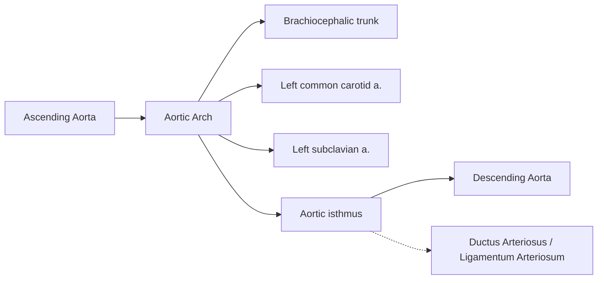
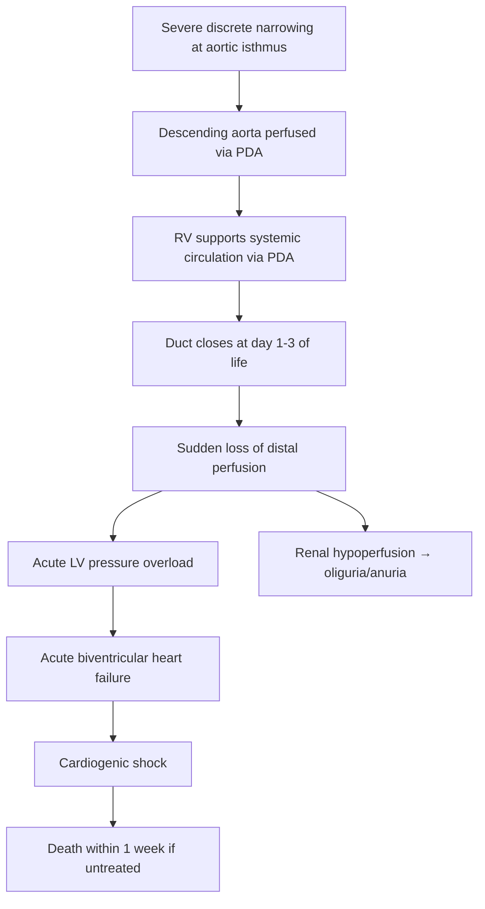
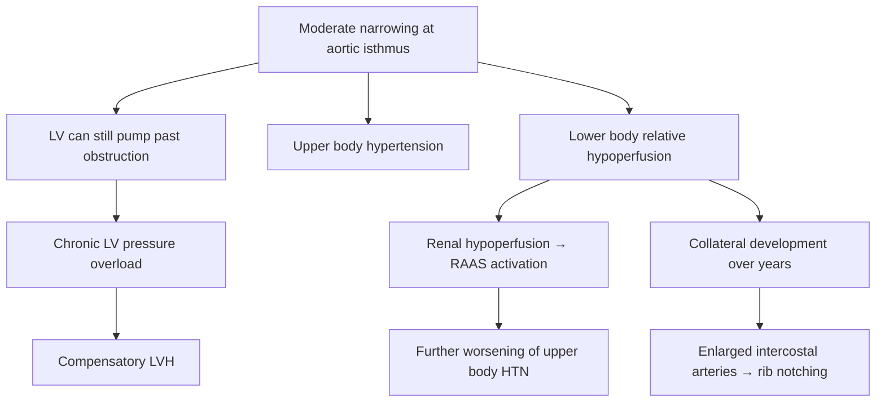

# Coarctation of the Aorta (CoA)

## 1. Definition

Coarctation of the aorta (CoA) is a **congenital narrowing of the aorta**, most commonly occurring as a **discrete stenosis at the junction of the aortic arch and the descending aorta**, near the insertion site of the ductus arteriosus (ligamentum arteriosum after closure). The word itself tells you what it is: "coarctation" derives from the Latin *coarctare* — "co-" (together) + "arctare" (to make narrow/tight). It is literally a "pressing together" or constriction of the aorta.

This narrowing creates a mechanical obstruction to left ventricular (LV) outflow, producing **upper body hypertension** proximal to the coarctation and **relative hypoperfusion** distal to it. The clinical consequences range from **catastrophic neonatal heart failure with shock** (when the coarctation is severe and the systemic circulation is duct-dependent) to **asymptomatic systemic hypertension** discovered incidentally in adolescents or adults [1].

<Callout title="Key Conceptual Point">
CoA is fundamentally a disease of **mechanical obstruction** — everything downstream (LV hypertrophy, upper limb hypertension, collateral formation, renal activation of RAAS) is a consequence of the simple fact that the aorta is too narrow at one point. Always reason from this first principle.
</Callout>

---

## 2. Epidemiology

| Parameter | Detail |
|---|---|
| ***Prevalence among CHD*** | ***4–6% of all congenital heart defects*** [1] |
| ***Incidence*** | ***~4 per 10,000 live births*** [1] |
| ***Sex ratio*** | ***Male > Female, approximately 59:41 (≈1.5:1)*** [1] |
| Age at presentation | Bimodal: neonates (severe/critical CoA) and older children/young adults (less severe CoA) |
| Isolated vs. complex | ~50% of cases have associated cardiac anomalies |

- CoA is the **5th–8th most common** congenital heart defect, depending on the series.
- In Hong Kong, with approximately 35,000–40,000 live births per year, this translates to roughly **14–16 new cases annually**.
- It is a leading cause of **secondary hypertension in young adults** — one of the "must-exclude" diagnoses in any young person presenting with unexplained hypertension.

---

## 3. Risk Factors and Associations

### 3.1 Genetic / Syndromic

- ***Cause: majority sporadic*** [1], meaning no single gene mutation is identified in most cases.
- ***Associated with Turner syndrome (45,X)*** [1]: CoA occurs in **10–20% of Turner syndrome patients**. The mechanism is thought to relate to lymphoedema-mediated abnormal aortic arch development and haemodynamic alterations from a hypoplastic left heart during fetal life. **Always check for Turner syndrome in any female with CoA** (short stature, webbed neck, shield chest, primary amenorrhoea).
- ***May display familial clustering*** [1]: first-degree relatives of CoA patients have a **~2–6% recurrence risk**, suggesting polygenic inheritance.
- Other genetic associations: **William syndrome** (elastin gene deletion on 7q11.23 → supravalvular aortic stenosis more common, but CoA can occur), **22q11.2 deletion** (DiGeorge/velocardiofacial), and connective tissue disorders.

### 3.2 Associated Cardiac Anomalies

These are **extremely high-yield** because they affect management and prognosis:

| ***Association*** | ***Frequency*** | ***Clinical Significance*** |
|---|---|---|
| ***Bicuspid aortic valve (BAV)*** | **50–85%** of CoA patients | Most common association. May cause aortic stenosis or regurgitation later in life. BAV itself is associated with aortopathy (ascending aortic aneurysm) [1] |
| ***Ventricular septal defect (VSD)*** | ~33–35% | Increases the volume load on the heart; may complicate neonatal presentation [1] |
| ***Hypoplasia of the transverse aortic arch*** | Common | The arch is diffusely small, not just at the isthmus; may require extensive surgical repair [1] |
| ***Patent ductus arteriosus (PDA)*** | Almost universal in neonatal CoA | The duct is the lifeline for distal perfusion in critical CoA |
| ***Mitral valve anomalies*** | ~25% | Parachute mitral valve, mitral stenosis → Shone complex |
| Subaortic stenosis | Less common | Part of multi-level LV outflow obstruction |

<Callout title="Shone Complex" type="idea">
The combination of (1) supravalvular mitral ring, (2) parachute mitral valve, (3) subaortic stenosis, and (4) coarctation of the aorta is called **Shone complex** — representing multi-level left-sided obstruction. Not every CoA patient has this, but awareness is important because missing one level of obstruction leads to incomplete repair.
</Callout>

### 3.3 Associated Extra-Cardiac Anomalies

- ***Berry (intracranial saccular) aneurysms*** [1][2]: present in **~10%** of CoA patients (vs. 2–5% in general population [2]). The mechanism is dual: (a) chronic upper-body hypertension increases haemodynamic stress on intracranial arterial bifurcations, and (b) there may be an underlying connective tissue abnormality affecting the arterial media. This is why CoA patients are at elevated risk of **subarachnoid haemorrhage (SAH)**.

<Callout title="Exam Pearl" type="error">
If an exam question mentions a young adult with SAH and upper limb hypertension → think **CoA with associated berry aneurysm**. Conversely, if you diagnose CoA, screening for intracranial aneurysms may be considered, especially if there is a family history of SAH.
</Callout>

---

## 4. Anatomy and Function

### 4.1 Normal Aortic Arch Anatomy

Understanding the anatomy is essential to understanding why the coarctation occurs where it does.

- The **aortic isthmus** is the segment between the origin of the left subclavian artery and the insertion of the ductus arteriosus (or ligamentum arteriosum in postnatal life). This is where the **vast majority of coarctations occur**.
- **Why here?** During fetal life, this segment carries relatively little flow (only ~10% of combined ventricular output) because the ductus arteriosus shunts most right ventricular output directly to the descending aorta, bypassing the isthmus. This relative hypoperfusion makes the isthmus inherently narrow and susceptible to further narrowing. Additionally, ductal tissue (smooth muscle that responds to prostaglandin withdrawal) can extend into the aortic wall at this point — when the duct closes after birth, this ectopic ductal tissue also constricts, creating or worsening the coarctation.

### 4.2 The Ductus Arteriosus: The Critical Variable

- In fetal life, the ductus arteriosus connects the pulmonary artery to the descending aorta, allowing RV output to bypass the non-functioning lungs.
- At birth, rising PaO₂ and falling prostaglandin E₂ (PGE₂) levels trigger ductal closure (functional closure in 24–48 hours; anatomical closure → ligamentum arteriosum by 2–3 weeks).
- ***In severe CoA, the RV supplies the descending aorta via the persistent arterial duct*** → the systemic circulation below the coarctation is **duct-dependent** [1].
- ***Duct closure → acute increase in LV pressure → acute heart failure with shock + renal failure*** [1].

### 4.3 Collateral Circulation

In less severe CoA, the body develops **collateral arterial pathways** to bypass the obstruction over time. These include:

| Collateral pathway | Arteries involved |
|---|---|
| **Internal mammary → intercostal → descending aorta** | Most important; causes **rib notching** on CXR |
| Anterior spinal artery | Via vertebral arteries → anterior spinal → intercostal |
| Lateral thoracic → intercostal | Via subclavian → lateral thoracic |
| Thyrocervical/costocervical trunk → intercostal | Proximal branches of subclavian |
| Scapular anastomosis | Suprascapular + subscapular arteries |

The **enlargement of intercostal arteries** causes the classic **rib notching** (Roesler sign) on chest X-ray, typically seen from the **3rd rib downwards** (the 1st and 2nd intercostals arise from the costocervical trunk, which is proximal to the obstruction and therefore not dilated) and usually appearing after **age 5–6 years** when collaterals have had time to develop [1].

---

## 5. Etiology and Pathophysiology

### 5.1 Etiology

Two main theories explain why coarctation develops:

#### Theory 1: Ductal Tissue Theory (Skodaic Theory)
- Ectopic ductal tissue extends into the wall of the adjacent aorta.
- When the duct closes postnatally, this ectopic tissue also constricts, causing a **posterior infolding (shelf)** of the aortic wall.
- This explains why coarctation often worsens or becomes clinically apparent after ductal closure at day 2–3 of life.
- Supports the observation that ***coarctation presents classically with neonatal HF on day 2*** [1].

#### Theory 2: Haemodynamic / Flow Theory
- Reduced flow through the aortic isthmus in fetal life (due to intracardiac lesions that divert flow away from the LV, e.g., VSD, mitral valve anomalies) leads to **hypoplasia** of the isthmus.
- This explains the strong association with left-sided obstructive lesions (Shone complex).
- Also explains ***hypoplasia of the transverse aortic arch*** as an associated finding [1].

In reality, both mechanisms likely contribute: ductal tissue causes the discrete shelf, while reduced flow contributes to tubular hypoplasia.

### 5.2 Pathology

***Anatomy: majority are discrete narrowing of the descending aorta at the insertion of the ductus*** [1].

***Less commonly: long-segment defects, tubular hypoplasia*** [1].

The coarctation consists of a **posterior shelf or ridge** of thickened intimal and medial tissue projecting into the aortic lumen, creating an **eccentric obstruction**. Histologically, this shelf contains smooth muscle cells similar to ductal tissue, supporting the ductal tissue theory.

The aortic wall at and proximal to the coarctation site shows **cystic medial necrosis** (loss of elastic fibres, mucoid degeneration) — similar to what is seen in Marfan syndrome. This medial abnormality extends beyond the coarctation site and contributes to:
- Risk of **aortic aneurysm/dissection** even after successful repair
- Persistent **arterial stiffness** and hypertension post-repair

### 5.3 Pathophysiology — The Two Presentations

The pathophysiology divides neatly into **two clinical scenarios** based on severity:

#### Scenario A: Severe / Critical CoA (Duct-Dependent Systemic Circulation)

- ***RV supplies descending aorta via persistent arterial duct*** [1]
- ***Duct closure → acute ↑LV pressure → acute HF with shock + renal failure*** [1]
- ***Death ≤ 1 week if tight stenosis*** [1]
- The neonate may appear **normal at birth** because the PDA maintains distal perfusion. It is only when the duct closes (typically **day 2 of life**) that the catastrophic presentation occurs — this is the classic "day 2 collapse."
- Why does the RV fail too? Because the RV was previously ejecting into the descending aorta via the PDA. When the duct closes and the LV cannot push blood past the coarctation, the LV dilates, and LV end-diastolic pressure rises → pulmonary venous congestion → pulmonary hypertension → RV afterload increases → biventricular failure.

<Callout title="Clinical Pearl — The Day 2 Neonate">
A neonate who is well at birth but develops **shock, poor feeding, tachypnoea, grey/mottled colour, and absent femoral pulses on day 2** → think **critical CoA with duct closure** or other duct-dependent lesion (e.g., interrupted aortic arch, critical aortic stenosis, HLHS). Start **IV prostaglandin E₁ (PGE₁)** immediately to reopen the duct while arranging echocardiography.
</Callout>

#### Scenario B: Less Severe CoA (Non-Duct-Dependent)

- ***Chronic pressure overload of LV → compensatory LVH*** [1]
- ***Systemic arterial insufficiency → enlargement of intercostal arteries as collaterals with rib notching*** [1]
- ***Systolic HTN in upper limbs due to outflow obstruction*** [1]

**Why does hypertension occur?** Two mechanisms:
1. **Mechanical**: the obstruction itself creates high pressure proximal to the coarctation (simple physics — pressure builds up behind a stenosis).
2. **Neurohumoral (RAAS activation)**: the kidneys are distal to the coarctation, so they "see" low perfusion pressure → juxtaglomerular cells release renin → angiotensin II → aldosterone → sodium/water retention → volume expansion → **further increases in blood pressure**. This is the same mechanism as **renovascular hypertension** (Goldblatt kidney model). The kidneys are being "tricked" into thinking the body is hypovolaemic.

***Note that systolic HTN may persist despite repair due to permanent alteration of arterial mechanics and physiology*** [1]. This is because:
- **Vascular remodelling**: years of hypertension cause structural changes in proximal arteries (increased wall thickness, reduced compliance).
- **Baroreceptor resetting**: the carotid baroreceptors adapt to higher pressures.
- **Persistent RAAS activation**: even after flow is restored, the renal RAAS axis may remain upregulated.
- **Intrinsic aortic wall abnormality**: cystic medial necrosis causes reduced compliance.

This is why CoA should be repaired **as early as possible** — the longer the hypertension persists, the less likely it is to resolve completely after repair.

---

## 6. Classification

### 6.1 By Anatomy

| Type | Description | Frequency |
|---|---|---|
| **Discrete (juxtaductal)** | Focal shelf/ridge at the ductus insertion site | ***Majority*** [1] |
| **Long-segment / Tubular hypoplasia** | ***Long-segment defects, tubular hypoplasia*** — diffuse narrowing of the transverse arch and/or isthmus | Less common [1] |
| **Abdominal CoA** | Narrowing of the abdominal aorta (below diaphragm) | Rare; more common in Takayasu arteritis, neurofibromatosis, Williams syndrome |

### 6.2 By Relationship to Ductus Arteriosus (Historical — Bonnet Classification)

| Type | Location | Clinical Correlation |
|---|---|---|
| **Pre-ductal (Infantile type)** | Proximal to ductus | Typically severe; duct-dependent; presents in neonates |
| **Juxtaductal** | At the level of ductus | Most common anatomical location |
| **Post-ductal (Adult type)** | Distal to ductus/ligamentum | Typically less severe; presents in older children/adults with hypertension |

<Callout title="Important Caveat" type="error">
The Bonnet classification (pre-ductal vs. post-ductal) is **outdated and oversimplified**. Most coarctations are juxtaductal, and the severity depends more on the degree of obstruction and the presence of associated lesions than on the exact position relative to the ductus. However, it still appears in exams, so know it conceptually.
</Callout>

### 6.3 By Clinical Presentation

| Presentation | Mechanism | Age |
|---|---|---|
| ***Duct-dependent*** | Severe obstruction; distal circulation maintained by PDA; collapse upon duct closure | ***Neonatal (day 2)*** [1] |
| ***Non-duct-dependent*** | Moderate obstruction; LV can generate enough pressure to maintain distal flow; collaterals develop | ***Older children, adolescents, adults*** [1] |

---

## 7. Clinical Features

### 7.1 Symptoms

#### A. Neonatal / Duct-Dependent Presentation

| Symptom | Pathophysiological Basis |
|---|---|
| **Poor feeding / lethargy** | Systemic hypoperfusion → inadequate energy delivery to brain and muscles; also gut hypoperfusion causes feed intolerance |
| **Tachypnoea / respiratory distress** | Pulmonary oedema from LV failure → ↑LV end-diastolic pressure → ↑LA pressure → ↑pulmonary venous pressure → transudation of fluid into alveoli → tachypnoea |
| **Grey/mottled skin** | Poor cardiac output and peripheral vasoconstriction → cutaneous hypoperfusion |
| ***Oliguria*** | ***Renal failure*** from renal hypoperfusion after ductal closure [1] |
| **Irritability progressing to lethargy** | Cerebral hypoperfusion → encephalopathy |

***The classical presentation is neonatal HF with shock and oliguria on day 2*** [1].

#### B. Older Child / Adult / Non-Duct-Dependent Presentation

| Symptom | Pathophysiological Basis |
|---|---|
| ***Asymptomatic with incidental finding of murmur or systemic HTN (even if narrowing is moderate/severe)*** | Gradual development of collaterals compensates for reduced distal flow; upper-body HTN may be asymptomatic for years [1] |
| **Headaches** | Upper-body hypertension → cerebral hyperperfusion |
| **Epistaxis** | Upper-body hypertension → increased pressure in nasal vasculature → vessel rupture |
| **Leg claudication / cold feet** | Reduced flow to lower limbs distal to the coarctation → exercising muscle demand exceeds supply |
| **Leg weakness/fatigue on exertion** | Same mechanism as claudication — relative ischaemia of lower limb musculature |
| **Exertional dyspnoea** | LVH → diastolic dysfunction → exercise-induced rise in LV filling pressures → pulmonary congestion |
| **Dizziness** | Severe hypertension or cerebral steal phenomenon during exercise |

<Callout title="The Asymptomatic Trap" type="error">
Many patients with significant CoA are ***completely asymptomatic*** [1]. The diagnosis is often made incidentally when **upper limb hypertension** or **a murmur** is found on routine examination. This is why **checking femoral pulses and four-limb blood pressures** in any young hypertensive patient is absolutely essential and a **core clinical skill**.
</Callout>

### 7.2 Signs

The signs are best understood by separating the two presentations:

#### A. Duct-Dependent (Neonatal) Signs [1]

| Sign | Explanation |
|---|---|
| ***Weak lower limb (LL) pulses: only reliable sign of this condition before ductus closes*** | Before duct closure, the PDA still perfuses the lower body from the RV, but flow may be slightly reduced. After duct closure, femoral pulses disappear entirely [1] |
| ***RV impulse*** (parasternal heave) | ***Systemic circulation is supported by RV*** via the PDA; the RV is the dominant pumping chamber for the lower body [1] |
| ***Inaudible/soft ESM at LUSB*** | The coarctation is severe enough that there is minimal flow across it → turbulence is paradoxically reduced (you need *some* flow to generate a murmur). A quiet precordium in a sick neonate is ominous [1] |
| ***Collapse, shock, oliguria after ductal closure*** | Loss of distal perfusion → cardiogenic shock [1] |
| **Hepatomegaly** | Right heart failure → hepatic venous congestion |
| **Differential cyanosis** | If PDA is still open: upper body is pink (oxygenated blood from LV), lower body is blue/dusky (deoxygenated blood from RV via PDA). This is **pathognomonic** of a right-to-left shunting PDA with coarctation |

<Callout title="Differential Cyanosis">
**Differential cyanosis** (pink upper body, blue lower body) occurs because the pre-ductal circulation receives oxygenated blood from the LV (via the aortic arch and its branches), while the post-ductal circulation receives deoxygenated blood from the RV (via the PDA). This only occurs when pulmonary vascular resistance is high enough to cause right-to-left shunting through the PDA. If the shunt is left-to-right, there will be no differential cyanosis.
</Callout>

#### B. Non-Duct-Dependent (Older Child / Adult) Signs [1]

| Sign | Explanation |
|---|---|
| ***Weak LL pulse with radiofemoral delay*** | Blood reaches the lower limbs via collaterals (longer, narrower pathway) rather than directly through the aorta → the femoral pulse is delayed and of reduced volume compared to the radial pulse. **This is the single most important clinical sign** [1] |
| ***LV impulse (heaving apex)*** | ***LVH*** from chronic pressure overload → the apex beat is sustained and forceful (pressure-loaded pattern) [1] |
| ***ESM at LUSB radiating to left interscapular region at the back*** | Turbulent flow across the coarctation site generates a systolic murmur heard best at the left upper sternal border and, characteristically, **between the scapulae** (because the coarctation is in the descending aorta, which is posterior) [1] |
| ***± Soft continuous murmur throughout chest in older children with well-developed collaterals*** | Blood flowing through dilated, tortuous collateral arteries (especially intercostals) generates a continuous murmur audible over the chest wall [1] |
| **Upper limb hypertension** | Pressure builds up proximal to the obstruction |
| **Blood pressure differential**: ≥ 20 mmHg systolic higher in upper limbs vs. lower limbs | Normally, systolic BP in the legs is **equal to or slightly higher** than in the arms (due to peripheral amplification of the pulse wave). In CoA, this is **reversed**. A gradient ≥ 20 mmHg is significant |
| **Visible/palpable collateral pulsations** | Enlarged intercostal and scapular arteries can sometimes be seen or felt over the chest wall and back |
| **Ejection click / ejection systolic murmur at aortic area** | If associated **bicuspid aortic valve** is present (very common) |
| **Mid-diastolic murmur at apex** | If associated mitral valve anomaly (e.g., parachute mitral valve in Shone complex) |

### 7.3 Summary Table of Signs by Presentation

| Feature | Duct-Dependent (Neonatal) | Non-Duct-Dependent (Older) |
|---|---|---|
| Pulses | ***Weak LL pulses*** | ***Weak LL pulse with radiofemoral delay*** |
| Precordial impulse | ***RV impulse*** | ***LV impulse (heaving apex)*** |
| Murmur | ***Inaudible/soft ESM at LUSB*** | ***ESM at LUSB → left interscapular*** |
| Collateral murmurs | Absent | ***± Continuous murmur over chest*** |
| Systemic perfusion | ***Collapse, shock, oliguria*** | Upper limb HTN, leg claudication |
| BP gradient | May not be measurable in shock | ≥ 20 mmHg UL > LL |

---

## 8. Investigations (Overview)

While the full diagnostic workup will be covered in the next section, here is a brief overview to connect clinical features to findings:

### Chest X-Ray Findings in CoA
- **"3" sign (or reverse "E" sign)**: on PA CXR, the aortic knuckle shows a double contour — pre-stenotic dilatation, the coarctation itself (indentation), and post-stenotic dilatation — forming a "3" shape.
- **Rib notching** (Roesler sign): bilateral notching of the inferior borders of ribs 3–8 due to enlarged, pulsatile intercostal arteries eroding the bone. Not seen before age 5–6.
- **Cardiomegaly**: from LVH and/or heart failure.

### ECG Findings
- **Neonate**: Right axis deviation, RVH (because the RV was the dominant ventricle in utero and via PDA).
- **Older child/adult**: LVH (left axis deviation, tall R waves in V5–V6, deep S waves in V1–V2, ST-T changes of LV strain).

### Echocardiography
- **Gold standard** for initial diagnosis. Demonstrates the coarctation site, gradient across it, LV function, and associated lesions (BAV, VSD, etc.).

### CT Angiography / MR Angiography
- For detailed anatomical delineation, especially pre-operatively and for follow-up after repair.

---

## 9. Natural History (Untreated)

Without intervention, the prognosis is grim:
- **Critical neonatal CoA**: ***death ≤ 1 week if tight stenosis*** [1].
- **Uncorrected CoA**: mean age at death was historically **~35 years** (Campbell, 1970).
- Causes of death in untreated CoA:
  - **Heart failure** (~25%) — from chronic LV pressure overload
  - **Aortic rupture/dissection** (~21%) — from medial degeneration of the proximal aorta
  - **Infective endocarditis** (~18%) — at the coarctation site, bicuspid aortic valve, or jet lesion
  - **Intracranial haemorrhage** (~12%) — from rupture of associated ***berry aneurysms*** [1][2]

---

<Callout title="High Yield Summary">

**Definition**: Congenital narrowing of the aorta, most commonly a discrete stenosis at the aortic isthmus near the ductus arteriosus insertion.

**Epidemiology**: ***4–6% of CHD, ~4/10,000 live births, M > F (59:41)*** [1].

**Key Associations**: ***Bicuspid aortic valve (50–85%), VSD, transverse arch hypoplasia, Turner syndrome, berry aneurysms*** [1][2].

**Two Presentations**:
1. ***Duct-dependent (neonatal)***: Day 2 collapse with shock, oliguria, weak LL pulses, RV impulse. ***Death ≤ 1 week if tight stenosis*** [1]. Treat with **IV PGE₁** to reopen duct.
2. ***Non-duct-dependent (older child/adult)***: Asymptomatic upper limb HTN, radiofemoral delay, heaving LV apex, ESM at LUSB radiating to left interscapular area, rib notching on CXR.

**Pathophysiology**: Mechanical obstruction → upper body HTN + lower body hypoperfusion → RAAS activation → worsening HTN → LVH. Collaterals develop over years (intercostal arteries → rib notching).

**Critical Sign**: ***Radiofemoral delay with upper > lower limb BP gradient (≥ 20 mmHg)*** — the single most important clinical finding.

***HTN may persist after repair*** due to permanent vascular remodelling [1].
</Callout>

---

<ActiveRecallQuiz
  title="Active Recall - Coarctation of the Aorta"
  items={[
    {
      question: "A neonate is well at birth but collapses on day 2 with shock, oliguria, and absent femoral pulses. What is the most likely diagnosis and what is the immediate management?",
      markscheme: "Critical coarctation of the aorta with duct-dependent systemic circulation. The ductus arteriosus has closed, removing the only route of blood flow to the lower body. Immediate management: IV prostaglandin E1 (alprostadil) to reopen the ductus arteriosus, restore distal perfusion, and stabilise before surgical repair."
    },
    {
      question: "Why does rib notching in CoA only affect ribs 3-8 and not ribs 1-2? Why is it absent before age 5-6?",
      markscheme: "Ribs 1-2: The first two intercostal arteries arise from the costocervical trunk (a branch of the subclavian artery), which is proximal to the coarctation and therefore not dilated as a collateral. Ribs 3-8 intercostals arise from the aorta distal to the coarctation and become enlarged collateral pathways. Absent before age 5-6 because collateral vessels take years to develop sufficient size and pulsatility to cause bony erosion."
    },
    {
      question: "Explain why blood pressure may remain elevated in a CoA patient even after successful surgical repair.",
      markscheme: "Four mechanisms: (1) Vascular remodelling from chronic hypertension increases arterial wall thickness and reduces compliance. (2) Baroreceptor resetting to higher pressures. (3) Persistent RAAS activation from renal axis dysregulation. (4) Intrinsic aortic wall abnormality (cystic medial necrosis) causes reduced aortic compliance. Repair should be done early to minimise these irreversible changes."
    },
    {
      question: "A 16-year-old male is found to have BP 160/90 in the right arm and 110/70 in the right leg, radiofemoral delay, and an ESM best heard over the left interscapular region. What diagnosis does this suggest and what associated cardiac anomaly should you look for?",
      markscheme: "Coarctation of the aorta (non-duct-dependent type). The arm-to-leg systolic BP gradient of 50 mmHg is significant (greater than 20 mmHg). ESM at interscapular region is characteristic of turbulent flow at the coarctation site. Must look for bicuspid aortic valve (present in 50-85% of CoA patients) with echocardiography."
    },
    {
      question: "Why does a neonate with critical CoA have an RV impulse rather than an LV impulse, and why is the murmur paradoxically soft or inaudible?",
      markscheme: "RV impulse: In duct-dependent CoA, the RV supplies the descending aorta via the PDA, making the RV the dominant systemic ventricle for the lower body. Soft/inaudible murmur: Very tight stenosis allows minimal flow across the coarctation, so turbulence (and therefore murmur intensity) is paradoxically low. A quiet precordium in a sick neonate is ominous."
    },
    {
      question: "Name four causes of death in untreated CoA and explain the mechanism of each.",
      markscheme: "(1) Heart failure from chronic LV pressure overload leading to LVH and eventual decompensation. (2) Aortic rupture or dissection from cystic medial necrosis in the proximal aorta under chronic high pressure. (3) Infective endocarditis at the coarctation site, bicuspid aortic valve, or jet lesion. (4) Intracranial haemorrhage from rupture of associated berry aneurysms due to chronic upper-body hypertension and possible connective tissue abnormality."
    }
  ]}
/>

---

## References

[1] Senior notes: Ryan Ho Cardiology.pdf (Section 3.7.4, p190)
[2] Senior notes: Ryan Ho Neurology.pdf (Section B. Cerebral Aneurysm, p87)
