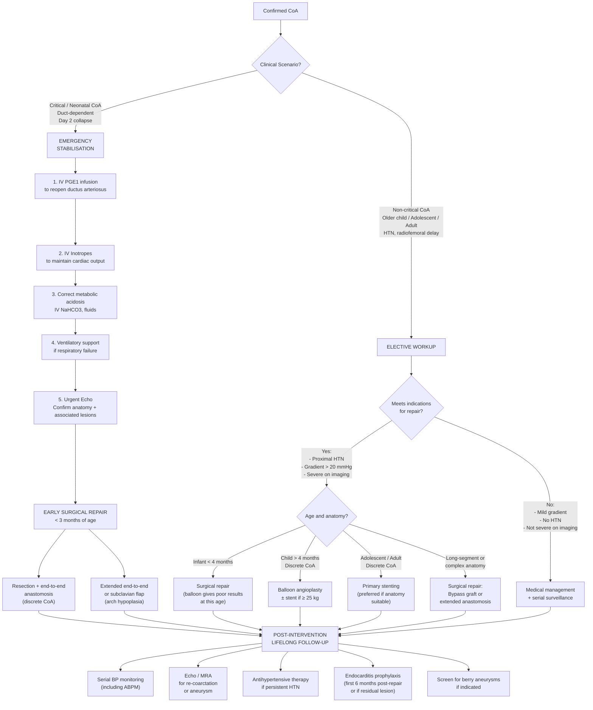

## Management of Coarctation of the Aorta

### 1. Principles of Management

Before diving into specifics, understand the overarching logic. The management of CoA is guided by **three principles**:

1. **Resuscitate** (in critical/neonatal CoA): Restore distal perfusion immediately by reopening the ductus arteriosus with prostaglandin E₁, while supporting cardiac output with inotropes.
2. **Repair** the mechanical obstruction: Either surgically or via catheter-based intervention — because no medication can fix a structural narrowing of the aorta.
3. **Follow-up lifelong**: Because CoA is never truly "cured" — ***systolic HTN may persist despite repair due to permanent alteration of arterial mechanics and physiology*** [1], and complications such as re-coarctation, aneurysm formation, and accelerated atherosclerosis require ongoing surveillance.

The management algorithm splits cleanly based on the **clinical scenario**: critical neonatal CoA vs. non-critical CoA in older children/adults.

---

### 2. Management Algorithm

---

### 3. Emergency Management of Critical Neonatal CoA

This is the **life-saving** phase. A neonate presenting with duct-dependent CoA is in **cardiogenic shock** and will die without immediate intervention.

#### 3.1 Initial Resuscitation

##### A. ***Urgent PGE₁ (Prostaglandin E₁ / Alprostadil) Infusion*** [1]

| Aspect | Detail |
|---|---|
| **Drug** | Prostaglandin E₁ (alprostadil) — "PGE₁" |
| **Mechanism** | PGE₁ acts on prostanoid EP receptors on ductal smooth muscle → **relaxation of the ductus arteriosus smooth muscle** → reopens the duct. Remember, ductal closure is triggered by falling PGE₂ levels and rising PaO₂ after birth. By providing exogenous PGE₁, you pharmacologically reverse this closure |
| **Dose** | Start at **0.05–0.1 µg/kg/min** IV continuous infusion. Can be titrated down to **0.01–0.025 µg/kg/min** once the duct is open (maintenance dose) |
| **Route** | Central or peripheral IV (ideally central line for stability). Must be continuous infusion — never bolus |
| **Response** | Improvement in lower limb perfusion (femoral pulses return), improvement in metabolic acidosis, urine output increases. Usually within **30–60 minutes** |
| **Side effects** | **Apnoea** (most dangerous — up to 12%; must have intubation equipment ready), fever, flushing, hypotension, seizures, diarrhoea. Long-term use: cortical hyperostosis (periosteal new bone formation), gastric outlet obstruction |

<Callout title="PGE₁ — The Drug That Buys Time" type="idea">
PGE₁ does **not** fix the coarctation. It merely **reopens the ductus arteriosus** so that the RV can once again supply blood to the descending aorta, buying time for definitive surgical repair. Think of it as a **bridge to surgery**. The key side effect to remember is **apnoea** — always be prepared to intubate.
</Callout>

##### B. ***Inotropes (to Maintain Cardiac Output)*** [1]

| Drug | Mechanism | When to Use |
|---|---|---|
| **Dopamine** (5–10 µg/kg/min) | Stimulates β₁ receptors on myocardium → ↑contractility and heart rate; at lower doses, also stimulates dopaminergic receptors in renal vasculature → ↑renal perfusion | First-line inotrope in neonatal cardiogenic shock |
| **Dobutamine** (5–20 µg/kg/min) | Primarily β₁ agonist → ↑contractility; less chronotropic than dopamine | If heart rate is already high and you want contractility without further tachycardia |
| **Milrinone** (0.25–0.75 µg/kg/min) | Phosphodiesterase-3 (PDE3) inhibitor → ↑intracellular cAMP → ↑contractility AND vasodilation (afterload reduction) | "Inodilator" — particularly useful because it reduces afterload (which is pathologically high in CoA) while boosting contractility |
| **Adrenaline** (0.01–0.1 µg/kg/min) | α₁ + β₁ + β₂ agonist → ↑contractility, ↑HR, vasoconstriction (at higher doses) | Rescue therapy in refractory shock |

##### C. Correct Metabolic Derangements

- **Metabolic acidosis**: ***Severe metabolic acidosis due to ischaemic colitis and AKI upon duct closure*** [1]. Correct with IV sodium bicarbonate if pH < 7.1, and restore tissue perfusion (the best way to correct lactic acidosis is to fix the underlying cause — i.e., reopen the duct).
- **Fluid resuscitation**: Cautious volume expansion (10 mL/kg normal saline boluses) — be careful not to volume-overload a failing ventricle.
- **Electrolyte correction**: Monitor and correct calcium, potassium, glucose (neonates are prone to hypoglycaemia and hypocalcaemia).

##### D. Ventilatory Support

- Intubation and mechanical ventilation may be needed if:
  - PGE₁-induced **apnoea** occurs
  - Severe pulmonary oedema from heart failure
  - Shock requiring optimisation of oxygen delivery
- **Target SpO₂**: 75–85% in duct-dependent lesions (avoid hyperoxia, which promotes ductal closure)

##### E. Timing of Definitive Repair

***Early surgical repair ( < 3 months of age)*** [1] — once the neonate is stabilised on PGE₁ + inotropes and metabolic derangements are corrected, surgical repair should be performed **as soon as feasible**, typically within days.

---

### 4. Indications for Definitive Repair

Not every patient with CoA requires immediate intervention. The ***indications for repair*** are [1]:

| ***Indication*** | Explanation |
|---|---|
| ***Proximal hypertension*** | Upper limb systolic hypertension indicates significant obstruction causing chronic LV pressure overload [1] |
| ***> 20 mmHg gradient*** | ***Peak-to-peak systolic gradient > 20 mmHg*** across the coarctation on echo or catheterisation — this is the haemodynamic threshold indicating significant obstruction [1] |
| ***Severe CoA on imaging studies*** | Even if the resting gradient is < 20 mmHg (e.g., dampened by excellent collaterals or poor LV function), anatomically severe narrowing on CTA/MRA warrants repair [1] |
| **Critical neonatal CoA** | All cases of duct-dependent CoA require urgent repair — this is not elective [1] |

<Callout title="The Gradient Caveat" type="error">
Remember from the diagnostics section: a **low gradient does NOT mean mild CoA** if collaterals are well-developed (they decompress the proximal aorta) or if LV function is poor (the LV cannot generate a high gradient). ***Severe CoA on imaging studies*** is therefore an independent indication for repair, regardless of measured gradient [1].
</Callout>

---

### 5. Surgical Repair Options

***Surgical repair*** [1] is the **primary treatment modality**, especially for neonates, infants, and patients with complex anatomy.

#### 5.1 ***Resection with End-to-End Anastomosis*** [1]

| Aspect | Detail |
|---|---|
| **Technique** | The coarcted segment is excised (resected), and the two ends of the aorta are sewn together directly (anastomosed end-to-end) |
| ***Indication*** | ***Discrete CoA*** — when the narrowing is short and focal, allowing tension-free approximation of the two ends [1] |
| **Approach** | Left posterolateral thoracotomy (through the 3rd or 4th intercostal space). The aorta is cross-clamped above and below the coarctation |
| **Advantages** | Removes all abnormal tissue (including ectopic ductal tissue); native tissue anastomosis → growth potential in children; best long-term results for discrete CoA |
| **Disadvantages** | Requires aortic cross-clamping (risk of spinal cord ischaemia if cross-clamp time prolonged); may be under tension if the gap is large after resection |
| ***Outcome*** | ***Restenosis 5–15% in surgery*** [1] |

**Why does this work?** You are physically removing the mechanical obstruction and restoring aortic continuity. By excising the segment containing ectopic ductal tissue, you eliminate the tissue that caused the coarctation in the first place.

#### 5.2 Extended End-to-End Anastomosis

| Aspect | Detail |
|---|---|
| **Technique** | The coarcted segment is resected, and the incision is extended proximally along the inferior surface of the aortic arch. The descending aorta is then brought up and anastomosed to the enlarged arch opening |
| **Indication** | CoA with ***hypoplasia of the transverse aortic arch*** [1] — the extended incision opens up the hypoplastic arch segment, and the descending aorta "patches" the deficiency |
| **Advantages** | Addresses both the discrete coarctation AND the arch hypoplasia in a single operation |
| **Disadvantages** | More extensive dissection; requires longer cross-clamp time |

#### 5.3 ***Subclavian Flap Aortoplasty*** [1]

| Aspect | Detail |
|---|---|
| **Technique** | The left subclavian artery is divided distally, opened longitudinally, and folded down as a flap to augment (widen) the coarcted aortic segment. The subclavian stump is oversewn |
| ***Indication*** | ***Long-segment CoA*** — when the narrowing is too long for primary end-to-end anastomosis but not long enough to require a bypass graft [1] |
| **Advantages** | Uses autologous (patient's own) vascular tissue → growth potential; avoids circumferential suture line (which can restrict growth) |
| **Disadvantages** | **Sacrifices the left subclavian artery** → reduced left arm perfusion (usually well-tolerated in neonates/infants due to collateral development from vertebral and thoracoacromial arteries, but may cause limb-length discrepancy or arm claudication later). Cannot reliably use left arm BP for future monitoring |
| **Largely historical** | Increasingly replaced by extended end-to-end anastomosis, which preserves the left subclavian artery |

#### 5.4 ***Bypass Graft Across Coarctation*** [1]

| Aspect | Detail |
|---|---|
| **Technique** | A prosthetic graft (Dacron or PTFE tube graft) is sewn from the proximal aorta (or left subclavian) to the descending aorta distal to the coarctation, **bypassing** the narrowed segment without removing it |
| ***Indication*** | ***Long-segment CoA too long for primary anastomosis*** [1]. Also used in **older adults** where the aorta is calcified and friable, making resection-anastomosis risky |
| **Advantages** | Avoids extensive aortic mobilisation; suitable for very long or complex coarctations; does not require excision of the coarcted segment |
| **Disadvantages** | Prosthetic graft does **not grow** with the child (so less ideal in young patients); risk of graft infection; risk of false aneurysm at anastomosis sites; does not remove the abnormal tissue (potential site for endocarditis) |

#### 5.5 Patch Aortoplasty (Historical)

| Aspect | Detail |
|---|---|
| **Technique** | The coarcted segment is incised longitudinally, and a patch (synthetic material like Dacron, or autologous pericardium) is sewn in to widen the aorta |
| **Status** | **Largely abandoned** due to unacceptably high rate of **late aneurysm formation** at the patch site (~20–40%). The patch does not have the structural integrity of native aortic wall and balloons out under systemic pressure over years |
| **Relevance** | Important to know because patients who had this repair decades ago may present with aneurysms at the patch site — a long-term complication |

#### Summary: Choosing the Surgical Technique

| Clinical Scenario | ***Preferred Surgical Technique*** |
|---|---|
| ***Discrete CoA*** | ***Resection with end-to-end anastomosis*** [1] |
| CoA + arch hypoplasia | Extended end-to-end anastomosis |
| ***Long-segment CoA*** | ***Subclavian flap aortoplasty*** (or extended end-to-end) [1] |
| ***Very long CoA, not amenable to primary anastomosis*** | ***Bypass graft across coarctation*** [1] |
| Re-coarctation or adult with calcified aorta | Bypass graft or catheter-based intervention |

---

### 6. Catheter-Based Intervention

#### 6.1 ***Balloon Angioplasty*** [1]

| Aspect | Detail |
|---|---|
| **Technique** | A balloon catheter is advanced (usually via femoral artery) to the coarctation site under fluoroscopic guidance. The balloon is inflated to a diameter matching the normal aorta proximal or distal to the coarctation, physically dilating the narrowed segment by **controlled tearing of the intima and media** |
| ***Indication*** | (1) ***Patients > 4 months with discrete coarctation*** [1]. (2) ***Re-coarctation*** (after previous surgical repair) — this is the **best indication** for balloon angioplasty, as the scar tissue responds well to dilatation [1] |
| ***Contraindication / Limitation*** | ***Generally not used for those < 4 months due to small size → poor results*** [1]. Also not suitable for long-segment hypoplasia or tortuous anatomy |
| **Advantages** | Minimally invasive; avoids thoracotomy; shorter hospital stay; repeatable |
| **Disadvantages** | Higher ***restenosis rate: 40% in young infants vs. 8% in adolescents*** [1]; risk of aortic wall injury (dissection, aneurysm formation); cannot address arch hypoplasia |

**Why does balloon angioplasty work poorly in young infants?** Several reasons:
1. The **vessels are small** — the catheter and balloon are relatively large compared to the infant's vasculature, increasing the risk of vascular injury.
2. **Ductal tissue** is still present in young infants — this tissue is elastic and tends to recoil after balloon dilatation, leading to high restenosis rates.
3. The aortic wall is **immature and thin** — more susceptible to rupture or dissection during balloon inflation.
4. Young infants more often have **arch hypoplasia** as a component, which balloon angioplasty cannot address.

#### 6.2 ***Stent Placement*** [1]

| Aspect | Detail |
|---|---|
| **Technique** | A balloon-expandable stent (metal mesh scaffold) is deployed at the coarctation site during catheterisation, holding the aorta open after balloon dilatation |
| ***Indication*** | ***Generally indicated after surgical repair or angioplasty for those ≥ 25 kg*** [1]. In practice, primary stenting is now the **preferred catheter-based approach** for native CoA in **adolescents and adults** (ESC/AHA guidelines 2020+) |
| ***Advantages*** | ***Improve luminal diameter, ↓ residual gradient*** [1]. The stent acts as a scaffold preventing elastic recoil and restenosis. Can be re-dilated as the patient grows |
| ***Disadvantages*** | ***Often require repeated planned re-intervention as the stent needs to be dilated as the child grows*** [1]. Risk of stent fracture, migration, in-stent restenosis, aortic wall injury. Not suitable for very young children (stent cannot be expanded enough to match adult aortic diameter) |
| **Types** | Bare-metal stents (most common in CoA); covered stents (used when there is concern about aortic wall injury or pre-existing aneurysm — the covering prevents perforation/rupture) |

<Callout title="Stenting vs. Surgery in 2025–2026">
Current guidelines (ESC 2020, AHA/ACC 2018, updated 2024 consensus) increasingly favour **primary stenting** for native discrete CoA in **adolescents and adults** when anatomy is suitable (discrete coarctation, no arch hypoplasia, patient ≥ 25–30 kg). The results are comparable to surgery with less morbidity, shorter hospital stay, and no thoracotomy scar. However, **surgery remains the gold standard for neonates and infants** ( < 1 year) and for complex anatomy (arch hypoplasia, long-segment disease).
</Callout>

---

### 7. Medical Management

Medical therapy is **adjunctive** — it does not fix the structural problem but addresses complications and bridges to definitive repair.

#### 7.1 Antihypertensive Therapy

| Situation | Drug Choice | Rationale |
|---|---|---|
| **Pre-operative HTN** (stabilising before repair) | **Beta-blockers** (e.g., atenolol, metoprolol) | Reduce heart rate and contractility → ↓aortic wall stress. Similar rationale as in ***aortic dissection management: antihypertensive to stabilise and prevent rupture*** [6] |
| **Post-operative / persistent HTN** | **ACE inhibitors** (e.g., enalapril, ramipril) or **ARBs** (e.g., losartan) | Target the **RAAS axis** — which is activated because the kidneys have been chronically hypoperfused. ACEi/ARBs also have proven benefits in LV remodelling and reducing LVH |
| **Acute hypertensive crisis** (paradoxical HTN post-repair, see below) | **IV esmolol** (ultra-short-acting beta-blocker) or **IV sodium nitroprusside** | Rapid, titratable BP control in the immediate post-operative period |
| **Refractory HTN** | Add **CCB** (amlodipine) or **diuretic** (hydrochlorothiazide) | Multi-drug regimen as per standard hypertension guidelines |

**Why does hypertension persist after repair?** As discussed in the pathophysiology section: ***systolic HTN may persist despite repair due to permanent alteration of arterial mechanics and physiology*** [1]. This includes vascular remodelling, baroreceptor resetting, persistent RAAS activation, and intrinsic aortopathy. Up to **30–40% of patients** remain hypertensive long-term after repair.

#### 7.2 Post-Operative Paradoxical Hypertension

This is an important and often-tested phenomenon:

| Aspect | Detail |
|---|---|
| **Definition** | Severe rebound hypertension occurring **24–72 hours after** CoA repair |
| **Mechanism** | (1) Sudden increase in perfusion pressure to the abdominal organs (especially kidneys and mesentery) → reflex sympathetic activation. (2) Baroreceptors that were "set" to high pre-operative pressures now perceive the post-operative state as hypotensive → sympathetic surge. (3) RAAS remains activated from years of renal hypoperfusion — now full aortic pressure reaches the kidneys → renin secretion continues while perfusion is restored → paradoxically high angiotensin II |
| **Consequence** | Can cause **mesenteric arteritis** (abdominal pain, GI bleeding — the mesenteric vessels have been chronically underperfused and are not accustomed to high-pressure flow), suture line disruption, and stroke |
| **Treatment** | Aggressive BP control with IV esmolol or nitroprusside in the early post-operative period. Transition to oral ACEi/ARB once stable |

#### 7.3 Endocarditis Prophylaxis

| Situation | Recommendation |
|---|---|
| **First 6 months after repair** (surgical or catheter-based) | Antibiotic prophylaxis before dental or high-risk procedures (prosthetic material is not yet endothelialised) |
| **Residual lesion after repair** (residual gradient, turbulent flow, prosthetic material) | Lifelong antibiotic prophylaxis |
| **Fully repaired with no residual lesion** (after 6 months) | Prophylaxis generally not required (ACC/AHA 2007, reaffirmed 2021) |
| **Associated bicuspid aortic valve with regurgitation** | Independent indication for prophylaxis depending on guidelines (varies; HK follows AHA recommendations) |

---

### 8. Choice of Intervention by Age and Anatomy — Summary Table

| ***Patient*** | ***Preferred Intervention*** | ***Rationale*** |
|---|---|---|
| **Neonate with critical CoA** | ***PGE₁ → early surgical repair ( < 3 months): resection + end-to-end anastomosis*** [1] | ***Balloon gives poor results < 4 months*** [1]; native tissue anastomosis allows growth |
| **Infant 4–12 months, discrete CoA** | Surgical repair (end-to-end or extended end-to-end) | Best long-term results; balloon restenosis rate still high at this age |
| **Child > 1 year, discrete CoA** | ***Balloon angioplasty ± stent*** [1] (if ≥ 25 kg for stent) or surgical repair | Both options viable; catheter-based approach increasingly preferred |
| **Adolescent/Adult, discrete native CoA** | ***Primary stenting*** (preferred if suitable anatomy, ≥ 25 kg) [1] | Comparable results to surgery with less morbidity; avoids thoracotomy |
| **Any age, long-segment CoA / arch hypoplasia** | Surgical repair: ***subclavian flap, extended end-to-end, or bypass graft*** [1] | Catheter-based approach cannot address diffuse narrowing or arch hypoplasia |
| ***Re-coarctation (any age)*** | ***Balloon angioplasty*** ± stent [1] | **Best indication for balloon angioplasty** — scar tissue responds well to dilatation; avoids redo surgery (which has higher morbidity due to adhesions) |
| **Adult with calcified/friable aorta** | Bypass graft (interposition or extra-anatomical) | Resection dangerous in calcified aorta; stenting may not be feasible if anatomy is tortuous |

---

### 9. Outcomes and Follow-Up

#### 9.1 Short-Term Outcomes

- ***Restenosis rates*** [1]:
  - ***Surgery: 5–15%*** [1]
  - ***Balloon angioplasty: 40% in young infants vs. 8% in adolescents*** [1]
- **Operative mortality**: < 1% for elective repair in older children/adults; 5–10% for neonatal emergency repair (reflecting the severity of illness at presentation)

#### 9.2 ***Long-Term Outcome: 10-year survival generally > 90%*** [1]

Despite excellent survival, these patients are **not cured**. Long-term complications include:

| ***Complication*** | Frequency | Mechanism |
|---|---|---|
| ***Re-coarctation*** | 5–15% after surgery; up to 40% after neonatal balloon [1] | Scar tissue contracture, inadequate initial repair, growth of child without proportional growth of repair site |
| ***Persistent HTN*** | 25–40% | ***Permanent alteration of arterial mechanics*** [1]: vascular remodelling, baroreceptor resetting, persistent RAAS, intrinsic aortopathy |
| ***Aortic aneurysm / dissection*** | Lifelong risk | Cystic medial necrosis in the native aortic wall; aneurysm at patch or anastomosis site; associated BAV aortopathy [1] |
| ***IHD / Stroke*** | Accelerated atherosclerosis | Chronic hypertension → premature atherosclerosis affecting coronary and cerebral vessels [1] |
| ***Arrhythmia*** | Variable | LVH → substrate for ventricular arrhythmias; long-standing HTN → atrial fibrillation [1] |
| ***Berry aneurysm rupture*** | ~10% harbour aneurysms | ***Systemic complication: berry aneurysms with rupture*** [1] |

#### 9.3 Follow-Up Protocol

| Timing | Assessment |
|---|---|
| **Immediate post-op (days)** | BP control (watch for paradoxical HTN), wound care, monitor for mesenteric arteritis |
| **Early post-op (weeks–months)** | Echo to assess repair, residual gradient, LV function |
| **Annual / Biennial** | Clinical assessment (four-limb BP, pulse examination), echo, ± ABPM |
| **Every 3–5 years (or as needed)** | ***MRA*** to assess for re-coarctation, aneurysm formation at repair site, arch anatomy [1] |
| **Lifelong** | BP management, cardiovascular risk factor modification (exercise, diet, lipid management), screening for berry aneurysms if indicated |

<Callout title="Lifelong Surveillance — The Key Message">
CoA patients need **lifelong cardiovascular follow-up**, even after successful repair. The three things you are watching for are: (1) **re-coarctation** (re-narrowing at the repair site), (2) **aneurysm formation** (at the repair site or in the ascending aorta from BAV aortopathy), and (3) **persistent/recurrent hypertension** (the most common long-term problem). MRA is the preferred serial imaging modality because it avoids cumulative radiation.
</Callout>

---

### 10. Special Considerations

#### 10.1 CoA in Pregnancy

- Pregnancy in women with repaired or unrepaired CoA is **high-risk** due to:
  - Haemodynamic stress of pregnancy on the aorta (increased cardiac output, blood volume)
  - Risk of **aortic dissection or rupture** (especially if residual CoA, aneurysm, or BAV aortopathy)
  - Risk of **hypertensive disorders of pregnancy** (pre-eclampsia is more common)
- **Pre-conception counselling** is essential: assess aortic anatomy (MRA), optimise BP, discontinue teratogenic drugs (ACEi/ARB → switch to labetalol or nifedipine)
- Delivery: vaginal delivery acceptable if well-controlled BP and no aneurysm; consider epidural to attenuate haemodynamic surges during labour. Caesarean section if aortic root > 45 mm or rapidly expanding aneurysm

#### 10.2 Exercise Recommendations

- **Post-repair with no residual obstruction**: can participate in moderate exercise; avoid intense isometric exercise (heavy weightlifting, competitive sports) — which causes acute BP surges that stress the repair site and proximal aorta
- **With residual CoA or aneurysm**: restrict to low-intensity activities
- **Exercise testing** should be performed to guide recommendations (look for exercise-induced hypertension and gradient increase)

#### 10.3 Turner Syndrome-Specific Considerations

- CoA is present in **10–20%** of Turner syndrome patients
- Turner patients have an **intrinsic aortopathy** (aortic root dilatation) independent of CoA → cumulative risk of dissection
- Serial imaging of the entire aorta (not just the repair site) is essential
- Body surface area-indexed aortic dimensions should be used (Turner patients are typically short in stature)

---

<Callout title="High Yield Summary">

**Emergency Management** [1]:
- ***Urgent PGE₁ infusion + inotropes to maintain CO*** → bridge to ***early surgical repair ( < 3 months)***
- PGE₁ reopens the ductus arteriosus; key side effect is **apnoea**

**Indications for Repair** [1]:
- ***Proximal HTN, > 20 mmHg gradient, severe CoA on imaging studies***

**Surgical Options** [1]:
- ***Resection + end-to-end anastomosis*** = discrete CoA (gold standard)
- ***Subclavian flap aortoplasty*** = long-segment CoA
- ***Bypass graft*** = long-segment CoA too long for primary anastomosis

**Catheter-Based Options** [1]:
- ***Balloon angioplasty in > 4 months with discrete CoA or re-coarctation*** (not < 4 months — poor results)
- ***Stent placement for ≥ 25 kg***: improves luminal diameter, reduces gradient, but needs re-dilatation as child grows

**Restenosis Rates** [1]:
- ***Surgery: 5–15%***
- ***Balloon: 40% young infants vs. 8% adolescents***

**Long-Term** [1]:
- ***10-year survival > 90%***
- Watch for: ***re-coarctation, persistent HTN, aortic aneurysm/dissection, IHD/stroke, arrhythmia, berry aneurysm rupture***
- ***HTN may persist despite repair*** — treat with ACEi/ARB
</Callout>

---

<ActiveRecallQuiz
  title="Active Recall - Management of CoA"
  items={[
    {
      question: "A 3-day-old neonate with critical CoA and shock is stabilised. Outline the stepwise emergency management before definitive repair.",
      markscheme: "1. IV PGE1 (alprostadil) infusion at 0.05-0.1 mcg/kg/min to reopen the ductus arteriosus and restore distal perfusion. 2. IV inotropes (dopamine or dobutamine) to maintain cardiac output. 3. Correct metabolic acidosis (IV NaHCO3 if pH < 7.1, restore perfusion). 4. Ventilatory support (intubation if apnoea from PGE1 or respiratory failure from pulmonary oedema). 5. Urgent echocardiography to confirm anatomy and plan early surgical repair within days (before 3 months of age)."
    },
    {
      question: "List three surgical techniques for CoA repair and state the specific anatomical indication for each.",
      markscheme: "1. Resection with end-to-end anastomosis: discrete (focal) coarctation at the isthmus. 2. Subclavian flap aortoplasty (or extended end-to-end anastomosis): long-segment coarctation or CoA with transverse arch hypoplasia. 3. Bypass graft across coarctation: long-segment CoA too long for primary anastomosis, or adults with calcified/friable aorta."
    },
    {
      question: "Why is balloon angioplasty generally not used for CoA in neonates less than 4 months old, and what are the restenosis rates compared to surgery?",
      markscheme: "Reasons: (1) Small vessel size increases risk of vascular injury. (2) Residual ductal tissue in the aortic wall is elastic and recoils after balloon dilatation. (3) Immature, thin aortic wall is prone to dissection or rupture. (4) Often associated with arch hypoplasia, which balloon cannot address. Restenosis rates: Balloon 40% in young infants vs 8% in adolescents; Surgery 5-15%."
    },
    {
      question: "What is post-operative paradoxical hypertension after CoA repair, and how is it managed?",
      markscheme: "Definition: Severe rebound hypertension occurring 24-72 hours after CoA repair. Mechanism: (1) Sudden restoration of high-pressure flow to previously underperfused abdominal organs triggers reflex sympathetic activation. (2) Baroreceptors reset to pre-operative high pressures perceive post-operative state as hypotensive causing sympathetic surge. (3) Persistent RAAS activation. Can cause mesenteric arteritis, suture line disruption, and stroke. Management: Aggressive IV antihypertensives (esmolol or sodium nitroprusside), then transition to oral ACEi/ARB."
    },
    {
      question: "A 20-year-old patient is 15 years post-CoA repair. What three long-term complications should be monitored for, and what is the preferred imaging modality for surveillance?",
      markscheme: "Three complications: (1) Re-coarctation at the repair site (5-15% after surgery). (2) Aneurysm formation at the repair site or ascending aorta (from associated BAV aortopathy or patch repair). (3) Persistent/recurrent hypertension (25-40% remain hypertensive due to permanent vascular remodelling). Preferred imaging: MR angiography (MRA) — no ionising radiation, excellent for serial lifelong follow-up, can assess anatomy and haemodynamics simultaneously."
    }
  ]}
/>

---

## References

[1] Senior notes: Ryan Ho Cardiology.pdf (Section 3.7.4, p190–191)
[6] Senior notes: Maksim Medicine Notes.pdf (Section 1.4 Aortic dissection, p15)
