## Complications of Ischaemic Heart Disease

### Overview and Timing

The complications of IHD — particularly of acute myocardial infarction — are a **high-yield SAQ/OSCE topic**. Understanding *when* and *why* each complication occurs is far more useful than rote memorisation.

The key principle: once myocardial necrosis occurs, the infarcted tissue undergoes a predictable sequence:
1. **Minutes to hours**: electrically unstable (→ arrhythmias)
2. **Hours to days**: necrotic tissue is soft, weak, and infiltrated by inflammatory cells (→ mechanical rupture, pericarditis)
3. **Days to weeks**: granulation tissue replaces necrotic myocardium (→ ongoing weakness, risk of aneurysm)
4. **Weeks to months**: fibrotic scar formation (→ remodelling, heart failure, chronic arrhythmias)
5. **Long-term**: adverse ventricular remodelling, ischaemic cardiomyopathy, recurrent events

<Callout title="Complications of MI — Timeline Framework">

| Timing | Complications |
|---|---|
| **Immediate (min–hours)** | Arrhythmias (VF, VT, AV block), sudden cardiac death, cardiogenic shock |
| **Early (hours–days)** | Pump failure/APO, peri-infarction pericarditis, acute MR, IV septal rupture, free wall rupture |
| **Subacute (days–weeks)** | Dressler syndrome, LV aneurysm, mural thrombus + embolism |
| **Late (weeks–months+)** | Ventricular remodelling, ischaemic cardiomyopathy, chronic HF, recurrent ischaemia |

</Callout>

---

### I. Arrhythmic Complications

***Arrhythmia: usually due to scar tissue after MI*** [1]

#### Why do arrhythmias occur after MI?

During the **acute phase** (first hours), the ischaemic/infarcted myocardium is electrically unstable because:
- Anaerobic metabolism → intracellular acidosis → **K⁺ efflux** from damaged cells + **Ca²⁺ influx** [2] → altered resting membrane potential and action potential duration
- This creates electrical heterogeneity between healthy and injured tissue → **re-entrant circuits** → VT/VF
- Autonomic imbalance: ↑sympathetic activation (pain, anxiety) promotes ectopy; vagal activation (especially in inferior MI) promotes bradycardia

During the **chronic phase**, the scar tissue from healed MI forms a fixed substrate for re-entry → risk of late VT/VF and sudden cardiac death.

#### Specific Arrhythmias [1][2]

| Arrhythmia | Mechanism | Management |
|---|---|---|
| ***Ventricular ectopics (most common)*** [1] | Electrical instability of ischaemic myocardium → premature depolarisations from irritable foci | Usually benign, no specific Rx unless frequent/sustained. Correct electrolytes (K⁺, Mg²⁺) |
| ***VT/VF (15%)*** [1] | Re-entrant circuit involving border zone between infarct and normal myocardium. **VF is the most common cause of death in the first hour after MI** | ***VF: Prompt defibrillation with reference to ACLS algorithm*** [2]. ***Stable sustained monomorphic VT: Amiodarone 150 mg IV over 10 min*** [2], lignocaine, or synchronised cardioversion if haemodynamically unstable. ***Sustained polymorphic VT: Unsynchronised cardioversion starting with 200 J*** [2] |
| ***AF/AFlutter*** | ***Common and frequently transient, can be a sign of impending or overt LVF*** [2]. Atrial stretch from ↑LA pressure (LV failure) → triggers AF | ***Digoxin, diltiazem, or amiodarone for rate/rhythm control*** [2]. Cardioversion if haemodynamic compromise |
| ***Sinus bradycardia*** | Vagal activation (Bezold-Jarisch reflex), especially in inferior MI (RCA supplies SA node in 60%) | ***Atropine 0.3–0.6 mg IV bolus. Pacing if unresponsive to atropine*** [2] |
| ***AV block*** | Inferior MI: AV node ischaemia (RCA supplies AV node in 80%) → usually transient, narrow QRS escape. Anterior MI: extensive septal necrosis (LAD supplies His bundle/bundle branches) → usually permanent, wide QRS escape, poor prognosis | ***Conservative if 1° or Mobitz type I 2° HB. Pacing if Mobitz type II 2° HB or complete HB*** [2]. ***Conservative under careful monitoring as alternative if inferior MI with narrow QRS escape rhythm and adequate rate*** [2] |
| ***PSVT*** | Re-entry involving AV node | ***Cardioversion if severe haemodynamic compromise. ATP 10–20 mg IV bolus → verapamil*** [2] |

> **Why is AV block in inferior MI more benign than in anterior MI?** In inferior MI, the block is at the AV node level (RCA territory) → the escape rhythm arises from the bundle of His (narrow QRS, rate 40-60, relatively reliable). The ischaemia is often transient and the block resolves. In anterior MI, the block is below the His (bilateral bundle branch necrosis from LAD occlusion) → the escape rhythm arises from the ventricles (wide QRS, rate 20-40, unreliable, may fail completely → asystole). This carries a far worse prognosis and almost always requires pacing.

***Other indications for temporary pacing*** [2]:
- ***Bifascicular block + 1° AVB***
- ***Alternating BBB/RBBB + alternating LAHB/LPHB***
- ***(Anterior infarct → ↑risk of sudden asystole)*** [2]

---

### II. Pump Failure and Cardiogenic Shock

#### A. Mechanism [2]

***Pump failure represents a downward spiral exacerbating myocardial ischaemia*** [2]:
- ***↓Systolic function → ↓coronary perfusion → ↓supply → ischaemia*** [2]
- ***↓Diastolic function → ↑pulmonary congestion → hypoxaemia → ischaemia*** [2]

This is a vicious cycle: ischaemia → ↓contractility → ↓CO → ↓coronary perfusion → more ischaemia → further ↓contractility → cardiogenic shock.

***Indicates extensive myocardial damage → poor prognosis*** [2]

#### B. Clinical Spectrum — Killip Classification [9]

| ***Killip Class*** | Signs | Implications |
|---|---|---|
| ***I*** | No rales or S3 | No clinical signs of HF |
| ***II*** | Rales < 50% lung field or S3, ↑JVP | Pulmonary congestion |
| ***III*** | Rales > 50% lung field | Pulmonary oedema |
| ***IV*** | SBP < 90 mmHg + peripheral vasoconstriction (oliguria, cyanosis, sweating) | Cardiogenic shock |

***Cardiogenic shock*** occurs when **≥ 40% of the LV myocardium** is non-functional (from current infarct + prior damage) [15]. Mortality is extremely high (≥ 50%) even with aggressive treatment.

#### C. Subtypes and Management [2]

| Type | Characteristics | Management |
|---|---|---|
| ***LV dysfunction (95%)*** | Normal or ↓CO with APO | ***Vasodilators (esp ACEI) if BP stable. Inotropes (dopamine → dobutamine) if ↓BP. IABP with view for catheterisation ± revascularisation*** [2] |
| ***RV dysfunction (5%)*** | ↓CO without APO, usually in **inferior MI** | ***Bedside echo: non-compressible IVC. Swan-Ganz catheter for PCWP monitoring. Volume expansion with colloids/crystalloids if low or normal PCWP*** [2] |

<Callout title="RV Infarction — A Unique Haemodynamic Trap" type="error">
In RV infarction, the RV cannot pump blood into the pulmonary circulation → ↓LV preload → ↓CO and hypotension **with clear lungs** (no pulmonary oedema because the problem is upstream). The JVP is elevated (backed up venous return). **Nitrates, diuretics, and other preload-reducing agents are CONTRAINDICATED** — they will further reduce the already inadequate LV filling and cause catastrophic hypotension. Treatment is **IV fluid resuscitation** to increase RV preload and force blood through the failing RV.
</Callout>

---

### III. Mechanical Complications

***Acute mechanical complications from MI*** [15]:
- ***Shock*** — ***Large area (~40%) myocardium involved***
- ***VSD*** — ***Transmural infarct and rupture of muscular septum***
- ***MR*** — ***Rupture of papillary head***
- ***Tamponade*** — ***Free wall rupture, myocarditis, pericarditis, iatrogenic***

***Anyone of this is high risk for mortality*** [15]

***Occurs in 0.3% of all MI patients, majority occurring in STEMI due to ↑myocardial damage. Associated with high in-hospital mortality (accounts for 10–15% of in-hospital deaths from AMI)*** [2]

#### A. Acute Mitral Regurgitation [2][15]

| Property | Detail |
|---|---|
| **Mechanism** | ***Causes: papillary muscle dysfunction or rupture, chordae rupture, or acute LV dilation or aneurysm*** [2]. ***In IHD, functional MR results from papillary muscle displacement, restricted leaflet closure, and annular dilation from LV remodelling*** [15] |
| **Timing** | ***Papillary muscle rupture: occurs 2–7 days after infarct*** [2] |
| **Which papillary muscle?** | ***Most commonly posteromedial (6–12× more common) due to single blood supply by posterior descending artery (PDA — from RCA). The anterolateral papillary muscle has dual supply from LAD and LCx, so is relatively protected*** [2] |
| **Clinical features** | ***Often poorly tolerated with APO and shock (but may be silent). Pansystolic murmur (PSM) with S3 on auscultation. Murmur may be absent if MR too severe*** [2] — because when MR is massive, the pressure gradient between LV and LA equalises rapidly → low-velocity regurgitant jet → quiet murmur |
| **Diagnosis** | ***By echo (to confirm papillary muscle disease)*** [2] |
| **Management** | ***Observe if stable (may be transient if only dysfunction). Emergency MVR with papillary muscle repair if severe*** [2] |

> **Why is the posteromedial papillary muscle so much more vulnerable?** It has a **single blood supply** (from the PDA, usually a branch of the RCA). If the RCA or PDA occludes, the entire papillary muscle becomes ischaemic and may rupture. The anterolateral papillary muscle has a **dual blood supply** (diagonal branches from LAD + obtuse marginal from LCx), providing a safety net.

#### B. Interventricular Septal Rupture (VSR) [2]

| Property | Detail |
|---|---|
| **Incidence** | ***~0.1% of MI*** [2] |
| **Timing** | ***Usually occurs in ~24h from MI but may occur in up to 2 weeks*** [2] |
| **Mechanism** | ***Usually complicates anterior MI (LAD) especially if extensive MI with poor collateral. Rupture occurs at margin of necrotic and non-necrotic myocardium*** [2] |
| **Consequence** | ***L-to-R shunting → sudden haemodynamic deterioration + new onset pansystolic murmur (PSM) radiating to the right lower sternal border (RLSB)*** [2]. ***Usually develops RV failure*** [2] |
| **DDx** | ***Differentiate from LVF leading to APO in acute MR — also with new PSM*** [2]. Key: in VSR the murmur is loudest at the RLSB and there is a "step-up" in O₂ saturation on right heart catheterisation (oxygenated blood shunting from LV → RV). In acute MR, the murmur is loudest at the apex and radiates to the axilla |
| **Diagnosis** | ***Echo, right heart catheterisation*** [2] (O₂ saturation step-up in RV/PA confirms L-to-R shunt) |
| **Management** | ***Observe with delayed surgery if stable. Emergency cardiac catheterisation followed by repair if unstable*** [2]. ***Note that surgical repair of MI-related VSD is associated with relatively high mortality*** [2] — the friable necrotic tissue makes sutures unreliable |

#### C. LV Free Wall Rupture [2]

| Property | Detail |
|---|---|
| **Incidence** | ***< 1% (uncommon), 50% occurs ≤ 5 days, > 90% occurs ≤ 2 weeks*** [2] |
| **Mechanism** | Transmural necrosis → weakening of the full-thickness ventricular wall → rupture, often at the junction of infarcted and viable myocardium |
| **Consequence — Complete rupture** | ***Blood pumped into pericardial cavity → cardiac tamponade. Usually presents with sudden profound right HF + shock followed by PEA and death*** [2] |
| **Consequence — Incomplete rupture** | ***Ventricular defect sealed by pericardial tissue and thrombus → presents with persistent/recurrent pleuritic chest pain*** [2]. This is called a "pseudoaneurysm" — the contained rupture is sealed only by pericardium (vs true aneurysm which is contained by thinned myocardial wall). Pseudoaneurysms have a high risk of subsequent complete rupture |
| **Diagnosis** | ***Should be made clinically, supported by ECG/CXR/echo features of cardiac tamponade*** [2] |
| **Management** | ***Emergency percutaneous pericardiocentesis → surgical repair if blood aspirated*** [2] |

<Callout title="Differentiating Mechanical Complications by Murmur and Haemodynamics">

| Complication | Murmur | Location | Haemodynamic Pattern |
|---|---|---|---|
| **Acute MR** | PSM | Apex → axilla | APO (pulmonary oedema), ↑↑LA pressure, ↑PCWP with tall V waves |
| **VSD** | PSM | RLSB | RV failure predominant, O₂ step-up on RHC |
| **Free wall rupture** | None (tamponade) | — | PEA, Beck's triad (hypotension, ↑JVP, muffled heart sounds) |

</Callout>

---

### IV. Pericardial Complications [2]

#### A. Peri-Infarction Pericarditis (PIP)

| Property | Detail |
|---|---|
| **Timing** | ***Common on 2nd/3rd day post-MI, occurs in 1.2% of MI patients*** [2] |
| **Mechanism** | Transmural infarction → inflammation extends to the overlying epicardium and pericardium |
| **Clinical features** | ***Development of a different pain: positional, sharp pleuritic, especially at trapezius ridge. Pericardial rub (diagnostic)*** [2] |
| **ECG** | ***New widespread ↑ST or ↓PR beyond typically anatomic regional boundary*** [2] — this helps differentiate from ongoing/recurrent ischaemia which would be territorial |
| **Management** | ***Panadol ± aspirin (650 mg Q6–8h) ± opiate-based analgesia (usually self-limited). Avoid NSAIDs/steroids 7–10 days after acute MI due to ↑risk of aneurysm/rupture*** [2] |

> **Why avoid NSAIDs/steroids early after MI?** NSAIDs (except aspirin) inhibit prostaglandin-mediated healing of the infarcted myocardium and may impair scar formation → ↑risk of thinning, aneurysm formation, and myocardial rupture. Corticosteroids also impair wound healing.

#### B. Post-MI Pericardial Effusion

***Common, occurs in ~1/3 of acute STEMI, often minimal*** [2]
- ***Usually asymptomatic and detected incidentally*** [2]
- ***Management: none except if tamponade → drainage*** [2]

#### C. Dressler Syndrome (Post-Cardiac Injury Syndrome)

| Property | Detail |
|---|---|
| **Timing** | ***In weeks/months post-MI, usually subsides in a few days*** [2] |
| **Mechanism** | ***Probably autoimmunity due to release of cardiac antigens into pericardial space*** [2] — exposed intracellular myocardial proteins (e.g. myosin) trigger an autoimmune inflammatory reaction |
| **Clinical features** | ***Persistent fever, pericarditis, pleurisy with compatible history of prior cardiac injury*** [2] |
| **Investigations** | ***Often associated with ↑inflammatory markers (↑WCC, CRP/ESR) with pericardial ± pleural effusion*** [2] |
| **Management** | ***High-dose aspirin/NSAID (e.g. indomethacin 25–50 mg TDS × 1–2 days), colchicine ± steroid*** [2] — note that by this time (weeks post-MI), the scar has matured and NSAIDs are safer to use than in the acute phase |

---

### V. Embolism [2]

| Property | Detail |
|---|---|
| **Risk factors** | ***Most common in (1) anterior STEMI (2) LAD infarct (3) large infarct with EF < 30%*** [2] |
| **Mechanism** | ***Ventricular thrombus due to wall motion abnormality/aneurysm*** [2] — akinetic or dyskinetic segments create stasis zones where thrombus forms on the damaged endocardium. ***Atrial thrombus due to AF*** [2] — another mechanism |
| **Risk of embolisation** | ***Risk of embolisation in non-anticoagulated documented LV thrombus is 10–15%*** [2] |
| **Prevention** | ***Usually indicated to start anticoagulation to prevent systemic embolisation*** [2] — therapeutic anticoagulation (typically with heparin then warfarin/DOAC) for ≥ 3–6 months if LV thrombus documented |
| **Consequences** | ***Stroke, ischaemic limb... classically occurring in 1–3 weeks after MI*** [2] |

> **Why is anterior MI the highest risk for LV thrombus?** The LAD supplies the apex and anterior wall — these are the regions most likely to become akinetic or dyskinetic after infarction. The apex is also a "stagnation point" where blood flow velocity is lowest, creating ideal conditions for thrombus formation (Virchow's triad: stasis + endothelial injury + hypercoagulability).

---

### VI. Ventricular Remodelling and Aneurysm

#### A. Ventricular Remodelling [2]

After MI, the heart undergoes structural changes to compensate for the loss of functioning myocardium. This process, called **ventricular remodelling**, is initially adaptive but ultimately maladaptive:

1. **Acute phase**: infarcted segment thins and may expand (infarct expansion)
2. **Subacute phase**: non-infarcted segments undergo compensatory hypertrophy (Frank-Starling mechanism attempts to maintain CO). Neurohormonal activation (RAAS, sympathetic nervous system) → volume retention, vasoconstriction
3. **Chronic phase**: progressive LV dilation, eccentric hypertrophy, spherical shape → ↑wall stress (Laplace's law) → further dilation → functional MR → heart failure

This is why **ACEI/ARB + β-blockers + MRA** are given post-MI — they counteract neurohormonal activation and slow/prevent adverse remodelling.

#### B. LV Aneurysm

| Property | Detail |
|---|---|
| **Definition** | A localised outpouching of the LV wall composed of thinned, scarred (fibrotic) myocardium |
| **Timing** | Develops weeks to months after transmural MI |
| **Mechanism** | Transmural scar replaces normal myocardium → thinning → paradoxical expansion (dyskinesis) during systole → aneurysm |
| **Clinical features** | Persistent HF symptoms, recurrent arrhythmias (the scar border zone is arrhythmogenic), persistent ST elevation on ECG (does not evolve further — "frozen" ST elevation), mural thrombus with embolic risk |
| **ECG clue** | ***Persistently ↑ST segment after STEMI should raise suspicion for ventricular aneurysm*** [2] |
| **Diagnosis** | Echocardiography (dyskinetic, thinned segment with aneurysmal outpouching), cardiac MRI |
| **Management** | Medical (ACEI/ARB, BB, anticoagulation if thrombus). Surgical aneurysmectomy (Dor procedure) if refractory HF or recurrent VT |

| Feature | True Aneurysm | Pseudoaneurysm |
|---|---|---|
| **Wall** | Composed of thinned, scarred myocardium | Contained by pericardium only (wall ruptured) |
| **Neck** | Wide neck | Narrow neck |
| **Rupture risk** | Low | **High** — requires urgent surgical repair |

---

### VII. Post-ACS Recurrent Ischaemia [2]

***Indicated by symptoms/ECG changes + new rise in cTn > 20% or to > 5× ULN (if normal baseline)*** [2]

| Cause | Detail |
|---|---|
| ***Post-PCI MI*** | ***Side branch occlusion (60%), stent complications, microembolisation*** [2] |
| ***Post-thrombolysis*** | ***Up to 50% have post-infarct angina (due to residual stenosis)*** [2]. ***Should consider early (6–24h) coro/PCI in all thrombolysis patients*** [2] |

**Management**: ***High risk → prompt coro/PCI + IV GPIIb/IIIa inhibitor (if dynamic ECG changes)*** [2]

---

### VIII. Sudden Cardiac Death

***Coronary artery disease accounts for 85% of cardiac arrests*** [3]:
- ***Myocardial ischaemia, AMI, prior MI with myocardial scarring*** [3]
- Most common rhythm: **VF** (80% can be reversed by defibrillation, but 10% ↓survival per minute delay) [3]

**Prevention in survivors of MI**:
- ICD implantation if LVEF ≤ 30–35%, ≥ 40 days post-MI, on optimal medical therapy, NYHA II-III, expected survival > 1 year [2]
- β-blockers (↓arrhythmia risk), ACEI/ARB (↓remodelling), revascularisation of residual ischaemia

---

### IX. Chronic Ischaemic Heart Failure (Ischaemic Cardiomyopathy)

The **end-stage** of chronic IHD — progressive LV dysfunction from cumulative ischaemic damage and adverse remodelling.

| Feature | Detail |
|---|---|
| **Mechanism** | Repeated ischaemic insults + chronic remodelling → global LV systolic dysfunction → HFrEF. May also have "hibernating myocardium" (chronically underperfused but viable tissue that could recover with revascularisation) |
| **Clinical features** | Symptoms and signs of chronic biventricular heart failure: dyspnoea, orthopnoea, PND, peripheral oedema, hepatomegaly, S3 gallop [1] |
| **Functional MR** | ***IHD causes functional mitral regurgitation through papillary muscle displacement, restricted leaflet closure, and annular dilation*** [15] — this worsens HF in a vicious cycle |
| **Management** | Guideline-directed medical therapy for HFrEF (ACEI/ARNI + BB + MRA + SGLT2i + diuretics). Assess for viable myocardium → consider revascularisation if significant viability and operable anatomy. ICD/CRT if indicated. Cardiac transplantation for end-stage — ***IHD is the 2nd commonest indication for cardiac transplantation in HK*** [2] |

---

### X. PCI and CABG Complications

#### PCI Complications [1][2]

| Category | Complications |
|---|---|
| ***Coronary artery related*** | ***Dissection, intramural haematoma, perforation, side branch occlusion*** [2]. ***ALL can lead to myocardial ischaemia or infarction*** [2] |
| ***Stent-related*** | ***Stent thrombosis (1–2%): acute event, usually presents with severe STEMI or cardiac death*** [2]. ***In-stent restenosis (ISR): chronic event, usually presents with recurrent stable angina, usually ≥ 6–9 months after stenting*** [2] |
| ***Access-related*** | ***Pseudoaneurysm, bleeding, infection, atheroembolism*** [1][2] |
| ***Systemic*** | ***AKI (contrast, haemodynamic instability, atheroembolism), stroke, bacteraemia*** [2] |

#### CABG Complications [1]

| Complication | Detail |
|---|---|
| ***Mortality 1–2%*** [1] | |
| ***AF 30%*** in first week [1] | Most common arrhythmia post-CABG (pericardial inflammation, atrial stretch) |
| ***Peri-operative stroke 2.5%*** | ***Microembolisation of gaseous and particulate matter*** [1] |
| ***Peri-operative MI*** [1] | Graft occlusion or incomplete revascularisation |
| ***Post-op low cardiac output syndrome (LCOS)*** | ***Due to ventricular dysfunction*** [1] |
| ***Graft occlusion*** | ***May require PCI to graft / re-CABG*** [1]. Vein grafts: ~5–10% fail within 30 days, then ~1–2%/year for 6 years, then ~5%/year [2] |
| ***Wound infection / mediastinitis*** [1] | Especially in diabetics, obese patients |

---

### Summary Diagram — Complications of MI by Timing

```mermaid
graph TD
    A["Acute Myocardial Infarction"] --> B["Immediate: Minutes to Hours"]
    B --> B1["VF / VT / Sudden Cardiac Death"]
    B --> B2["Sinus Bradycardia / AV Block"]
    B --> B3["Cardiogenic Shock"]
    
    A --> C["Early: Hours to Days"]
    C --> C1["Pump Failure / APO"]
    C --> C2["Peri-infarction Pericarditis"]
    C --> C3["Acute MR: Papillary Muscle Rupture"]
    C --> C4["IV Septal Rupture: VSD"]
    C --> C5["Free Wall Rupture: Tamponade"]
    
    A --> D["Subacute: Days to Weeks"]
    D --> D1["Dressler Syndrome"]
    D --> D2["LV Thrombus + Systemic Embolism"]
    D --> D3["LV Aneurysm Formation"]
    D --> D4["Post-infarct Angina"]
    
    A --> E["Late: Weeks to Months"]
    E --> E1["Ventricular Remodelling"]
    E --> E2["Ischaemic Cardiomyopathy + HFrEF"]
    E --> E3["Chronic Arrhythmias + SCD Risk"]
    E --> E4["Functional MR"]
```

---

<Callout title="High Yield Summary — Complications of IHD">

1. **Arrhythmias** are the most common early complication. VF is the #1 cause of death in the first hour. AV block in inferior MI is usually transient; in anterior MI it is ominous
2. **Pump failure** creates a vicious cycle: ↓CO → ↓coronary perfusion → more ischaemia → ↓CO. Killip class IV = cardiogenic shock (SBP < 90, peripheral vasoconstriction)
3. ***Acute mechanical complications (VSD, papillary muscle rupture, free wall rupture)*** are rare but lethal — ***anyone of these is high risk for mortality*** [15]. They occur in STEMI, typically days 2–7
4. **Papillary muscle rupture**: posteromedial > anterolateral (6–12×) because of single blood supply from PDA. Causes acute severe MR → APO
5. **VSR**: anterior MI > inferior MI. New PSM at RLSB + RV failure. DDx from acute MR by murmur location and O₂ step-up on RHC
6. **Free wall rupture**: PEA + tamponade = sudden death. Incomplete rupture → pseudoaneurysm (narrow neck, high rupture risk)
7. **Pericardial complications**: PIP (day 2–3, pericardial rub, avoid NSAIDs early), Dressler (weeks later, autoimmune, treat with aspirin/NSAID/colchicine)
8. **LV thrombus**: most common in anterior MI with EF < 30%. Risk of systemic embolism 10–15% if not anticoagulated
9. **Persistent ST elevation** after STEMI → suspect LV aneurysm
10. **Ischaemic cardiomyopathy**: end-stage of chronic IHD with HFrEF, functional MR, and risk of sudden death. ***IHD causes functional MR through papillary muscle displacement, restricted leaflet closure, and annular dilation*** [15]

</Callout>

---

<ActiveRecallQuiz
  title="Active Recall - Complications of IHD"
  items={[
    {
      question: "Explain why the posteromedial papillary muscle is 6-12 times more likely to rupture than the anterolateral papillary muscle after MI.",
      markscheme: "The posteromedial papillary muscle has a single blood supply from the posterior descending artery (branch of RCA in right-dominant circulation). If the PDA is occluded in inferior/posterior MI, the entire papillary muscle becomes ischaemic. The anterolateral papillary muscle has dual blood supply from diagonal branches of the LAD and obtuse marginal branches of the LCx, providing collateral protection. Loss of one supply is partially compensated by the other."
    },
    {
      question: "A patient develops sudden haemodynamic deterioration, new pansystolic murmur at the RLSB, and signs of RV failure 48 hours after anterior STEMI. What is the likely diagnosis, and how would you confirm it?",
      markscheme: "IV septal rupture (post-MI VSD). Confirm by echocardiography (showing the septal defect and L-to-R shunt) and/or right heart catheterisation (demonstrating an oxygen saturation step-up in the RV/PA compared to RA, confirming left-to-right shunting). DDx is acute MR (papillary muscle rupture) but that has PSM at apex with APO rather than RV failure."
    },
    {
      question: "Why are AV blocks in inferior MI generally more benign than those in anterior MI? Explain the anatomical and electrophysiological basis.",
      markscheme: "In inferior MI (RCA territory), the AV node is ischaemic (RCA supplies AV node in 80%). The block is at the nodal level, the escape rhythm arises from the bundle of His (narrow QRS, rate 40-60 bpm, relatively reliable), and the ischaemia is often transient. In anterior MI (LAD territory), the block is infranodal due to bilateral bundle branch necrosis (LAD supplies the His bundle and proximal bundle branches via septal perforators). The escape rhythm is ventricular (wide QRS, rate 20-40 bpm, unreliable, may fail leading to asystole). This is usually permanent and carries a much worse prognosis."
    },
    {
      question: "A post-MI patient develops fever, pleuritic chest pain, and pericardial effusion 4 weeks after the event. What is the diagnosis, what is the mechanism, and how do you treat it?",
      markscheme: "Dressler syndrome (post-cardiac injury syndrome). Mechanism: autoimmune reaction triggered by release of intracellular cardiac antigens (e.g. myosin) from necrotic myocardium into the pericardial space, provoking an immune-mediated pericarditis. Ix: raised inflammatory markers (WCC, CRP/ESR), pericardial and possibly pleural effusion on echo/CXR. Treatment: high-dose aspirin or NSAID (e.g. indomethacin 25-50 mg TDS), colchicine, plus or minus corticosteroids if refractory. NSAIDs are safer at this stage (4 weeks) as scar maturation is underway."
    },
    {
      question: "Why is RV infarction a contraindication to nitrates, and how should the hypotension be managed?",
      markscheme: "In RV infarction, the failing RV cannot pump adequate blood through the pulmonary circulation to fill the LV. Cardiac output is critically dependent on RV preload. Nitrates cause venodilation, reducing venous return (preload), which further decreases the already inadequate LV filling and can cause catastrophic hypotension. Management: IV fluid resuscitation (colloids or crystalloids) to increase RV preload and maintain forward flow. Avoid all preload-reducing agents (nitrates, diuretics, morphine). Inotropes (dobutamine) if fluids alone are insufficient."
    }
  ]}
/>

---

## References

[1] Senior notes: Maksim Medicine Notes.pdf (Sections 1.3, Complications of MI, PCI, CABG, pp.10–14)
[2] Senior notes: Ryan Ho Cardiology.pdf (Sections 3.2, Complications of MI, PCI and CABG complications, pp.124–144)
[3] Senior notes: Ryan Ho Critical Care.pdf (Section 1.5, Cardiac Arrest, p.28)
[9] Senior notes: Ryan Ho Fundamentals.pdf (HF diagnosis and staging, Killip class, p.217)
[15] Lecture slides: Cardiac Surgery Tutorial_Prof. D Chan.pdf (pp.31, 43 — Mechanical complications of MI, functional MR)
