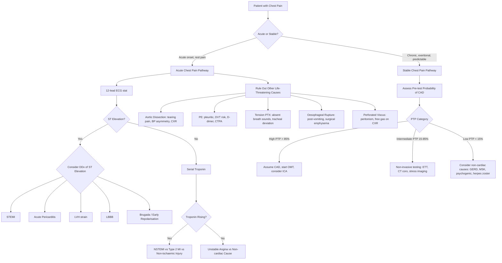

## Differential Diagnosis of Ischaemic Heart Disease

### The Core Problem: "Is This Chest Pain From IHD?"

When a patient presents with chest pain — or indeed dyspnoea, syncope, or fatigue — the clinician's first job is to decide **where on the spectrum** the symptom falls. The differential diagnosis of IHD is really two intertwined questions:

1. **Is this chest pain cardiac or non-cardiac?** (i.e. Is the symptom due to myocardial ischaemia at all?)
2. **If cardiac, what is the specific aetiology?** (i.e. Is it atherosclerotic CAD, vasospasm, myocarditis, pericarditis, aortic disease, etc.?)

The approach differs depending on whether the presentation is **acute** (ACS picture — pain at rest, haemodynamic instability) or **chronic/stable** (predictable exertional symptoms) [2][9].

> The key teaching point: **you must rule out life-threatening mimics before settling on a diagnosis of IHD**. An aortic dissection misdiagnosed as ACS and treated with anticoagulation + antiplatelets is a catastrophe. A PE missed because "the ECG looks ischaemic" can be fatal. Always keep the differential broad initially, then narrow systematically.

---

### A. Differential Diagnosis of Acute Chest Pain (ACS Mimics)

When a patient presents with **acute chest pain**, the differential must include all potentially life-threatening causes. These are the "big five" emergencies plus other important differentials [1][2][9]:

#### Life-Threatening Differentials

| Diagnosis | Key Distinguishing Features | Why It Mimics ACS |
|---|---|---|
| ***Acute coronary syndrome*** | Dull/crushing central chest pain > 20 min, radiation to jaw/arm, ↑troponin, ECG changes (ST elevation/depression, T wave inversion) [2] | — (this IS the diagnosis being considered) |
| ***Aortic dissection*** | ***Sudden onset, maximal at onset*** "tearing" pain ***radiating to the back*** [1][9]. Asymmetric BP or pulses. Widened mediastinum on CXR. Often in setting of poorly controlled HTN, Marfan's, bicuspid aortic valve | Can cause ECG changes if dissection extends to involve coronary ostia (typically RCA → inferior ST elevation). **Critical to exclude before giving antiplatelets/anticoagulants** |
| ***Acute pulmonary embolism*** | Acute pleuritic chest pain, dyspnoea, haemoptysis, tachycardia. Risk factors: immobilisation, surgery, DVT, malignancy. ECG: sinus tachycardia, S1Q3T3, RBBB [11]. D-dimer, CTPA | Can cause troponin rise (RV strain), ST changes, chest pain — mimics NSTEMI. Massive PE causes crushing central chest pain and collapse, mimicking STEMI |
| ***Tension/massive pneumothorax*** | ***Sudden onset***, pleuritic, unilateral. Tracheal deviation, absent breath sounds, hyperresonance. Young thin male (primary) or underlying lung disease (secondary) | Acute chest pain + dyspnoea + tachycardia can initially suggest ACS |
| ***Oesophageal rupture (Boerhaave's)*** | Severe retrosternal pain after forceful vomiting, subcutaneous emphysema, pneumomediastinum on CXR [1] | Retrosternal pain can mimic ACS, but history of vomiting and surgical emphysema are key |

<Callout title="Aortic Dissection — The Most Dangerous Mimic" type="error">
***Target Hx and PE to rule out other life-threatening emergencies: aortic dissection, pulmonary embolism, tension pneumothorax, perforated peptic ulcer / esophagus*** [1]. Aortic dissection can produce ST elevation (when the dissection flap occludes a coronary ostium), elevated troponin, and haemodynamic instability — perfectly mimicking a STEMI. If you give thrombolysis, dual antiplatelets, or anticoagulation to a patient with aortic dissection, the bleeding is often fatal. **Always ask about tearing/ripping pain maximal at onset radiating to the back, check for pulse/BP asymmetry, and look for a widened mediastinum on CXR before committing to an ACS pathway.**
</Callout>

#### Other Cardiac Differentials

| Diagnosis | Key Distinguishing Features | Why It Mimics IHD |
|---|---|---|
| ***Myopericarditis ± cardiac tamponade*** | Sharp, pleuritic chest pain ***better when sitting up and leaning forward, worse lying supine*** [1]. Diffuse concave ST elevation + PR depression on ECG (vs convex ST elevation in STEMI). Pericardial rub on auscultation. Recent viral illness. ± Tamponade (Beck's triad: hypotension, elevated JVP, muffled heart sounds) [1] | ST elevation can mimic STEMI. Troponin may rise if myocarditis is present. But the pattern of ST elevation is diffuse (not territorial), and PR depression is characteristic |
| **Takotsubo cardiomyopathy** ("stress cardiomyopathy") | Typically post-menopausal women after intense emotional or physical stress. ST elevation (often anterior leads), ↑troponin, apical ballooning on echo, but **normal coronary arteries** on angiography. Resolves spontaneously | Perfectly mimics anterior STEMI clinically and on ECG. Diagnosed only after coronary angiography shows patent arteries |
| ***Acute decompensated heart failure*** | Dyspnoea, orthopnoea, PND, ↑JVP, bilateral crepitations, S3 gallop. May be precipitated by ACS but also by many other causes. ↑BNP/NT-proBNP [1] | May coexist with ACS (ACS is a common precipitant of acute HF). Dyspnoea alone in an elderly patient could be ACS ("angina equivalent") or primary HF |

#### Non-Cardiac Differentials of Acute Chest Pain

| Diagnosis | Key Distinguishing Features | Why It Mimics IHD |
|---|---|---|
| **Pneumonia** | Productive cough, fever, pleuritic pain, consolidation on CXR, ↑WCC/CRP | Chest pain + dyspnoea + tachycardia can suggest ACS, especially if ECG shows non-specific ST-T changes (type 2 MI can occur secondary to sepsis) |
| **GERD / Oesophageal spasm** | ***Retrosternal burning*** [9], a/w meals, relieved by antacids, ± dysphagia. Oesophageal spasm can respond to nitrates (confusing!) [1] | Retrosternal burning pain that responds to nitrates can be mistaken for angina. Key: oesophageal spasm is typically not exertion-related |
| **Musculoskeletal pain / Costochondritis** | ***Pain reproduced by palpation or specific movement*** [9], sharp, localised, a/w inspiration | Point tenderness and reproducibility with movement distinguishes it, but ACS can coexist with chest wall tenderness — don't be falsely reassured |
| **Panic attack** | Palpitations, sweating, tremor, chest tightness, SOB, paraesthesia (hyperventilation → respiratory alkalosis → ↓ionised Ca²⁺ → tingling), fear of dying [12]. Diagnosis of exclusion | Chest pain + palpitations + diaphoresis + fear of dying mimics ACS almost perfectly. Must always exclude organic causes first |
| ***Perforated peptic ulcer*** | Sudden-onset severe epigastric/abdominal pain, board-like rigidity, peritonism, free gas under diaphragm on erect CXR [1] | Epigastric pain can be referred upwards and confused with inferior MI. A perforated ulcer can cause vagal responses (bradycardia, sweating) that mimic inferior STEMI |

---

### B. Differential Diagnosis of Stable/Chronic Chest Pain

For patients with **recurrent, predictable chest discomfort**, the differential is different [2][9]:

| Category | Diagnoses | Key Distinguishing Features |
|---|---|---|
| **Cardiac — Atherosclerotic** | ***Stable angina from CAD*** | Reproducible exertional chest discomfort, relieved by rest/GTN ≤ 5 min, typical quality [2] |
| **Cardiac — Non-atherosclerotic** | ***Vasospastic (Prinzmetal's) angina*** | Rest angina (often nocturnal), transient ST elevation during pain, normal coronaries or non-critical stenosis. Responds dramatically to CCBs and nitrates. ***Cocaine-associated vasospasm*** similar mechanism [1] |
| | **Microvascular angina (cardiac syndrome X)** | Typical angina with evidence of ischaemia on stress testing but angiographically normal epicardial coronary arteries. More common in women. Thought to be due to endothelial dysfunction of small intramyocardial vessels |
| | **Aortic stenosis / HCMP** | Exertional angina due to ↑myocardial O₂ demand (↑wall stress, ↑LV mass) outstripping supply. Ejection systolic murmur. Echo confirms diagnosis [2] |
| **Pulmonary** | ***Subacute/chronic PE*** | Pleuritic pain, dyspnoea, risk factors for VTE. Sinus tachycardia ± S1Q3T3 on ECG [2][11] |
| | **Pulmonary hypertension** | Exertional chest pain (RV subendocardial ischaemia due to ↑RV wall stress) [13], exertional syncope, progressive dyspnoea, loud P2. RV heave |
| | **Malignancy with chest wall/pleural involvement** | Persistent, progressive pain, ± pleural effusion, weight loss, night sweats |
| **GI** | ***GERD*** | ***Retrosternal burning, worse after meals/lying down, relieved by antacids*** [1][9] |
| | **Peptic ulcer disease** | Epigastric pain related to meals, ± N/V, haematemesis, melaena [1] |
| **Musculoskeletal** | **Costochondritis, rib trauma** | ***Localised, sharp, reproducible with palpation or specific movement*** [1] |
| **Neurological** | **Herpes zoster (shingles)** | Dermatomal pain ± vesicular rash. Can cause severe unilateral chest wall pain before rash appears (pre-herpetic neuralgia) [2] |
| **Psychological** | ***Panic disorder / psychogenic chest pain*** | Chest tightness, palpitations, hyperventilation, paraesthesia. Diagnosis of exclusion [12] |

---

### C. Differential Diagnosis of Raised Troponin (Not All Troponin = ACS!)

This is a critical clinical concept. A raised troponin indicates **myocardial injury** but NOT necessarily acute plaque-related MI. Consider [2]:

| Category | Conditions |
|---|---|
| **Ischaemic (Type 1 MI)** | ACS due to plaque rupture/erosion with thrombus |
| **Ischaemic (Type 2 MI)** | Supply-demand mismatch from tachyarrhythmia, severe anaemia, hypotension/shock, hypertensive crisis, respiratory failure, coronary spasm |
| **Non-ischaemic myocardial injury** | Myocarditis, takotsubo cardiomyopathy, heart failure, cardiac contusion, pulmonary embolism, aortic dissection, cardiotoxic drugs, post-PCI/CABG |
| **Systemic** | Renal failure (commonest non-cardiac cause — impaired clearance), sepsis/critical illness, stroke/SAH [2] |

> ***N.B. ↑cTn (troponin leak) in other conditions: Other ischaemia: tachycardia, coronary spasm, PCI or cardiothoracic surgery, hypoxia or hypotension. Other myocardial injury: myocarditis, heart failure, takotsubo cardiomyopathy, pulmonary embolism, aortic dissection, other cardiomyopathy (eg. infiltrative), cardiotoxins. Systemic diseases, eg. renal failure, sepsis, critical illness, stroke, SAH*** [2]

<Callout title="Troponin Is Not a Diagnosis" type="error">
A common mistake is treating every raised troponin as ACS and rushing to the cath lab. **Troponin is a marker of myocardial injury, not a specific marker of coronary thrombosis.** You must integrate the troponin result with the clinical context (history, ECG, risk factors) to determine whether this is Type 1 MI (needs DAPT + possible PCI), Type 2 MI (needs treatment of the underlying cause), or non-ischaemic myocardial injury (needs disease-specific management). Giving dual antiplatelets to a patient with troponin rise from sepsis-related Type 2 MI is inappropriate and potentially harmful.
</Callout>

---

### D. Differential Diagnosis of ST Elevation on ECG

***DDx of ST elevation*** [1]:

| Diagnosis | ECG Pattern | Key Distinguishing Feature |
|---|---|---|
| ***STEMI*** | ***Convex ST elevation, associated with Q waves***, in a territorial distribution with reciprocal changes [1] | Clinical context: acute chest pain, ↑troponin |
| ***Acute pericarditis*** | ***Diffuse concave ST elevation and PR depression*** [1] | Diffuse (non-territorial), concave ("saddle-shaped"), PR depression (except aVR where PR is elevated), no reciprocal ST depression, no Q waves |
| ***LVH with strain pattern*** | ***Concave ST elevation in V1–V3, associated with LVH features*** (tall R in V5–V6, deep S in V1–V2) [1] | Chronic — does not change over time. No troponin rise |
| ***LBBB*** | Discordant ST changes (ST elevation in leads with predominantly negative QRS) [1] | Wide QRS > 120 ms, QS in V1, broad notched R in V5–V6. Apply Sgarbossa criteria to assess for acute MI in the setting of LBBB |
| **Brugada syndrome** | Coved or saddle-back ST elevation in V1–V3 | No troponin rise, characteristic pattern, a/w syncope/SCD |
| **Early repolarisation** | Concave ST elevation, often with J-point elevation and "fish-hook" morphology | Common in young healthy individuals. No symptoms. Benign (usually) |
| **Ventricular aneurysm** | Persistent ST elevation in the territory of a prior MI | ***Persistently ↑ST segment after STEMI should raise suspicion for ventricular aneurysm*** [2]. Old pathological Q waves in the same leads |

---

### E. Systematic Approach to the Differential Diagnosis — Clinical Algorithm

---

### F. How to Differentiate — Key Discriminating Features by History

The mnemonic-driven history approach helps differentiate causes efficiently:

| OPQRST Feature | Favours IHD | Favours Non-IHD |
|---|---|---|
| **Onset** | ***ACS: minutes to develop; Stable: gradual, proportional to exertion*** [9] | ***Sudden onset, maximal at onset*** → aortic dissection, PTX, massive PE [9] |
| **Provocation** | ***Exertion, emotion, cold, heavy meals ("4Es": Eating, Exertion, Emotion, Environment)*** [9] | ***Pain after exertion*** → musculoskeletal. ***A/w specific movement or palpation*** → MSK. ***A/w meals, lying down*** → GERD [9] |
| **Quality** | ***Dull, constricting, choking, "heavy"*** [9] | ***Sharp, stabbing, pleuritic*** → PE, PTX, pericarditis. ***Tearing*** → aortic dissection. ***Burning*** → GERD [9] |
| **Radiation** | ***Arms (esp left), jaw, neck*** [9] | ***Back (interscapular)*** → aortic dissection. ***Dermatomal*** → herpes zoster |
| **Severity** | Stable: moderate. ACS: more severe [9] | ***Very severe, "worst ever"*** → dissection, massive PE, PTX |
| **Timing** | Stable: ***< 2–10 min, relieved by rest/GTN ≤ 5 min*** [9]. ACS: ***> 30 min, not relieved by rest*** [9] | ***Sharp, "catching" a/w breathing, coughing*** → pleuritic/pericardial [9]. ***A/w specific movement*** → MSK [9] |
| **Associated features** | ***Autonomic features (diaphoresis, N/V) in ACS*** [9]. ***SOB, syncope, dizziness = angina equivalent esp in elderly and DM*** [9] | Cough, fever → pneumonia. Haemoptysis → PE. Dysphagia → oesophageal. Rash → herpes zoster |

---

### G. Special Differential: Cardiac Causes of Angina Without Coronary Atherosclerosis

These are crucial to recognise because they require different management [1]:

| Condition | Mechanism | Key Clinical Clue |
|---|---|---|
| **Vasospastic (Prinzmetal's) angina** | Focal coronary artery smooth muscle spasm → transient transmural ischaemia | Rest angina (often nocturnal, early morning), **transient ST elevation during pain** that resolves completely. Normal or non-critical stenosis on angiography. Responds to CCBs, not β-blockers (β-blockers may worsen vasospasm — unopposed α-receptor stimulation) |
| **Cocaine-induced coronary vasospasm** | Sympathomimetic → ↑HR, ↑BP, coronary vasoconstriction via α-adrenergic stimulation + direct smooth muscle toxicity + accelerated atherosclerosis | Young patient, recreational drug use history, may present with frank STEMI. **Do NOT give β-blockers** (unopposed α stimulation worsens vasospasm) — use benzodiazepines, nitrates, CCBs |
| **Microvascular angina (syndrome X)** | Endothelial dysfunction of small intramural coronary vessels | Typical angina + ischaemia on stress testing + **normal epicardial arteries** on angiography. More common in women, diabetics |
| **SCAD (Spontaneous Coronary Artery Dissection)** | Intimal tear → intramural haematoma → true lumen compression | Young women (often peri-partum), fibromuscular dysplasia. Presents as ACS. Diagnosed on angiography (characteristic smooth tapering/string of pearls appearance) |
| **Takotsubo cardiomyopathy** | Catecholamine-mediated myocardial stunning (apical ballooning) | Post-menopausal women, intense emotional/physical stress. Mimics anterior STEMI. **Normal coronaries on angiography**, classic apical ballooning on echo/ventriculography |

---

### H. Differential Diagnosis of Dyspnoea as an IHD Presentation

When IHD presents with dyspnoea rather than chest pain (angina equivalent), the DDx of dyspnoea itself becomes important [1]:

| Category | Differentials |
|---|---|
| **Cardiac** | CHF (from IHD or other cause), ACS, arrhythmia, valvular heart disease, pericardial disease |
| **Respiratory — Acute** | PE, pneumothorax, asthma exacerbation, AECOPD, acute pulmonary oedema |
| **Respiratory — Subacute** | Pneumonia, pleural effusion, TB |
| **Respiratory — Chronic** | COPD, ILD, malignancy |
| **Metabolic** | Anaemia, metabolic acidosis (e.g. DKA — Kussmaul breathing), thyrotoxicosis |
| **Neuromuscular** | Myasthenia gravis, GBS, stroke |
| **Psychological** | Panic disorder, hyperventilation syndrome |

---

<Callout title="High Yield Summary — Differential Diagnosis of IHD">

1. **Acute chest pain DDx**: The "big five" life-threatening causes = ACS, aortic dissection, PE, tension PTX, oesophageal rupture. Always rule these out before settling on a diagnosis
2. **Aortic dissection** is the most dangerous mimic — tearing pain maximal at onset, back radiation, BP/pulse asymmetry. Must exclude before giving antiplatelets or anticoagulation
3. **PE** can cause troponin rise (RV strain) and ECG changes (S1Q3T3, RBBB) mimicking ACS [11]
4. **Stable chest pain DDx**: IHD, chronic PE, pulmonary HTN, malignancy, GERD, MSK pain, psychogenic, herpes zoster [2]
5. **Not all troponin rises = ACS**: Type 2 MI (supply-demand mismatch), myocarditis, PE, HF, takotsubo, renal failure, sepsis all cause troponin elevation [2]
6. **DDx of ST elevation**: STEMI (convex, territorial, reciprocal changes), pericarditis (diffuse concave, PR depression), LVH strain (V1–V3, chronic), LBBB, Brugada, early repolarisation, ventricular aneurysm [1]
7. **Non-atherosclerotic angina**: Prinzmetal's vasospasm (rest, nocturnal, transient ST elevation), microvascular angina (normal coronaries), SCAD (young women), takotsubo (stress, post-menopausal), cocaine (young, illicit drug use) [1]
8. **Angina equivalents**: dyspnoea, syncope, fatigue — especially in elderly, diabetics, women — must prompt consideration of IHD even without classic chest pain [9]

</Callout>

---

<ActiveRecallQuiz
  title="Active Recall - Differential Diagnosis of IHD"
  items={[
    {
      question: "Name the five life-threatening differentials of acute chest pain and give one key distinguishing feature for each.",
      markscheme: "(1) ACS: dull/crushing, > 20 min, troponin rise, territorial ECG changes. (2) Aortic dissection: tearing pain maximal at onset, back radiation, BP/pulse asymmetry. (3) PE: pleuritic, DVT risk factors, S1Q3T3, D-dimer/CTPA. (4) Tension pneumothorax: sudden onset, absent breath sounds, tracheal deviation, hyperresonance. (5) Oesophageal rupture (Boerhaave): post-vomiting, subcutaneous emphysema, pneumomediastinum."
    },
    {
      question: "A 55-year-old woman presents with acute crushing chest pain and ST elevation in V1-V4. Troponin is mildly elevated. Coronary angiography shows normal coronary arteries. What is the most likely diagnosis and what is the characteristic echocardiographic finding?",
      markscheme: "Takotsubo (stress) cardiomyopathy. Characteristic echo finding: apical ballooning with preserved or hyperkinetic basal segments. Typically occurs in post-menopausal women after intense emotional or physical stress."
    },
    {
      question: "List four causes of raised troponin that are NOT due to Type 1 MI (acute plaque rupture).",
      markscheme: "Any four from: Type 2 MI (tachyarrhythmia, anaemia, hypotension, respiratory failure), myocarditis, takotsubo cardiomyopathy, heart failure, pulmonary embolism, aortic dissection, post-PCI/CABG, renal failure, sepsis, stroke/SAH, cardiac contusion, cardiotoxic drugs."
    },
    {
      question: "Explain why beta-blockers are contraindicated in cocaine-induced coronary vasospasm.",
      markscheme: "Cocaine causes coronary vasospasm via alpha-adrenergic stimulation. Beta-blockers block beta-2 vasodilatory receptors in coronary arteries, leaving alpha-adrenergic vasoconstriction unopposed, which worsens coronary vasospasm and can precipitate further ischaemia. Use benzodiazepines, nitrates, and CCBs instead."
    },
    {
      question: "How do you differentiate ST elevation from STEMI vs acute pericarditis on ECG?",
      markscheme: "STEMI: convex ST elevation in a territorial distribution (corresponding to a coronary artery territory) with reciprocal ST depression in opposite leads, progresses to Q waves. Pericarditis: diffuse concave (saddle-shaped) ST elevation in multiple non-territorial leads, PR depression (except aVR where PR is elevated), no reciprocal ST depression, no Q wave development."
    }
  ]}
/>

---

## References

[1] Senior notes: Maksim Medicine Notes.pdf (Sections 1.1 and 1.3, Chest Pain DDx and IHD, pp.5, 7, 10)
[2] Senior notes: Ryan Ho Cardiology.pdf (Sections 2.1, 3.2, Chest Pain, CAD, ACS approach, pp.54–58, 115, 128, 131)
[9] Senior notes: Ryan Ho Fundamentals.pdf (Section 3.1.1, Chest Pain and Angina Pectoris, pp.199–203)
[11] Senior notes: Ryan Ho Haemtology.pdf (VTE and PE, p.131)
[12] Senior notes: Ryan Ho Psychiatry.pdf (Panic Disorder, p.179)
[13] Senior notes: Ryan Ho Respiratory.pdf (Pulmonary Hypertension, p.138)
