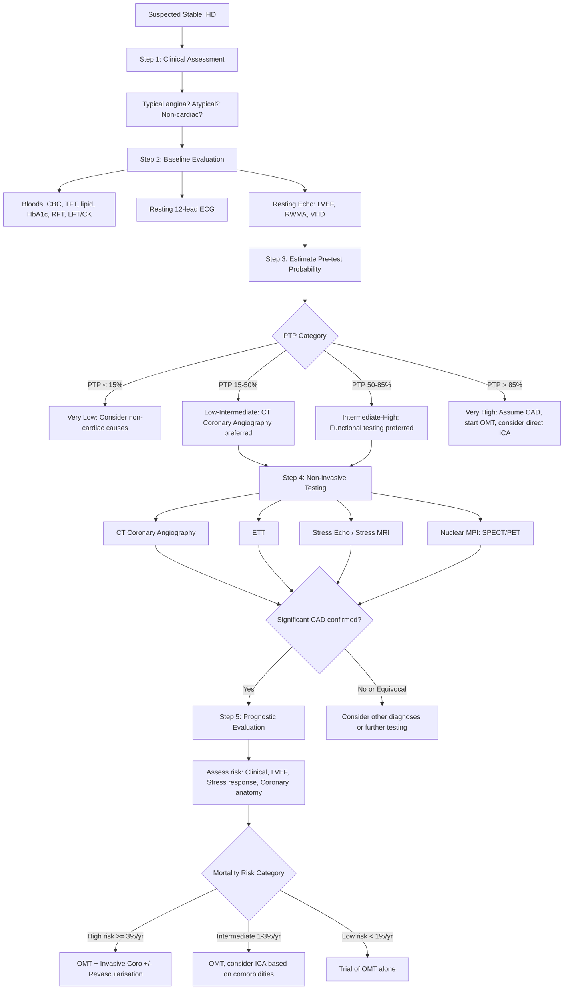
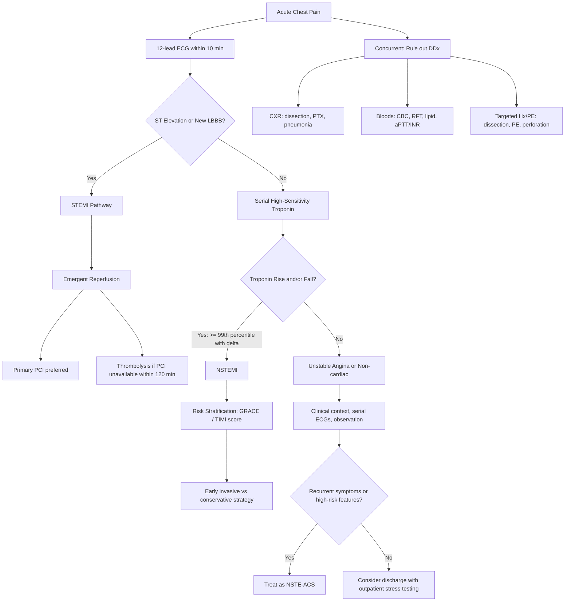

## Diagnostic Criteria, Diagnostic Algorithm and Investigation Modalities for IHD

### A. Diagnostic Criteria

The diagnostic framework for IHD depends on where on the clinical spectrum the patient sits: **stable angina / chronic coronary syndrome** vs **acute coronary syndrome (ACS)**.

---

#### 1. Diagnostic Criteria for Stable Angina (Chronic Coronary Syndrome)

There is no single laboratory "diagnostic test" for stable angina in the way that troponin defines MI. Instead, the diagnosis is established by integrating:

1. **Clinical assessment**: history consistent with typical angina (retrosternal, dull/constricting, provoked by exertion/emotion, relieved by rest or GTN ≤ 5 min) [2]
2. **Pre-test probability (PTP)** of obstructive CAD based on age, sex, symptom type, and risk factors [2]
3. **Objective demonstration of myocardial ischaemia or coronary stenosis** by appropriate non-invasive or invasive testing [2]

The classic three-component definition of angina:

| Component | Definition |
|---|---|
| 1 | Substernal chest discomfort with characteristic quality and duration |
| 2 | Provoked by exertion or emotional stress |
| 3 | Relieved by rest or nitrates within 5 minutes |

- **Typical angina** = all 3 features
- **Atypical angina** = 2 of 3 features
- **Non-cardiac chest pain** = 0–1 feature [2][9]

> **Why is there no single diagnostic criterion?** Because stable angina is a clinical syndrome, not a pathological diagnosis. A patient can have significant coronary stenosis without angina (silent ischaemia), or can have angina without significant epicardial disease (microvascular angina). The diagnosis requires integrating symptoms with objective evidence of ischaemia.

---

#### 2. Diagnostic Criteria for Myocardial Infarction (Universal Definition — 4th, ESC/AHA 2018)

This is the key exam-tested definition. The 4th Universal Definition of MI (building on the 3rd Universal Definition) [1][2]:

<Callout title="Universal Definition of Myocardial Infarction — Must Know">

***Detection of a rise and/or fall of cardiac biomarker (preferably cardiac troponin), with at least 1 value above the 99th percentile of the upper reference limit (URL)*** [1]

***AND at least one of*** [1]:
1. ***Clinical: ischaemic symptoms (chest pain)***
2. ***ECG: new significant ST segment / T wave changes, or new LBBB, or development of pathological Q waves***
3. ***Imaging: new loss of viable myocardium or new regional wall motion abnormality (e.g. lateral wall hypokinesia)***
4. ***Identification of an intracoronary thrombus by angiography or at autopsy*** (added in 4th definition)

</Callout>

**Key points about this definition**:
- Both a **rise and/or fall** pattern AND ≥ 1 value above the 99th percentile are required — this distinguishes acute injury (dynamic change) from chronic elevation (e.g. in CKD where troponin may be chronically mildly elevated without a rise-and-fall pattern)
- The rise/fall pattern distinguishes acute MI from chronic myocardial injury
- **Unstable angina** is diagnosed when there are ischaemic symptoms ± ECG changes but **NO troponin rise** (i.e. no necrosis has occurred) [1]

#### Types of AMI (Universal Classification) [1][2]

| Type | Description | Diagnostic Criteria |
|---|---|---|
| ***Type 1*** | ***Atherosclerotic plaque disruption (most common)*** [1] | Standard MI criteria above (rise/fall of troponin + ≥ 1 clinical/ECG/imaging criterion) |
| ***Type 2*** | ***Mismatch between O₂ supply and demand*** (e.g. vasospasm, anaemia, tachyarrhythmia, hypotension) — ***check CBC for anaemia, PR for GIB*** [1] | Same biomarker criteria, but mechanism is NOT primary plaque event. Context determines type |
| ***Type 3*** | ***Unexpected cardiac death before blood samples are drawn*** [1] | Symptoms of ischaemia + new ischaemic ECG changes or LBBB, but death before biomarkers available |
| ***Type 4a*** | ***PCI-associated*** [1] | ↑cTn > 5× 99th percentile URL + ≥ 1 of: ischaemic symptoms, new ECG changes, angiographic complication, imaging of new wall motion abnormality [2] |
| ***Type 4b*** | ***Stent thrombosis*** [1] | Verified stent thrombosis on angiography or autopsy + rise/fall biomarker pattern [2] |
| ***Type 5*** | ***CABG-associated*** [1] | ↑cTn > 10× 99th percentile URL + new pathological Q waves/LBBB, or angiographic new graft/artery occlusion, or imaging evidence [2] |

---

#### 3. ECG Criteria for STEMI [1]

***ST elevation criteria*** for diagnosing STEMI (must be present in ***≥ 2 anatomically contiguous leads***) [1]:

| Leads | Threshold |
|---|---|
| ***V2–V3 (males ≥ 40 years)*** | ***≥ 2 mm (0.2 mV)*** |
| ***V2–V3 (males < 40 years)*** | ≥ 2.5 mm |
| ***V2–V3 (females)*** | ***≥ 1.5 mm*** |
| ***All other leads*** | ***≥ 1 mm (0.1 mV)*** |

***New LBBB*** in the setting of ischaemic symptoms is treated as ***STEMI equivalent*** [1].

<Callout title="STEMI Equivalents — Don't Miss These" type="error">

Beyond classic ST elevation, there are STEMI equivalents that mandate emergent reperfusion:
- ***New LBBB*** with ischaemic symptoms [1]
- ***De Winter T waves***: depressed ST take-off with hyperacute T waves in precordial leads → proximal LAD occlusion → ***treat as anterior STEMI*** [1]
- ***Posterior MI***: reciprocal changes in V1–V3 (ST depression, tall R waves, tall upright T waves) → place V7–V9 for confirmation [1]
- ***ST elevation in aVR > 1 mm*** with diffuse ST depression → suggests left main or severe triple-vessel disease [1]
- ***Isolated RV MI***: ST elevation in V1 > V2, ST elevation in V3R–V4R (right-sided leads) [1]

</Callout>

---

### B. Diagnostic Algorithm

The diagnostic approach is fundamentally different for **stable presentations** and **acute presentations**.

#### 1. Diagnostic Algorithm for Suspected Stable IHD

***Roadmap to stable IHD (ESC 2019/2024, building on ESC 2013)*** [2]:

**Step 1: Clinical Assessment**
- ***Clinical assessment for clinical presentation and risk factors for IHD*** [2]
- Determine whether the chest pain is typical angina, atypical, or non-cardiac

**Step 2: Baseline Evaluation**
- ***Basic blood tests, resting 12-lead ECG, ± echo/cardiac MRI*** [2]

**Step 3: Estimate Pre-test Probability (PTP)**
- ***The test of choice depends on the clinical pre-test probability (PTP) of CAD*** [2]
- ***Derived based on demographics, symptom profile and risk factor profile*** [2]
- Updated ESC 2019 PTP tables use age, sex, and symptom type
- ***Diagnostic testing is only useful for PTP between 15% and 85%*** [2]:
  - ***If PTP > 85%, then assuming all to be diseased will be superior to performing testing*** → treat as CAD, consider direct invasive coronary angiography (ICA) [2]
  - ***If PTP < 15%, then assuming all to be without disease will be superior*** → consider non-cardiac causes [2]

**Step 4: Diagnostic Testing** (based on PTP and clinical context)
- ***Anatomical test: usually CT coronary angiography*** [2]
- ***Functional test: exercise tolerance test (ETT), stress imaging (echo, MRI, SPECT, PET)*** [2]
- ***Invasive coronary angiography*** for high-risk or when non-invasive tests are inconclusive [2]

**Step 5: Prognostic Evaluation**
- ***Risk of all-cause mortality determines the need for revascularisation after institution of optimal medical therapy (OMT)*** [2]
- ***Basis: (1) clinical evaluation (2) LVEF (3) stress testing response (4) coronary anatomy*** [2]

**Step 6: Management Decision**
- ***Appropriate management (medical vs revascularisation) based on risk of event*** [2]

---

#### 2. Diagnostic Algorithm for Suspected ACS

***For acute chest pain***, the approach is time-critical [1][2][9]:

**Step 1: Immediate Actions**
- ***Admit CCU if high-risk (ongoing chest pain, ↓BP, APO, ventricular arrhythmia)*** [9]
- ***Bed rest with continuous ECG monitoring*** [9]
- ***12-lead ECG stat*** — ideally within 10 minutes of first medical contact [9]

**Step 2: ECG Interpretation**
- If ***ST elevation or new LBBB*** → **STEMI** → emergent reperfusion (primary PCI or thrombolysis)
- If ***ST depression, T wave inversion, or non-diagnostic*** → proceed to serial troponin

**Step 3: Serial Biomarkers**
- ***Cardiac enzymes daily × 3d (repeat troponin 6–12h later if 1st Tn is normal)*** [9]
- ***Diagnostic cut-off of hsTnT: positive if baseline > 14 and > 100% rise 3–6h later*** [1]

**Step 4: Integrate for Diagnosis**
- ***STEMI***: ST elevation + ischaemic symptoms ± troponin rise
- ***NSTEMI***: troponin rise/fall + ischaemic symptoms or ECG changes (ST depression/T inversion) but NO ST elevation
- ***Unstable angina***: ischaemic symptoms (± ECG changes) but NORMAL troponin

**Step 5: Concurrent Workup**
- ***Basic bloods: CBC, L/RFT, lipid profile (≤ 24h), aPTT/INR (baseline for heparin)*** [9]
- ***CXR: usually non-diagnostic in ACS, look for other causes (aortic dissection, PE, pneumonia, pneumothorax)*** [9]
- ***Target Hx and PE to rule out other life-threatening emergencies*** [1]

---

### C. Investigation Modalities — Detailed Breakdown

#### 1. Baseline Investigations (All Suspected IHD — Stable and Acute)

##### a. Blood Tests [2][9]

| Test | What to Look For | Why |
|---|---|---|
| ***CBC, ± TFT*** | ***Anaemia and thyrotoxicosis may exacerbate IHD*** [2] | Anaemia ↓O₂ supply; thyrotoxicosis ↑demand (↑HR, ↑contractility). Both are reversible causes of worsening angina. If you fix the precipitant, the angina may resolve |
| ***Fasting glucose, HbA1c, ± OGTT*** | Screen for potential T2DM [2] | DM is a coronary risk equivalent; identifying it changes management targets |
| ***Fasting lipid profile*** | Screen for hyperlipidaemia [2] | LDL-C level guides intensity of statin therapy and LDL target |
| ***RFT (U/Cr/eGFR)*** | ***Renal dysfunction has negative effect on prognosis of CAD*** [2] | CKD is an independent CVD risk factor; also affects drug dosing (e.g. LMWH, contrast use) |
| ***LFT, CK*** | ***Baseline before starting statin*** [2] | Statins can rarely cause hepatotoxicity (↑ALT) and rhabdomyolysis (↑CK). Baseline values allow monitoring |

##### b. Resting 12-Lead ECG [2][9]

Every patient with suspected IHD needs a resting ECG. It may be normal, but look for:

| Finding | Significance |
|---|---|
| ***Pathological Q waves*** | Evidence of ***previous MI*** [2] — Q waves develop 12–24h after transmural infarction and often persist indefinitely [1] |
| ***ST/T changes*** | ***Evidence of myocardial ischaemia***: ST depression, T wave inversion, or ***reversible ST/T changes esp associated with symptoms*** [2]. In ACS: evolving ST elevation/depression |
| ***New LBBB*** | ***STEMI equivalent*** in the right clinical context [1]. ***LBBB always indicates heart disease*** [14] — acute or chronic LV pathology |
| **LVH** | ↑voltage criteria suggest hypertensive heart disease or AS — both exacerbate IHD and reduce specificity of stress testing [2] |
| **Arrhythmias** | AF (cardioembolic risk, rate-related ischaemia), pre-excitation (WPW — affects stress test interpretation) [2] |

> ***In ACS: 12-lead ECG stat and repeat at least daily × 3d (more frequently in severe cases)*** [9]

##### c. Resting Echocardiography [2]

***Routine baseline echocardiography is recommended (ESC 2013) to evaluate for*** [2]:
1. ***Regional wall motion abnormalities (RWMA)*** — evidence of previous silent infarct or ongoing ischaemia
2. ***LVEF*** — ***important prognostic parameter*** in stable CAD. ***LVEF < 50% associated with ↑↑ event risk regardless of severity of ischaemia*** [2]
3. ***Other structural cardiac conditions***, especially ***valvular heart disease (AS, AR, HOCM)*** that may exacerbate or cause angina [2]

***In IHD, the ischaemic cardiomyopathy pattern may be seen*** — ***functional mitral regurgitation from papillary muscle displacement, LV dilation, chordae restriction, and annular dilation*** [15].

##### d. CXR

- ***Usually non-diagnostic in ACS*** [9]
- Look for alternative diagnoses (widened mediastinum for aortic dissection, PTX, consolidation)
- In chronic IHD: ***cardiomegaly*** (LV dilation from ischaemic cardiomyopathy), signs of ***heart failure (ABCDE: Alveolar oedema, Kerley B lines, Cardiomegaly, Dilated upper lobe vessels, pleural Effusion)*** [1]

---

#### 2. Cardiac Biomarkers [1][2]

##### a. Cardiac Troponins (cTnT, cTnI) — Gold Standard

***Cardiac troponins: gold standard for myocardial ischaemia*** [1]

| Property | Detail |
|---|---|
| **What are they?** | Regulatory proteins of the cardiac sarcomere (troponin T, I, C). Troponin T and I are specific to cardiac muscle (unlike CK which is also in skeletal muscle) |
| **Why do they rise in MI?** | Myocardial necrosis → disruption of sarcolemma → release of intracellular troponin into bloodstream |
| **Rise time** | ***Rise at 4–6h after onset*** [2], detectable earlier with high-sensitivity assays (hsTn can detect at 1–3h) |
| **Peak** | ***Peak at 24–48h*** [1] |
| **Duration of elevation** | ***Return to baseline over 5–14 days*** [1] (TnT > TnI for duration) |
| ***Diagnostic cut-off of hsTnT*** | ***Positive if baseline > 14 ng/L and > 100% rise 3–6h later*** [1] |
| **High-sensitivity troponin (hsTn) rapid rule-out protocols** | 0h/1h algorithm (ESC 2020): Rule-out if hsTnT < 5 at 0h, or < 12 at 0h with delta < 3 at 1h. Rule-in if ≥ 52 at 0h, or delta ≥ 5 at 1h |

***Other causes of elevated troponins (non-ACS)*** — ***troponin leak*** [2]:
- ***Other ischaemia: tachycardia, coronary spasm, PCI or cardiothoracic surgery, hypoxia or hypotension***
- ***Other myocardial injury: myocarditis, heart failure, takotsubo cardiomyopathy, pulmonary embolism, aortic dissection, other cardiomyopathy (e.g. infiltrative), cardiotoxins***
- ***Systemic diseases: renal failure, sepsis, critical illness, stroke, SAH*** [2]

<Callout title="Interpreting Troponin — The Rise-and-Fall Pattern" type="idea">
A single troponin value is NOT diagnostic. What matters is the **dynamic rise and/or fall** pattern. A chronically elevated but stable troponin (e.g. in CKD) does not indicate acute MI. A patient with hsTnT of 20 at 0h and 85 at 3h has a delta > 100% — this is diagnostic of acute myocardial injury. Always compare serial values.
</Callout>

##### b. CK-MB [1][2]

- ***Cardiac-specific*** (cf. CK-MM for skeletal muscle, CK-BB for brain/GI) [1]
- ***Rise at 4–6h, peak at 12h, normalize at 48–72h*** [2]
- ***Caveat: not sensitive or specific*** (skeletal muscle damage, e.g. IM injection, causes false positives) [2]
- ***Use: mainly to detect early re-stenosis*** — because cTn stays elevated for up to 10–14 days, a new CK-MB rise can identify re-infarction within this window [2]

##### c. Other Markers [1]

- ***Myoglobin***: ***first marker to rise*** [1][2] (within 1–2h) but very non-specific (also rises in skeletal muscle injury)
- ***LDH, AST***: historical markers, rarely used now. LDH peaks at 3–5 days [1]

| Biomarker | Rise | Peak | Normalisation | Best Use |
|---|---|---|---|---|
| **Myoglobin** | 1–2h | 6–8h | 24h | Very early detection (largely superseded by hsTn) |
| **CK-MB** | 4–6h | 12h | 48–72h | Detect re-infarction within 14 days |
| **cTnT/cTnI** | 4–6h (hsTn: 1–3h) | 24–48h | 5–14 days | Gold standard for initial diagnosis |

---

#### 3. Non-Invasive Diagnostic Testing for CAD

***Choice of investigation is generally dependent on pre-test probability of CAD*** [2][9]. The fundamental principle: ***different tests have different sensitivity and specificity → suitable for different groups of patients*** [2].

##### a. Exercise Tolerance Test (ETT) / Treadmill ECG [1][2]

The simplest and most widely available functional test.

| Property | Detail |
|---|---|
| **Principle** | Progressively increasing cardiac workload → provoke ischaemia in territories supplied by stenosed coronary arteries → detect by ECG changes, symptoms, or haemodynamic response |
| ***Protocol*** | ***Bruce protocol (7-stage test with treadmill increasing speed and grade)*** [1] |
| ***Target HR*** | ***Exercise until target HR reached: HR = (220 − age) × 0.8***, or symptomatic, or ST-T changes [1] |
| ***Pre-test preparation*** | ***Stop antihypertensive on the day of test*** [1] (β-blockers should be withheld 48h before if assessing for diagnosis — they blunt HR response) |
| ***Positive test*** | ***Horizontal or downsloping ST depression ≥ 0.1 mV (1 mm) 80 ms after J point during exercise*** [2] |

***Useful in***: ***Low-intermediate PTP (15–65%), normal baseline ECG, not on anti-ischaemic drugs*** [2]

***Not suitable for*** [2]:
- ***Abnormal baseline ECG (LBBB, paced rhythm, WPW, AF, LVH, digoxin)*** — these make ST interpretation unreliable
- ***Limited exercise tolerance (unable to reach 85% max HR) due to non-cardiac disease***

***Duke Treadmill Score*** [1]: prognostic tool = Exercise time (min) − (5 × max ST deviation in mm) − (4 × angina index: 0 = none, 1 = non-limiting, 2 = exercise-limiting)
- ≥ 5: low risk (annual mortality < 1%)
- −10 to +4: intermediate risk
- ≤ −11: high risk (annual mortality ≥ 5%)

***Alternatives to exercise*** (for patients who cannot exercise) [1]:
- ***Dobutamine*** (β₁ agonist → ↑HR, ↑contractility → ↑O₂ demand) — ***C/I: recent MI*** [1]
- ***Adenosine / dipyridamole*** (coronary vasodilator → coronary steal phenomenon) — ***C/I: asthma*** [1] (adenosine can cause bronchospasm via A₁ receptor stimulation)

***Alternatives to ECG*** (when ECG is uninterpretable) [1]:
- ***Stress echocardiogram***
- ***Radionuclide myocardial perfusion imaging (rMPI)*** ***(thallium / technetium-99m)*** [1]

##### b. CT Coronary Angiography (CTCA) [2][16]

An **anatomical** test that directly visualises the coronary artery lumen.

| Property | Detail |
|---|---|
| **Principle** | ECG-gated multi-detector CT with IV contrast to obtain high-resolution images of coronary arteries |
| ***Use*** | ***Non-invasive alternative for invasive coronary angiogram; significant stenosis defined as ≥ 70% stenosis*** [2]. ***To assess coronary artery anatomy in a non-invasive means*** [1] |
| ***Best for*** | ***Low-intermediate PTP (15–50%)*** due to ***excellent NPV (99–100%)*** [2] — superb at ruling out CAD |
| **Advantages** | ↑↑NPV (a normal CTCA essentially excludes obstructive CAD), rapid, non-invasive |
| **Limitations** | Requires adequate breath-holding, HR ≤ 65 bpm (may need pre-treatment with β-blocker), not ideal in severe obesity, CKD (contrast nephropathy), prior CABG, prior stenting (metal artefact) [2] |

***CT Calcium Scoring (Agatston Score)*** [2][16]:
- ***Non-contrast CT*** used to quantify coronary artery calcification
- ***Coronary calcium content is exclusively due to coronary atherosclerosis except in renal failure patients (associated with medial calcification)*** [2]
- ***Quantification: > 130 HU pixels regarded as calcium; Agatston score > 100 generally correlated with significant risk of CAD*** [2]
- ***Caveat: poor correlation with degree of luminal stenosis → zero calcium score cannot be used to rule out coronary artery stenoses in symptomatic individuals*** [2]
- ***Role: ↑Ca score associated with ↓specificity of CTA → NOT interpret CTA with Agatston > 400*** [2]

> **Why can a calcium score of zero still miss significant stenosis?** Because the vulnerable (unstable) plaque that causes ACS is often a non-calcified, lipid-rich plaque with a thin fibrous cap. Calcium is a marker of plaque burden and atherosclerosis, but not all plaques are calcified. A young patient with a soft, non-calcified culprit lesion can have a calcium score of zero and still have a critical stenosis.

##### c. Stress Echocardiography [1][2]

| Property | Detail |
|---|---|
| **Principle** | Echocardiography performed at rest and during stress (exercise or dobutamine). Ischaemic segments show ***new regional wall motion abnormalities (RWMA)*** under stress |
| **Advantages** | No radiation, widely available, provides additional structural information (VHD, LVEF), can assess viability (dobutamine low-dose protocol) |
| **Limitations** | Operator-dependent, poor acoustic windows in some patients (obesity, lung disease) |
| **Interpretation** | Normal segments become hyperkinetic with stress. Ischaemic segments become hypokinetic/akinetic. Scarred segments are akinetic at rest and remain so |

##### d. Myocardial Perfusion Imaging (MPI) — Nuclear Imaging (SPECT/PET) [1][14b][16]

A **functional** test that directly assesses myocardial blood flow.

| Property | Detail |
|---|---|
| ***Radiopharmaceuticals*** | ***Thallium-201 (²⁰¹Tl)*** or ***technetium-99m sestamibi (⁹⁹ᵐTc-sestamibi)*** [1][16] |
| ***Principle*** | ***Coronary steal phenomenon*** [16]: at rest, flow to ischaemic territory maintained by compensatory vasodilation + collaterals. With stress (exercise or pharmacological vasodilation with adenosine/dipyridamole), normal vessels dilate maximally → blood "stolen" to normal myocardium → ***↓↓ perfusion of affected myocardium → appears as "cold spots"*** [16] |
| ***Interpretation*** [16] | ***Normal → homogeneous perfusion*** |
| | ***Ischaemia → cold spots under stress only (reversible defect)*** |
| | ***Infarct → cold spots at rest AND under stress (fixed defect)*** |
| ***Main uses*** [16] | ***Determine adequacy of blood flow ± stress*** (functional → detects ***haemodynamically significant stenosis defined by ≥ 50% diameter stenosis***) [16] |
| | ***Determine viability of myocardium → decide whether to perform PCI or CABG*** [16] |

> ***This is important because compensatory vasodilation in response to hypoxaemia means that significant ischaemia will not set in with < 50% stenosis despite presence of structural lesions detected in anatomical imaging. This gives an advantage to MPI as a functional test over anatomical tests such as cardiac MRI, CT coronary angiography or calcium score.*** [16]

**Prognostic value of stress imaging** [2]:
- ***High risk = area of ischaemia > 10% (> 10% for SPECT, ≥ 3 LV segments for echo)***
- ***Intermediate risk = area of ischaemia 1–10%***
- ***Low risk = no ischaemia*** [2]

##### e. Cardiac MRI (CMR) [1]

| Property | Detail |
|---|---|
| **Principle** | Multimodal cardiac assessment: structure, function, perfusion, and viability, all without radiation |
| ***Use*** | ***To assess both structure + function*** [1]. ***Resting cardiac MRI as alternative to echo at rest*** [2] |
| **Stress CMR** | Adenosine or do
