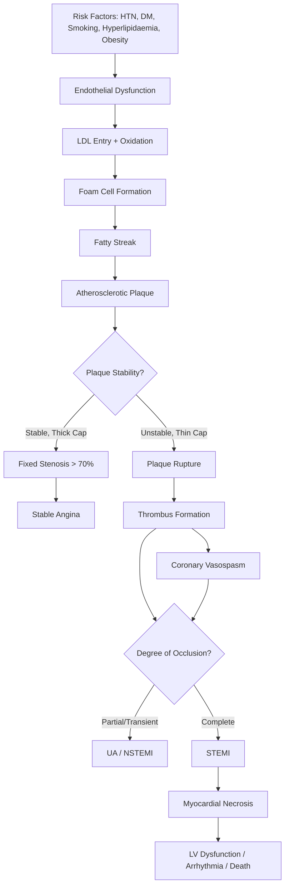

# Ischaemic Heart Disease (IHD)

## Definition

Ischaemic heart disease (IHD) — also known as coronary artery disease (CAD) or coronary heart disease (CHD) — refers to the condition in which there is an **imbalance between myocardial oxygen supply and demand**, resulting in myocardial ischaemia and, if prolonged, myocardial necrosis (infarction) [1][2].

Breaking down the name:
- **"Ischaemic"** → from Greek *ischein* (to hold back) + *haima* (blood) = restriction of blood supply
- **"Heart disease"** → disease affecting the heart muscle

The overwhelming majority of cases are caused by **coronary atherosclerosis** — the progressive build-up of lipid-rich plaques within the coronary arteries that narrows the lumen and restricts blood flow to the myocardium [1][2].

IHD exists on a **clinical spectrum**:

| Clinical Entity | Definition |
|---|---|
| **Stable angina** | Predictable chest pain on exertion, relieved by rest — caused by a fixed coronary stenosis [1][2] |
| **Acute coronary syndrome (ACS)** | Unstable angina, NSTEMI, or STEMI — caused by dynamic obstruction (usually plaque rupture + thrombus formation) [1][2] |
| **Ischaemic cardiomyopathy** | Chronic LV dysfunction secondary to prior MI or chronic ischaemia |
| **Sudden cardiac death** | Cardiac arrest from ischaemia-induced arrhythmia (VF/VT) [3] |

> **Why is this distinction important?** Stable angina implies a fixed stenosis where ischaemia only occurs when demand exceeds the limited supply (e.g. exercise). ACS implies an acute coronary event — often plaque rupture with superimposed thrombus — where ischaemia occurs even at rest, and there is imminent risk of myocardial necrosis [1][2].

---

## Epidemiology

### Global Burden
- IHD is the **leading cause of death worldwide**, responsible for approximately 9 million deaths annually (WHO 2024).
- It accounts for roughly **16% of all global deaths**.
- The burden is disproportionately high in low- and middle-income countries, where access to preventive care and acute revascularisation is limited.

### Hong Kong Context
- IHD is consistently among the **top 3 causes of death** in Hong Kong (after cancer and pneumonia).
- In 2023, diseases of the heart accounted for approximately 6,000+ deaths annually in Hong Kong (Centre for Health Protection data).
- Hong Kong has a **high prevalence of metabolic risk factors**: diabetes mellitus prevalence ~10%, hypertension ~27%, dyslipidaemia, and increasing obesity rates, all of which drive CAD incidence.
- Importantly, the **Chinese population** has certain epidemiological differences:
  - Higher prevalence of **single-vessel disease** compared to multi-vessel disease relative to Western populations
  - Possibly higher proportion of **non-obstructive CAD** and **microvascular disease**
  - Historically lower rates than Western countries, but the gap has been narrowing with Westernisation of diet and sedentary lifestyles
  - ***Atherosclerosis is a systemic disease*** [5] — patients with CAD in Hong Kong often have concurrent cerebrovascular or peripheral arterial disease

### Age and Sex Distribution
- Risk rises sharply with age: **men ≥ 45 years, women ≥ 55 years** [4]
- Pre-menopausal women are relatively protected (oestrogen has vasoprotective and lipid-modulating effects), but this advantage disappears post-menopause
- Male-to-female ratio is approximately 2:1 before age 65, equalising thereafter

---

## Risk Factors

Risk factors for IHD are essentially the risk factors for **atherosclerosis** — because coronary atherosclerosis is the underlying pathology in >95% of cases [1][2][5].

### Non-modifiable Risk Factors

| Risk Factor | Explanation |
|---|---|
| **Advanced age** | Cumulative endothelial damage and plaque progression over decades. Atherosclerosis begins in childhood (fatty streaks) but becomes clinically significant in middle age [4] |
| **Male sex** | Oestrogen in pre-menopausal women promotes NO production (vasodilation), favourable lipid profile (↑HDL, ↓LDL), and reduces inflammatory markers. Loss of oestrogen at menopause → rapid rise in CVD risk |
| **Family history of premature CAD** | First-degree relative with CHD at < 55 years (male) or < 65 years (female) [4]. Suggests shared genetic susceptibility (e.g. familial hypercholesterolaemia, inherited propensity for endothelial dysfunction) + shared environmental exposures |
| **Previous vascular event** | Prior MI, stroke, or PVD indicates established systemic atherosclerosis [6] |

### Modifiable Risk Factors

| Risk Factor | Pathophysiological Link to IHD |
|---|---|
| ***Smoking*** [5] | Endothelial injury by oxidative free radicals → ↑adhesion molecule expression → inflammatory cell recruitment. Also promotes thrombosis (↑fibrinogen, ↑platelet reactivity, ↓fibrinolysis), causes coronary vasospasm, and ↓HDL. Dose-dependent and partially reversible with cessation |
| ***Hypertension*** [5] | Mechanical shear stress damages endothelium → accelerated atherosclerosis. ↑Afterload → ↑myocardial O₂ demand. LVH → ↓coronary reserve. Target in stable CAD: < 140/90 mmHg [2] |
| ***Diabetes mellitus*** [5] | Multiple mechanisms: advanced glycation end-products (AGEs) damage endothelium, insulin resistance promotes dyslipidaemia (↑TG, ↓HDL, small dense LDL), pro-thrombotic state, pro-inflammatory state. DM is a **coronary heart disease risk equivalent** [4] — meaning a diabetic patient without known CAD has the same 10-year event risk as a non-diabetic patient with established CAD |
| ***Hyperlipidaemia*** [5] | ↑LDL-C is the key driver. LDL enters the intima → oxidised → taken up by macrophages → foam cells → fatty streak → atherosclerotic plaque. ↓HDL is also an independent risk factor (HDL mediates reverse cholesterol transport). Target LDL-C in established CAD: < 1.4 mmol/L (ESC 2019/2021 guidelines) [4] |
| **Obesity (especially abdominal/central)** | Visceral adipocytes release excess free fatty acids → insulin resistance → metabolic syndrome. Also release pro-inflammatory adipokines (e.g. TNF-α, IL-6) → chronic low-grade inflammation → endothelial dysfunction [7] |
| **Physical inactivity** | ↓AMPK activation → ↓glucose uptake, ↓fatty acid metabolism → contributes to obesity, insulin resistance, and dyslipidaemia [7] |
| **Unhealthy diet** | High saturated fat, trans fat, refined carbohydrate intake → dyslipidaemia and obesity. Low fruit/vegetable intake → ↓antioxidant protection |

<Callout title="Metabolic Syndrome" type="idea">
***Metabolic syndrome*** is a cluster of metabolic abnormalities driven primarily by **central obesity and insulin resistance**: hypertension, dyslipidaemia (↑TG, ↓HDL), hyperglycaemia, and central obesity [7]. These synergistically accelerate atherosclerosis. The concept is clinically useful because it identifies patients at multiplicatively higher risk who need aggressive multifactorial risk factor management.
</Callout>

### Other Risk Factors and Associations

| Factor | Mechanism |
|---|---|
| **Chronic kidney disease (CKD)** | Independent CVD risk factor: ↑prevalence of traditional risk factors + medial vascular calcification (↑PO₄, ↑Ca balance) + uraemia-driven chronic inflammation → accelerated atherosclerosis [8] |
| **Psychological stress / Depression** | Chronic sympathetic activation → ↑HR, ↑BP, ↑cortisol → endothelial dysfunction, pro-thrombotic state |
| **Obstructive sleep apnoea** | Intermittent hypoxia → oxidative stress, sympathetic surges, endothelial dysfunction |
| **Autoimmune/inflammatory diseases** | RA, SLE — chronic systemic inflammation accelerates atherosclerosis |
| **Cocaine use** | Direct coronary vasospasm + accelerated atherosclerosis + pro-thrombotic |
| **Oral contraceptive pills / HRT** | ↑thrombotic risk (especially when combined with smoking) [6] |
| **Raised homocysteine** | Endothelial toxicity, pro-thrombotic [6] |
| **Polycythaemia** | ↑blood viscosity → ↓flow → ischaemia [6] |

### ASCVD Risk Assessment

Formal risk assessment is critical to guide preventive therapy (especially lipid-lowering) [4]:

- **Indication**: ≥ 40 years with ≥ 1 ASCVD risk factor (HK Consensus 2016) [4]
- **Not needed** if patient already has overt ASCVD, DM, or ≥ 1 major risk factor (e.g. severe hypertension, severely elevated lipids) — these automatically meet treatment thresholds [4]
- **Tools available**:
  - Chinese Multiprovincial Cohort Study (CMCS) — validated for Chinese populations
  - Framingham Risk Score
  - ACC/AHA ASCVD Risk Calculator (Pooled Cohort Equations)
  - SCORE/SCORE2 risk charts (ESC)
  - JBS3 Risk Calculator [4]

> The purpose of risk assessment is to determine whether a patient crosses the treatment threshold for lipid-lowering (statin) therapy and to set LDL-C targets. The higher the risk category, the more aggressive the LDL-C goal.

---

## Anatomy of the Coronary Arteries

Understanding coronary artery anatomy is **essential** for correlating ECG changes, wall motion abnormalities, and clinical syndromes with the culprit vessel.

### Origin and Major Branches

The **left and right coronary arteries** arise from the **aortic root** (from the left and right coronary sinuses of Valsalva, respectively), just above the aortic valve leaflets. They receive blood during **diastole** — this is critical because:
- During systole, the contracting myocardium compresses intramural vessels → flow is impeded
- Therefore, **coronary perfusion is predominantly diastolic**
- Anything that ↓diastolic pressure (e.g. aortic regurgitation) or ↓diastolic time (e.g. tachycardia) will ↓coronary perfusion

### Left Coronary Artery (LCA)

The **left main coronary artery (LMCA)** is a short trunk (typically 1–2 cm) that bifurcates into:

1. **Left anterior descending artery (LAD)** — the "widow-maker"
   - Runs in the anterior interventricular groove
   - Gives off **septal perforators** (supply the anterior 2/3 of interventricular septum, including the bundle of His) and **diagonal branches** (supply anterolateral LV wall)
   - ***Supplies***: anterior wall of LV, anterior 2/3 of interventricular septum, apex [1]
   - **Clinical significance**: LAD occlusion causes **anterior STEMI** — the most dangerous territory because it involves the largest area of myocardium. Leads V1-V4 (± V5-V6) on ECG

2. **Left circumflex artery (LCx)**
   - Runs in the left atrioventricular groove
   - Gives off **obtuse marginal branches** (supply lateral LV wall)
   - ***Supplies***: lateral and posterior wall of LV (depending on dominance) [1]
   - **Clinical significance**: LCx occlusion causes **lateral STEMI** (leads I, aVL, V5-V6) or posterior MI. Can be electrocardiographically "silent" because standard leads do not face the posterior wall directly

### Right Coronary Artery (RCA)

- Runs in the right atrioventricular groove
- Gives off the **posterior descending artery (PDA)** in ~85% of people (= right-dominant circulation)
- Also gives off the **SA node artery** (in 60%) and **AV node artery** (in 80%)
- ***Supplies***: right ventricle, inferior wall of LV, posterior 1/3 of interventricular septum, SA node (60%), AV node (80%) [1]
- **Clinical significance**: RCA occlusion causes **inferior STEMI** (leads II, III, aVF) and may be associated with:
  - **Bradycardia / AV block** (AV node ischaemia)
  - **Right ventricular infarction** (hypotension, raised JVP, clear lungs — avoid nitrates and diuretics!)

### Coronary Dominance

| Type | Definition | Prevalence |
|---|---|---|
| **Right dominant** | RCA gives off PDA | ~85% |
| **Left dominant** | LCx gives off PDA | ~8% |
| **Co-dominant** | Both contribute to PDA | ~7% |

> Dominance determines who supplies the inferior wall and posterior septum. In a right-dominant system, RCA occlusion threatens the AV node.

### Coronary Artery Territory Summary

| Coronary Artery | Territory Supplied | ECG Leads | Wall Motion on Echo |
|---|---|---|---|
| LAD | Anterior LV wall, apex, anterior 2/3 septum | V1–V4 (± V5–V6) | Anterior, anteroseptal, apical |
| LCx | Lateral LV wall, ± posterior | I, aVL, V5–V6 | Lateral, posterolateral |
| RCA | Inferior LV wall, RV, posterior 1/3 septum, conducting system | II, III, aVF | Inferior, RV |

<Callout title="Why Does LAD Occlusion Cause the Worst MIs?">
The LAD supplies the largest territory of the left ventricle — the entire anterior wall, the apex, and much of the septum. Occlusion here causes the greatest area of myocardial necrosis, the most severe LV dysfunction, and carries the highest mortality among all STEMIs. Hence its colloquial name: the **"widow-maker"**.
</Callout>

---

## Aetiology

### 1. Coronary Atherosclerosis (Most Common — >95% of IHD)

This is overwhelmingly the dominant cause. The pathology is discussed in detail below.

### 2. Non-Atherosclerotic Causes of IHD [1]

These are less common but **must not be missed**, especially in younger patients without traditional risk factors:

| Category | Examples | Mechanism |
|---|---|---|
| **Vasospasm** | ***Prinzmetal's (variant) angina***, cocaine abuse [1] | Intense focal coronary artery spasm → transient transmural ischaemia. Prinzmetal's = spontaneous spasm, often at night, with transient ST elevation. Cocaine → sympathomimetic + direct smooth muscle contraction |
| **Vasculitis** | ***Takayasu arteritis, polyarteritis nodosa (PAN), Kawasaki disease, eosinophilic granulomatosis with polyangiitis (eGPA)*** [1] | Inflammation of coronary artery wall → stenosis, occlusion, or aneurysm formation. **Kawasaki disease** is the most important cause of acquired heart disease in children in developed countries — coronary artery aneurysms can thrombose or rupture |
| **Embolism** | Septic emboli (infective endocarditis), atrial myxoma, paradoxical embolism (PFO) | Embolic material lodges in coronary artery → acute occlusion |
| **Dissection** | Spontaneous coronary artery dissection (SCAD), retrograde extension of aortic dissection [1] | Intimal tear → blood tracks in arterial wall → false lumen compresses true lumen → ischaemia. SCAD is an important cause of MI in young women, especially peri-partum |
| **Congenital anomalies** | Anomalous origin (e.g. left coronary from pulmonary artery — ALCAPA), myocardial bridging | Abnormal anatomy → malperfusion or dynamic compression during systole |
| **Microvascular disease** | Cardiac syndrome X (microvascular angina) | Small vessel dysfunction → ischaemia despite angiographically normal epicardial coronary arteries. More common in women, diabetics |
| **Others** | Radiation-induced coronary artery disease, amyloidosis, hypercoagulable states | Various mechanisms of coronary compromise |

---

## Pathophysiology

### A. Pathology of Atherosclerosis

Atherosclerosis is a **chronic, progressive, inflammatory disease** of medium and large arteries. Understanding its development is key to understanding the entire spectrum of IHD.

#### Stage 1: Endothelial Dysfunction (The Initiating Event)

- The endothelium normally maintains a **vasodilatory, anti-thrombotic, anti-inflammatory** state via nitric oxide (NO) production.
- Risk factors (smoking, hypertension, hyperglycaemia, oxidised LDL, etc.) cause **endothelial injury and dysfunction**:
  - ↓NO production → loss of vasodilation and anti-thrombotic properties
  - ↑expression of **adhesion molecules** (VCAM-1, ICAM-1, selectins) on endothelial surface
  - ↑endothelial permeability to lipoproteins

#### Stage 2: Fatty Streak Formation

- Dysfunctional endothelium allows **LDL particles to enter the subintimal space** (intima)
- LDL becomes **oxidised** (oxLDL) by reactive oxygen species — this is the critical step
- oxLDL is:
  - **Chemotactic** for monocytes → recruitment into intima
  - **Toxic** to endothelium → further dysfunction
  - **Immunogenic** → triggers inflammatory response
- Monocytes differentiate into **macrophages** → express scavenger receptors (SR-A, CD36) → engulf oxLDL without negative feedback → become **foam cells**
- Accumulation of foam cells = ***fatty streak*** — the earliest visible lesion [1]
  - ***Slightly raised yellow deposits*** [1]
  - Found in the aorta of virtually all people from childhood

#### Stage 3: Atherosclerotic Plaque Formation

- Progressive lipid accumulation, smooth muscle cell migration from media to intima, and extracellular matrix deposition
- Mature plaque structure = ***fibrous cap*** (smooth muscle cells + collagen + extracellular matrix) overlying a ***necrotic lipid core*** (dead foam cells, cholesterol crystals, debris) [1]
- This is the ***atheromatous plaque*** [1]
- The plaque progressively **narrows the arterial lumen** → when stenosis reaches **>70%**, flow is significantly reduced during stress (exercise) → demand-supply mismatch → **stable angina**
- At rest, flow is usually adequate until stenosis exceeds ~90%

#### Stage 4: Plaque Complications (Why ACS Happens)

The distinction between stable and unstable IHD lies in **plaque biology**:

| Feature | Stable Plaque | ***Unstable (Vulnerable) Plaque*** |
|---|---|---|
| Fibrous cap | Thick, intact | ***Thinner fibrous cap*** [1] |
| Lipid core | Small, stable | ***Growing necrotic core*** [1] |
| Inflammation | Low-grade | Active inflammation with macrophages at plaque shoulder secreting matrix metalloproteinases (MMPs) that degrade collagen |
| Clinical consequence | Stable angina | ***Plaque rupture*** → thrombus formation → ACS [1] |

**What happens when a plaque ruptures?**

1. Fibrous cap disruption (rupture or erosion) exposes the **thrombogenic necrotic core** (rich in tissue factor) to flowing blood
2. **Platelet adhesion and activation** → platelet plug
3. **Coagulation cascade activation** → fibrin mesh → thrombus formation
4. Thrombus can:
   - **Partially occlude** the lumen → UA or NSTEMI
   - **Completely occlude** the lumen → STEMI
   - **Embolise distally** → microinfarcts
5. Vasospasm at the site (mediated by thromboxane A₂ and serotonin from activated platelets) further reduces flow

Other plaque complications [1]:
- ***Aneurysm***: pressure atrophy of the tunica media beneath a large plaque → weakening → aneurysmal dilation [1]
- ***Atheroembolism***: cholesterol crystal emboli from ulcerated plaques → distal end-organ damage [1]

<Callout title="The Central Concept" type="idea">
Stable angina = **fixed plaque, stable cap, predictable symptoms on exertion**. ACS = **vulnerable plaque, cap rupture/erosion, thrombus, unpredictable symptoms at rest**. The key determinant of clinical syndrome is **plaque stability**, NOT plaque size. A 40% stenosis with a thin cap and large lipid core is far more dangerous than an 80% stenosis with a thick, stable cap.
</Callout>

### B. Mechanisms of Myocardial Ischaemia

Ischaemia = oxygen demand exceeds supply. Let's break down both sides:

#### Determinants of Myocardial O₂ Demand

| Factor | Mechanism |
|---|---|
| **Heart rate** | ↑HR → ↑number of contractions per minute → ↑ATP consumption. Also ↓diastolic time → ↓coronary perfusion time (double hit!) |
| **Myocardial contractility** | ↑inotropy → ↑ATP use per contraction |
| **Wall stress (= afterload)** | By Laplace's law: wall stress ∝ (Pressure × radius) / (2 × wall thickness). ↑BP (HTN), ↑LV dilation → ↑wall stress → ↑O₂ demand. This is why hypertension and aortic stenosis exacerbate angina |
| **Preload** | ↑preload → ↑LV volume → ↑wall stress |

#### Determinants of Myocardial O₂ Supply

| Factor | Mechanism |
|---|---|
| **Coronary blood flow** | Determined by coronary perfusion pressure (aortic diastolic pressure − LVEDP) and coronary vascular resistance. Stenosis ↑resistance → ↓flow |
| **O₂ carrying capacity** | Anaemia → ↓O₂ delivery even with normal flow. This is why anaemia exacerbates angina [2] |
| **O₂ extraction** | Already near-maximal at rest (~70–75%) → minimal reserve. Unlike skeletal muscle, the heart CANNOT compensate by simply extracting more O₂ — it is almost entirely dependent on increasing flow |

> **Why does the heart rely so heavily on increasing flow rather than extraction?** Because myocardial O₂ extraction is already ~75% at rest (compared to ~25% in skeletal muscle). There is almost no extraction reserve. The ONLY way to ↑O₂ supply to the myocardium is to ↑coronary blood flow — and this is exactly what is impaired in CAD.

#### Conditions That Exacerbate Angina (by Worsening the Supply-Demand Balance) [2]

| Condition | Mechanism |
|---|---|
| **Anaemia** | ↓O₂ carrying capacity → ↓supply |
| **Thyrotoxicosis** | ↑HR, ↑contractility, ↑metabolic rate → ↑demand |
| **Tachyarrhythmias** | ↑HR → ↑demand + ↓diastolic perfusion time → ↓supply |
| **Aortic stenosis** | ↑afterload → ↑wall stress → ↑demand; also ↑LV mass outstrips coronary supply; ↓diastolic BP → ↓coronary perfusion |
| **HCMP** | ↑LV mass → ↑demand; dynamic LVOT obstruction → ↑wall stress |
| **Aortic regurgitation** | ↓diastolic aortic pressure → ↓coronary perfusion pressure |
| **Hypertension** | ↑afterload → ↑demand; LVH → ↑demand |
| **Fever / Sepsis** | ↑metabolic rate, ↑HR → ↑demand |

### C. Consequences of Ischaemia

When ischaemia occurs, events follow a predictable cascade called the **"ischaemic cascade"**:

```
Coronary flow ↓
  → Metabolic abnormalities (↓ATP, lactic acidosis) [earliest]
    → Diastolic dysfunction (impaired relaxation)
      → Regional wall motion abnormality (RWMA)
        → ECG changes (ST depression/elevation, T wave changes)
          → Angina (chest pain) [latest]
```

> **Why do ECG changes appear BEFORE chest pain?** Electrophysiological changes in ischaemic myocardium occur at a lower threshold than nociceptor activation. This is why some patients have "silent ischaemia" — detectable on Holter or stress testing without symptoms. This is particularly common in ***diabetic patients*** (autonomic neuropathy damages cardiac afferent nerves) and in ***complete infarcts > 6 hours*** [1].

**Causes of painless ("silent") MI** [1]:
- ***Diabetes mellitus*** — cardiac autonomic neuropathy
- ***Complete infarct (> 6h)*** — nerve destruction within the infarcted territory
- Elderly patients — altered pain perception
- Post-transplant hearts — denervated

### D. Progression of Ischaemia to Infarction

If ischaemia is prolonged (typically > 20 minutes of complete occlusion), irreversible **myocardial necrosis** begins:

1. **Subendocardial ischaemia** begins first (the subendocardium is most vulnerable because it is furthest from the epicardial coronary supply, is subject to the highest wall stress, and has the highest O₂ demand)
2. With continued occlusion, the **wavefront of necrosis** extends from subendocardium → epicardium
3. By ~6 hours of total occlusion, **transmural infarction** is complete (though timing varies with collateral circulation)

This is the basis for the concept of **"time is muscle"** — early reperfusion salvages myocardium.

---

## Classification of IHD

### By Clinical Presentation

| Category | Sub-type | Definition |
|---|---|---|
| **Chronic coronary syndrome (CCS) / Stable IHD** | Stable angina pectoris | Predictable chest pain with exertion, relieved by rest/nitrate ≤ 5 min [1][2] |
| | Ischaemic cardiomyopathy | Chronic LV dysfunction due to prior infarction or hibernating myocardium |
| | Silent ischaemia | Objective evidence of ischaemia without symptoms |
| **Acute coronary syndrome (ACS)** | ***Unstable angina (UA)*** | Any one of: (1) resting angina > 20 min, (2) new-onset angina that markedly limits normal activity, (3) increasing angina (more frequent/prolonged/less effort) [1] |
| | ***NSTEMI*** | Raised cardiac enzymes (troponin) WITHOUT ST elevation (may have ST depression or T wave inversion) [1] |
| | ***STEMI*** | Raised cardiac enzymes WITH ST elevation or new LBBB [1] |
| **Sudden cardiac death** | | VF/pulseless VT from ischaemia — 85% of out-of-hospital cardiac arrests due to CAD [3] |

<Callout title="The ACS Spectrum" type="error">
A common mistake is thinking UA, NSTEMI, and STEMI are completely separate diseases. They are a **continuum** of the same pathology (plaque rupture + thrombosis). The difference lies in the **degree and duration of coronary occlusion** and whether there is **myocardial necrosis**:
- UA: transient/partial occlusion, NO necrosis (normal troponin)
- NSTEMI: partial/intermittent occlusion or distal embolisation, YES necrosis (↑troponin) but no complete transmural ischaemia (no ST elevation)
- STEMI: complete occlusion of a major epicardial artery, transmural ischaemia (ST elevation), necrosis
</Callout>

### By Canadian Cardiovascular Society (CCS) Grading of Angina Severity

This functional classification is widely used to grade the severity of stable angina:

| CCS Grade | Description |
|---|---|
| **I** | Angina only with strenuous, rapid, or prolonged exertion |
| **II** | Slight limitation of ordinary activity — angina on walking > 2 blocks on level ground, climbing > 1 flight of stairs |
| **III** | Marked limitation of ordinary activity — angina on walking 1–2 blocks, climbing 1 flight |
| **IV** | Angina with any physical activity, or at rest |

### Universal Classification of MI (5th Definition, 2018)

| Type | Mechanism |
|---|---|
| **Type 1** | Spontaneous MI due to atherosclerotic plaque disruption (rupture, erosion, fissuring) → thrombus → ischaemia + necrosis. This is the "classic" MI |
| **Type 2** | MI secondary to supply-demand mismatch NOT from acute plaque disruption (e.g. coronary spasm, coronary embolism, anaemia, tachyarrhythmia, hypotension, respiratory failure). Troponin rises but the mechanism is different |
| **Type 3** | Cardiac death with symptoms suggestive of MI and presumed new ECG changes or VF, but death occurred before blood samples could be obtained |
| **Type 4a** | MI related to PCI (within 48 hours) |
| **Type 4b** | MI related to stent thrombosis |
| **Type 5** | MI related to CABG |

> **Why is this classification important?** Type 1 vs Type 2 MI has completely different management. Type 1 MI requires antiplatelet therapy, anticoagulation, and often revascularisation. Type 2 MI requires treatment of the underlying cause (e.g. transfusion for anaemia, rate control for tachycardia) — giving DAPT and rushing to the cath lab would be inappropriate and potentially harmful.

---

## Clinical Features

### A. Symptoms

#### 1. Angina Pectoris (The Cardinal Symptom)

**Angina pectoris** (Latin: *angere* = to choke, *pectoris* = of the chest) is the symptom complex caused by myocardial ischaemia [9].

**Pathophysiology of anginal pain**: Myocardial ischaemia → anaerobic metabolism → accumulation of metabolic byproducts (lactate, adenosine, bradykinin, hydrogen ions) → stimulation of cardiac sympathetic afferent nerve endings (unmyelinated C fibres) → signals travel via the sympathetic chain to spinal cord segments T1–T5 → referred pain perceived in the chest and along the C8–T5 dermatomes (arm, jaw, neck) [9].

| Feature | Detail | Pathophysiological Basis |
|---|---|---|
| ***Quality*** | ***Dull, constricting, choking, "heavy"***. Described as squeezing, crushing, burning, or tightness. Patients often emphasize it is a **discomfort, not a "pain"** [2][9]. ***Levine's sign***: patient places clenched fist on sternum when describing the sensation [9] | Visceral pain from the heart is transmitted via autonomic nerves → poorly localised, dull quality (unlike somatic pain which is sharp and well-localised) |
| ***Location*** | ***Retrosternal*** (behind the sternum), diffuse — patient cannot point to the pain with one finger [9] | Cardiac afferents converge on the same spinal cord segments (T1–T5) as somatic afferents from the chest wall → referred to a broad retrosternal area |
| ***Radiation*** | ***Arms (especially left), shoulders, jaw, neck, epigastrium*** [2][9] | Convergence of cardiac afferents with somatic afferents from C8–T5 dermatomes in the spinal cord → brain misinterprets visceral pain as originating from these somatic territories |
| ***Duration*** | Stable angina: typically **< 30 minutes**, usually 2–10 min [2]. ACS: often **> 20 minutes** and may last hours | Stable: ischaemia resolves with rest/reduced demand. ACS: ongoing ischaemia from persistent occlusion |
| ***Provocation*** | ***Exertion, emotional stress, cold weather, heavy meals*** [2] | All ↑myocardial O₂ demand: exercise ↑HR and contractility; emotion/cold → sympathetic activation → ↑HR, BP; post-prandial → ↑CO to splanchnic bed → ↑cardiac work |
| ***Relieving factors*** | ***Rest*** (within a few minutes) and ***sublingual GTN*** (within ≤ 5 min for stable angina) [2] | Rest → ↓HR, ↓BP → ↓demand → supply-demand balance restored. GTN → venodilation (↓preload → ↓wall stress → ↓demand) + some coronary vasodilation (↑supply) |
| ***Timing*** | May be worse in the **morning** (circadian variation in sympathetic tone, platelet aggregability, and fibrinolytic activity) | Cortisol and catecholamine peaks in early morning → ↑HR, ↑BP → ↑demand. Also ↑platelet reactivity → ↑thrombotic risk |

**Red flag features suggesting ACS rather than stable angina**:
- Pain at rest
- New-onset angina (< 2 months) that markedly limits activity
- Crescendo pattern (increasing frequency, severity, or occurring with less exertion)
- Duration > 20 minutes
- Not relieved by rest or GTN
- Associated with autonomic symptoms (sweating, nausea, vomiting)

#### 2. Dyspnoea

- May be an **angina equivalent** ("anginal equivalent dyspnoea") — especially in elderly, diabetic, and female patients
- **Pathophysiology**: ischaemia → diastolic dysfunction (impaired LV relaxation) → ↑LVEDP → ↑LA pressure → pulmonary congestion → dyspnoea
- Can also indicate LV systolic dysfunction from prior infarction → chronic heart failure

#### 3. Autonomic Symptoms

- **Diaphoresis** (sweating), **nausea, vomiting, pallor**
- **Pathophysiology**: myocardial ischaemia activates cardiac sympathetic and vagal afferents → autonomic response. The inferior wall (RCA territory) is particularly vagally innervated → inferior MI often presents with **bradycardia, nausea, and vomiting** (vasovagal response)

#### 4. Lightheadedness / Syncope

- Can occur if ischaemia causes significant ↓CO (large territory involvement or arrhythmia)
- **Pathophysiology**: ↓CO → ↓cerebral perfusion. Or ischaemia-triggered VT/VF → cardiac arrest

#### 5. Fatigue

- Chronic fatigue may reflect **chronic low cardiac output** from ischaemic cardiomyopathy
- Also an atypical angina equivalent in some patients

<Callout title="Atypical Presentations — Don't Miss These" type="error">
IHD may present **without classic chest pain** in certain populations:
- **Women**: more likely to have dyspnoea, fatigue, nausea, back/jaw pain rather than classic crushing chest pain
- **Elderly**: dyspnoea, confusion, falls
- **Diabetic patients**: silent ischaemia due to cardiac autonomic neuropathy [1]
- **Post-transplant**: denervated heart → no pain
Always maintain a high index of suspicion in patients with risk factors even without typical symptoms.
</Callout>

### B. Signs

Physical examination in stable IHD is **frequently unremarkable** [2] — but there are several things to look for:

#### Signs Related to IHD Itself

| Sign | Finding | Pathophysiological Basis |
|---|---|---|
| **Usually normal** | ***Physical examination is frequently unremarkable in stable angina*** [2] | Fixed coronary stenosis causes symptoms only during increased demand; at rest, haemodynamics are normal |
| **S4 gallop** | Palpable or audible 4th heart sound | ↑LVEDP from diastolic dysfunction (impaired relaxation of ischaemic myocardium) → atrial contraction against a stiff ventricle → S4 |
| **S3 gallop** | Audible 3rd heart sound | Systolic dysfunction from prior MI → dilated LV → rapid early diastolic filling → S3. Indicates established LV failure |
| **Dyskinetic apex beat** | Sustained, displaced apex beat | Prior MI → scarred, akinetic or dyskinetic segment → adverse LV remodelling → dilation → displaced apex [2] |
| **Mitral regurgitation murmur** (transient) | Pansystolic murmur at apex | Ischaemia of papillary muscle → transient MR during episodes. Or chronic MR from papillary muscle dysfunction / LV remodelling post-MI |
| **Pulmonary crepitations** | Bilateral basal crepitations | LV dysfunction → ↑LVEDP → ↑pulmonary capillary pressure → transudation into alveoli |
| **Signs of cardiogenic shock** (in massive MI) | Hypotension, tachycardia, cold clammy peripheries, oliguria | Massive myocardial necrosis (>40% of LV) → pump failure → ↓CO |

#### Signs of Risk Factors and Comorbidities [2]

| Sign | What It Suggests |
|---|---|
| **Xanthelasma** (yellowish deposits around eyes) | Hyperlipidaemia — cholesterol deposition in the skin around the eyelids [4] |
| **Corneal arcus** (grey-white ring at corneal periphery) | Lipid deposition in the cornea. Non-specific in elderly, but suggestive of hyperlipidaemia if < 45 years [4] |
| **Tendon xanthomas** (Achilles, extensor tendons of hand) | Highly specific for **familial hypercholesterolaemia** (FH) — cholesterol deposition in tendons [10] |
| **Nicotine-stained fingers** | Active smoking |
| **Hypertension** (elevated BP) | Major modifiable risk factor |
| **Signs of diabetes** | Acanthosis nigricans, diabetic dermopathy, peripheral neuropathy |
| **Central obesity** | Component of metabolic syndrome |

#### Signs of Other Arterial Disease (Systemic Atherosclerosis) [2]

| Sign | Location | Significance |
|---|---|---|
| ***Carotid bruit*** | Neck | Carotid artery stenosis — concurrent cerebrovascular disease [2] |
| ***Signs of peripheral vascular disease (PVD)*** | Lower limbs — absent/diminished peripheral pulses, hair loss, skin changes, ulcers, gangrene | Concurrent peripheral arterial disease. ***"Atherosclerosis is a systemic disease"*** [5] — if you find it in one bed, look for it in others |
| **Abdominal aortic aneurysm** | Pulsatile abdominal mass | Another manifestation of atherosclerosis |

#### Signs of Conditions That May Exacerbate Angina [2]

| Sign | Condition |
|---|---|
| ***Ejection systolic murmur radiating to carotids*** | Aortic stenosis → ↑afterload, ↓coronary perfusion |
| ***Ejection systolic murmur ↑ with Valsalva*** | HOCM → dynamic LVOT obstruction [2] |
| **Early diastolic murmur at left sternal edge** | Aortic regurgitation → ↓diastolic coronary perfusion |
| **Conjunctival pallor** | Anaemia → ↓O₂ carrying capacity |
| **Tremor, tachycardia, lid lag, thyroid enlargement** | Thyrotoxicosis → ↑HR, ↑contractility, ↑metabolic demand [2] |

<Callout title="The Exam-Ready Approach to P/E in IHD">
When examining a patient with suspected IHD, systematically look for:
1. **Signs of the disease itself**: S3/S4 gallop, displaced apex, MR murmur, signs of HF
2. **Signs of risk factors**: xanthomas, xanthelasma, arcus, hypertension, obesity, DM features
3. **Signs of systemic atherosclerosis**: carotid bruits, absent peripheral pulses, AAA
4. **Signs of conditions exacerbating angina**: AS murmur, HOCM, anaemia, thyrotoxicosis

This framework ensures you don't miss anything on a ward round or in an OSCE.
</Callout>

---

## Key Pathophysiological Concepts — Summary Diagram



---

<Callout title="High Yield Summary">

1. **IHD = myocardial O₂ supply-demand mismatch**, overwhelmingly due to coronary atherosclerosis (> 95%)
2. **Risk factors** = atherosclerotic risk factors: age, male, family Hx, smoking, HTN, DM, hyperlipidaemia, obesity, physical inactivity. ***Atherosclerosis is a systemic disease*** — always check for PVD, carotid disease
3. **Coronary anatomy**: LAD (anterior wall, septum, apex — "widow-maker"), LCx (lateral wall), RCA (inferior wall, RV, SA/AV nodes). Dominance determines posterior supply. Coronary perfusion is predominantly diastolic
4. **Atherosclerosis pathology**: endothelial dysfunction → LDL entry + oxidation → foam cells → fatty streak → atheromatous plaque (fibrous cap + necrotic core). Plaque rupture = ACS
5. **Clinical spectrum**: Stable angina (fixed stenosis, demand-driven) → ACS (UA, NSTEMI, STEMI — plaque rupture + thrombus, supply-driven)
6. **Stable angina features**: retrosternal, dull/constricting, exertional, < 30 min, relieved by rest/GTN ≤ 5 min
7. **ACS features**: rest pain > 20 min, new-onset limiting angina, crescendo pattern, ± autonomic symptoms
8. **P/E often normal** in stable IHD — look for S3/S4, displaced apex, MR murmur, risk factor signs (xanthomas, HTN), systemic atherosclerosis (carotid bruit, PVD), conditions exacerbating angina (AS, anaemia, thyrotoxicosis)
9. **Silent MI**: diabetes (autonomic neuropathy), elderly, post-transplant, complete infarct > 6h
10. **Myocardial O₂ extraction is ~75% at rest** — almost no extraction reserve — heart is entirely dependent on ↑flow to meet ↑demand. This is why coronary stenosis is so devastating

</Callout>

---

<ActiveRecallQuiz
  title="Active Recall - IHD Definition, Epidemiology, Risk Factors, Anatomy, Aetiology, Pathophysiology, Classification, Clinical Features"
  items={[
    {
      question: "Explain why coronary perfusion occurs predominantly during diastole, and name two conditions that reduce diastolic coronary perfusion.",
      markscheme: "During systole, contracting myocardium compresses intramural vessels impeding flow; perfusion depends on aortic diastolic pressure minus LVEDP. Conditions: (1) Aortic regurgitation (low diastolic aortic pressure), (2) Tachycardia (shortened diastolic time). Also accept: aortic stenosis (increased LVEDP)."
    },
    {
      question: "A 50-year-old diabetic man presents with dyspnoea on exertion but no chest pain. His troponin is mildly elevated. Why might he not have chest pain, and what is this phenomenon called?",
      markscheme: "Silent ischaemia/painless MI. Diabetes causes cardiac autonomic neuropathy damaging afferent C fibres that transmit ischaemic pain signals. He may have Type 2 MI or ongoing ischaemia without classic angina."
    },
    {
      question: "Describe the pathological progression from fatty streak to acute coronary syndrome, highlighting the key role of plaque stability.",
      markscheme: "Fatty streak (foam cell accumulation) progresses to atheromatous plaque (fibrous cap over necrotic lipid core). Vulnerable plaque has thin cap plus large lipid core with active inflammation (macrophages secrete MMPs degrading collagen). Plaque rupture or erosion exposes thrombogenic core to blood, triggering platelet adhesion and coagulation cascade forming thrombus. Partial occlusion causes UA or NSTEMI; complete occlusion causes STEMI."
    },
    {
      question: "Why is the subendocardium the most vulnerable region to ischaemia? Name three reasons.",
      markscheme: "(1) Furthest from epicardial coronary supply (last to receive blood). (2) Subject to highest wall stress (compressed during systole by intraventricular pressure). (3) Highest metabolic demand. This is why ischaemia begins subendocardially and extends as a wavefront towards the epicardium."
    },
    {
      question: "List five physical examination findings you should specifically look for in a patient with suspected stable IHD and explain what each indicates.",
      markscheme: "Any five from: (1) Xanthelasma/tendon xanthomas - hyperlipidaemia/FH. (2) Carotid bruit - concurrent cerebrovascular atherosclerosis. (3) Absent peripheral pulses - PVD/systemic atherosclerosis. (4) Ejection systolic murmur radiating to carotids - aortic stenosis (exacerbates angina). (5) Conjunctival pallor - anaemia (reduces O2 supply). (6) S4 gallop - diastolic dysfunction. (7) Displaced apex - prior MI with LV remodelling."
    },
    {
      question: "Differentiate Type 1 MI from Type 2 MI. Why does this distinction matter for management?",
      markscheme: "Type 1: Spontaneous MI from atherosclerotic plaque disruption (rupture/erosion) with thrombus. Type 2: MI from supply-demand mismatch without acute plaque event (e.g. anaemia, tachyarrhythmia, hypotension, vasospasm). Management differs: Type 1 needs DAPT, anticoagulation, and possible revascularisation. Type 2 needs treatment of the underlying precipitant (e.g. blood transfusion, rate control) rather than invasive coronary intervention."
    }
  ]}
/>

---

## References

[1] Senior notes: Maksim Medicine Notes.pdf (Section 1.3, Ischaemic Heart Disease, p.7)
[2] Senior notes: Ryan Ho Cardiology.pdf (Section 3.2.1, Stable Angina and Ischaemic Heart Disease, pp.115–120)
[3] Senior notes: Ryan Ho Critical Care.pdf (Section 1.5, Cardiac Arrest, p.28)
[4] Senior notes: Ryan Ho Endocrine.pdf (Section 6.2.2, Approach to Abnormal Lipid Profile, pp.123–131)
[5] Lecture slides: WCS 002 - Toe gangrene and leg ulcer - by Prof SWK Cheng.pdf (p.2)
[6] Senior notes: Ryan Ho Neurology.pdf (Section on Risk Factors of Stroke, p.75)
[7] Senior notes: Ryan Ho Endocrine.pdf (Type 2 DM and Obesity sections, pp.77, 117)
[8] Senior notes: Ryan Ho Urogenital.pdf (Cardiovascular Morbidity in CKD, p.109)
[9] Senior notes: Ryan Ho Fundamentals.pdf (Section 3.1.1, Chest Pain and Angina Pectoris, pp.199–202)
[10] Senior notes: Ryan Ho Chemical Path.pdf (Lipid Profile and Familial Hypercholesterolaemia, pp.46–48)
