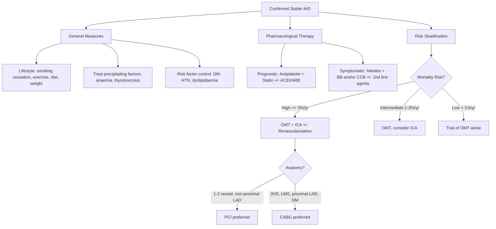
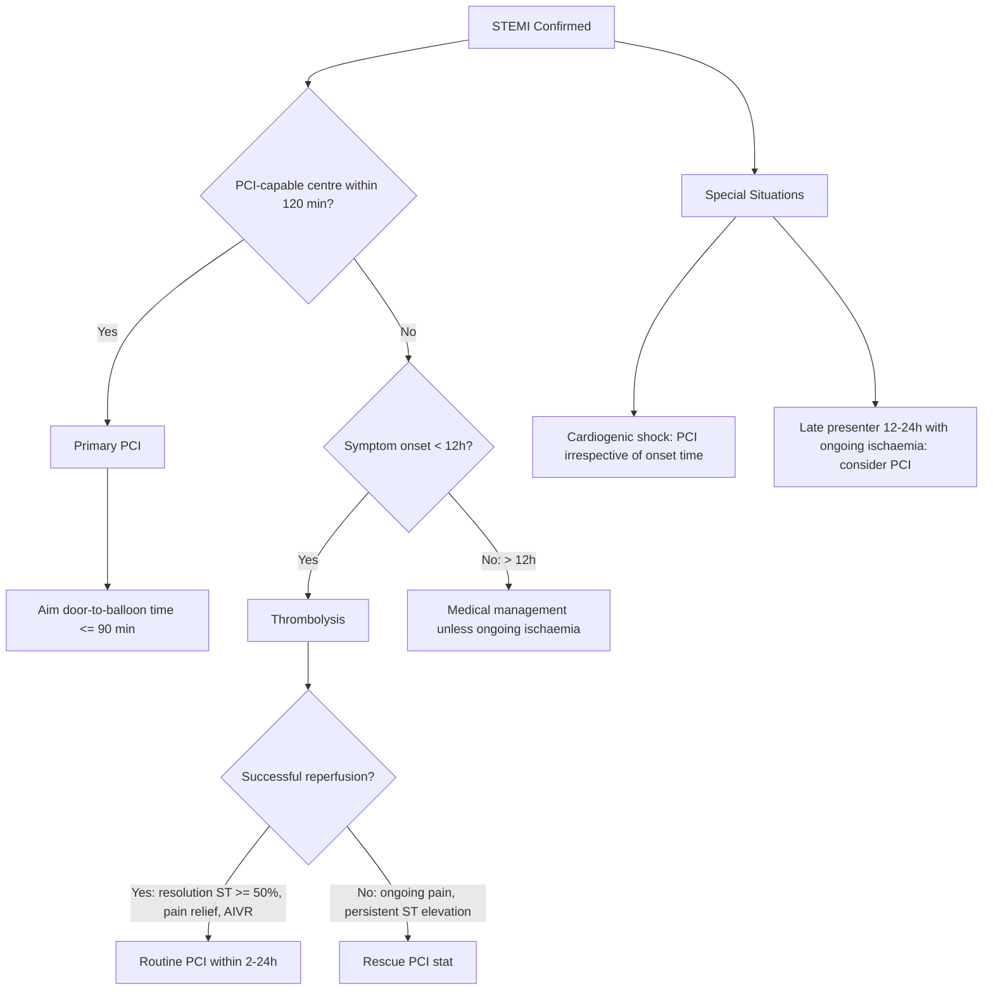
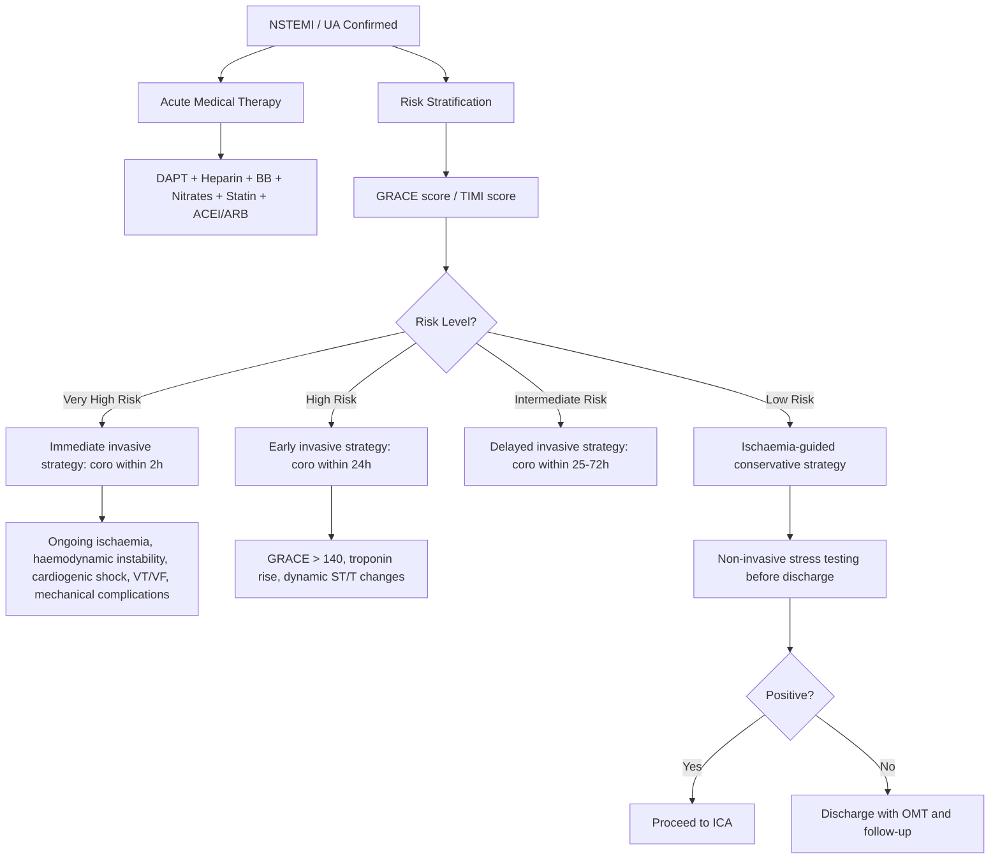

## Management of Ischaemic Heart Disease

### Guiding Principles

The management of IHD rests on **two pillars** [2]:
1. **Improve quality of life** → symptomatic relief (anti-anginal therapy)
2. **Improve life expectancy** → prognostic therapy (prevent MI, death, heart failure)

The approach differs fundamentally between **stable IHD (chronic coronary syndrome)** and **acute coronary syndrome (ACS = UA/NSTEMI/STEMI)**. In stable disease, you have time to optimise medical therapy and decide on revascularisation electively. In ACS, the immediate priorities are to **restore coronary flow, limit infarct size, prevent death, and treat complications** [1][2][9].

---

### PART I: MANAGEMENT OF STABLE IHD

#### Overview Algorithm

---

#### A. General Measures [2]

| Measure | Detail | Rationale |
|---|---|---|
| ***Lifestyle: stop smoking, regular exercise (but not beyond point of discomfort)*** [2] | Smoking cessation drastically ↓MI risk after just 1 year [2]. Moderate exercise 30 min × 5/week | Smoking causes endothelial injury, ↑thrombosis, ↑vasospasm. Exercise ↑HDL, ↓insulin resistance, improves endothelial function |
| ***Treat precipitating factors: thyrotoxicosis, anaemia*** [2] | Check TFT and CBC in all patients with angina [2] | Thyrotoxicosis ↑O₂ demand (↑HR, ↑contractility). Anaemia ↓O₂ supply. Correcting these may abolish angina entirely without need for further intervention |
| ***DM: aim A1c < 7%, consider SGLT2i or GLP-1a*** [2] | SGLT2i (empagliflozin, dapagliflozin) and GLP-1 RA (semaglutide, liraglutide) have proven cardiovascular outcome benefits | DM accelerates atherosclerosis via multiple mechanisms. SGLT2i/GLP-1 RA independently reduce MACE (major adverse cardiovascular events) |
| ***HTN: aim < 140/90, use BB if indicated*** [2] | β-blocker preferred if coexistent angina; otherwise ACEI/ARB | HTN ↑afterload → ↑wall stress → ↑O₂ demand. Also accelerates endothelial dysfunction |
| ***Lipids: ↓LDL to < 1.8 mmol/L with lifestyle and drug*** [2] | ESC 2019/2021: very high risk = LDL < 1.4 mmol/L AND ≥ 50% reduction [17] | LDL is the primary driver of atherosclerosis; aggressive lowering stabilises plaques and reduces events |

---

#### B. Pharmacological Therapy — Prognostic Treatment [2]

These drugs **reduce the risk of MI and death** and should be given to **all** patients with established CAD unless contraindicated.

##### 1. Antiplatelet Therapy [2]

| Drug | Mechanism | Regimen | Key Points |
|---|---|---|---|
| ***Aspirin*** | Irreversible COX-1 inhibition → ↓thromboxane A₂ (TXA₂) synthesis → ↓platelet aggregation | ***Low-dose (75–325 mg daily) prescribed for all patients with CAD indefinitely*** [2] | First-line antiplatelet. S/E: GI bleeding, peptic ulcer → consider PPI cover |
| ***Clopidogrel (Plavix)*** | Irreversible P2Y₁₂ ADP receptor antagonist on platelets → ↓ADP-mediated platelet activation | 75 mg daily | ***Equally/more effective; used as alternative to aspirin if intolerant (↑cost)*** [2]. ***Combination therapy (DAPT): standard of care post-ACS/PCI, but not associated with benefit in stable CAD*** [2] |

> **Why is DAPT not used in stable CAD alone?** In stable disease, the plaque surface is intact with no acute thrombus. Single antiplatelet (aspirin) provides adequate protection. Adding a second antiplatelet increases bleeding risk without proportionate benefit. The exception is post-PCI, where the denuded stent surface is thrombogenic.

##### 2. Statins [2][17]

***Statins: recommended in all patients*** [2]

| Property | Detail |
|---|---|
| **MoA** | ***Inhibit HMG-CoA reductase → ↓intracellular cholesterol synthesis → ↑LDL receptor expression → ↑LDL-C clearance from blood. Also: plaque stabilisation, ↓inflammation, reversal of endothelial dysfunction, ↓thrombogenicity*** [17] — "pleiotropic effects" |
| ***Target*** | ***LDL < 1.8 mmol/L and/or > 50% reduction if goal cannot be achieved*** [2]. Updated ESC 2019: < 1.4 mmol/L for very high-risk patients |
| **Choice** | High-intensity: ***atorvastatin 40–80 mg*** or ***rosuvastatin 20–40 mg*** [17]. Generally more conservative dosing in Asians (higher plasma concentrations at same dose) [17] |
| **S/E** | ***Generally very well-tolerated (serious S/E < 2%)*** [17]. Myopathy (myalgia → myositis → rhabdomyolysis), hepatotoxicity (↑ALT), ↑diabetes risk |
| **Monitoring** | ***Baseline LFT and CK before starting*** [2]. Repeat LFT at 3 months, then periodically |

***If LDL target not achieved on maximum tolerated statin*** [17]:
- **Add ezetimibe** (blocks intestinal cholesterol absorption via NPC1L1 transporter) — typically ↓LDL by further 15–20%
- **Add PCSK9 inhibitor** (evolocumab, alirocumab — monoclonal antibodies that ↑LDL receptor recycling → ↑LDL clearance) — can ↓LDL by 50–60% on top of statin. Reserved for very high-risk patients not at target on statin + ezetimibe

##### 3. ACEI/ARB [2]

| Property | Detail |
|---|---|
| **MoA** | ACEI: inhibits ACE → ↓angiotensin II → ↓vasoconstriction, ↓aldosterone → ↓preload/afterload, ↓cardiac remodelling, ↓endothelial dysfunction. ARB: blocks AT₁ receptor directly |
| ***Indication*** | ***Evidence unclear in stable CAD alone without comorbidities*** [2]. ***Indications: when comorbidities are present, e.g. DM, HTN, LV HF where otherwise indicated*** [2] |
| **Regimen** | Ramipril, perindopril, or enalapril (ACEI); valsartan, losartan (ARB). Use one, not both — ***combination associated with ↑adverse events without ↑benefits*** [2] |
| **C/I** | Bilateral renal artery stenosis, hyperkalaemia, pregnancy, angioedema (ACEI) |

---

#### C. Pharmacological Therapy — Anti-Anginal (Symptomatic) Treatment [1][2]

These drugs **relieve angina symptoms** but have limited or no proven effect on mortality (except β-blockers post-MI).

##### 1. Nitrates [1][2]

Breaking down the mechanism from first principles:
- Nitrates release **nitric oxide (NO)** → activates guanylate cyclase → ↑cGMP → smooth muscle relaxation
- **Venodilation (major effect)** → ↓venous return → ↓preload → ↓LVEDV → ↓wall stress → ↓O₂ demand
- **Arteriodilation (modest)** → ↓afterload → ↓O₂ demand
- **Coronary vasodilation** → ↑supply, especially to ischaemic zones by redistributing perfusion from epicardial to endocardial sites [2]

| Form | Drug | Use | Notes |
|---|---|---|---|
| ***Short-acting*** | ***Sublingual nitroglycerin (GTN) 0.3–0.6 mg Q5min, max 1.2 mg within 15 min*** [2] | ***For ALL patients with symptomatic stable CAD — acute effort angina or prophylactically before exertion*** [2] | ***Should rest sitting while taking nitrates (standing → syncope from ↓BP; supine → ↑VR → ↑preload → negates the effect)*** [2] |
| ***Long-acting*** | Isosorbide mononitrate (ISMN) 20–60 mg daily | ***Usually as 2nd line if BB/CCB are ineffective*** [2] | ***Must have nitrate-free or nitrate-low interval of 8–10h*** to avoid tolerance [2]. ***Risk of worsening endothelial dysfunction with long-term use*** [2] |

***S/E***: ***headache, dizziness, flushing, hypotension*** [1]

***C/I***: ***HOCM*** (↓preload → ↓LV cavity size → ↑LVOT obstruction), ***PDE5 inhibitors*** (***e.g. Viagra within 24h, tadalafil within 48h*** [1]) — both cause vasodilation → combined use → severe life-threatening hypotension

##### 2. β-Blockers [1][2]

***Beta-blocker (cardio-selective): proven survival benefit [in post-MI patients], ↓HR/BP/contractility and improve coronary perfusion*** [1]

| Property | Detail |
|---|---|
| **MoA** | Block β₁-adrenoceptors → ↓HR (negative chronotropy) → ↓myocardial O₂ demand AND ↑diastolic filling time → ↑coronary perfusion. ↓Contractility (negative inotropy) → ↓O₂ demand. ↓BP → ↓afterload |
| ***Role*** | ***1st line anti-anginal treatment in patients without C/I*** [2]. Clearly effective in ↓exercise-induced angina, ↑exercise tolerance, limit ischaemic episodes [2]. ***Definitely prognostic in post-MI, but effect unclear in stable CAD only*** [2] |
| ***Choice*** | ***β₁-selective: metoprolol (Betaloc), bisoprolol (Zebeta)***; ***α₁β-selective: carvedilol*** [2] |
| ***Target*** | ***Titrate to HR < 70*** [1] |
| ***S/E*** | ***Precipitates ADHF, bronchospasm, exacerbate PAD, fatigue, sexual dysfunction, hypoglycaemia masking, hyperkalaemia*** [2] |

***Contraindications of beta-blockers*** [1]:
- ***Poor ventricular function*** (in acute decompensation — but NOT in stable, compensated HF where BB improve survival)
- ***Acute pulmonary oedema***
- ***Heart block (2nd / 3rd degree)***
- ***Asthma / COPD*** (severe obstructive airways disease — β₂ blockade → bronchospasm)

<Callout title="BB in Heart Failure — A Common Confusion" type="error">
β-blockers are contraindicated in **acute decompensated** heart failure (they worsen pump function acutely). However, in **stable, compensated HFrEF**, specific β-blockers (bisoprolol, carvedilol, metoprolol succinate) are **life-saving** — they reverse maladaptive sympathetic activation and reduce mortality. The key is to start low and go slow, only when the patient is euvolaemic and stable. ***BB is NOT C/I in stable HF, COPD, or peripheral vascular disease*** [2].
</Callout>

##### 3. Calcium Channel Blockers (CCBs) [2]

CCBs block L-type calcium channels. There are two functionally distinct classes:

| Class | Drugs | Effects | Use in IHD | C/I |
|---|---|---|---|---|
| ***Dihydropyridine (DHP)*** | Amlodipine, nifedipine, felodipine | ***Mainly vascular: vasodilation with little cardiac effect*** [2]. Reflex tachycardia possible | ***Usually combined with BB*** [2] (BB counteracts reflex tachycardia). ***Safe in patients with poor cardiac function*** [2] | ***Severe AS, HOCM*** (↓PVR → ↓↓BP due to fixed ↓SV) [2] |
| ***Non-DHP*** | Diltiazem, verapamil | ***Vascular + cardiac: ↓HR, ↓contractility, ↓AVN conduction*** [2] | ***Alternative to BB in those who cannot take BB*** [2]. Anti-anginal properties similar to BB | ***C/I: HFrEF*** (negative inotropy worsens pump failure) [2]. ***NOT combined with BB → 3rd degree HB risk*** [2] |

***Alternative: rate-limiting CCB (diltiazem / verapamil)*** used ***if BB contraindicated*** [1]

##### 4. Second-Line Anti-Anginal Agents [2]

***Usually used as 2nd line to BB/CCB combination*** [2]:

| Drug | Mechanism | Key Notes |
|---|---|---|
| ***Ranolazine*** | ***Inhibits late inward Na⁺ channel → ↓Na/Ca exchange → ↓intracellular Ca²⁺ → ↓contractility → ↓angina*** [2] | Also ↓recurrent ischaemia, possible ↓arrhythmia but ***associated with ↑QTc*** [2] |
| ***Trimetazidine (Vastarel)*** | ***↓Fatty acid oxidation → protect myocardium from ischaemic injury*** [2] | Metabolic modulator — shifts energy substrate from FA to glucose (more O₂-efficient) |
| ***Nicorandil*** | ***Opens K⁺ channel → arteriovenous + coronary dilatation*** [2] | Dual mechanism: K⁺ channel opening + nitrate-like effect |
| ***Ivabradine*** | ***Blocks HCN channel → ↓If → ↓HR*** [2] | ***Used if sinus rhythm ≥ 70 bpm. Should be limited to HF patients as latest trials showed possible ↑CVD death and non-fatal MI*** [2] |

---

#### D. Revascularisation in Stable IHD [1][2]

Revascularisation = restoring coronary blood flow, either by PCI or CABG.

***Indications for revascularisation*** [2]:

| Group | Purpose | When |
|---|---|---|
| ***High-risk anatomy*** | ***Improve prognosis*** | ***Left main stem disease (≥ 50% stenosis), proximal LAD disease (≥ 70%), 3-vessel disease (≥ 70%)*** [1][2] — these carry high mortality on OMT alone |
| ***Symptomatic despite OMT*** | ***Improve symptoms*** | ***Medically refractory angina*** [1] — persistent symptoms despite maximal tolerated anti-anginal therapy |
| ***Large area of ischaemia*** | ***Both*** | > 10% ischaemic myocardium on functional testing |

---

### PART II: MANAGEMENT OF ACUTE CORONARY SYNDROME

#### A. Initial Management of ACS (SAQ!!) [1][9]

This is extremely high-yield for exams. The initial approach applies to **all ACS** (STEMI, NSTEMI, UA):

***Admit CCU for high-risk cases*** [1]
***Complete bed rest + NPO for first 12h*** [1]
***Close monitoring: BP/P, IO Q1h, cardiac monitoring with defibrillator standby*** [1]
***Target Hx and PE to rule out other life-threatening emergencies: aortic dissection, pulmonary embolism, tension pneumothorax, perforated peptic ulcer / esophagus*** [1]

**Acute pharmacological therapy** — the mnemonic **"MONA-B"** (Morphine, Oxygen, Nitrates, Aspirin, Beta-blocker) is a useful framework:

| Agent | Detail | Rationale |
|---|---|---|
| **Oxygen** | Supplement to keep SaO₂ > 90% and pO₂ > 60 mmHg [2]. Do NOT give routinely if SpO₂ > 94% (DETO₂X-AMI trial) | ↑O₂ delivery to ischaemic myocardium. But hyperoxia → coronary vasoconstriction → potentially harmful |
| ***Nitrates*** | IV GTN infusion, titrated to pain relief and BP (avoid if SBP < 90) | ↓Preload (venodilation) → ↓O₂ demand. Some coronary vasodilation → ↑supply |
| ***Aspirin*** | ***Aspirin at/suspect diagnosis*** [2]. Loading dose 300 mg PO stat, then 80–100 mg daily indefinitely | Irreversible COX-1 inhibition → ↓TXA₂ → ↓platelet aggregation on the acute thrombus. Mortality benefit proven (ISIS-2 trial) |
| ***P2Y₁₂ blocker*** | ***P2Y₁₂ blocker at diagnosis or at PCI*** [2]. **Ticagrelor** 180 mg loading then 90 mg BD (preferred for ACS — faster onset, reversible). **Clopidogrel** 300–600 mg loading then 75 mg daily (if ticagrelor C/I or patient needs OAC). **Prasugrel** 60 mg loading then 10 mg daily (if going for PCI, no prior stroke) | Blocks ADP-mediated platelet activation via P2Y₁₂ receptor → more complete platelet inhibition when combined with aspirin (DAPT) |
| ***Beta-blocker*** | ***Metoprolol 25 mg BD oral, titrate to HR < 70*** [1]. Give within 24h if no C/I | ↓HR → ↓O₂ demand + ↑diastolic perfusion time. ↓Risk of arrhythmia. Mortality benefit in post-MI (COMMIT, CAPRICORN) |
| ***Heparin*** | ***LMWH (enoxaparin 1 mg/kg SC Q12h) or UFH*** [1]. ***Choice: UFH if primary PCI (faster onset), LMWH if thrombolysis, UFH/LMWH if not for reperfusion*** [1] | Anticoagulation prevents propagation of the coronary thrombus and reduces re-occlusion risk |
| ***Statin*** | ***High-intensity statin always (≤ 24h)*** [2]. Atorvastatin 80 mg stat | Early pleiotropic effects: plaque stabilisation, ↓inflammation, ↓endothelial dysfunction. Late: lipid-lowering |
| ***ACEI/ARB*** | ***ACEI/ARB always (≤ 24h)*** [2]. Ramipril or perindopril | ↓Ventricular remodelling, ↓afterload, ↓neurohormonal activation. Mortality benefit especially if ↓LVEF or anterior MI |
| ***MRA*** | ***MRA if LVEF ≤ 40% + HF/DM*** [2]. Eplerenone 25–50 mg | Blocks aldosterone → ↓fibrosis, ↓remodelling. Mortality benefit (EPHESUS trial) |
| **Morphine** | ***IV morphine*** [2] if nitrates insufficient. ***IV Maxolon 5–10 mg*** antiemetic ± sedation [2] | ↓Distress → ↓adrenergic drive → ↓SVR, ↓BP, ↓risk of ventricular arrhythmia [2]. Use cautiously — delays absorption of oral P2Y₁₂ inhibitors |

***S/E of LMWH/UFH***: ***heparin-induced thrombocytopenia (HIT), osteoporosis, hyperkalaemia*** [1]

---

#### B. Reperfusion Therapy in STEMI [1][2]

***"Time is muscle"*** — the earlier reperfusion occurs, the more myocardium is salvaged. The two strategies are **primary PCI** (preferred) and **thrombolysis** (if PCI unavailable).

##### Primary PCI [1]

***Indications in STEMI*** [1]:
- ***Primary PCI (aim door-to-balloon time ≤ 90 minutes)***:
  - ***Present < 12 hours after onset of chest pain***
  - ***Clinical and/or ECG evidence of ongoing ischaemia between 12–24 hours of onset***
  - ***Cardiogenic shock / severe acute HF (irrespective of onset time)*** [1]
- ***Rescue PCI: within 3 hours after failed thrombolysis*** [1]
- ***Post-thrombolytic PCI: within 24 hours after successful thrombolysis to reduce re-infarction rate*** [1]

**PCI Procedure** [1]:
- ***Pre-med: DAPT*** [1]
- ***Vascular access: femoral artery vs radial artery (preferred due to lower bleeding risk: radial artery is paired with ulnar artery, and can be compressed easily against radius)*** [1]
- ***Coronary angiography: inject contrast at mouth of coronary artery*** [1]
- ***PTCA: balloon + stent placement*** [1]

**Stent types** [1]:

| Type | Detail | DAPT Duration |
|---|---|---|
| ***Drug-eluting stent (DES)*** | ***Drugs reduce neointimal proliferation → reduce in-stent restenosis. Drugs: paclitaxel (antiproliferative), sirolimus*** [1]. Standard of care | ***12 months ± extra 18 months if no S/E (late stent thrombosis risk)*** [1] |
| ***Bare metal stent (BMS)*** | ***30% risk of re-stenosis*** [1] | ***4–6 weeks*** [1] |

***BMS used if: high bleeding risk / cannot take DAPT (e.g. anticipated surgery within 12 months)*** [1]

***Pre-PCI: DAPT (aspirin + ticagrelor) ± heparin ± GPIIb/IIIa inhibitors (only in STEMI)*** [1]

***GPIIb/IIIa inhibitor (IV abciximab / eptifibatide): if heavy clot load*** [1]. Mechanism: blocks the final common pathway of platelet aggregation (glycoprotein IIb/IIIa receptor mediates fibrinogen cross-linking between platelets)

***Post-PCI (with stent)*** [1]:
- ***DAPT (aspirin + ticagrelor) for 12 months (DES)***
- ***Lifelong aspirin 80 mg/day*** [1]

**PCI Complications** [1]:
- ***Overall mortality < 0.5%*** [1]
- ***Puncture: pseudoaneurysm, aortic dissection, coronary artery dissection, myocardial infarction***
- ***Balloon: in-stent restenosis (15%) — due to elastic recoil and neointimal hyperplasia***
- ***Stenting: stent thrombosis (1–2%), stent infection (rare)***

##### Thrombolysis [1][2]

***Indications: STEMI with symptom onset within 12h + PCI not available within 2h from diagnosis*** [1]
***NOT used in NSTEMI/UA*** [1] — because there is no complete thrombotic occlusion; the thrombus is platelet-rich, non-occlusive, and thrombolysis may paradoxically worsen things

**Choice of agent** [1]:

| Agent | Type | Notes |
|---|---|---|
| ***Tenecteplase (TNK-tPA)*** | ***Fibrin-specific*** | Single bolus (weight-adjusted). ***Need LMWH cover*** [1]. Most commonly used |
| ***Alteplase (tPA)*** | ***Fibrin-specific*** | Infusion protocol. ***Need LMWH cover*** [1] |
| ***Reteplase (rPA)*** | ***Fibrin-specific*** | Double bolus protocol. ***Need LMWH cover*** [1] |
| ***Streptokinase*** | ***Fibrin non-specific*** | Cheaper. ***Cannot give with IV heparin (long half-life: combined use = bleeding risk)*** [1]. Cannot be re-used within 6 months (antigenic) |

***Signs of successful reperfusion*** [1][2]:
- ***Clinical: chest pain subsides***
- ***Biochemical: early CPK peak*** [1]
- ***ECG: accelerated nodal/idioventricular rhythm (AIVR), resolution of ST elevation of ≥ 50% in the worst ECG lead 90 min post-fibrinolytic*** [1][2]

***S/E: allergy/anaphylaxis (2%), haemorrhagic stroke (1%)*** [1]

***Post-thrombolysis pathway*** [1]:
- ***Successful reperfusion → routine PCI in 2–24h***
- ***Failure → rescue PCI stat***

<Callout title="Thrombolysis Contraindications — Must Know" type="error">

**Absolute C/I** [2]:
- Previous haemorrhagic stroke at any time
- Other strokes/CVA within 3 months (except acute ischaemic stroke within 4.5h)
- Known malignant intracranial neoplasm
- Known structural cerebrovascular lesion (e.g. AVM)
- Active bleeding or bleeding diathesis (does not include menses)
- Suspected aortic dissection
- Significant closed head/facial trauma within 3 months
- Intracranial/intraspinal surgery within 2 months
- Severe uncontrolled HTN unresponsive to emergency therapy
- For streptokinase: prior treatment within 6 months

**Relative C/I** [2]:
- Severe uncontrolled HTN on presentation (BP > 180/110)
- History of chronic severe poorly controlled HTN
- Prior ischaemic stroke > 3 months or known intracerebral pathology
- Traumatic or prolonged (> 10 min) CPR
- Oral anticoagulant therapy
- Major surgery < 3 weeks
- Non-compressible vascular punctures
- Recent internal bleeding (within 2–4 weeks)
- Pregnancy
- Active peptic ulcer

</Callout>

---

#### C. Management of NSTEMI/UA [1][2]

***Thrombolysis is NOT indicated in NSTEMI/UA*** — ***no benefit, may even be harmful (not thrombotic occlusion → no benefit at all)*** [2].

The key decision is **timing of invasive strategy** based on risk stratification:

***High-risk features requiring invasive treatment*** [1]:
- ***Refractory angina***
- ***Cardiogenic shock***
- ***Acute pulmonary oedema***
- ***Ventricular arrhythmia***
- ***ST segment changes ≥ 0.1 mV***
- ***New bundle branch block***
- ***Elevated troponin > 0.1 mg/mL***
- ***High risk score (TIMI ≥ 3, GRACE > 140)*** [1]

***NSTEMI note***: ***ST elevation (> 1 mm) in aVR suggests left main / severe triple vessel disease → directly go for CABG*** [1]

---

#### D. CABG (Coronary Artery Bypass Grafting) [1][15]

***CABG indications for NSTEMI/STEMI*** [1]:
- ***Anatomical considerations (can apply SYNTAX score ≥ 23 → favours CABG)*** [1]:
  - ***Triple vessel disease (≥ 70% stenosis)***
  - ***Proximal LAD disease (≥ 70% stenosis)***
  - ***Left main disease (≥ 50% stenosis) or left main-equivalent disease (proximal LAD + proximal LCx)*** [1]
- ***Post-MI mechanical complications*** [1]:
  - ***Ventricular septal rupture (VSR)***
  - ***LV free wall rupture / aneurysm***

***Mortality: number of vessels — 1VD < 2VD < 3VD < LMS disease*** [2]

| Aspect | CABG | PCI |
|---|---|---|
| **Best for** | 3VD, LMS, proximal LAD, DM, LV dysfunction | 1–2 VD, non-proximal LAD, surgical high risk |
| **SYNTAX score** | ≥ 23 favours CABG | < 23 favours PCI |
| **Graft conduit** | LIMA-to-LAD (gold standard: 90% 10y patency), saphenous vein grafts (60–70% 10y patency) | Drug-eluting stent |
| **DAPT duration** | Aspirin lifelong, no mandatory P2Y₁₂ inhibitor long-term (unless stented) | DAPT for 12 months (DES), then aspirin lifelong |
| **Advantages** | More complete revascularisation, better long-term survival in complex disease | Less invasive, shorter recovery, lower procedural risk |
| **Disadvantages** | Major surgery (sternotomy, CPB), longer recovery, higher procedural risk (stroke 1–2%) | In-stent restenosis, stent thrombosis, incomplete revascularisation in complex anatomy |

***IHD is a common cause of functional mitral regurgitation*** — ***papillary muscle displacement, restricted leaflet closure, annular dilation*** from LV remodelling post-MI [15]. Significant MR may require concurrent mitral valve repair at CABG.

---

### PART III: LONG-TERM MANAGEMENT POST-ACS

#### A. Secondary Prevention [2]

This is the **lifelong** pharmacological and lifestyle strategy after any ACS event.

##### Long-Term Drug Therapy [2]

| Drug | Regimen | Notes |
|---|---|---|
| ***DAPT = Aspirin + P2Y₁₂ inhibitor*** | ***Aspirin: administered indefinitely*** [2]. ***P2Y₁₂ blocker: administered for ≥ 12 mo if any stent used (mandatory), 1–12 mo even if no PCI done*** [2] | ***Clopidogrel 75 mg QD, prasugrel 10 mg QD, or ticagrelor 90 mg BD*** [2]. ***Caveat: clopidogrel interacts with PPI → inhibit CYP2C19/3A4 activation of clopidogrel prodrug → treatment failure*** [2] |
| ***β-blockers*** | ***Given to all stable patients if no C/I*** [2]. ***C/I: bradycardia, AVB, ↓BP, asthma*** [2] | ***NOT C/I in HF, COPD, peripheral vascular disease*** [2] |
| ***ACEI/ARB*** | Given to all post-ACS patients, especially if ↓LVEF, anterior MI, DM, HTN | ↓Ventricular remodelling, ↓mortality |
| ***High-intensity statin*** | ***Statin always, regardless of serum cholesterol level*** [2] | Target LDL < 1.4 mmol/L (ESC 2019) |
| ***MRA*** | ***If LVEF ≤ 40% + HF/DM*** [2]. Eplerenone | Monitor K⁺ and renal function |
| **Anticoagulation** | ***Warfarin if ↑embolic risk (e.g. LV thrombus, AF)*** [2]. Consider DOAC for AF | "Triple therapy" (DAPT + OAC) for limited period if concomitant AF, then step down |

##### Risk Factor Modification [2]

- ***Smoking: drastic ↓MI risk after just 1 year of smoking cessation, doubles 5-year mortality*** [2]
- ***Hyperlipidaemia: high-dose statins for aggressive ↓lipid (regardless of serum cholesterol level) → ↓mortality*** [2]
- ***Lifestyle: regular exercise, maintain ideal body weight, Mediterranean diet*** [2]
- ***Other co-morbidities: good control of HTN and DM*** [2]

##### Mobilisation and Rehabilitation [2]

- ***Takes 4–6 weeks to replace necrotic tissue by fibrotic tissue → restrict physical activities until then, offer cardiovascular rehabilitation*** [2]
- ***Usually: mobilise in 2d, discharge in 3–5d, resume work in 4–6w*** [2]

##### Post-MI Risk Stratification [2]

- ***LVEF by echo → guide further management to ↓LV remodelling + ↓arrhythmia risk*** [2]
- ***Residual ischaemia → stress test: pre-discharge or symptom-limited stress 2–3w post-MI*** [2]
- ***Arrhythmia during convalescent phase by 24h ECG for VT/frequent ventricular arrhythmia*** [2]

**ICD indications post-MI** [2]:
- LVEF ≤ 30–35%, ≥ 40 days post-MI, on optimal medical therapy, NYHA II-III, good functional status with expected survival > 1 year

---

### PART IV: SUMMARY TABLE — MANAGEMENT ACROSS THE IHD SPECTRUM

| Modality | Stable IHD | NSTEMI/UA | STEMI |
|---|---|---|---|
| **Aspirin** | Lifelong | Loading + lifelong | Loading + lifelong |
| **P2Y₁₂ inhibitor** | Only if post-PCI or intolerant to aspirin | Loading + 12 months | Loading + 12 months |
| **Anticoagulation** | Not routine | LMWH or UFH acutely | UFH if PCI, LMWH if lysis |
| **β-blocker** | 1st line anti-anginal; prognostic post-MI | Always if no C/I | Always if no C/I |
| **Nitrates** | PRN (short-acting) ± long-acting | IV acutely | IV acutely |
| **CCB** | If BB C/I or added to BB | If ongoing symptoms | Not 1st line |
| **Statin** | All patients | High-intensity ≤ 24h | High-intensity ≤ 24h |
| **ACEI/ARB** | If comorbidities | All patients | All patients |
| **MRA** | Not routine | If LVEF ≤ 40% + HF/DM | If LVEF ≤ 40% + HF/DM |
| **Reperfusion** | Elective if refractory / high-risk anatomy | Risk-stratified invasive approach | Primary PCI or thrombolysis |

---

<Callout title="High Yield Summary — Management of IHD">

1. **Stable IHD**: Prognostic (aspirin + statin ± ACEI/ARB) + Symptomatic (GTN PRN + BB 1st line ± CCB ± 2nd line agents). Revascularise if high-risk anatomy (LMS, 3VD, proximal LAD) or refractory symptoms
2. **ACS Initial Mx (SAQ!!)**: Admit CCU, bed rest, monitoring, rule out DDx. MONA-B + heparin + statin + ACEI/ARB
3. **STEMI reperfusion**: Primary PCI (door-to-balloon ≤ 90 min) preferred. Thrombolysis if PCI unavailable within 120 min and onset < 12h. Rescue PCI if lysis fails. Routine PCI 2–24h after successful lysis
4. **Thrombolysis NOT for NSTEMI/UA** — no complete occlusion, no benefit, may be harmful
5. **NSTEMI/UA**: Risk-stratify (GRACE/TIMI) → immediate/early/delayed invasive vs ischaemia-guided conservative
6. **PCI**: DES preferred (DAPT 12 months + lifelong aspirin). BMS only if high bleeding risk / anticipated surgery
7. **CABG**: LMS ≥ 50%, 3VD, proximal LAD, SYNTAX ≥ 23, DM with multi-vessel disease, mechanical complications
8. **Secondary prevention post-ACS**: DAPT (aspirin + P2Y₁₂) ≥ 12 months → lifelong aspirin. BB, ACEI/ARB, high-intensity statin for ALL. MRA if LVEF ≤ 40%. ICD if LVEF ≤ 30–35% ≥ 40d post-MI
9. **Nitrate C/I**: HOCM, PDE5 inhibitors. **BB C/I**: acute pulm oedema, 2nd/3rd degree HB, asthma, acute HF decompensation
10. **Clopidogrel + PPI interaction**: PPI inhibits CYP2C19 → ↓clopidogrel activation → treatment failure. Use pantoprazole (less interaction) or switch to ticagrelor

</Callout>

---

<ActiveRecallQuiz
  title="Active Recall - Management of IHD"
  items={[
    {
      question: "List the four prognostic drugs recommended for all patients with stable CAD and explain why each is given.",
      markscheme: "(1) Aspirin: irreversible COX-1 inhibition, reduces platelet aggregation, lowers MI/death risk. (2) Statin: lowers LDL-C, pleiotropic effects (plaque stabilisation, anti-inflammatory), reduces MACE and mortality. (3) ACEI/ARB (if comorbidities present): reduces afterload, prevents remodelling, reduces mortality esp if LV dysfunction, DM, HTN. (4) Beta-blocker: proven mortality benefit post-MI; reduces HR, contractility, O2 demand. Note BB only clearly prognostic post-MI, unclear benefit in stable CAD without prior MI."
    },
    {
      question: "A 65-year-old man presents with STEMI. He is at a community hospital without a cath lab. The nearest PCI-capable centre is 3 hours away by ambulance. Symptom onset was 2 hours ago. What is the appropriate reperfusion strategy?",
      markscheme: "Thrombolysis is indicated because PCI is not available within 120 minutes from diagnosis and symptom onset is within 12 hours. Give fibrin-specific agent (e.g. tenecteplase) with LMWH cover. Assess for reperfusion at 60-90 min. If successful (>= 50% ST resolution, pain subsides, AIVR), arrange routine PCI within 2-24 hours at the PCI centre. If failed (persistent ST elevation, ongoing pain), arrange rescue PCI stat."
    },
    {
      question: "Why is thrombolysis NOT indicated in NSTEMI/UA? Explain the pathophysiological reasoning.",
      markscheme: "In NSTEMI/UA, the coronary thrombus is typically platelet-rich, non-occlusive (partial occlusion or distal embolisation), with no complete thrombotic occlusion of the vessel. Thrombolytics dissolve fibrin-rich clots but are less effective against platelet-rich thrombi. There is no complete occlusion to lyse. Furthermore, thrombolysis can paradoxically activate platelets and worsen the situation. Clinical trials showed no benefit and potential harm from thrombolysis in NSTEMI/UA."
    },
    {
      question: "Name three indications for CABG over PCI in a patient with IHD and explain the rationale.",
      markscheme: "(1) Left main stem disease >= 50%: high mortality territory, CABG provides more complete/durable revascularisation. (2) Triple vessel disease >= 70%: CABG superior for long-term survival and freedom from repeat revascularisation. (3) Proximal LAD disease: critical territory supplying largest LV area; LIMA-to-LAD graft has excellent 90% 10-year patency. Also: DM with multi-vessel disease (CABG superior per FREEDOM trial), SYNTAX score >= 23, post-MI mechanical complications (VSR, free wall rupture)."
    },
    {
      question: "Explain why nitrates are contraindicated in HOCM and when used with PDE5 inhibitors.",
      markscheme: "HOCM: nitrates cause venodilation reducing preload, which decreases LV cavity size. In HOCM, a smaller LV cavity worsens LVOT obstruction (Venturi effect intensifies as the outflow tract narrows), potentially causing syncope or sudden death. PDE5 inhibitors (e.g. sildenafil): PDE5 breaks down cGMP. PDE5 inhibitors increase cGMP causing vasodilation. Combined with nitrates (which also increase cGMP via NO), there is additive/synergistic vasodilation causing severe refractory hypotension that can be fatal."
    },
    {
      question: "A post-MI patient is on clopidogrel and is prescribed omeprazole for dyspepsia. What is the concern and what is the solution?",
      markscheme: "Concern: Clopidogrel is a prodrug requiring CYP2C19 activation to its active metabolite. Omeprazole (and esomeprazole) are potent CYP2C19 inhibitors, reducing clopidogrel activation and potentially leading to treatment failure (stent thrombosis or recurrent MI). Solution: Switch PPI to pantoprazole (minimal CYP2C19 interaction) or consider switching P2Y12 inhibitor to ticagrelor (not a prodrug, does not require CYP activation)."
    }
  ]}
/>

---

## References

[1] Senior notes: Maksim Medicine Notes.pdf (Sections 1.3, Stable Angina, ACS management, PCI, CABG, pp.7–13)
[2] Senior notes: Ryan Ho Cardiology.pdf (Sections 3.2, CAD management, ACS approach, long-term management, pp.115–145)
[9] Senior notes: Ryan Ho Fundamentals.pdf (Sections 3.1.1, Chest Pain approach, HF management, pp.202–219)
[15] Lecture slides: Cardiac Surgery Tutorial_Prof. D Chan.pdf (p.43, Ischaemic heart disease and functional MR)
[17] Senior notes: Ryan Ho Endocrine.pdf (Section 6.2.3.2, Management of Dyslipidaemia, pp.125–128)
