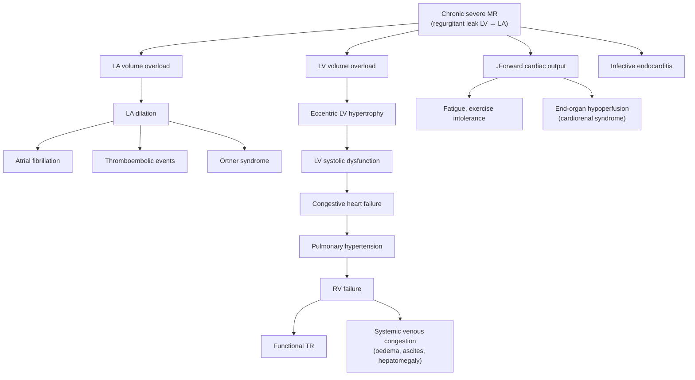

## Complications of Mitral Regurgitation

Complications of MR can be thought of as the downstream consequences of the core haemodynamic disturbance: blood leaking backward from the LV into the LA during systole. Every complication traces back to one of three fundamental problems — **volume overload of the LA**, **volume overload of the LV**, or **reduced forward cardiac output**. Additionally, there are complications of the **underlying aetiology** itself and complications related to **surgical intervention**.

Let's work through each systematically, linking every complication to its pathophysiological origin.

---

### 1. Complications of Chronic MR — The Natural History

The natural history of untreated severe MR is a progressive march through the following complications. The sequence is predictable and directly mirrors the pathophysiology discussed earlier:

---

### 2. Detailed Complications

#### 2.1 Atrial Fibrillation (AF)

***AF occurs in approximately 1/3 of patients with severe chronic MR*** [2].

**Pathophysiology from first principles:**
- Chronic MR → regurgitant volume enters the LA during every systole → LA volume overload → **LA dilation**
- LA dilation causes **mechanical stretch** of atrial myocytes → structural remodelling (fibrosis of the atrial wall) + electrical remodelling (shortened refractoriness, altered conduction velocities)
- This creates the substrate (patchy fibrosis → areas of slow conduction) and triggers (stretched myocytes → ectopic foci, especially from the pulmonary veins) for **re-entrant circuits** → AF

**Why does AF matter so much in MR?**
1. **Loss of atrial contraction** → loss of the "atrial kick" (normally contributes ~15–25% of LV filling). In a heart already compromised by MR, this loss of the atrial contribution precipitates decompensation
2. **Rapid ventricular rate** → ↓diastolic filling time → ↓forward CO + ↑LA pressure → acute pulmonary congestion
3. **Blood stasis in the dilated LA** → **thromboembolism risk** (see below)
4. ***New-onset AF is an indication for surgery*** even in asymptomatic patients [2][3] — it signals that LA remodelling has progressed to the point of electrical instability

**Management**: ***AF: anticoagulation, rate control*** [3]. Warfarin (INR 2–3) or DOAC for stroke prevention. Rate control with beta-blockers, digoxin, or non-DHP CCB.

#### 2.2 Thromboembolism and Stroke

***Embolic stroke*** is listed as a specific complication of MR and MVP [3].

**Pathophysiology:**
- LA dilation + loss of effective atrial contraction (AF or even in sinus rhythm with a severely dilated, "stunned" LA) → **blood stasis** in the LA, especially in the **left atrial appendage (LAA)**
- Stasis → thrombus formation (Virchow's triad: stasis + endothelial injury + hypercoagulability)
- Thrombus embolisation → **systemic embolism**, most devastatingly to the brain (embolic stroke), but also to kidneys (renal infarction), spleen (splenic infarction), mesenteric vessels (mesenteric ischaemia), and peripheral arteries (acute limb ischaemia)

**In MVP specifically**: ***Embolism due to microthrombus formation behind redundant valve tissue*** [4]. The redundant, billowing leaflet creates a "dead space" on its atrial surface where flow is turbulent and stagnant → platelet-fibrin deposition → microthrombi → embolic events.

**Clinical significance**: Stroke in a young patient with MR or MVP should always prompt echocardiography (TTE/TEE) to look for LA thrombus, severe LA dilation, and valve pathology.

#### 2.3 Left Ventricular Dysfunction and Heart Failure

This is the **most important complication** of chronic MR because it determines prognosis and surgical timing.

**Pathophysiology — the vicious cycle:**
- Chronic MR → LV volume overload → eccentric LV hypertrophy (sarcomere addition in series → LV dilation)
- Initially compensatory: the Frank-Starling mechanism maintains stroke volume
- Over years, the chronically overloaded myocardium undergoes adverse remodelling: myocyte apoptosis, interstitial fibrosis, neurohumoral activation (RAAS, sympathetic nervous system)
- This leads to **intrinsic myocardial contractile dysfunction** (↓LVEF)
- Once LV systolic function declines, the heart enters a decompensated phase: ↓forward CO + ↑LV filling pressures → clinical heart failure

***Once severe, MR is NOT benign: patients develop symptoms at 10%/year, AF in 1/3*** [2].

***90% of asymptomatic patients with normal LVEF will have surgery at 10 years*** [2] — meaning that even initially "benign-looking" severe MR progresses inevitably.

<Callout title="The Irreversibility Problem" type="error">
***Surgery should be done early to avoid development of irreversible ↓LV function*** [2]. The LV dysfunction in MR is initially reversible — if the volume overload is removed (by fixing the valve), the LV can recover. But beyond a certain point (LVEF < 30–40%, extensive fibrosis), the damage becomes permanent. This is why the surgical threshold is LVEF < 60% or LVESD ≥ 40 mm — to intervene BEFORE irreversibility sets in.
</Callout>

#### 2.4 Pulmonary Hypertension (pHTN)

***Pulmonary hypertension only occurs late when the LV fails due to volume overload*** [2].

**Pathophysiology — two components:**

| Component | Mechanism | Reversibility |
|---|---|---|
| **Passive (postcapillary)** | ↑LA pressure → transmitted backward to pulmonary veins → ↑pulmonary venous pressure → ↑pulmonary capillary pressure → ↑PAP | Potentially reversible if LA pressure is normalised (by fixing the valve) |
| **Reactive (precapillary component superimposed)** | Chronic ↑pulmonary venous pressure → reactive vasoconstriction of pulmonary arterioles + structural remodelling (medial hypertrophy, intimal fibrosis of pulmonary arterioles) → **fixed ↑pulmonary vascular resistance (PVR)** | May become irreversible if long-standing → surgery may not fully reverse the pHTN |

**Clinical signs of pulmonary hypertension** [3]:
- ***Elevated JVP with systolic "v" waves (functional TR)***
- ***Parasternal heave (RV pressure overload)***
- ***Parasternal thrills (functional TR)***
- ***Loud P2***
- ***Pansystolic murmur of TR***
- ***Graham-Steell murmur of PR*** — ***PR murmur, associated with loud P2, indicating severe MS*** [3] (though it can occur in any cause of severe pulmonary HTN, including advanced MR)

**Why it matters**: ***New-onset pulmonary hypertension (sPAP > 50 mmHg) is an indication for surgery*** [3] — it signals that the backward pressure is now remodelling the pulmonary vasculature. Delay risks irreversible pulmonary vascular disease.

#### 2.5 Right Heart Failure

Right heart failure is the **end-stage** complication of chronic MR, representing the final common pathway of untreated disease.

**Pathophysiology chain:**
Chronic MR → LV failure → ↑LA pressure → pulmonary venous HTN → pulmonary arterial HTN → ↑RV afterload → RV pressure overload → RV hypertrophy → eventually RV dilation and failure

**Clinical features of RV failure** [2][3]:
- ***Ankle oedema (if RVF)*** [2] — hydrostatic back-pressure in systemic veins → transudation into interstitial space, gravitationally dependent
- Elevated JVP — systemic venous congestion directly reflected by ↑RA pressure
- Hepatomegaly ± pulsatile liver — hepatic venous congestion → hepatic enlargement. If TR is present (functional TR from RV dilation), the liver pulsates with each systolic regurgitant wave.
- Ascites — portal venous congestion → transudation into peritoneal cavity
- ***Functional TR*** — RV dilation → tricuspid annulus dilation → TR → further systemic venous congestion (a self-perpetuating cycle)

#### 2.6 Infective Endocarditis (IE)

MR increases the risk of IE because the regurgitant jet creates **endothelial damage** on the atrial surface of the mitral valve and the LA wall.

**Pathophysiology:**
- The high-velocity regurgitant jet impacts the atrial surface of the valve leaflets and the adjacent LA endocardium
- This jet lesion creates areas of endothelial denudation → deposition of platelets and fibrin → **non-bacterial thrombotic endocarditis (NBTE)** — a sterile "landing pad"
- During transient bacteraemia (dental procedures, invasive procedures, even daily activities like tooth-brushing), circulating bacteria adhere to this fibrin-platelet nidus → colonisation → vegetation formation → IE

***Valve involvement in IE: MV >> AV > TV > PV*** [3] — the mitral valve is the most commonly affected valve overall.

***Infective endocarditis despite optimal medical therapy*** is an indication for surgery [3].

IE complicating MR can worsen the regurgitation through:
- Leaflet destruction/perforation
- Chordal rupture (vegetations weaken chordae)
- Abscess formation at the annulus

This creates a dangerous positive feedback loop: MR → IE → worsened MR → acute decompensation.

#### 2.7 Ortner Syndrome (Cardiovocal Syndrome)

***Ortner's syndrome: LA enlargement → compression of left recurrent laryngeal nerve (RLN) → hoarseness of voice*** [3].

**Pathophysiology from first principles:**
- The left RLN loops under the aortic arch and passes between the aorta and the pulmonary artery before ascending to the larynx
- Massive LA dilation (as seen in severe chronic MR, MS, or any cause of giant LA) pushes upward against the left main bronchus and the space between the aorta and pulmonary artery
- This compresses the left RLN → left vocal cord paralysis → hoarseness

This is more classically associated with MS (where LA dilation is typically more extreme), but can occur in severe chronic MR with a giant LA. It is rarely the presenting complaint but can be an exam question.

#### 2.8 Acute Mechanical Complications of MI Causing Acute MR

***Acute mechanical complications from MI*** that cause MR are specific and high-mortality [1]:

- ***MR from rupture of papillary head*** [1] — typically occurs 2–7 days post-MI (when the necrotic tissue is weakest and granulation tissue has not yet formed). The posteromedial papillary muscle is most vulnerable (single blood supply from the PDA/RCA).
- This is ***high risk for mortality*** [1].
- Presentation: sudden haemodynamic collapse with flash pulmonary oedema, often with a **surprisingly soft murmur** (because rapid LV-LA pressure equilibration reduces the murmur intensity)
- Other acute mechanical complications listed alongside acute MR [1]:
  - ***Shock from large area (~40%) myocardium involved***
  - ***VSD from transmural infarct and rupture of muscular septum***
  - ***Tamponade from free wall rupture, myocarditis, pericarditis, iatrogenic***

<Callout title="Post-MI Mechanical Complications — All High Mortality" type="error">
***Anyone of these is high risk for mortality*** [1]. Post-MI acute MR from papillary muscle rupture has mortality approaching 50% without surgery and up to 20–25% even with emergency surgery. The key is **rapid diagnosis** (bedside echo) and **immediate surgical intervention**.
</Callout>

---

### 3. Complications Specific to MVP [3][4]

MVP has its own set of complications, some overlapping with general MR complications and some unique:

| Complication | Mechanism |
|---|---|
| ***Progression to severe MR*** [3] | Progressive myxomatous degeneration → leaflet elongation and chordal stretching → worsening prolapse → increasing MR. Can be chronic (gradual) or acute (chordal rupture). |
| ***Embolic stroke*** [3] | ***Embolism due to microthrombus formation behind redundant valve tissue*** [4] — the billowing leaflet creates turbulent, stagnant flow on its atrial surface → platelet-fibrin deposition → microemboli |
| ***Endocarditis*** [3] | Abnormal valve surface → predisposition to bacterial colonisation during bacteraemia |
| ***Arrhythmia (prolonged QT)*** [3] | ***Arrhythmias: atrial or ventricular*** [4]. Mechanism: papillary muscle traction → myocardial ischaemia → arrhythmogenic substrate. Prolonged QT may predispose to torsades de pointes. |
| **Sudden cardiac death** | Rare but recognised — thought to be due to ventricular arrhythmias, possibly related to papillary muscle traction, myocardial fibrosis at leaflet insertion points, or associated prolonged QT |

---

### 4. Complications of Surgical Intervention

Surgical treatment of MR — while definitive — carries its own set of complications [2][11]:

#### 4.1 General Surgical Complications

| Complication | Mechanism |
|---|---|
| **CVA (stroke)** | Air embolism during cardiopulmonary bypass; thromboembolism from manipulation of the aorta or LA; atrial fibrillation post-operatively |
| **Severe infection** | Sternal wound infection (especially after median sternotomy); mediastinitis; prosthetic valve endocarditis |
| **Bleeding** | Heparinisation during cardiopulmonary bypass → coagulopathy; surgical bleeding from suture lines; post-operative anticoagulation for mechanical valve |
| **Multi-organ failure** | Prolonged cardiopulmonary bypass → systemic inflammatory response; low cardiac output syndrome post-operatively → end-organ ischaemia |

#### 4.2 Specific Cardiac Complications

| Complication | Mechanism |
|---|---|
| **Heart block** | The mitral annulus is in close proximity to the atrioventricular (AV) node and the bundle of His, especially posteriorly. Suturing an annuloplasty ring or prosthetic valve too deep posteriorly can injure the conduction system → complete heart block requiring permanent pacemaker. |
| **Heart failure** | Perioperative myocardial stunning from ischaemia during aortic cross-clamping; loss of chordal/papillary muscle function (if not preserved during replacement) → post-operative LV dysfunction |
| **Perioperative MI** | Air or thrombotic embolism into coronary arteries; inadequate myocardial protection during bypass; kinking of coronary arteries during surgery |

#### 4.3 Prosthetic Valve-Specific Complications

| Complication | Mechanical Valve | Bioprosthetic Valve |
|---|---|---|
| **Thrombosis/embolism** | High risk without adequate anticoagulation → valve thrombosis (obstruction) or systemic embolism. INR 2.5–3.5 required lifelong for mitral position. | Low risk; short-term anticoagulation only |
| **Bleeding** | From lifelong warfarin therapy — intracranial haemorrhage, GI bleeding, etc. Annual risk ~1–2%. | Minimal (no long-term anticoagulation) |
| **Structural valve deterioration** | Virtually none (lasts > 25 years) | ***Degenerates over 10–15 years*** — leaflets undergo calcification and tearing. Faster in younger patients and in the mitral position (higher closing pressures). Requires reoperation. |
| **Prosthetic valve endocarditis** | ~1% per year. Early ( < 12 months): coagulase-negative Staph; Late ( > 12 months): similar to native valve IE. Mortality high (up to 60%). | Similar risk |
| **Haemolysis** | Mechanical valve → mechanical shear stress on RBCs passing through the prosthesis → chronic intravascular haemolysis. Usually subclinical but can cause anaemia. Paravalvular leak worsens haemolysis (turbulent flow through the gap). | Minimal |
| **Pannus formation** | Tissue ingrowth over the prosthetic valve ring → gradual obstruction. Occurs more with mechanical valves. | Rare |
| **Patient-prosthesis mismatch** | Effective orifice area of the prosthesis too small for the patient's body surface area → residual gradient → functional stenosis. More common with smaller valve sizes. | Same risk |

#### 4.4 Complications of MitraClip / TEER

| Complication | Mechanism |
|---|---|
| **Residual MR** | Clip may not achieve adequate leaflet coaptation → persistent regurgitation requiring further intervention |
| **Mitral stenosis** | Clip creates a double-orifice valve → if the remaining orifice areas are too small, functional stenosis results |
| **Clip detachment** | Rare — the clip can embolise or partially detach, worsening MR acutely |
| **Vascular access complications** | Large-bore femoral venous access + transseptal puncture → bleeding, femoral AV fistula, cardiac perforation, pericardial tamponade |
| **Residual ASD** | Transseptal puncture creates an iatrogenic ASD that may not close spontaneously |

---

### 5. When Valve Disease Is Not Repairable

***When valve disease is not repairable*** [1]:
- ***Most aortic valve disease — very difficult to repair***
- ***Most mitral stenosis — no normal tissue to repair***
- ***Some mitral regurgitation — congenital disease, too complex, or suboptimal repair***

This is an important concept because it determines whether a patient receives a repair (with all its advantages) or a replacement (with the prosthesis-related complications listed above). The decision is made intraoperatively when the surgeon directly visualises the valve.

---

<Callout title="High Yield Summary — Complications of MR">

**Haemodynamic complications (predictable cascade):**
1. **LA dilation** → ***AF (1/3 of severe MR)*** [2] → thromboembolism/stroke
2. **LV volume overload** → eccentric hypertrophy → ***LV systolic dysfunction (irreversible if delayed)*** [2] → HF
3. **↑LA pressure** → ***pulmonary HTN (late)*** [2] → **RV failure** → systemic congestion

**Specific complications:**
- ***Ortner syndrome***: LA dilation → compression of left RLN → hoarseness [3]
- ***IE***: regurgitant jet damages endocardium → predisposes to bacterial colonisation [3]
- ***Post-MI papillary muscle rupture***: ***high risk for mortality*** [1] — surgical emergency

**MVP complications** [3]: ***embolic stroke, endocarditis, arrhythmia (prolonged QT), progression to severe MR***

**Surgical complications**: heart block, HF, perioperative MI, stroke, bleeding, infection. Prosthetic valve: thrombosis (mechanical), structural deterioration (bioprosthetic), endocarditis, haemolysis.

**Key triggers for surgery (= complications that demand intervention)** [2][3]: new AF, PASP > 50 mmHg, LVEF < 60%, LVESD ≥ 40 mm.

</Callout>

---

<ActiveRecallQuiz
  title="Active Recall - Complications of Mitral Regurgitation"
  items={[
    {
      question: "Explain the pathophysiological chain from chronic MR to right heart failure.",
      markscheme: "Chronic MR → LV volume overload → LV dilation and eventual LV systolic dysfunction → ↑LV end-diastolic pressure → ↑LA pressure → backward transmission to pulmonary veins → pulmonary venous hypertension → reactive pulmonary arteriolar vasoconstriction and remodelling → pulmonary arterial hypertension → ↑RV afterload → RV hypertrophy → RV dilation and failure → systemic venous congestion (oedema, ascites, hepatomegaly, ↑JVP)."
    },
    {
      question: "Why does AF precipitate acute decompensation in a patient with previously stable chronic MR?",
      markscheme: "AF causes: (1) Loss of atrial kick - the atrial contraction normally contributes 15-25% of LV filling; in MR where forward output is already compromised, this loss is significant. (2) Rapid ventricular rate shortens diastolic filling time, reducing forward CO and increasing LA pressure. (3) Irregular R-R intervals impair cardiac efficiency. Together these precipitate acute pulmonary congestion and HF symptoms in a previously compensated patient."
    },
    {
      question: "What is Ortner syndrome and what is its pathophysiological mechanism?",
      markscheme: "Ortner syndrome (cardiovocal syndrome) is hoarseness of voice caused by compression of the left recurrent laryngeal nerve by a massively dilated left atrium. The left RLN loops under the aortic arch between the aorta and pulmonary artery. LA enlargement pushes upward against this space, compressing the nerve, causing left vocal cord paralysis and hoarseness. More common in MS but can occur in severe chronic MR."
    },
    {
      question: "Why does post-MI papillary muscle rupture typically occur 2-7 days after the infarct rather than immediately?",
      markscheme: "In the first 2-7 days post-MI, the necrotic myocardium is at its weakest - the dead tissue has undergone coagulative necrosis and is being broken down by macrophages, but granulation tissue and fibrosis have not yet formed to provide structural support. This window of maximal tissue weakness is when mechanical complications (papillary muscle rupture, VSD, free wall rupture) are most likely to occur."
    },
    {
      question: "List 3 complications specific to mechanical mitral valve prostheses and explain why each occurs.",
      markscheme: "(1) Thrombosis/embolism - mechanical surfaces are thrombogenic; the mitral position has lower flow velocities → more stasis → higher thrombogenicity requiring lifelong warfarin INR 2.5-3.5. (2) Anticoagulation-related bleeding - lifelong warfarin carries 1-2% annual risk of major haemorrhage (intracranial, GI). (3) Chronic intravascular haemolysis - mechanical shear stress from the rigid prosthetic valve damages RBCs passing through it; worsened by paravalvular leak creating turbulent flow."
    }
  ]}
/>

## References

[1] Lecture slides: Cardiac Surgery Tutorial_Prof. D Chan.pdf (p31, p38, p43, p46, p56)
[2] Senior notes: Ryan Ho Cardiology.pdf (p155, p157)
[3] Senior notes: Maksim Medicine Notes.pdf (p35, p36, p37)
[4] Senior notes: Ryan Ho Cardiology.pdf (p157 — MVP complications)
[11] Senior notes: Ryan Ho Cardiology.pdf (p154 — surgical approach and complications)
