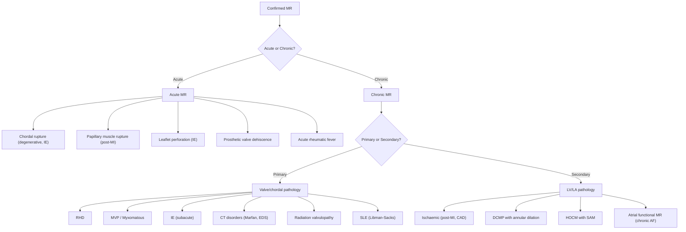

## Differential Diagnosis of Mitral Regurgitation

When you encounter a patient with suspected MR — say, a pansystolic murmur at the apex — the clinical challenge is twofold: (1) confirming that the murmur truly represents MR rather than another condition that mimics it, and (2) determining the underlying aetiology of the MR itself. Let's work through both systematically.

### Approach to Differential Diagnosis

The differential diagnosis of MR operates on two levels:

1. **Mimics of MR** — other conditions that produce a pansystolic or systolic murmur that can be confused with MR
2. **Aetiological differentiation** — once MR is confirmed, determining *why* the valve is leaking (primary vs. secondary, acute vs. chronic)

---

### Level 1: Conditions That Mimic MR (Differential of the Pansystolic/Systolic Murmur)

The cardinal sign of MR is a **pansystolic murmur (PSM) best heard at the apex, radiating to the axilla** [2]. But several other conditions can produce systolic murmurs that may be confused with MR. The key to differentiation lies in understanding *where* each murmur is best heard, *why* it has its particular character, and how dynamic manoeuvres and bedside examination separate them.

#### A. Tricuspid Regurgitation (TR)

| Feature | MR | TR |
|---|---|---|
| **Best heard** | Apex | Left lower sternal border (LLSB) |
| **Radiation** | Axilla | Right sternal border; may radiate to subxiphoid |
| **Inspiration** | No significant change (or slight ↓) | **↑ with inspiration (Carvallo's sign)** [3] |
| **Apex** | Displaced, thrusting | Usually not displaced (unless biventricular failure) |
| **Associated signs** | LV failure signs | RV failure signs: ↑JVP with prominent **cv waves**, pulsatile hepatomegaly, peripheral oedema, ascites |

**Why does TR get louder with inspiration?** Inspiration increases venous return to the right heart (↓intrathoracic pressure → ↑pressure gradient from systemic veins to RA). This ↑RV preload → ↑RV volume → ↑regurgitant flow across the tricuspid valve → louder murmur. This is **Carvallo's sign** — the single most useful bedside manoeuvre to distinguish TR from MR [3].

**Why does MR NOT increase with inspiration?** The left heart is "downstream" of the pulmonary circulation. While inspiration transiently pools blood in the pulmonary vasculature (↓LV preload slightly), the effect on MR murmur intensity is minimal or slightly decreasing — the opposite of TR.

<Callout title="Carvallo's Sign" type="idea">
***Carvallo's sign: TR = pansystolic murmur louder in inspiration*** [3]. This is the single most tested bedside manoeuvre for distinguishing TR from MR. The mechanism is simple: inspiration ↑venous return to the right heart → ↑RV volume → ↑regurgitant flow.
</Callout>

#### B. Aortic Stenosis (AS)

| Feature | MR | AS |
|---|---|---|
| **Murmur type** | Pansystolic (constant intensity throughout systole) | Ejection systolic (crescendo-decrescendo) |
| **Best heard** | Apex | Right upper sternal border (aortic area) |
| **Radiation** | Axilla | Carotids |
| **Pulse** | Small volume (if severe) but normal character | ***Low-volume, slow-rising pulse*** [3] |
| **S2** | Soft S1; S2 obscured by murmur | ***Soft/absent A2, reverse splitting of S2*** [3] |
| **Apex** | Displaced, thrusting (volume overload) | ***Heaving apex*** (pressure overload, concentric LVH) [3] |
| **Extra sounds** | S3 | ***S4*** [3] |

**The Gallavardin phenomenon — a common trap:**
***AS can present as an ejection systolic murmur (ESM) best heard at the apex, mimicking MR. This is the Gallavardin phenomenon, more common in the elderly*** [3]. Why does this happen? In calcific AS, the murmur has two components — a low-frequency component transmitted to the apex (sounding like MR) and a high-frequency component transmitted to the carotids. The carotid radiation and slow-rising pulse help distinguish it.

**The reverse trap — ischaemic MR mimicking AS:**
***In ischaemic papillary muscle dysfunction, the regurgitant jet may be directed to the anterior LA → best heard at LSB/aortic areas (mimicking ESM of AS)*** [2]. Here, the posterior leaflet is tethered by the displaced papillary muscle, directing the jet anteriorly. The key differentiator is the pulse character (normal or small volume in MR vs. slow-rising in AS) and echocardiography.

#### C. Hypertrophic Obstructive Cardiomyopathy (HOCM)

| Feature | MR | HOCM |
|---|---|---|
| **Murmur** | PSM at apex → axilla | ***ESM at LLSB*** [4]; may also have a separate MR murmur |
| **Apex** | Displaced, thrusting | ***Non-displaced*** [4] (LV cavity is small due to hypertrophy) |
| **Valsalva** | ↓Softer | ↑Louder (↓preload → ↓LV cavity size → ↑obstruction) |
| **Squatting** | ↑Louder | ↓Softer (↑preload + ↑afterload → ↑LV cavity size → ↓obstruction) |
| **Pulse** | Small volume | ***Jerky pulse*** (dynamic obstruction causes rapid early upstroke then mid-systolic dip) |

**Why does HOCM cause MR?** ***Asymmetric septal hypertrophy (ASH) → anterior displacement of papillary muscles → systolic anterior motion (SAM) of the mitral valve anterior leaflet toward the septum → MR. The severity of MR is directly proportional to the LV outflow obstruction*** [5]. So in HOCM, MR and LVOT obstruction are linked — anything that worsens obstruction worsens MR.

**Critical distinction with dynamic manoeuvres:** HOCM is the **only common murmur that gets louder with Valsalva** (strain phase). All other systolic murmurs generally get softer. This is because ↓preload in HOCM → ↓LV cavity size → the hypertrophied septum and anterior mitral leaflet are brought closer together → ↑obstruction → louder murmur.

<Callout title="Important d/dx for MVP" type="idea">
The senior notes specifically list the ***important differential diagnoses for MVP: other causes of MR (e.g., DCMP), TR, AS, HOCM (ESM at LLSB, non-displaced apex)*** [4]. These are the four conditions most commonly confused with MVP on auscultation.
</Callout>

#### D. Ventricular Septal Defect (VSD)

| Feature | MR | VSD |
|---|---|---|
| **Murmur** | PSM at apex → axilla | PSM at LLSB → all over precordium |
| **Best heard** | Apex | LLSB (3rd–4th intercostal space) |
| **Thrill** | Apex | LLSB |
| **Radiation** | Axilla | Across the precordium, NOT to axilla |
| **Associated features** | LV dilation signs | Depends on shunt size; large VSD → pulmonary HTN |

**Why is VSD a PSM?** During systole, the LV pressure greatly exceeds RV pressure. Blood is shunted from LV → RV through the defect throughout systole, creating a continuous pressure gradient and therefore a pansystolic murmur. The mechanism is analogous to MR (constant systolic pressure gradient driving flow), but the flow goes from LV → RV rather than LV → LA, so the murmur is located at the LLSB (over the septum) rather than the apex.

**Paradox of VSD murmur intensity:** A small, restrictive VSD produces a **louder** murmur than a large, non-restrictive VSD. This is because in a small VSD, the pressure gradient is high → high-velocity turbulent flow → loud murmur. In a large VSD, pressures equalize between ventricles → low-velocity flow → soft murmur (or even absent in Eisenmenger syndrome when the shunt reverses).

#### E. Other Differentials

| Condition | Key Distinguishing Feature |
|---|---|
| **Innocent/flow murmur** | Soft, ejection systolic, grade ≤ 2/6, no radiation, normal S1/S2, no associated symptoms. Common in children, pregnancy, high-output states (anaemia, thyrotoxicosis, fever). Disappears on standing/Valsalva. |
| **Aortic regurgitation (functional murmur at apex)** | ***Austin-Flint murmur: mid-diastolic low-pitched apical murmur due to heavy AR regurgitation jet impinging on anterior leaflet of mitral valve → turbulent atrial outflow*** [6]. This is a diastolic murmur mimicking MS, NOT MR — but it can coexist with MR in mixed valve disease. |
| **Mitral stenosis (MS)** | Mid-diastolic rumble at apex (not systolic). But MS and MR frequently coexist (***RHD causes both; 50% of RHD-related MR is associated with MS*** [2]). An opening snap and presystolic accentuation (if in sinus rhythm) distinguish the MS component. |
| **Pulmonary regurgitation (PR) / Graham-Steell murmur** | ***Early diastolic murmur at the pulmonic area, associated with loud P2, indicating severe MS*** [3] — this is secondary to pulmonary hypertension from any cause (including severe MR). Not a mimic of MR per se, but a consequence. |

---

### Level 2: Aetiological Differential — What Is Causing the MR?

Once MR is confirmed (by auscultation, echocardiography, or both), the next step is determining the **underlying cause**. This guides management — primary MR may benefit from valve repair/replacement, while secondary MR requires treatment of the underlying cardiac pathology.

#### Key Clinical Clues for Aetiological Differentiation

| Clue | Points Toward |
|---|---|
| Young patient, migratory joint history, subcutaneous nodules | **Rheumatic heart disease** |
| Mid-systolic click + late systolic murmur in a young female | **MVP / Myxomatous degeneration** |
| Tall, thin habitus, arachnodactyly, lens subluxation, pectus excavatum | **Marfan syndrome** (connective tissue) |
| ***Fever, weight loss, new-onset regurgitation murmur, peripheral stigmata (Osler nodes, Janeway lesions, splinter haemorrhages, Roth spots)*** [7] | ***Infective endocarditis*** |
| Acute onset post-MI (especially inferior MI), haemodynamic collapse | **Papillary muscle rupture/dysfunction** (ischaemic) |
| Known DCMP / progressive LV dilation on prior imaging | **Functional MR from annular dilation** |
| ***ESM at LLSB, non-displaced apex, jerky pulse, FHx of sudden death*** | ***HOCM with SAM*** [4][5] |
| ***Prosthetic valve, prior valve repair, positive blood cultures*** | ***Prosthetic valve endocarditis or dehiscence*** [7] |
| Chronic AF with progressive LA dilation, no LV dysfunction | **Atrial functional MR** |
| History of chest radiation (e.g., Hodgkin lymphoma) | **Radiation valvulopathy** |
| Malar rash, arthralgia, serositis, ANA positivity | **SLE (Libman-Sacks endocarditis)** |

---

### Level 3: Differential of the Clinical Presentation of MR

Patients with MR don't present saying "I have mitral regurgitation." They present with symptoms — **dyspnoea, fatigue, or acute pulmonary oedema** — that have a broad differential diagnosis. The clinician must consider the full differential of these presentations.

#### Differential of Chronic Dyspnoea + Fatigue (Common Presentation of Chronic MR)

| Category | Condition | Distinguishing Feature |
|---|---|---|
| **Cardiac** | Other valvular disease (AS, MS, AR) | Different murmur characteristics; echo is definitive |
| | Heart failure (HFrEF/HFpEF) | ***MR itself is a common cause of LV volume overload leading to HF*** [8]. Other causes: CAD, DCMP, HTN. Echo differentiates. |
| | Constrictive pericarditis | Kussmaul's sign, pericardial knock, calcification on CXR/CT |
| **Pulmonary** | COPD, asthma | Wheeze, hyperinflation on CXR, obstructive pattern on spirometry |
| | Interstitial lung disease | Bibasal fine crackles, restrictive pattern, HRCT findings |
| | Pulmonary hypertension (primary) | Loud P2, RV heave, no LV signs |
| **Systemic** | Anaemia | Pallor, flow murmur (ESM), high-output state |
| | Thyrotoxicosis | Weight loss, tremor, tachycardia, AF, thyroid function tests |
| **Deconditioning** | Obesity, sedentary lifestyle | Diagnosis of exclusion |

#### Differential of Acute Pulmonary Oedema (Presentation of Acute MR)

| Cause | Key Feature |
|---|---|
| **Acute MR** (chordal/papillary muscle rupture) | Post-MI, IE, sudden haemodynamic collapse, soft/decrescendo murmur |
| **Acute MI / ACS** | Chest pain, ECG changes, troponin elevation |
| **Acute aortic regurgitation** | ***Aortic dissection, IE*** — tearing chest pain, asymmetric BP, early diastolic murmur [3] |
| **Hypertensive crisis (flash pulmonary oedema)** | Severe hypertension, often with renal artery stenosis |
| **Acute decompensated HF** | Known HF history, precipitant (medication non-compliance, infection, arrhythmia) |
| **Acute VSD (post-MI)** | New harsh PSM at LLSB post-MI, thrill |

<Callout title="Post-MI Mechanical Complications — DDx of Acute Deterioration" type="error">
After MI, sudden haemodynamic deterioration with a new murmur must prompt urgent differentiation between: (1) **acute MR** from papillary muscle rupture/dysfunction — PSM at apex; (2) **acute VSD** — PSM at LLSB with thrill; (3) **free wall rupture** — cardiac tamponade, PEA. All are surgical emergencies. A bedside echo (or urgently a TEE) is the fastest way to differentiate. Do NOT wait for catheterisation.
</Callout>

---

### Systematic Clinical Approach to Differentiation

The following systematic approach can be used at the bedside to narrow the differential when a systolic murmur is heard:

| Step | Assessment | What It Tells You |
|---|---|---|
| 1. Location | Where is it loudest? | Apex = MR or MVP; LLSB = TR, HOCM, or VSD; RUSB = AS |
| 2. Radiation | Where does it go? | Axilla = MR; carotids = AS; across precordium = VSD |
| 3. Character | PSM or ESM? | PSM = MR, TR, VSD; ESM = AS, HOCM, innocent |
| 4. Inspiration | Louder? | Yes = right-sided (TR) — Carvallo's sign |
| 5. Valsalva | Louder? | Yes = HOCM only; softer = everything else |
| 6. Pulse | Character? | Slow-rising = AS; jerky = HOCM; collapsing = AR |
| 7. Apex | Position and character? | Displaced thrusting = MR (volume overload); heaving = AS/HTN; non-displaced = HOCM |
| 8. Extra sounds | Clicks, S3, S4? | Mid-systolic click = MVP; S3 = chronic MR; S4 = AS or acute MR |

---

### Non-Valvular Differentials to Keep in Mind

Not all PSMs are from valve disease. Always consider:

- **Prosthetic heart valve dysfunction**: mechanical valve — listen for abnormal clicks or new murmurs; bioprosthetic valve — degeneration over time
- **Microangiopathic haemolytic anaemia (MAHA) from prosthetic valve**: ***prosthetic heart valve can cause intravascular RBC fragmentation (non-immune haemolysis)*** [9] — presents with anaemia, jaundice, and schistocytes on blood film. The MR here is from paravalvular leak or valve dysfunction.
- ***Non-bacterial thrombotic endocarditis (NBTE)***: ***deposition of sterile thrombus on valve leaflets in the context of metastatic malignancy (marantic endocarditis, especially mucin-producing adenocarcinoma), thrombophilia, or SLE (Libman-Sacks endocarditis)*** [7]. Site: ***mitral valve > aortic valve > tricuspid valve > pulmonary valve*** [7]. This can cause MR but does not respond to antibiotics — treatment is directed at the underlying cause.

---

<Callout title="High Yield Summary — Differential Diagnosis of MR">

**Mimics of MR murmur:**
- **TR**: PSM at LLSB, ↑with inspiration (Carvallo's sign), RV failure signs
- **AS**: ESM at RUSB → carotids, slow-rising pulse, heaving apex; Gallavardin phenomenon can mimic MR at apex
- **HOCM**: ESM at LLSB, non-displaced apex, jerky pulse, ↑with Valsalva, associated SAM causing MR
- **VSD**: PSM at LLSB, thrill at LLSB, does NOT radiate to axilla

**Ischaemic MR can mimic AS** — anterior jet direction from posterior leaflet tethering → heard at LSB/aortic area.

**Aetiological DDx**: Primary (RHD, MVP, IE, CT disorders) vs. Secondary (ischaemic, DCMP, HOCM with SAM)

**Post-MI new murmur**: Must differentiate acute MR (papillary muscle rupture) from acute VSD and free wall rupture — all surgical emergencies. Bedside echo is key.

</Callout>

---

<ActiveRecallQuiz
  title="Active Recall - Differential Diagnosis of Mitral Regurgitation"
  items={[
    {
      question: "What is Carvallo's sign and how does it help differentiate TR from MR?",
      markscheme: "Carvallo's sign = TR murmur (PSM at LLSB) becomes louder with inspiration. Mechanism: inspiration increases venous return to the right heart, increasing RV preload and regurgitant flow. MR murmur does not increase (or may decrease slightly) with inspiration because the left heart is not directly affected by the increased venous return. This is the most useful bedside manoeuvre to distinguish TR from MR."
    },
    {
      question: "Why is HOCM the only common systolic murmur that gets louder with Valsalva strain?",
      markscheme: "Valsalva strain decreases venous return (preload), which decreases LV cavity size. In HOCM, a smaller LV cavity brings the hypertrophied septum and the anterior mitral leaflet closer together, worsening LVOT obstruction and increasing the murmur. All other systolic murmurs (MR, AS, VSD) get softer because decreased preload means less blood flow across the valve."
    },
    {
      question: "A patient post-inferior MI develops sudden pulmonary oedema and a new systolic murmur at the apex. List 3 mechanical complications to consider and the key investigation to differentiate them.",
      markscheme: "Three mechanical complications: (1) Acute MR from papillary muscle rupture or dysfunction - PSM at apex; (2) Acute VSD - PSM at LLSB with thrill; (3) Free wall rupture - cardiac tamponade, PEA arrest. Key investigation: bedside echocardiography (TTE or urgently TEE) to visualise the specific lesion. Do not wait for catheterisation."
    },
    {
      question: "What is the Gallavardin phenomenon and why does it cause diagnostic confusion?",
      markscheme: "Gallavardin phenomenon: AS murmur heard best at the apex, mimicking MR. More common in elderly patients with calcific AS. The AS murmur has two components - a high-frequency component transmitted to carotids and a low-frequency musical component transmitted to the apex. The apical component can sound like MR. Differentiation: pulse character (slow-rising in AS), S2 findings (soft/absent A2), and echo."
    },
    {
      question: "Name 3 clinical clues that point toward infective endocarditis as the cause of MR.",
      markscheme: "Any 3 of: (1) Persistent fever with new-onset regurgitation murmur; (2) Peripheral stigmata - Osler nodes, Janeway lesions, splinter haemorrhages, Roth spots; (3) Positive blood cultures (typical organisms in multiple sets); (4) Weight loss and constitutional symptoms; (5) Evidence of septic embolism (stroke, splenic/renal infarcts); (6) Risk factors such as prosthetic valve, IVDU, prior IE."
    }
  ]}
/>

## References

[2] Senior notes: Ryan Ho Cardiology.pdf (p155, p157)
[3] Senior notes: Maksim Medicine Notes.pdf (p35, p37)
[4] Senior notes: Ryan Ho Cardiology.pdf (p157 — MVP section, footnote 150 — important d/dx)
[5] Senior notes: Ryan Ho Cardiology.pdf (p167 — HOCM with SAM)
[6] Senior notes: Ryan Ho Fundamentals.pdf (p36 — Austin-Flint murmur, diastolic murmurs)
[7] Senior notes: Ryan Ho Cardiology.pdf (p148–149 — infective endocarditis, NBTE)
[8] Senior notes: Maksim Medicine Notes.pdf (p18 — heart failure, aetiology)
[9] Senior notes: Ryan Ho Haemtology.pdf (p137 — MAHA from prosthetic heart valve)
