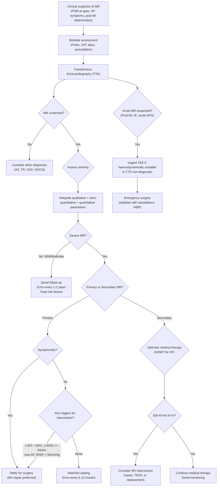

## Diagnostic Criteria, Algorithm, and Investigations for Mitral Regurgitation

### Diagnostic Approach — Framing the Problem

Unlike conditions such as infective endocarditis (which has formal diagnostic criteria like the Modified Duke Criteria), MR does **not** have a single codified set of "diagnostic criteria." Instead, the diagnosis of MR involves three sequential questions:

1. **Is MR present?** (Clinical suspicion → confirmation by echocardiography)
2. **How severe is it?** (Grading by echocardiographic parameters)
3. **What is causing it?** (Aetiology — primary vs. secondary; acute vs. chronic)

The answers to all three questions determine management. Let's work through each systematically.

---

### 1. Clinical Diagnostic Criteria — When Should You Suspect MR?

MR should be suspected clinically whenever you encounter:

- A **pansystolic murmur (PSM) best heard at the apex, radiating to the axilla** [2]
- A **mid-systolic click followed by a late systolic murmur** (suggests MVP as the underlying cause) [4]
- **Unexplained heart failure symptoms** (especially in a patient with known risk factors for MR — prior MI, RHD, connective tissue disease, DCMP)
- **Acute pulmonary oedema** in the context of MI or IE (think acute MR) [2]
- An **incidental finding** on echocardiography performed for another indication

<Callout title="Key Clinical Principle">
The clinical diagnosis of MR is made at the bedside by auscultation, but the **definitive diagnosis, severity grading, and aetiological assessment** all require echocardiography. You cannot grade MR severity by murmur intensity alone — a loud murmur does not always mean severe MR (and in acute MR, the murmur may be soft or decrescendo).
</Callout>

---

### 2. Severity Grading of MR — Echocardiographic Criteria

***MR grading is based on qualitative and quantitative parameters*** [1].

This is the closest thing to formal "diagnostic criteria" for MR — the echocardiographic severity classification. The 2020/2021 ACC/AHA and 2021 ESC guidelines both use a multi-parametric integrative approach, combining qualitative, semi-quantitative, and quantitative Doppler parameters.

#### 2.1 Quantitative Parameters (Most Important)

***Effective regurgitant orifice area (EROA) is the most recommended tool in MR severity assessment*** [1].

| Parameter | Mild | Moderate | Severe |
|---|---|---|---|
| **EROA (mm²)** | < 20 | 20–39 | ***≥ 40*** [1] |
| **Regurgitant volume (mL/beat)** | < 30 | 30–59 | ***≥ 60*** [1] |
| **Regurgitant fraction (%)** | < 30 | 30–49 | ≥ 50 |

**Why is EROA the best parameter?**

EROA measures the cross-sectional area of the regurgitant orifice at its narrowest point (the "vena contracta"). It is **flow-independent** — meaning it reflects the actual anatomical size of the leak rather than being influenced by loading conditions (preload, afterload, heart rate). It is calculated using the **PISA method** (Proximal Isovelocity Surface Area):

- The regurgitant blood accelerates as it approaches the narrow regurgitant orifice, forming concentric hemispheric shells of equal velocity (like water approaching a drain)
- On colour Doppler, the aliasing boundary (where colour changes from blue to red) represents a hemisphere of known velocity
- The flow through this hemisphere equals the flow through the regurgitant orifice: **EROA = 2πr² × aliasing velocity / peak MR velocity**

**Why different thresholds for primary vs. secondary MR?**

The 2021 ESC guidelines use **lower thresholds** for severe secondary MR (EROA ≥ 20 mm², RVol ≥ 30 mL) compared to primary MR (EROA ≥ 40 mm², RVol ≥ 60 mL). This is because in secondary MR:
- The LV is already dilated and dysfunctional — even a "moderate" amount of regurgitation has a disproportionately negative impact on an already failing ventricle
- The regurgitant orifice in secondary MR is often crescent-shaped (along the coaptation line) rather than circular, so the PISA method may underestimate the true EROA

#### 2.2 Semi-Quantitative Parameters

| Parameter | Mild | Moderate | Severe |
|---|---|---|---|
| **Vena contracta width (mm)** | < 3 | 3–6.9 | ≥ 7 |
| **Colour-flow jet area / LA area (%)** | < 20 | 20–39 | ≥ 40 |
| **Pulmonary vein flow** | Systolic dominant | Systolic blunting | **Systolic flow reversal** |

**Why does severe MR cause pulmonary vein systolic flow reversal?**
Normally, blood flows from the pulmonary veins into the LA during both systole and diastole (systolic dominant pattern). In severe MR, the regurgitant jet increases LA pressure so much during systole that it exceeds pulmonary venous pressure — blood is actually pushed *backwards* into the pulmonary veins. This is a highly specific sign of severe MR.

#### 2.3 Qualitative Parameters

| Parameter | Mild | Moderate | Severe |
|---|---|---|---|
| **MR jet appearance** | Small, thin, central | Intermediate | Large, eccentric, wall-hugging, or very wide central jet |
| **Mitral valve morphology** | Normal or mild changes | Moderate thickening/prolapse | Flail leaflet, ruptured papillary muscle, severe prolapse |
| **LV/LA size** | Normal | Normal or mildly dilated | Dilated (unless acute) |

#### 2.4 Supportive Quantitative Echo Parameters

| Parameter | Significance |
|---|---|
| **LVEF** | In primary MR, ***LVEF ≥ 60% is considered "normal"*** [2] — because the LV ejects into both the aorta and the low-impedance LA, artificially inflating EF. ***LVEF cutoff is higher for MR because MR is a volume loading condition → LVEF should be high*** [4]. LVEF < 60% in severe MR indicates significant LV dysfunction. |
| **LV end-systolic diameter (LVESD)** | ***LVESD ≥ 40 mm*** indicates LV dilation beyond compensation and is a trigger for surgery even in asymptomatic patients [2] |
| **LA volume index** | ≥ 60 mL/m² supports chronicity and haemodynamic significance |
| **Pulmonary artery systolic pressure (PASP)** | Estimated from TR jet velocity. PASP > 50 mmHg at rest indicates significant pulmonary hypertension — a trigger for intervention |
| **Tricuspid annular plane systolic excursion (TAPSE)** | Assesses RV function. TAPSE < 17 mm indicates RV dysfunction secondary to pulmonary hypertension |

<Callout title="Exam High Yield — EROA Threshold" type="error">
***EROA > 40 mm² and RVol > 60 mL indicate severe primary MR*** [1]. These are the most tested thresholds. For secondary MR, remember the lower thresholds: EROA ≥ 20 mm² and RVol ≥ 30 mL (ESC 2021). The reason for the difference is that a sick ventricle tolerates even "moderate" regurgitation poorly.
</Callout>

---

### 3. Diagnostic Algorithm

The following algorithm outlines the systematic approach from clinical suspicion to definitive management planning:

**Why TTE first, then TEE?**
- ***Transthoracic echocardiography (TTE)*** is the **first-line** investigation — non-invasive, bedside, widely available, and sufficient to diagnose MR, grade severity, and assess LV function in most cases [2][10]
- ***Transesophageal echocardiography (TEE)*** is reserved for specific situations [10]:
  - ***When TTE is non-diagnostic or image quality is poor*** (obesity, lung hyperinflation, chest wall deformity)
  - ***Prosthetic valve*** — TTE has acoustic shadowing from the prosthesis that obscures the LA and mitral valve [10]
  - ***When viewing posterior structures (mitral valve)*** — the oesophagus sits directly behind the LA, giving TEE a superior view of the mitral valve apparatus [10]
  - ***Pre-operative planning*** — TEE provides detailed assessment of valve anatomy, leaflet involvement (which scallops are affected), and feasibility of repair
  - ***Intraoperative*** — TEE is used during MV repair to assess the result immediately after coming off bypass
  - ***Suspected IE*** — TEE has higher sensitivity for vegetations (~95%) vs. TTE (~65%) [10]

---

### 4. Investigation Modalities — Detailed Findings and Interpretation

#### 4.1 Electrocardiogram (ECG)

The ECG does not diagnose MR but provides important clues about chronicity, haemodynamic severity, and aetiology.

| Finding | Interpretation | Mechanism |
|---|---|---|
| ***Atrial fibrillation (AF)*** [2][3] | Chronic LA dilation → electrical remodelling → AF. Present in ~1/3 of severe chronic MR. New-onset AF is a trigger for surgical intervention. | LA dilation stretches atrial myocytes → altered refractoriness + fibrosis → re-entrant circuits |
| ***P mitrale*** [2][3] | Bifid P wave (duration > 120 ms) in lead II, or prominent negative deflection in V1. Indicates LA enlargement/hypertrophy. | LA takes longer to depolarise when enlarged → prolonged P wave with two peaks (right atrium then left atrium). |
| ***LVH*** [2][3] | Increased QRS voltages meeting Sokolov-Lyon criteria: ***S wave depth in V1 + tallest R in V5-6 > 35 mm*** [2]. Indicates LV volume overload. | Eccentric LV hypertrophy from chronic volume overload → ↑myocardial mass → ↑depolarisation voltage. |
| **LV strain pattern** | ST depression + T-wave inversion in lateral leads (V5, V6, I, aVL) | Subendocardial ischaemia from demand-supply mismatch in hypertrophied myocardium |
| **Normal ECG** | Does NOT exclude MR. Mild-to-moderate MR may have a completely normal ECG. | No significant haemodynamic effect yet |

**MVP-specific ECG findings [4]:**
- ***Normal ± non-specific ST depression in inferior leads*** [4]
- ST-T changes may reflect papillary muscle traction/ischaemia
- Rarely: prolonged QT interval (associated arrhythmia risk)

#### 4.2 Chest X-ray (CXR)

The CXR provides indirect evidence of MR and its haemodynamic consequences:

| Finding | Interpretation | Mechanism |
|---|---|---|
| ***LA enlargement*** [2] | Double density sign behind the heart, splaying of carina (> 90°), posterior displacement of oesophagus on lateral view, straightening of left heart border | Chronic volume overload of LA from regurgitant flow |
| ***LV enlargement*** [2] | Cardiothoracic ratio > 0.5 on PA view, apex displaced below diaphragm and posteriorly on lateral | LV eccentric hypertrophy. **Key differentiator from MS** — in MS, the LV is normal or small (underfilled), while in MR the LV is enlarged. ***"LV enlargement — not in MS"*** [2] |
| ***Pulmonary congestion*** [2] | **ABCDE mnemonic** [8]: **A**lveolar oedema (bat-wing opacities), Kerley **B** lines, **C**ardiomegaly, **D**ilated upper lobe vessels (cephalisation), pleural **E**ffusion | ↑LA pressure → ↑pulmonary venous pressure → transudation into interstitium and alveoli |
| **Mitral valve calcification** | Seen on lateral CXR as calcification in the region of the mitral annulus | Suggests rheumatic or degenerative aetiology |
| **Normal CXR** | Does NOT exclude MR. Chronic compensated MR may have a normal CXR. | Compliant, dilated LA buffers pressure without significant pulmonary congestion |

**Acute MR on CXR:** Fulminant pulmonary oedema with a **normal-sized heart** — this is a critical clue. The LA and LV have not had time to dilate, so the cardiac silhouette is normal despite severe pulmonary congestion. If you see acute pulmonary oedema with a normal heart size, think acute MR (or other acute valvular catastrophe/flash pulmonary oedema from renal artery stenosis/hypertensive emergency).

#### 4.3 Echocardiography — The Definitive Investigation

Echocardiography is the **single most important investigation** in MR. It simultaneously:
- Confirms the diagnosis
- Grades severity
- Determines the mechanism and aetiology
- Assesses LV and RV function
- Guides surgical planning

##### 4.3.1 Transthoracic Echocardiography (TTE) [2][10]

**Standard Views for MR Assessment:**

| View | What It Shows |
|---|---|
| **Parasternal long axis (PLAX)** | LV and LA size, anterior and posterior mitral leaflets (A2/P2), MR jet direction, LVOT |
| **Parasternal short axis (PSAX)** at mitral valve level | "Fish-mouth" view of the MV orifice, identifies which scallop is prolapsing/flailing |
| **Apical 4-chamber (A4C)** | All four chambers, MR jet extent into LA, measurement of EROA by PISA, PASP from TR jet |
| **Apical 2-chamber (A2C)** | LA, LV, anterior and inferior walls — complements A4C for biplane assessment |

**Key Echo Findings and Their Interpretation:**

| Finding | Significance |
|---|---|
| ***LV dilatation and function*** [2] | ***Assess LV dilatation and function*** — LVEDD, LVESD, LVEF. Remember: LVEF < 60% in MR = LV dysfunction. |
| ***Severity of regurgitation*** [2] | Colour Doppler jet area, vena contracta, PISA/EROA, RVol, regurgitant fraction, pulmonary vein flow pattern |
| ***Underlying valvular defects*** [2] | Leaflet thickening (RHD), prolapse/flail (MVP/chordal rupture), vegetations (IE), restricted motion (ischaemic), SAM (HOCM), annular dilation |
| **LA size** | LA volume index ≥ 60 mL/m² supports chronic significant MR |
| **PASP** | Estimated from TR jet using modified Bernoulli equation: PASP = 4 × (TR jet velocity)² + RA pressure. PASP > 50 mmHg = significant pulmonary HTN |

##### 4.3.2 Transesophageal Echocardiography (TEE) [10]

TEE provides **superior resolution** of the mitral valve apparatus because the oesophageal transducer is positioned directly behind the LA with no intervening lung or bone.

**Indications for TEE in MR:**
- ***Prosthetic valve assessment*** — avoids acoustic shadowing [10]
- ***When viewing posterior structures (mitral valve)*** [10]
- TTE non-diagnostic or discordant with clinical findings
- Pre-operative surgical planning (which scallops are involved, feasibility of repair)
- Suspected IE with negative TTE
- Intraoperative guidance during MV repair
- Assessment for transcatheter edge-to-edge repair (TEER / MitraClip) candidacy

##### 4.3.3 MVP-Specific Echo Findings [4]

- ***Posterior systolic displacement of MV into LA (diagnostic)*** [4] — one or both leaflets prolapse ≥ 2 mm above the annular plane during systole, best seen in PLAX view
- Leaflet redundancy, thickening (> 5 mm suggests myxomatous degeneration)
- ± flail segment if chordal rupture has occurred

<Callout title="TTE vs. TEE — When to Use Which" type="idea">
**TTE first** — always. It's non-invasive, available, and sufficient for most patients. **TEE** is reserved for: (1) prosthetic valves, (2) poor TTE windows, (3) suspected IE with negative TTE, (4) pre-operative planning, (5) intraoperative assessment. ***TEE is particularly useful for the mitral valve because the oesophagus is immediately posterior to the LA*** [10].
</Callout>

#### 4.4 Cardiac Catheterisation [2][4]

***Cardiac catheterisation is not routinely done*** for MR diagnosis [2]. Its role has been largely supplanted by echocardiography. However, it still has specific indications:

| Indication | Purpose |
|---|---|
| ***Assessment of concomitant CAD in preparation for MV surgery*** [2] | Coronary angiography is performed pre-operatively to determine if CABG should be done at the same time as valve surgery. This is the **primary indication** for cardiac catheterisation in MR. |
| ***Assess severity of concomitant CAD and MR when surgical intervention is considered*** [4] | Left ventriculography can quantify regurgitation grade (Sellers classification I–IV), but this is rarely the primary method of severity assessment now. |
| **Discordance between clinical and echo findings** | Right heart catheterisation can directly measure LA pressure (or PCWP as a surrogate), ***systolic v wave in LA or pulmonary artery wedge pressure*** [2], confirming haemodynamic significance. A tall **v wave** on the PCWP tracing is characteristic of severe MR — it represents the regurgitant volume elevating LA pressure during systole. |
| **Haemodynamic assessment in borderline cases** | Exercise haemodynamics (measuring PCWP and CO during exercise) can unmask symptoms in patients with "moderate" MR who are more symptomatic than expected |

**Why does a tall v wave appear on the PCWP trace?**
The pulmonary capillary wedge pressure (PCWP) approximates LA pressure. Normally, the LA pressure trace shows a gentle **a wave** (atrial contraction) and a gentle **v wave** (venous filling during ventricular systole). In MR, the regurgitant jet adds a large volume to the LA during systole → a very prominent **v wave** — sometimes called a "giant v wave." This is a classic catheterisation finding of severe MR.

#### 4.5 Blood Investigations

| Test | Purpose | Expected Findings |
|---|---|---|
| ***BNP / NT-proBNP*** [8] | Screening for HF; prognostic value; helps distinguish cardiac from pulmonary causes of dyspnoea | Elevated in significant MR with LV volume overload. ***BNP < 100 rules out HF; > 400 suggests CHF*** [8]. NT-proBNP more specific. |
| **CBC** | Anaemia assessment (can worsen MR symptoms by ↑CO → ↑regurgitant volume); haemolysis screen | NcNc anaemia of chronic disease; schistocytes if mechanical valve haemolysis; leucocytosis in IE |
| **RFT** | Cardiorenal syndrome assessment; pre-operative baseline | ↑Creatinine in low-output states; hyponatraemia in severe HF [8] |
| **LFT** | Hepatic congestion assessment (if RV failure) | ↑transaminases, ↑bilirubin if congestive hepatopathy |
| ***Serial troponin (TnT/TnI)*** [8] | Rule out MI as cause (ischaemic MR); myocardial injury assessment | Elevated in acute MI causing papillary muscle dysfunction/rupture |
| **ESR / CRP** | If IE suspected | Elevated in IE, but non-specific |
| **Blood cultures** | If IE suspected — ***at least 3 sets at different sites to demonstrate persistent bacteraemia*** [3] | Positive with typical organisms (S. aureus, Strep viridans, Enterococci, HACEK) |
| **TFT** | Thyrotoxicosis can cause high-output HF and AF → worsening MR | Hyperthyroid state may precipitate decompensation |
| **Rheumatic markers (ASO, anti-DNase B)** | If acute rheumatic fever suspected as aetiology in young patients | May be elevated in recent streptococcal infection |

#### 4.6 Other Investigations

| Investigation | Indication | Key Findings |
|---|---|---|
| **Exercise stress echocardiography** | Asymptomatic severe MR — to unmask symptoms, exercise-induced pulmonary HTN, or ↓LVEF with exercise | PASP > 60 mmHg on exercise, new regional wall motion abnormalities, symptoms with exercise = triggers for intervention |
| **Cardiac MRI (CMR)** | When echo is non-diagnostic or discordant; gold standard for LV volumes and LVEF; tissue characterisation | Accurate LVEDV, LVESV, LVEF calculation; quantification of regurgitant volume by comparing LV and RV stroke volumes; late gadolinium enhancement (fibrosis/scar in ischaemic MR, myocarditis) |
| **CT coronary angiography** | Pre-operative assessment of coronary anatomy if catheterisation is contraindicated or in low-risk patients | Rules out significant CAD before valve surgery; also provides annular and valve calcification assessment |
| **Holter monitoring** | Palpitations, suspected arrhythmia | AF paroxysms, ventricular arrhythmias (especially in MVP) |

<Callout title="Cardiac MRI — The Emerging Gold Standard" type="idea">
CMR is increasingly recognised as the reference standard for LV volume and EF quantification — more accurate than echo because it is not dependent on geometric assumptions. When echo results are equivocal (especially borderline LVEF values around the critical 60% threshold), CMR can provide definitive measurements. It also allows **regurgitant volume quantification** by comparing RV and LV stroke volumes (the difference = regurgitant volume, assuming no other valvular lesions).
</Callout>

---

### 5. Integrated Summary: What Each Investigation Tells You

| Question | Primary Investigation | What You're Looking For |
|---|---|---|
| **Is MR present?** | TTE with colour Doppler | Regurgitant jet from LV → LA during systole |
| **How severe is it?** | TTE: EROA, RVol, vena contracta, pulmonary vein flow | ***EROA > 40 mm², RVol > 60 mL = severe primary MR*** [1] |
| **What's causing it?** | TTE/TEE: valve morphology, leaflet motion, LV geometry | Prolapse/flail (MVP), thickened/restricted leaflets (RHD), vegetations (IE), tethered leaflets with annular dilation (ischaemic) |
| **How is the LV coping?** | TTE: LVEF, LVESD; CMR if equivocal | LVEF < 60% or LVESD ≥ 40 mm = LV decompensation — surgery indicated even if asymptomatic |
| **Is there pulmonary HTN?** | TTE: TR jet velocity → PASP | PASP > 50 mmHg at rest = significant pulmonary HTN |
| **Is there concomitant CAD?** | Coronary angiography (catheterisation or CTA) | Stenosis ≥ 70% in any major vessel → concomitant CABG at time of MV surgery |
| **Are there complications?** | ECG (AF, conduction defects), BNP, RFT, LFT | AF, HF biomarkers, cardiorenal syndrome, hepatic congestion |

---

### 6. General Indications for Valvular Replacement/Repair — A Framework [3]

The senior notes provide a useful general framework for surgical indications across all valve lesions:

***General indications for valvular replacement:*** [3]
- ***Symptomatic (HF) despite optimal medical therapy***
- ***Asymptomatic, but severe disease defined by:***
  - ***Severe stenosis/regurgitation by ECHO criteria***
  - ***LV dilatation: LV end-systolic diameter***
  - ***LV systolic dysfunction: impaired LVEF < 50%*** (note: for MR specifically, the threshold is LVEF < 60%)
  - ***Complications, e.g. new-onset AF, pulmonary HTN***
- ***Infective endocarditis despite optimal medical therapy***

---

<Callout title="High Yield Summary — Diagnosis of MR">

**Diagnostic confirmation**: TTE with colour Doppler is the first-line investigation.

**Severity grading** — ***EROA is the most recommended tool*** [1]:
- Severe primary MR: ***EROA ≥ 40 mm², RVol ≥ 60 mL*** [1]
- Severe secondary MR: EROA ≥ 20 mm², RVol ≥ 30 mL (ESC 2021)
- Supporting signs of severity: vena contracta ≥ 7 mm, pulmonary vein systolic flow reversal, flail leaflet/ruptured papillary muscle

**Investigations**: ***ECG (AF, P mitrale, LVH)*** [2][3]; ***CXR (LA + LV enlargement, pulmonary congestion — LV enlargement distinguishes MR from MS on CXR)*** [2]; ***Echo (LV dilatation/function, severity of regurgitation, underlying valvular defects)*** [2]; ***cardiac catheterisation not routine — mainly for coronary assessment pre-surgery*** [2]

**Key LV function thresholds in MR**: ***LVEF < 60%*** and ***LVESD ≥ 40 mm*** = LV decompensation → indication for surgery even if asymptomatic

**TEE indications**: prosthetic valve, poor TTE window, IE suspected, pre-op planning, intra-operative

</Callout>

---

<ActiveRecallQuiz
  title="Active Recall - Diagnosis of Mitral Regurgitation"
  items={[
    {
      question: "What are the echocardiographic thresholds for severe primary MR using the most recommended quantitative parameter?",
      markscheme: "EROA >= 40 mm2 and regurgitant volume >= 60 mL (per lecture slides and 2020 ACC/AHA guidelines). EROA is the most recommended tool for MR severity assessment. Vena contracta >= 7 mm is a supporting semi-quantitative parameter."
    },
    {
      question: "Why is LVEF < 60% considered abnormal in MR when 55% would be 'normal' in most other conditions?",
      markscheme: "In MR, the LV ejects into both the aorta (high impedance) and the LA (low impedance). This low-impedance pathway artificially inflates LVEF. Therefore LVEF should be supranormal (>= 60%) in MR. An LVEF < 60% indicates the intrinsic contractility has already declined significantly — this is an indication for surgery even in asymptomatic patients."
    },
    {
      question: "Name 3 specific indications for TEE rather than TTE in the assessment of MR.",
      markscheme: "Any 3 of: (1) Prosthetic valve (acoustic shadowing on TTE); (2) TTE non-diagnostic or poor image quality; (3) Suspected IE with negative TTE (TEE has higher sensitivity ~95%); (4) Pre-operative surgical planning (scallop-by-scallop assessment of leaflets); (5) Intraoperative assessment during MV repair; (6) Assessment for transcatheter repair candidacy."
    },
    {
      question: "A CXR shows acute pulmonary oedema with a normal-sized heart. What diagnosis should you consider and why?",
      markscheme: "Acute MR (e.g., from chordal rupture, papillary muscle rupture post-MI, or IE). In acute MR, the LA and LV have not had time to dilate so the cardiac silhouette remains normal despite severe pulmonary congestion from the acute rise in LA pressure transmitted to the pulmonary veins. Other DDx: flash pulmonary oedema from hypertensive crisis or renal artery stenosis."
    },
    {
      question: "What is a 'giant v wave' on PCWP tracing and what does it indicate?",
      markscheme: "A giant v wave is a tall, prominent v wave on the pulmonary capillary wedge pressure (PCWP) tracing, which represents LA pressure. It is caused by the regurgitant volume from severe MR being ejected into the LA during systole, acutely raising LA pressure. It is a classic cardiac catheterisation finding of haemodynamically significant MR."
    },
    {
      question: "How does CXR differentiate MR from MS?",
      markscheme: "Both MR and MS show LA enlargement and pulmonary congestion. The key differentiator is LV size: in MR, the LV is enlarged (volume overload from regurgitant flow returning in diastole), whereas in MS, the LV is normal or small (underfilled because the stenosed valve restricts LV inflow)."
    }
  ]}
/>

## References

[1] Lecture slides: Cardiac Surgery Tutorial_Prof. D Chan.pdf (p38, p39, p43, p46)
[2] Senior notes: Ryan Ho Cardiology.pdf (p155, p156, p157)
[3] Senior notes: Maksim Medicine Notes.pdf (p35, p37)
[4] Senior notes: Ryan Ho Cardiology.pdf (p157 — MVP section)
[8] Senior notes: Maksim Medicine Notes.pdf (p18 — HF investigations, BNP)
[10] Senior notes: Maksim Medicine Notes.pdf (p6 — echocardiography, TTE vs TEE)
