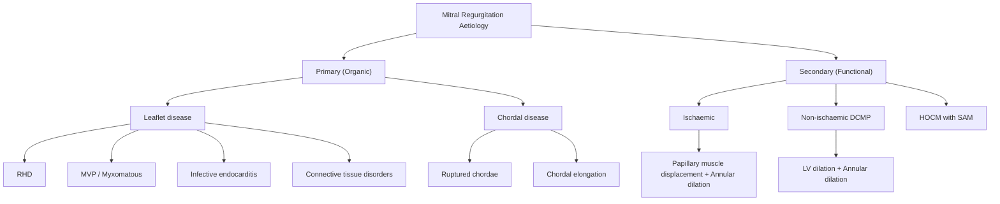
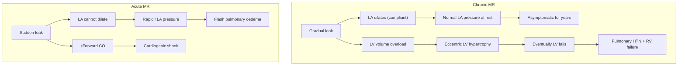
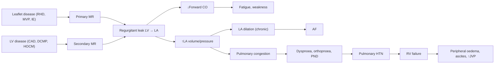

# Mitral Regurgitation (MR)

## 1. Definition

Mitral regurgitation (MR) is the **backward leakage of blood from the left ventricle (LV) into the left atrium (LA) during systole** due to incompetent closure of the mitral valve [1][2].

Breaking down the term:
- "Mitral" = refers to the mitral valve (named because it resembles a bishop's mitre/hat)
- "Regurgitation" = from Latin *re-* (back) + *gurgitare* (to flood) — literally "flooding back"

So the name tells you exactly what the problem is: blood floods backwards through the mitral valve.

> ***"Leaking of blood back to LA"*** [1]

This is fundamentally a **volume overload** problem for the left heart — every beat, the LV ejects blood both forwards into the aorta AND backwards into the LA. The consequences depend entirely on whether this develops acutely or chronically.

---

## 2. Epidemiology

- ***MR is very common: 1 in 10 people > 75 years old has severe MR*** [1][2]
- It is the **most common valvular heart disease** encountered in clinical practice in developed countries
- In **Hong Kong**, the epidemiological profile is shifting:
  - **Rheumatic heart disease (RHD)** was historically the most common cause, and remains important in Hong Kong's older population and among immigrants from mainland China and Southeast Asia, though incidence is declining with improved living standards and antibiotic availability [2]
  - **Degenerative causes** (myxomatous degeneration, mitral valve prolapse, annular calcification) are now the **leading aetiology** in Hong Kong, mirroring Western trends, particularly as the population ages
  - **Ischaemic (functional) MR** is increasingly prevalent due to the high burden of coronary artery disease and hypertension in Hong Kong
- **Gender**: Degenerative MR (MVP) has a slight female predominance; ischaemic MR is more common in males (reflecting CAD demographics)
- **Age**: Degenerative MR increases with age; RHD-related MR typically presents in younger/middle-aged adults

<Callout title="High Yield — Epidemiology">
MR is the most common significant valvular lesion in elderly populations. In Hong Kong, expect a mixed aetiology: degenerative disease dominates, but RHD is still tested and still relevant in the local context.
</Callout>

---

## 3. Anatomy and Function of the Mitral Valve Apparatus

Understanding MR requires understanding the mitral valve as a **complex apparatus**, not just two flaps of tissue. ***All valve disease*** relates to failure of one or more components of this apparatus [1].

### 3.1 Components of the Mitral Valve Apparatus

The mitral valve apparatus has **five interdependent components**:

| Component | Structure | Function |
|---|---|---|
| **Mitral annulus** | Fibrous ring at the atrioventricular junction | Provides structural framework; contracts during systole to reduce orifice area and aid coaptation |
| **Anterior leaflet (A1, A2, A3)** | Larger, semicircular; attached to ~1/3 of annular circumference | Covers ~2/3 of the valve orifice; continuous with the aortic valve (aortomitral curtain) |
| **Posterior leaflet (P1, P2, P3)** | Smaller, crescent-shaped; attached to ~2/3 of annular circumference | Covers ~1/3 of the orifice; has 3 scallops (P2 is the largest and most commonly prolapsing segment) |
| **Chordae tendineae** | Fibrous cords from papillary muscles to leaflet edges and bodies | Tether the leaflets during systole to prevent prolapse into the LA |
| **Papillary muscles** | Two muscles arising from the LV free wall: anterolateral and posteromedial | Contract during systole to maintain chordal tension; the posteromedial papillary muscle has a **single blood supply** (from the PDA, usually RCA) making it more vulnerable to ischaemia |

Additionally, the **LV myocardium** itself is considered a "sixth component" — LV geometry and contraction directly influence annular size and papillary muscle positioning.

### 3.2 Normal Valve Function

During **systole**, LV pressure rises above LA pressure. The mitral leaflets are pushed upward toward the closed position by the pressure gradient, while the **papillary muscles contract simultaneously** to pull the chordae taut and prevent the leaflets from prolapsing (everting) into the LA. The net result is **tight coaptation** (apposition) of the anterior and posterior leaflets along a "coaptation zone" — this seal prevents regurgitation.

During **diastole**, the mitral valve opens to allow LA blood to fill the LV. The normal mitral valve area is **4–6 cm²**.

<Callout title="Key Concept — Why the Papillary Muscles Matter" type="idea">
The papillary muscles do NOT pull the valve shut. They prevent the valve from being blown open (prolapsing) by the high systolic LV pressure. Think of them as anchors — if an anchor breaks or moves, the sail (leaflet) flips the wrong way.
</Callout>

### 3.3 The Posteromedial Papillary Muscle — An Anatomical Vulnerability

The **posteromedial papillary muscle** receives its blood supply from a **single artery** (usually the posterior descending artery from the RCA), whereas the **anterolateral papillary muscle** has dual supply (from both the LAD and LCx). This makes the posteromedial muscle highly susceptible to ischaemia/infarction — especially in **inferior MI** — and is the reason why **ischaemic MR** disproportionately involves this muscle [2].

---

## 4. Aetiology

MR can be classified aetiologically as **primary (organic)** vs. **secondary (functional)** — this distinction is critical because it determines management [1][2].

### 4.1 Primary MR (Organic MR)

The valve leaflets or chordae themselves are structurally abnormal. The valve is the problem.

| Cause | Mechanism | Notes |
|---|---|---|
| ***Rheumatic heart disease*** | Post-streptococcal autoimmune valvulitis → fibrosis, retraction, and thickening of leaflets and chordae → poor coaptation | ***Commonest cause overall (especially in Hong Kong/Asia); 50% associated with MS*** [2][3]. Typically affects young-to-middle-aged adults. |
| ***Mitral valve prolapse (MVP) / Myxomatous degeneration*** | Replacement of normal dense collagen/elastin matrix of valvular fibrosa by loose myxomatous connective tissue → leaflet enlargement, redundancy, prolapse beyond annular plane | Most common cause in Western countries; affects 2–3% of population. More common in females. Can be familial (AD with variable penetrance) or associated with connective tissue disorders (***Marfan syndrome, Ehlers-Danlos syndrome***) [2][4] |
| ***Infective endocarditis (IE)*** | Vegetations destroy leaflet tissue; can cause leaflet perforation or chordal rupture | Can cause acute severe MR. Valve involvement: ***MV >> AV > TV > PV*** [3] |
| Connective tissue disorders | ***Marfan syndrome, Ehlers-Danlos syndrome, osteogenesis imperfecta*** → weakened valve/chordal tissue → prolapse or chordal rupture | Think of these in young patients with MR + body habitus findings |
| ***Ruptured chordae tendineae*** | ***Degenerative, collagen disease, infective (IE), acute rheumatic heart disease*** → sudden loss of leaflet support → flail leaflet → acute severe MR | Causes acute MR — a surgical emergency [2] |
| SLE (Libman-Sacks endocarditis) | Non-infective verrucous vegetations on valve leaflets (both atrial and ventricular surfaces) | Chronic, usually mild MR |
| Radiation valvulopathy | Fibrosis of valve leaflets and annulus post-radiotherapy | Seen in Hodgkin lymphoma survivors |
| Congenital | Cleft mitral valve (especially in AV canal defects), parachute mitral valve | Rare; present in infancy/childhood |

### 4.2 Secondary MR (Functional MR)

The valve leaflets are **structurally normal**, but the valve doesn't close properly because the **supporting apparatus has been distorted** by LV or LA disease. The ventricle (or atrium) is the problem.

***This is described as a "casing problem" of the mitral valve*** [1].

| Cause | Mechanism | Notes |
|---|---|---|
| ***Ischaemic heart disease / MI*** | ***Papillary muscle displacement*** (due to LV remodelling after MI) → ***restricted leaflet closure*** + ***annular dilation*** → ***functional MR*** [1][2] | Especially **inferior MI** (posteromedial papillary muscle). This is NOT the same as papillary muscle rupture (which causes acute MR). |
| ***Dilated cardiomyopathy (DCMP) / LV dilation from any cause*** | ***Annular dilation*** + displacement of papillary muscles laterally → leaflets tethered and cannot coapt | ***CAD, DCMP*** [2] |
| ***HOCM with SAM*** | Asymmetric septal hypertrophy → anterior displacement of papillary muscles → ***systolic anterior motion (SAM) of the mitral valve anterior leaflet*** toward the septum → MR + LVOT obstruction | The MR jet is directed posteriorly. ***Severity directly proportional to LV outflow obstruction*** [4] |
| Atrial functional MR | Chronic AF → severe LA dilation → annular dilation (even without LV disease) → MR | Increasingly recognized entity |

<Callout title="Lecture Slide Key Point" type="error">
The lecture slide specifically contrasts a **normal mitral valve** with ***functional mitral regurgitation***, showing ***papillary muscle displacement, restricted leaflet closure, chordal tethering, and annular dilation*** — all secondary to LV remodelling [1]. Students frequently confuse functional MR with structural valve disease. In functional MR, the valve is normal — it's the ventricle that's sick.
</Callout>

---

## 5. Pathophysiology

This is where MR gets interesting — and where exam questions love to test. The haemodynamic consequences differ dramatically between **acute** and **chronic** MR.

### 5.1 Core Haemodynamic Problem

In MR, during systole, the LV ejects blood through **two exits**:
1. **Forward** through the aortic valve into the aorta (effective stroke volume)
2. **Backward** through the incompetent mitral valve into the LA (regurgitant volume)

The **regurgitant fraction** = regurgitant volume / total stroke volume.

This means:
- **Forward cardiac output is reduced** (→ fatigue, weakness)
- **LA receives an abnormal volume load** (→ raised LA pressure → pulmonary congestion)
- **LV receives increased volume in diastole** (regurgitant blood returns from LA → volume overload)

### 5.2 Chronic MR [2]

Chronic MR develops gradually — the heart has time to compensate.

**Phase 1 — Compensation (may last ≥ 10 years):**
- ***Gradual LA dilation with ↑pressure only during systole*** → the large, compliant LA acts as a "buffer," absorbing regurgitant volume without much rise in mean LA pressure
- ***Usually little or no symptoms early on for ≥ 10 years*** (cf. MS, which is symptomatic much earlier)
- The LV also dilates (eccentric hypertrophy) to accommodate the increased total stroke volume
- ***↑LA compliance results in exaggerated regurgitant fraction*** — paradoxically, as the LA becomes more compliant, it "invites" more regurgitant flow (because the impedance to backward flow decreases)
- ***Early symptoms dominated by low forward cardiac output: fatigue, weakness*** [2]
- ***Pulmonary hypertension only occurs late when the LV fails due to volume overload*** [2]

**Phase 2 — Decompensation:**
- ***Once severe, MR is NOT benign*** [2]
- ***Patients develop symptoms at 10%/year, AF in 1/3*** [2]
- ***90% of asymptomatic patients with normal LVEF will need surgery at 10 years*** [2]
- The LV gradually fails from chronic volume overload → LV systolic dysfunction (↓LVEF)
- Rising LA pressure → pulmonary venous hypertension → pulmonary arterial hypertension → RV failure

**Key concept — LVEF is deceptively normal in MR:**
In MR, the LV ejects into two low-pressure chambers (aorta AND LA). The LA is a very low-impedance circuit. This means the LV can maintain a "normal" LVEF even when intrinsic myocardial contractility has already declined significantly. By the time LVEF drops below 60% in MR, the ventricle is already significantly impaired. This is why the **surgical threshold for LVEF in MR is ≥ 60%** (not 50% as in other conditions) — once it drops below 60%, irreversible LV damage may have occurred [2].

<Callout title="Critical Exam Concept" type="error">
***LVEF ≥ 60%*** is considered "normal" in the context of MR. If LVEF drops to 55% in a patient with severe MR, that's NOT reassuring — it indicates significant LV dysfunction and is an indication for surgery. Don't be fooled by a "normal" EF of 55% in MR!
</Callout>

### 5.3 Acute MR [2]

Acute MR is a completely different beast — and a medical/surgical emergency.

Causes: chordal rupture, papillary muscle rupture (post-MI), leaflet perforation (IE), acute rheumatic fever, prosthetic valve dehiscence.

- ***Rapid ↑LA pressure (no time to dilate)*** — the LA is small and non-compliant
- ***Acute severe pulmonary hypertension with acute pulmonary oedema and intense distress*** [2]
- The sudden volume overload is transmitted directly backward to the pulmonary veins → flash pulmonary oedema
- Forward cardiac output drops precipitously → cardiogenic shock
- The murmur in acute MR may be **shorter and softer** than in chronic MR (because the LV-LA pressure gradient equilibrates rapidly in late systole — the murmur may have a ***decrescendo quality*** [2])
- This is a **surgical emergency** — medical therapy is a temporizing bridge

### 5.4 Pathophysiology of Secondary (Functional/Ischaemic) MR [1]

The lecture slides specifically illustrate this mechanism:

***In ischaemic heart disease, the "casing problem" of the mitral valve involves:*** [1]
1. ***Papillary muscle displacement*** — LV remodelling (post-MI dilation/scar) displaces the papillary muscles posterolaterally
2. ***Restricted leaflet closure*** — the displaced papillary muscles pull the chordae taut, tethering the leaflets and preventing them from coapting at the annular plane
3. ***Annular dilation*** — LV dilation stretches the mitral annulus, further widening the gap between leaflets

The result is a valve that is structurally normal but functionally incompetent — the leaflets simply cannot reach each other.

---

## 6. Classification

MR can be classified by several schemas:

### 6.1 By Aetiology: Primary vs. Secondary (as above)

### 6.2 By Acuity: Acute vs. Chronic (as above)

### 6.3 Carpentier Classification (Functional Classification) — Most Important Surgically

This classification describes **leaflet motion** relative to the annular plane and is the standard framework used by cardiac surgeons:

| Type | Leaflet Motion | Mechanism | Example |
|---|---|---|---|
| **Type I** | **Normal leaflet motion** | Annular dilation or leaflet perforation | Functional MR from DCMP (annular dilation); IE with leaflet perforation |
| **Type II** | **Excessive leaflet motion (prolapse/flail)** | Chordal elongation or rupture → leaflet prolapses above annular plane | MVP, chordal rupture (degenerative, IE) |
| **Type IIIa** | **Restricted leaflet motion in diastole (and systole)** | Leaflet/chordal thickening and retraction | Rheumatic heart disease |
| **Type IIIb** | **Restricted leaflet motion in systole only** | Papillary muscle displacement, chordal tethering | ***Ischaemic/functional MR*** [1] — the leaflets open normally in diastole but are tethered and cannot close in systole |

<Callout title="Carpentier Classification — Exam Favourite" type="idea">
Type IIIb is the classic ***"casing problem"*** shown in the lecture slides [1]. The leaflets are normal, but the remodelled LV pulls them apart during systole. This is distinguished from Type IIIa (rheumatic), where the leaflets themselves are stiff and restricted in BOTH systole and diastole.
</Callout>

### 6.4 Severity Classification (Echocardiographic)

| Parameter | Mild | Moderate | Severe |
|---|---|---|---|
| **Regurgitant volume (mL/beat)** | < 30 | 30–59 | ≥ 60 |
| **Regurgitant fraction (%)** | < 30 | 30–49 | ≥ 50 |
| **Effective regurgitant orifice area (EROA, cm²)** | < 0.20 | 0.20–0.39 | ≥ 0.40 |
| **Vena contracta (cm)** | < 0.3 | 0.3–0.69 | ≥ 0.7 |
| **Colour-flow Doppler jet area** | Small, central | Intermediate | Large, reaching posterior LA wall |

---

## 7. Clinical Features

### 7.1 Symptoms

#### 7.1.1 Chronic MR

The key teaching point: ***chronic MR is asymptomatic for years (≥ 10 years)*** [2]. When symptoms do appear, they progress through a predictable sequence based on the underlying haemodynamics:

| Symptom | Pathophysiological Basis |
|---|---|
| ***Fatigue and weakness*** (early) | ***Low forward cardiac output*** [2] — regurgitant blood goes backward into LA rather than forward to tissues. Total LV stroke volume is maintained but effective (forward) stroke volume is reduced. |
| ***Exertional dyspnoea*** (later) | ***Occurs late when LV failure ensues*** [2]. Rising LA pressure (from LV decompensation and/or progressive MR) → transmitted backward to pulmonary veins → pulmonary venous congestion → interstitial/alveolar oedema → ↑work of breathing. Exercise worsens this because ↑HR shortens diastole (reducing forward flow) while ↑contractility may worsen MR. |
| **Orthopnoea and PND** (late) | Supine position → redistribution of blood from lower extremities to central circulation → ↑preload → ↑LA pressure → pulmonary oedema. PND occurs because fluid reabsorption from interstitium occurs during sleep. |
| **Palpitations** | AF (from LA dilation) or ventricular ectopics (from LV remodelling). ***AF occurs in 1/3 of patients with chronic severe MR*** [2]. |
| **Peripheral oedema** (very late) | Right heart failure from chronic pulmonary hypertension — hydrostatic back-pressure in systemic veins → transudation into tissues. |
| **Haemoptysis** (rare) | Rupture of bronchial veins secondary to pulmonary venous hypertension. |

#### 7.1.2 Acute MR

| Symptom | Pathophysiological Basis |
|---|---|
| ***Acute pulmonary oedema — VERY hard to tolerate*** [2] | ***Rapid ↑LA pressure (no time to dilate)*** → immediate transmission to pulmonary veins → flash pulmonary oedema. The non-compliant LA cannot buffer the regurgitant volume. |
| **Acute severe dyspnoea at rest** | Same mechanism — alveolar flooding impairs gas exchange |
| **Cardiogenic shock** (hypotension, tachycardia, oliguria, cold peripheries) | Massive drop in effective forward cardiac output — regurgitant fraction may exceed 50–70% |

<Callout title="Acute vs. Chronic MR — A Clinical Trap" type="error">
Acute MR presents with flash pulmonary oedema and shock, often with a **soft or inaudible murmur** (because the LV-LA pressure gradient equilibrates quickly). Students who expect a loud murmur may miss the diagnosis. If a patient post-MI suddenly deteriorates with acute pulmonary oedema — think acute MR from papillary muscle dysfunction or rupture, even if you can't hear a loud murmur.
</Callout>

### 7.2 Signs

| Sign | Pathophysiological Basis |
|---|---|
| **General inspection** | |
| ***Ankle oedema*** | ***If RVF*** [2] — pulmonary hypertension → RV pressure overload → RV failure → systemic venous congestion → peripheral oedema |
| Malar flush | Characteristic of mitral valve disease (especially MS, but can occur in MR with pulmonary HTN) — ↓CO → reflex peripheral vasoconstriction with cutaneous venule dilation in cheeks |
| **Pulse** | |
| ***Often regular ± small volume*** [2] | Small volume reflects ↓effective forward stroke volume. Regular because AF is typically only seen ***if associated with MS or severe MR*** [2]. |
| ***AF*** (if present) | LA dilation → electrical remodelling + fibrosis → triggers and substrates for AF |
| **Blood pressure** | |
| Normal or slightly low systolic BP | ↓forward stroke volume |
| **JVP** | |
| Elevated JVP | If right heart failure has developed (late); prominent **cv waves** if secondary TR develops |
| **Precordial palpation** | |
| ***Displaced thrusting apex*** | ***LV dilation (eccentric hypertrophy from volume overload)*** [2] — the apex is displaced inferolaterally. "Thrusting" = hyperdynamic quality because the LV contracts vigorously to compensate for the regurgitant leak. Contrast with the "heaving" apex of AS/HTN (pressure overload, concentric hypertrophy). |
| ***± Systolic thrill*** | Turbulent flow through the regurgitant orifice palpable at the apex [2] — indicates significant MR |
| ***± Parasternal heave*** | ***If severe pulmonary hypertension*** [2] — RV hypertrophy from chronic ↑pulmonary pressures |
| **Auscultation** | |
| ***Soft S1*** | The incompetent mitral valve cannot close properly → ↓intensity of mitral component of S1. In normal physiology, S1 is generated by the abrupt tensing of closed mitral and tricuspid valves. If the mitral valve is leaky, it doesn't snap shut with the same tension. [2] |
| ***S2 heard but often obscured by murmur*** | The pansystolic murmur extends through S2, making it difficult to hear [2] |
| ***S3 usual*** | An S3 indicates rapid ventricular filling in early diastole. In MR, the LA is volume-loaded; when the mitral valve opens in diastole, the large volume of blood (accumulated regurgitant volume + normal pulmonary venous return) rushes into the LV, causing sudden deceleration of blood and vibration of the ventricular wall → S3. This is an important sign of haemodynamically significant MR. [2] |
| ***S4 if acute MR*** | An S4 indicates a stiff, non-compliant LV. In acute MR, the LV has not had time to dilate/remodel → it is relatively stiff → atrial contraction into a stiff LV generates S4. (In chronic MR, the LV is dilated and compliant, so S4 is absent.) [2] |
| ***Pansystolic murmur (PSM) best heard at apex radiating to axilla*** | This is the **hallmark sign**. MR produces a regurgitant jet throughout systole (from the moment LV pressure exceeds LA pressure — which is almost immediately after S1 — until the end of systole). The murmur radiates to the axilla because the regurgitant jet is typically directed posterolaterally (especially with anterior leaflet pathology). [2] |
| ***In ischaemic papillary muscle dysfunction, the regurgitant jet may be directed to the anterior LA → best heard at LSB/aortic areas (mimics ESM of AS)*** [2] | In posterior leaflet restriction (ischaemic MR), the jet is directed anteriorly toward the aortic root and interatrial septum. This anterior jet direction means the murmur is heard at unusual locations — the LSB or even the aortic area — potentially leading to misdiagnosis as aortic stenosis. |
| ***May have decrescendo quality in acute MR*** | ***Due to rapid equilibration of pressure*** [2] — in acute MR, the small non-compliant LA pressure rises rapidly during systole to approach LV pressure. As the pressure gradient narrows, flow velocity drops and the murmur fades → decrescendo rather than the classic pansystolic pattern. |
| **Loud P2** | If pulmonary hypertension is present — ↑pulmonary artery pressure → forceful closure of the pulmonary valve → loud P2 |

### 7.3 Dynamic Manoeuvres Affecting the MR Murmur

| Manoeuvre | Effect on MR Murmur | Mechanism |
|---|---|---|
| **Squatting** | ↑Louder | ↑Preload (↑venous return) + ↑afterload (↑SVR) → ↑LV volume → ↑regurgitant flow |
| **Valsalva (strain phase)** | ↓Softer | ↓Preload → ↓LV volume → ↓regurgitant flow |
| **Standing suddenly** | ↓Softer | ↓Preload → same as above |
| **Hand grip (isometric exercise)** | ↑Louder | ↑Afterload → ↑resistance to forward flow → more blood goes backward through MV |
| **Amyl nitrite** | ↓Softer | ↓Afterload → ↑forward flow → ↓regurgitant flow |

**Exception — MVP murmur**: In MVP, manoeuvres that ↓LV volume (Valsalva, standing) cause the click to come **earlier** and the murmur to become **longer** and **louder** — because a smaller LV means the prolapse occurs earlier in systole.

<Callout title="Murmur Radiation — Location Tells You Aetiology" type="idea">
- **Posterior leaflet pathology** (e.g., P2 prolapse) → jet directed anteriorly → murmur radiates toward the **sternum/aortic area**
- **Anterior leaflet pathology** (e.g., A2 prolapse) → jet directed posteriorly → murmur radiates to the **axilla and back**
- ***Ischaemic MR*** (posterior papillary muscle dysfunction) → posterior leaflet restricted → anterior jet → ***heard at LSB/aortic area, mimics AS*** [2]
</Callout>

---

## 8. Mitral Valve Prolapse (MVP) — Special Consideration [2][4]

Since MVP is the most common cause of primary MR in developed countries and is commonly tested, it warrants separate attention.

### 8.1 Definition and Epidemiology

- **Definition**: Displacement of one or both mitral leaflets ≥ 2 mm above the mitral annular plane during systole
- ***Occurs in 2–3% of the population*** [4]
- More common in young women (for non-syndromic MVP)

### 8.2 Aetiology [4]

- ***Degenerative: myxomatous degeneration*** — ***enlargement of leaflet with replacement of normal dense collagen and elastin matrix of valvular fibrosa by loose myxomatous connective tissue*** [4]
- ***Congenital: primary AD inheritance with variable penetrance*** or ***associated with connective tissue disorders (Marfan syndrome), secundum ASD, Turner syndrome, PDA, WPWS, polycystic kidney disease, DCMP/HCMP*** [4]

### 8.3 Clinical Features [4]

- ***Asymptomatic*** (most patients)
- ***Arrhythmia: palpitation, atypical chest pain ('systolic click-murmur syndrome')***
  - ***Mechanism: mitral valve prolapse → excessive stress on papillary muscle → ischaemia and chest pain*** [4]
- ***Symptoms of MR: presents acutely (due to chordal rupture) or chronically (due to progressive MR)*** [4]

### 8.4 Signs [4]

- ***Mid-systolic click*** followed by ***late systolic crescendo murmur*** loudest at the LLSB / apex
- The click is generated by sudden tensing of the redundant leaflet and chordae as they reach maximum prolapse
- **Murmur**: late systolic, crescendo — not pansystolic (unless MR is severe)

### 8.5 Complications [3]

- ***Embolic stroke*** (rare — platelet-fibrin deposits on redundant leaflet)
- ***Endocarditis*** (abnormal valve surface predisposes to bacterial seeding)
- ***Arrhythmia (prolonged QT)***
- ***Progression to severe MR*** (chordal rupture, progressive myxomatous degeneration)

---

## 9. Relevant Haemodynamic Comparisons

| Feature | Acute MR | Chronic MR | MS |
|---|---|---|---|
| LA size | Small (normal) | Large (dilated) | Large (dilated) |
| LA pressure | Very high | Normal-to-mildly elevated (until decompensation) | Chronically elevated |
| LV size | Normal | Dilated (eccentric hypertrophy) | Small (underfilled) |
| Pulmonary HTN | Severe, acute | Late onset | Early and progressive |
| Main symptom | Acute pulmonary oedema | Fatigue → dyspnoea | Dyspnoea early |
| Murmur | Short, decrescendo, may be soft | Pansystolic, loud | Mid-diastolic rumble |
| AF | Uncommon | Late (1/3) | Early (45%) |

---

## 10. Summary of Key Relationships: Aetiology → Pathophysiology → Clinical Features

---

<Callout title="High Yield Summary">

**Definition**: Backward leak of blood from LV → LA during systole due to mitral valve incompetence.

**Epidemiology**: Most common valvular disease; ***1 in 10 people > 75 years old has severe MR*** [1].

**Aetiology**:
- **Primary (organic)**: ***RHD (commonest in HK/Asia, 50% a/w MS)***, MVP/myxomatous degeneration, IE, chordal rupture, CT disorders
- **Secondary (functional)**: ***Ischaemic (papillary muscle displacement + annular dilation)***, DCMP, ***HOCM with SAM***

**Pathophysiology**:
- Chronic: LA dilates → compensated for years → late LV failure → pulmonary HTN → RV failure
- Acute: LA cannot dilate → flash pulmonary oedema + cardiogenic shock
- ***LVEF ≥ 60%*** is the threshold for "normal" in MR (the LA acts as a low-impedance pop-off valve)

**Clinical Features**:
- Symptoms: fatigue/weakness (early) → exertional dyspnoea (late) → orthopnoea/PND → peripheral oedema
- Signs: ***displaced thrusting apex, soft S1, S3, PSM at apex → axilla***
- Acute MR: ***decrescendo murmur, S4, flash pulmonary oedema***
- ***Ischaemic MR jet may be anterior → heard at LSB, mimicking AS***

**Carpentier Classification**: Type I (normal motion, annular/perforation), Type II (excessive motion, prolapse), Type IIIa (restricted systole + diastole, rheumatic), ***Type IIIb (restricted systole only, ischaemic)***

</Callout>

---

<ActiveRecallQuiz
  title="Active Recall - Mitral Regurgitation (Definition to Clinical Features)"
  items={[
    {
      question: "Why is LVEF of 55% in a patient with severe MR concerning, even though it would be 'normal' in other contexts?",
      markscheme: "In MR, the LV ejects into both the aorta and the low-impedance LA. This artificially inflates LVEF. LVEF >= 60% is the threshold for 'normal' in MR. An LVEF of 55% indicates significant intrinsic LV dysfunction and is an indication for surgery."
    },
    {
      question: "Explain why acute MR causes flash pulmonary oedema while chronic MR of the same severity may be asymptomatic.",
      markscheme: "In acute MR, the LA is small and non-compliant - it cannot dilate to accommodate the sudden regurgitant volume. LA pressure rises sharply and is transmitted directly to the pulmonary veins causing flash pulmonary oedema. In chronic MR, the LA gradually dilates and becomes compliant, buffering the regurgitant volume and keeping LA pressure near-normal for years."
    },
    {
      question: "A patient with inferior MI develops a new murmur best heard at the left sternal border. What is the likely diagnosis and why is the murmur heard at this atypical location?",
      markscheme: "Ischaemic MR from posteromedial papillary muscle dysfunction. Inferior MI affects the posteromedial papillary muscle (single blood supply from PDA/RCA). The posterior leaflet is restricted/tethered, so the regurgitant jet is directed anteriorly toward the interatrial septum and aorta. This anterior jet is best heard at the LSB/aortic area rather than the apex, and can mimic AS."
    },
    {
      question: "List the five components of the mitral valve apparatus and explain why the posteromedial papillary muscle is more vulnerable to ischaemic injury.",
      markscheme: "Five components: (1) mitral annulus, (2) anterior leaflet, (3) posterior leaflet, (4) chordae tendineae, (5) papillary muscles (anterolateral and posteromedial). The posteromedial papillary muscle has a single blood supply from the PDA (usually RCA), whereas the anterolateral has dual supply from LAD and LCx. Single supply means loss of blood flow in inferior MI causes ischaemia/rupture of the posteromedial muscle."
    },
    {
      question: "Differentiate Carpentier Type IIIa from Type IIIb MR in terms of leaflet motion, timing, and typical aetiology.",
      markscheme: "Type IIIa: restricted leaflet motion in both diastole and systole, due to leaflet/chordal thickening and fibrosis (rheumatic heart disease). Type IIIb: restricted leaflet motion in systole only (leaflets open normally in diastole), due to papillary muscle displacement and chordal tethering from LV remodelling (ischaemic/functional MR). The valve is structurally normal in IIIb."
    },
    {
      question: "Why is S3 expected in chronic MR but S4 is more characteristic of acute MR?",
      markscheme: "S3: In chronic MR, the LA is volume-loaded. When the mitral valve opens in diastole, the large accumulated volume rushes into the LV causing rapid filling and wall vibration - producing S3. S4: In acute MR, the LV has not dilated and is relatively stiff/non-compliant. Atrial contraction against this stiff LV in late diastole generates S4. In chronic MR, the LV is already dilated and compliant so S4 is absent."
    }
  ]}
/>

---

## References

[1] Lecture slides: Cardiac Surgery Tutorial_Prof. D Chan.pdf (p38, p39, p43)
[2] Senior notes: Ryan Ho Cardiology.pdf (p155, p157, p160)
[3] Senior notes: Maksim Medicine Notes.pdf (p35, p37, p39)
[4] Senior notes: Ryan Ho Cardiology.pdf (p157 — MVP section; p167 — HOCM with SAM)
