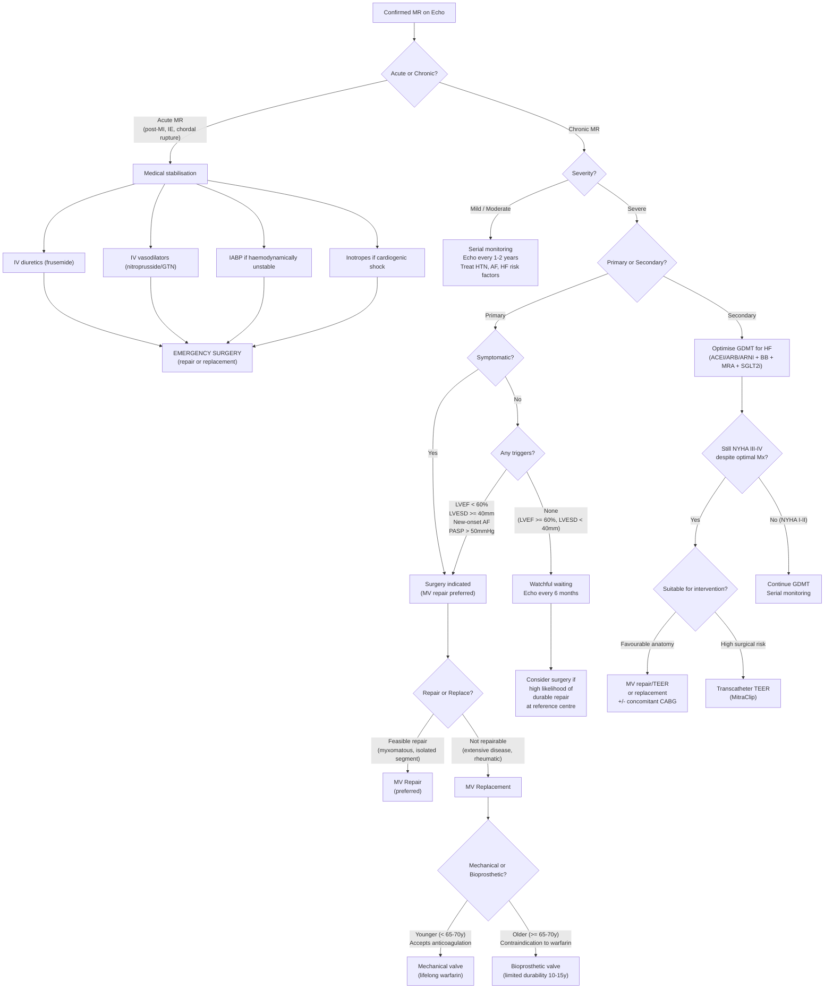

## Management of Mitral Regurgitation

### Overarching Principles

Before diving into specifics, understand the fundamental management philosophy for MR — it is different from most other valve lesions:

1. ***No medication*** can fix MR [1]. Unlike aortic stenosis (where no medical therapy alters the valve) or heart failure (where GDMT prolongs life), there is **no drug that reduces or cures** the regurgitant leak itself. Medical therapy in MR is purely **supportive** — it manages symptoms and haemodynamic consequences while buying time for surgery or palliation.

2. ***Surgery is the only method to address the underlying condition*** [2]. The question is never *whether* to operate, but *when* — because operating too late means irreversible LV damage has already occurred, while operating too early exposes a potentially stable patient to surgical risk.

3. ***Indication for surgery: severe valve problem with symptom or ventricular dysfunction*** [1]. This simple rule from the lecture slides captures the essence of the surgical indication.

4. ***Surgery should be done early to avoid development of irreversible ↓LV function*** [2]. By the time a patient with MR is symptomatic, the LV may already be damaged. The goal is to intervene before the "point of no return."

<Callout title="The Fundamental Principle" type="error">
***No medication*** fixes MR [1]. Don't fall into the trap of thinking ACE inhibitors or beta-blockers "treat" MR — they treat the HF consequences of MR or concomitant hypertension. The leak itself can only be fixed mechanically (surgery or transcatheter intervention).
</Callout>

---

### 1. Management Algorithm

---

### 2. Acute MR — Emergency Management

Acute MR (from papillary muscle rupture, chordal rupture, leaflet perforation from IE, or prosthetic valve failure) is a **haemodynamic emergency** with high mortality if not surgically corrected.

#### 2.1 Immediate Medical Stabilisation

The goal of medical therapy in acute MR is to **bridge to emergency surgery** — NOT to be the definitive treatment. The aim is to:
- ↓Pulmonary oedema (↓preload)
- ↑Forward cardiac output (↓afterload → diverts blood forward through the aorta rather than backward through the incompetent mitral valve)
- Support haemodynamics if in cardiogenic shock

| Intervention | Mechanism | Dosing/Notes |
|---|---|---|
| ***IV diuretics (frusemide)*** [2] | ***↓Acute pulmonary oedema (APO)*** by ↓intravascular volume → ↓preload → ↓LA/pulmonary venous pressure | IV frusemide 40–80 mg bolus; titrate to urine output |
| ***IV vasodilators (sodium nitroprusside)*** [2] | ***↓Afterload*** → ↓impedance to forward flow → more blood exits through the aorta, less regurgitates into the LA → ↓regurgitant fraction + ↑effective CO | Nitroprusside 0.3–5 μg/kg/min IV infusion. **Contraindicated in hypotension.** Requires arterial line monitoring. |
| **IV GTN (nitroglycerin)** | Predominantly venodilator → ↓preload; some ↓afterload at higher doses | 10–200 μg/min IV. Useful if SBP adequate. |
| **Intra-aortic balloon pump (IABP)** | Counterpulsation: inflates in diastole (↑coronary perfusion), deflates in systole (↓afterload → ↓regurgitant fraction). The most effective non-surgical method to rapidly ↑forward CO and ↓MR. | Inserted percutaneously via femoral artery. Bridge to surgery. |
| **Inotropes (dobutamine, milrinone)** | ↑Contractility → ↑forward CO. Milrinone also has vasodilatory properties (phosphodiesterase-3 inhibitor = "inodilator"). | If cardiogenic shock with ↓BP. Dobutamine 2–20 μg/kg/min. |
| **Intubation/mechanical ventilation** | Positive pressure ventilation ↓preload (↑intrathoracic pressure → ↓venous return) and ↓work of breathing | If respiratory failure, exhaustion, refractory hypoxia |

**Why does ↓afterload help in MR?**
In MR, blood takes the path of least resistance. The LA is a low-pressure chamber, so without intervention, a large fraction of each stroke volume flows backward into the LA. By reducing systemic vascular resistance (afterload), you make the aortic outflow pathway "easier" — more blood goes forward through the aorta, less goes backward. This is the opposite of what you'd do in aortic stenosis (where ↓afterload is dangerous because the fixed obstruction means ↓SVR → ↓coronary perfusion).

#### 2.2 Emergency Surgery

***Acute severe MR requires emergency surgery*** — either repair or replacement, depending on the pathology:

| Cause | Typical Surgical Approach |
|---|---|
| Papillary muscle rupture (post-MI) | MV replacement (the necrotic muscle base is not suitable for repair) ± CABG |
| Chordal rupture (degenerative) | MV repair (neo-chordae placement, leaflet resection) |
| IE with leaflet destruction | Debridement + repair if feasible; replacement if extensive destruction |
| Prosthetic valve failure | Re-do valve replacement |

---

### 3. Chronic Primary MR — Definitive Management

#### 3.1 Medical Therapy — What It Can and Cannot Do

***Medical therapy in chronic MR does NOT alter disease progression or reduce regurgitation*** [1][2]. Its roles are limited to:

| Indication | Treatment | Rationale |
|---|---|---|
| ***AF: anticoagulation, rate control*** [3] | Warfarin (target INR 2–3) + rate control with digoxin, beta-blocker, or non-DHP CCB | AF → ↓atrial contribution to LV filling + risk of LA thrombus → systemic embolism. Rate control maintains adequate diastolic filling time. |
| **Symptomatic HF** | ***Treat underlying HF if LVEF < 60%*** [2]: ACEI/ARB, diuretics, beta-blockers | Volume overload management. But this should prompt urgent consideration of surgery, not prolonged medical therapy. |
| **Hypertension** | ***Vasodilators only otherwise indicated for HTN*** [2]: ACEI/ARB/CCB | ↓Afterload → ↓regurgitant fraction, but this is a secondary benefit. **There is NO indication for vasodilator therapy in normotensive asymptomatic MR** — unlike in AR where vasodilators were historically used (now also not recommended in asymptomatic AR). |
| **IE prophylaxis** | Only in high-risk groups (prior IE, prosthetic valve) undergoing dental procedures | ***Routine antibiotic prophylaxis is NOT recommended*** [3]. Only for high-risk groups. |

<Callout title="Common Exam Mistake" type="error">
Students often think ACE inhibitors are "treatment" for MR. They are NOT — ***there is no medication for MR*** [1]. ACEIs/ARBs are only used if there is concomitant HTN or HF with ↓LVEF. Do not prescribe vasodilators for normotensive, asymptomatic, compensated MR.
</Callout>

#### 3.2 Surgical Therapy — Indications

***Surgery should be done early to avoid development of irreversible ↓LV function*** [2].

**Severe primary MR — Surgical indications (2020 ACC/AHA / 2021 ESC guidelines):**

| Scenario | Recommendation | Rationale |
|---|---|---|
| **Symptomatic severe primary MR** | ***Surgery indicated*** [1][2] | Any symptom (dyspnoea, fatigue, ↓exercise tolerance) in severe primary MR = operate. The valve is broken and the patient is suffering. |
| **Asymptomatic severe primary MR with LV dysfunction** | ***Surgery indicated if LVEF < 60%*** [2] | ***LVEF cutoff is higher for MR because MR is a volume loading condition → LVEF should be high*** [2]. LVEF < 60% means intrinsic LV contractility has already declined despite the low-impedance "pop-off" valve into the LA. |
| **Asymptomatic severe primary MR with LV dilation** | ***Surgery indicated if LVESD ≥ 40 mm*** [2] | LVESD reflects end-systolic volume — a measure of how much residual blood remains after contraction. If the LV cannot empty adequately (LVESD ≥ 40 mm), it is failing. |
| **Asymptomatic severe primary MR with complications** | ***Surgery indicated if new-onset AF or pulmonary HTN (PASP > 50 mmHg at rest)*** [2][3] | New AF: LA has dilated to the point of electrical instability — the disease is progressing. Pulmonary HTN: back-pressure is now affecting the pulmonary vasculature — delayed surgery risks irreversible pulmonary vascular disease. |
| **Asymptomatic severe primary MR, normal LV function, no triggers** | ***Watchful waiting with echo every 6 months*** [2]. Consider early surgery if high likelihood of durable repair at an experienced centre (2020 ACC/AHA Class IIa). | ***"Severe primary MR except if asymptomatic + normal LV systolic function (LVEF ≥ 60%, LVESD < 40 mm) + no other indications for surgery (new-onset AF, pHTN)"*** [2] — these patients can be safely monitored. |

**Summary of triggers for surgery in asymptomatic severe primary MR:**

> ***Symptoms → Operate.***
> ***LVEF < 60% → Operate.***
> ***LVESD ≥ 40 mm → Operate.***
> ***New AF → Operate.***
> ***PASP > 50 mmHg → Operate.***
> ***None of the above → Watch and wait (but consider early repair at expert centre).***

#### 3.3 Surgical Techniques — Repair vs. Replacement

***Choice: repair is usually preferred to replacement*** [2].

##### 3.3.1 Mitral Valve Repair

***MV repair: reconstruction of parts of valve responsible for regurgitation*** [2]

| Aspect | Details |
|---|---|
| **Principle** | Reconstruct the valve to restore competent leaflet coaptation while preserving native valve tissue |
| **Advantages** | ***Preserve chordae and papillary muscle function (important for LV function)*** [2]; ***avoid long-term anticoagulation use (only require short-term warfarinisation)*** [2]; lower operative mortality; lower rate of endocarditis vs. prosthetic valve; better LV function preservation |
| ***Mortality*** | ***2–4%*** [2] |
| **Preferred in** | ***Generally preferred for younger patients with myxomatous involvement of mitral valve*** [2] |
| **Best suited for** | Isolated P2 prolapse/flail (most common and most "repairable" lesion); limited anterior leaflet pathology; annular dilation without extensive leaflet disease |
| **Techniques** | Leaflet resection (triangular or quadrangular resection of prolapsing segment); neo-chordae (artificial ePTFE chordae to replace ruptured chordae); annuloplasty ring (restores annular geometry, prevents further dilation — used in almost all repairs); edge-to-edge repair (Alfieri stitch — creates a "double-orifice" valve) |

**Why is preserving the chordae and papillary muscles so important?**
The chordae and papillary muscles are not just passive tethers — they actively contribute to LV contraction and geometry. The chordae transmit papillary muscle tension to the annulus during systole, contributing to systolic annular narrowing and longitudinal shortening. When these structures are excised (as in MVR without chordal preservation), LV function drops significantly. This is why ***"preserving chordae and papillary muscle function is important for LV function"*** [2].

##### 3.3.2 Mitral Valve Replacement (MVR)

***MV replacement: total removal and replacement by prosthetic valve*** [2]

| Aspect | Details |
|---|---|
| **Principle** | Excise the diseased valve and implant a prosthetic valve |
| ***Mortality*** | ***5–7%*** [2] — higher than repair because of greater surgical complexity, more extensive tissue excision, and prosthesis-related complications |
| **Preferred in** | ***Generally preferred for older patients with more extensive valve pathology*** [2]; heavily calcified rheumatic valves; failed previous repair |
| **Chordal preservation** | Modern technique aims to preserve the posterior leaflet chordae even during replacement — mitigates the loss of LV function |

###### Choice of Prosthetic Valve: Mechanical vs. Bioprosthetic

| Feature | Mechanical Valve | Bioprosthetic Valve |
|---|---|---|
| **Durability** | Essentially lifelong (> 25–30 years) | Limited: 10–15 years (degenerates faster in younger patients and in the mitral position due to higher closure pressures) |
| **Anticoagulation** | ***Lifelong warfarin required*** (INR 2.5–3.5 for mechanical mitral valve; higher than aortic position) | Short-term warfarin only (3–6 months), then aspirin alone |
| **Major risk** | Bleeding from anticoagulation; valve thrombosis if sub-therapeutic INR | Structural valve deterioration requiring reoperation |
| **Best for** | Younger patients (< 65–70 y) who can comply with lifelong warfarin and INR monitoring | Older patients (≥ 65–70 y), patients with contraindications to anticoagulation, women of childbearing age (warfarin is teratogenic) |
| **Sound** | Audible metallic click on auscultation | Silent |

**Why is the INR target higher for a mechanical mitral valve than a mechanical aortic valve?**
The mitral position experiences lower flow velocities during diastolic filling (compared to the aortic position during systolic ejection). This lower velocity creates more stasis → higher thrombogenicity → requires more aggressive anticoagulation (INR 2.5–3.5 vs. 2.0–3.0 for aortic).

<Callout title="Repair vs. Replacement — The Bottom Line" type="idea">
***Repair is preferred whenever feasible*** because it: (1) preserves the subvalvular apparatus (→ better LV function), (2) avoids lifelong anticoagulation, (3) has lower operative mortality (2–4% vs. 5–7%), and (4) has lower risk of prosthesis-related complications (thrombosis, haemolysis, endocarditis). The main limitation is that not all valves are repairable — rheumatic, heavily calcified, or extensively destroyed valves may require replacement.
</Callout>

---

### 4. Chronic Secondary (Functional) MR — Management

Secondary MR is fundamentally different from primary MR — the valve is normal but the ventricle is sick. Therefore, the management focuses primarily on **treating the underlying ventricular disease**.

#### 4.1 Optimise Guideline-Directed Medical Therapy (GDMT) for HF

This is the **first-line approach** for secondary MR. Treating the underlying LV dysfunction may reduce MR severity by:
- ↓LV volume → ↓annular dilation → improved coaptation
- ↓Afterload → ↑forward flow → ↓regurgitant fraction
- Reverse remodelling → restoration of LV geometry → improved papillary muscle alignment

| Drug Class | Mechanism in MR Context | Key Agents |
|---|---|---|
| **ACEi/ARB/ARNI** | ↓Afterload + neurohormonal blockade → ↓LV remodelling → ↓annular dilation → ↓MR. Sacubitril/valsartan (ARNI) superior to ACEi alone in HFrEF. | Ramipril, valsartan, sacubitril/valsartan |
| **Beta-blockers** | ↓HR → ↑diastolic filling time + anti-remodelling. Caveat: ***BB can worsen regurgitant fraction due to prolonged diastolic time*** [11] — but overall mortality benefit in HFrEF outweighs this. | Bisoprolol, carvedilol, metoprolol succinate |
| **MRA** | ↓Aldosterone-mediated fibrosis + ↓Na/water retention → ↓LV remodelling | Spironolactone, eplerenone |
| **SGLT2 inhibitors** | ↓Preload (glycosuria → osmotic diuresis) + cardioprotective effects independent of diabetes; reduce HF hospitalisations and CV death (DAPA-HF, EMPEROR-Reduced) | Dapagliflozin, empagliflozin |
| **Diuretics** | ↓Preload → ↓pulmonary congestion, ↓LV volume → may ↓MR | Frusemide, bumetanide |
| **Cardiac resynchronisation therapy (CRT)** | In patients with LBBB + LVEF ≤ 35%: biventricular pacing resynchronises LV contraction → ↓functional MR by improving papillary muscle coordination and ↓LV dyssynchrony | CRT-D or CRT-P |

#### 4.2 Surgical/Interventional Therapy for Secondary MR

***Severe secondary MR: surgery only when symptomatic (NYHA III–IV) or concomitant CABG/AVR*** [2].

This is much more restrictive than primary MR because:
- The underlying LV disease persists even after valve surgery → outcomes are worse
- Trials (CTSN trials) showed limited survival benefit of MV repair/replacement for ischaemic MR in many patients
- Medical optimisation alone may sufficiently reduce functional MR

| Intervention | Indication | Details |
|---|---|---|
| **MV repair + annuloplasty ring** ± CABG | Secondary MR with concomitant CABG indication; NYHA III–IV despite GDMT | Undersized annuloplasty ring to overcorrect the annular dilation. However, CTSN trial showed significant recurrence of MR after repair in ischaemic MR (up to 59% at 2 years). |
| **MV replacement** (with chordal preservation) ± CABG | When repair is not feasible or expected to be durable; NYHA III–IV despite GDMT | CTSN trial showed no difference in LV reverse remodelling at 2 years between repair and replacement for severe ischaemic MR — replacement had lower MR recurrence. |
| **Transcatheter edge-to-edge repair (TEER / MitraClip)** | High surgical risk patients with secondary MR, NYHA III–IV despite optimal GDMT | MitraClip clips the anterior and posterior leaflets together, creating a double-orifice valve (based on the Alfieri stitch concept). COAPT trial showed significant reduction in HF hospitalisations and mortality in carefully selected patients with functional MR. MITRA-FR trial showed no benefit — highlighting the importance of patient selection. |
| **CABG alone** | Moderate secondary MR with CAD amenable to revascularisation | Revascularisation may improve papillary muscle function → ↓MR. Adding MV repair to CABG for moderate ischaemic MR did not improve outcomes (RIME trial). |

---

### 5. Management of MVP-Specific Issues [3][4]

| Scenario | Management |
|---|---|
| **Asymptomatic MVP without MR** | Reassurance. No treatment needed. No activity restriction. Echo follow-up every 3–5 years. |
| **MVP with palpitations** | ***Treat arrhythmias*** [3]. Beta-blockers for symptomatic premature ventricular/atrial complexes. |
| **MVP with atypical chest pain** | ***Treat chest pain: beta-blockers*** [3]. Mechanism: ↓HR → ↓papillary muscle stress → ↓ischaemia. |
| **MVP with significant MR** | Manage as for primary MR (see above). MV repair is highly favourable for MVP because the myxomatous valve tissue is pliable and repairable. |
| **MVP with stroke/TIA** | Antiplatelet therapy (aspirin). Anticoagulation if AF or recurrent events. |

---

### 6. Special Considerations

#### 6.1 Anticoagulation in MR

| Situation | Anticoagulation |
|---|---|
| Native valve MR without AF | NOT indicated |
| Native valve MR with AF | Warfarin (INR 2–3) or DOAC. CHA₂DS₂-VASc score guides decision (most patients with valvular AF warrant anticoagulation). Note: DOACs are acceptable in non-MS, non-mechanical valve AF. |
| Mechanical mitral valve | Lifelong warfarin (INR 2.5–3.5). DOACs are CONTRAINDICATED (RE-ALIGN trial showed increased thrombosis and bleeding with dabigatran in mechanical valves). |
| Bioprosthetic mitral valve | Warfarin for 3–6 months post-surgery (INR 2–3), then aspirin alone if no AF |
| Post-MV repair | ***Short-term warfarinisation*** [2], typically 3 months, then aspirin |

#### 6.2 Pregnancy Considerations

- MR is generally **well-tolerated** in pregnancy (unlike MS). The ↓SVR of pregnancy → ↓afterload → ↓regurgitant fraction → may actually improve symptoms.
- Medical management: diuretics if symptomatic (avoid ACEi/ARB — teratogenic); beta-blockers safe.
- If prosthetic valve: mechanical valve + warfarin is problematic (warfarin is teratogenic in 1st trimester; heparin bridging protocols are complex and carry risk). Bioprosthetic valve avoids this issue but has limited durability.

#### 6.3 Endocarditis Prophylaxis [3]

***Routine antibiotic prophylaxis is NOT recommended*** [3].

Only for ***high-risk groups*** [3]:
- ***Prosthetic valve replacement/repair***
- ***Previous IE***
- ***Congenital heart disease: unrepaired cyanotic CHD, repaired with residual defects, completely repaired within the first 6 months***

For ***dental procedures***: ***amoxicillin 2g PO / ampicillin IV; single dose 30–60 min before procedure; clindamycin 600 mg PO/IV if allergic to penicillin*** [3].

---

### 7. Surgical Approach and Perioperative Considerations [11]

| Aspect | Details |
|---|---|
| **Approach** | Median sternotomy (traditional); right mini-thoracotomy (minimally invasive); robotic-assisted (available at QMH in HK) |
| **Sternotomy recovery** | Takes ~10 weeks for sternal bone to heal → no weight-bearing upper body exercise; larger wound; risk of sternal wound infection |
| **Cardiopulmonary bypass** | Required for all open MV surgery — heart arrested, blood oxygenated externally |
| **General complications** | CVA, severe infection, bleeding, multi-organ failure |
| **Specific cardiac complications** | Heart block (particularly with posterior annuloplasty near the conduction system), heart failure, perioperative MI |
| **Outcome** | ***Mortality 2–4% for MV repair, 5–7% for MVR*** [2]. Progressive ↓symptoms and ↑heart function ~3 months post-surgery |

---

<Callout title="High Yield Summary — Management of MR">

***No medication*** fixes MR [1]. Surgery is the definitive treatment.

**Acute MR**: ***IV diuretics + IV vasodilators (nitroprusside)*** [2] → ↓preload + ↓afterload → bridge to **emergency surgery**. IABP if unstable.

**Chronic Primary MR — Surgical indications**:
- ***Symptomatic severe primary MR → surgery***
- ***Asymptomatic: operate if LVEF < 60%, LVESD ≥ 40 mm, new-onset AF, or PASP > 50 mmHg*** [2]
- ***If none of the above (LVEF ≥ 60%, LVESD < 40 mm, no AF/pHTN) → watchful waiting*** [2]

**Repair vs. Replacement**:
- ***Repair preferred*** (mortality 2–4%) — ***preserves chordae/papillary muscle function, avoids long-term anticoagulation*** [2]
- ***Replacement*** (mortality 5–7%) — for ***older patients with extensive pathology*** [2]

**Chronic Secondary MR**: Optimise GDMT first → ***surgery only if NYHA III–IV despite optimal Mx, or concomitant CABG/AVR*** [2]. TEER (MitraClip) for high surgical risk.

**Anticoagulation**: Mechanical mitral valve = lifelong warfarin INR 2.5–3.5. Bioprosthetic = short-term warfarin then aspirin. DOACs contraindicated in mechanical valves.

</Callout>

---

<ActiveRecallQuiz
  title="Active Recall - Management of Mitral Regurgitation"
  items={[
    {
      question: "Why does afterload reduction (e.g., nitroprusside) improve haemodynamics in acute MR?",
      markscheme: "In MR, blood flows both forward through the aorta and backward through the incompetent mitral valve into the LA. The relative proportions depend on the impedance of each pathway. By reducing afterload (systemic vascular resistance), you decrease the impedance to forward flow through the aorta, so more blood goes forward and less regurgitates backward. This increases effective cardiac output and reduces pulmonary congestion."
    },
    {
      question: "List 4 triggers for surgery in asymptomatic severe primary MR.",
      markscheme: "(1) LVEF < 60%; (2) LVESD >= 40 mm; (3) New-onset AF; (4) Pulmonary hypertension with PASP > 50 mmHg at rest. Any one of these indicates surgery even if the patient is asymptomatic, because they indicate disease progression and risk of irreversible LV damage."
    },
    {
      question: "Why is MV repair preferred over MV replacement? Give at least 3 reasons.",
      markscheme: "(1) Preserves chordae and papillary muscle function, which are important for LV systolic function; (2) Avoids long-term anticoagulation (only short-term warfarin needed); (3) Lower operative mortality (2-4% vs 5-7%); (4) Lower risk of prosthesis-related complications (thrombosis, haemolysis, endocarditis); (5) Better long-term LV function and survival."
    },
    {
      question: "How does the management of severe secondary MR differ from severe primary MR in terms of surgical indications?",
      markscheme: "In primary MR, surgery is indicated for all symptomatic patients and for asymptomatic patients with LV dysfunction triggers. In secondary MR, guideline-directed medical therapy (GDMT) for the underlying HF is the first-line treatment. Surgery is only indicated when symptomatic despite optimal GDMT (NYHA III-IV) or when concomitant CABG/AVR is needed. This is because the valve is structurally normal in secondary MR - the problem is the ventricle, not the valve."
    },
    {
      question: "Why is the INR target higher for a mechanical mitral valve (2.5-3.5) than a mechanical aortic valve (2.0-3.0)?",
      markscheme: "The mitral position has lower flow velocities during diastolic filling compared to the aortic position during systolic ejection. Lower velocity creates more stasis of blood around the prosthesis, increasing thrombogenicity. Therefore, more aggressive anticoagulation is required to prevent valve thrombosis."
    },
    {
      question: "What is the role of MitraClip (TEER) in MR management and which trial demonstrated its benefit in functional MR?",
      markscheme: "MitraClip is a transcatheter edge-to-edge repair device that clips the anterior and posterior mitral leaflets together, creating a double-orifice valve (based on the Alfieri stitch concept). It is indicated for high surgical risk patients with secondary MR who remain symptomatic (NYHA III-IV) despite optimal GDMT. The COAPT trial showed significant reduction in HF hospitalisations and mortality in carefully selected patients. The MITRA-FR trial showed no benefit, highlighting that patient selection is critical."
    }
  ]}
/>

## References

[1] Lecture slides: Cardiac Surgery Tutorial_Prof. D Chan.pdf (p36, p38, p39, p43, p46)
[2] Senior notes: Ryan Ho Cardiology.pdf (p155, p157)
[3] Senior notes: Maksim Medicine Notes.pdf (p35, p37, p39)
[4] Senior notes: Ryan Ho Cardiology.pdf (p157 — MVP section)
[11] Senior notes: Ryan Ho Cardiology.pdf (p154, p161 — surgical approach and complications; BB and regurgitant fraction)
