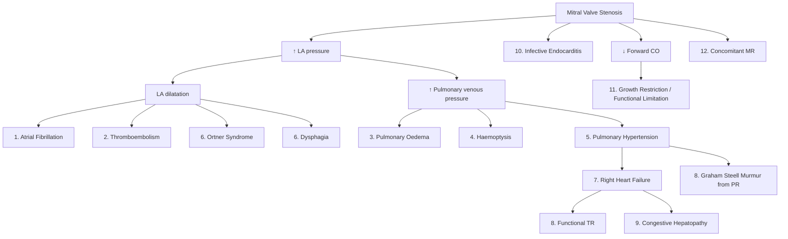

## Complications of Mitral Stenosis

Every complication of MS can be traced back to the single core problem: **a narrowed mitral valve orifice obstructing diastolic flow from LA to LV**. This creates upstream pressure overload (LA → pulmonary vasculature → right heart) and downstream low flow (reduced LV filling → reduced CO). Understanding this cascade means you can predict and explain every complication from first principles.

---

### 1. Atrial Fibrillation

***Atrial fibrillation occurs in ~45% of MS patients*** [2] and is one of the most common and clinically significant complications.

**Pathophysiology (from first principles):**
- Chronic pressure overload → LA dilatation → stretching of atrial myocytes → disruption of normal electrical conduction pathways → formation of multiple re-entrant circuits → AF.
- Additionally, rheumatic inflammation causes **atrial fibrosis**, which further disrupts conduction and creates a substrate for AF maintenance even after the initial trigger resolves.
- The larger the LA, the more likely AF is to develop and the harder it is to cardiovert back to sinus rhythm.

**Why AF is so dangerous in MS:**
- **Loss of atrial kick**: In MS, atrial contraction provides a critical final "push" of blood across the stenotic valve, contributing 15–25% of LV filling. AF eliminates this organised contraction → acute reduction in LV filling → ↑LA pressure → pulmonary congestion [2].
- **Rapid ventricular response**: The uncontrolled ventricular rate shortens diastole → less time for blood to flow across the narrowed valve → further ↑transmitral gradient → further ↑LA pressure.
- ***Occurrence of AF is associated with acute cardiac decompensation*** [2] — patients who were previously compensated may present with flash pulmonary oedema when AF develops.

**Management**: Rate control (beta-blockers, non-DHP CCBs, digoxin) + ***anticoagulation (warfarin)*** [1]. Consider cardioversion if new-onset and LA is not massively dilated.

<Callout title="AF in MS = Medical Emergency">
New-onset AF in a patient with moderate-severe MS should be treated urgently. The combination of loss of atrial kick AND rapid ventricular rate can precipitate acute pulmonary oedema within hours. Urgent rate control is the priority — slow the heart rate to prolong diastole and allow more time for transmitral flow.
</Callout>

---

### 2. Systemic Thromboembolism

***Embolization: enlarged LA → stasis*** [2].

This is one of the most feared complications because it can cause devastating stroke.

**Pathophysiology:**
- LA dilatation → sluggish blood flow, particularly in the left atrial appendage (LAA), which is a blind-ended pouch with trabeculated walls → ideal conditions for thrombus formation (Virchow's triad: stasis, endothelial injury from rheumatic inflammation, hypercoagulability from chronic inflammation).
- AF compounds this: the fibrillating atrium has no effective contraction → complete stasis → thrombus formation.
- Thrombus fragments can detach and embolise to any systemic arterial territory.

**Target organs of embolisation:**

| Territory | Clinical Consequence |
|---|---|
| **Cerebral arteries** | ***Embolic stroke*** — the most devastating complication. Features suggestive of cardioembolic stroke: ***non-progressive onset, non-lacunar pattern with cortical deficits (hemianopia, aphasia, apraxia), multiple territories, haemorrhagic transformation on CT, presence of cardioembolic source with no atherosclerosis on angiography*** [10] |
| **Mesenteric arteries** | Acute mesenteric ischaemia → severe abdominal pain, bloody diarrhoea, bowel infarction. Surgical emergency |
| **Renal arteries** | Renal infarction → flank pain, haematuria, elevated LDH |
| **Peripheral arteries (limb)** | Acute limb ischaemia → the 6 P's (pain, pallor, pulselessness, paraesthesia, paralysis, perishingly cold) |
| **Splenic artery** | Splenic infarction → left upper quadrant pain |

**Risk factors for embolism in MS:**
- AF (strongest risk factor)
- Large LA (> 55 mm)
- Spontaneous echo contrast ("smoke" on echo — indicates stasis)
- Previous embolic event
- Low cardiac output
- Advanced age

**Prevention**: ***Anticoagulation with warfarin (INR 2.0–3.0)*** is mandatory for all MS patients with AF, prior embolism, or LA thrombus [1][2]. ***Recurrent embolic events despite anticoagulation*** is an indication for mitral valve replacement [1].

> **Cardiac evaluation for cardioembolic causes** in stroke work-up includes ***Echo (TTE/TEE) for valvular heart disease*** and ***ECG ± Holter for AF*** [10]. MS is a classic cardioembolic source.

---

### 3. Pulmonary Oedema (Acute and Chronic)

**Pathophysiology:**
- ↑LA pressure → transmitted backwards to pulmonary veins (no valves between LA and pulmonary veins) → ↑pulmonary capillary hydrostatic pressure.
- When pulmonary capillary hydrostatic pressure exceeds plasma oncotic pressure (~25 mmHg), fluid transudates from the capillaries into the pulmonary interstitium and then into the alveoli → **pulmonary oedema**.
- **Chronic, mild elevation** → interstitial oedema only → dyspnoea on exertion, Kerley B lines on CXR, upper lobe pulmonary venous distension [2].
- **Acute, severe elevation** (e.g. from new-onset AF, tachycardia, exercise) → **frank alveolar flooding** → acute pulmonary oedema with pink frothy sputum, severe dyspnoea, hypoxia → life-threatening.

**Clinical presentation**: SOB on exertion → orthopnoea → PND → acute pulmonary oedema (in order of increasing severity) [2].

---

### 4. Haemoptysis

***Haemoptysis: ruptured bronchial veins due to pulmonary congestion*** [1][2].

**Pathophysiology (from first principles):**
- The bronchial veins drain into the pulmonary veins. When pulmonary venous pressure is chronically elevated, this back-pressure is transmitted into the bronchial venous plexus.
- These thin-walled bronchial veins become chronically engorged and dilated (similar to oesophageal varices in portal hypertension, but in the lungs).
- They can rupture spontaneously, especially with coughing or increased intrathoracic pressure → haemoptysis.

**Different mechanisms of haemoptysis in MS:**

| Mechanism | Details |
|---|---|
| ***Bronchial vein rupture*** | The classic mechanism in MS. Frank haemoptysis, can occasionally be massive and life-threatening |
| **Pulmonary oedema** | Pink frothy sputum — not true haemoptysis but blood-tinged oedema fluid. Occurs in acute decompensation |
| **Pulmonary infarction** | If thromboembolism occurs (from LA thrombus → pulmonary embolism, or paradoxical embolism), the infarcted lung tissue produces haemoptysis with pleuritic chest pain |

**Clinical significance**: ***Haemoptysis is an indication for mitral valve replacement*** [1] — it signifies severe pulmonary venous hypertension and risk of life-threatening bleeding.

> Note: In the work-up of haemoptysis, ***mitral stenosis must always be considered*** as a possible cause [11]. This is why a cardiovascular examination is essential in any patient presenting with haemoptysis.

---

### 5. Pulmonary Hypertension

***Pulmonary hypertension due to passive (back-transmission of ↑LAP) and reactive (late vascular remodelling of pulmonary arterioles with chronic pHTN) components*** [2].

This is a major complication that fundamentally alters the natural history of MS.

**Two components (reviewed again for completeness):**

| Component | Mechanism | Reversibility |
|---|---|---|
| **Passive** | Direct back-transmission of elevated LA pressure into pulmonary vasculature. Proportional to degree of LA hypertension | **Reversible** — improves immediately after successful PTMC or MVR when LA pressure drops |
| **Reactive** | Chronic pulmonary venous hypertension triggers arteriolar vasoconstriction (neurohormonal, endothelin) → followed by **vascular remodelling** (medial hypertrophy, intimal fibrosis of pulmonary arterioles) | **Partially reversible** early on (vasoconstriction component responds to treatment). **Fixed and irreversible** once structural remodelling is established (the arterioles are physically thickened and cannot dilate) |

**Clinical significance:**
- ***10-year survival becomes < 3 years once pHTN develops*** [2].
- ***Pulmonary hypertension is an indication for intervention (PTMC or MVR)*** [1] — you want to intervene before the reactive component becomes fixed and irreversible.
- Severe pHTN increases operative risk for MVR significantly, particularly if PVR is very high (> 6 Wood units) and fixed.

**Auscultatory sign**: ***Loud P2*** (forceful closure of pulmonary valve from high PA pressure), ***Graham Steell murmur*** (***PR murmur, associated with loud P2, indicating severe MS*** [1]).

---

### 6. Compression Syndromes from LA Enlargement

As the LA progressively dilates, it can compress adjacent mediastinal structures:

#### 6.1 ***Ortner Syndrome (Hoarseness of Voice)*** [1][2]

- **Mechanism**: ***LA enlargement → compression of the left recurrent laryngeal nerve (RLN) → hoarseness of voice*** [1].
- **Anatomy**: The left RLN loops under the aortic arch and ascends in the tracheo-oesophageal groove, passing between the aorta and the pulmonary artery, directly adjacent to the LA. A massively dilated LA (or a dilated pulmonary artery from pHTN) can compress this nerve.
- **Consequence**: Left vocal cord paralysis → hoarseness, weak voice, sometimes aspiration risk.
- **Clinical significance**: Indicates massive LA dilatation — a sign of advanced, severe MS.

#### 6.2 Dysphagia

- **Mechanism**: The oesophagus passes directly behind the LA. Massive LA dilatation compresses the oesophagus posteriorly → difficulty swallowing, especially solids [2].
- Less common than Ortner syndrome but an important clue on barium swallow (posterior displacement of the oesophagus).

---

### 7. Right Heart Failure

***Chronic ↑pulmonary venous pressure → ↑RV load → right heart failure*** [2].

**Pathophysiology:**
- The RV is a thin-walled, crescent-shaped chamber designed for a low-pressure system (normal PA systolic pressure ~25 mmHg).
- Chronic pulmonary hypertension from MS imposes a **pressure overload** on the RV.
- Initially, the RV compensates with concentric **hypertrophy** (manifesting as a left parasternal heave).
- Eventually, the RV decompensates → **RV dilatation** → ↓RV contractility → ↓RV output → ↑systemic venous pressure.

**Clinical manifestations of right heart failure:**

| Sign/Symptom | Mechanism |
|---|---|
| **Elevated JVP** | ↑RA pressure transmitted to jugular veins |
| **Hepatomegaly (tender, pulsatile)** | Systemic venous congestion → blood backs up into hepatic veins → liver swells. If functional TR develops, the liver pulsates with each systolic regurgitant wave |
| **Ascites** | Chronic hepatic congestion → ↑hydrostatic pressure in hepatic sinusoids → transudation into peritoneal cavity. Also ↓albumin synthesis from congestive hepatopathy contributes |
| **Peripheral oedema** | ↑systemic venous pressure → ↑capillary hydrostatic pressure in dependent areas → fluid transudation into interstitial tissue |
| **Facial congestion / mitral facies** | ***Malar flush: low CO results in poor facial skin perfusion → release of vasodilators by skin tissue → cutaneous vasodilation on cheeks*** [5]. Combined with CO₂ retention from pulmonary congestion → bluish-red discolouration |

<Callout title="Paradox of Right Heart Failure in MS">
Interestingly, when severe RV failure develops in MS, the patient's **pulmonary congestion may actually improve** — because the failing RV cannot pump enough blood through the pulmonary vasculature to cause congestion. The patient "trades" pulmonary symptoms (SOB, orthopnoea) for systemic congestion symptoms (ascites, oedema, hepatomegaly). This can be misleading — the patient seems to "improve" from a pulmonary standpoint while actually deteriorating overall.
</Callout>

---

### 8. Functional Tricuspid Regurgitation and Graham Steell Murmur

#### 8.1 Functional TR

- **Mechanism**: RV pressure overload → RV dilatation → tricuspid annulus stretches → tricuspid valve leaflets can no longer coapt properly → **functional (secondary) tricuspid regurgitation** [2].
- **Clinical sign**: Pansystolic murmur at the LLSB that ***increases with inspiration (Carvallo's sign)*** [1].
- **Consequence**: Further worsens right heart failure (the RV now has both pressure overload from pHTN AND volume overload from regurgitation → accelerated RV failure).

#### 8.2 ***Graham Steell Murmur*** [1]

- **Mechanism**: Severe pulmonary hypertension → dilatation of the pulmonary valve annulus → pulmonary valve leaflets can no longer coapt → **functional pulmonary regurgitation (PR)**.
- **Auscultatory finding**: ***PR murmur: early diastolic decrescendo murmur at the left 2nd–3rd intercostal space, associated with loud P2, indicating severe MS*** [1].
- **Clinical significance**: The presence of a Graham Steell murmur tells you that the patient has severe, long-standing pulmonary hypertension. It is a marker of advanced disease.

---

### 9. Congestive Hepatopathy and Cardiac Cirrhosis

**Pathophysiology:**
- Chronic right heart failure → chronic hepatic venous congestion → **centrilobular necrosis** (zone 3 hepatocytes, which are furthest from the hepatic arterial supply, are most vulnerable to hypoxia and congestion).
- Over time, repeated episodes of congestion and necrosis → **fibrosis** → **cardiac cirrhosis**.

**Clinical features:**
- Hepatomegaly (tender initially, becomes firm and non-tender as fibrosis develops)
- Elevated transaminases (ALT, AST) during acute congestion episodes
- Elevated bilirubin → jaundice in severe cases
- Low albumin → contributes to ascites and oedema
- Prolonged PT/INR → coagulopathy
- In very advanced cases → portal hypertension from cardiac cirrhosis → oesophageal varices, splenomegaly

> Cardiac cause of jaundice includes severe congestive HF leading to hepatic congestion or cardiac cirrhosis [5].

---

### 10. Infective Endocarditis

**Pathophysiology:**
- The turbulent blood flow across the stenotic mitral valve damages the valvular endothelium → creates a nidus for bacterial adhesion → vegetations form.
- Rheumatic valves are particularly susceptible because they are already abnormal (thickened, scarred, calcified), providing an irregular surface for platelet-fibrin deposition and subsequent bacterial colonisation.

**Clinical features**: Fever, new/changing murmur, embolic phenomena (splinter haemorrhages, Osler's nodes, Janeway lesions, Roth spots), positive blood cultures [3].

**Risk**: MS is a risk factor for **subacute** infective endocarditis (caused by less virulent organisms like Strep viridans that tend to infect **abnormal** valves) [3].

**Prevention**: Routine antibiotic prophylaxis is NOT recommended for native valve MS. Only indicated for **high-risk groups** (prosthetic valves, previous IE, unrepaired cyanotic CHD) undergoing dental procedures [3].

---

### 11. ***Concomitant Mitral Regurgitation*** [1]

***Concomitant MR: significantly calcified valve impairing closing*** [1].

**Pathophysiology:**
- As rheumatic disease progresses, the valve becomes not only stenotic but also increasingly calcified and rigid.
- A severely calcified valve may not only fail to open adequately (stenosis) but also fail to **close** properly → **mixed mitral valve disease** (MS + MR).
- The MR adds a volume overload component to the already pressure-overloaded LA → accelerates LA dilatation, AF, and pulmonary congestion.
- Mixed lesions are particularly challenging because the haemodynamic consequences compound each other.

**Clinical implication**: ***Moderate-to-severe MR is a contraindication for PTMC*** [1] because balloon dilation may worsen the MR catastrophically.

---

### 12. Complications of Treatment

#### 12.1 PTMC Complications [2]

| Complication | Mechanism |
|---|---|
| ***Residual ASD (~5%)*** | Transseptal puncture creates an iatrogenic hole in the interatrial septum |
| ***Iatrogenic MR*** | Balloon inflation tears leaflet or disrupts subvalvular apparatus |
| ***Periprocedural embolism*** | Dislodgement of thrombus or air embolism |
| **Cardiac tamponade** | Perforation during transseptal puncture |

#### 12.2 Surgical (MVR) Complications [2]

| Complication | Mechanism |
|---|---|
| ***CVA*** | Perioperative embolism (air, thrombus, calcific debris) |
| ***Heart block*** | Surgical damage to the AV node or His bundle (which lies close to the mitral annulus) |
| ***Heart failure*** | Perioperative myocardial injury, loss of subvalvular apparatus (if chordae are excised during MVR, LV geometry is altered → impaired LV function) |
| ***Perioperative MI*** | Coronary embolism or air lock, especially in patients with pre-existing CAD |
| ***Severe infection*** | Sternal wound infection, mediastinitis (especially after median sternotomy), prosthetic valve endocarditis |
| ***Bleeding*** | Cardiopulmonary bypass requires heparinisation; also inherent surgical bleeding risk |
| **Prosthetic valve complications** | Thrombosis (if anticoagulation inadequate), pannus formation, structural valve deterioration (bioprosthetic), mechanical haemolysis (mechanical valves) |
| ***Overwarfarinisation*** [2] | The majority of MS patients with AF are on warfarin → risk of bleeding complications (intracranial haemorrhage, GI bleeding, etc.) if INR is supratherapeutic |

---

### Summary Table of Complications by Mechanism

| Upstream Mechanism | Complication |
|---|---|
| **LA pressure overload → LA dilatation** | Atrial fibrillation, thromboembolism (stroke), Ortner syndrome, dysphagia, concomitant MR |
| **Pulmonary venous congestion** | Pulmonary oedema (acute and chronic), haemoptysis (bronchial vein rupture) |
| **Pulmonary hypertension** | RV failure, functional TR, Graham Steell murmur (functional PR) |
| **Right heart failure** | Systemic venous congestion (JVP↑, hepatomegaly, ascites, oedema), congestive hepatopathy → cardiac cirrhosis |
| **Low forward cardiac output** | Fatigue, exercise intolerance, mitral facies |
| **Abnormal valve surface** | Infective endocarditis |
| **Treatment-related** | PTMC complications (ASD, iatrogenic MR, embolism), surgical complications (CVA, heart block, HF, MI, infection, bleeding), anticoagulation complications (over-warfarinisation) |

---

<Callout title="High Yield Summary">

**Complications of MS** all trace back to: ↑LA pressure → LA dilatation → pulmonary venous congestion → pHTN → RV failure.

**Most common and important complications:**
1. ***AF (~45%)*** → acute decompensation + thromboembolism risk [2]
2. ***Systemic thromboembolism (stroke)*** → requires warfarin anticoagulation [1][2]
3. **Pulmonary oedema** → dyspnoea, orthopnoea, PND → flash pulmonary oedema if acutely decompensated
4. ***Haemoptysis*** → bronchial vein rupture from pulmonary venous congestion; indication for MVR [1]
5. ***Pulmonary hypertension*** → passive + reactive components; < 3-year survival once established [2]; indication for intervention [1]
6. ***Ortner syndrome*** → LA compresses left RLN → hoarseness [1]
7. **Right heart failure** → hepatomegaly, ascites, oedema, functional TR
8. ***Graham Steell murmur*** → functional PR from severe pHTN [1]
9. **Congestive hepatopathy** → may progress to cardiac cirrhosis
10. **Infective endocarditis** → abnormal valve surface predisposes
11. ***Concomitant MR*** → calcified valve fails to close; CI to PTMC [1]
12. **Treatment complications** → ***PTMC: residual ASD (5%), iatrogenic MR, embolism*** [2]. ***Surgery: CVA, heart block, HF, MI, infection, bleeding*** [2]
</Callout>

---

<ActiveRecallQuiz
  title="Active Recall - Complications of Mitral Stenosis"
  items={[
    {
      question: "Explain the two-component pathophysiology of pulmonary hypertension in MS and state which component is reversible versus irreversible.",
      markscheme: "Passive component: direct back-transmission of elevated LA pressure into pulmonary vasculature, proportional to LA pressure. REVERSIBLE — improves immediately when LA pressure falls after PTMC or MVR. Reactive component: chronic pulmonary venous hypertension triggers arteriolar vasoconstriction (neurohormonal) followed by vascular remodelling (medial hypertrophy, intimal fibrosis). PARTIALLY reversible early (vasoconstriction responds), but becomes FIXED and IRREVERSIBLE once structural remodelling is established."
    },
    {
      question: "Why does new-onset atrial fibrillation cause acute haemodynamic decompensation in mitral stenosis? Name two specific mechanisms.",
      markscheme: "(1) Loss of atrial kick: in MS, atrial contraction contributes a critical 15-25% of LV filling by providing a final push across the stenotic valve. AF eliminates this organised contraction, acutely reducing LV filling. (2) Rapid ventricular response: uncontrolled tachycardia shortens diastolic filling time, which is the only time blood can flow across the mitral valve. Both effects simultaneously increase LA pressure and decrease cardiac output, precipitating pulmonary oedema."
    },
    {
      question: "Describe the mechanism of haemoptysis in mitral stenosis. What specific vascular structure ruptures and why?",
      markscheme: "Bronchial veins rupture due to pulmonary venous congestion. Mechanism: bronchial veins drain into pulmonary veins. Chronically elevated pulmonary venous pressure is transmitted backwards into the bronchial venous plexus. These thin-walled veins become engorged and dilated. They can rupture spontaneously or with coughing, causing haemoptysis. This is analogous to oesophageal varices in portal hypertension but occurring in the pulmonary vasculature."
    },
    {
      question: "A patient with long-standing severe MS paradoxically reports that their breathlessness has improved, but they have developed increasing abdominal distension and leg swelling. Explain this phenomenon.",
      markscheme: "This is the paradox of right heart failure in MS. As the RV fails from chronic pulmonary hypertension, it can no longer pump adequate blood through the pulmonary vasculature. This reduces pulmonary blood flow and therefore reduces pulmonary congestion, improving dyspnoea. However, the failing RV causes systemic venous congestion (elevated JVP, hepatomegaly, ascites, peripheral oedema). The patient has traded pulmonary symptoms for systemic congestion symptoms — overall they are actually deteriorating despite the apparent improvement in breathlessness."
    },
    {
      question: "Name four features suggestive of cardioembolic stroke from mitral stenosis rather than atherothrombotic stroke.",
      markscheme: "Features of cardioembolic stroke: (1) Non-progressive onset (sudden maximal deficit, cf stuttering or progressive onset in thrombotic stroke). (2) Non-lacunar pattern with cortical deficits (hemianopia, aphasia, apraxia). (3) Multiple vascular territories affected. (4) Haemorrhagic transformation on CT. (5) Presence of cardioembolic source (MS with AF, LA thrombus) with no atherosclerosis on angiography. (6) Superficial cortical location in ACA, posterior MCA, or cerebellar territories."
    }
  ]}
/>

## References

[1] Senior notes: Maksim Medicine Notes.pdf (Cardiology section, pp. 35–37)
[2] Senior notes: Ryan Ho Cardiology.pdf (pp. 152–155, Mitral Valve Diseases)
[3] Senior notes: Maksim Medicine Notes.pdf (Rheumatic Heart Disease p. 38; Infective Endocarditis p. 39)
[4] Lecture slides: Cardiac Surgery Tutorial_Prof. D Chan.pdf (p. 56 — "Most mitral stenosis — no normal tissue to repair")
[5] Senior notes: Ryan Ho Fundamentals.pdf (pp. 13, 22 — Mitral facies, cardiac causes of jaundice)
[10] Senior notes: Ryan Ho Neurology.pdf (pp. 75, 80 — Risk factors for stroke, features of embolic stroke, cardiac evaluation)
[11] Senior notes: Ryan Ho Respiratory.pdf (p. 23 — Haemoptysis approach, mitral stenosis as a cause)
