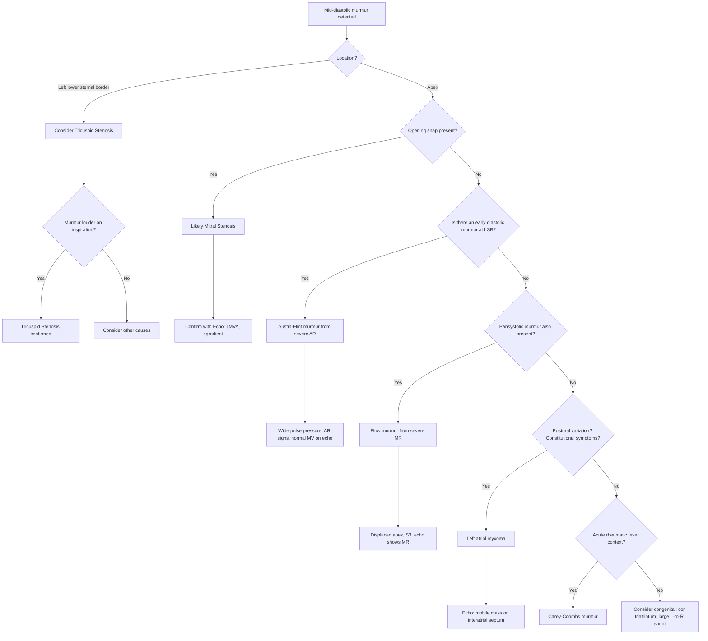

## Differential Diagnosis of Mitral Stenosis

The differential diagnosis of mitral stenosis is really about two clinical questions:

1. **The patient presents with a mid-diastolic murmur at the apex** — what else could cause this?
2. **The patient presents with dyspnoea, pulmonary congestion, and/or pulmonary hypertension** — what other conditions mimic the haemodynamic picture of MS?

Let me work through this systematically, because the approach to differentiating these conditions teaches you a lot about cardiac physiology.

---

### Conceptual Framework: Why Does MS Need a Differential?

***Heart valve problems in general***: ***Stenosis = limited blood passing through → pressure overload; Regurgitation = large amount of blood going back → volume overload*** [6]. MS is a pressure-overload problem for the LA and pulmonary vasculature. Any condition that raises LA pressure or obstructs LV inflow will mimic MS haemodynamically. And any condition that produces a low-pitched diastolic rumble at the apex will mimic MS on auscultation.

---

### A. Differential Diagnosis of the Mid-Diastolic Murmur at the Apex

This is the most exam-relevant framing. The hallmark murmur of MS is a **low-pitched mid-diastolic rumble** best heard at the apex with the bell in the left lateral decubitus position. Several other conditions can produce a similar murmur:

#### 1. ***Austin-Flint Murmur (Functional MS from Severe Aortic Regurgitation)*** [1]

- **Mechanism**: In severe AR, the regurgitant jet from the aortic valve strikes the anterior mitral leaflet during diastole, partially closing it and restricting mitral inflow. This creates ***functional obstruction*** to LV filling, mimicking MS and producing a mid-diastolic rumble at the apex [1].
- **How to distinguish from true MS**:
  - **No opening snap** (the mitral valve is structurally normal)
  - **S1 is normal or soft** (not loud as in mild-moderate MS)
  - **Wide pulse pressure** and other peripheral signs of AR (Corrigan's sign, de Musset's sign, Quincke's sign) — these are the opposite of the narrow pulse pressure seen in MS
  - ***Associated with signs of severe AR: long diastolic murmur at the left sternal border, S3*** [1]
  - Echocardiography will show a normal mitral valve with severe AR and diastolic fluttering of the anterior mitral leaflet

<Callout title="Austin-Flint Murmur vs True MS">
***Austin-Flint murmur: AR jet impinging on anterior mitral valve leaflet → functional MS*** [1]. The key differentiator is the absence of an opening snap and the presence of wide pulse pressure and signs of AR. In an OSCE, if you hear a mid-diastolic rumble AND an early diastolic murmur at the left sternal edge → think Austin-Flint.
</Callout>

#### 2. ***Carey-Coombs Murmur (Acute Rheumatic Valvulitis)*** [3]

- **Mechanism**: During acute rheumatic fever, inflammation and oedema of the mitral valve leaflets cause a soft mid-diastolic murmur at the apex. This is NOT from structural stenosis but from acute inflammatory swelling of the leaflets and increased flow across an inflamed valve.
- **How to distinguish from chronic rheumatic MS**:
  - Occurs in the **acute setting** of rheumatic fever (fever, migratory polyarthritis, raised inflammatory markers)
  - **Transient** — resolves as the acute inflammation settles
  - No opening snap (the valve is not structurally stenosed)
  - May be accompanied by an MR murmur (pansystolic at apex)
  - Evidence of recent GAS infection (↑ASOT, positive throat culture)

#### 3. Left Atrial Myxoma

- **Mechanism**: A myxoma is the most common primary cardiac tumour. When it arises from the interatrial septum (usually on a stalk attached near the fossa ovalis) and prolapses through the mitral valve orifice during diastole, it physically obstructs LV inflow — mimicking MS both haemodynamically and on auscultation.
- **Clinical features**:
  - Mid-diastolic rumble at the apex, sometimes with an audible "tumour plop" (low-pitched sound in early diastole, analogous to an opening snap but caused by the tumour hitting the LV wall)
  - **Postural variation**: murmur intensity may change with body position (because the tumour moves with gravity). This is a classic distinguishing feature — true MS does not change with position
  - **Constitutional symptoms**: fever, weight loss, elevated ESR/CRP (myxomas produce IL-6)
  - **Embolic events**: tumour fragments or surface thrombi can embolise systemically
  - **Intermittent symptoms**: patients may report episodic syncope or dyspnoea that worsens in certain positions and resolves in others
- **How to distinguish from MS**:
  - **No opening snap** (no valve abnormality)
  - Constitutional symptoms and elevated inflammatory markers
  - Echocardiography is diagnostic — shows a mobile mass attached to the interatrial septum

#### 4. ***Tricuspid Stenosis (TS)***

- **Mechanism**: TS obstructs RV inflow, producing a mid-diastolic rumble at the ***left lower sternal border (LLSB)***, not the apex. Almost always rheumatic in origin and almost always accompanies MS (isolated TS is extremely rare) [3].
- **How to distinguish from MS**:
  - Murmur is at the **LLSB**, not the apex
  - ***Murmur increases with inspiration*** (increased venous return to right heart → more flow across the stenotic TV → louder murmur). This is in contrast to MS, where the murmur does not change significantly with respiration
  - Signs of **right-sided congestion** predominate (elevated JVP with prominent 'a' wave, hepatomegaly, ascites, peripheral oedema) without prominent pulmonary congestion
  - Echocardiography confirms TV pathology

#### 5. Severe Mitral Regurgitation (Flow Murmur)

- **Mechanism**: In severe MR, a large volume of blood regurgitates into the LA during systole. This increased volume then flows back across the mitral valve in diastole, producing a ***mid-diastolic flow murmur*** [1]. This is NOT stenosis — the valve is not narrowed — it is simply increased flow volume across a normal-sized (or even dilated) orifice.
- **How to distinguish from MS**:
  - A prominent **pansystolic murmur** at the apex (the primary finding) precedes the diastolic rumble
  - **S3** is common (volume-overloaded LV)
  - ***Displaced apex beat*** [1] (LV is dilated from volume overload — in pure MS, the apex is NOT displaced)
  - No opening snap
  - Echocardiography shows MR with normal valve area

#### 6. Large Left-to-Right Shunts (ASD, VSD, PDA)

- **Mechanism**: A significant left-to-right shunt at the atrial level (ASD) increases flow across the tricuspid valve → mid-diastolic flow murmur at LLSB. A VSD or PDA increases flow across the mitral valve → mid-diastolic flow murmur at the apex. These are **flow murmurs**, not stenosis.
- **How to distinguish from MS**:
  - **ASD**: fixed splitting of S2, mid-diastolic murmur at LLSB (tricuspid flow murmur), no opening snap
  - **VSD**: pansystolic murmur at LLSB + mid-diastolic rumble at apex (increased mitral flow)
  - **PDA**: continuous "machinery" murmur at left infraclavicular area + mid-diastolic rumble at apex
  - Echocardiography with colour Doppler identifies the shunt

#### 7. ***Cor Triatriatum Sinister***

- **Mechanism**: A rare congenital anomaly where a fibromuscular membrane divides the LA into two chambers — a proximal chamber receiving the pulmonary veins and a distal chamber communicating with the mitral valve. This creates obstruction to pulmonary venous drainage that mimics MS haemodynamically.
- Usually presents in childhood
- **No opening snap**, no characteristic MS murmur
- Echocardiography/CT/MRI identifies the membrane

---

### B. Differential Diagnosis by Clinical Presentation

Sometimes the patient doesn't present with a murmur as the chief finding. They present with the **consequences** of MS — dyspnoea, pulmonary hypertension, right heart failure, or systemic embolism. Here, the differential broadens:

#### Presenting with Exertional Dyspnoea and Pulmonary Congestion

| Condition | Distinguishing Features |
|---|---|
| **Left heart failure (HFrEF or HFpEF)** | Displaced apex (if HFrEF), S3, no opening snap, no mid-diastolic rumble, CXR shows cardiomegaly with LV enlargement. ECG may show LVH. Echo: ↓LVEF or diastolic dysfunction |
| **Other left-sided valvular disease (MR, AR, AS)** | Each has characteristic murmurs (pansystolic for MR, early diastolic for AR, ejection systolic for AS). ***AS: low-volume, slow-rising pulse, narrow pulse pressure, heaving apex, systolic thrill*** [1]. ***AR: wide pulse pressure*** [1]. Echo confirms |
| **Pulmonary disease (COPD, ILD, PE)** | No cardiac murmur, spirometry/CT chest abnormal, no LA enlargement on echo |
| **Primary pulmonary hypertension** | No valvular abnormality on echo, no LA enlargement. Right heart catheterisation confirms pre-capillary pHTN with normal PCWP |

#### Presenting with Atrial Fibrillation

| Condition | Distinguishing Features |
|---|---|
| **Hypertensive heart disease** | History of hypertension, LVH on ECG/echo, no valvular stenosis |
| **Hyperthyroidism** | Thyroid signs (tremor, weight loss, goitre, eye signs), elevated fT4, suppressed TSH |
| **Lone AF** | No structural heart disease on echo |
| **Other valvular disease with AF** | Echo identifies specific valve lesion |

#### Presenting with Systemic Embolism (e.g. Stroke)

| Condition | Distinguishing Features |
|---|---|
| **AF from any cause** | MS is one of many causes of AF-related embolism |
| **Infective endocarditis** | Fever, positive blood cultures, vegetations on echo, Osler nodes, Janeway lesions |
| **Left atrial myxoma** | Constitutional symptoms, tumour plop, echo shows mass |
| **Atherosclerotic disease** | Carotid bruit, vascular risk factors, carotid Doppler/CT angiography |
| **Paradoxical embolism (PFO/ASD)** | Right-to-left shunt on bubble contrast echo |

#### Presenting with Haemoptysis

| Condition | Distinguishing Features |
|---|---|
| **Pulmonary embolism** | Sudden pleuritic chest pain, tachycardia, CT pulmonary angiography positive |
| **Bronchogenic carcinoma** | Smoking history, weight loss, CT shows mass |
| **Tuberculosis** | Endemic area, constitutional symptoms, CXR cavitating lesion, sputum AFB |
| **Bronchiectasis** | Chronic cough with copious sputum, CT shows dilated airways |
| **Goodpasture syndrome / pulmonary-renal syndromes** | Concurrent renal failure, anti-GBM antibodies |

---

### C. Differentiating from the Other Common Diastolic Murmurs

This is a frequent exam question. The two main categories of diastolic murmurs are:

| Murmur Type | Timing | Pitch | Best Heard | Classic Causes |
|---|---|---|---|---|
| **Early diastolic** (decrescendo) | Immediately after S2 | High-pitched | Left sternal border (AR), left 2nd ICS (PR) | ***Aortic regurgitation***, ***Pulmonary regurgitation (Graham Steell murmur)*** [1][5] |
| **Mid-to-late diastolic** (rumble) | After opening snap, mid-diastole | Low-pitched | Apex (MS), LLSB (TS) | ***Mitral stenosis***, Tricuspid stenosis, Austin-Flint murmur, LA myxoma, flow murmurs [5] |

<Callout title="The Key Distinction">
Early diastolic murmurs (AR, PR) are HIGH-pitched and DECRESCENDO — they start loud just after S2 and fade. Mid-diastolic murmurs (MS, TS) are LOW-pitched and RUMBLING — they occur after an opening snap and may crescendo before S1 (pre-systolic accentuation in sinus rhythm). If you can identify the timing and pitch, you're 80% of the way to the diagnosis [5].
</Callout>

---

### D. Decision Flowchart for Differentiating the Mid-Diastolic Murmur

---

### E. Summary Table: Key Differentiators

| Condition | Murmur | Opening Snap | Pulse Pressure | Apex | S1 | Key Distinguishing Feature |
|---|---|---|---|---|---|---|
| **Mitral Stenosis** | Mid-diastolic rumble, apex | **Present** (if mobile valve) | **Narrow** [1] | Not displaced (tapping) | Loud (mild-mod), soft (severe) | Opening snap + mid-diastolic rumble |
| **Austin-Flint** | Mid-diastolic rumble, apex | **Absent** | ***Wide*** [1] | May be displaced (LV dilatation from AR) | Normal/soft | Co-existing AR murmur, wide pulse pressure |
| **LA Myxoma** | Mid-diastolic rumble ± tumour plop | **Absent** | Variable | Not displaced | Variable | Postural variation, constitutional Sx, echo mass |
| **Carey-Coombs** | Soft mid-diastolic, apex | **Absent** | Normal | Not displaced | Normal | Acute rheumatic fever setting, transient |
| **Tricuspid Stenosis** | Mid-diastolic rumble, LLSB | **Absent at apex** (may have OS at LLSB) | Normal | Not displaced | Normal S1, may have loud T1 | LLSB location, louder on inspiration |
| **Severe MR flow murmur** | Mid-diastolic after prominent PSM | **Absent** | Normal/low | ***Displaced*** [1] | Soft (MR) | Prominent pansystolic murmur, S3 |
| **ASD flow murmur** | Mid-diastolic, LLSB | **Absent** | Normal | Not displaced | Normal | Fixed split S2, tricuspid flow murmur |

---

<Callout title="High Yield Summary">

**The mid-diastolic murmur DDx** can be remembered by asking three sequential questions:
1. **Where is it?** Apex = MS, Austin-Flint, LA myxoma, MR flow murmur, Carey-Coombs. LLSB = TS, ASD flow murmur.
2. **Is there an opening snap?** If yes → likely true MS. If no → consider the other causes.
3. **What else is present?** AR murmur + wide pulse pressure → Austin-Flint. Pansystolic murmur + displaced apex → MR flow. Postural variation + constitutional symptoms → LA myxoma. Acute fever + migratory arthritis → Carey-Coombs.

**Echocardiography is the definitive investigation** to distinguish all of these conditions — it directly visualises valve morphology, measures valve area and gradients, detects masses, and identifies shunts [1][6].

The clinical importance of the differential is that **management is completely different**: MS may need PTMC or valve replacement, Austin-Flint needs AR management, LA myxoma needs surgical excision, and flow murmurs need treatment of the underlying lesion.
</Callout>

---

<ActiveRecallQuiz
  title="Active Recall - Differential Diagnosis of Mitral Stenosis"
  items={[
    {
      question: "Name four conditions that can produce a mid-diastolic murmur at the apex mimicking mitral stenosis, and state one key distinguishing feature for each.",
      markscheme: "(1) Austin-Flint murmur — wide pulse pressure and co-existing AR murmur, no opening snap. (2) LA myxoma — postural variation of murmur, tumour plop, constitutional symptoms. (3) Carey-Coombs murmur — acute rheumatic fever setting, transient. (4) Severe MR flow murmur — prominent pansystolic murmur at apex, displaced apex beat, S3. (5) Tricuspid stenosis (at LLSB not apex) — louder on inspiration."
    },
    {
      question: "How do you differentiate an Austin-Flint murmur from true mitral stenosis on clinical examination?",
      markscheme: "Austin-Flint: no opening snap, S1 normal or soft, wide pulse pressure with peripheral signs of AR (Corrigan sign, de Musset sign), early diastolic decrescendo murmur at LSB from AR. True MS: opening snap present (if valve mobile), loud S1 (if valve mobile), narrow pulse pressure, no AR murmur. Echo confirms normal mitral valve in Austin-Flint."
    },
    {
      question: "A patient presents with a mid-diastolic murmur at the apex that varies in intensity with changes in body position, along with fever, weight loss, and raised ESR. What is the most likely diagnosis and what investigation confirms it?",
      markscheme: "Left atrial myxoma. Postural variation is the classic feature (pedunculated tumour moves with gravity and intermittently obstructs the mitral orifice). Echocardiography confirms the diagnosis by showing a mobile mass attached to the interatrial septum, usually near the fossa ovalis."
    },
    {
      question: "Explain why a large ASD can produce a mid-diastolic murmur and where it is best heard. Why is it NOT at the apex?",
      markscheme: "A large ASD causes significant left-to-right shunt at atrial level, increasing flow across the tricuspid valve (not the mitral valve). The increased volume of blood flowing through a normal-sized tricuspid valve in diastole produces a mid-diastolic flow murmur best heard at the LEFT LOWER STERNAL BORDER (tricuspid area), not the apex. Also associated with fixed splitting of S2 due to equalisation of atrial pressures."
    },
    {
      question: "A patient with known severe mitral stenosis presents with haemoptysis. List the differential diagnoses for haemoptysis in this clinical context.",
      markscheme: "(1) Rupture of bronchial veins from pulmonary venous congestion (most common in MS). (2) Pulmonary oedema (pink frothy sputum). (3) Pulmonary infarction from thromboembolism (LA thrombus or DVT/PE). (4) Concurrent pulmonary pathology: lung cancer, TB, bronchiectasis. Must exclude non-cardiac causes with CXR, CT, and sputum analysis."
    }
  ]}
/>

## References

[1] Senior notes: Maksim Medicine Notes.pdf (Cardiology section, pp. 35–36)
[2] Senior notes: Ryan Ho Cardiology.pdf (pp. 152–155, Mitral Valve Diseases)
[3] Senior notes: Maksim Medicine Notes.pdf (Rheumatic Heart Disease, p. 38; Valvular terminologies, p. 37)
[5] Senior notes: Ryan Ho Fundamentals.pdf (pp. 22, 31, 39 — Heart sounds, murmurs, facies)
[6] Lecture slides: Cardiac Surgery Tutorial_Prof. D Chan.pdf (pp. 33, 45, 52, 56)
