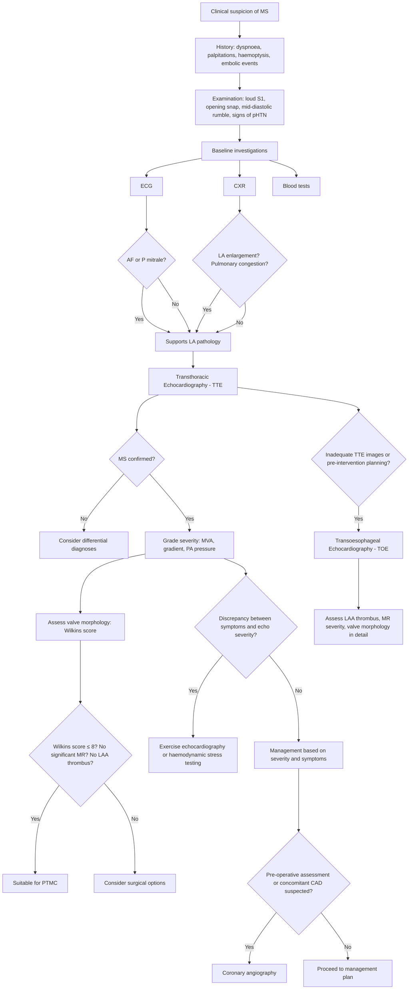

## Diagnosis of Mitral Stenosis

### Diagnostic Principles

The diagnosis of mitral stenosis rests on three pillars: (1) **clinical suspicion** from history and examination, (2) **confirmation and severity grading** by echocardiography (the gold standard), and (3) **assessment of consequences and suitability for intervention** using adjunctive investigations. There is no single "diagnostic criterion" set like Jones criteria for ARF — instead, we integrate clinical and echocardiographic findings.

Let me walk through each investigation systematically, explaining **what you're looking for, what you find, and why**.

---

### 1. Diagnostic Criteria for Mitral Stenosis

Unlike some conditions, MS does not have formal "diagnostic criteria" in the way rheumatic fever has the Jones criteria. The diagnosis is **established by echocardiography** demonstrating a narrowed mitral valve orifice with a diastolic transmitral pressure gradient. The clinical assessment provides the suspicion; echo provides the confirmation.

#### Echocardiographic Severity Grading (2020/2021 ACC/AHA & ESC Guidelines)

This table is what you use to classify severity once echocardiography confirms MS:

| Parameter | Normal | Mild MS | Moderate MS | Severe MS |
|---|---|---|---|---|
| ***Mitral valve area (MVA)*** | 4–6 cm² | > 1.5 cm² | 1.0–1.5 cm² | ***< 1.0 cm² (critical)*** [1][2] |
| **Mean transmitral gradient** | < 2 mmHg | < 5 mmHg | 5–10 mmHg | > 10 mmHg |
| **PA systolic pressure** | < 25 mmHg | < 30 mmHg | 30–50 mmHg | > 50 mmHg |
| **Pressure half-time (T½)** | < 60 ms | < 150 ms | 150–220 ms | > 220 ms |

> **Why pressure half-time?** The pressure half-time (T½) is the time it takes for the peak transmitral pressure gradient to decay to half its initial value. A narrower orifice means blood takes longer to equilibrate between LA and LV → longer T½. The MVA can be estimated from T½ using the empirical formula: **MVA = 220 ÷ T½** (in cm²). This is particularly useful when direct planimetry is technically difficult.

<Callout title="Critical MS Definition">
***Mitral valve area < 1.0 cm² = critical mitral stenosis*** [1][2]. At this point, the transmitral gradient is usually > 10 mmHg at rest and can exceed 20–25 mmHg with exercise. Patients are typically severely symptomatic at rest or with minimal exertion.
</Callout>

#### Clinical Diagnostic Triad (What Clinches It at the Bedside)

While echocardiography is definitive, the **classic auscultatory triad** that makes you highly confident of MS before you even order the echo is:

1. **Loud S1** (if valve still mobile)
2. ***Opening snap*** [1]
3. ***Low-pitched mid-diastolic rumbling murmur at the apex*** [1][5]

If all three are present, the positive predictive value for MS is extremely high. But remember — severe calcified MS may lack the first two, leaving only the murmur (which can be very soft and easily missed if you don't position the patient in the left lateral decubitus and use the bell).

---

### 2. Diagnostic Algorithm

The following flowchart represents the systematic approach from clinical suspicion to definitive diagnosis and assessment for intervention:

---

### 3. Investigation Modalities: Detailed Findings and Interpretation

#### 3.1 Electrocardiogram (ECG)

The ECG is usually the first investigation you get. It won't diagnose MS, but it shows the **electrical consequences** of the haemodynamic derangement.

| Finding | Pathophysiological Basis | Interpretation |
|---|---|---|
| ***P mitrale*** [1] | LA pressure overload and dilatation causes the left atrial component of the P wave to become prolonged. Normal P wave duration < 0.12s; in P mitrale, the P wave becomes **broad (> 0.12s)** and **notched/bifid in lead II**, with a dominant negative deflection in V1 (> 1mm deep and > 1 small square wide) | Indicates ***LA enlargement*** — highly suggestive of left-sided valvular disease, especially MS |
| ***Atrial fibrillation (AF)*** [1][2] | LA dilatation stretches atrial myocytes, disrupts normal electrical conduction pathways, and creates re-entrant circuits → AF. Occurs in ~45% of patients with MS | Irregularly irregular rhythm, absent P waves, fibrillatory baseline. Important because it triggers anticoagulation and rate control |
| **Right axis deviation** | RV hypertrophy from chronic pHTN shifts the mean QRS axis rightward (> +90°) | Indicates significant pulmonary hypertension with RV remodelling |
| **RV hypertrophy pattern** | Chronic pressure overload on the RV → increased RV muscle mass | Tall R wave in V1 (R > S), right axis deviation, right ventricular strain pattern (ST depression + T wave inversion in V1–V3 and inferior leads) |
| **Right bundle branch block (RBBB)** | RV dilatation may stretch the right bundle branch | RSR' pattern in V1–V2, wide QRS (> 0.12s) |

<Callout title="ECG in MS — What to Look For" type="idea">
***ECG: AF, P mitrale*** [1]. These are the two key ECG findings in MS exams. If you see a bifid P wave in lead II with an irregularly irregular rhythm in a young woman with dyspnoea → think MS until proven otherwise. Add right axis deviation and RVH pattern if pHTN has developed.
</Callout>

#### 3.2 Chest X-Ray (CXR)

The CXR shows the **structural and pulmonary consequences** of MS. It's a readily available, inexpensive investigation that provides a lot of diagnostic information.

| Finding | Pathophysiological Basis | How to Identify |
|---|---|---|
| ***LA enlargement*** [1] | Chronic pressure overload → LA dilatation | Four CXR signs of LA enlargement: (1) ***Double right heart border*** (the enlarged LA projects behind the right atrium on PA view, creating a second density within the right heart silhouette). (2) ***Splaying of the carina*** (the left main bronchus is pushed upward by the enlarged LA sitting directly below the carina — the angle between the two main bronchi widens to > 90°). (3) **Straightening of the left heart border** (the enlarged LA appendage fills in the normal concavity between the pulmonary trunk and LV on the left heart border). (4) **Posterior displacement of the oesophagus** (seen on lateral view or barium swallow — the LA pushes the oesophagus backwards) |
| ***Pulmonary congestion*** [1] | ↑pulmonary venous pressure from ↑LA pressure | **Upper lobe pulmonary venous distension** (normally, lower lobe veins are larger due to gravity; when pulmonary venous pressure rises > 15 mmHg, upper lobe veins distend — "cephalization" or "upper lobe blood diversion"). **Kerley B lines** (short horizontal lines at the lung periphery, especially at the costophrenic angles, representing thickened interlobular septa from interstitial oedema). **Bilateral perihilar haziness** (bat-wing pattern) in acute pulmonary oedema. **Pleural effusions** (usually bilateral, may be right-sided dominant) |
| ***Prominent pulmonary arteries*** [1] | Pulmonary hypertension → dilatation of the main pulmonary artery and its branches | Enlarged pulmonary trunk (the second "bump" on the left heart border becomes prominent). Enlarged hilar pulmonary arteries. In severe pHTN with reactive arteriolar remodelling, the peripheral lung fields may appear oligaemic ("pruning" — large proximal arteries with absent peripheral vessels) |
| **Normal or small LV** | In pure MS, the LV is underfilled (the obstruction is proximal to it) | The cardiothoracic ratio may be normal or only mildly increased. If the LV is enlarged, think of concomitant MR, AR, or LV dysfunction |
| **Mitral valve calcification** | Long-standing RHD → progressive calcification of valve leaflets | May be visible as dense calcification in the region of the mitral valve on lateral view. Better assessed by CT or fluoroscopy |

<Callout title="CXR in MS vs Other Causes of Cardiomegaly" type="error">
A common exam mistake is to interpret the CXR of MS as simply "cardiomegaly." In pure MS, the heart may NOT be significantly enlarged overall — the LA is massively dilated but the LV is normal. The classic CXR shows ***LA enlargement (double right heart border, splaying of carina) + pulmonary congestion + prominent pulmonary arteries*** [1] — but with a relatively normal-sized LV. If you see a massively dilated LV, consider concomitant MR or other pathology.
</Callout>

#### 3.3 Echocardiography (The Gold Standard)

***Echocardiography is the single most important investigation for MS*** [1][6]. It confirms the diagnosis, grades severity, assesses valve morphology for procedural planning, evaluates concomitant valve lesions, and estimates pulmonary artery pressure.

##### 3.3.1 Transthoracic Echocardiography (TTE)

***TTE is the first-line echocardiographic modality*** [1][7].

**What TTE Tells You in MS:**

| Assessment | Specific Findings | Clinical Significance |
|---|---|---|
| **Valve morphology** | ***Thickened leaflets, restricted leaflet motion*** ("hockey stick" appearance of the anterior leaflet in the parasternal long-axis view — the leaflet tip is tethered while the body domes forward). ***Commissural fusion*** (the two commissures are stuck together, best seen in parasternal short-axis view — the valve opens like a "fish-mouth" instead of a wide orifice). ***Chordal thickening and shortening***. ***Calcification*** (bright echogenic areas with acoustic shadowing) | Determines aetiology (rheumatic morphology is characteristic) and suitability for PTMC (Wilkins score) |
| ***Mitral valve area (MVA)*** [1] | Measured by: (1) **Direct planimetry** in parasternal short-axis view (trace the inner edge of the valve orifice at the tips of the leaflets — gold standard measurement). (2) **Pressure half-time (T½)** method: MVA = 220/T½. (3) **Continuity equation**. (4) **PISA method** (proximal isovelocity surface area — less commonly used for MS) | ***< 1 cm² = critical*** [1][2]. This is the primary determinant of severity |
| **Mean transmitral gradient** | Measured by continuous-wave Doppler across the mitral valve. The Doppler signal traces the velocity of blood flow through the narrowed orifice. Using the simplified Bernoulli equation (ΔP = 4V²), the gradient is calculated | > 10 mmHg at rest = severe. Note: the gradient is flow-dependent — it can be misleadingly low in low-output states (e.g. severe RV failure) and misleadingly high in high-output states (e.g. anaemia, pregnancy) |
| **PA systolic pressure (PASP)** | Estimated from the peak TR velocity using the simplified Bernoulli equation: PASP = 4 × (TR velocity)² + estimated RAP | > 50 mmHg = severe pHTN [1]. Important prognostic marker and indication for intervention |
| **LV and RV function** | LV size (should be normal in pure MS), LVEF (usually preserved), RV size and function (may show RV dilatation and dysfunction in severe pHTN) | Underfilled LV supports pure MS. RV dysfunction indicates advanced disease |
| ***Rule out concomitant MR*** [1] | Colour Doppler shows any mitral regurgitant jet. Grade MR severity | ***Concomitant moderate-severe MR is a contraindication for PTMC*** [1] — the commissurotomy balloon can worsen MR |
| **Other valve lesions** | Assess for concomitant AS, AR, TS, TR | Rheumatic disease often affects multiple valves (MV > AV > TV) [3] |
| **LA size and LAA thrombus** | LA dimension, LA volume. TTE has limited sensitivity for LAA thrombus (LAA is a posterior structure, poorly visualised by TTE) | LA dilatation quantifies disease burden. ***LAA thrombus is a contraindication for PTMC*** [1] — requires TOE for reliable exclusion |

##### 3.3.2 Transoesophageal Echocardiography (TOE)

***TOE is indicated when TTE is inadequate or for specific pre-procedural assessment*** [7].

| Indication | Why TOE is Superior |
|---|---|
| ***Detection of LAA thrombus*** | The LAA is a posterior structure that is poorly visualised by TTE (the ultrasound beam has to travel through the entire chest). ***TOE places the probe directly behind the LA in the oesophagus***, giving excellent near-field views of the LAA [7]. Sensitivity for LAA thrombus: TTE ~40–50% vs TOE > 95% |
| ***Detailed valve morphology*** | Higher resolution images of leaflet thickening, commissural fusion, and calcification. Critical for accurate Wilkins scoring when TTE images are suboptimal |
| ***Assessment of MR severity*** | More accurate grading of concomitant MR, especially in cases where TTE is equivocal |
| ***Prosthetic valve assessment*** | Prosthetic valves cause acoustic shadowing that limits TTE. ***TOE avoids this by imaging from behind the valve*** [7] |
| **Guidance during PTMC** | TOE is used intra-procedurally to guide transseptal puncture, monitor balloon positioning, and assess the result in real time |

<Callout title="Must-Do Before PTMC">
Before PTMC, you MUST perform TOE to: (1) ***Exclude LAA thrombus*** (contraindication — the catheter passes through the LA, and dislodging a thrombus could cause stroke). (2) ***Confirm no more than mild MR***. (3) ***Assess Wilkins score*** to confirm favourable morphology (≤ 8). If any of these are unfavourable, PTMC is contraindicated [1].
</Callout>

##### 3.3.3 Exercise (Stress) Echocardiography

| Indication | What It Adds |
|---|---|
| **Discrepancy between symptoms and resting echo severity** | Some patients are very symptomatic but have only moderate MS at rest. With exercise, heart rate rises → diastolic filling time shortens → transmitral gradient increases dramatically. Exercise echo can unmask haemodynamically significant MS that appears only moderate at rest |
| **Assessment of exercise-induced pHTN** | PA pressure may be normal at rest but rise significantly with exercise (> 60 mmHg with exercise = haemodynamically significant). This can tip the balance toward intervention |
| **Assessment of functional capacity** | Objective measurement of exercise tolerance in patients who deny symptoms |

> **Why does the gradient increase with exercise?** The Gorlin formula shows that for a fixed valve area, the gradient increases with the square of the flow rate. During exercise, cardiac output increases → more flow across the valve → gradient rises disproportionately. Additionally, the shortened diastolic filling time means the LA has less time to empty → higher end-diastolic LA pressure.

#### 3.4 Coronary Angiography

***Coronary angiogram*** is performed ***pre-operatively*** [1].

| Indication | Rationale |
|---|---|
| **Pre-operative assessment** | ***To rule out concomitant coronary artery disease and assess need for CABG*** [1]. If significant CAD is present, CABG can be performed at the same time as valve surgery |
| **Age thresholds** | Generally indicated in: men > 40 years, women > 50 years (or postmenopausal), any patient with angina or cardiovascular risk factors |
| **Alternative to invasive angiography** | CT coronary angiography is increasingly used as a non-invasive alternative, especially in lower-risk patients |

#### 3.5 Cardiac Catheterisation (Right Heart Catheterisation)

While largely superseded by echocardiography for diagnosis, invasive haemodynamic assessment is still used in specific situations:

| Indication | What It Measures |
|---|---|
| **Discordance between clinical and echo findings** | Direct measurement of: LA pressure (via pulmonary capillary wedge pressure/PCWP), PA pressure, transmitral gradient, cardiac output (thermodilution or Fick method), and calculation of MVA using the ***Gorlin formula*** [3] |
| **Assessment of pulmonary vascular resistance** | Differentiates passive from reactive pHTN — important for surgical risk assessment. If PVR is very high (> 6 Wood units) and fixed (doesn't fall with vasodilator testing), surgical risk is significantly increased |
| **Combined with coronary angiography** | Often performed at the same sitting |

> ***The Gorlin formula***: ***Estimates valve area from pressure gradient, flow rate, heart rate, and CO*** [3]. MVA = CO / (DFP × HR × 44.3 × √ΔP), where DFP = diastolic filling period, and ΔP = mean transmitral gradient. This is the invasive gold standard for valve area calculation but requires catheterisation.

#### 3.6 Cardiac CT and MRI

| Modality | Role in MS |
|---|---|
| **Cardiac CT** | Excellent for quantifying mitral annular and leaflet calcification (calcium scoring). Can visualise LA thrombus (though TOE remains superior for LAA). CT coronary angiography as a non-invasive alternative to invasive angiography. Useful for pre-surgical anatomical planning |
| **Cardiac MRI** | Can measure MVA by direct planimetry (similar to echo). Quantifies LV and RV volumes and function with high accuracy. Measures transmitral flow and gradient. Less operator-dependent than echo. However, NOT first-line — used when echo is inadequate or for research |

#### 3.7 Blood Tests

While not diagnostic of MS itself, blood tests are essential for identifying **precipitating factors**, **complications**, and **pre-procedural workup**:

| Test | Rationale |
|---|---|
| **CBC** | Anaemia (can precipitate decompensation by ↑CO), polycythaemia (chronic hypoxia from severe pHTN) |
| **Thyroid function tests (TFTs)** | Hyperthyroidism is a reversible cause of AF and can precipitate decompensation in MS. Always check TFTs when AF is newly diagnosed |
| **Renal function tests (RFT)** | Baseline before contrast administration (angiography) and before starting anticoagulation. Renal impairment from chronic low CO or renal embolism |
| **Coagulation profile** | Baseline before anticoagulation. Also important if liver congestion from RHF is causing synthetic dysfunction |
| **Liver function tests (LFTs)** | Hepatic congestion from RHF → elevated transaminases, elevated bilirubin, low albumin (congestive hepatopathy / cardiac cirrhosis) |
| **BNP / NT-proBNP** | Elevated in heart failure. Correlates with symptom severity and pHTN. Useful for monitoring and prognostication |
| **Inflammatory markers (ESR, CRP)** | If considering active rheumatic carditis, IE, or LA myxoma |
| **ASOT / Anti-DNAse B** | If suspecting acute rheumatic fever as the cause |
| **Blood cultures** | If infective endocarditis is in the differential |

---

### 4. Summary: The Investigation Pathway in MS

| Stage | Investigation | Key Question Answered |
|---|---|---|
| **Bedside** | History + Examination | Is MS likely? What is the clinical severity? |
| **First-line** | ***ECG*** [1] | AF? P mitrale? RVH? |
| **First-line** | ***CXR*** [1] | LA enlargement? Pulmonary congestion? pHTN signs? |
| **Definitive** | ***TTE*** [1][6] | Confirmed MS? MVA? Gradient? PASP? Valve morphology? Concomitant MR? Wilkins score? |
| **Pre-intervention** | ***TOE*** [7] | LAA thrombus? Detailed morphology? MR grade? Intra-procedural guidance |
| **If discordant** | Exercise echo | Exercise-induced gradient? Exercise pHTN? |
| **Pre-operative** | ***Coronary angiography*** [1] | Concomitant CAD needing CABG? |
| **Selected cases** | Right heart catheterisation | Direct haemodynamics? PVR? Gorlin formula MVA? |
| **Adjunctive** | Blood tests | Precipitants? Complications? Pre-procedural fitness? |

---

<Callout title="High Yield Summary">

**No formal diagnostic criteria** — diagnosis is established by ***echocardiography*** showing a narrowed mitral valve with ↑diastolic transmitral gradient [1][2].

**Severity grading** (echo): MVA > 1.5 cm² = mild; 1.0–1.5 cm² = moderate; ***< 1.0 cm² = critical (severe)*** [1][2]. Mean gradient > 10 mmHg and PASP > 50 mmHg also indicate severe MS.

**ECG**: ***AF, P mitrale*** [1] + RVH/RAD in advanced disease.

**CXR**: ***LA enlargement (double right heart border, splaying of carina), pulmonary congestion, prominent pulmonary arteries*** [1]. LV is normal size in pure MS.

**TTE is the gold standard**: confirms diagnosis, grades severity (MVA, gradient, PASP), assesses morphology (Wilkins score for PTMC eligibility), and ***rules out concomitant severe MR*** [1].

**TOE**: Essential pre-PTMC to ***exclude LAA thrombus*** [1][7]. Superior for posterior structures (LA, LAA, MV).

**Coronary angiography**: ***Pre-operative to rule out CAD and assess need for CABG*** [1].

**Wilkins score ≤ 8** = favourable for PTMC. **Contraindications for PTMC**: ***moderate-severe MR, LAA thrombus, heavily calcified valve*** [1].
</Callout>

---

<ActiveRecallQuiz
  title="Active Recall - Diagnosis of Mitral Stenosis"
  items={[
    {
      question: "List the four echocardiographic parameters used to grade mitral stenosis severity and state the values that define severe MS.",
      markscheme: "(1) Mitral valve area (MVA) < 1.0 cm2 = critical/severe. (2) Mean transmitral gradient > 10 mmHg. (3) PA systolic pressure > 50 mmHg. (4) Pressure half-time > 220 ms. MVA by planimetry is the gold standard measurement."
    },
    {
      question: "Name the four CXR signs of left atrial enlargement and explain the anatomical basis of each.",
      markscheme: "(1) Double right heart border — enlarged LA projects behind RA creating a second density. (2) Splaying of the carina — LA sits directly below carina, pushes up left main bronchus, widening carinal angle to > 90 degrees. (3) Straightening of left heart border — enlarged LA appendage fills the normal concavity between pulmonary trunk and LV. (4) Posterior displacement of the oesophagus — LA expands posteriorly against oesophagus (seen on lateral view or barium swallow)."
    },
    {
      question: "Why must TOE be performed before PTMC? Name three specific things you are looking for.",
      markscheme: "TOE is essential because it provides superior visualisation of posterior structures (LA, LAA, MV) compared to TTE. Three specific assessments: (1) Exclude LAA thrombus (contraindication for PTMC — risk of dislodging thrombus causing stroke). (2) Confirm no more than mild MR (moderate-severe MR is a contraindication). (3) Detailed assessment of valve morphology and Wilkins score to confirm suitability."
    },
    {
      question: "A patient with known moderate MS has significant exertional dyspnoea but the resting echo shows only moderate disease. What investigation resolves this discrepancy and what would you expect to find?",
      markscheme: "Exercise (stress) echocardiography. Expected findings in true haemodynamically significant MS: (1) Significant increase in mean transmitral gradient with exercise (eg. > 15 mmHg). (2) Rise in PASP with exercise (> 60 mmHg). This occurs because increased HR shortens diastolic filling time and increased CO raises flow across the fixed orifice, both dramatically increasing the gradient (Gorlin formula)."
    },
    {
      question: "Explain the pressure half-time method for calculating mitral valve area. Why does a longer T-half indicate more severe stenosis?",
      markscheme: "Pressure half-time (T1/2) is the time for the peak transmitral gradient to decay to half its initial value. MVA = 220 / T1/2. A narrower orifice means blood takes longer to flow from LA to LV and equilibrate pressures, so T1/2 is prolonged. T1/2 > 220 ms corresponds to MVA < 1.0 cm2 (severe MS)."
    }
  ]}
/>

## References

[1] Senior notes: Maksim Medicine Notes.pdf (Cardiology section, pp. 35–37)
[2] Senior notes: Ryan Ho Cardiology.pdf (pp. 152–155, Mitral Valve Diseases)
[3] Senior notes: Maksim Medicine Notes.pdf (Rheumatic Heart Disease, p. 38; Terminologies including Gorlin formula, p. 37)
[5] Senior notes: Ryan Ho Fundamentals.pdf (pp. 39 — Murmur diagrams and locations)
[6] Lecture slides: Cardiac Surgery Tutorial_Prof. D Chan.pdf (pp. 33, 45, 52 — Diagnosis of valvular disease)
[7] Senior notes: Maksim Medicine Notes.pdf (Echocardiography, p. 6 — TEE indications)
