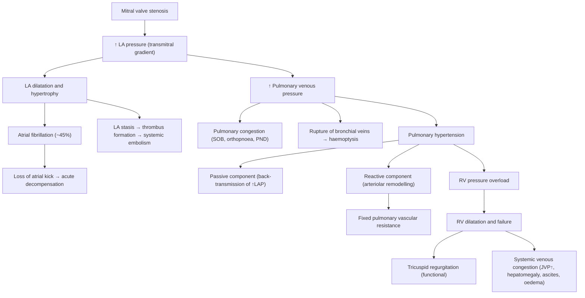
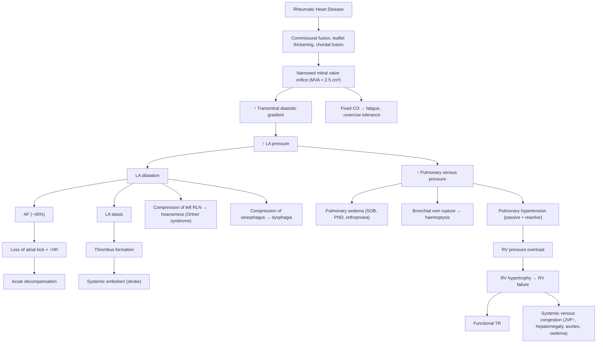

# Mitral Stenosis (MS)

## 1. Definition

Mitral stenosis (MS) is the pathological narrowing of the mitral valve orifice, resulting in obstruction to diastolic blood flow from the left atrium (LA) into the left ventricle (LV). The name itself is instructive: "mitral" refers to the mitral valve (named after the bishop's mitre hat it resembles), and "stenosis" (Greek: *stenos* = narrow) means narrowing.

The normal mitral valve area (MVA) is **4–6 cm²**. Symptoms typically begin when the valve area falls below **2.5 cm²**, and haemodynamically significant stenosis occurs at **< 1.5 cm²**. ***Critical mitral stenosis is defined as a valve area < 1.0 cm²*** [1][2].

<Callout title="Key Concept">
The fundamental problem in MS is a fixed, narrowed orifice between the LA and LV. This creates a diastolic pressure gradient across the valve. Everything that follows — LA dilation, atrial fibrillation, pulmonary hypertension, right heart failure — is a downstream consequence of this single obstruction.
</Callout>

---

## 2. Epidemiology

### Global Perspective
- MS is overwhelmingly caused by **rheumatic heart disease (RHD)**, accounting for ~95% of cases worldwide [2][3].
- RHD remains prevalent in developing nations (sub-Saharan Africa, South Asia, Southeast Asia, Pacific Islands) but has declined dramatically in developed countries due to improved sanitation, antibiotic treatment of Group A Streptococcal (GAS) pharyngitis, and better living standards.
- There is a **female predominance** (~2:1 F:M) in rheumatic MS, for reasons that are not entirely clear but may relate to autoimmune susceptibility.
- The latent period from acute rheumatic fever (ARF) to symptomatic MS is typically **20–40 years** in temperate climates, but can be as short as **5–10 years** in tropical/endemic regions [2].

### Hong Kong Context
- Hong Kong occupies an interesting epidemiological position. Historically, RHD was common. With modernisation, the incidence of acute rheumatic fever has fallen markedly, but a cohort of older patients (now aged 50–80+) who had rheumatic fever decades ago still presents with chronic rheumatic valvular disease.
- ***Degenerative mitral annular calcification (MAC)*** is becoming an increasingly important cause of MS in the elderly Hong Kong population, mirroring trends in other developed regions [1][3].
- Non-rheumatic causes (congenital, radiation-associated, SLE/RA, carcinoid) are rare but should be considered in the differential.

### Risk Factors for Developing MS
| Risk Factor | Mechanism |
|---|---|
| Previous acute rheumatic fever | Molecular mimicry → valvular inflammation → fibrosis and calcification |
| Recurrent GAS pharyngitis without adequate treatment | Each episode of ARF compounds valvular damage |
| Low socioeconomic status, overcrowding | Facilitates GAS transmission |
| Inadequate secondary prophylaxis (penicillin) | Allows recurrent ARF episodes |
| Advancing age (for degenerative MS) | Progressive mitral annular calcification |
| Female sex | 2:1 predominance |
| ***Radiation therapy (e.g. Hodgkin disease survivors)*** [2] | Radiation fibrosis of valve leaflets |

---

## 3. Anatomy and Function of the Mitral Valve

Understanding MS requires a solid grasp of the normal mitral valve apparatus, because the disease disrupts each component in a specific way.

### 3.1 Components of the Mitral Valve Apparatus

The mitral valve is a complex structure with **five functional components**:

1. **Mitral annulus** — the fibrous ring that forms the structural frame of the valve, sitting at the atrioventricular junction. It is saddle-shaped (not flat), which helps distribute mechanical stress.

2. **Two valve leaflets**:
   - **Anterior (aortic) leaflet** — larger, semi-circular, in fibrous continuity with the aortic valve (shares the intervalvular fibrosa with the left and non-coronary cusps of the aortic valve). Covers about 2/3 of the orifice area.
   - **Posterior (mural) leaflet** — smaller, crescent-shaped, has three scallops (P1, P2, P3). Covers about 1/3 of the orifice area.
   - The leaflets meet at the **anterolateral** and **posteromedial commissures**.

3. **Chordae tendineae** — fibrous cords that tether the free edges and undersurface of the leaflets to the papillary muscles. They prevent leaflet prolapse during systole.

4. **Papillary muscles** — two groups (anterolateral and posteromedial) arising from the LV free wall. Each papillary muscle sends chordae to **both** leaflets.

5. **Left atrial and left ventricular myocardium** — the contraction and relaxation of these chambers drives flow across the valve.

### 3.2 Normal Mitral Valve Function

- During **diastole**, the LV relaxes and LV pressure drops below LA pressure → mitral valve opens → blood flows passively from LA to LV (early rapid filling phase, producing S3 if exaggerated). Late in diastole, atrial contraction ("atrial kick") contributes ~15–25% of LV filling.
- During **systole**, the LV contracts → rising LV pressure closes the mitral valve leaflets (producing S1). The chordae and papillary muscles prevent the leaflets from prolapsing into the LA.
- The normal transvalvular gradient in diastole is **< 5 mmHg** (essentially negligible).

<Callout title="Why the Mitral Valve is Vulnerable to Rheumatic Disease">
The mitral valve is the valve most commonly affected by RHD (MV > AV > TV) [3]. This is likely because the left-sided valves operate under higher pressures and therefore sustain greater mechanical stress, making them more susceptible to immune-mediated inflammatory damage. The mitral valve in particular has a large surface area exposed to turbulent flow at the atrioventricular junction.
</Callout>

---

## 4. Aetiology

### 4.1 Rheumatic Heart Disease (95% of MS cases)

***Rheumatic heart disease is the most common cause of mitral stenosis*** [1][2][3].

**Pathogenesis of RHD** (explained from first principles):

1. **Group A β-haemolytic Streptococcus (GAS)** causes pharyngitis (strep throat).
2. The M protein on the GAS surface shares structural homology with cardiac proteins (cardiac myosin, valve glycoproteins, laminin).
3. ***Molecular mimicry***: the host immune system generates antibodies (anti-M protein) that cross-react with cardiac self-antigens [3].
4. This triggers an immune-mediated **pancarditis** (endocarditis, myocarditis, pericarditis) during acute rheumatic fever, occurring **2–6 weeks** after the pharyngeal infection [3].
5. The **endocarditis** component affects valve leaflets → small verrucae form along the line of closure → inflammation at the commissures.
6. With **recurrent episodes**, the valves undergo progressive:
   - **Commissural fusion** (the two commissures fuse together, narrowing the orifice)
   - **Leaflet thickening and fibrosis**
   - **Chordal thickening, shortening, and fusion**
   - **Calcification** (late stage)
7. The end result is a **"fish-mouth"** or **"buttonhole"** shaped stenotic valve.

***Valve involvement in RHD: MV > AV > TV*** [3]. The pulmonary valve is almost never affected.

<Callout title="Acute Rheumatic Fever — Jones Criteria" type="idea">
Diagnosis requires **2 major** OR **1 major + 2 minor** criteria PLUS evidence of recent GAS infection (↑ASOT, positive rapid antigen test, positive throat culture, or recent scarlet fever) [3]:

**Major criteria** (mnemonic: **J♥NES**):
- **J**oints (migratory polyarthritis — large joints)
- **♥** Carditis (pancarditis — Carey-Coombs murmur is the mid-diastolic murmur of acute valvulitis)
- **N**odules (subcutaneous, painless, over bony prominences)
- **E**rythema marginatum (evanescent, pink rings on trunk)
- **S**ydenham chorea (late manifestation, involuntary movements)

**Minor criteria**: fever, arthralgia, raised ESR/CRP, prolonged PR interval, previous RHD.
</Callout>

### 4.2 Non-Rheumatic Causes

| Aetiology | Notes |
|---|---|
| ***Degenerative mitral annular calcification (MAC)*** | Increasingly common in elderly; heavy calcification of the annulus extends onto the leaflet bases, restricting motion. Risk factors overlap with atherosclerosis (age, HTN, DM, CKD, hyperlipidaemia) [1][2] |
| ***Congenital MS*** | Rare; includes parachute mitral valve (single papillary muscle), supravalvular mitral ring; presents in infancy [2] |
| ***Radiation-associated*** | Classically in ***Hodgkin disease survivors*** receiving mediastinal radiation [2]; fibrosis of leaflets |
| Infective endocarditis (IE) | Large vegetations can mechanically obstruct the orifice [1] |
| ***SLE / RA*** | Inflammatory valvulitis; Libman-Sacks endocarditis in SLE (sterile vegetations on the atrial side of MV) [1][2] |
| ***Carcinoid valve disease*** | Carcinoid syndrome causes fibrotic plaque deposition on right-sided valves primarily, but can rarely affect left-sided valves if there is a right-to-left shunt or bronchial carcinoid [2] |
| ***Mucopolysaccharidoses*** | Rare storage disorders causing glycosaminoglycan deposition in valve tissue [2] |
| **Austin-Flint murmur** (functional MS) | Not a true MS — the regurgitant jet of severe aortic regurgitation impinges on the anterior mitral leaflet, causing functional obstruction and a mid-diastolic rumble at the apex [1] |

***When valve disease is not repairable... most mitral stenosis — no normal tissue to repair*** [4]. This is a critical surgical point: rheumatic MS distorts the valve so severely (fused commissures, thickened/calcified leaflets, shortened/fused chordae) that repair is rarely feasible, and replacement is usually required.

---

## 5. Pathophysiology

This is the most important section for understanding everything that follows. Every symptom, sign, investigation finding, and management decision flows from the pathophysiology.

### 5.1 The Core Problem: Obstruction to LV Inflow

In MS, the narrowed mitral valve creates ***obstruction to LV inflow*** [2]. Blood cannot flow freely from the LA into the LV during diastole. This establishes a **diastolic pressure gradient** across the mitral valve (transmitral gradient).

- Normally, mean LA pressure ≈ 5–10 mmHg, and the transmitral gradient is negligible.
- In MS, to maintain forward flow through a smaller orifice, ***LA pressure must rise***, creating a significant transmitral gradient [2].
- The Gorlin formula relates valve area, flow rate, and gradient:

$$\text{Valve Area} = \frac{\text{Flow}}{\text{Constant} \times \sqrt{\Delta P}}$$

This means: for a given valve area, if you increase flow (e.g. exercise, tachycardia), the pressure gradient rises proportionally. This is why patients decompensate during high-output states.

### 5.2 Upstream Consequences (LA → Pulmonary Vasculature → Right Heart)

The pathophysiology proceeds in a predictable upstream cascade:

Let me walk through each step:

#### Step 1: ***↑ LA Pressure with Establishment of Transmitral Gradient*** [2]

- The LA must generate higher pressure to push blood through the narrowed valve.
- Mean LA pressure rises from the normal ~8 mmHg to 20–30+ mmHg in severe MS.
- This gradient is **diastolic** — it exists throughout diastole and is maximal in early diastole (when the valve opens) and during atrial contraction (pre-systolic accentuation, if in sinus rhythm).

#### Step 2: ***LA Dilatation and Hypertrophy*** [2]

- Chronic pressure overload causes the LA to dilate (can become massively enlarged, sometimes the largest chamber in the heart).
- ***LA systole (atrial kick) becomes critically important for LV filling*** because the narrowed valve impedes passive early diastolic flow [2]. The atrial contraction generates a final "push" of blood across the stenotic valve.
- Consequence: anything that eliminates the atrial kick (i.e. AF) causes acute haemodynamic deterioration.

#### Step 3: Atrial Fibrillation (~45% of MS patients) [2]

- LA dilatation stretches atrial myocytes and disrupts electrical conduction → predisposes to AF.
- ***Occurrence of AF is associated with acute cardiac decompensation*** [2] because:
  1. Loss of atrial kick reduces LV filling by 15–25%.
  2. Rapid ventricular rate shortens diastolic filling time (this is critical — flow across a stenotic valve is time-dependent; less time = less flow = more congestion).
  3. Both effects simultaneously increase LA pressure and reduce cardiac output.

#### Step 4: LA Stasis and Thromboembolism

- The dilated, fibrillating LA has sluggish blood flow, especially in the **left atrial appendage (LAA)**.
- This creates ideal conditions for thrombus formation.
- ***Embolization***: fragments break off and travel to the systemic circulation → **stroke** (most feared), mesenteric ischaemia, limb ischaemia, renal infarction [2].
- This is why **anticoagulation** is essential in MS with AF.

#### Step 5: ***↑ Pulmonary Venous Pressure*** [2]

- Because the LA is in direct continuity with the pulmonary veins (no valves between them), elevated LA pressure is transmitted backwards into the pulmonary venous system.
- This causes **pulmonary venous congestion** → transudation of fluid into the interstitium and alveoli → **pulmonary oedema**.

#### Step 6: ***Pulmonary Hypertension (pHTN)*** [2]

pHTN in MS has **two components**:

1. **Passive component**: direct back-transmission of elevated LA pressure into the pulmonary vasculature. This is proportional to the degree of LA hypertension.
2. ***Reactive component***: chronic elevation of pulmonary venous pressure triggers ***reactive pulmonary arteriolar vasoconstriction and late vascular remodelling*** (medial hypertrophy, intimal fibrosis of pulmonary arterioles) [2]. This adds a **fixed, irreversible** component of pulmonary vascular resistance on top of the passive component.

- The reactive component is actually a "double-edged sword" — it initially "protects" the pulmonary capillaries from flooding by limiting flow, but it also imposes a massive afterload on the right ventricle.

<Callout title="Why Pulmonary Hypertension in MS Can Be Very Severe">
Unlike primary pulmonary hypertension (which only has the arteriolar component), MS-related pHTN has BOTH passive back-pressure AND reactive arteriolar changes. This is why pulmonary artery pressures in severe MS can exceed systemic pressures (PA systolic > 80 mmHg), and why prognosis is < 3 years once pHTN develops [2].
</Callout>

#### Step 7: ***Right Heart Failure*** [2]

- The RV is a thin-walled, compliant chamber designed for a low-pressure system.
- Chronic pressure overload from pHTN causes RV hypertrophy → eventually RV dilatation and failure.
- ***RV failure leads to systemic venous congestion***: elevated JVP, hepatomegaly, ascites, peripheral oedema [2].
- Functional **tricuspid regurgitation (TR)** develops as the RV dilates and the tricuspid annulus stretches.

### 5.3 Downstream Consequences (LV)

- In pure MS, the **LV is typically normal** or may even be underfilled (low preload).
- LVEF is usually preserved (the problem is getting blood INTO the LV, not pumping it OUT).
- However, in ~25% of cases, there is mild LV dysfunction due to:
  - Chronic underfilling
  - Rheumatic myocardial involvement
  - Reduced LV compliance from chronic underloading (disuse atrophy)
  - Interventricular septal bowing from RV pressure overload

### 5.4 Factors That Precipitate Decompensation

***Acute decompensation occurs with conditions that increase heart rate or cardiac output*** [2]:

Any condition that:
- **Increases heart rate** (shortens diastolic filling time through the stenotic valve):
  - Exercise, fever, anaemia, hyperthyroidism, pregnancy, AF, emotional stress
- **Increases transvalvular flow** (increases the gradient):
  - Pregnancy (↑blood volume by 40%), anaemia (compensatory ↑CO), hyperthyroidism
- **Eliminates atrial kick**:
  - New-onset AF

All of these increase the transmitral gradient and/or reduce LV filling → acute rise in LA pressure → flash pulmonary oedema.

<Callout title="The Pregnancy Problem in MS" type="error">
MS is the valvular lesion least well tolerated in pregnancy. Why? Because pregnancy increases blood volume by ~40%, increases heart rate, and increases cardiac output — all of which dramatically increase the transmitral gradient in a fixed stenotic valve. Women with moderate-to-severe MS may present for the first time with pulmonary oedema during pregnancy, typically in the second trimester when blood volume peaks.
</Callout>

---

## 6. Classification

### 6.1 By Severity (Echocardiographic — 2020/2021 ACC/AHA Guidelines)

| Parameter | Mild | Moderate | Severe |
|---|---|---|---|
| **Mitral valve area (MVA)** | > 1.5 cm² | 1.0–1.5 cm² | ***< 1.0 cm² (critical)*** [1][2] |
| **Mean transmitral gradient** | < 5 mmHg | 5–10 mmHg | > 10 mmHg |
| **PA systolic pressure** | < 30 mmHg | 30–50 mmHg | > 50 mmHg |
| **T½ (pressure half-time)** | < 150 ms | 150–220 ms | > 220 ms |

> Note: The pressure half-time (T½) is the time it takes for the peak transmitral gradient to fall to half its initial value. A longer T½ means slower emptying of the LA → more severe stenosis.

### 6.2 By Aetiology
- **Rheumatic** (by far the most common)
- **Degenerative** (mitral annular calcification)
- **Congenital**
- **Other** (radiation, inflammatory, carcinoid, etc.)

### 6.3 Wilkins Score (for PTMC eligibility)

The **Wilkins echocardiographic score** (also called the Massachusetts General Hospital score) grades mitral valve morphology on four parameters, each scored 1–4 (total score 0–16):

| Parameter | Score 1 (mild) | Score 4 (severe) |
|---|---|---|
| **Leaflet mobility** | Highly mobile, restricted only at tips | Immobile valve |
| **Leaflet thickening** | Near normal (4–5 mm) | Marked thickening (≥8–10 mm) |
| **Subvalvular thickening** | Minimal thickening just below leaflets | Extensive thickening extending to papillary muscles |
| **Calcification** | Single bright echo area | Extensive calcification throughout leaflets |

- **Score ≤ 8**: favourable morphology for ***percutaneous transvenous mitral commissurotomy (PTMC)*** [1]
- **Score > 8**: unfavourable; consider surgical intervention

---

## 7. Clinical Features

### 7.1 Clinical Course

***The clinical course of MS is insidious*** [2]:

- After the initial rheumatic fever episode, there is a **long latent period** (20–40 years in temperate regions, shorter in tropical regions) during which the valve progressively stenoses.
- ***10-year survival > 80% if asymptomatic*** [2].
- ***10-year survival becomes ~10% once symptomatic, and < 3 years if pulmonary hypertension develops*** [2].
- ***Early disease***: ***insidious onset of SOB and ↓exercise tolerance*** [2]. Patients often unconsciously limit their activity, so they may not report symptoms until directly questioned.
- ***Acute decompensation*** can be the first presentation, triggered by conditions that ***↑HR and ↑CO (fever, anaemia, hyperthyroidism, pregnancy, AF, exercise)*** [2] because these shorten diastolic filling time and increase the transvalvular gradient.
- ***Late disease***: ***SOB at rest, orthopnoea, PND, right heart failure with systemic oedema*** [2]. ***Gross LA enlargement*** can cause ***compression of the recurrent laryngeal nerve (hoarseness — Ortner syndrome) and oesophagus (dysphagia)*** [2].

### 7.2 Symptoms (with Pathophysiological Basis)

| Symptom | Pathophysiological Mechanism |
|---|---|
| ***Dyspnoea on exertion (most common presenting symptom)*** | ↑HR during exercise → ↓diastolic filling time → ↑transmitral gradient → ↑LA pressure → ↑pulmonary venous pressure → pulmonary congestion → stimulates J receptors in pulmonary interstitium → sensation of breathlessness [2] |
| ***Orthopnoea*** | Supine position → redistribution of blood from lower extremities to pulmonary vasculature (↑preload) → ↑pulmonary venous pressure → ↑pulmonary congestion [2] |
| ***Paroxysmal nocturnal dyspnoea (PND)*** | Same redistribution mechanism as orthopnoea, but delayed onset (1–2 hours after lying flat). Fluid gradually reabsorbed from peripheral oedema into intravascular space during recumbency → acute increase in pulmonary congestion awakens patient [2] |
| ***Cough*** | Pulmonary congestion irritates airway receptors → reflex cough [2] |
| ***Haemoptysis*** | ***Due to rupture of bronchial veins into the lung*** [1][2]. The bronchial veins drain into the pulmonary veins. When pulmonary venous pressure is chronically elevated, these thin-walled bronchial veins become engorged and can rupture, causing haemoptysis. Can also occur from frank pulmonary oedema (pink frothy sputum) or pulmonary infarction (if thromboembolism) |
| ***Palpitations*** | AF is very common (~45%) due to LA dilatation → irregular, often rapid ventricular response → patient perceives palpitations [1][2] |
| ***Decreased exercise tolerance (↓ET)*** | Fixed cardiac output — the stenotic valve limits the ability to increase CO during exercise → fatigue, weakness [1][2] |
| ***Hoarseness of voice (Ortner syndrome)*** | ***Enlarged LA compresses the left recurrent laryngeal nerve (RLN)*** [1][2]. The left RLN loops under the aortic arch and passes between the aorta and the pulmonary artery, directly adjacent to the LA. A massively dilated LA can compress it, causing left vocal cord paralysis and hoarseness |
| ***Dysphagia*** | Massive LA enlargement can compress the oesophagus posteriorly [2] |
| ***Systemic embolism (stroke, limb ischaemia)*** | LA stasis (from dilatation ± AF) → thrombus formation (especially in LAA) → embolisation to cerebral, mesenteric, renal, or peripheral arteries [2] |
| ***Right heart failure symptoms*** (peripheral oedema, abdominal distension, early satiety) | ***RV failure secondary to chronic pulmonary hypertension*** → systemic venous congestion → hepatic congestion (hepatomegaly, ascites), peripheral oedema [2] |
| ***Fatigue and weakness*** | Low forward cardiac output due to fixed obstruction at the mitral valve |
| ***Chest pain*** | Uncommon; may occur due to RV ischaemia from severe pHTN (RV demand-supply mismatch) |

<Callout title="Ortner Syndrome" type="idea">
***Ortner's syndrome: LA enlargement → compression of left RLN → hoarseness of voice*** [1][2]. Remember this as a classic association with MS. The left RLN is vulnerable because of its long intrathoracic course, looping under the aortic arch and passing close to the LA and pulmonary artery. Any structure enlargement in this region (LA, pulmonary artery, aorta) can compress it.
</Callout>

### 7.3 Signs (with Pathophysiological Basis)

#### General Inspection
| Sign | Mechanism |
|---|---|
| **Mitral facies** (malar flush) | Cyanotic, plethoric cheeks with a bluish-red discolouration. Due to chronic low cardiac output → peripheral vasoconstriction and ↑deoxyhaemoglobin in the cutaneous capillary bed + chronic CO₂ retention from pulmonary congestion. Classic but uncommon in modern practice |
| **Peripheral oedema** | Right heart failure → systemic venous congestion → ↑hydrostatic pressure in peripheral capillaries → oedema |
| **Raised JVP** | Right heart failure. May have prominent 'a' wave (if pHTN and RV hypertrophy) or 'cv' wave (if functional TR) |

#### Pulse
| Sign | Mechanism |
|---|---|
| ***Irregularly irregular pulse (AF)*** | LA dilatation → AF in ~45% of patients [2]. In early MS, may still be in sinus rhythm |
| **Low-volume pulse** | Low forward cardiac output through the fixed stenotic valve |
| ***Narrow pulse pressure*** [1] | Low stroke volume → ↓systolic pressure. The fixed obstruction limits forward flow → ↓pulse pressure |

#### Precordial Palpation
| Sign | Mechanism |
|---|---|
| **Apex beat: tapping** (palpable S1) | In mild-moderate MS with a still-mobile valve, the forceful closure of the thickened but mobile mitral valve produces a palpable S1 ("tapping apex"). This is NOT a displaced or heaving apex — the LV is normal size or small |
| **Apex is NOT displaced** | In pure MS, the LV is normal size (underfilled if anything). A displaced apex suggests concomitant MR, AR, or LV dysfunction |
| **Left parasternal heave** | RV hypertrophy from pulmonary hypertension → sustained lift at the left sternal edge |
| **Palpable P2** | Severe pHTN → forceful closure of the pulmonary valve → palpable at the left 2nd intercostal space |
| **Diastolic thrill at apex** | Palpable vibration corresponding to the diastolic murmur, felt in the left lateral decubitus position with the bell of the stethoscope |

#### Auscultation

This is the highest-yield section for clinical exams.

| Sign | Mechanism |
|---|---|
| **Loud S1** | In ***mild-moderate MS***, the valve leaflets are still mobile but their excursion is prolonged — at the onset of ventricular systole, the leaflets are still wide open (because the LA has been pushing blood through the narrowed orifice throughout diastole), so they travel a greater distance to close → louder snap. As MS becomes severe and the valve calcifies, S1 becomes ***soft*** because the leaflets lose mobility [5] |
| ***Opening snap (OS)*** | ***Occurs in early diastole*** when the thickened but still mobile mitral valve is forced open by the high LA pressure [1][2]. It is a brief, high-pitched sound heard best at the apex and left lower sternal border. ***The shorter the S2-OS interval, the more severe the MS*** (because higher LA pressure forces the valve open sooner) [2]. The OS disappears when the valve becomes heavily calcified and immobile |
| ***Low-pitched mid-diastolic rumbling murmur*** | The hallmark of MS. As blood flows through the narrowed valve orifice during diastole, turbulent flow produces a low-frequency rumble. Best heard at the ***apex*** with the ***bell*** of the stethoscope, in the ***left lateral decubitus position***. Duration correlates with severity — ***a longer murmur suggests more severe stenosis*** [1] |
| ***Pre-systolic accentuation*** | If in sinus rhythm, atrial contraction at the end of diastole generates a final surge of blood through the stenotic valve → the murmur crescendos just before S1. This is ***absent in AF*** (because there is no organised atrial contraction) |
| ***Loud P2*** | Forceful closure of the pulmonary valve due to ***pulmonary hypertension*** [1] |
| ***Graham Steell murmur*** | ***An early diastolic decrescendo murmur of pulmonary regurgitation (PR)*** due to severe pulmonary hypertension → dilatation of the pulmonary valve ring [1][2]. Best heard at the left 2nd–3rd intercostal space. It indicates severe, long-standing pHTN |
| ***Signs of pulmonary congestion*** | Bilateral basal lung crepitations from pulmonary oedema [1] |
| ***Signs of pulmonary hypertension*** | Loud P2, right parasternal heave, functional TR (pansystolic murmur at LLSB louder on inspiration — Carvallo's sign), raised JVP with prominent 'a' wave [1] |

<Callout title="High-Yield Auscultation Summary for MS">

The classic auscultatory findings in MS are:
1. **Loud S1** (mobile valve) → becomes soft when calcified
2. **Opening snap** (mobile valve opening under high LA pressure) → disappears when calcified
3. **Low-pitched mid-diastolic rumbling murmur** at the apex, best with bell in left lateral decubitus
4. **Pre-systolic accentuation** (if in sinus rhythm)

**Severity indicators**:
- Shorter S2-OS interval = more severe (higher LA pressure opens valve sooner)
- Longer murmur duration = more severe
- Presence of Graham Steell murmur and loud P2 = severe pHTN
- Soft S1 and absent OS = heavily calcified valve = severe MS but poor candidate for PTMC
</Callout>

<Callout title="Common Exam Mistake: S1 in MS" type="error">
Students often state "S1 is loud in MS" without qualification. S1 is loud in MILD to MODERATE MS when the valve is still mobile. In SEVERE MS with a heavily calcified, immobile valve, S1 becomes SOFT. The same applies to the opening snap — it is present only when the valve retains some mobility and DISAPPEARS with severe calcification [5]. An examiner will test whether you know this distinction.
</Callout>

#### Summary of Signs by Severity

| Feature | Mild–Moderate MS | Severe MS |
|---|---|---|
| S1 | Loud | Soft (calcified) |
| Opening snap | Present; long S2-OS interval | Present but may disappear; ***short S2-OS interval*** |
| Murmur duration | Short | ***Long*** |
| Pre-systolic accentuation | Present (if sinus rhythm) | Present (if sinus rhythm) |
| Loud P2 | Absent | ***Present*** |
| Graham Steell murmur | Absent | ***Present*** |
| Parasternal heave | Absent | ***Present*** |
| Right heart failure signs | Absent | ***Present*** |

---

## 8. Important Terminologies Related to Mitral Stenosis

| Term | Definition | Significance |
|---|---|---|
| ***Ortner's syndrome*** | ***LA enlargement → compression of left RLN → hoarseness of voice*** [1][2] | Indicates massive LA dilatation |
| ***Graham Steell murmur*** | ***PR murmur associated with loud P2, indicating severe MS*** [1] | Indicates severe pHTN |
| ***Austin-Flint murmur*** | ***AR jet impinging on anterior mitral valve leaflet → functional MS*** [1] | A mimic of MS; no opening snap, S1 is normal/soft |
| ***Carey-Coombs murmur*** | Mid-diastolic murmur heard during acute rheumatic valvulitis | Transient; due to acute valvular inflammation, not structural stenosis |
| ***Carvallo's sign*** | ***TR = pansystolic murmur louder on inspiration*** [1] | Distinguishes TR from MR |
| P mitrale | ***Broad, bifid (notched) P wave in lead II (> 0.12s)*** on ECG | Indicates LA enlargement (hypertrophy/dilatation) |

---

## 9. Summary of Pathophysiological Connections

Let me tie everything together in a single comprehensive flowchart:

---

<Callout title="High Yield Summary">

**Definition**: Narrowing of the mitral valve orifice → obstruction to LV inflow in diastole. Critical MS: MVA < 1.0 cm².

**Aetiology**: ***Rheumatic heart disease (95%)***. Others: degenerative MAC, congenital, radiation (Hodgkin survivors), SLE, carcinoid.

**Pathophysiology cascade**: Stenotic MV → ↑transmitral gradient → ↑LA pressure → LA dilatation → AF (45%) + thromboembolism → ↑pulmonary venous pressure → pulmonary congestion + pHTN (passive + reactive) → RV failure → systemic venous congestion.

**Decompensation triggers**: Anything that ↑HR (shortens diastolic filling time) or ↑CO: exercise, fever, anaemia, pregnancy, hyperthyroidism, AF.

**Key symptoms**: Dyspnoea (most common), palpitations (AF), haemoptysis (bronchial vein rupture), hoarseness (Ortner syndrome), systemic embolism (stroke).

**Key signs**: Loud S1 (mild/mod) → soft S1 (severe/calcified). Opening snap (shorter S2-OS = more severe). Low-pitched mid-diastolic rumble at apex (bell, left lateral decubitus). Pre-systolic accentuation (if sinus rhythm). Loud P2 + Graham Steell murmur (severe pHTN). Narrow pulse pressure.

**Surgical pearl**: ***Most mitral stenosis cannot be repaired — no normal tissue to repair → valve replacement usually needed*** [4].

**LV in MS**: Typically normal size and function (the problem is upstream). Apex is NOT displaced.
</Callout>

---

<ActiveRecallQuiz
  title="Active Recall - Mitral Stenosis (Definition to Clinical Features)"
  items={[
    {
      question: "What is the most common cause of mitral stenosis worldwide, and what is the pathogenic mechanism?",
      markscheme: "Rheumatic heart disease (95%). Mechanism: molecular mimicry — antibodies against Group A Strep M protein cross-react with cardiac valve proteins → pancarditis → commissural fusion, leaflet thickening, chordal fusion/shortening, calcification → narrowed valve orifice."
    },
    {
      question: "Explain why the onset of atrial fibrillation causes acute decompensation in a patient with mitral stenosis.",
      markscheme: "Two mechanisms: (1) Loss of atrial kick reduces LV filling by 15-25% — atrial contraction is critical in MS because it provides the final push across the narrowed valve. (2) Rapid ventricular rate shortens diastolic filling time, which is the only time blood can flow across the mitral valve. Both together cause acute rise in LA pressure → flash pulmonary oedema."
    },
    {
      question: "Describe the two components of pulmonary hypertension in mitral stenosis.",
      markscheme: "Passive component: direct back-transmission of elevated LA pressure into pulmonary vasculature. Reactive component: chronic elevated pulmonary venous pressure triggers arteriolar vasoconstriction and late vascular remodelling (medial hypertrophy, intimal fibrosis) causing fixed, irreversible increase in pulmonary vascular resistance."
    },
    {
      question: "Why does S1 become soft in severe mitral stenosis, and what happens to the opening snap?",
      markscheme: "In severe MS, the valve leaflets become heavily calcified and immobile. S1 is loud when leaflets are mobile and snap shut from a wide-open position. Calcified leaflets cannot move far → soft S1. Similarly, the opening snap requires a mobile valve — it disappears with heavy calcification. Important: soft S1 and absent OS in MS = severely calcified valve = contraindication for PTMC."
    },
    {
      question: "What is Ortner syndrome and what is its anatomical basis in mitral stenosis?",
      markscheme: "Ortner syndrome is hoarseness of voice caused by compression of the left recurrent laryngeal nerve by a massively enlarged LA. The left RLN loops under the aortic arch and passes between the aorta and pulmonary artery, directly adjacent to the LA. Massive LA dilatation compresses the nerve → left vocal cord paralysis → hoarseness."
    },
    {
      question: "Why is mitral stenosis the valvular lesion worst tolerated in pregnancy?",
      markscheme: "Pregnancy increases blood volume by ~40%, heart rate, and cardiac output. In MS, these all increase the transmitral gradient across a fixed stenotic orifice. The valve area cannot accommodate the increased flow demand → acute rise in LA pressure → pulmonary oedema. Presentation typically in second trimester when blood volume peaks."
    }
  ]}
/>

---

## References

[1] Senior notes: Maksim Medicine Notes.pdf (Cardiology section, pp. 35–38)
[2] Senior notes: Ryan Ho Cardiology.pdf (pp. 152–155, Mitral Valve Diseases)
[3] Senior notes: Maksim Medicine Notes.pdf (Rheumatic Heart Disease, p. 38)
[4] Lecture slides: Cardiac Surgery Tutorial_Prof. D Chan.pdf (p. 56 — "Most mitral stenosis — no normal tissue to repair")
[5] Senior notes: Ryan Ho Fundamentals.pdf (pp. 31, 39 — Heart sounds and murmurs)
