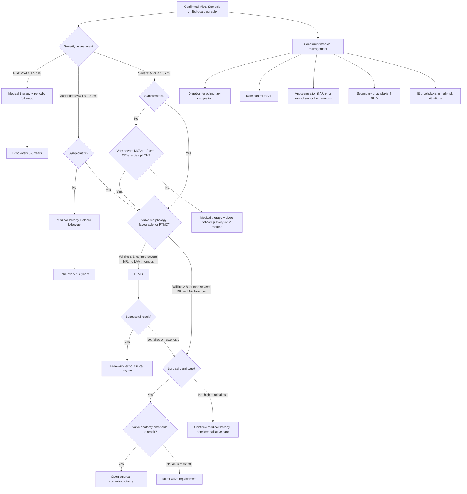

## Management of Mitral Stenosis

### Management Principles

Let me start with the overarching philosophy, because it frames everything:

***There is no medication that can fix a stenotic mitral valve*** [6]. No drug will prise open fused commissures or dissolve calcified leaflets. Medical therapy is purely **palliative** — it manages the *consequences* of MS (pulmonary congestion, AF, thromboembolism) while the patient awaits definitive intervention or if they are not candidates for it.

***The indication for surgery is: severe valve problem with symptoms OR ventricular dysfunction*** [6]. This is the universal principle for all valvular heart disease.

The management approach therefore has three tiers:
1. **Medical therapy** — symptom control and complication prevention
2. **Percutaneous intervention** — PTMC/PMBV for suitable candidates
3. **Surgical intervention** — commissurotomy or valve replacement when percutaneous options are not feasible

---

### Management Algorithm

---

### 1. Medical Therapy

Medical therapy does NOT alter the natural history of MS. It manages symptoms and complications while you plan for definitive intervention.

#### 1.1 Diuretics for Pulmonary Congestion

| Drug | Mechanism | Rationale in MS |
|---|---|---|
| **Loop diuretics (furosemide/frusemide)** | Inhibit Na⁺/K⁺/2Cl⁻ co-transporter in thick ascending limb of loop of Henle → ↑urinary Na⁺ and water excretion → ↓intravascular volume → ↓preload | By reducing intravascular volume, you reduce LA filling pressure → reduce pulmonary venous congestion → relieve dyspnoea, orthopnoea, and PND. Caution: excessive diuresis can ↓preload too much → the already underfilled LV gets even less blood → ↓CO → hypotension |
| **Thiazide diuretics** | Inhibit Na⁺/Cl⁻ co-transporter in distal convoluted tubule | Adjunctive to loop diuretics for diuretic resistance |
| **Aldosterone antagonists (spironolactone)** | Block mineralocorticoid receptors in collecting duct → ↓Na⁺ reabsorption and ↓K⁺ excretion | Potassium-sparing effect helpful when using loop diuretics. Also counteracts secondary hyperaldosteronism from low CO state |

<Callout title="Caution with Diuretics in MS" type="error">
In MS, unlike in heart failure from LV systolic dysfunction, excessive preload reduction is dangerous. The stenotic valve requires a certain minimum LA pressure to maintain forward flow. Over-diuresis → ↓LA filling → ↓transmitral flow → ↓LV filling → ↓CO → hypotension and syncope. Use the lowest effective dose.
</Callout>

#### 1.2 Rate Control for Atrial Fibrillation

***AF: rate control*** [1]. Controlling the ventricular rate is one of the most impactful medical interventions in MS with AF. Here's why:

- In MS, forward flow across the valve depends on **diastolic filling time**. The faster the heart rate, the shorter diastole becomes. At a heart rate of 150 bpm, diastole may be only 0.15 seconds — far too short for adequate emptying of the LA across a stenotic valve.
- Slowing the heart rate prolongs diastole → more time for blood to flow across the narrowed valve → ↓LA pressure → ↓pulmonary congestion.

| Drug | Mechanism | Notes |
|---|---|---|
| **Beta-blockers (e.g. metoprolol, bisoprolol)** | Block β₁-adrenergic receptors at the SA and AV node → ↓HR, ↓AV conduction | First-line for rate control. Also blunt the HR response to exercise, preventing exercise-induced tachycardia and decompensation. Caution in decompensated HF |
| **Non-dihydropyridine CCBs (diltiazem, verapamil)** | Block L-type Ca²⁺ channels at SA and AV node → ↓HR, ↓AV conduction | Alternative to beta-blockers. Avoid in decompensated heart failure (negative inotropy) |
| **Digoxin** | Enhances vagal tone → ↓AV node conduction → ↓ventricular rate. Also mild positive inotropy | Useful as add-on when beta-blocker or CCB alone is insufficient. Controls resting HR well but less effective during exercise. Narrow therapeutic index — monitor levels (0.5–1.0 ng/mL). Risk of toxicity with hypokalaemia (from diuretics) |

> **Rate vs Rhythm control in MS with AF?** In MS, rhythm control (cardioversion to sinus rhythm) is theoretically attractive because restoring sinus rhythm restores the atrial kick, which is very important for LV filling across a stenotic valve. However, in practice, AF tends to recur in MS because the LA remains dilated (the substrate persists). Rhythm control may be attempted with amiodarone or electrical cardioversion, especially if AF is new-onset and the LA is not massively dilated. Long-term, most patients with chronic MS and AF end up on rate control + anticoagulation.

#### 1.3 Anticoagulation

***AF: anticoagulation*** [1][2].

This is critically important. MS with AF carries one of the highest risks of thromboembolism of any cardiac condition.

| Indication for Anticoagulation | Rationale |
|---|---|
| ***MS with any AF*** (paroxysmal, persistent, or permanent) | AF → loss of organised atrial contraction → stasis in the dilated LA → thrombus formation → systemic embolisation (stroke, mesenteric ischaemia, limb ischaemia) [2] |
| ***MS with prior systemic embolism*** | Already demonstrated tendency to embolise; high recurrence risk |
| ***MS with LA thrombus*** | Direct evidence of thrombus — highest risk |
| **MS in sinus rhythm with large LA (> 55 mm) or spontaneous echo contrast ("smoke")** | Stasis despite sinus rhythm → thrombogenic milieu |

**Drug of choice: WARFARIN** (target INR 2.0–3.0)

<Callout title="Why Warfarin and NOT a DOAC?">
This is a crucial point that examiners love. MS (particularly rheumatic MS) with AF is one of the few indications where **warfarin remains the drug of choice** over DOACs (direct oral anticoagulants like rivaroxaban, apixaban, dabigatran). The RE-ALIGN trial demonstrated that dabigatran was inferior to warfarin in patients with mechanical heart valves (more thromboembolic events and bleeding). Current guidelines (2020/2021 ACC/AHA, 2024 ESC) classify MS with AF as "valvular AF" — a category for which DOACs are NOT recommended. Warfarin is the standard [2].
</Callout>

#### 1.4 Secondary Prophylaxis for Rheumatic Heart Disease

Since RHD is the cause in 95% of cases, preventing recurrent rheumatic fever episodes is essential — each episode worsens valve damage.

| Regimen | Details |
|---|---|
| **IM benzathine penicillin G** | ***1.2 million units IM every 4 weeks*** [3]. This is the mainstay of secondary prophylaxis |
| **Duration** | ***Until age 21 years OR for 5 years after the last episode, whichever is LONGER*** [3]. If there is carditis with residual valve disease, prophylaxis should continue for at least 10 years or until age 40 (some guidelines say lifelong if severe valve disease) |
| **Penicillin-allergic patients** | Erythromycin 250 mg BD |

#### 1.5 Infective Endocarditis Prophylaxis

- Routine antibiotic prophylaxis is **NOT** recommended for native valve MS [3].
- Prophylaxis is indicated only for **high-risk groups** (prosthetic valves, previous IE, unrepaired cyanotic CHD) undergoing **dental procedures** [3].
- If the patient has had a mitral valve replacement, they fall into the high-risk category → prophylaxis required.

#### 1.6 Treatment of Precipitating Factors

Remember, acute decompensation of MS is often precipitated by reversible factors:

| Factor | Management |
|---|---|
| **AF with rapid ventricular response** | Rate control as above |
| **Infection/fever** | Appropriate antimicrobials, antipyretics (fever ↑HR → ↑transmitral gradient) |
| **Anaemia** | Transfusion or iron supplementation (anaemia → ↑CO to compensate → ↑gradient) |
| **Hyperthyroidism** | Antithyroid drugs (hyperthyroidism → ↑HR + ↑CO → decompensation) |
| **Pregnancy** | Careful haemodynamic management; beta-blocker for rate control; diuretics cautiously; PTMC can be performed during pregnancy if severe MS decompensates |

---

### 2. Interventional Therapy

#### 2.1 ***Percutaneous Transvenous Mitral Commissurotomy (PTMC)*** / ***Percutaneous Mitral Balloon Valvuloplasty (PMBV)*** [1][2]

These terms are used interchangeably. The name tells you the procedure: "percutaneous" = through the skin (no open surgery), "transvenous" = via the venous system, "mitral" = mitral valve, "commissurotomy" = splitting open the fused commissures.

**Procedure**: A balloon catheter (usually the Inoue balloon) is advanced via the femoral vein → inferior vena cava → right atrium → ***transseptal puncture through the interatrial septum*** → left atrium → across the stenotic mitral valve. The balloon is inflated to split the fused commissures, increasing the effective valve area [2].

##### Indications for PTMC [2]

| Indication | Details |
|---|---|
| ***Symptomatic severe MS (MVA ≤ 1.5 cm²)*** | The primary indication. Patient has symptoms (NYHA ≥ II) attributable to MS AND valve morphology is favourable [2] |
| ***Asymptomatic very severe MS (MVA ≤ 1.0 cm²)*** | Even without symptoms, the risk of decompensation is high enough to warrant intervention [2] |
| Symptomatic MS with pHTN | PA systolic pressure > 50 mmHg at rest or > 60 mmHg with exercise |
| MS with new-onset AF | AF is a sign of advancing disease and is associated with acute decompensation |

##### Prerequisites for PTMC [1][2]

All THREE must be met:

| Prerequisite | Rationale |
|---|---|
| ***Favourable valve morphology (Wilkins score ≤ 8)*** [2] | Higher scores indicate immobile, thickened, calcified valves with subvalvular disease → poor commissural splitting, higher risk of iatrogenic MR |
| ***No moderate-to-severe MR*** [1] | The balloon inflation can worsen MR by tearing a leaflet or further disrupting the subvalvular apparatus. Starting with significant MR makes this risk unacceptable |
| ***No LAA thrombus*** [1] | The catheter passes through the LA. A pre-existing LAA thrombus could be dislodged during the procedure → stroke or systemic embolism. ***Must be excluded by TOE pre-procedurally*** |

##### ***Contraindications for PTMC*** [1]

| Contraindication | Reason |
|---|---|
| ***Moderate-to-severe MR*** [1] | Risk of worsening MR to catastrophic levels |
| ***LAA thrombus*** [1] | Risk of procedural embolism |
| ***Calcified valve (Wilkins > 8)*** [1] | Poor result expected; high risk of complications; ***no normal tissue to work with*** [4] |
| **Concomitant severe AS or severe AR** | Need surgical approach to address multiple valve lesions |
| **Severe bicommissural calcification** | Even with Wilkins ≤ 8, if both commissures are heavily calcified, commissural splitting is unlikely |

##### Complications of PTMC [2]

| Complication | Incidence | Mechanism |
|---|---|---|
| ***Residual ASD (iatrogenic)*** | ***~5%*** [2] | The transseptal puncture creates a hole in the interatrial septum. Usually small and closes spontaneously. Haemodynamically significant ASDs are rare |
| ***Periprocedural embolism*** | ~1–2% [2] | Despite TOE screening, small thrombi may be dislodged. Also risk of air embolism |
| ***Iatrogenic MR*** | ~2–10% [2] | Balloon inflation can tear a leaflet, rupture chordae, or split the valve asymmetrically → MR. Severe MR may require emergent surgery |
| **Cardiac tamponade** | < 1% | Perforation during transseptal puncture or by the catheter/balloon |
| **Restenosis** | 10–20% at 10 years | Gradual re-fusion of commissures, especially in rheumatic disease |

##### Outcomes

- **Immediate success rate**: 85–95% (increase in MVA by ≥50% to > 1.5 cm²)
- **Long-term results**: 10-year freedom from restenosis or need for surgery ~50–70% with favourable morphology
- **Compared to open commissurotomy**: similar haemodynamic results with lower morbidity and shorter recovery

#### 2.2 Surgical Options

***When valve disease is not repairable... most mitral stenosis — no normal tissue to repair*** [4]. This is the fundamental surgical reality of MS: rheumatic disease destroys the valve so completely that repair is rarely possible. This contrasts with MR, where repair is often preferred over replacement.

##### 2.2.1 Open Surgical Commissurotomy [1]

| Aspect | Details |
|---|---|
| **Procedure** | Open-heart surgery via ***median sternotomy*** on cardiopulmonary bypass. The surgeon directly visualises the mitral valve and uses a scalpel to incise the fused commissures under direct vision. Can also resect subvalvular adhesions and debulk calcium |
| **Indication** | Severe symptomatic MS not suitable for PTMC (e.g. failed PTMC, borderline morphology where an experienced surgeon feels repair is possible, or when concomitant procedures are needed) [2]. Also for ***non-rheumatic (calcific, congenital) MS where repair may still be possible*** [2] |
| **Advantage over PTMC** | Direct visualisation → can address subvalvular disease, remove calcium, excise LAA (reducing thromboembolic risk) |
| **Disadvantage** | Requires open-heart surgery with sternotomy, cardiopulmonary bypass, and the associated risks |

##### 2.2.2 ***Mitral Valve Replacement (MVR)*** [1]

This is the definitive treatment for most cases of severe MS when PTMC is not feasible.

**Procedure**: The diseased native mitral valve is excised (including leaflets, chordae, and sometimes papillary muscle tips) and replaced with a prosthetic valve.

| Aspect | Mechanical Valve | Bioprosthetic Valve |
|---|---|---|
| **Material** | Pyrolytic carbon (e.g. St Jude, On-X) | Porcine valve or bovine pericardial tissue (e.g. Carpentier-Edwards, Hancock) |
| **Durability** | 20–30+ years (essentially lifelong) | 10–20 years (structural deterioration over time — earlier in younger patients due to more active immune system and higher cardiac output) |
| **Anticoagulation** | ***Lifelong warfarin required*** (target INR 2.5–3.5 for mitral position) | Only warfarin for 3–6 months post-op, then aspirin alone (unless other indication for anticoagulation, e.g. AF) |
| **Preferred in** | Younger patients (< 50–65 years) who can tolerate lifelong anticoagulation and want to avoid reoperation | Older patients (> 65–70 years), patients with contraindications to anticoagulation, women planning pregnancy (warfarin is teratogenic) |
| **Risks** | Thromboembolism if INR subtherapeutic, bleeding if INR supratherapeutic, mechanical haemolysis, pannus formation | Structural valve deterioration → need for redo surgery, but lower thromboembolic risk |

***The choice of type of prosthetic heart valve should be a shared decision-making process that accounts for the patient's values and preferences and includes discussion of the indications for and risks of anticoagulant therapy and the potential need for and risk associated with reintervention*** [6].

##### Indications for MVR [1]

***Indicated for valvular replacement*** [1]:

| Indication | Rationale |
|---|---|
| ***Pulmonary hypertension*** [1] | sPAP > 50 mmHg indicates haemodynamically significant MS with downstream consequences |
| ***Pulmonary congestion*** [1] | Persistent symptoms despite medical therapy |
| ***Haemoptysis*** [1] | Ruptured bronchial veins from pulmonary venous congestion — risk of massive haemoptysis |
| ***Recurrent embolic events despite anticoagulation*** [1] | If a patient on therapeutic warfarin still has embolic events, the valve must be addressed |
| Severe symptomatic MS not suitable for PTMC | When valve morphology precludes PTMC (Wilkins > 8, severe calcification, significant MR) [2] |
| Previously failed PTMC [2] | Restenosis or inadequate result after PTMC |
| Concomitant cardiothoracic surgery [2] | If the patient needs CABG or other valve surgery, MVR can be performed at the same operation |

##### Surgical Approach and Outcomes [2]

| Aspect | Details |
|---|---|
| ***Approach*** | ***Median sternotomy (majority)*** or ***robotic-assisted minimally invasive (available at QMH)*** [2] |
| **Sternotomy considerations** | ***Takes ~10 weeks for bone to heal → no weight-bearing exercise during this period. Larger wound, risk of sternal wound infection*** [2] |
| ***Operative mortality*** | ***1–5%*** [2] |
| ***Morbidity*** | ***~5%*** [2] |
| **Recovery** | ***Progressive ↓symptoms and ↑heart function over 3 months after OT*** [2] |
| ***Complications*** | ***General: CVA, severe infection, bleeding, multi-organ failure*** [2]. ***Specific: heart block, heart failure, perioperative MI*** [2] |

<Callout title="Mechanical vs Bioprosthetic — The Key Trade-Off" type="idea">
The decision comes down to **durability vs anticoagulation burden**:
- **Mechanical valve**: lasts forever but requires lifelong warfarin with its attendant bleeding risks, dietary restrictions, drug interactions, and need for regular INR monitoring. Choose for younger patients who can manage anticoagulation.
- **Bioprosthetic valve**: avoids long-term warfarin but will eventually degenerate and require reoperation. Choose for older patients (lower lifetime risk of needing reoperation) or those who cannot tolerate anticoagulation.
- ***Shared decision-making*** between patient and surgeon is emphasised in current guidelines [6].
</Callout>

---

### 3. Management of Specific Scenarios

#### 3.1 Acute Decompensation (Flash Pulmonary Oedema)

This is a medical emergency. The patient presents acutely with severe dyspnoea, orthopnoea, pink frothy sputum, tachycardia, and hypoxia.

| Step | Action | Rationale |
|---|---|---|
| 1 | **Sit patient upright** | ↓Venous return to lungs (↓preload) |
| 2 | **High-flow O₂** | Correct hypoxia from pulmonary oedema |
| 3 | **IV furosemide** | ↓Intravascular volume → ↓LA pressure → ↓pulmonary congestion [8] |
| 4 | **IV nitrate (GTN infusion)** | Venodilation → ↓preload → ↓pulmonary venous pressure. Caution: avoid excessive hypotension [8] |
| 5 | **Rate control if AF with rapid ventricular response** | Slow HR → prolong diastole → ↓transmitral gradient. IV digoxin, diltiazem, or beta-blocker [9] |
| 6 | **Treat precipitant** | Identify and treat: infection, anaemia, hyperthyroidism, non-compliance with medications |
| 7 | **Non-invasive ventilation (CPAP/BiPAP)** if needed | ↑Intrathoracic pressure → ↓preload + ↑oxygenation [8] |
| 8 | **Urgent PTMC** if refractory | If patient cannot be stabilised medically and valve morphology is favourable |

<Callout title="Key Principle in Acute MS Decompensation">
The goal is to **reduce heart rate** (prolong diastole) and **reduce pulmonary congestion** (diuretics, nitrates). Do NOT give vasodilators that reduce afterload aggressively (e.g. ACE inhibitors acutely) — in MS, the problem is not LV systolic failure but obstruction to inflow. Reducing afterload won't help and may cause hypotension. This is fundamentally different from the management of acute heart failure from LV dysfunction [8].
</Callout>

#### 3.2 MS in Pregnancy

| Aspect | Management |
|---|---|
| **Rate control** | Beta-blockers (metoprolol is preferred — β₁ selective). Avoid atenolol (associated with fetal growth restriction). Digoxin is safe in pregnancy |
| **Diuretics** | Use cautiously — furosemide if needed but avoid excessive preload reduction |
| **Anticoagulation** | Warfarin is teratogenic (especially weeks 6–12, causing warfarin embryopathy). Options: subcutaneous LMWH in first trimester → warfarin in 2nd and 3rd trimester → switch to heparin near delivery. This is a complex decision requiring specialist input |
| **PTMC during pregnancy** | Can be performed if the patient decompensates despite medical therapy. Performed under fluoroscopy with abdominal lead shielding. The alternative (open heart surgery) carries ~20% fetal mortality |
| **Delivery** | Vaginal delivery is preferred (lower haemodynamic stress than Caesarean section). Epidural anaesthesia is safe. Avoid excessive fluid loading |

#### 3.3 Asymptomatic MS — Surveillance Strategy

| Severity | Follow-up Interval | What to Monitor |
|---|---|---|
| Mild (MVA > 1.5 cm²) | Echo every 3–5 years | Symptoms, valve area progression, rhythm |
| Moderate (MVA 1.0–1.5 cm²) | Echo every 1–2 years | As above + PA pressure, exercise tolerance |
| Severe (MVA < 1.0 cm²), asymptomatic | Echo every 6–12 months | As above + consider exercise echo to unmask symptoms; refer for intervention if MVA ≤ 1.0 cm² with exercise-induced pHTN |

---

### 4. Summary: Treatment Decision Framework

| Clinical Scenario | Management |
|---|---|
| **Mild MS, asymptomatic** | Surveillance (echo every 3–5 years), secondary RHD prophylaxis, lifestyle advice |
| **Moderate MS, asymptomatic** | Closer surveillance (echo every 1–2 years), secondary prophylaxis, treat AF if it develops |
| **Severe MS, symptomatic, favourable morphology** | ***PTMC*** [1][2] |
| **Severe MS, symptomatic, unfavourable morphology** | ***Surgical commissurotomy or MVR*** [1][2] |
| **Severe MS, asymptomatic, MVA ≤ 1.0 cm²** | ***Consider PTMC*** if favourable morphology [2] |
| **MS with AF** | ***Rate control + anticoagulation (warfarin, INR 2.0–3.0)*** [1] |
| **MS with prior embolism** | Warfarin regardless of rhythm |
| **Acute decompensation** | IV diuretics, rate control, treat precipitant, urgent PTMC if refractory |
| **MS in pregnancy** | Beta-blocker, cautious diuretics, careful anticoagulation, PTMC if decompensating |
| **Post-MVR** | Lifelong warfarin (mechanical) or 3–6 months warfarin (bioprosthetic), IE prophylaxis for dental procedures |

---

<Callout title="High Yield Summary">

***No medication can fix a stenotic valve. Indication for surgery: severe valve problem with symptoms or ventricular dysfunction*** [6].

**Medical therapy** (palliative):
- ***Diuretics*** for pulmonary congestion (cautious — avoid excessive preload reduction)
- ***Rate control for AF***: beta-blockers, non-DHP CCBs, digoxin [1]
- ***Anticoagulation (warfarin, NOT DOACs)***: for MS with AF, prior embolism, or LA thrombus [1][2]
- ***Secondary RHD prophylaxis***: IM benzathine penicillin G every 4 weeks [3]

**Interventional therapy**:
- ***PTMC (first-line)*** for severe symptomatic MS with favourable morphology (Wilkins ≤ 8), no mod-severe MR, no LAA thrombus [1][2]
- ***C/I for PTMC: moderate-severe MR, LAA thrombus, calcified valve*** [1]
- ***Surgical MVR*** when PTMC not feasible: ***most MS cannot be repaired — no normal tissue to repair*** [4]

**MVR indications**: ***Pulmonary hypertension, pulmonary congestion, haemoptysis, recurrent embolic events despite anticoagulation*** [1]

**Prosthetic valve choice**: shared decision-making — mechanical (lifelong warfarin, longer durability) vs bioprosthetic (limited durability, no long-term anticoagulation) [6]

**Surgical outcomes**: ***mortality 1–5%, morbidity ~5%, progressive improvement over 3 months*** [2]
</Callout>

---

<ActiveRecallQuiz
  title="Active Recall - Management of Mitral Stenosis"
  items={[
    {
      question: "State the three prerequisites that must ALL be met for a patient with severe MS to be eligible for PTMC.",
      markscheme: "(1) Favourable valve morphology with Wilkins echocardiographic score of 8 or less. (2) No more than mild mitral regurgitation (moderate-severe MR is a contraindication). (3) No left atrial appendage thrombus (must be excluded by TOE pre-procedurally). All three must be met."
    },
    {
      question: "Why is warfarin used instead of DOACs for anticoagulation in rheumatic mitral stenosis with atrial fibrillation?",
      markscheme: "Rheumatic MS with AF is classified as 'valvular AF' in guidelines. DOACs have not been proven effective or safe in this population. The RE-ALIGN trial showed dabigatran was inferior to warfarin in mechanical heart valves (more thromboembolism and bleeding). Current ACC/AHA and ESC guidelines recommend warfarin (target INR 2.0-3.0) as the standard for valvular AF. DOACs are only approved for non-valvular AF."
    },
    {
      question: "Explain why aggressive afterload reduction with ACE inhibitors is NOT appropriate in acute decompensation of mitral stenosis, unlike in acute heart failure from LV systolic dysfunction.",
      markscheme: "In MS, the problem is a fixed obstruction to LV inflow (the stenotic valve), not LV pump failure. The LV is typically normal. Reducing afterload does not improve forward flow because the bottleneck is at the valve level, not at the LV outflow. Excessive afterload reduction can cause hypotension (LV is already underfilled due to the stenotic valve limiting preload). The correct approach is to reduce HR (prolong diastole for more filling time) and cautiously reduce preload (diuretics to relieve pulmonary congestion)."
    },
    {
      question: "A 55-year-old woman with severe rheumatic MS requires valve intervention but has a heavily calcified valve with Wilkins score of 12 and moderate MR. What is the recommended surgical approach and why?",
      markscheme: "Mitral valve replacement (MVR) is recommended. PTMC is contraindicated because of Wilkins score > 8 (heavily calcified, immobile valve), concomitant moderate MR (risk of worsening). Open surgical repair/commissurotomy is also unlikely to succeed because most mitral stenosis has no normal tissue to repair. MVR (mechanical vs bioprosthetic depending on age and anticoagulation tolerance) is the definitive treatment."
    },
    {
      question: "List four indications for mitral valve replacement in mitral stenosis.",
      markscheme: "(1) Pulmonary hypertension (sPAP > 50 mmHg). (2) Pulmonary congestion refractory to medical therapy. (3) Haemoptysis. (4) Recurrent embolic events despite adequate anticoagulation. Also: severe symptomatic MS not suitable for PTMC, failed PTMC, and concomitant cardiothoracic surgery requiring intervention."
    },
    {
      question: "Name three specific complications of PTMC and the mechanism of each.",
      markscheme: "(1) Residual ASD (~5%) — transseptal puncture creates a hole in the interatrial septum that may not close completely. (2) Iatrogenic MR (2-10%) — balloon inflation tears a leaflet or disrupts subvalvular apparatus. (3) Periprocedural embolism (~1-2%) — dislodgement of small thrombi or air embolism during catheter manipulation in the LA."
    }
  ]}
/>

## References

[1] Senior notes: Maksim Medicine Notes.pdf (Cardiology section, pp. 35–37)
[2] Senior notes: Ryan Ho Cardiology.pdf (pp. 152–155, Mitral Valve Diseases — Medical and Surgical Treatment)
[3] Senior notes: Maksim Medicine Notes.pdf (Rheumatic Heart Disease, p. 38; IE prophylaxis, p. 39)
[4] Lecture slides: Cardiac Surgery Tutorial_Prof. D Chan.pdf (p. 56 — "Most mitral stenosis — no normal tissue to repair")
[6] Lecture slides: Cardiac Surgery Tutorial_Prof. D Chan.pdf (pp. 36, 70 — Indications for surgery, shared decision-making for prosthetic valve choice)
[8] Senior notes: Ryan Ho Fundamentals.pdf (pp. 217–219 — Acute heart failure management)
[9] Senior notes: Ryan Ho Critical Care.pdf (p. 39 — Management of symptomatic tachyarrhythmia)
