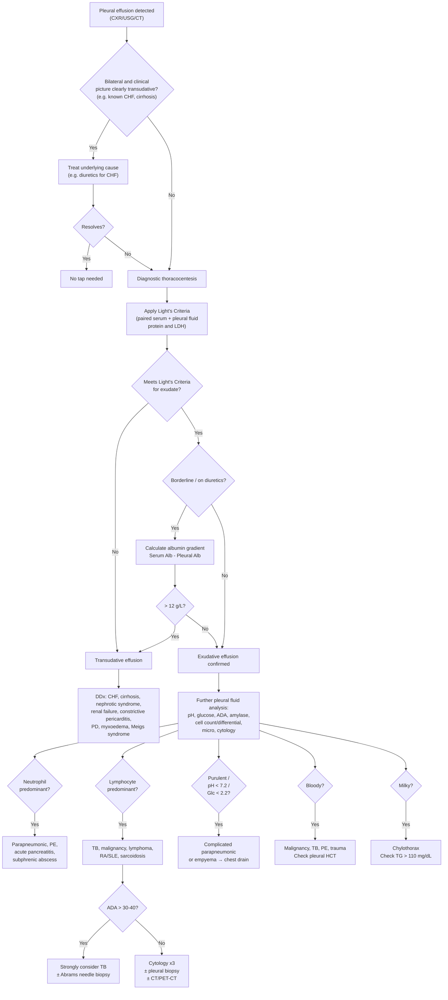

## Differential Diagnosis of Pleural Effusion

### Overview: The Clinical Problem

When you encounter a pleural effusion — whether detected clinically (stony dullness, decreased breath sounds) or radiologically (blunting of costophrenic angle, meniscus sign) — the real clinical challenge is not recognising the effusion itself, but determining **what caused it**. The differential diagnosis is broad, but a systematic approach anchored in the transudative/exudative framework and guided by pleural fluid analysis narrows the field efficiently [1][2][3].

Think of it as a two-step process:
1. **Step 1**: Is it transudative or exudative? (Light's criteria)
2. **Step 2**: Within that category, what specific cause explains the clinical picture and the pleural fluid findings?

---

### A. Differential Diagnosis by Transudative vs. Exudative Category

#### Transudative Effusion — "The Problem is Systemic"

The pleural surfaces are normal. The fluid accumulates because Starling forces are deranged systemically. **Usually bilateral** [1][2][3].

| Cause | Key Distinguishing Clues | Why It Causes Effusion |
|-------|--------------------------|----------------------|
| **Congestive heart failure** (most common cause overall) | Bilateral effusion (R > L), cardiomegaly on CXR, ↑JVP, bilateral pitting oedema, orthopnoea/PND, ↑BNP/NT-proBNP, pulmonary congestion signs (Kerley B lines, upper lobe venous diversion) [6] | ↑pulmonary venous hydrostatic pressure (LHF) + ↑systemic venous hydrostatic pressure (RHF) → fluid pushed out of parietal and visceral pleural capillaries into the pleural space |
| **Hepatic cirrhosis / Hepatic hydrothorax** | Usually **right-sided** (85%), ascites present, stigmata of chronic liver disease (spider naevi, palmar erythema, gynaecomastia, jaundice), low serum albumin [7] | Two mechanisms: (1) ↓oncotic pressure from hypoalbuminaemia; (2) **direct passage of ascitic fluid through diaphragmatic defects** (fenestrations, usually right-sided) driven by positive intra-abdominal pressure and negative intrathoracic pressure |
| **Nephrotic syndrome** | Periorbital or generalised oedema, frothy urine, serum albumin < 30 g/L, heavy proteinuria > 3.5 g/day, hyperlipidaemia [8] | ↓oncotic pressure from massive urinary albumin loss → fluid transudation across capillaries including pleural capillaries |
| **Renal failure / fluid overload** | History of CKD, fluid overload, elevated creatinine, bilateral effusions, peripheral oedema | ↑total body water → ↑hydrostatic pressure + ↓oncotic pressure (if concurrent hypoalbuminaemia) |
| **Constrictive pericarditis** | ↑JVP with Kussmaul sign (paradoxical ↑JVP on inspiration), pericardial knock, calcified pericardium on CXR/CT, Friedreich sign (prominent y descent) [1] | Impaired diastolic filling of both ventricles → ↑systemic and pulmonary venous pressures → bilateral transudative effusion |
| **Peritoneal dialysis** | History of PD, sudden onset of unilateral (usually right) effusion, fluid has same glucose concentration as PD dialysate [1] | **Pleuroperitoneal fistula** — dialysate crosses through congenital or acquired diaphragmatic defects into the pleural space |
| **Protein-losing enteropathy** | Chronic diarrhoea, peripheral oedema, low serum albumin, elevated faecal α₁-antitrypsin [1] | ↓oncotic pressure from GI protein loss |
| **Myxoedema** (severe hypothyroidism) | Periorbital oedema, dry/coarse skin, bradycardia, delayed relaxation reflexes, ↑TSH [9] | ↑capillary permeability from mucopolysaccharide deposition + ↓lymphatic clearance. Often serous effusions in multiple cavities (pericardial, pleural, ascites) |
| **Meigs' syndrome** | Ovarian mass (fibroma/thecoma) + ascites + right-sided pleural effusion, resolves after tumour resection | Tumour produces peritoneal fluid → crosses diaphragmatic lymphatics → pleural effusion. Despite being associated with a tumour, the effusion itself is a transudate |

<Callout title="Bilateral Effusion ≠ Always Transudative" type="error">
While bilateral effusions strongly suggest a transudative cause, **bilateral exudative effusions do occur** — for example, bilateral malignant pleural effusions (especially in lymphoma or extensive pleural metastases), bilateral TB pleuritis, or bilateral parapneumonic effusions in bilateral pneumonia. Always tap if there are atypical features (asymmetry, fever, failure to respond to diuresis) [1][3].
</Callout>

#### Exudative Effusion — "The Problem is Local"

The pleural surfaces are inflamed, infiltrated, or the lymphatic drainage is obstructed. **Can be unilateral or bilateral** [1][2][3].

##### Infectious Causes

| Cause | Key Distinguishing Clues | Why It Causes Effusion |
|-------|--------------------------|----------------------|
| **Parapneumonic effusion / Empyema** | Adjacent pneumonia, fever, productive cough, leukocytosis. Fluid: neutrophilic, ↓pH ( < 7.2) and ↓glucose ( < 2.2 mmol/L) if complicated; **overtly purulent if empyema** [1] | Pneumonia → inflammation of adjacent visceral pleura → ↑capillary permeability → sterile exudative effusion (uncomplicated). Bacteria invade → fibrinopurulent stage → complicated effusion → empyema (pus) |
| **TB pleuritis** | Young patient (in HK), constitutional symptoms (fever, night sweats, weight loss), contact history. Fluid: **lymphocyte-predominant**, protein > 4 g/dL, **ADA > 30–40 IU/L**, low glucose [1][2][3] | TB bacilli reach subpleural focus → rupture into pleural space → **Type IV hypersensitivity** → intense lymphocytic inflammation. Organisms are often scarce (AFB smear +ve in < 10%) because the effusion is predominantly an immune response |
| **Viral pleuritis** | Self-limiting, associated with viral URTI, younger patients, small effusion | Direct viral inflammation of pleural mesothelial cells → ↑capillary permeability |

##### Malignant Causes

| Cause | Key Distinguishing Clues | Why It Causes Effusion |
|-------|--------------------------|----------------------|
| **Malignant pleural effusion (MPE)** — *lung (most common), breast, lymphoma, ovary, **gastric (with ***dyspnoea due to pleural effusion or lymphangitis***)*** [1][10] | Older patient, smoking history (lung CA), weight loss, cachexia, clubbing, lymphadenopathy. Fluid: often bloody/haemorrhagic, lymphocyte-predominant, cytology positive in ~60% (1 tap). ***Metastatic gastric cancer may present with dyspnoea from pleural effusion*** [10] | (1) Tumour cells invade pleura → ↑capillary permeability; (2) tumour deposits **obstruct parietal pleural lymphatic stomata** and mediastinal lymph nodes → ↓lymphatic drainage → fluid accumulates. Often large, rapidly re-accumulating |
| **Malignant mesothelioma** | History of **asbestos exposure** (> 40 years prior), unremitting chest pain, pleural thickening/mass on CT, unilateral effusion [5] | Malignant transformation of pleural mesothelial cells → ↑permeability + lymphatic obstruction. Biopsy required for definitive diagnosis |
| **Lymphoma (Hodgkin or NHL)** | Mediastinal lymphadenopathy, B symptoms (fever > 38°C, night sweats, weight loss > 10%/6 months), **pericardial/pleural effusion** especially in bulky mediastinal disease [11] | Mediastinal nodal involvement → obstruction of lymphatic drainage; direct pleural infiltration; or chylothorax from thoracic duct obstruction |

##### Inflammatory / Autoimmune Causes

| Cause | Key Distinguishing Clues | Why It Causes Effusion |
|-------|--------------------------|----------------------|
| **Rheumatoid arthritis (RA)** | Rheumatoid hands, subcutaneous nodules, predominantly **male** (unlike RA itself), unilateral. Fluid: very low glucose ( < 1.6 mmol/L — classically the lowest of all causes), low pH, **↑LDH > 1000 IU/L**, high cholesterol. May persist for years [1][3] | Rheumatoid nodules on pleural surface → granulomatous inflammation → ↑capillary permeability + impaired glucose transport across inflamed pleura. RA pleural fluid glucose can be strikingly low — lower than any other cause |
| **SLE** | Young female, butterfly rash, oral ulcers, arthritis, alopecia, serositis (pleuritis/pericarditis). Bilateral in ~50%. Fluid: lymphocytic or neutrophilic, low complement, +ve ANA/anti-dsDNA in fluid [1][12] | Immune complex deposition in pleural capillaries → complement activation → serositis → ↑capillary permeability |
| **Pancreatitis** | Epigastric pain radiating to back, history of gallstones or alcohol. Effusion usually **left-sided**. Fluid: **very high amylase** (pancreatic isoenzyme), often bloody [1] | Pancreatic enzyme-rich inflammatory fluid tracks from the retroperitoneum through the aortic/oesophageal hiatus or transdiaphragmatic lymphatics into the pleural space. Left-sided because the pancreatic tail is anatomically left-sided |

##### Vascular / Traumatic Causes

| Cause | Key Distinguishing Clues | Why It Causes Effusion |
|-------|--------------------------|----------------------|
| **Pulmonary embolism (PE)** | Acute pleuritic chest pain, dyspnoea, haemoptysis, tachycardia, DVT signs, risk factors for VTE (immobility, surgery, malignancy). ECG: sinus tachycardia, S1Q3T3 [13] | (1) Lung infarction → ischaemic necrosis of pleura → exudative effusion (most common mechanism); (2) ↑RV afterload → ↑hydrostatic pressure → transudative effusion. **PE can cause either transudative or exudative effusion** — this is an exam favourite |
| **Haemothorax** | History of chest trauma, recent thoracic surgery, anticoagulation. Fluid: frankly bloody, **pleural fluid haematocrit > 50% of peripheral blood haematocrit** [1] | Laceration of intercostal vessels, lung parenchyma, or great vessels → blood accumulates in the pleural space |
| **Chylothorax** | History of thoracic surgery (especially oesophagectomy), lymphoma, trauma. Fluid: **milky/opalescent**, triglycerides > 1.24 mmol/L (110 mg/dL), chylomicrons present [1][2] | Disruption or obstruction of the **thoracic duct** → chyle leaks into mediastinum then pleural space |
| **Oesophageal rupture (Boerhaave syndrome)** | Severe vomiting → excruciating chest pain, surgical emphysema (Mackler's triad). Usually **left-sided**. Fluid: very low pH, **very high salivary amylase**, may contain food particles [14] | Full-thickness tear (most commonly left posterolateral distal oesophagus) → gastric contents and oral secretions leak into mediastinum and left pleural space |
| **Aortic dissection** | Sudden severe tearing pain maximal at onset, BP differential between arms, widened mediastinum on CXR. **Left pleural effusion** in 19% [15] | Rupture or leakage of blood from the aortic false lumen into the left pleural space → haemothorax |

##### Iatrogenic / Other

| Cause | Key Distinguishing Clues | Why It Causes Effusion |
|-------|--------------------------|----------------------|
| **Post-thoracic surgery** | Recent thoracic or cardiac surgery, Dressler syndrome (autoimmune pleuropericarditis post-MI or post-cardiac surgery) [1] | Direct pleural disruption + inflammatory response; or autoimmune mechanism (Dressler) |
| **Drug-induced** | Temporal relationship with drug initiation (e.g., methotrexate, amiodarone, nitrofurantoin, dasatinib, phenytoin) | Drug-induced pleuritis or hypersensitivity reaction → ↑capillary permeability |
| **Subphrenic / liver abscess** | Fever, RUQ pain, hepatomegaly. Reactive effusion usually right-sided, sympathetic (sterile) [1] | Adjacent inflammation → reactive effusion. If amoebic abscess ruptures through diaphragm → may see "anchovy sauce" fluid |

---

### B. Differential Diagnosis Guided by Pleural Fluid Findings

This is the practical, exam-oriented way to narrow the differential once you have the pleural fluid results. The senior notes frame this nicely [1]:

#### By Biochemistry

| Pleural Fluid Finding | Differential Diagnosis | Pathophysiological Reasoning |
|----------------------|----------------------|------------------------------|
| ***Low pH ( < 7.2) / Low glucose ( < 2.2 mmol/L)*** | ***Empyema, complicated parapneumonic effusion, malignancy, TB, RA/SLE, oesophageal rupture*** [1][3] | Bacteria/WBCs/tumour cells consume glucose via anaerobic glycolysis → ↑lactic acid + CO₂ → ↓pH. In RA, impaired glucose transport across thickened pleura also contributes |
| ***↑↑LDH > 1000 IU/L*** | ***Empyema, malignancy, RA, paragonimiasis*** [1] | Very high LDH reflects massive cell turnover/necrosis within the pleural space. In empyema = neutrophil lysis; in malignancy = tumour cell necrosis; in RA = chronic intense granulomatous inflammation |
| ***↑Amylase*** | ***Pancreatitis, malignancy, oesophageal rupture*** [1] | Pancreatitis: pancreatic amylase leaks into pleural space. Oesophageal rupture: salivary amylase from oral/oesophageal secretions enters pleural space. Some malignancies (lung, ovarian) can produce ectopic amylase |
| ***Bloody / haemorrhagic fluid*** | ***Malignancy, TB, PE, trauma*** [1][3] | Malignancy: tumour neovascularisation + direct vascular invasion. TB: intense granulomatous inflammation damages capillaries. PE: pulmonary infarction → necrosis with bleeding. Trauma: direct vascular injury |
| ***Cholesterol > 4 g/dL or Triglycerides > 110 mg/dL*** | ***Chylothorax (high TG): lymphatic obstruction (lymphoma), lymphatic damage post-surgery, nephrotic syndrome, cirrhosis*** [1] | Chylothorax: TG > 110 mg/dL from thoracic duct disruption. Pseudochylothorax (cholesterol effusion): high cholesterol in long-standing effusions where cholesterol crystals precipitate from degenerating cell membranes |

#### By Cell Count and Differential

| Cell Pattern | Differential Diagnosis | Why |
|-------------|----------------------|-----|
| **Neutrophil predominant** | Acute processes: parapneumonic effusion, PE, acute pancreatitis, early TB, subphrenic abscess [2][3] | Neutrophils are first responders to acute infection/inflammation — they arrive within hours of the insult |
| **Lymphocyte predominant** | Chronic processes: **TB (most important in HK)**, malignancy, lymphoma, sarcoidosis, RA, post-CABG [2][3] | Lymphocytes predominate in chronic inflammation (T-cell mediated immunity in TB, chronic tumour-immune interaction in malignancy). **In HK, lymphocytic effusion = TB until proven otherwise** |
| **Eosinophilic ( > 10%)** | Blood or air in pleural space, drug reaction, parasitic disease (e.g., paragonimiasis), asbestos-related benign pleural effusion, Churg-Strauss/EGPA | Eosinophils are recruited by cytokines released in response to blood/air irritation, parasitic antigens, or allergic/eosinophilic conditions |

<Callout title="Exam Favourite: What Causes Bloody Pleural Effusion?">
Think of the mnemonic **"STAMP"** — though not perfect, it captures the key causes:
- **S** = Surgery / Trauma (haemothorax)
- **T** = TB
- **A** = Asbestos-related (benign effusion or mesothelioma)
- **M** = Malignancy (most common cause of bloody effusion)
- **P** = PE (pulmonary infarction)

If pleural fluid haematocrit > 50% of peripheral → this is a true **haemothorax** and requires chest drain ± surgical management, not just diagnostic evaluation.
</Callout>

---

### C. Differential Diagnosis of Radiological Mimics

On CXR, a pleural effusion (area of whiteness at the lung base) can be mimicked by other pathologies. You must consider these in your radiological differential [3][4]:

| CXR Finding | True Effusion | Mimics and How to Distinguish |
|-------------|--------------|-------------------------------|
| White-out at lung base | Homogeneous opacity, **meniscus sign**, blunted CP angle, **no air bronchograms**, mediastinal shift **away** (if massive) [3][4] | **Consolidation**: air bronchograms present, no meniscus, dull but not stony dull percussion. **Collapse/atelectasis**: mediastinal shift **toward** the opacity, volume loss signs. **Elevated hemidiaphragm**: smooth dome, can trace diaphragm contour, no meniscus. **Pleural thickening**: same density as chest wall muscle (not darker), does not shift with position |

---

### D. Clinical Approach to Differential Diagnosis — Algorithm

The following flowchart represents the systematic approach to working through the differential when you encounter a pleural effusion:

---

### E. Key Differentiating Features — Quick Reference Table

This table is extremely high yield for clinical exams and SAQs. It distils the most important discriminating features for the commonest causes:

| Feature | CHF | TB Pleuritis | Malignancy | Parapneumonic / Empyema | PE | RA |
|---------|-----|-------------|------------|------------------------|-----|-----|
| **Laterality** | Bilateral (R > L) | Unilateral | Unilateral | Unilateral (adjacent to pneumonia) | Unilateral | Unilateral |
| **Light's** | Transudate | Exudate | Exudate | Exudate | Either | Exudate |
| **Appearance** | Straw | Straw/bloody | Bloody/straw | Turbid → purulent | Bloody/straw | Greenish-yellow |
| **pH** | > 7.4 | < 7.3 | < 7.3 (poor prognostic sign) | < 7.2 (complicated) | > 7.3 | **Very low** ( < 7.2) |
| **Glucose** | Normal | Low | Low | **Very low** ( < 2.2) | Normal | **Very low** ( < 1.6) |
| **LDH** | Low | Moderate | Moderate-high | **Very high** ( > 1000 in empyema) | Moderate | **Very high** ( > 1000) |
| **Cells** | Few mesothelial | **Lymphocytes** | **Lymphocytes** | **Neutrophils** | Neutrophils/mixed | Mixed |
| **ADA** | Low | **> 30–40** | Low-normal | Variable | Low | Can be elevated |
| **Special** | ↑BNP, cardiomegaly | AFB culture, biopsy granulomas | Cytology +ve in ~60% | Gram stain, culture | D-dimer, CTPA | RF, anti-CCP, very ↓glucose |

---

### F. Uncommon but Must-Know Differentials

These are rarer causes that examiners love to test because students often miss them:

| Condition | Clue | Fluid Finding |
|-----------|------|---------------|
| **Paragonimiasis** (lung fluke) | Travel to endemic area (East/Southeast Asia), eosinophilia, haemoptysis | Eosinophilic effusion, **↑↑LDH > 1000**, may have Paragonimus eggs |
| **Yellow nail syndrome** | Yellow dystrophic nails + lymphoedema + pleural effusion (triad). Congenital lymphatic hypoplasia | Exudative (lymphocyte-predominant), chylous in some cases |
| **Dressler syndrome** (post-cardiac injury syndrome) | 2–10 weeks post-MI or post-cardiac surgery, fever, pleuritic chest pain, pericarditis | Exudative, may be haemorrhagic, ↑ESR |
| **Ovarian hyperstimulation syndrome (OHSS)** | Young woman undergoing IVF, bilateral effusions + ascites | Exudative, ↑capillary permeability from VEGF release |
| **Drug-induced lupus** | History of procainamide, hydralazine, isoniazid. +ve ANA, +ve anti-histone Ab, −ve anti-dsDNA | Exudative, similar to SLE effusion |

---

<Callout title="High Yield Summary — Differential Diagnosis">

**Step 1 — Classify**: Apply Light's criteria to every tapped effusion. If transudative → think systemic (CHF, cirrhosis, nephrotic, renal failure). If exudative → think local (infection, malignancy, inflammation).

**Step 2 — Narrow by fluid profile**:
- Low pH/glucose → empyema, RA, TB, malignancy, oesophageal rupture
- ↑↑LDH > 1000 → empyema, RA, malignancy, paragonimiasis
- ↑Amylase → pancreatitis, oesophageal rupture, malignancy
- Bloody → malignancy, TB, PE, trauma (check HCT for haemothorax)
- Milky → chylothorax (TG > 110 mg/dL)

**Step 3 — Narrow by cell differential**:
- Neutrophils → acute (parapneumonic, PE, pancreatitis)
- Lymphocytes → chronic (TB, malignancy, RA/SLE)
- Eosinophils → blood/air, parasites, drugs, asbestos

**Hong Kong priorities**: TB (ADA > 30 + lymphocytic), lung cancer MPE, CHF, HBV-cirrhosis hepatic hydrothorax

**PE can cause EITHER transudative or exudative effusion** — don't be caught out.

**RA effusion has the lowest glucose of all causes** (can be < 1.6 mmol/L) — a classic exam distinction.
</Callout>

---

<ActiveRecallQuiz
  title="Active Recall - Differential Diagnosis of Pleural Effusion"
  items={[
    {
      question: "A patient with known CHF on furosemide has a unilateral right-sided pleural effusion. Thoracocentesis shows pleural fluid protein/serum protein ratio of 0.55 and pleural fluid LDH/serum LDH ratio of 0.45. How do you interpret this and what is your next step?",
      markscheme: "Light's criteria met (protein ratio > 0.5) so technically classified as exudate. However, diuretic use concentrates serum proteins and can cause misclassification. Next step: calculate serum-pleural fluid albumin gradient. If serum albumin minus pleural albumin is greater than 12 g/L, reclassify as transudate. This is a diuretic-induced pseudo-exudate."
    },
    {
      question: "List four causes of pleural effusion with very low glucose (less than 2.2 mmol/L) and explain why glucose is low in empyema specifically.",
      markscheme: "Four causes: empyema/complicated parapneumonic effusion, rheumatoid arthritis, TB pleuritis, malignancy. Also oesophageal rupture. In empyema, bacteria and neutrophils consume glucose via anaerobic glycolysis, producing lactic acid and CO2, which simultaneously lowers glucose and pH."
    },
    {
      question: "Pulmonary embolism can cause both transudative and exudative pleural effusion. Explain the mechanism for each.",
      markscheme: "Exudative: PE causes pulmonary infarction leading to ischaemic necrosis of visceral pleura and increased capillary permeability, producing an inflammatory exudate (more common mechanism). Transudative: massive PE increases RV afterload causing RV failure and increased systemic venous hydrostatic pressure, leading to a transudative effusion."
    },
    {
      question: "A 70-year-old man with weight loss presents with unilateral bloody pleural effusion. Cytology is negative twice. ADA is 15 IU/L. What are the next diagnostic steps and why?",
      markscheme: "Low ADA effectively rules out TB. Negative cytology does not rule out malignancy (sensitivity only 60-75% with 2 taps). Next steps: (1) CT thorax with contrast to look for pleural thickening, nodularity, or mass lesion; (2) third cytology sample to increase sensitivity; (3) image-guided or thoracoscopic pleural biopsy for definitive histological diagnosis; (4) consider PET-CT for staging if malignancy confirmed."
    },
    {
      question: "Name three causes of a left-sided unilateral pleural effusion and explain the anatomical reason for laterality in each case.",
      markscheme: "1. Pancreatitis: pancreatic tail is left-sided, enzyme-rich fluid tracks through left diaphragm. 2. Aortic dissection: descending aorta is left-sided, rupture or leakage into left pleural space. 3. Oesophageal rupture (Boerhaave): most common tear site is left posterolateral distal oesophagus, contents leak into left pleural space."
    },
    {
      question: "What pleural fluid finding distinguishes chylothorax from pseudochylothorax? Name the most common non-traumatic cause of chylothorax.",
      markscheme: "Chylothorax: triglycerides > 1.24 mmol/L (110 mg/dL) with chylomicrons present on lipoprotein electrophoresis. Pseudochylothorax: high cholesterol with cholesterol crystals but normal or low triglycerides, occurs in long-standing effusions. Most common non-traumatic cause of chylothorax is lymphoma (obstruction or infiltration of thoracic duct)."
    }
  ]}
/>

## References

[1] Senior notes: Maksim Medicine Notes.pdf (Pleural effusion section, p290-293)
[2] Senior notes: Ryan Ho Respiratory.pdf (Section 2.4 Pleural Effusion, p24-25)
[3] Senior notes: Ryan Ho Fundamentals.pdf (Section 3.2.4 Pleural Effusion, p227-228; Section 3.2.6.4 Pleural Shadows, p240)
[4] Senior notes: Ryan Ho Respiratory.pdf (Section 2.6.4 Pleural Shadows, p47)
[5] Senior notes: Ryan Ho Respiratory.pdf (Malignant Mesothelioma, p127)
[6] Senior notes: Maksim Medicine Notes.pdf (Heart failure section, p16-18)
[7] Senior notes: Ryan Ho GI.pdf (Hepatic hydrothorax, p314)
[8] Senior notes: Ryan Ho Urogenital.pdf (Nephrotic syndrome, p73)
[9] Senior notes: Ryan Ho Endocrine.pdf (Hypothyroidism features, p11)
[10] Lecture slides: GC 212. Weight loss and vomiting gastric cancer; abdominal imaging.pdf (p26 — metastatic features of gastric cancer including dyspnoea from pleural effusion)
[11] Senior notes: Ryan Ho Haemtology.pdf (Hodgkin lymphoma features, p94)
[12] Senior notes: Ryan Ho Rheumatology.pdf (SLE, p69)
[13] Senior notes: Ryan Ho Haemtology.pdf (VTE/PE features, p131)
[14] Senior notes: Maksim Surgery Notes.pdf (Boerhaave syndrome, p59)
[15] Senior notes: Ryan Ho Cardiology.pdf (Aortic dissection — left pleural effusion 19%, p220)
