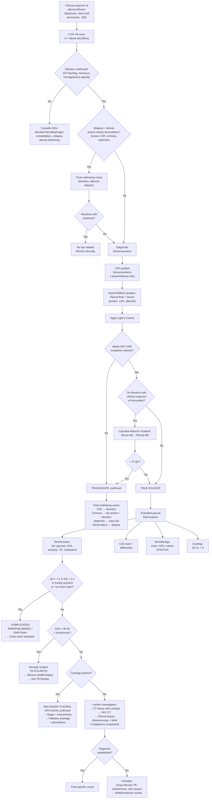

## Diagnostic Criteria, Algorithm, and Investigation Modalities

### A. The Fundamental Diagnostic Question

Pleural effusion itself does not have "diagnostic criteria" in the way that, say, SLE or heart failure has formal criteria. Rather, the diagnostic process has two sequential goals [1][2][3]:

1. **Confirm the effusion exists** (clinical examination + imaging)
2. **Determine the cause** (pleural fluid analysis → Light's criteria → targeted further tests)

The entire diagnostic framework pivots on **Light's criteria**, which is the single most important diagnostic tool — it separates the world of pleural effusions into two pathways (transudative vs. exudative) and dictates everything that follows [1][2][3].

---

### B. Light's Criteria — The Cornerstone Diagnostic Tool

#### B.1 The Criteria

***Light's criteria*** classify a pleural effusion as **exudative** if it meets ***any ONE*** of the following three conditions [1][2][3]:

| Criterion | Cutoff for Exudate |
|-----------|-------------------|
| ***Pleural fluid protein / serum protein*** | ***> 0.5*** |
| ***Pleural fluid LDH / serum LDH*** | ***> 0.6*** |
| ***Pleural fluid LDH*** | ***> 2/3 of upper limit of normal for serum LDH*** |

If **none** of the three criteria are met → **transudative**.

> **Must-know principle**: Pleural fluid biochemistry should **always be sent together with a paired serum sample** (serum protein + serum LDH) drawn at the same time. Without the serum values, you cannot calculate the ratios [3].

#### B.2 Why These Three Parameters?

Think about what LDH and protein tell you:

- **Protein**: Reflects capillary permeability. Normal capillaries leak very little protein into the pleural space. If the pleural fluid protein is high relative to serum → the capillaries are leaky → inflammation → exudate.
- **LDH** (*lactate dehydrogenase*): LDH is an intracellular enzyme released when cells are damaged or dying. High pleural fluid LDH reflects active cellular turnover/necrosis within the pleural space — whether from bacteria, tumour cells, inflammatory cells, or mesothelial cell injury. The more active the disease process, the higher the LDH.

> Why use *ratios* rather than absolute values? Because a patient with very high serum protein (e.g., multiple myeloma with serum protein of 100 g/L) might have pleural fluid protein of 40 g/L that looks "high" in absolute terms but is actually low relative to serum — it's a transudate. Ratios normalise for the patient's own serum values.

#### B.3 The Diuretic Pitfall — Albumin Gradient Correction

***Light's criteria tend to overdiagnose exudative fluid, especially if the patient is on chronic diuretics*** [1].

**Why?** Diuretics remove free water → serum proteins and LDH become concentrated → pleural fluid ratios approach exudative thresholds even though the underlying process is transudative (e.g., CHF patient on furosemide).

**The fix**: If Light's criteria suggest exudate but the clinical picture strongly suggests transudate → calculate the **serum-to-pleural-fluid albumin gradient**:

| Test | Interpretation |
|------|---------------|
| Serum albumin − pleural fluid albumin **> 12 g/L** | Likely **transudate** (misclassified by Light's) |
| Serum albumin − pleural fluid albumin **≤ 12 g/L** | Likely **true exudate** |

Another complementary check mentioned in the senior notes [1]: ***serum-pleural fluid protein difference < 3.1 g/dL → likely exudative*** (i.e., the protein levels are close together → high permeability → true exudate).

<Callout title="Exam Trap: Light's Criteria in Diuretic Patients" type="error">
This is tested in almost every summative exam. A CHF patient on furosemide presents with a unilateral effusion. Light's criteria classify it as an exudate. Before you embark on an expensive workup for malignancy or TB, **calculate the albumin gradient**. If > 12 g/L → it's a diuretic-induced pseudo-exudate, and you should treat the CHF, not chase an exudative cause.
</Callout>

---

### C. Extended Pleural Fluid Analysis — The Diagnostic Toolkit

Once you have classified the effusion as exudative using Light's criteria, you need to determine the specific cause. This is where the extended pleural fluid panel comes in [1][2][3]:

#### C.1 Macroscopic Appearance

| ***Appearance*** | ***Suggests*** | Pathophysiological Basis |
|-----------------|---------------|------------------------|
| ***Straw-coloured*** | Transudate or simple exudate | Normal pleural fluid colour; protein-rich but not contaminated |
| ***Turbid (cloudy)*** | ***Empyema*** or complicated parapneumonic effusion | Turbidity from high WBC count (neutrophils), debris, fibrin |
| ***Milky*** | ***Chylothorax*** | Chylomicrons from thoracic duct disruption scatter light → milky appearance |
| ***Bloody*** | Malignancy, TB, PE, trauma | Vascular disruption (tumour neovascularisation, infarction, direct injury) → RBCs leak into fluid |
| ***Brown (dark)*** | ***Old blood*** | Haemoglobin degradation products (methaemoglobin) in chronic haemothorax |
| Frankly purulent | Empyema | Massive neutrophil accumulation and necrotic debris = pus |
| Food particles | Oesophageal rupture | Gastric/oesophageal contents enter pleural space via perforation |

> **Pro tip**: The moment you aspirate frank pus, you don't even need to wait for biochemistry — the diagnosis is empyema and you should insert a chest drain immediately [1].

#### C.2 Biochemistry — Beyond Light's Criteria

| Test | Key Cutoffs and Interpretation | Why It Works |
|------|-------------------------------|-------------|
| **pH** | ***< 7.2 → complicated parapneumonic / empyema, malignancy, TB, RA, oesophageal rupture*** [1][2][3]. Normal pleural fluid pH ≈ 7.60 (alkaline relative to blood because of active bicarbonate transport by mesothelial cells). **In empyema**: pH can drop to < 7.0 | Bacteria/neutrophils consume glucose anaerobically → produce lactic acid + CO₂ → ↓pH. In RA: thickened pleura impairs CO₂ clearance. In malignancy: tumour metabolism + impaired pleural clearance |
| **Glucose** | ***< 2.2 mmol/L (or < 0.5× serum glucose or ≤ 3.33 mmol/L)*** → same differential as low pH [2][3] | Same organisms consuming glucose. RA has particularly low glucose (< 1.6 mmol/L) because of impaired glucose transport across thickened, inflamed synovial-like pleural tissue |
| **ADA** (adenosine deaminase) | ***> 30–40 IU/L suggests TB*** [1][2][3]. Note: can also be elevated in empyema, RA, and some malignancies | ADA is released by activated T-lymphocytes. In TB pleuritis, there is intense Type IV hypersensitivity → massive T-cell activation → very high ADA. The enzyme catalyses deamination of adenosine → inosine in purine metabolism |
| **Amylase** | ***↑amylase → pancreatitis, malignancy, oesophageal rupture*** [1] | Pancreatitis: pancreatic isoenzyme leaks via transdiaphragmatic lymphatics. Oesophageal rupture: salivary isoenzyme from oral secretions. Some malignancies (lung, ovarian) ectopically produce amylase |
| **Triglycerides** | > 1.24 mmol/L (110 mg/dL) → **chylothorax**. < 0.56 mmol/L (50 mg/dL) → rules out chylothorax [1] | Chyle from thoracic duct is rich in dietary long-chain triglycerides absorbed by intestinal lacteals |
| **Cholesterol** | > 5.18 mmol/L (200 mg/dL) or cholesterol crystals → **pseudochylothorax** | Long-standing effusions: cell membrane cholesterol accumulates from degenerating cells. Not thoracic duct-related |
| **Protein (absolute)** | ***Transudative < 3 g/dL; TB > 4 g/dL; Waldenström macroglobulinaemia/myeloma: 7–8 g/dL*** [2] | TB produces very high protein due to intense inflammatory exudation. Paraproteinaemias produce IgM/other immunoglobulins that accumulate in pleural fluid |
| **LDH (absolute)** | ***> 1000 IU/L → empyema, RA, some malignancy, paragonimiasis*** [1][2] | Very high LDH = massive cell death. In empyema: neutrophil necrosis. In RA: chronic granulomatous inflammation with cell destruction |

#### C.3 Cell Count and Differential

| Finding | Differential | Reasoning |
|---------|-------------|-----------|
| ***Neutrophil predominant*** | ***Acute inflammation: parapneumonic effusion, PE, acute pancreatitis, early TB, subphrenic abscess*** [2][3] | Neutrophils are the first-response inflammatory cells — recruited within hours of acute pleural insult via IL-8 and C5a chemotaxis |
| ***Lymphocyte predominant*** | ***Chronic inflammation: TB (most important in HK), malignancy, lymphoma, RA/SLE, sarcoidosis*** [2][3] | T-lymphocytes dominate in chronic cell-mediated immunity (TB) and in chronic tumour-immune interactions |
| Eosinophilic (> 10%) | Blood or air in pleural space, drug reaction, parasitic (paragonimiasis), asbestos-related, EGPA | Eosinophils are recruited by IL-5 and eotaxin in response to parasitic antigens, foreign material (blood/air), and allergic processes |
| ***Cell count > 50,000/μL*** → only in complicated parapneumonic effusion. ***> 10,000*** in parapneumonic, pancreatitis, SLE. ***< 5,000*** in chronic exudates (TB, malignancy) [2] | — | Higher cell counts reflect more acute and intense inflammation |
| Mesothelial cells present | Absence of mesothelial cells (< 5%) → suggests TB (because the intense granulomatous pleuritis traps and destroys mesothelial cells) | Normally, desquamated mesothelial cells are present in pleural fluid. Their absence is a negative marker for TB |

#### C.4 Microbiology

| Test | Purpose | Key Points |
|------|---------|------------|
| ***Gram stain*** | Rapid identification of bacteria in parapneumonic/empyema | ***Positive Gram stain is an indication for chest drain*** [1]. Sensitivity ~60% in empyema, lower in parapneumonic |
| ***Bacterial culture*** (aerobic + anaerobic) | Definitive organism identification + sensitivity | Culture fluid in blood culture bottles to ↑sensitivity. Always request anaerobic culture — anaerobes (e.g., Bacteroides) are common in empyema |
| ***AFB smear*** | Acid-fast bacilli for TB | Low sensitivity (< 10% in TB pleuritis) because organisms are scarce — the effusion is primarily an immune response, not direct infection |
| ***TB culture*** (Löwenstein-Jensen / MGIT) | Definitive TB diagnosis | Gold standard but takes 2–8 weeks. Sensitivity ~30% in pleural fluid alone |
| ***MTB-PCR*** (e.g., GeneXpert) | Rapid molecular detection of M. tuberculosis | Faster than culture (~2 hours), also detects rifampicin resistance. Sensitivity in pleural fluid is moderate (~50–60%) — better than smear, worse than culture + biopsy combined |
| ± ***Fungal culture*** | If immunosuppressed or endemic exposure | Consider in HIV, prolonged steroids, diabetes |

#### C.5 Cytology

| Parameter | Details |
|-----------|---------|
| **Volume to send** | ***20 mL × 3 separate samples*** [1] — larger volume ↑ yield because malignant cells may be sparse |
| **Sensitivity** | ***~60% with 1 tap, ~75% with 2 taps*** [3]. Third sample adds only marginal yield (~5–10%) |
| **False-negatives** | Mesothelioma (cells hard to distinguish from reactive mesothelial cells), sarcomatoid tumours, lymphoma (need flow cytometry instead) |
| **If negative but suspicion remains** | Proceed to **pleural biopsy** (see below) |

<Callout title="Why Send 20 mL × 3?">
Malignant cells shed from pleural tumour deposits intermittently and are often diluted in large effusion volumes. By sending three separate large-volume samples (20 mL each), you maximise the chance of capturing clusters of tumour cells. This is analogous to sending three sputum samples for AFB — sampling error is reduced by repetition [1][3].
</Callout>

---

### D. Imaging Modalities — Systematic Breakdown

#### D.1 Chest X-Ray (CXR) [1][3][5]

The first-line investigation. Always start here.

**Projections**:
- ***PA erect*** → higher quality, accurate heart size assessment. Minimum ~***175 mL*** of fluid to detect (blunting of CP angle) [1][5]
- **AP** (portable) → lower quality, exaggerates heart size and mediastinal contour; used for bed-bound patients [5]
- ***Lateral decubitus*** → patient lies on the affected side → free-flowing fluid layers dependently. Minimum ~***100 mL*** detectable. Detects ***loculations*** (fluid does NOT redistribute on position change) [1]

**Key CXR findings in pleural effusion** [1][3][5]:

| Finding | Significance |
|---------|-------------|
| ***Blunting of costophrenic angle*** | Earliest sign; requires ≥ 175 mL fluid |
| ***Meniscus sign*** | Concave upper border of fluid curving upward laterally. Note: the fluid level is actually flat — the "meniscus" appearance occurs because X-rays pass through a thicker layer of fluid at the periphery, producing a denser (whiter) appearance laterally [3] |
| ***Homogeneous opacity without air bronchograms*** | Distinguishes effusion from consolidation (which HAS air bronchograms) [4] |
| Mediastinal shift **away** from the opacity | Large effusion acts as space-occupying lesion. If shift is **toward** the opacity → suspect associated collapse (e.g., bronchial obstruction by tumour) |
| ***Amount estimation***: CP angle blunted ≈ 175 mL; lower 1/3 ≈ 1 L; lower 1/2 ≈ 2 L [1] | Quick bedside estimate of volume |
| ***> 1 cm thick on lateral decubitus film → suitable for pleural tapping*** [1] | Clinical decision point for thoracocentesis |
| Air-fluid level (flat, horizontal) | Hydropneumothorax — fluid + air coexist [3] |

**Additional features to examine on CXR** (looking for the CAUSE) [4]:
- ***Lung fields***: masses, consolidation, cavitation → malignancy, pneumonia, TB
- ***Hilum***: hilar enlargement → lymphoma, lung cancer, sarcoidosis
- ***Heart***: cardiomegaly → CHF
- ***Bones***: lytic lesions → metastatic disease
- ***Upper lobe venous diversion + Kerley B lines*** → pulmonary venous congestion (CHF) [6]

<Callout title="CXR Quality Check — Don't Forget!" type="idea">
Before interpreting any CXR [5]:
1. **Name, date, L/R label** (dextrocardia?)
2. **Inspiration adequacy**: count 10 posterior ribs or 6 anterior ribs above the diaphragm
3. **Rotation**: medial ends of clavicles equidistant from spinous process
4. **Penetration**: retrocardiac window and T-spine outline just visible

An underexposed film may create a false "white-out" mimicking effusion.
</Callout>

#### D.2 Ultrasound (USG) Thorax [1][2][3]

**More sensitive than CXR** — can detect as little as ~20 mL of fluid. Increasingly used as the first-line bedside tool.

| Feature | Interpretation |
|---------|---------------|
| ***Transudate***: ***clear hypoechoic space*** (black, no internal echoes) [2][3] | Simple fluid, no debris |
| ***Exudate***: ***moving floating densities or septations*** [2][3] | Internal echoes = protein/cellular debris. Septations suggest loculation (fibrin strands dividing the fluid into compartments) |
| **Differentiate from pleural thickening** | Fluid: anechoic/hypoechoic, flows with respiration, compressible. Thickening: echogenic, fixed, non-compressible [1] |
| ***Echogenicity*** | ***Echogenic fluid → suggests exudative*** [1]. But note: anechoic fluid can be either transudative or exudative |
| ***Loculations*** | Multiple septated collections that don't communicate — indicates complicated parapneumonic/empyema or chronic effusion [1] |
| ***Guide drainage and biopsy*** | USG-guided thoracocentesis has significantly lower pneumothorax rates compared with blind aspiration (~0.5% vs ~5-15%) [1] |
| **Volume estimation** | USG can quantify effusion volume more accurately than CXR |

#### D.3 CT Thorax with Contrast [1][2][3]

Reserved for complex or uncertain cases. Provides the most comprehensive anatomical information.

| Indication | What It Shows |
|-----------|--------------|
| ***Uncertain diagnosis*** after initial CXR + tap [1] | Precise effusion location, size, and relationship to adjacent structures |
| ***Suspected malignancy*** | ***Pleural thickening, nodularity*** (lobulated contour → malignancy) [4], masses, mediastinal lymphadenopathy, bony metastases |
| ***Empyema characterisation*** | ***Pleural thickening with contrast enhancement*** (the **"split pleura sign"** — enhancing visceral and parietal pleura separated by infected fluid) [1][4] |
| ***Parapneumonic effusion*** | ***Pleural thickening with contrast enhancement on CT thorax*** — one of the indications for chest drain [1] |
| ***Guide biopsy*** | Image-guided TEMNO needle biopsy of focal pleural lesions |
| ***r/o PE*** | CTPA (CT pulmonary angiography) if PE suspected as the cause |

**Radiological approach to pleural shadows** on CT [4]:
- ***Colour/density***: effusion = darker than chest wall muscle; thickening = same density; plaques = very bright white
- ***Contour***: ***smooth → fluid, thickening, or plaques; lobulated → malignancy***
- ***Distribution***: ***diffuse → benign thickening or malignant pleural disease; patchy → pleural plaques***
- ***Enhancement***: ***enhanced → empyema***

#### D.4 PET-CT [2][3]

| Indication | Rationale |
|-----------|-----------|
| ***Malignancy suspected or initial tap non-diagnostic*** [2][3] | PET detects metabolically active (FDG-avid) pleural deposits, helps differentiate malignant from benign pleural thickening, and stages distant disease |
| Mesothelioma staging | Determines resectability and distant metastasis |

#### D.5 Decubitus Film [1][5]

A dedicated imaging technique worth understanding in detail:

- **Technique**: Patient lies on the **affected side** (side of effusion down) for a lateral decubitus film
- **Purpose**: Free-flowing fluid layers along the dependent chest wall. This allows you to:
  1. ***Confirm the effusion is free-flowing*** (fluid redistributes with gravity)
  2. ***Identify loculations*** (if fluid does NOT redistribute → loculated, may need different drainage strategy)
  3. ***Assess tappability***: ***> 1 cm fluid thickness on decubitus film → suitable for safe thoracocentesis*** [1]
- **Contrast with pneumothorax**: For suspected pneumothorax, the patient lies with the **suspected side UP** on a lateral decubitus film (air rises, making it visible). This is the opposite orientation to effusion assessment.

---

### E. Blood Tests — Supporting Investigations

These are not diagnostic of pleural effusion itself but help identify the underlying cause and prepare for procedures [1][6]:

| Test | Purpose | Key Findings |
|------|---------|-------------|
| ***CBC*** | Infection (↑WBC), anaemia, thrombocytopenia | ↑WBC with left shift → pneumonia/empyema. ↓Hb → chronic disease (malignancy, TB) |
| ***Clotting profile*** | ***Prep for pleural tapping*** [1] | Must check before any invasive pleural procedure to minimise bleeding risk |
| ***CRP / ESR*** | ***Inflammation*** [1] | ↑ in infection, TB, malignancy, autoimmune. Useful for monitoring treatment response |
| ***LRFT (liver + renal function tests)*** | Assess hepatic/renal causes [1] | ↓albumin (cirrhosis, nephrotic), ↑creatinine (renal failure), ↑ALP/GGT (liver mets) |
| ***Serum LDH*** | ***Paired with pleural fluid LDH for Light's criteria*** [1] | Essential — you cannot interpret Light's criteria without simultaneous serum LDH |
| ***Serum protein + albumin*** | Paired for Light's criteria + albumin gradient | Essential |
| ***BNP / NT-proBNP*** | Distinguish cardiac from non-cardiac cause of dyspnoea | < 100 pg/mL → HF unlikely. > 400 pg/mL → HF likely. Can also be measured in pleural fluid (pleural fluid BNP > 1500 pg/mL → CHF) [6] |
| ***D-dimer*** | Screening for PE in low pre-test probability | Sensitive but not specific. Negative D-dimer in low-risk patient effectively rules out PE |
| ***Autoimmune markers*** (ANA, anti-dsDNA, RF, anti-CCP, complement C3/C4) | If CTD suspected | +ve ANA + anti-dsDNA → SLE. +ve RF + anti-CCP → RA |
| ***TSH*** | If myxoedema suspected | ↑TSH → hypothyroidism |

---

### F. Pleural Biopsy — When Fluid Analysis Is Not Enough [1][3]

***Pleural biopsy is indicated for exudative effusion with non-diagnostic thoracocentesis, especially for TB and malignancy*** [3].

| Method | Technique | Best For | Advantages | Limitations |
|--------|-----------|----------|------------|-------------|
| ***Bedside percutaneous (Abram's needle)*** | Blind biopsy of parietal pleura at bedside | ***TB (first-line in HK because TB pleuritis is common)*** [1][3] | Cheap, quick, no GA, good for TB (granulomas are diffuse on pleura → high yield with blind biopsy) | ***Poor sensitivity for malignant pleural effusion*** (tumour deposits are focal → blind biopsy may miss them) [1] |
| ***Imaging-guided (TEMNO needle)*** | USG- or CT-guided targeted biopsy | Focal pleural thickening or nodularity (malignancy) [1] | Targets specific lesions → ↑sensitivity for malignancy. In TB-endemic regions (including HK), used as alternative to blind biopsy [3] | Requires radiology support |
| ***Medical thoracoscopy / pleuroscopy*** | Semi-rigid scope inserted through small chest wall incision under ***IV sedation (not GA)*** [1] | Both TB and malignancy. Also allows therapeutic intervention | ***Allows direct visualisation + biopsy + drainage + pleurodesis in one procedure*** [1]. Sensitivity for malignancy > 90% | Semi-invasive, requires trained operator |
| ***VATS (video-assisted thoracoscopic surgery)*** | Rigid thoracoscope under ***general anaesthesia with single-lung ventilation*** | Complex cases needing surgical intervention (e.g., decortication, trapped lung) [1] | Most definitive diagnostic + therapeutic. Can perform decortication simultaneously | Requires GA, operating theatre, and cardiothoracic surgeon |

<Callout title="Abram's Needle vs Medical Thoracoscopy — When to Use Which?">
In Hong Kong, where **TB is common**, Abram's needle biopsy is first-line because TB granulomas are diffusely distributed on the parietal pleura — even a blind biopsy has a good chance of hitting granulomatous tissue (sensitivity ~80% for TB). However, for suspected **malignancy**, where tumour deposits may be focal and patchy, blind biopsy has poor sensitivity (~50%). In this case, medical thoracoscopy is preferred as it allows **direct visualisation** of the pleural surface to target suspicious areas for biopsy [1][3].
</Callout>

---

### G. Master Diagnostic Algorithm — Comprehensive Flowchart

---

### H. Special Diagnostic Scenarios

#### H.1 When NOT to Tap

***Pleural fluid by pleural tapping is not required if bilateral effusion is strongly suggestive of transudative cause*** [1][2][3].

This applies when:
- Bilateral, symmetric effusions
- Clear clinical diagnosis (e.g., decompensated CHF with cardiomegaly, ↑JVP, bilateral oedema, ↑BNP)
- Response to treatment (e.g., effusion shrinks with diuresis)

**BUT tap if**: asymmetric, unilateral, febrile, fails to respond to treatment, or atypical features present.

#### H.2 Diagnosing Haemothorax

- **Pleural fluid haematocrit > 50% of peripheral blood haematocrit** → confirmed haemothorax
- This is distinct from a "bloody" effusion (which can occur in malignancy, TB, PE) where the haematocrit is much lower
- A true haemothorax requires chest tube drainage ± surgical consultation, not just diagnostic evaluation

#### H.3 Diagnosing Hepatic Hydrothorax [7]

- **Clinical context**: Cirrhosis with ascites + right-sided pleural effusion (usually without primary cardiopulmonary disease)
- **Confirmation**: Pleural fluid analysis shows transudate. If ascites is present, can demonstrate the diaphragmatic defect by injecting **99mTc-sulphur colloid** into the peritoneal cavity → radiotracer appears in the pleural space within hours = pleuroperitoneal communication
- ***Do NOT insert a chest tube for hepatic hydrothorax*** → may cause massive protein/electrolyte depletion, infection, renal failure, and bleeding [7]

#### H.4 Diagnosing TB Pleuritis in Hong Kong

TB pleuritis is one of the most important diagnoses to make in Hong Kong [1][2][3]. The challenge is that:
- ***AFB smear of pleural fluid is positive in < 10%*** (organisms are scarce)
- ***TB culture of pleural fluid is positive in only ~30%*** (better but still low)
- ***ADA > 30–40 IU/L with lymphocytic predominance*** has sensitivity ~90% and specificity ~92% → highly useful screening tool [1][2]
- ***Pleural biopsy (Abrams needle) is first-line*** [1][3] because TB granulomas are diffusely distributed → sensitivity ~80% with histology + culture of biopsy tissue

The combined sensitivity of pleural fluid ADA + culture + biopsy histology + biopsy culture approaches 95%.

#### H.5 Diagnosing Malignant Pleural Effusion

- ***Cytology (20 mL × 3)*** is the initial diagnostic step — sensitivity ~60-75% [1][3]
- If cytology negative → ***CT thorax with contrast*** to identify pleural thickening/nodularity, lung masses, lymphadenopathy
- If CT suspicious → ***pleural biopsy via medical thoracoscopy*** (sensitivity > 90%) [1]
- ***PET-CT*** for staging and identifying occult primary
- **For lymphoma**: pleural fluid cytology may not be diagnostic → send for **flow cytometry** (identifies clonal B-cell or T-cell populations)

---

### I. Summary: Investigation Modalities at a Glance

| Modality | Sensitivity for Effusion | Key Role | Limitations |
|----------|--------------------------|----------|-------------|
| **CXR (PA erect)** | ≥ 175 mL | First-line screening; assess volume; identify cause (mass, cardiomegaly, consolidation) | Misses small effusions; poor for characterisation |
| **CXR (lateral decubitus)** | ≥ 100 mL | Confirm free-flowing; detect loculation; assess tappability (> 1 cm) | Additional film needed |
| **USG thorax** | ≥ 20 mL | Most sensitive bedside tool; characterise fluid; guide procedures; detect loculation | Operator-dependent |
| **CT thorax ± contrast** | Very high | Complex/uncertain cases; malignancy staging; empyema characterisation; guide biopsy | Radiation; cost; contrast risks |
| **PET-CT** | N/A | Differentiate malignant vs benign pleural disease; staging | Cost; availability; false positives in inflammation |
| **Thoracocentesis** | N/A | Light's criteria; extended fluid analysis; determine aetiology | Complications (PTX, bleeding, re-expansion oedema) |
| **Pleural biopsy (blind)** | ~80% for TB | First-line for TB in endemic areas (HK) | Poor for malignancy (~50%) |
| **Medical thoracoscopy** | > 90% for malignancy | Biopsy + drainage + pleurodesis in one procedure | Semi-invasive; requires trained operator |
| **VATS** | Highest | Definitive diagnostic + therapeutic (decortication) | Requires GA + single-lung ventilation |

---

<Callout title="High Yield Summary — Diagnosis">

**Light's Criteria (MUST KNOW)**: Exudate if ANY ONE of: pleural/serum protein > 0.5, pleural/serum LDH > 0.6, pleural LDH > 2/3 ULN serum LDH. Always send paired serum sample.

**Albumin gradient correction**: Serum Alb − Pleural Alb > 12 g/L → transudate (use when Light's misclassifies in diuretic patients).

**When NOT to tap**: Bilateral + clearly transudative + responds to treatment.

**Extended fluid analysis for exudate**: pH, glucose, ADA, amylase, TG, cell count/diff, Gram/AFB/culture, cytology (20 mL × 3).

**Chest drain indications from fluid**: frankly purulent, pH < 7.2, glucose < 2.2, +ve Gram stain.

**ADA > 30–40 in lymphocytic effusion → TB** (especially in HK). Abram's needle biopsy is first-line for TB.

**Cytology negative × 2–3 with malignancy suspected** → CT thorax → medical thoracoscopy (sensitivity > 90%).

**Imaging hierarchy**: CXR → USG → CT ± PET-CT. USG most sensitive bedside; CT for complex cases.

**Hepatic hydrothorax**: Do NOT insert chest tube. Treat with diuretics, Na restriction, ± TIPS.

**CXR volume estimation**: CP angle blunted ≈ 175 mL; lower 1/3 ≈ 1 L; lower 1/2 ≈ 2 L. Decubitus > 1 cm → tappable.
</Callout>

---

<ActiveRecallQuiz
  title="Active Recall - Diagnostic Criteria, Algorithm, and Investigations for Pleural Effusion"
  items={[
    {
      question: "State the three Light's criteria. A patient on long-term furosemide has pleural fluid protein/serum protein of 0.52 and pleural fluid LDH/serum LDH of 0.48. Is this truly an exudate? What additional test should you perform?",
      markscheme: "Light's criteria: exudate if any of (1) fluid/serum protein > 0.5, (2) fluid/serum LDH > 0.6, (3) fluid LDH > 2/3 ULN of serum LDH. This meets criterion 1, so classified as exudate. However, diuretics can cause misclassification. Calculate albumin gradient: if serum albumin minus pleural albumin > 12 g/L, reclassify as transudate."
    },
    {
      question: "On CXR, how do you distinguish a pleural effusion from consolidation? Give at least three distinguishing features.",
      markscheme: "Pleural effusion: (1) homogeneous opacity WITHOUT air bronchograms, (2) meniscus sign present, (3) stony dull on percussion, (4) mediastinal shift AWAY if massive, (5) decreased vocal resonance. Consolidation: (1) air bronchograms present, (2) no meniscus, (3) dull but not stony dull, (4) usually no mediastinal shift, (5) INCREASED vocal resonance with bronchial breathing."
    },
    {
      question: "A patient in Hong Kong has a unilateral exudative pleural effusion with lymphocytic predominance and ADA of 55 IU/L. AFB smear is negative. What is the most likely diagnosis and what is the first-line biopsy method? Why is AFB smear often negative in this condition?",
      markscheme: "TB pleuritis. First-line biopsy: bedside percutaneous Abrams needle biopsy. AFB smear is negative because TB pleuritis is predominantly a Type IV hypersensitivity immune response rather than direct infection - organisms are scarce in the pleural fluid (smear positive in less than 10%). ADA is high because activated T-lymphocytes release adenosine deaminase during the granulomatous response."
    },
    {
      question: "What are the indications for NOT performing diagnostic thoracocentesis in a patient with pleural effusion?",
      markscheme: "Do not tap if: (1) bilateral effusion, AND (2) clinical picture is clearly consistent with a transudative cause (e.g., known CHF with bilateral oedema, elevated JVP, cardiomegaly, elevated BNP), AND (3) the effusion responds to treatment of the underlying cause. Tap if any atypical features: asymmetry, unilateral, fever, pain, failure to respond to treatment."
    },
    {
      question: "Compare the diagnostic roles and indications of Abrams needle biopsy versus medical thoracoscopy for pleural effusion.",
      markscheme: "Abrams needle: blind bedside percutaneous parietal pleural biopsy under IV sedation. First-line for TB in endemic areas like HK because TB granulomas are diffusely distributed (sensitivity approximately 80%). Poor sensitivity for malignancy (approximately 50%) because tumour deposits are focal. Medical thoracoscopy: semi-rigid scope under IV sedation (not GA). Allows direct visualisation of pleura plus targeted biopsy plus drainage plus pleurodesis in one procedure. Sensitivity for malignancy > 90%. Preferred when malignancy is suspected and cytology is negative."
    },
    {
      question: "Why should you NOT insert a chest tube for hepatic hydrothorax? What is the recommended management?",
      markscheme: "Chest tube insertion in hepatic hydrothorax can cause massive protein and electrolyte depletion, infection, renal failure, and bleeding because the diaphragmatic defect allows continuous flow of ascitic fluid into the pleural space - the drain will never stop draining. Management: diuretics, sodium restriction, therapeutic thoracocentesis if symptomatic, and consider TIPS (transjugular intrahepatic portosystemic shunt) for refractory cases."
    }
  ]}
/>

## References

[1] Senior notes: Maksim Medicine Notes.pdf (Pleural effusion section, p290-293)
[2] Senior notes: Ryan Ho Respiratory.pdf (Section 2.4 Pleural Effusion, p24-25)
[3] Senior notes: Ryan Ho Fundamentals.pdf (Section 3.2.4 Pleural Effusion, p227-229; Section 3.2.6.4 Pleural Shadows, p240)
[4] Senior notes: Ryan Ho Respiratory.pdf (Section 2.6.4 Pleural Shadows, p47)
[5] Senior notes: Ryan Ho Diagnostic Radiology.pdf (Chest X-Ray, p13-14)
[6] Senior notes: Maksim Medicine Notes.pdf (Heart failure, p16-18)
[7] Senior notes: Ryan Ho GI.pdf (Hepatic hydrothorax, p314)
