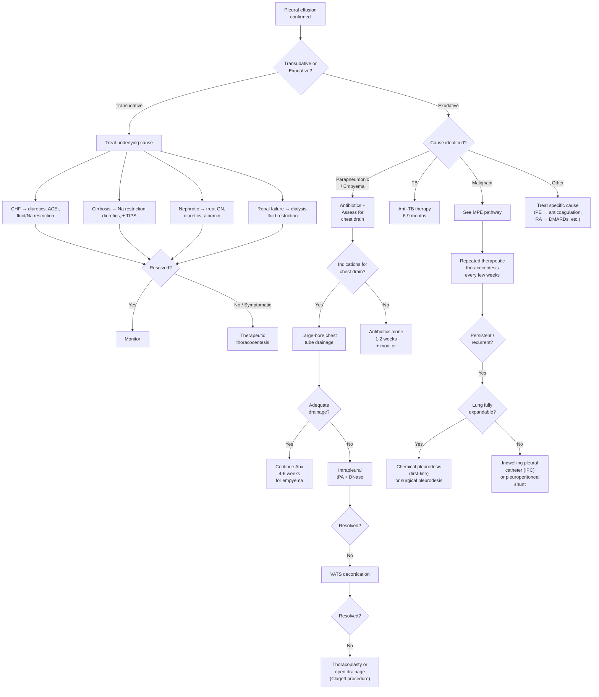

## Management of Pleural Effusion

### Overview: Management Principles

The management of pleural effusion follows a logical, stepwise approach built on one fundamental truth: **a pleural effusion is a sign, not a diagnosis**. Therefore, the first and most important management step is always to treat the underlying cause. Everything else — drainage, pleurodesis, indwelling catheters — is adjunctive or palliative [1][2][3].

The management approach branches based on three key decision points:
1. **Is this transudative or exudative?** → Transudative effusions respond to treating the underlying systemic disease
2. **Is the effusion causing respiratory compromise?** → If yes, therapeutic drainage is needed regardless of cause
3. **Is the effusion complicated (infected) or malignant?** → These have specific escalation pathways

---

### A. Master Management Algorithm

---

### B. General Principles of Management

#### B.1 Treat the Underlying Cause — Always First [2][3]

This cannot be overemphasised. The most elegant chest drain insertion means nothing if you haven't addressed why the fluid is there in the first place.

| Cause | Specific Treatment | Mechanism of Benefit |
|-------|-------------------|---------------------|
| **CHF** | ***Diuretics (e.g., furosemide)*** [1], ACE inhibitors/ARBs, fluid and sodium restriction, optimise cardiac medications | ↓intravascular volume → ↓hydrostatic pressure → fluid reabsorbed from pleural space back into the capillaries |
| **Hepatic cirrhosis / Hepatic hydrothorax** | ***Diuretics, Na restriction, ± thoracocentesis or TIPS*** [7]. ***Do NOT put in chest tube → may cause massive protein/electrolyte depletion, infection, renal failure, bleeding*** [7] | Diuretics reduce ascites volume → ↓pressure driving fluid through diaphragmatic defects. TIPS ↓portal pressure → ↓ascites formation |
| **Nephrotic syndrome** | Treat underlying glomerulonephritis, diuretics, IV albumin (temporising) | Treat proteinuria → ↑serum albumin → ↑oncotic pressure → fluid reabsorption |
| **Renal failure** | Dialysis, fluid restriction | Remove excess fluid directly |
| **TB pleuritis** | Standard anti-TB chemotherapy (RIPE regimen, 6–9 months) | Kill M. tuberculosis → resolve granulomatous inflammation → effusion resolves. Most TB effusions resolve with treatment alone without drainage |
| **PE** | Anticoagulation (heparin → warfarin/DOAC) | Prevent clot propagation → allow natural fibrinolysis → ↓pulmonary vascular obstruction → ↓effusion |
| **Autoimmune (SLE, RA)** | DMARDs, corticosteroids, biological agents | Suppress immune-mediated pleural inflammation |
| **Pancreatitis** | Treat pancreatitis (NPO, fluids, analgesia); effusion usually resolves as pancreatitis resolves | Reduce pancreatic enzyme leak into pleural space |

***Bilateral pleural effusion: treat underlying cause (e.g., furosemide) → chest drain if failed or respiratory distress*** [1].

***Unilateral pleural effusion: chest drain*** [1] (after determining the cause — this is a simplified statement; not every unilateral effusion needs a drain).

<Callout title="Hepatic Hydrothorax — The Chest Tube Trap" type="error">
This is a classic exam pitfall: ***Do NOT insert a chest tube for hepatic hydrothorax*** [7]. Why? Because the diaphragmatic defect creates a one-way valve — ascitic fluid will continuously flow into the pleural space through the defect, driven by positive intra-abdominal pressure. The chest tube will drain indefinitely, leading to: (1) massive protein loss → worsening hypoalbuminaemia, (2) electrolyte depletion, (3) infection risk from indwelling tube, (4) renal failure from volume depletion. Instead, manage medically with diuretics, sodium restriction, and consider TIPS for refractory cases.
</Callout>

---

### C. Therapeutic Thoracocentesis (Therapeutic Tap)

#### C.1 Indications [2][3]

- ***When the underlying cause cannot be eradicated*** (e.g., incurable malignancy) [3]
- ***Preferred when pleural fluid accumulates slowly*** [3]
- Symptomatic relief of dyspnoea in any large effusion
- As a temporising measure while definitive treatment is initiated

#### C.2 Technique [2]

The procedure follows a strict protocol:

1. ***Review CXR to confirm diagnosis, location, and extent*** [2]
2. ***Position patient***: (1) ***45° semi-supine with hand behind head***; or (2) ***sitting up leaning over table with padding*** [2]
3. ***USG guidance if available*** — significantly reduces pneumothorax rate (~0.5% vs 5–15% blind) [2]
4. ***Aseptic technique*** throughout
5. ***Puncture site***: ***safety triangle*** — bounded by the ***lateral edge of pectoralis major, lateral edge of latissimus dorsi, 5th ICS and base of axilla*** along the ***mid or posterior axillary line, immediately above a rib*** (to avoid the intercostal neurovascular bundle which runs along the inferior border of each rib) [2]
6. ***Anaesthetise all layers*** of the thoracic wall down to pleura [2]
7. ***Diagnostic tap***: withdraw ***20–50 mL*** → send for LDH, protein, cell count/diff, cytology, Gram/C&ST, AFB ± pH/glucose [2]
8. ***Therapeutic tap***: connect 3-way tap → aspirate slowly and repeatedly
   - ***Avoid pushing aspirated content back into pleural cavity*** [2]
   - ***Avoid aspirating > 1–1.5 L per procedure*** → to prevent ***re-expansion pulmonary oedema (RPO)*** [2]
9. ***Post-procedure CXR*** and close monitoring for complications [2]

#### C.3 Complications [2][3]

| Complication | Incidence | Mechanism | Prevention |
|-------------|-----------|-----------|------------|
| ***Pneumothorax*** | ***2–15%*** | Inadvertent puncture of visceral pleura by needle; or air entry through 3-way tap connections | USG guidance; ensure proper sealing of all tap joints |
| Procedure failure | Variable | Loculated fluid; incorrect site | USG guidance; lateral decubitus film pre-procedure |
| ***Bleeding (haemothorax, haemoptysis)*** | Rare | Laceration of intercostal artery or lung parenchyma | Insert above the rib (NVB runs below); check clotting profile pre-procedure |
| Pain | Common | Pleural nerve stimulation | Adequate local anaesthesia |
| ***Visceral damage (liver and spleen)*** | Rare | Puncture below the diaphragm | Correct site selection (not below 8th rib posteriorly); USG guidance |
| ***Re-expansion pulmonary oedema (RPO)*** | ***0–1%*** [8] | ***Rapid re-expansion → restoration of blood flow into compressed capillaries → capillary damage with leakage*** [8] | ***Avoid draining > 1–1.5 L in one session; drain slowly*** |
| Pleural infection/empyema | Rare | Iatrogenic bacterial introduction | Strict aseptic technique |
| ***Vagal shock*** | Rare | Vasovagal response to pleural stimulation | Pre-procedure anxiolysis; have atropine available |
| Air embolism | Very rare | Air enters pulmonary vein via injured lung | Proper technique |
| ***Seeding of mesothelioma*** | Rare but important | Mesothelioma cells track along the needle/biopsy tract | ***Should AVOID biopsy if mesothelioma is suspected*** (through traditional routes — thoracoscopy preferred) [3] |

> **Why does re-expansion pulmonary oedema (RPO) occur?** [8] When a lung has been compressed for a prolonged period ( > 3 days), the pulmonary capillary endothelium is damaged by ischaemia and oxidative stress. When the lung suddenly re-expands, blood flow returns to these damaged capillaries → protein-rich fluid leaks into the alveoli → unilateral pulmonary oedema. ***Risk factors include lung collapse > 3 days, high-volume drainage, and early suction use*** [8]. ***Signs: cough, SOB, desaturation that improves upon clamping the drain. CXR: alveolar shadowing. Management: supportive + clamp drain*** [8].

---

### D. Chest Tube (Thoracostomy) Drainage

#### D.1 Indications [1][2][3]

Chest tube drainage is a more definitive drainage modality than simple thoracocentesis. The key question is: **when do you escalate from a simple tap to a chest drain?**

***Chest drain (large-bore) is indicated if*** [1]:

**Clinical indications**:
- ***Respiratory distress*** [1]
- ***Sepsis*** [1]

**Radiological indications**:
- ***Large non-purulent effusion (≥ 40% of hemithorax)*** [1]
- ***Loculation on CXR/USG*** [1]
- ***Pleural thickening with contrast enhancement on CT thorax*** [1]

**Pleural fluid indications (complicated effusion or empyema)**:
- ***Appearance: overtly purulent (empyema)*** [1]
- ***Biochemical: pH < 7.2 or glucose < 2.2 mmol/L*** [1]
- ***Microbiology: positive Gram stain ± culture*** [1]

| Tube Size | Indication |
|-----------|-----------|
| ***24 Fr*** | Air (pneumothorax) [9] |
| ***28–32 Fr*** | Blood or pus (haemothorax, empyema) [9] |
| Small-bore (10–14 Fr) | May be used for simple drainage; ***may be more prone to blockage and may need periodic flushing, but trials did not show difference in outcome between large vs small-bore tubes*** [2] |

#### D.2 Principle and Technique [3][9]

- ***Principle: use negative pressure to suck effusion out*** [3]
- Inserted in the **safety triangle** (same landmarks as thoracocentesis)
- Connected to an **underwater seal drainage system** — the water seal acts as a one-way valve, allowing fluid/air out but preventing air from re-entering the pleural space
- The water column oscillates ("swings") with respiration — this confirms the tube is in the pleural space and patent

#### D.3 Monitoring

- Daily monitoring of drain output volume and character
- Serial CXR to assess lung re-expansion
- Remove drain when output is minimal (< 150–200 mL/day) and lung is re-expanded on CXR

---

### E. Management of Parapneumonic Effusion and Empyema (SAQ!) [1][2]

This is one of the most commonly tested management algorithms in the exam. The approach is escalating:

#### E.1 Antibiotics [1][2]

- **Always treat the underlying infection** with appropriate antibiotics
- ***Duration: 1–2 weeks for uncomplicated parapneumonic effusion; 4–6 weeks for empyema*** [1]
- ***Cover anaerobes + typical organisms*** [2]: common pathogens include ***Streptococci milleri group, Strep pneumoniae, S. aureus, and anaerobes (e.g., Bacteroides)*** [1]
- Empirical regimens typically include a beta-lactam/beta-lactamase inhibitor (e.g., amoxicillin-clavulanate) or a carbapenem, with metronidazole added for anaerobic cover if not already provided
- ***Chest physiotherapy + mobilisation*** [1] — aids sputum clearance and prevents deconditioning

#### E.2 Chest Drain — Indications in Parapneumonic Effusion/Empyema

As stated above (see Section D.1). To emphasise the key decision points:

> ***Frank pus or turbid/cloudy pleural fluid on sampling → mandates drain insertion*** [2]

> ***pH < 7.2 or glucose < 2.2 mmol/L or positive Gram stain → mandates drain insertion*** [1]

> ***Large effusion (≥ 40% hemithorax), loculation, or sepsis → drain insertion*** [1]

If none of the above: **antibiotics alone** with close monitoring + repeat imaging.

#### E.3 Options If Chest Drain Fails [1][2]

When chest drain drainage is inadequate (persistent sepsis, loculated collections not draining, trapped lung), escalate in this order:

| Step | Modality | Mechanism | Details |
|------|----------|-----------|---------|
| **1st** | ***Intrapleural tPA + DNase*** | ***tPA (tissue plasminogen activator) dissolves fibrin clots*** and ***DNase (deoxyribonuclease) breaks down extracellular DNA*** from neutrophil NETs (neutrophil extracellular traps) → together they ***dissolve loculations and reduce fluid viscosity***, allowing drainage through the existing chest tube [1][2] | Instilled through the chest drain; the MIST2 trial showed this combination ↓surgical referral and ↓hospital stay compared to either agent alone |
| **2nd** | ***VATS for surgical drainage and decortication*** | ***Peel away thickened pleura (fibrous "peel") → allow lung re-expansion*** [1] | Decortication = removal of the organized fibrous cortex that encases and traps the lung. VATS approach preferred (↓morbidity vs open thoracotomy) |
| **3rd** | ***Thoracoplasty*** | ***Airspace-filling procedures with surgical flap (e.g., latissimus dorsi flap)*** [1] | Collapses the chest wall to obliterate the empyema space when the lung cannot re-expand |
| **4th** | ***Open drainage of empyema (Clagett's procedure)*** [1] | Open thoracostomy window → allows chronic drainage and gradual obliteration of the empyema space | Reserved for chronically ill patients unfit for major surgery |

<Callout title="tPA + DNase — Why Both?">
In empyema, the pleural space contains a thick, viscous soup of fibrin (from the coagulation cascade activated by inflammation), pus (dead neutrophils), and DNA (released from dead neutrophils and bacteria via NETosis). tPA alone breaks down fibrin but does nothing to the DNA-rich "goo." DNase alone breaks down DNA but leaves the fibrin matrix intact. Together, they synergistically liquify the entire mess, allowing it to drain through the chest tube. Think of it like needing both a protein-dissolving enzyme and a DNA-dissolving enzyme to clear two different types of obstruction [1][2].
</Callout>

---

### F. Management of Malignant Pleural Effusion (MPE) [1][2][3][10]

MPE indicates advanced disease, usually incurable. The goal of management is **symptom palliation** and **quality of life**, not cure.

#### F.1 Principles

- ***MPE occurs in 50% of all metastatic malignancy (especially NSCLC)*** [10]
- ***Mechanism: direct invasion from neighbouring structures, haematogenous spread, lymphatic obstruction*** [10]
- Treatment is determined by:
  1. **Symptoms** — is the patient dyspnoeic?
  2. **Rate of re-accumulation** — does it come back quickly after tapping?
  3. **Lung expandability** — can the lung re-expand fully after drainage?
  4. **Performance status and life expectancy** — can the patient tolerate procedures?

#### F.2 Step-by-Step Approach [1][2][3][10]

| Step | Modality | Indication | Details |
|------|----------|-----------|---------|
| **Initial** | Treat the underlying malignancy | If responsive to systemic therapy (e.g., certain lymphomas, breast cancer, SCLC) | Chemotherapy/targeted therapy/immunotherapy may control the effusion by shrinking tumour burden |
| **1st** | ***Repeated therapeutic thoracocentesis every few weeks*** [1][10] | Slowly accumulating effusions; patients with limited life expectancy | Simple, low-risk, provides symptomatic relief. Avoid draining > 1–1.5 L per session |
| **2nd** | ***Consult respiratory team if persistent/recurrent*** [10] | When effusion re-accumulates rapidly → repeated taps become impractical | — |
| **3rd (expandable lung)** | ***Chemical pleurodesis (1st line for recurrent MPE)*** [10] | ***Pre-requisite: lung must be fully expanded*** to allow ***pleural apposition*** [2] | See pleurodesis section below |
| **3rd (expandable lung, good PS)** | ***Surgical pleurodesis: can be considered if good performance status*** [10] | Better pleurodesis rates than chemical alone in fit patients | Via VATS |
| **3rd (non-expandable / trapped lung, or short life expectancy)** | ***Long-term ambulatory indwelling pleural catheter (IPC)*** [10] | ***Consider if short life expectancy / trapped lung*** [10] | See IPC section below |
| **Alternative** | ***Pleuroperitoneal shunt (e.g., Denver shunt)*** [10] | ***Consider if short life expectancy / trapped lung*** [10] | Shunts pleural fluid into the peritoneal cavity; rarely used; requires manual pumping |

***PleurX drain: long-term drainage for recurrent pleural effusion*** [11] — this is the brand name commonly used in Hong Kong for the IPC.

---

### G. Pleurodesis — Detailed Management

Pleurodesis (from Greek *pleura* = side/rib + *desis* = binding) is a procedure to **permanently obliterate the pleural space** by inducing adhesion between the visceral and parietal pleurae [2][3][10].

#### G.1 Indications [10]

***Indications for pleurodesis*** [10]:
- ***Pneumothorax: SSP; PSP (recurrent, synchronous bilateral, persistent air leak, high-risk professions, pregnancy)***
- ***Pleural effusion: recurrent malignant pleural effusion, chylothorax with failed conservative treatment***
- ***Post-op: persistent output after pericardial window surgery***

#### G.2 Contraindications [10]

***Contraindications: parapneumonic effusion / empyema (because it makes subsequent drainage and decortication difficult)*** [10]

> **Why is empyema a contraindication for pleurodesis?** Because pleurodesis obliterates the pleural space with adhesions. If there is active infection (empyema), obliterating the space traps the infected material — you create an undrained abscess. You need to drain the infection first, not seal it in.

**Absolute prerequisite**: ***Lung must be fully expanded to allow pleural apposition*** [2] — if the lung is trapped (non-expandable), the two pleural surfaces cannot come into contact, and pleurodesis will fail.

#### G.3 Chemical Pleurodesis [2][3][10]

***Preferred in recurrent MPE or surgically unfit patients*** [10].

**Principle**: ***Irritation to stimulate chronic inflammation → adhesion and fibrosis formation → obliteration of pleural space*** [3]

***Agents*** [2][10]:
| Agent | Details |
|-------|---------|
| ***Talc (5 g in 100 mL NS)*** — i.e., ***magnesium silicate*** | Most commonly used and most effective agent. Can be administered as ***slurry via chest drain*** or ***poudrage (direct application) via thoracoscope***. Success rate ~80–90% |
| ***Minocycline (300 mg in 100 mL NS)*** | Alternative tetracycline; more data for pneumothorax than for MPE |
| ***Autologous blood*** | ***Lower risk of cardiac arrest*** [10]; used when talc is unavailable or contraindicated |
| Bleomycin | ***Associated with systemic toxicity*** [2]; rarely used now |

***Procedure*** [10]:
1. ***Adequate analgesia ± sedation*** — pleurodesis causes significant pleuritic pain (the inflammation is intentional)
2. ***Connect chest drain, then apply sclerosing agent via drain when lung re-expanded***
3. ***Clamp chest drain for 1–2 hours*** to hold the sclerosant in contact with the pleural surfaces
4. ***If co-existing pneumothorax / bubbling chest drain → do NOT clamp drain*** → instead ***hang up drain to ~50 cm above patient*** to drain air but retain the sclerosant [10]
5. ***Continue drainage until drain output < 150 mL/day × 2 days + CXR shows lung re-expanded*** [10]

***Complications*** [10]:
- ***Pain*** (most common) — ***avoid NSAIDs*** because the ***inflammatory action of pleurodesis is essential*** for success [10]. Use opioids or paracetamol instead
- ***Fever*** — expected inflammatory response
- ***Recurrence*** — ***3% with surgical pleurodesis*** [10]; higher with chemical pleurodesis (~10–20%)
- Rare: cardiac arrhythmia, respiratory failure (especially with talc poudrage using non-graded talc → can cause ARDS)

<Callout title="Why Avoid NSAIDs After Pleurodesis?" type="error">
This is counterintuitive — the patient is in pain, and NSAIDs are excellent analgesics. But ***the entire mechanism of pleurodesis depends on inducing inflammation***. The sclerosant (talc, minocycline, etc.) irritates the pleural mesothelial cells → triggers an inflammatory cascade with fibrin deposition → fibrosis → permanent adhesion. NSAIDs block cyclooxygenase (COX) → ↓prostaglandin synthesis → ↓inflammation → pleurodesis failure. Use ***opioids or paracetamol*** for post-pleurodesis pain instead [10].
</Callout>

#### G.4 Surgical Pleurodesis [10]

***First-line in pneumothorax*** [10], also considered for MPE in patients with good performance status.

***Techniques*** [10]:
- ***VATS (video-assisted thoracoscopic surgery) — more common***
- ***Open thoracotomy*** — rarely needed, higher morbidity

Surgical methods for creating pleural adhesion [10]:
- ***Stapling / resection of blebs / bullae*** (for pneumothorax)
- ***Mechanical abrasion by dry gauze*** — physically scrubs the parietal pleural surface to denude the mesothelium → triggers inflammation and fibrosis
- ***Pleurectomy*** — stripping of the parietal pleura entirely → raw surface adheres to visceral pleura
- Talc poudrage — direct application of talc powder under thoracoscopic vision

***Recurrence rate: ~3% with surgical pleurodesis*** vs ~10–20% with chemical pleurodesis [10].

---

### H. Indwelling Pleural Catheter (IPC) [2][3][10][11]

#### H.1 What Is It?

An IPC (commonly ***PleurX drain*** [11]) is a **tunnelled, semi-permanent catheter** placed in the pleural space, with a one-way valve on the external end. The patient or a carer can connect a drainage bottle at home and drain the effusion as needed — typically every 1–3 days.

#### H.2 Indications [2][3][10]

- ***Rapidly reaccumulating pleural effusion without effective treatment*** [3]
- ***Malignant pleural effusion with short life expectancy*** [10]
- ***Trapped lung / non-expandable lung*** — where pleurodesis is not possible because the lung cannot appose the chest wall [10]
- Patient preference (avoids repeated hospital admissions)

#### H.3 Advantages [2]

- ***↓ Length of hospital stay*** [2]
- ***↓ Need for repeated interventions*** [2]
- ***Chance of spontaneous pleurodesis (up to 40%)*** [2] — the chronic irritation from the catheter can induce pleural adhesion even without a sclerosant
- ***Further ↑ (51%) if talc pleurodesis performed via the indwelling catheter*** [2] — you can instil talc through the IPC to enhance the pleurodesis rate

#### H.4 Risks [2]

- ***↑ Complication rate including***:
  - ***Infection*** (empyema, cellulitis at insertion site) — the most feared complication
  - ***Blockage*** (protein/fibrin clots occlude the catheter)
  - ***Tract metastasis*** — tumour cells seed along the catheter tract [2]
- Protein and electrolyte depletion (with frequent large-volume drainage)
- Catheter dislodgement

---

### I. Management of Specific Subtypes

#### I.1 Chylothorax

| Step | Management | Rationale |
|------|-----------|-----------|
| Conservative (first-line) | NPO or low-fat diet with medium-chain triglycerides (MCTs); TPN if NPO | MCTs are absorbed directly into the portal venous system (not via lacteals/thoracic duct) → ↓chyle production → ↓flow through damaged thoracic duct → allows healing |
| Chest drainage | If symptomatic or large | Relieve respiratory compromise |
| Octreotide | ↓splanchnic blood flow → ↓lymph production | Adjunctive medical therapy |
| Surgical ligation or embolisation of thoracic duct | If conservative treatment fails after 1–2 weeks | Definitive: ligate or embolise the thoracic duct proximal to the leak site |
| ***Pleurodesis*** | ***Chylothorax with failed conservative treatment*** [10] | Obliterate the pleural space to prevent re-accumulation |

#### I.2 Haemothorax

| Step | Management | Rationale |
|------|-----------|-----------|
| ***Chest drain (large-bore, 28–32 Fr)*** [9] | First-line: drainage + monitoring of output | Large bore needed because blood clots can occlude small-bore tubes |
| Surgical exploration (thoracotomy/VATS) | If drain output > 1500 mL immediately, or > 200 mL/hour for 2–4 hours, or haemodynamically unstable | Indicates major vascular injury requiring surgical haemostasis |
| Blood transfusion + resuscitation | If significant blood loss | Replace intravascular volume and oxygen-carrying capacity |

#### I.3 Hepatic Hydrothorax (Reiterated for Emphasis) [7]

- ***Do NOT put in chest tube*** [7]
- ***Management: diuretics, Na restriction, ± thoracocentesis or TIPS*** [7]
- Consider **liver transplantation** for definitive cure in appropriate candidates
- Refractory cases: consider TIPS (transjugular intrahepatic portosystemic shunt) → ↓portal pressure → ↓ascites → ↓fluid crossing diaphragmatic defects

#### I.4 TB Pleuritis

- **Anti-TB chemotherapy** is the primary treatment (standard RIPE regimen × 6–9 months)
- Most TB effusions resolve with anti-TB treatment alone without drainage
- Therapeutic thoracocentesis only if large and symptomatic
- Corticosteroids: controversial; some evidence for ↓residual pleural thickening and ↓time to symptom resolution, but not routinely recommended
- ***Pleural biopsy (Abram's needle) is first-line diagnostic investigation in HK*** [1] (as discussed in prior section)

---

### J. Non-Expandable (Trapped) Lung [2]

This is a special situation that affects management decisions:

- ***Definition: inability of the lung to fully expand and achieve pleural apposition*** [2]
- ***CXR: pleural effusion replaced by air (ex vacuo pneumothorax) after thoracocentesis*** [2] — when you drain the fluid, air enters the pleural space to fill the gap because the lung can't expand
- ***Cause: chronic pleural effusion → visceral pleura encased with a fibrous peel*** [2]
- ***Management: nil if asymptomatic*** [2]. If symptomatic → IPC (because pleurodesis is impossible without pleural apposition)
- Decortication (surgical removal of the fibrous peel) may allow lung re-expansion in selected patients

---

### K. Complications of Procedures — Quick Reference

| Procedure | Key Complications |
|-----------|------------------|
| Therapeutic thoracocentesis | Pneumothorax (2–15%), bleeding, RPO, infection, visceral damage, vagal shock |
| Chest tube drainage | Same as above, plus tube malposition, subcutaneous emphysema, empyema, tube blockage |
| Chemical pleurodesis | Pain (avoid NSAIDs), fever, recurrence (~10–20%), cardiac arrhythmia, ARDS (non-graded talc) |
| Surgical pleurodesis | Pain, recurrence (~3%), surgical complications (bleeding, infection, prolonged air leak) |
| IPC | Infection, blockage, tract metastasis, protein/electrolyte loss |
| VATS decortication | Bleeding, prolonged air leak, empyema, intercostal neuralgia |

---

<Callout title="High Yield Summary — Management of Pleural Effusion">

**Principle**: Treat the underlying cause FIRST. Drainage is adjunctive.

**Transudative**: Treat the systemic cause (diuretics for CHF; Na restriction + diuretics for cirrhosis; treat GN for nephrotic). Tap only if symptomatic or refractory.

**Hepatic hydrothorax**: Do NOT insert chest tube → causes massive protein/electrolyte depletion, infection, renal failure. Use diuretics, Na restriction, ± TIPS.

**Parapneumonic/Empyema (SAQ!)**:
- Antibiotics: 1–2 weeks (uncomplicated) or 4–6 weeks (empyema)
- Chest drain if: purulent, pH < 7.2, glucose < 2.2, +ve Gram stain, large (≥40% hemithorax), loculated, sepsis
- If drain fails: intrapleural tPA + DNase → VATS decortication → thoracoplasty/Clagett
- Pathogens: Strep milleri, Strep pneumoniae, S. aureus, anaerobes

**Malignant pleural effusion**:
- Repeated thoracocentesis (initial)
- Chemical pleurodesis (1st-line if recurrent, lung expandable): talc 5 g in 100 mL NS
- Surgical pleurodesis via VATS (if good performance status)
- IPC (if trapped lung / short life expectancy)
- Pleuroperitoneal shunt (Denver shunt — rarely used)

**Pleurodesis**:
- Indications: recurrent MPE, recurrent PTX (SSP; PSP recurrent/bilateral/PAL), failed conservative chylothorax
- Contraindications: empyema (traps infection)
- Prerequisite: lung must be fully expanded
- Avoid NSAIDs post-pleurodesis (inhibits the necessary inflammation)
- Chemical: talc, minocycline, autologous blood. Surgical: abrasion, pleurectomy, VATS

**Therapeutic tap**: Max 1–1.5 L per session to avoid RPO. RPO mechanism: rapid re-expansion → capillary damage → unilateral pulmonary oedema.

**Chest tube sizes**: 24 Fr for air; 28–32 Fr for blood/pus.
</Callout>

---

<ActiveRecallQuiz
  title="Active Recall - Management of Pleural Effusion"
  items={[
    {
      question: "List the indications for chest drain insertion in parapneumonic effusion/empyema. Categorise into clinical, radiological, and pleural fluid indications.",
      markscheme: "Clinical: respiratory distress, sepsis. Radiological: large effusion (40% or more of hemithorax), loculation on CXR/USG, pleural thickening with contrast enhancement on CT. Pleural fluid: overtly purulent (empyema), pH less than 7.2, glucose less than 2.2 mmol/L, positive Gram stain or culture."
    },
    {
      question: "Describe the stepwise management when chest drain drainage fails in empyema. Name each modality and explain its mechanism.",
      markscheme: "Step 1: Intrapleural tPA plus DNase - tPA dissolves fibrin clots, DNase breaks down extracellular DNA from neutrophil NETs, together they liquefy loculations. Step 2: VATS decortication - surgically peel away thickened fibrous pleural peel to allow lung re-expansion. Step 3: Thoracoplasty - airspace-filling with surgical flap (e.g. latissimus dorsi). Step 4: Open drainage of empyema (Clagett procedure) - open thoracostomy window for chronic drainage."
    },
    {
      question: "A patient with metastatic lung cancer has a recurrent symptomatic pleural effusion. The lung fully re-expands after drainage. What is the first-line definitive management? Name the agent, its mechanism, and one medication class you must avoid post-procedure and why.",
      markscheme: "First-line: chemical pleurodesis (talc 5g in 100mL NS via chest drain). Mechanism: talc irritates pleural mesothelial cells, stimulating chronic inflammation leading to adhesion and fibrosis formation, obliterating the pleural space. Avoid NSAIDs because they inhibit COX and reduce prostaglandin-mediated inflammation, which is essential for pleurodesis success. Use opioids or paracetamol instead."
    },
    {
      question: "Why should you NOT insert a chest tube for hepatic hydrothorax? What is the recommended management?",
      markscheme: "Chest tube in hepatic hydrothorax causes continuous drainage through diaphragmatic defects leading to massive protein and electrolyte depletion, infection, renal failure, and bleeding because ascitic fluid flows continuously from abdomen to pleural space. Management: diuretics, sodium restriction, therapeutic thoracocentesis if symptomatic, TIPS for refractory cases. Consider liver transplantation."
    },
    {
      question: "What is re-expansion pulmonary oedema? State the mechanism, risk factors, clinical features, and management.",
      markscheme: "Definition: unilateral pulmonary oedema after rapid lung re-expansion. Mechanism: prolonged lung collapse causes capillary endothelial damage from ischaemia; rapid re-expansion restores blood flow to damaged capillaries causing protein-rich fluid leakage into alveoli. Risk factors: lung collapse more than 3 days, high-volume drainage, early suction use. Clinical features: cough, SOB, desaturation improving on clamping the drain; CXR shows alveolar shadowing. Management: supportive plus clamp the drain. Prevent by limiting drainage to 1-1.5L per session."
    },
    {
      question: "Compare the indwelling pleural catheter and chemical pleurodesis for management of malignant pleural effusion. When would you choose one over the other?",
      markscheme: "IPC: tunnelled catheter for home drainage; indicated for trapped lung or non-expandable lung (pleurodesis impossible without pleural apposition), short life expectancy, patient preference. Advantages: reduced hospital stay, spontaneous pleurodesis in up to 40%. Risks: infection, blockage, tract metastasis. Chemical pleurodesis: talc via chest drain; first-line for recurrent MPE when lung fully expands. Prerequisite: lung must fully expand. Higher success rate but requires hospital admission. Choose IPC if lung is trapped or performance status is poor; choose pleurodesis if lung expands and patient can tolerate the procedure."
    }
  ]}
/>

## References

[1] Senior notes: Maksim Medicine Notes.pdf (Pleural effusion and parapneumonic effusion sections, p290-293)
[2] Senior notes: Ryan Ho Respiratory.pdf (Section 2.4 Pleural Effusion management, p26-28; Parapneumonic effusion, p72)
[3] Senior notes: Ryan Ho Fundamentals.pdf (Section 3.2.4 Pleural Effusion management, p229)
[7] Senior notes: Ryan Ho GI.pdf (Hepatic hydrothorax management, p314)
[8] Senior notes: Ryan Ho Respiratory.pdf (Re-expansion pulmonary oedema and pneumothorax management, p154-155)
[9] Senior notes: Maksim Surgery Notes.pdf (Chest drainage tube, p12)
[10] Senior notes: Maksim Medicine Notes.pdf (Malignant pleural effusion and pleurodesis, p294)
[11] Senior notes: Ryan Ho Diagnostic Radiology.pdf (PleurX drain for recurrent pleural effusion, p89)
