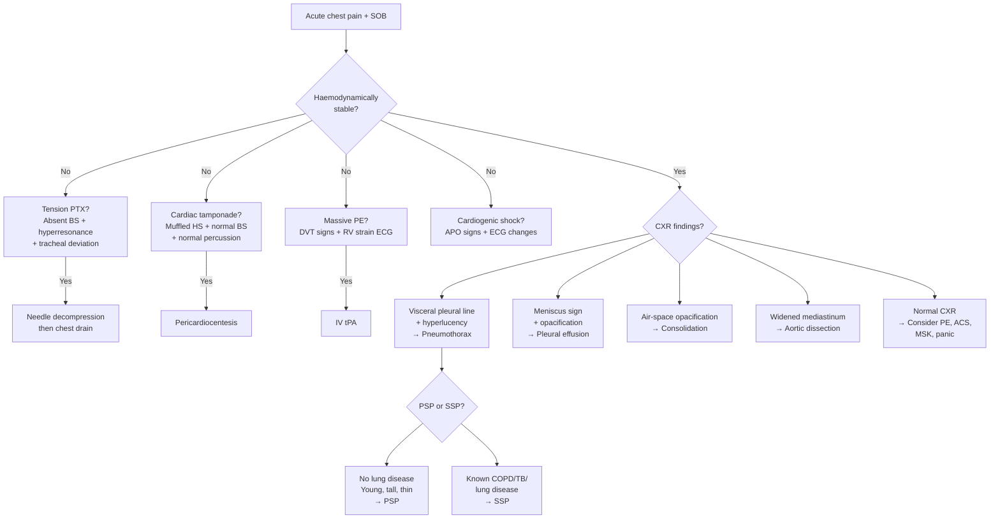

## Differential Diagnosis of Pneumothorax

The real clinical challenge is rarely "Is this a pneumothorax?" once you see the CXR. The challenge is at the **bedside**, before imaging, when a patient walks in (or is wheeled in) with **sudden-onset chest pain ± dyspnoea**. You need a structured differential that covers the dangerous diagnoses first and works down to the benign ones. Let's build this from first principles.

---

### 1. Why Differential Diagnosis Matters for Pneumothorax

Pneumothorax presents with two cardinal symptoms — **sudden-onset pleuritic chest pain** and **dyspnoea**. Neither is specific. The same presentation can be caused by conditions ranging from immediately lethal (tension PTX, massive PE, aortic dissection) to entirely benign (musculoskeletal pain, panic attack). Your job is to **risk-stratify** before the CXR comes back.

The DDx framework naturally divides into two clinical scenarios:
1. **Acute chest pain** — where pneumothorax sits alongside other thoracic emergencies
2. **Acute dyspnoea** — where pneumothorax competes with pulmonary, cardiac, and metabolic causes

---

### 2. Differential Diagnosis of Acute Chest Pain (Where Pneumothorax Sits)

This is the classic exam table. Pneumothorax lives among the "sudden onset, maximal at onset" group [12][13][14].

#### ***Potentially severe or life-threatening causes*** [13][14]

| Diagnosis | Pain Character | Key Distinguishing Features | Why It Mimics PTX |
|---|---|---|---|
| ***Acute coronary syndrome (ACS)*** | Dull, crushing, central, radiating to jaw/arm | ECG changes (ST elevation/depression), ↑troponin, risk factors (HTN, DM, smoking, hyperlipidaemia) | Both cause acute chest pain + SOB; but ACS pain is ***typically dull and constricting*** vs PTX is ***sharp and pleuritic*** [12][13] |
| ***Aortic dissection*** | ***Tearing pain radiating to back***, maximal at onset | BP differential between arms, widened mediastinum on CXR, aortic regurgitation murmur | Sudden onset and severity mimic PTX; but dissection pain is ***tearing*** and ***radiates to the back*** [12] |
| ***Acute pulmonary embolism (PE)*** | ***Sharp, pleuritic***, ± haemoptysis | Risk factors for DVT (immobilization, surgery, OCP), sinus tachycardia, S1Q3T3 on ECG, ↑D-dimer, CTPA positive | ***The closest mimic*** — both cause sudden pleuritic pain + SOB + tachycardia. PE has ***haemoptysis*** and ***DVT signs***; PTX has ***absent breath sounds and hyperresonance*** [12][15] |
| ***Tension or massive pneumothorax*** | Sharp, pleuritic, unilateral | Absent breath sounds, hyperresonance, tracheal deviation, obstructive shock | This is the severe end of the pneumothorax spectrum itself |
| ***Pneumonia*** | Pleuritic (due to pleural inflammation) | Fever, productive cough, crackles/bronchial breathing, consolidation on CXR, ↑WCC/CRP | Pleuritic pain overlaps; but pneumonia has ***dullness to percussion*** (opposite of PTX hyperresonance) and ***fever*** [16] |
| ***Myopericarditis ± cardiac tamponade*** | Sharp, pleuritic, positional (better sitting forward) | Pericardial rub, diffuse ST elevation on ECG, pericardial effusion on echo; tamponade: Beck's triad | Pleuritic pain mimics PTX; but pericarditis is ***positional*** (worse lying flat) and has ***widespread ECG changes*** |
| ***Acute decompensated heart failure*** | Chest tightness, dyspnoea | Bilateral crackles, ↑JVP, peripheral oedema, gallop rhythm, cardiomegaly on CXR | SOB overlaps; but HF has ***bilateral crackles*** and ***cardiomegaly***, not unilateral absent breath sounds |

#### ***Relatively benign causes*** [13][14]

| Diagnosis | Pain Character | Key Distinguishing Features | Why It Mimics PTX |
|---|---|---|---|
| ***Small pneumothorax*** | Mild pleuritic pain | Self-limiting, minimal haemodynamic compromise | Small PTX itself — the benign end of the spectrum |
| ***GERD*** | ***Retrosternal burning*** | Worse after meals/lying down, relieved by antacids, no respiratory signs | Retrosternal chest pain; but ***no respiratory signs*** and ***burning quality*** [12] |
| ***Musculoskeletal pain*** | Sharp, localized, ***reproducible with palpation*** | History of exertion or trauma, tender on palpation (e.g., costochondritis — Tietze syndrome) | Sharp chest pain; but ***pain after exertion*** (not during), ***reproducible*** with movement/palpation [12] |
| ***Panic attack*** | Variable, often described as "chest tightness" | Hyperventilation, perioral/digital paraesthesiae, no objective respiratory findings, resolves spontaneously | SOB + chest pain in a young patient; but examination and investigations are ***completely normal*** |
| ***Episode of stable angina*** | Dull, exertional, relieved by rest/nitrates | Predictable relationship with exertion, lasts < 5–10 min | Chest pain with SOB; but ***predictable with exertion*** and ***relieved by rest*** |

<Callout title="The Big Five of Acute Chest Pain" type="idea">
In any exam question about acute chest pain, always consider the ***"big five" life-threatening diagnoses*** [13][14]:
1. **ACS** — crushing central pain, ECG + troponin
2. **Aortic dissection** — tearing back pain, BP differential
3. **Pulmonary embolism** — pleuritic pain + DVT risk factors
4. **Tension pneumothorax** — absent breath sounds + shock
5. **Cardiac tamponade** — Beck's triad (muffled hearts sounds, ↑ JVP, hypotension)

Rule these out first, then consider benign causes.
</Callout>

---

### 3. Differential Diagnosis of Acute Dyspnoea (Where Pneumothorax Sits)

Pneumothorax also presents primarily with **dyspnoea**, especially in SSP where pain may be less prominent [2][17].

| Category | Differential | Key Distinguishing Features |
|---|---|---|
| **Respiratory — Acute** | ***Pneumothorax*** | Absent breath sounds + hyperresonance |
| | ***PE*** | DVT signs, ↑D-dimer, CTPA |
| | ***Acute severe asthma*** | Diffuse bilateral wheeze, history of asthma, response to bronchodilators |
| | ***AECOPD*** | Known COPD, productive cough, bilateral wheeze ± crackles |
| | ***Pneumonia*** | Fever, productive cough, consolidation signs |
| **Respiratory — Subacute** | Pleural effusion | Stony dull percussion, ↓ breath sounds (cf. hyperresonant in PTX) |
| | TB | Chronic cough, night sweats, weight loss |
| **Cardiac** | ***Acute pulmonary oedema (APO)*** | Bilateral fine crackles, pink frothy sputum, ↑ JVP, gallop rhythm [16] |
| | ***ACS*** | Central crushing pain, ECG changes |
| | ***Arrhythmia*** | Palpitations, irregular pulse, ECG diagnostic |
| **Metabolic** | ***Anaemia*** | Pallor, ↑ HR, flow murmur |
| | ***Metabolic acidosis (e.g., DKA)*** | Kussmaul breathing, ↑ anion gap, history of DM |
| | ***Hyperthyroidism*** | Tremor, weight loss, goitre, AF |
| **Neuromuscular** | Myasthenia gravis | Fatigable weakness, diplopia, ptosis |
| | Guillain-Barré syndrome | Ascending weakness, areflexia |
| **Psychological** | ***Panic attack / hyperventilation*** | Perioral paraesthesiae, sighing, normal examination [17] |

---

### 4. Differential Diagnosis Specific to Physical Signs

When you stand at the bedside, the physical examination pattern helps narrow the DDx. Here's the critical comparison table:

#### 4.1 Unilateral Absent Breath Sounds — PTX vs Pleural Effusion vs Consolidation

| Feature | Pneumothorax | Pleural Effusion | Consolidation |
|---|---|---|---|
| **Percussion** | ***Hyperresonant*** | ***Stony dull*** | ***Dull*** |
| **Breath sounds** | ↓ / Absent | ↓ / Absent | Bronchial breathing |
| **Vocal resonance** | ↓ | ↓ | ↑ (whispering pectoriloquy) |
| **Tactile vocal fremitus** | ↓ | ↓ | ↑ |
| **Tracheal position** | Pushed away (if tension/large) | Pushed away (if massive) | Central or pulled toward (if collapse) |
| **Mediastinal shift** | Away from lesion | Away from lesion (if large) | Toward lesion (if associated atelectasis) |
| **Why?** | Air reflects sound and doesn't conduct vibrations; air resonates on percussion | Fluid dampens sound and doesn't conduct vibrations; fluid is dense → dull | Solid consolidated lung transmits sound well (like a solid conductor); dense tissue → dull percussion |

<Callout title="The Percussion Test is Your Best Friend" type="idea">
When you find unilateral ↓ breath sounds, **percussion** tells you everything:
- **Hyperresonant** → Air (pneumothorax or hyperinflation)
- **Stony dull** → Fluid (pleural effusion)
- **Dull** → Solid (consolidation, mass)

This single test often clinches the bedside diagnosis before any imaging.
</Callout>

#### 4.2 Tension PTX vs Cardiac Tamponade (Obstructive Shock DDx)

Both cause obstructive shock with ↑ JVP — a favourite exam comparison [1][16].

| Feature | Tension Pneumothorax | Cardiac Tamponade |
|---|---|---|
| ***Percussion*** | ***Hyperresonant*** on affected side | ***Normal*** |
| ***Breath sounds*** | ***Absent*** on affected side | ***Normal*** |
| ***Trachea*** | ***Deviated AWAY*** from affected side | ***Central*** |
| ***Heart sounds*** | Normal | ***Muffled*** |
| ***Pulsus paradoxus*** | May be present | ***Classically present*** |
| ***Neck veins*** | ***Distended*** | ***Distended*** (Kussmaul sign) |
| ***CXR*** | Absent lung markings, mediastinal shift | Globular heart ("flask-shaped"), clear lung fields |
| ***Bedside USG*** | Absent lung sliding | Pericardial effusion, RV diastolic collapse |
| ***Treatment*** | Needle decompression → chest drain | Pericardiocentesis |

---

### 5. Differential Diagnosis by Context

#### 5.1 Post-Procedure (Iatrogenic)

After ***CVC insertion, pleural procedures, or mechanical ventilation*** [1][2][9], any acute deterioration in respiratory status should prompt consideration of iatrogenic PTX:

| Post-procedure Scenario | Differential | How to Distinguish from PTX |
|---|---|---|
| After CVC insertion (subclavian/IJV) | ***Pneumothorax***, haemothorax, hydrothorax, air embolism | CXR: PTX shows visceral pleural line; haemothorax shows blunting; hydrothorax shows fluid level [9] |
| After thoracocentesis | PTX (lung punctured), re-expansion pulmonary oedema (RPO) | RPO: cough, desaturation, unilateral alveolar shadowing on CXR; improves on clamping drain [1] |
| During mechanical ventilation | ***Barotrauma → tension PTX*** | Sudden ↑ airway pressure + ↓ SpO₂ + ↓ BP + unilateral absent breath sounds → clinical diagnosis [1][2] |
| After transthoracic lung biopsy | PTX (most common complication, up to 20%) | Post-procedure CXR; small PTX may be observed, large PTX needs aspiration/drain |

#### 5.2 Trauma Context [4][6][7][10]

***In the trauma setting ("hit by a van," "a bus hit a train," "chopped and stabbed wound in gang fight")*** [4][6][7], pneumothorax must be differentiated from:

| Condition | Key Features | How It Differs from PTX |
|---|---|---|
| ***Haemothorax*** | Dullness to percussion (blood is fluid), ↓ breath sounds | Dull (not hyperresonant); drain produces blood, not air |
| ***Flail chest*** | Paradoxical chest wall movement, multiple rib fractures (≥ 2 fractures in ≥ 2 consecutive ribs) | Visible/palpable paradoxical segment; PTX may coexist |
| ***Cardiac tamponade*** | Muffled heart sounds, ↑ JVP, hypotension (Beck's triad) | Normal percussion and breath sounds; pericardial effusion on FAST |
| ***Aortic injury/dissection*** | Widened mediastinum on CXR, BP differential, mechanism (deceleration) | CXR shows widened mediastinum, not absent lung markings |
| ***Diaphragmatic rupture*** | Bowel sounds in chest, NG tube visible in thorax on CXR | CXR may show gas-filled bowel in hemithorax; can mimic a loculated PTX |
| ***Pulmonary contusion*** | Diffuse haziness on CXR, hypoxia, no visceral pleural line | CXR shows parenchymal opacification, not hyperlucency; often coexists with PTX [11] |
| ***Oesophageal perforation (Boerhaave syndrome)*** | ***Mackler's triad: vomiting, excruciating chest pain, surgical emphysema***; left pneumothorax, left pleural effusion [10] | History of violent vomiting; pneumomediastinum on CXR; CT with contrast swallow confirms |

#### 5.3 Neonatal Context [8]

***In neonates ("the newborn baby cannot breathe")*** [8], acute respiratory distress with signs mimicking PTX:

| Condition | Distinguishing Features |
|---|---|
| ***Congenital diaphragmatic hernia (CDH)*** | Scaphoid abdomen, bowel sounds in chest, CXR shows bowel loops in thorax |
| ***Oesophageal atresia (OA)*** | Unable to pass NG tube, excessive drooling, coiled NG tube on CXR |
| ***Neonatal pneumothorax (from barotrauma)*** | During/after positive pressure ventilation; transillumination positive |
| Respiratory distress syndrome (RDS) | Premature infant, ground-glass appearance on CXR, responds to surfactant |
| Meconium aspiration | Term/post-term, meconium-stained liquor, hyperinflation + patchy opacities on CXR |
| Congenital cystic adenomatoid malformation (CPAM) | Multicystic lung mass on CXR/antenatal USS — can mimic loculated PTX |

---

### 6. Systematic DDx Decision Framework (Mermaid)

---

### 7. Key Differentiating Clues — Rapid Reference Table

| Clue | Favours Pneumothorax | Favours Alternative |
|---|---|---|
| **Onset** | Sudden, maximal at onset | Gradual buildup → ACS; post-exertional → MSK |
| **Pain quality** | Sharp, pleuritic | Dull/crushing → ACS; tearing → dissection; burning → GERD |
| **Percussion** | Hyperresonant | Dull → effusion/consolidation; normal → PE/ACS |
| **Breath sounds** | Absent/↓ unilaterally | Crackles → APO/pneumonia; wheeze → asthma/COPD; bronchial → consolidation |
| **Tracheal position** | Pushed away (tension/large) | Pulled toward → collapse/fibrosis |
| **CXR** | Visceral pleural line, no lung markings | White-out → effusion/collapse; consolidation → pneumonia; normal → PE/ACS |
| **Response to O₂** | Improves (if not tension) | No improvement → shunt (consolidation); worsens → consider Haldane effect in CO poisoning |
| **Trauma history** | Strongly favours PTX (especially with rib fractures) | Absent → consider spontaneous causes |
| **Fever** | Absent (unless coexisting infection) | Present → pneumonia, empyema |
| **Smoking/COPD history** | Strongly favours SSP if present | Absent in young → PSP vs other causes |

---

### 8. Common Exam Traps

<Callout title="Common Mistakes in DDx of Pneumothorax" type="error">

1. **Confusing PTX with pleural effusion:** Both have ↓ breath sounds, but percussion is the differentiator (hyperresonant vs stony dull). Students often forget to mention percussion in OSCE.

2. **Missing tension PTX on ventilator:** A ventilated patient who suddenly desaturates with ↑ airway pressures — always think tension PTX. The one-way valve is created because ***PPV forces air into the pleural space but the collapsed lung cannot seal the leak*** [1].

3. **Forgetting PE as the closest mimic:** PE and PTX both cause sudden pleuritic pain + SOB + tachycardia. The key is **examination** (PTX has unilateral signs; PE often has a normal chest exam) and **CXR** (PTX shows pleural line; PE shows normal or subtle signs like Hampton's hump/Westermark sign).

4. **Not considering Boerhaave syndrome:** A history of ***violent vomiting followed by chest pain + subcutaneous emphysema + left-sided pleural effusion/pneumothorax*** = think oesophageal perforation [10]. The oesophagus has **no serosa**, making it susceptible to full-thickness rupture.

5. **Forgetting CDH in neonates:** A newborn with respiratory distress and what looks like a "pneumothorax" on CXR may actually have ***bowel loops in the chest from congenital diaphragmatic hernia*** [8]. Look for the scaphoid abdomen.
</Callout>

---

<Callout title="High Yield Summary">

**DDx Framework for Pneumothorax:**

**By presenting symptom (acute chest pain):** ACS, aortic dissection, PE, tension PTX, cardiac tamponade, pneumonia, pericarditis (life-threatening); stable angina, GERD, MSK pain, small PTX, panic attack (benign).

**Key bedside differentiator:** PERCUSSION — hyperresonant = air (PTX); stony dull = fluid (effusion); dull = solid (consolidation).

**Closest mimic:** PE — both cause sudden pleuritic pain + SOB + tachycardia. Differentiate by chest exam (unilateral signs in PTX, often normal in PE) and CXR.

**Obstructive shock DDx:** Tension PTX vs cardiac tamponade — differentiate by percussion (hyperresonant vs normal), breath sounds (absent vs normal), trachea (deviated vs central), heart sounds (normal vs muffled).

**Trauma context:** Must differentiate from haemothorax (dull percussion), flail chest (paradoxical movement), cardiac tamponade, aortic injury, diaphragmatic rupture, pulmonary contusion.

**Post-procedure:** After CVC/thoracic procedure, acute respiratory deterioration = PTX until proven otherwise.

**Neonatal:** CDH (bowel in chest) can mimic PTX on CXR.

**Don't forget:** Boerhaave syndrome (vomiting + chest pain + surgical emphysema + left PTX).

</Callout>

---

<ActiveRecallQuiz
  title="Active Recall - Differential Diagnosis of Pneumothorax"
  items={[
    {
      question: "A 25-year-old man presents with sudden-onset right-sided pleuritic chest pain and SOB. On examination, breath sounds are absent on the right with hyperresonant percussion. What is the most likely diagnosis, and name 3 differential diagnoses you must exclude.",
      markscheme: "Most likely: right-sided pneumothorax (primary spontaneous given age, male). Must exclude: (1) Pulmonary embolism (pleuritic pain + SOB, but normal percussion and often normal chest exam), (2) Acute coronary syndrome (less likely given pleuritic quality, but must rule out in any acute chest pain), (3) Pneumonia with parapneumonic effusion (but this gives dull percussion, not hyperresonant). Accept also: aortic dissection, pericarditis.",
    },
    {
      question: "How do you differentiate pneumothorax from pleural effusion at the bedside using physical examination alone? Explain the pathophysiological basis for each difference.",
      markscheme: "Key differentiator is percussion: PTX = hyperresonant (air resonates freely in pleural space), effusion = stony dull (fluid is dense and does not resonate). Both have decreased/absent breath sounds and decreased vocal resonance (air and fluid both impair sound transmission). Trachea may be pushed away in both if large. Tactile vocal fremitus decreased in both. The physical basis: sound transmission requires a medium with similar impedance to tissue; both air and fluid create an impedance mismatch that reflects sound.",
    },
    {
      question: "A ventilated ICU patient suddenly desaturates with rising airway pressures, hypotension, and absent breath sounds on the left. What is your immediate diagnosis and action? Why is this complication particularly dangerous in ventilated patients?",
      markscheme: "Diagnosis: tension pneumothorax. Immediate action: needle decompression with 14G needle at 2nd ICS mid-clavicular line (or 4th/5th ICS mid-axillary line), followed by chest drain. Particularly dangerous because positive pressure ventilation creates a one-way valve: PPV forces air into the pleural space through the lung defect during inspiration, but the collapsed lung cannot seal during expiration. Each ventilator breath adds more air, rapidly converting a simple PTX to tension physiology. Do NOT wait for CXR.",
    },
    {
      question: "Name the condition associated with violent vomiting followed by left-sided chest pain, subcutaneous emphysema, and left pneumothorax. Explain why the left side is preferentially affected.",
      markscheme: "Boerhaave syndrome (spontaneous oesophageal perforation). The full-thickness rupture occurs most commonly at the left posterolateral aspect of the distal oesophagus because: (1) the left posterolateral wall is anatomically the weakest point, (2) it is the last portion of the oesophagus before the GEJ, receiving maximal intraluminal pressure during vomiting, (3) the oesophagus has no serosa making it susceptible to perforation. Mackler triad: vomiting + chest pain + surgical emphysema.",
    },
    {
      question: "In a neonate with respiratory distress, how would you differentiate congenital diaphragmatic hernia from neonatal pneumothorax on CXR?",
      markscheme: "CDH: CXR shows bowel loops (gas-filled structures with haustral/valvulae conniventes pattern) in the hemithorax, mediastinal shift to contralateral side, scaphoid abdomen on examination, NG tube may be seen in the thorax. Neonatal PTX: CXR shows visceral pleural line with hyperlucency and no lung markings beyond it, no bowel gas pattern. Transillumination is positive in PTX (light transmits through air-filled pleural space). CDH has absent/reduced air entry and may have bowel sounds on chest auscultation.",
    },
  ]}
/>

## References

[1] Senior notes: Ryan Ho Respiratory.pdf (Section 3.7 Pneumothorax, p151–155)
[2] Senior notes: Maksim Medicine Notes.pdf (Section 12.6 Pleural diseases - Pneumothorax, p291)
[4] Lecture slides: GC 175. A bus hit a train Multiple trauma; Disaster management.pdf
[6] Lecture slides: GC 182. Chopped and stabbed wound in gang fight Nerves and vascular injury; Classification of injuries.pdf
[7] Lecture slides: GC 188. Hit by a van, in shock with internal bleeding Abdominal injury.pdf
[8] Lecture slides: GC 204. The newborn baby cannot breathe Oesophageal atresia, diaphragmatic hernia, and other surgery of lung.pdf
[9] Senior notes: Ryan Ho Fluids and Nutrition.pdf (Section on TPN complications, p11)
[10] Senior notes: Maksim Surgery Notes.pdf (Section 2.1 Trauma, p42; Esophageal perforation, p59)
[11] Senior notes: Ryan Ho Radiology.pdf (Section 1.1 Chest Trauma, p2)
[12] Senior notes: Ryan Ho Cardiology.pdf (Section 2.1 Chest Pain, p54–57)
[13] Senior notes: Ryan Ho Cardiology.pdf (Section 2, Approach to Acute Chest Pain, p58)
[14] Senior notes: Ryan Ho Fundamentals.pdf (Section 3.1.1 Chest Pain, p199–203)
[15] Senior notes: Ryan Ho Haemtology.pdf (Section on VTE, p131)
[16] Senior notes: Ryan Ho Critical Care.pdf (Section on Breathing emergencies, p14)
[17] Senior notes: Maksim Medicine Notes.pdf (Section 12.1 Clinical approach - Dyspnoea, p280)
