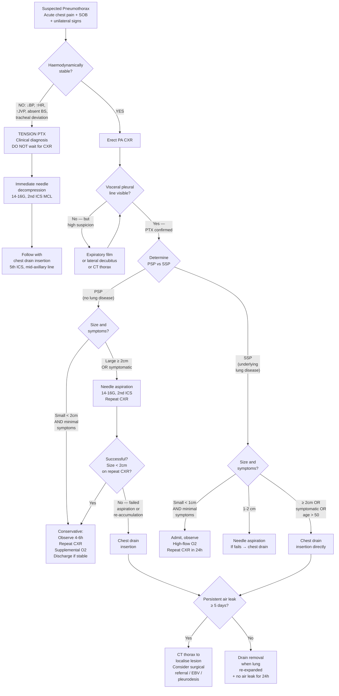
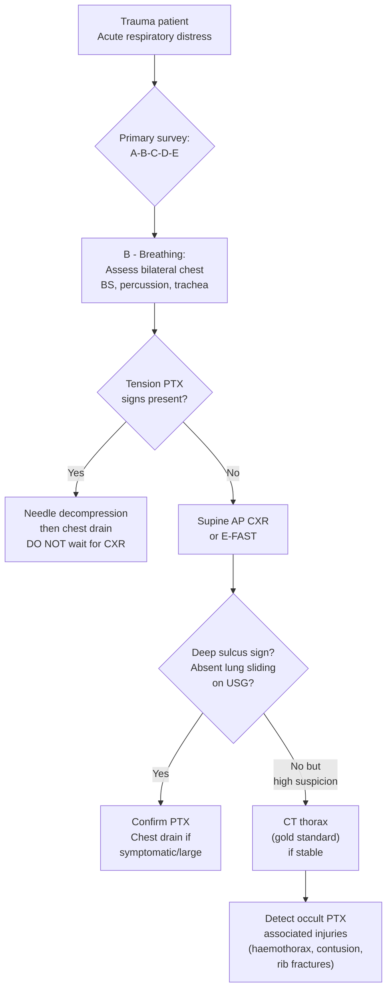

## Diagnostic Criteria, Algorithm, and Investigations for Pneumothorax

### 1. Diagnostic Criteria — What Confirms a Pneumothorax?

Unlike many medical conditions (e.g., rheumatoid arthritis, SLE) that have formal consensus diagnostic criteria with scoring systems, pneumothorax does not have "diagnostic criteria" in the traditional sense. Instead, diagnosis is based on a combination of **clinical assessment** and **imaging confirmation** — except in one critical scenario where imaging must NOT be awaited.

#### 1.1 Clinical Diagnosis (No Imaging Required)

***Tension pneumothorax is a clinical diagnosis*** [1][2]. You diagnose and treat it at the bedside:

| Required Element | Finding |
|---|---|
| Clinical context | Trauma, mechanical ventilation, post-procedure, or spontaneous |
| ***Severe respiratory distress*** | Tachypnoea, cyanosis |
| ***Obstructive shock signs*** | ***Hypotension, elevated JVP, marked tachycardia, sweating*** [2] |
| ***Unilateral chest signs*** | ***Absent breath sounds + hyperresonance on affected side*** |
| ***Mediastinal shift*** | ***Contralateral tracheal deviation*** [1] (***may be absent if mediastinum is splinted by malignancy/scarring*** [1]) |

<Callout title="Tension PTX — DO NOT Wait for CXR" type="error">
***Tension pneumothorax should NOT be diagnosed based on CXR*** [1]. If you clinically suspect it — absent breath sounds, hyperresonance, shock, tracheal deviation — proceed immediately to ***needle decompression***. Waiting for imaging wastes time and the patient may arrest from obstructive shock. This is the only pneumothorax that is diagnosed purely clinically.
</Callout>

#### 1.2 Imaging-Confirmed Diagnosis (All Non-Tension PTX)

For all other pneumothoraces, the diagnosis rests on **imaging** that demonstrates air in the pleural space:

| Modality | Diagnostic Finding | When to Use |
|---|---|---|
| ***Erect PA CXR*** | ***Visible visceral pleural edge + radiolucency with no lung markings peripheral to lung edge*** [2][11][18] | **First-line** — standard diagnostic investigation for suspected PTX |
| ***Expiratory film*** | ***Accentuates the degree of lung collapse*** — makes the visceral pleural line more conspicuous [18][19] | When inspiratory CXR is equivocal |
| ***Lateral decubitus film*** | Suspected side UP — air rises to the non-dependent hemithorax [2] | When erect CXR is equivocal; distinguish from effusion (effusion: suspected side DOWN) |
| ***Supine AP CXR*** | ***Deep sulcus sign, double diaphragm sign, relative hemithorax lucency*** [11] | Trauma/immobilised patients — more difficult to interpret |
| CT thorax | Gold standard for detection; identifies small/occult PTX, blebs, underlying lung disease | When CXR is equivocal, post-procedure evaluation, or to plan surgical intervention |
| Bedside lung ultrasound | Absent lung sliding, absent comet-tail artefacts, "lung point" sign | Rapid bedside assessment, especially in trauma (E-FAST) and ICU |

> **Key principle:** A pneumothorax is confirmed when imaging demonstrates the **visceral pleural line** separated from the chest wall by a space devoid of lung markings. The visceral pleura appears as a thin white line running parallel to the chest wall. Peripheral to this line = air only (black, no vascular markings). Medial to this line = normal lung parenchyma.

#### 1.3 Size Classification (BTS 2023 / HK Practice)

Once confirmed, the pneumothorax must be **sized**, as this determines management:

| Size | BTS Definition | Volume Estimation |
|---|---|---|
| ***Small*** | ***< 2 cm*** interpleural distance at the hilum on erect PA CXR [2] | Approximately < 50% hemithorax |
| ***Large*** | ***≥ 2 cm*** interpleural distance at the hilum on erect PA CXR [2] | Approximately ≥ 50% hemithorax |

***Quantification formula*** [2]:
> ***% pneumothorax = (1 − [average lung diameter³ / average hemithorax diameter³]) × 100%***

***Approximation: 1 cm on PA CXR ≈ 27% hemithorax volume*** [2]

Why is this formula cubic? Because volume is a three-dimensional quantity — when the lung shrinks by a certain linear distance from the chest wall, the volume change scales with the **cube** of that distance (V = 4/3 πr³ for a sphere-like structure).

<Callout title="BTS vs ACCP Size Thresholds">
**BTS** (used in HK): measures interpleural distance **at the hilum level** — small < 2 cm, large ≥ 2 cm.
**ACCP** (American): measures interpleural distance **at the apex** — small < 3 cm, large ≥ 3 cm.
These are different measurement points and should not be confused. HKU/HK practice generally follows **BTS guidelines**.
</Callout>

---

### 2. Diagnostic Algorithm

The management algorithm is inherently linked to the diagnostic pathway because the decision to investigate vs. treat immediately depends on haemodynamic stability and clinical severity. Below is the comprehensive diagnostic-management decision tree based on BTS 2023 guidelines (which HK follows):

<Callout title="Key Decision Points in the Algorithm" type="idea">

1. **Haemodynamic stability** is assessed FIRST — this determines whether you go straight to needle decompression (tension PTX) or proceed with orderly imaging.

2. **PSP vs SSP** distinction matters because SSP patients have less reserve:
   - ***PSP: chest drain if ≥ 2 cm or symptomatic*** [2]
   - ***SSP: chest drain if ≥ 1 cm or symptomatic*** [2]
   - This lower threshold for SSP reflects the fact that even a small PTX can cause respiratory failure in patients with pre-existing lung disease.

3. **Needle aspiration** is attempted FIRST in PSP (large or symptomatic) because many will resolve without requiring a chest drain. In SSP, aspiration can be tried for intermediate sizes (1–2 cm) but the threshold for proceeding to a drain is lower.

4. ***Bilateral PTX and haemodynamically unstable patients*** always get ***chest drains*** [2].

</Callout>

---

### 3. Investigation Modalities — Detailed Guide

#### 3.1 Chest X-Ray (CXR) — First-Line Investigation

***The erect PA CXR is the standard first-line diagnostic investigation for pneumothorax*** [2][11][18][19].

**Why erect PA?** In an erect patient, air rises to the apex of the hemithorax, where it is most easily seen as a visceral pleural line. The PA projection provides better spatial accuracy than AP because the X-ray source is further from the patient (standard 6-foot distance), reducing magnification artifact.

##### Key CXR Findings in Pneumothorax

| Finding | Description | Pathophysiological Basis |
|---|---|---|
| ***Visible visceral pleural edge*** | ***Thin white line running parallel to chest wall*** [11][19] | The visceral pleura itself — air on both sides (pleural space air laterally, lung air medially) makes it visible as a line |
| ***Radiolucency with no lung markings peripheral to lung edge*** [2][11] | Black area beyond the pleural line with no vascular markings | Air in pleural space contains no vessels — therefore no lung markings |
| ***± lung collapse*** [11] | Lung retracted toward hilum, appearing as a density medially | Elastic recoil pulls the unsupported lung inward |
| ***± mediastinal shift*** [11] | Heart and trachea shifted to contralateral side | Large or tension PTX: positive pressure pushes mediastinum away |
| ***Blunted CP angle*** | Loss of normal sharp costophrenic angle [2] | ***Bleeding from torn pleural vessels → haemopneumothorax*** [2]; blood layers dependently |
| Subcutaneous emphysema | Air in soft tissues of chest wall (tracking along tissue planes) | Air from pleural space dissects through parietal pleura into subcutaneous tissue |

##### Erect CXR vs Supine CXR

| Feature | Erect PA CXR | Supine AP CXR |
|---|---|---|
| Air location | Rises to **apex** | Rises **anteriorly** (not visible at apex) |
| Classic finding | Visceral pleural line at apex/laterally | ***Deep sulcus sign*** (most reliable) [11] |
| Sensitivity | ~80% for moderate-large PTX | Much lower — ***easily missed*** [11] |
| When used | Standard — any ambulatory patient | ***Trauma — patients on spinal board*** [11] |

***Supine CXR findings*** [11]:
- ***Deep sulcus sign: deep tongue-like costophrenic sulcus*** — air collects at the most anterior and inferior part of the pleural space
- ***Double diaphragm sign: visualization of anterior costophrenic sulcus*** — creates a second "diaphragm" line
- ***↑ sharpness of adjacent mediastinal margin, diaphragm and cardiac borders*** — air provides high-contrast interface
- ***Depression of ipsilateral hemidiaphragm*** — pressure from trapped air
- ***Relative lucency of the involved hemithorax*** — the overall hemithorax appears blacker

##### Special CXR Techniques

| Technique | How It Helps | Physics |
|---|---|---|
| ***Expiratory film*** | ***Accentuates degree of lung collapse*** [18][19] | During expiration, lung volume ↓ → the relative size of the pneumothorax space ↑ → more conspicuous pleural line |
| ***Lateral decubitus film (suspected side UP)*** [2] | Air rises to the non-dependent hemithorax, becoming more visible | Gravity moves air to the uppermost point; opposite to effusion technique (suspected side DOWN) |

##### CXR Quality Assessment Checklist [19]

Before interpreting any CXR, systematically check:
- ***Name, date, L/R label*** (rule out dextrocardia) [19]
- ***Adequacy of inspiration:*** count ***10 posterior ribs + 6 anterior ribs*** [19]
- ***Rotation:*** medial ends of clavicle equidistant from spinous process [19]
- ***Penetration:*** retrocardiac window and T-spine outline just visible [19]

Then look for:
- ***Lung border: retracted in pneumothorax*** [19]
- Costophrenic angles: blunted in effusion/haemothorax
- Cardiac silhouette: enlarged in cardiomegaly
- Bony lesions: rib fractures (traumatic PTX)
- ***Loss of silhouette sign***: pathology → ↑ density of lung fields → ↓ contrast with overlying structure [19]

<Callout title="Exam Pitfall: Skin Fold vs Visceral Pleural Line" type="error">
A common mistake is confusing a **skin fold** on CXR with a visceral pleural line. The differences:
- **Visceral pleural line:** Thin, sharp, runs parallel to chest wall, no lung markings BEYOND the line
- **Skin fold:** Thicker, may not run parallel, lung markings are visible BEYOND the fold (because it's just a superficial artefact)

If in doubt, order a **CT thorax** — this is the gold standard and will definitively show even tiny amounts of pleural air.
</Callout>

---

#### 3.2 CT Thorax — Gold Standard

CT thorax is the **most sensitive and specific** imaging modality for pneumothorax. It can detect even tiny amounts of pleural air invisible on CXR.

##### Indications for CT in Pneumothorax

| Indication | Rationale |
|---|---|
| Equivocal CXR with high clinical suspicion | CT resolves ambiguity (skin fold vs pleural line, bullae vs PTX) |
| **Occult pneumothorax** in trauma | Up to 50% of traumatic PTX are missed on supine CXR but detected on CT [11] |
| Planning for **surgical intervention** | Identifies blebs/bullae location, extent of lung disease, contralateral lung status |
| ***Persistent air leak (≥ 5 days)*** | ***CT thorax to localise lesion*** before considering EBV or surgical pleurodesis [2] |
| SSP — identifying underlying lung disease | COPD bullae, TB cavities, lung cysts (LAM, LCH), malignancy |
| Recurrent PTX evaluation | Determine if blebs/bullae are present bilaterally, plan definitive surgery |
| Suspected associated pathology | Haemothorax, mediastinal injury, oesophageal perforation |

##### CT Protocol in Trauma [10][11]

***CT is the gold standard for head and body trauma*** [11]:
- ***IV contrast is needed*** unless contraindicated [11]
- ***Arterial phase:*** for bleeding points and pseudoaneurysm
- ***Portovenous phase (most important):*** visceral injury
- ***Delayed phase:*** urinary extravasation
- ***Lung and bone window:*** **lung window** is essential for detecting pneumothorax — the different window/level settings optimise contrast for air (lung window) vs soft tissue vs bone

##### CT Findings

| Finding | Significance |
|---|---|
| Air in pleural space | Confirms PTX; quantifies size more accurately than CXR |
| Subpleural blebs/bullae (usually apical) | Identifies the likely source of air leak; important for surgical planning |
| Underlying lung disease | COPD (emphysema, bullae), TB (cavities, fibrosis), cystic lung disease (LAM, LCH), malignancy |
| Pneumomediastinum | Air tracking along mediastinal structures; may indicate proximal airway injury or Macklin effect |
| Associated injuries (trauma) | Rib fractures, haemothorax, pulmonary contusion, aortic injury |
| Loculated collections | Suggest previous adhesions or empyema; important for drain positioning |

---

#### 3.3 Bedside Lung Ultrasound (Point-of-Care USG)

Lung ultrasound has become increasingly important, especially in **trauma** (as part of ***E-FAST — Extended FAST***) and **ICU** settings [11][16].

##### Ultrasound Findings in Pneumothorax

| Finding | Normal Lung | Pneumothorax | Explanation |
|---|---|---|---|
| **Lung sliding** | Present — shimmering movement at pleural line with respiration | ***Absent*** — no movement at pleural line | Normally, the visceral pleura slides against the parietal pleura during breathing. Air between the layers prevents this sliding. |
| **Comet-tail artefacts (B-lines)** | Present — vertical hyperechoic lines from pleural line | ***Absent*** | B-lines arise from the acoustic interface of aerated lung against the pleura. Air in the pleural space eliminates this interface. |
| **"Lung point" sign** | Not applicable | ***Present — transition point where lung sliding appears and disappears*** | The "lung point" is where the edge of the collapsed lung intermittently touches the chest wall. It is ***pathognomonic*** for pneumothorax and can estimate the size of PTX. |
| **"Seashore sign" (M-mode)** | Normal pattern — granular pattern below pleural line | Replaced by ***"stratosphere sign" (barcode sign)*** — horizontal parallel lines | In M-mode, normal lung movement creates a granular pattern; absence of movement (air in pleural space) creates uniform horizontal lines. |

##### ***FAST/E-FAST in Trauma*** [10][11]

The ***thoracic views*** of the FAST scan specifically look for ***pneumothorax and haemothorax*** [11]:

| E-FAST View | What to Look For |
|---|---|
| ***Pericardial window*** | ***Pericardial effusion*** |
| ***R flank*** | ***Morrison's pouch, subphrenic, pleural, right paracolic gutter*** |
| ***L flank*** | ***Splenorenal space, subphrenic, pleural, left paracolic gutter*** |
| ***Pelvis*** | ***Pouch of Douglas / rectovesical space*** |
| ***± Thoracic (left and right)*** | ***Pneumothorax and haemothorax*** [11] |

<Callout title="Ultrasound Sensitivity for PTX">
Lung ultrasound has a **sensitivity of ~90–95%** and **specificity of ~98–100%** for pneumothorax — significantly better than supine CXR (~50% sensitivity). It is faster than CXR, radiation-free, and can be done at the bedside. However, it is **operator-dependent** and may miss small posterior pneumothoraces. CT remains the gold standard when ultrasound is inconclusive.
</Callout>

---

#### 3.4 Arterial Blood Gas (ABG) / Venous Blood Gas (VBG)

ABG is not diagnostic for pneumothorax itself but is essential for **assessing the physiological impact**:

| Finding | Interpretation | When Seen |
|---|---|---|
| ↓ PaO₂ (hypoxaemia) | V/Q mismatch — collapsed lung is perfused but not ventilated | Any significant PTX; worse in SSP |
| Normal or ↓ PaCO₂ | Compensatory hyperventilation driving down CO₂ | Small-moderate PTX in patients with normal lung reserve |
| ↑ PaCO₂ (hypercapnia) | Alveolar hypoventilation — insufficient remaining lung for CO₂ clearance | Large PTX, bilateral PTX, or SSP with pre-existing poor reserve (Type 2 respiratory failure) |
| ***↑ A-a gradient*** | Confirms intrapulmonary pathology (V/Q mismatch or shunt) as the cause of hypoxaemia, rather than pure hypoventilation | Present in PTX (V/Q mismatch); helps distinguish from neuromuscular causes of respiratory failure where A-a gradient is normal |
| ***Lactic acidosis*** | ***Poor tissue perfusion*** [16] | Tension PTX with obstructive shock |
| Respiratory alkalosis | Hyperventilation → ↓ PaCO₂ → ↑ pH | Common in acute PTX with pain and anxiety |

---

#### 3.5 Blood Investigations

Blood tests do not diagnose pneumothorax but serve to:
1. **Exclude differentials** (e.g., PE, ACS)
2. **Assess physiological impact** of the PTX
3. **Identify underlying causes** (e.g., infections in SSP)
4. **Prepare for intervention** (e.g., clotting before chest drain)

| Investigation | Findings/Role | Reasoning |
|---|---|---|
| ***CBC*** | ↑ WCC (if infective cause of SSP, e.g., TB, PCP); anaemia if associated haemothorax [16] | Baseline; r/o haemorrhage |
| ***CRP/ESR*** | ↑ in infective/inflammatory SSP | Non-specific marker of inflammation |
| ***Clotting profile (PT/INR, aPTT)*** | Baseline before chest drain insertion; identify bleeding risk | Essential before any invasive procedure |
| ***Renal function (U&E/Cr)*** | Baseline; ↑ U/Cr in shock-induced AKI [16] | Assess end-organ perfusion |
| ***LFT*** | ↑ ALT/AST in "shock liver" from tension PTX [16] | Assess end-organ perfusion |
| ***Cardiac enzymes (troponin)*** | R/o ACS as differential; may be mildly elevated in tension PTX (demand ischaemia) [16] | Distinguish from MI |
| ***D-dimer*** | R/o PE as differential [16] | Sensitive but not specific; mainly used to exclude PE |
| ***ABG/VBG + lactate*** | As above — assess ventilation, oxygenation, perfusion [16] | Guide O₂ therapy and ventilatory support |

---

#### 3.6 ECG

ECG is not diagnostic for pneumothorax but is performed to **exclude other causes of acute chest pain** (ACS, PE, pericarditis) [13][16]:

| Finding | Interpretation |
|---|---|
| ***Sinus tachycardia*** | Most common ECG finding in PTX — sympathetic response to pain/hypoxia |
| ***Right axis deviation*** | Large right-sided PTX or tension PTX — right heart strain |
| ***Low-voltage QRS*** | Air in pleural space insulates the heart from chest wall electrodes |
| ***Precordial T-wave inversion (V1–V3)*** | Right heart strain pattern (can mimic PE or ACS) |
| ***Rightward shift of precordial transition zone*** | Air in left hemithorax shifts the electrical axis |
| ***ST changes*** | Can mimic ACS — but transient and resolve after PTX treatment |
| R/o ACS: ST elevation/depression | Must exclude ACS in any acute chest pain [13] |
| R/o PE: ***S1Q3T3***, RBBB | Right heart strain pattern of PE [16] |
| R/o pericarditis: diffuse concave ST elevation + PR depression | Pericarditis pattern |

<Callout title="ECG Pitfall in Left PTX" type="error">
A large **left-sided pneumothorax** can cause precordial voltage changes and axis shifts that mimic anterior MI. Always correlate with the CXR! If the "ST changes" resolve after PTX drainage, they were a pneumothorax artefact, not true ischaemia.
</Callout>

---

#### 3.7 Additional Investigations for Underlying Cause (Especially SSP)

| Investigation | When | Purpose |
|---|---|---|
| HRCT thorax | SSP — to identify underlying disease | Detect COPD bullae, TB cavities, cystic lung disease, malignancy |
| Sputum AFB + TB culture | SSP in TB-endemic region (HK) | Rule out active TB as cause |
| HIV test | Young patient with PCP-type presentation | PCP-associated PTX |
| α₁-antitrypsin level | Young Caucasian with emphysema pattern | Rare cause of emphysema → bullae → PTX |
| Genetic testing (FLCN gene) | Basilar lung cysts + family history + skin lesions | Birt-Hogg-Dubé syndrome |
| Hormonal assessment | Catamenial PTX (recurrent, right-sided, menstrual) | Endometriosis evaluation |

---

### 4. Approach to Specific Diagnostic Scenarios

#### 4.1 Trauma Patient

#### 4.2 Post-Procedure (Iatrogenic)

| Scenario | Investigation | Action |
|---|---|---|
| After CVC insertion | ***CXR mandatory post-procedure*** [9] | Confirm line position + r/o PTX, haemothorax, hydrothorax |
| After transthoracic biopsy | CXR at 1h and 4h post-procedure | PTX is the most common complication (~20%); most are small and self-limiting |
| During mechanical ventilation | Clinical assessment + bedside USG + portable CXR | Sudden ↑ airway pressure + ↓ SpO₂ + ↓ BP = tension PTX until proven otherwise |
| After thoracocentesis | Repeat CXR | R/o PTX (2–15% complication rate) [20] |

#### 4.3 Persistent Air Leak (PAL) — Special Diagnostic Consideration

***Definition: air leak ≥ 5 days despite chest drain*** [2]

When air continues to bubble through the underwater seal:
- ***CT thorax to localise the lesion*** [2]
- Consider ***bronchoscopy*** — can identify the specific segmental/lobar bronchus responsible for the leak
- ***Endobronchial valve (EBV)*** may be placed under bronchoscopic guidance — a ***one-way valve that intentionally collapses the affected lung lobe → remove 6 weeks after recovery (foreign body)*** [2]

---

### 5. Summary Table of Investigations

| Investigation | Role in PTX Diagnosis | Key Findings | Sensitivity |
|---|---|---|---|
| ***Erect PA CXR*** | **First-line diagnostic** | Visceral pleural line + hyperlucency | ~80% for moderate-large PTX |
| ***Expiratory film*** | Adjunct — enhances detection | ***Accentuates lung collapse*** [18][19] | Better than inspiratory for small PTX |
| ***Lateral decubitus*** | Adjunct — equivocal cases | Air rises to non-dependent side [2] | Good for small PTX |
| ***Supine AP CXR*** | Trauma setting | Deep sulcus sign, double diaphragm sign [11] | ~50% — easily missed |
| ***CT thorax*** | **Gold standard** | Detects any pleural air + underlying disease | ~100% |
| ***Bedside USG*** | Rapid bedside assessment | Absent lung sliding, lung point [11][16] | 90–95% |
| ***ABG*** | Physiological impact | Hypoxaemia, ↑ A-a gradient, ± lactic acidosis | N/A (supportive) |
| ***ECG*** | R/o differentials | Sinus tachycardia, axis shift, r/o ACS/PE [16] | N/A (supportive) |
| ***Blood tests*** | R/o differentials + pre-procedure | CBC, clotting, cardiac enzymes, D-dimer [16] | N/A (supportive) |
| ***HRCT*** | Identify underlying lung disease (SSP) | Blebs, bullae, cysts, cavities, malignancy | N/A (aetiological) |

---

<Callout title="High Yield Summary">

**Tension PTX** = ***clinical diagnosis*** — do NOT wait for CXR. Treat immediately with needle decompression.

**All other PTX** = diagnosed by ***erect PA CXR*** (first-line) showing ***visceral pleural line + hyperlucency without lung markings***.

**Equivocal CXR** → ***expiratory film*** (accentuates collapse) or ***lateral decubitus*** (suspected side up) or ***CT thorax*** (gold standard).

**Supine CXR** (trauma) → look for ***deep sulcus sign*** (most reliable), double diaphragm sign, relative hemithorax lucency. Easily missed.

**CT thorax** = gold standard for detection + underlying cause identification. Essential for ***persistent air leak (≥ 5 days)*** to localise lesion.

**Bedside USG** = absent lung sliding + absent B-lines + lung point sign (pathognomonic). Sensitivity 90–95% — better than supine CXR.

**Size on CXR (BTS):** Small < 2 cm at hilum; Large ≥ 2 cm. ***1 cm ≈ 27% hemithorax volume.***

**Key bloods:** Not diagnostic but essential — ABG (hypoxaemia, A-a gradient), CBC, clotting (pre-procedure), cardiac enzymes (r/o ACS), D-dimer (r/o PE).

**ECG:** Sinus tachycardia most common; left PTX can mimic anterior MI — correlate with CXR.

**Post-CVC CXR is mandatory** to rule out iatrogenic PTX.

</Callout>

---

<ActiveRecallQuiz
  title="Active Recall - Pneumothorax: Diagnosis and Investigations"
  items={[
    {
      question: "On an erect PA CXR, what is the key diagnostic finding for pneumothorax? Why are lung markings absent beyond this line?",
      markscheme: "Key finding: visible visceral pleural edge (thin white line) with radiolucency and no lung markings peripheral to the lung edge. Lung markings are absent because the pleural space contains only air with no blood vessels. Lung markings represent pulmonary vasculature which only exists within the lung parenchyma, medial to the visceral pleural line.",
    },
    {
      question: "Name 3 CXR signs of pneumothorax on a SUPINE film and explain why standard erect signs are unreliable in this position.",
      markscheme: "Signs: (1) Deep sulcus sign - deep tongue-like costophrenic sulcus (most reliable), (2) Double diaphragm sign - visualization of anterior costophrenic sulcus, (3) Relative lucency of involved hemithorax, (4) Increased sharpness of mediastinal/cardiac borders, (5) Depression of ipsilateral hemidiaphragm. Standard erect signs are unreliable because in the supine position, air rises anteriorly rather than apically. The classic visceral pleural line at the apex or laterally is not visible because air distributes along the anterior chest wall.",
    },
    {
      question: "Describe the 'lung point' sign on bedside ultrasound. Why is it considered pathognomonic for pneumothorax?",
      markscheme: "The lung point is the transition point on the chest wall where normal lung sliding appears and disappears during the respiratory cycle. It represents the exact location where the edge of the partially collapsed lung intermittently touches the chest wall during inspiration and falls away during expiration. Pathognomonic because no other condition produces this alternating pattern of present/absent lung sliding at a single point. It also helps estimate the size of the pneumothorax (more lateral lung point = larger PTX).",
    },
    {
      question: "Why does the BTS use a lower size threshold for chest drain insertion in SSP (1 cm) compared to PSP (2 cm)? Explain from first principles.",
      markscheme: "SSP patients have pre-existing lung disease (e.g., COPD, TB) with reduced respiratory reserve. Even a small pneumothorax causes disproportionate respiratory compromise because: (1) less functioning lung to compensate, (2) already at the limit of their ventilatory capacity, (3) underlying airflow obstruction impairs compensatory hyperventilation, (4) higher mortality/morbidity risk. Therefore, earlier intervention at a smaller size threshold (1 cm vs 2 cm) is warranted to prevent clinical deterioration.",
    },
    {
      question: "A patient has a persistent air leak for 7 days despite a functioning chest drain. What investigations would you perform next and what interventional options are available?",
      markscheme: "Investigations: CT thorax to localise the lesion (identify the site of air leak, blebs, bullae, or bronchopleural fistula). Options: (1) Bronchoscopy with endobronchial valve (EBV) placement - a one-way valve that intentionally collapses the affected lobe; removed after 6 weeks as it is a foreign body. (2) Surgical pleurodesis via VATS (pleural abrasion, bullectomy, bleb resection). (3) Chemical pleurodesis (talc, autologous blood) if surgically unfit. (4) Continued chest drain with low wall suction as conservative option.",
    },
    {
      question: "List 3 ECG changes that can occur with a large left-sided pneumothorax and explain why they may mimic acute coronary syndrome.",
      markscheme: "ECG changes: (1) Low-voltage QRS - air insulates heart from chest wall electrodes, (2) Precordial T-wave inversion in V1-V3 - axis shift mimics right heart strain or anterior ischaemia, (3) Rightward shift of precordial transition zone - air in left hemithorax shifts electrical axis rightward, (4) Non-specific ST changes. These mimic ACS because ST/T changes and voltage reduction can look like anterior STEMI or NSTEMI. Key: changes resolve after PTX drainage, confirming they were artefactual. Always correlate with CXR.",
    },
  ]}
/>

## References

[1] Senior notes: Ryan Ho Respiratory.pdf (Section 3.7 Pneumothorax, p151–155)
[2] Senior notes: Maksim Medicine Notes.pdf (Section 12.6 Pleural diseases - Pneumothorax, p291)
[9] Senior notes: Ryan Ho Fluids and Nutrition.pdf (Section on TPN complications, p11)
[10] Senior notes: Maksim Surgery Notes.pdf (Section 2.1 Trauma, p42)
[11] Senior notes: Ryan Ho Radiology.pdf (Section 1.1 Chest Trauma, p2)
[13] Senior notes: Ryan Ho Cardiology.pdf (Section 2, Approach to Acute Chest Pain, p58)
[16] Senior notes: Ryan Ho Critical Care.pdf (Section on Breathing emergencies and shock evaluation, p14–17)
[18] Senior notes: Ryan Ho Diagnostic Radiology.pdf (Section 2.2 Plain Film Radiography, p13)
[19] Senior notes: Ryan Ho Diagnostic Radiology.pdf (Section A, Chest X-Ray, p14)
[20] Senior notes: Ryan Ho Fundamentals.pdf (Section 3.2.4 Pleural Effusion — therapeutic thoracentesis complications, p229)
