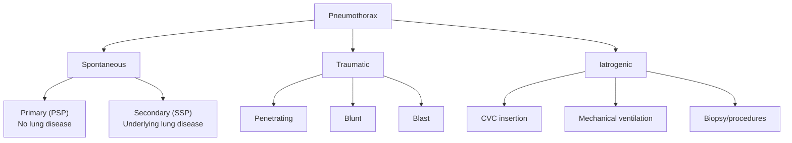
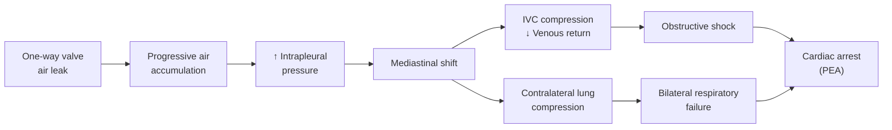
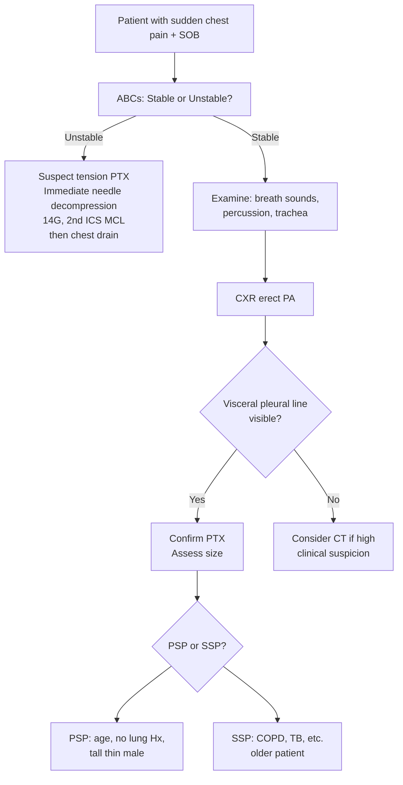

# Pneumothorax

## 1. Definition

Pneumothorax (PTX) literally breaks down from Greek roots: **"pneumo"** = air, **"thorax"** = chest. It is defined as the **presence of air in the pleural space** [1][2]. Normally, the pleural space contains only a thin film (~5–15 mL) of serous fluid between the visceral and parietal pleurae, maintained at a sub-atmospheric (negative) pressure of approximately −3 to −5 cmH₂O at rest. When air enters this space, the negative pressure is lost, the elastic recoil of the lung causes it to collapse, and gas exchange is impaired.

The key concept is understanding **why** the lung stays inflated in the first place: the intrapleural pressure is negative relative to atmospheric pressure (thanks to the opposing elastic recoil forces of the lung inward and chest wall outward). Once air breaches either the visceral pleura (from inside) or the parietal pleura (from outside), the pressure gradient is lost, and the lung retracts toward its hilum.

<Callout title="Core Concept">
The lung is a passive elastic structure held open by the negative intrapleural pressure. Any communication between the atmosphere and the pleural space — whether from the airway side (visceral pleura breach) or the chest wall side (parietal pleura breach) — will collapse the lung. The clinical severity depends on how much air accumulates and whether pressure continues to build (tension physiology).
</Callout>

---

## 2. Epidemiology

### Incidence
- **Primary spontaneous pneumothorax (PSP):** incidence of approximately 7–18 per 100,000 per year in males and 1–6 per 100,000 per year in females [1][2]
- **Secondary spontaneous pneumothorax (SSP):** incidence of approximately 6 per 100,000 per year in males, 2 per 100,000 per year in females
- Traumatic and iatrogenic pneumothorax: variable depending on hospital practice and trauma burden

### Demographics
- ***PSP: predominantly tall, thin, young males*** — typically aged 15–35 years [2]
  - Male-to-female ratio: ***3–6 : 1*** [1]
  - Why tall and thin? Taller individuals have a greater transpulmonary pressure gradient from apex to base (the alveolar pressure at the apex is relatively higher compared to intrapleural pressure because of gravitational effects on pleural pressure). This promotes development of subpleural blebs at the apex that can rupture.
- SSP: older patients (typically > 50 years), reflecting the age distribution of COPD and other chronic lung diseases [1]

### Hong Kong context
- COPD is very common in Hong Kong (accounts for ~10% of public medical bed days [3]), making SSP secondary to COPD a significant burden
- ***Smoking*** remains the dominant modifiable risk factor for both PSP and SSP [1][2]
- Tuberculosis (TB) is still endemic in Hong Kong and is a recognized cause of SSP [1]
- Iatrogenic pneumothorax occurs in the context of frequent use of central venous catheters and invasive procedures in Hong Kong's tertiary hospitals

---

## 3. Risk Factors

| Category | Risk Factors | Mechanism |
|---|---|---|
| **Demographic** | Male sex, tall stature, thin body habitus, age 15–35 (PSP), age > 60 (SSP recurrence) | Greater apical transpulmonary pressure gradient in tall individuals; male predominance unclear but possibly hormonal/connective tissue differences |
| ***Smoking*** | Dose-dependent (up to 20× risk in heavy smokers vs non-smokers) | Causes inflammatory small airway disease → air trapping → subpleural bleb formation; also impairs pleural mesothelial integrity |
| **Previous PTX** | ***Risk of recurrence 10–30% at 1–5 years (1st PSP), 50% at 3 years (SSP)*** [1] | Persistence of underlying pathology (blebs, bullae, pores of Kohn dilatation) |
| **Pre-existing lung disease** | COPD, TB, CF, asthma, CA lung, PCP, interstitial lung disease | Weakened alveolar walls, bullae formation, cavities communicating with pleural space |
| ***Subpleural blebs*** | Present in up to 90% of PSP patients on CT | Thin-walled air-containing spaces at lung apex that can rupture |
| **Connective tissue disorders** | Marfan syndrome, Ehlers-Danlos, homocystinuria | Defective collagen/connective tissue → weakened visceral pleura |
| ***Specific rare conditions*** | ***Lymphangioleiomyomatosis (LAM, young F)***, ***Langerhans cell histiocytosis (LCH, young M)*** [2] | LAM: smooth muscle proliferation in airways and lymphatics → cyst formation → rupture; LCH: granulomatous destruction → cysts |
| **Birt-Hogg-Dubé syndrome** | Autosomal dominant (FLCN gene mutation) | Lung cysts (especially basilar) predisposing to spontaneous PTX [5] |
| **Iatrogenic** | ***CVC insertion***, ***mechanical ventilation (barotrauma)***, transthoracic lung biopsy, thoracocentesis, pleural biopsy, transbronchial biopsy [1][2] | Direct pleural puncture or positive-pressure-induced alveolar rupture |
| **Trauma** | Penetrating (stab, gunshot), blunt (rib fractures), blast injury [4][6] | Direct pleural space violation or rib fragment laceration of visceral pleura |
| **Catamenial** | Menstruating women, endometriosis | Ectopic endometrial tissue on diaphragm/pleura → tissue breakdown during menstruation → air entry; or air passage through diaphragmatic fenestrations from pneumoperitoneum |

<Callout title="High Yield - Exam Favourite" type="idea">
When asked about risk factors for pneumothorax, always structure your answer: **Patient factors** (tall, thin, male, smoking, family history) → **Lung disease** (COPD, TB, CF, LAM, LCH) → **Iatrogenic** (CVC, ventilation, biopsy) → **Trauma** (penetrating, blunt, blast). Don't forget **catamenial pneumothorax** — a favourite viva question.
</Callout>

---

## 4. Anatomy and Function of the Pleural Space

### Pleural Anatomy
- **Parietal pleura:** lines the inner surface of the chest wall, mediastinum, and diaphragm. Supplied by intercostal arteries and innervated by intercostal nerves (somatic — this is why parietal pleural inflammation causes sharp, well-localized pain) and the phrenic nerve (diaphragmatic portion — referred shoulder tip pain).
- **Visceral pleura:** intimately covers the lung parenchyma and extends into the fissures. Supplied by bronchial arteries. Has **no somatic innervation** — this is why visceral pleural pathology alone does not cause pain.
- **Pleural space:** a potential space between the two layers containing ~5–15 mL of serous fluid. Functions as a lubricant and transmits the negative pressure that keeps the lung inflated.

### Pleural Pressure Physiology
- At rest (FRC): intrapleural pressure ≈ −5 cmH₂O
- During inspiration: becomes more negative (≈ −8 cmH₂O) → draws air into lungs
- The lung's elastic recoil pulls it inward; the chest wall's elastic recoil pulls outward → the net effect is a negative intrapleural pressure
- **Gravity creates a vertical gradient:** intrapleural pressure is more negative at the apex (≈ −8 cmH₂O) and less negative at the base (≈ −2 cmH₂O). Therefore, apical alveoli are more distended at rest and under greater transpulmonary pressure — explaining why **blebs form preferentially at the apex** and why PSP typically begins at the lung apex.

### Air Reabsorption from the Pleural Space
- Under normal conditions, pleural capillary blood has a total gas pressure (sum of partial pressures of O₂, CO₂, N₂, H₂O) that is **lower** than atmospheric pressure by about 54 mmHg (the "tissue gas tension deficit")
- This gradient drives absorption of air from the pleural space back into the blood at a rate of approximately **1.25% of hemithorax volume per day** for air (which is 79% N₂)
- ***O₂ is easier to absorb than N₂*** — this is why **supplemental O₂ therapy accelerates pneumothorax resolution**: by replacing alveolar N₂ with O₂, the N₂ partial pressure in capillary blood drops, creating a steeper gradient for N₂ absorption from the pleural space [2]

<Callout title="Why Does O₂ Speed Up Pneumothorax Resolution?">
Air in the pleural space is mostly N₂ (~79%). N₂ is poorly soluble and slowly reabsorbed. By giving high-flow O₂, you "nitrogen-wash" the blood — reducing blood PN₂ → steeper diffusion gradient → N₂ moves out of the pleural space into blood 4–6× faster. This can increase the reabsorption rate from ~1.25% to ~6% of hemithorax volume per day. However, avoid HFNC or NIPPV as these deliver positive pressure that may worsen the pneumothorax [2].
</Callout>

### Surface Anatomy for Procedures
- **Safe triangle** for chest drain insertion: bordered anteriorly by the lateral edge of pectoralis major, posteriorly by the lateral edge of latissimus dorsi, inferiorly by the 5th intercostal space, and superiorly by the axilla. Insertion is at the 4th or 5th intercostal space in the mid-axillary line.
- **2nd intercostal space, mid-clavicular line:** site for needle decompression of tension pneumothorax and sometimes needle aspiration
- Always insert **just above the rib** (to avoid the intercostal neurovascular bundle running in the costal groove along the inferior border of each rib)

---

## 5. Etiology (with Focus on Hong Kong)

### 5.1 Spontaneous Pneumothorax

#### ***Primary Spontaneous Pneumothorax (PSP) — no underlying lung disease*** [1][2]

- **Pathophysiology:** Despite the label "no underlying lung disease," nearly all PSP patients have subclinical pathology. High-resolution CT shows **subpleural blebs or bullae** (small air-containing spaces, usually < 1–2 cm) at the lung apices in up to 90% of PSP patients. These blebs form due to:
  1. Degradation of elastic fibres in visceral pleura (possibly related to smoking-induced inflammation or congenital weakness)
  2. Increased mechanical stress at the apex (gravity-dependent transpulmonary pressure gradient)
  3. Possible role of pleural porosity — microscopic holes in the visceral pleura allowing air leak even without visible blebs
- Blebs rupture → air enters pleural space → lung collapses
- **Hong Kong relevance:** Smoking is the most important modifiable risk factor. Despite public health campaigns, smoking prevalence remains ~10% in HK (higher in males). PSP classically presents in young men in their 20s.

#### ***Secondary Spontaneous Pneumothorax (SSP) — underlying lung disease present*** [1][2]

| Cause | Hong Kong Relevance | Pathophysiology |
|---|---|---|
| ***COPD (50–70% of SSP)*** | Very common in HK; accounts for 10% of public medical bed days [3] | Emphysematous bullae rupture; inflammatory weakening of alveolar walls; air trapping → overdistension |
| ***TB*** | Endemic in HK (incidence ~60/100,000) | Cavitary disease communicates with pleural space; pleuritis causes pleural weakening; caseous necrosis erodes visceral pleura |
| ***CA lung*** | Common in HK (leading cause of cancer death) | Tumour necrosis creates cavitation; tumour erodes visceral pleura; post-chemotherapy tumour regression |
| ***PCP infection (Pneumocystis jirovecii)*** | Seen in HIV+ patients | Creates thin-walled cysts (pneumatoceles) in lung parenchyma that rupture |
| ***Langerhans cell histiocytosis (LCH)*** — ***young males*** | Rare but high-yield | Granulomatous inflammation → cystic destruction of lung parenchyma → cyst rupture |
| ***Lymphangioleiomyomatosis (LAM)*** — ***young females*** | Rare but high-yield | Proliferation of abnormal smooth muscle cells → airway obstruction → cyst formation → rupture; associated with tuberous sclerosis |
| Cystic fibrosis | Less common in Chinese/HK population | Mucus plugging → air trapping → subpleural cyst formation → rupture |
| Asthma | Common in HK | Severe air trapping → alveolar overdistension → rupture (rare) |
| Interstitial lung disease (e.g., IPF) | Increasing recognition | Honeycombing creates subpleural cysts that can rupture |
| Birt-Hogg-Dubé syndrome | Rare | Basilar lung cysts (FLCN gene mutation) → spontaneous PTX [5] |

<Callout title="Clinical Pearl" type="idea">
***SSP usually presents earlier and more severe than PSP because patients have less respiratory reserve*** [1]. A 2 cm pneumothorax in a young healthy person may cause mild breathlessness; the same size in a COPD patient can cause respiratory failure. This is why the management thresholds differ (SSP: intervene at ≥ 1 cm; PSP: intervene at ≥ 2 cm) [2].
</Callout>

### 5.2 Traumatic Pneumothorax

#### ***Penetrating Injury*** [4][6]
- ***Stabbing, chopping wounds*** (relevant to HK — *"Chopped and stabbed wound in gang fight"* [6])
- Gunshot wounds (less common in HK)
- **Pathophysiology:** Direct violation of parietal pleura (and sometimes visceral pleura) → atmospheric air enters pleural space. If the wound remains open ("sucking chest wound"), an ***open pneumothorax*** develops where air moves freely in and out.

#### ***Blunt Injury*** [4][7]
- ***"Hit by a van"*** scenario [4][7] — motor vehicle accidents, falls, assaults
- **Pathophysiology:** 
  - Rib fractures → fractured rib ends lacerate visceral pleura and lung parenchyma
  - Sudden compression → transient ↑ alveolar pressure → alveolar rupture (even without rib fractures)
  - Deceleration injury → shearing of lung from hilum

#### ***Blast Injury*** [4]
- Primary blast wave causes rapid pressure changes → alveolar rupture
- Secondary (projectile fragments) and tertiary (body thrown) mechanisms can also cause PTX

### 5.3 Iatrogenic Pneumothorax [1][2]

| Procedure | Mechanism |
|---|---|
| ***Central venous catheter (CVC) insertion*** — especially subclavian and IJV | Needle punctures lung apex/parietal pleura |
| ***Mechanical ventilation (barotrauma)*** | Positive pressure ventilation → alveolar overdistension → rupture → air tracks along perivascular sheaths to mediastinum → ruptures into pleural space (Macklin effect) |
| Transthoracic lung biopsy | Needle traverses pleura |
| Thoracocentesis / pleural biopsy / chest drain | Inadvertent lung puncture or air entry |
| Transbronchial lung biopsy | Forceps tears visceral pleura |
| Tracheostomy | Paratracheal dissection may enter pleural dome |
| ***Oesophageal atresia surgery / diaphragmatic hernia repair*** [8] | Neonatal thoracic surgery — operative pleural breach |
| ***Positive pressure ventilation in neonates*** [8] | Immature lungs prone to barotrauma |

<Callout title="Iatrogenic PTX After CVC" type="error">
Always order a **post-procedure CXR** after CVC insertion to check for pneumothorax and confirm catheter tip position. This is a classic exam scenario. The CXR also rules out haemothorax and hydrothorax [9].
</Callout>

---

## 6. Classification

### 6.1 By Etiology

### 6.2 By Pathophysiology (Type of Pleural Communication)

| Type | Mechanism | Pleural Pressure | Key Feature |
|---|---|---|---|
| ***Closed*** | Airway-pleural communication sealed as lung deflates; does not re-open | ***Negative*** | Spontaneous reabsorption over days to weeks [1] |
| ***Open*** | Communication remains continuously patent | ***Atmospheric*** | Bronchopulmonary fistula (e.g., ruptured emphysematous bulla, TB cavity, lung abscess into pleural space) [1]; or open chest wound ("sucking chest wound") |
| ***Tension*** | ***One-way valve*** → ***progressive accumulation of air*** within pleural space | ***Positive*** | ***Mediastinal shift → compress contralateral lung + impair systemic venous return → obstructive shock with cardiopulmonary collapse*** [1][2] |

### 6.3 By Size (BTS Guidelines 2023)

| Size | Definition on Erect PA CXR |
|---|---|
| ***Small*** | ***< 2 cm*** interpleural distance at the level of the hilum (between lung edge and chest wall) |
| ***Large*** | ***≥ 2 cm*** interpleural distance at the level of the hilum |

- ***% pneumothorax = (1 − [average lung diameter³ / average hemithorax diameter³]) × 100%*** [2]
- ***1 cm on PA CXR ≈ 27% of hemithorax volume*** [2]

> Note: The ACCP uses 3 cm at the apex as the dividing line; BTS uses 2 cm at the hilum. HKU/HK generally follows **BTS guidelines**.

---

## 7. Pathophysiology (Detailed)

### 7.1 Mechanism of Lung Collapse

1. **Breach in pleura** → air enters pleural space → intrapleural pressure rises toward atmospheric
2. **Loss of negative intrapleural pressure** → the transpulmonary pressure (alveolar pressure minus intrapleural pressure) decreases → lung elastic recoil is no longer opposed → **lung collapses**
3. The degree of collapse depends on:
   - Volume of air entering
   - Whether the communication seals (closed), remains open, or acts as a one-way valve (tension)
   - Compliance of the lung (stiff fibrotic lungs collapse less; compliant emphysematous lungs collapse more easily)

### 7.2 Physiological Consequences

| Consequence | Mechanism |
|---|---|
| **Hypoxaemia** | V/Q mismatch: collapsed lung is perfused but not ventilated (intrapulmonary shunt). Compensated partially by hypoxic pulmonary vasoconstriction (HPV) redirecting blood to the ventilated lung |
| **Hypercarbia** (usually mild in PSP) | Dead space ventilation in the collapsed lung; usually compensated by the contralateral lung unless bilateral PTX, tension, or SSP |
| **Increased work of breathing** | Reduced total ventilating lung volume → tachypnoea to maintain minute ventilation |
| **Mediastinal shift** (tension PTX) | Progressive air accumulation → positive pressure → pushes mediastinum to contralateral side |
| ***Impaired venous return (tension PTX)*** | ***Build-up of pressure → compress IVC → ↓ venous return → obstructive shock*** [2] |
| ***Contralateral lung compression (tension PTX)*** | ***Shifted mediastinum compresses the opposite lung → bilateral ventilatory failure*** |
| ***V/Q mismatch (tension PTX)*** | ***Combined effect of collapsed ipsilateral lung and compressed contralateral lung*** [2] |

### 7.3 Tension Pneumothorax — The Emergency [1][2]

***Pathophysiology:***
1. A **one-way valve mechanism** develops — air enters the pleural space during inspiration but cannot escape during expiration
2. With each breath, more air accumulates → intrapleural pressure becomes progressively **positive**
3. Consequences:
   - ***Compress IVC → ↓ venous return → obstructive shock*** [2]
   - Mediastinal shift → kinking of great vessels → further ↓ cardiac output
   - Compression of contralateral lung → bilateral respiratory failure
   - ***V/Q mismatch*** — both lungs affected [2]

***This is a clinical diagnosis. You should NOT wait for a CXR to diagnose tension pneumothorax — it is an emergency requiring immediate needle decompression.*** [1]

<Callout title="Tension Pneumothorax is a CLINICAL Diagnosis" type="error">
***Tension pneumothorax is a clinical diagnosis*** [1]. Never delay treatment to obtain a CXR. If a trauma patient has unilateral absent breath sounds, hyperresonance, tracheal deviation away from the affected side, distended neck veins, and hypotension — decompress immediately with a 14G needle at the 2nd ICS mid-clavicular line (or 4th/5th ICS mid-axillary line per newer ATLS guidelines), followed by chest drain insertion.
</Callout>

---

## 8. Clinical Features

### 8.1 Symptoms (with Pathophysiological Basis)

| Symptom | Frequency | Pathophysiological Basis |
|---|---|---|
| ***Sudden-onset unilateral pleuritic chest pain*** | Very common (~90%) | Air irritates the parietal pleura (which has somatic innervation from intercostal nerves). The pain is sharp, localized to the affected side, and worsened by inspiration because lung movement stretches the inflamed parietal pleura |
| ***Sudden-onset shortness of breath (SOB / dyspnoea)*** | Very common | Loss of ventilating lung volume → ↓ gas exchange → V/Q mismatch → hypoxaemia → stimulation of peripheral chemoreceptors and increased respiratory drive |
| Dry cough | Occasional | Irritation of the parietal pleura or bronchial stretch receptors by the collapsed lung |
| Ipsilateral shoulder tip pain | Occasional | Diaphragmatic parietal pleura irritation → referred pain via the phrenic nerve (C3–C5 dermatome → shoulder tip) |
| Anxiety / sense of impending doom | In large/tension PTX | Sympathetic activation due to hypoxaemia and cardiovascular compromise |

<Callout title="Key Clinical Point">
***Symptom severity generally does not correlate with size of pneumothorax*** [1]. A small PSP in a fit young man may cause significant chest pain but minimal SOB. Conversely, ***SSP usually presents earlier and is disproportionately severe*** because of limited respiratory reserve [1] — even a small pneumothorax in a COPD patient can precipitate respiratory failure.
</Callout>

### 8.2 Signs (with Pathophysiological Basis)

#### Small Pneumothorax
- ***Signs may be nil if small*** [1] — physical examination can be normal with small PTX (< 15% volume)

#### Large Pneumothorax

| Sign | Pathophysiological Basis |
|---|---|
| Tachypnoea | Compensatory ↑ respiratory rate to maintain minute ventilation despite reduced lung volume |
| ***↓ or absent breath sounds on affected side*** | Air in the pleural space does not transmit sound well; collapsed lung has no air movement → no vesicular breath sounds |
| ***Hyperresonant percussion note*** | Air-filled pleural space resonates more than normal lung parenchyma (air is an excellent resonator) |
| ↓ Vocal resonance / ↓ tactile vocal fremitus | Sound from the larynx is transmitted poorly through air in the pleural space (air-tissue interface reflects sound) |
| Reduced chest expansion on affected side | Collapsed lung does not expand; chest wall on that side moves less |
| Tachycardia | Sympathetic response to pain, hypoxaemia, and reduced cardiac output |

> **Diagnostic triad for large PTX** [1]: ***↓/absent breath sounds + hyperresonant percussion + tachypnoea***

#### ***Tension Pneumothorax Signs*** [1][2]

| Sign | Pathophysiological Basis |
|---|---|
| ***Marked tachycardia*** | Compensatory response to ↓ cardiac output from obstructive shock |
| ***Hypotension*** | ***↓ Venous return due to IVC compression by positive intrapleural pressure → ↓ preload → ↓ cardiac output*** |
| ***Distended neck veins (↑ JVP)*** | Back-pressure from IVC compression → blood cannot drain from the SVC → jugular venous distension (d/dx cardiac tamponade — both cause obstructive shock with ↑ JVP) [1] |
| ***Tracheal deviation away from affected side*** | Mediastinal shift pushed by positive pressure on the affected side |
| ***Sweating*** (diaphoresis) | Sympathetic activation from shock |
| Cyanosis | Severe hypoxaemia from bilateral ventilatory compromise |
| Absent breath sounds on affected side | Fully collapsed lung |
| Hyperresonance on affected side | Maximal air accumulation |
| ***Obstructive shock → cardiac arrest (PEA)*** | End-stage: complete circulatory collapse due to absent venous return |

<Callout title="Tension PTX vs Cardiac Tamponade" type="idea">
Both cause obstructive shock with ↑ JVP and hypotension. The key differentiating features:
- **Tension PTX:** Hyperresonant percussion, absent breath sounds, tracheal deviation AWAY from affected side
- **Cardiac tamponade:** Muffled heart sounds, Beck's triad (hypotension, ↑ JVP, muffled heart sounds), no percussion/breath sound changes, pulsus paradoxus

Both may occur simultaneously in chest trauma — always check for both! [1][4]
</Callout>

#### Additional Signs in Specific Scenarios

| Sign | Context | Pathophysiological Basis |
|---|---|---|
| ***Subcutaneous emphysema (surgical emphysema)*** | Trauma, tension PTX, Boerhaave syndrome [10] | Air tracks from pleural space through the parietal pleura breach into subcutaneous tissue; palpable crepitus ("rice crispy" feel) |
| ***Blunted costophrenic angle*** | Haemopneumothorax | ***Bleeding from torn pleural vessels*** — blood layers dependently while air rises [2] |
| Hamman's sign | Pneumomediastinum ± PTX | Mediastinal air produces a clicking/crunching sound synchronous with the heartbeat, heard on auscultation [10] |
| ***Sucking wound*** | Open pneumothorax (penetrating trauma) | Open chest wall defect allows air to enter pleural space during inspiration — audible "sucking" sound |

### 8.3 CXR Features [1][2][11]

#### ***Erect PA CXR (Diagnostic Standard)***

- ***Rim of hyperlucency without lung markings*** — this is the hallmark: you see the **visceral pleural line** as a thin white line with no lung markings peripheral to it and normal lung markings medial to it [2][11]
- The visceral pleural line runs parallel to the chest wall
- If uncertain: ***lateral decubitus film (suspected side UP)*** — air rises to the non-dependent side, making it more visible [2][11]
- ***↑ on expiratory films*** — lung volume decreases, making the pneumothorax relatively more conspicuous [11]

#### ***Supine CXR (Trauma Setting — Easily Missed!)*** [11]

In trauma, patients are often supine. Air rises **anteriorly** in the supine position, making a conventional visceral pleural line **invisible** on AP film.

- ***Deep sulcus sign:*** ***deep tongue-like costophrenic sulcus*** — air collects at the most anterior-inferior part of the pleural space [11]
- ***Double diaphragm sign:*** ***visualization of anterior costophrenic sulcus*** creating a second "diaphragm" line [11]
- ***Increased sharpness of adjacent mediastinal margin, diaphragm, and cardiac borders*** — air provides a high-contrast interface [11]
- ***Depression of ipsilateral hemidiaphragm*** — pressure effect of trapped air [11]
- ***Relative lucency of the involved hemithorax*** compared to the other side [11]

<Callout title="Supine CXR — Don't Miss It!" type="error">
***Pneumothorax is easily missed on supine CXR*** as usually only supine CXR is done in trauma [11]. Always look for the **deep sulcus sign** — this is the most reliable sign on supine films. If in doubt, CT chest is the gold standard for detecting occult pneumothorax.
</Callout>

#### Size Assessment on CXR

- ***Small: < 2 cm*** interpleural distance at the hilum
- ***Large: ≥ 2 cm*** interpleural distance at the hilum (≈ ***↓ 50% lung volume***) [2]
- ***% pneumothorax = (1 − [average lung diameter³ / average hemithorax diameter³]) × 100%*** [2]
- ***1 cm on PA CXR ≈ 27% hemithorax volume*** [2]

#### Associated CXR Findings

| Finding | Significance |
|---|---|
| ***Blunted CP angle*** | ***Haemopneumothorax — bleeding from torn pleural vessels*** [2] |
| Mediastinal shift to contralateral side | Tension pneumothorax or large pneumothorax |
| Air-fluid level | Hydropneumothorax (air + fluid in pleural space) [9] |
| Rib fractures | Traumatic pneumothorax |
| Bilateral pneumothorax | Requires urgent bilateral chest drains |
| Subcutaneous emphysema | Air in chest wall soft tissues — may indicate significant pleural/mediastinal air leak |

---

## 9. Special Populations and Scenarios

### 9.1 Neonatal Pneumothorax [8]

- ***Oesophageal atresia, congenital diaphragmatic hernia (CDH), and other neonatal thoracic surgical conditions*** predispose to perioperative pneumothorax [8]
- ***Positive pressure ventilation in neonates*** (especially premature infants with surfactant deficiency) increases barotrauma risk [8]
- Neonatal lungs are more susceptible to volutrauma and barotrauma due to immature alveolar structure

### 9.2 Trauma Setting [4][6][7]

- ***Pneumothorax is the most common chest trauma finding*** [10]
- ***Multiple trauma patients ("A bus hit a train")*** [4] and ***"Hit by a van, in shock with internal bleeding"*** [7] — pneumothorax must be actively excluded
- ***In the ATLS primary survey***, tension PTX is identified and treated in the **B (Breathing)** step
- ***FAST scan*** can detect pneumothorax (absence of lung sliding on ultrasound) in addition to free abdominal fluid [7][10][11]
- ***Chest trauma classification*** [10]:
  1. ***Pneumothorax***
  2. ***Aortic injury/dissection***
  3. ***Flail chest***
  4. ***Cardiac tamponade***
  5. ***Spinal fracture***

### 9.3 Catamenial Pneumothorax

- Recurrent pneumothorax in menstruating women, typically right-sided (90%)
- Occurs within 24–72 hours of onset of menses
- Mechanism: endometrial implants on the diaphragm or visceral pleura → tissue breakdown during menstruation → air entry; or diaphragmatic fenestrations allow peritoneal air to enter pleural space
- Treatment: hormonal suppression (GnRH analogues, OCPs) + surgical repair of diaphragmatic defects + pleurodesis

### 9.4 Pneumothorax in Pregnancy

- Increased risk of recurrence during pregnancy (Valsalva during labor)
- ***Indication for pleurodesis*** if PTX occurs during pregnancy [1]
- Management: chest drain if symptomatic; elective pleurodesis before term if recurrent

---

## 10. Clinical Approach Summary

---

<Callout title="High Yield Summary">

**Definition:** Air in the pleural space → loss of negative intrapleural pressure → lung collapse.

**Epidemiology:** PSP: young, tall, thin males (M:F = 3–6:1). SSP: older patients with COPD (50–70%), TB, CA lung.

**Key Risk Factors:** Smoking (dose-dependent, up to 20× risk), subpleural blebs, COPD, tall stature, previous PTX.

**Types by mechanism:** Closed (negative pressure, self-resolving), Open (atmospheric pressure, continuous leak), Tension (positive pressure, one-way valve → obstructive shock).

**Tension PTX pathophysiology:** One-way valve → progressive air accumulation → positive intrapleural pressure → IVC compression → ↓ venous return → obstructive shock + V/Q mismatch. CLINICAL DIAGNOSIS — do NOT wait for CXR.

**Key symptoms:** Sudden-onset unilateral pleuritic chest pain + dyspnoea. Severity does not correlate with size (SSP more severe due to ↓ reserve).

**Key signs:** Small = nil. Large = ↓ breath sounds + hyperresonance + tachypnoea. Tension = above + hypotension + ↑ JVP + tracheal deviation + shock.

**CXR:** Erect PA: visceral pleural line with absence of lung markings beyond it. Supine: deep sulcus sign. Size: < 2 cm = small; ≥ 2 cm = large.

**O₂ therapy works** by nitrogen washout — reducing blood PN₂ → steeper gradient for N₂ absorption from pleural space.

**Recurrence:** 10–30% at 1–5 years (PSP), 50% at 3 years (SSP).

</Callout>

---

<ActiveRecallQuiz
  title="Active Recall - Pneumothorax: Definition to Clinical Features"
  items={[
    {
      question: "Explain why subpleural blebs preferentially form at the lung APEX rather than the base.",
      markscheme: "Gravity creates a vertical gradient in intrapleural pressure: more negative at apex (approx -8 cmH2O) vs base (approx -2 cmH2O). Greater transpulmonary pressure at apex leads to more distended alveoli and higher mechanical stress on visceral pleura, promoting bleb formation. Taller individuals have a steeper gradient.",
    },
    {
      question: "A trauma patient on a spinal board has a supine AP CXR. What is the most reliable sign of pneumothorax on this film, and why is standard erect PTX signs unreliable?",
      markscheme: "Deep sulcus sign (deep tongue-like costophrenic sulcus). In supine position, air rises anteriorly rather than apically, so the classic visceral pleural line at the apex is not visible. Air collects anteroinferiorly, deepening the costophrenic angle. Other signs: double diaphragm sign, increased sharpness of mediastinal/cardiac borders, relative hemithorax lucency.",
    },
    {
      question: "Explain the pathophysiology of tension pneumothorax leading to obstructive shock. Why does JVP rise?",
      markscheme: "One-way valve mechanism: air enters pleural space on inspiration but cannot exit on expiration. Progressive positive pressure buildup compresses IVC, reducing venous return (decreased preload leads to decreased cardiac output = obstructive shock). JVP rises because blood cannot drain from SVC into the compressed right atrium/IVC system, causing back-pressure into jugular veins. Mediastinal shift also compresses contralateral lung causing bilateral ventilatory failure.",
    },
    {
      question: "Why does supplemental O2 therapy accelerate pneumothorax resolution? Quantify the improvement.",
      markscheme: "Pleural air is 79% N2. High-flow O2 displaces N2 from alveoli and blood (nitrogen washout), reducing blood PN2 and creating a steeper diffusion gradient for N2 to move from pleural space into blood. Rate increases from approximately 1.25% to 6% of hemithorax volume per day (4-6x faster). Avoid HFNC/NIPPV as positive pressure may worsen PTX.",
    },
    {
      question: "How do you differentiate tension pneumothorax from cardiac tamponade at the bedside? List 3 distinguishing features.",
      markscheme: "Both cause obstructive shock with raised JVP and hypotension. Differences: (1) Percussion: hyperresonant in tension PTX vs normal in tamponade. (2) Breath sounds: absent on affected side in tension PTX vs normal in tamponade. (3) Trachea: deviated AWAY from affected side in tension PTX vs midline in tamponade. (4) Heart sounds: normal in PTX vs muffled in tamponade. (5) Pulsus paradoxus: characteristic of tamponade.",
    },
    {
      question: "List 4 causes of secondary spontaneous pneumothorax relevant to Hong Kong, with the pathophysiology for each.",
      markscheme: "(1) COPD (50-70%): emphysematous bullae rupture due to inflammatory alveolar wall destruction. (2) TB (endemic in HK): cavitary disease communicates with pleural space, caseous necrosis erodes visceral pleura. (3) CA lung (leading cancer death in HK): tumour necrosis/cavitation erodes visceral pleura. (4) PCP in HIV patients: thin-walled pneumatoceles rupture. Others acceptable: LAM (cysts from smooth muscle proliferation), LCH (granulomatous cystic destruction), CF, asthma.",
    },
  ]}
/>

## References

[1] Senior notes: Ryan Ho Respiratory.pdf (Section 3.7 Pneumothorax, p151–155)
[2] Senior notes: Maksim Medicine Notes.pdf (Section 12.6 Pleural diseases - Pneumothorax, p291)
[3] Senior notes: Ryan Ho Respiratory.pdf (Section 3.2.2 COPD, p107)
[4] Lecture slides: GC 175. A bus hit a train Multiple trauma; Disaster management.pdf
[5] Senior notes: Ryan Ho Rheumatology.pdf (Section 5.4.3, p167 — Birt-Hogg-Dubé syndrome)
[6] Lecture slides: GC 182. Chopped and stabbed wound in gang fight Nerves and vascular injury; Classification of injuries.pdf
[7] Lecture slides: GC 188. Hit by a van, in shock with internal bleeding Abdominal injury.pdf
[8] Lecture slides: GC 204. The newborn baby cannot breathe Oesophageal atresia, diaphragmatic hernia, and other surgery of lung.pdf
[9] Senior notes: Ryan Ho Fluids and Nutrition.pdf (Section on TPN complications, p11)
[10] Senior notes: Maksim Surgery Notes.pdf (Section 2.1 Trauma, p42)
[11] Senior notes: Ryan Ho Radiology.pdf (Section 1.1 Chest Trauma, p2)
