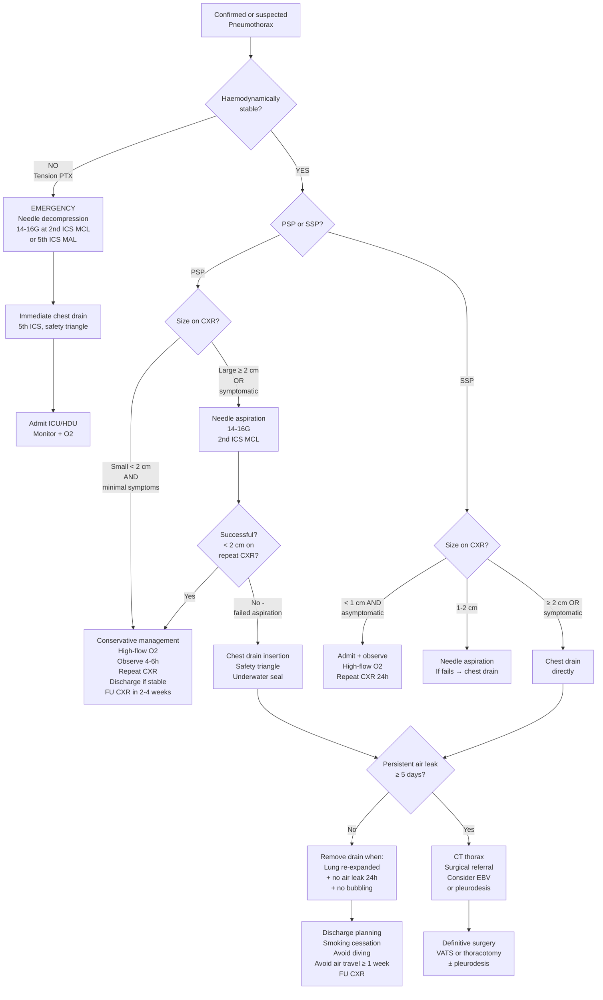

## Management of Pneumothorax

### 1. Principles of Management

Before diving into the algorithm, understand the **two overarching goals** of pneumothorax management:

1. **Acute management:** Remove air from the pleural space → restore lung expansion → relieve symptoms
2. **Definitive management:** Prevent recurrence → obliterate the pleural space or remove the source of air leak

The choice of acute treatment depends on three key considerations [1]:
- ***Symptoms:*** SOB → need for active intervention [1]
- ***Size:*** Determines rate of spontaneous resorption → large PTX with few symptoms may still need intervention [1]
- ***Comorbidities:*** Poor lung reserve → active treatment despite small size [1]

The philosophy is simple: a fit young person with a small PSP can wait for spontaneous reabsorption. An elderly COPD patient with a small SSP cannot — they have no reserve and may decompensate. This is why the thresholds differ.

---

### 2. Management Algorithm (BTS-Based, HK Practice)

---

### 3. Acute Management — Removing Air from the Pleural Space

#### 3.1 Supplemental Oxygen Therapy

***O₂ therapy*** [2]:
- ***Mechanism: to promote absorption of air (O₂ easier to absorb than N₂)*** [2]

Let me explain this from first principles. The air trapped in the pleural space is approximately 79% nitrogen (N₂) and 21% oxygen (O₂). N₂ is poorly soluble in blood and reabsorbs slowly — at a rate of roughly 1.25% of hemithorax volume per day on room air. When you give high-concentration O₂, you "nitrogen-wash" the blood: alveolar O₂ displaces N₂ → blood PN₂ drops → a steeper diffusion gradient forms between the pleural air (high PN₂) and blood (low PN₂) → N₂ is absorbed 4–6× faster, increasing resorption to ~6% per day.

| O₂ Target | PSP | SSP |
|---|---|---|
| SpO₂ target | ≥ 96% (high-flow O₂ at 6 L/min or above) | ≥ 88–92% (titrate carefully; some COPD patients retain CO₂ on high O₂) |
| Delivery | Nasal cannula or face mask with reservoir | Face mask; titrate to avoid CO₂ retention in chronic retainers |

<Callout title="What NOT to Give" type="error">
***Avoid high-flow nasal cannula (HFNC) and NIPPV: positive pressure may worsen PTX*** [2]. These modalities deliver positive pressure, which can force more air through the pleural defect or convert a simple PTX into tension physiology. Similarly, ***positive pressure ventilation (PPV) in the presence of pneumothorax may lead to tension pneumothorax*** — ventilation is therefore difficult in pneumothorax complicating lung disease [1].
</Callout>

---

#### 3.2 Conservative Management (Observation)

**Indication:**
- ***Asymptomatic PSP ≤ 2 cm*** [1]
- ***Asymptomatic SSP ≤ 1 cm*** [1]

**What it involves:**
- High-flow O₂ (to accelerate resorption)
- Observe for 4–6 hours with repeat CXR
- ***Discharge with early CXR follow-up in 2–4 weeks*** [1]
- Pain management with simple analgesics (paracetamol ± opioids if needed)

**Why does this work?** In a small, closed pneumothorax, the air leak has sealed itself. The remaining air will be gradually reabsorbed down the partial pressure gradient into the pleural capillary blood. With supplemental O₂, this process is accelerated. There is no point draining what the body can safely resorb on its own.

**When to admit for observation (even if "conservative"):**
- All SSP patients should be admitted (regardless of size) because of limited respiratory reserve
- PSP patients can be discharged if asymptomatic and stable on repeat CXR at 4–6 hours

---

#### 3.3 Emergency Needle Decompression (Tension PTX)

***This is for tension pneumothorax only — a life-saving emergency procedure*** [1][2][16].

| Parameter | Detail |
|---|---|
| **Indication** | ***Tension pneumothorax — clinical diagnosis*** [1][2] |
| **Needle** | ***14G or 16G angiocatheter*** [1][2][16] |
| ***Site (classic)*** | ***2nd ICS, mid-clavicular line*** [2][16] |
| ***Site (alternative — newer ATLS)*** | ***5th ICS, mid-axillary line*** [1] — preferred by some because the chest wall is thinner here and the needle more reliably reaches the pleural space |
| **Confirmation** | ***Listen for 'hissing sound'*** — air escaping under pressure [1]. This converts the tension PTX into an **open** PTX (no longer under positive pressure) |
| **After decompression** | ***Install a Heimlich valve to ensure one-way exit of gas*** [1], then ***insert a chest tube afterwards*** [1][16] |
| **Adjunct** | ***High-flow O₂ with reservoired BVM*** + ***rapid IV fluid bolus*** [16] to support the hypotensive patient |

**Procedure — step by step:**
1. Identify the 2nd ICS MCL (or 5th ICS MAL) on the affected side
2. Clean the skin, but do NOT delay for full sterile prep if the patient is peri-arrest
3. Insert the 14G needle **perpendicular to the chest wall, just above the rib** (to avoid the neurovascular bundle in the costal groove below the rib above)
4. Advance until a rush of air is heard → tension relieved
5. Remove the needle, leave the cannula in place
6. Proceed immediately to chest drain insertion

<Callout title="Why Needle Decompression is Only Temporizing">
Needle decompression does NOT definitively treat the pneumothorax. It merely converts a **tension** (one-way valve, positive pressure) PTX into an **open** PTX (atmospheric pressure). The underlying air leak persists. That is why you must always follow with a **chest drain** — the drain provides continuous, controlled drainage and prevents re-accumulation.
</Callout>

---

#### 3.4 Needle Aspiration (Manual Aspiration)

***Needle aspiration (thoracocentesis): considered if > 15% lung volume*** [2]

This is the **first-line intervention** for symptomatic or large PSP, and can be attempted in intermediate-sized SSP.

| Parameter | Detail |
|---|---|
| **Indications** | ***Symptomatic or > 2 cm PSP*** [1]; ***Asymptomatic 1–2 cm SSP*** [1] (less likely to succeed in SSP because underlying lung disease sustains the air leak) |
| **Contraindications** | Tension PTX (needs needle decompression + chest drain, not aspiration); bilateral PTX; haemodynamically unstable; blood in the pleural space |
| **Equipment** | ***14G/16G needle*** [2]; three-way stopcock; 50 mL syringe |
| ***Site*** | ***2nd anterior ICS, mid-clavicular line*** [2] (or lateral approach: 5th/6th ICS MAL [1]) |
| **Technique** | Insert needle/angiocatheter under local anaesthesia until resistance felt (entry into pleural space) → withdraw air with syringe via three-way stopcock until resistance felt (lung re-expansion) or no more air aspirated [1] |
| **Volume limit** | ***Generally advised to aspirate < 2.5 L*** — if you need more, a persistent air leak is likely and aspiration alone will not resolve the PTX [1] |
| **Post-procedure** | Keep catheter in situ → repeat CXR at 4 hours → if lung re-expanded, remove catheter and discharge with follow-up. If failed, keep catheter with ***Heimlich valve*** then follow-up in 1–2 days, or proceed to chest drain [1] |

**Success rates:**
- PSP: ~60–80% success with first aspiration (good because the air leak has often sealed)
- SSP: ~30–50% (lower because the underlying lung disease maintains the leak)

**Why try aspiration before a chest drain?** It's simpler, less painful, avoids the morbidity of a chest drain (pain, immobility, hospital admission), and many PSP patients succeed with aspiration alone. However, if aspiration fails (persistent large PTX on repeat CXR or > 2.5 L aspirated), you proceed to chest drain.

---

#### 3.5 Chest Drain Insertion (Intercostal Drainage / Tube Thoracostomy)

This is the **definitive acute intervention** for pneumothorax when conservative management or aspiration has failed, or when the clinical scenario mandates immediate drainage.

##### Indications for Chest Drain [2]

***Chest drain indications (need to know!)*** [2]:

| Indication | Rationale |
|---|---|
| ***Bilateral PTX*** | Cannot observe — risk of bilateral tension physiology |
| ***Haemodynamically unstable*** | Requires urgent decompression regardless of size |
| ***PSP: size ≥ 2 cm or symptomatic*** | Large or symptomatic PSP that needs active drainage |
| ***SSP: size ≥ 1 cm or symptomatic*** | Lower threshold because of limited respiratory reserve |
| Failed needle aspiration | Aspiration unsuccessful → escalate to drain |
| After needle decompression of tension PTX | Definitive management after emergency temporising |
| Traumatic pneumothorax (most cases) | Risk of ongoing air leak from injured lung/chest wall |
| Ventilated patient with PTX | ***PPV may convert simple → tension PTX*** [1]; drain prevents re-accumulation |

##### Site and Technique

| Parameter | Detail |
|---|---|
| **Site** | ***5th ICS, mid-axillary line (safety triangle)*** [16] |
| **Safety triangle** | Bordered anteriorly by lateral edge of pectoralis major, posteriorly by lateral edge of latissimus dorsi, inferiorly by 5th ICS, superiorly by axilla |
| **Insert above the rib** | To avoid the intercostal neurovascular bundle (nerve, artery, vein) running in the costal groove along the inferior border of each rib |
| **Drain size** | ***Size 24 Fr for air; 28–32 Fr for blood/pus*** [21]. However, ***small bore (< 14 Fr) chest drains have similar success rate as larger drains while being less painful*** [1] |
| **Connection** | ***Underwater seal (or Heimlich valve) without suction*** initially [1] |

##### Underwater Seal Drainage — How It Works

The underwater seal system is beautifully simple. The drain tube is connected to a bottle of sterile water, with the tube tip submerged below the water surface:
- **During expiration:** intrapleural pressure rises (becomes less negative or positive in PTX) → air travels down the tube and bubbles through the water → exits into the atmosphere
- **During inspiration:** intrapleural pressure becomes more negative → the water column acts as a one-way valve, preventing atmospheric air from being sucked back into the pleural space
- **Bubbling:** Active bubbling = ongoing air leak. When bubbling stops = air leak has sealed.
- **Swinging:** The water level in the tube oscillates ("swings") with respiration — this confirms the drain is patent and in the pleural space. Loss of swing may mean the drain is blocked, kinked, or the lung has re-expanded.

##### Chest Drain Management [1]

| Step | Detail |
|---|---|
| **Monitor** | Observe for bubbling (air leak) and swinging (drain patency) |
| **Suction** | Not applied routinely initially. Low-pressure wall suction (−10 to −20 cmH₂O) may be added if lung fails to re-expand after 48 hours |
| **CXR** | Repeat after insertion to confirm drain position and lung re-expansion |
| **Removal criteria** | ***Lung re-expanded on CXR + no air leak (no bubbling) for ≥ 24 hours*** |
| **Removal technique** | Clamp drain → observe for 24h → repeat CXR → if stable, remove during expiration or Valsalva (to prevent air entry); apply occlusive dressing |

<Callout title="Chest Drain Complications">

**Insertion-related:**
- Injury to intercostal vessels → haemothorax
- Injury to lung → persistent air leak, bronchopleural fistula
- Subcutaneous placement (not in pleural space)
- Injury to abdominal organs if too low (liver on right, spleen on left)

**In-situ complications:**
- Drain blockage (blood clot, kinking)
- Drain displacement or falling out
- Infection (empyema, wound site infection)
- Subcutaneous emphysema (air tracking around drain site)
- ***Re-expansion pulmonary oedema (RPO, 0–1%)*** [1] — see below

**Re-expansion pulmonary oedema (RPO)** [1]:
- ***Mechanism: rapid re-expansion with restoration of blood flow into compressed capillaries → capillary damage with leakage*** [1]
- ***Risk factors: lung collapse > 3 days, high-volume drainage, early suction use*** [1]
- ***Signs: cough, SOB, desaturation that improves upon clamping the drain*** [1]
- ***CXR: alveolar shadowing*** [1]
- ***Management: supportive + clamp drain*** [1]
</Callout>

---

#### 3.6 Open Pneumothorax ("Sucking Chest Wound") — Trauma-Specific

In penetrating chest trauma with an open wound communicating with the pleural space:

1. **Immediate:** Apply a **three-sided occlusive dressing** — tape on three sides, leave one side open
   - Why three-sided? During inspiration, the dressing is sucked against the wound, sealing it (prevents air entry). During expiration, the open side acts as a flutter valve, allowing air to escape (prevents tension build-up).
2. **Definitive:** Formal surgical wound closure + chest drain insertion (at a **separate site** from the wound)

---

### 4. Definitive Management — Preventing Recurrence

#### 4.1 Risk of Recurrence [1]

| Scenario | Recurrence Risk |
|---|---|
| ***1st PSP*** | ***10–30% at 1–5 years*** [1] |
| ***SSP*** | ***50% at 3 years*** [1] |
| ***Risk factors for recurrence*** | ***Smoking, height, age > 60 years, SSP*** [1] |

The high recurrence rate — especially in SSP — is why **definitive intervention** is important.

#### 4.2 Indications for Surgical Referral and Definitive Procedure

##### ***Indications for surgical opinion (BTS 2010)*** [1]:

| Category | Specific Indication | Rationale |
|---|---|---|
| ***Laterality*** | ***2nd ipsilateral PTX*** | Already had one recurrence — high risk of further |
| | ***1st contralateral PTX*** | Bilateral predisposition — must obliterate pleural space |
| | ***Synchronous bilateral spontaneous PTX*** | Cannot observe — bilateral risk |
| ***Persistent air leak*** | ***Despite 5–7 days of chest tube drainage or failed lung re-expansion*** [1] | Leak will not seal spontaneously |
| ***Haemothorax*** | ***Spontaneous haemothorax*** [1] | Risk of ongoing bleeding; may need surgical haemostasis |
| ***Specific patient groups*** | ***Professions at risk (e.g., pilots, divers)*** [1] | Risk of recurrence during occupation is dangerous |
| | ***Pregnancy*** [1] | Recurrence during labour (Valsalva) is dangerous |

##### ***SAQ/Exam Indications for Pleurodesis*** [2]:

***Pleurodesis indications (SAQ!)*** [2]:
- ***SSP*** (all cases should be considered — 50% recurrence)
- ***PSP:*** 
  - ***Recurrent (i.e., first contralateral, second ipsilateral)***
  - ***Synchronous bilateral PTX***
  - ***Persistent air leak (PAL)***
  - ***High-risk professions (e.g., drivers)***
  - ***Pregnancy***

<Callout title="Must-Know: Pleurodesis Indications for SAQ">
This is a favourite SAQ/short question. Remember the mnemonic **"RSBPP"**: **R**ecurrent PTX, **S**ynchronous bilateral, **B**ronchopulmonary fistula (PAL), **P**rofessional risk, **P**regnancy. Plus **ALL SSP**.
</Callout>

---

#### 4.3 Surgical Treatment — The Gold Standard for Recurrence Prevention

***Surgical treatment: most effective way to ↓ risk of recurrence*** [1]

##### What Surgery Involves [1]

| Step | Purpose |
|---|---|
| ***Resection of any visible bullae/blebs on visceral pleura*** | Remove the source of the air leak |
| ***Obliterate emphysema-like changes or pleural porosities under visceral pleura*** | Seal microscopic leak sites |
| ***Repair of any leakage sites*** | Close the defect |
| ***Obliteration of pleural space by pleurectomy or pleurodesis*** | Prevent recurrence by eliminating the space where air can re-accumulate |

##### Surgical Approach [1]

| Approach | Recurrence Rate | Morbidity | Details |
|---|---|---|---|
| ***Open thoracotomy*** | ***~1% recurrence*** | ***↑ morbidity*** (larger incision, more pain, longer recovery) | Gold standard for lowest recurrence; reserved for complex cases |
| ***VATS (Video-Assisted Thoracoscopic Surgery)*** | ***~5% recurrence*** | ***↓ hospital stay, ↓ morbidity*** | ***More commonly used*** — minimally invasive, keyhole approach |

VATS is preferred in most cases because the slightly higher recurrence rate is offset by significantly lower morbidity and faster recovery. Open thoracotomy is reserved for patients with complex lung disease, failed VATS, or specific anatomical considerations.

---

#### 4.4 Pleurodesis — Obliterating the Pleural Space

Pleurodesis works by **deliberately irritating the pleural surfaces** → triggers an intense **inflammatory reaction** → **fibrin deposition and fibrosis** → the visceral and parietal pleura fuse together → **obliteration of the pleural space** → air cannot re-accumulate [20].

Think of it like deliberately creating scar tissue between two sheets of paper to glue them together permanently.

##### Surgical Pleurodesis [2][22]

***First line in pneumothorax*** [22]:

| Technique | How It Works |
|---|---|
| ***Mechanical abrasion with dry gauze*** | Surgeon physically rubs the parietal pleura with dry gauze during VATS/thoracotomy → denudes the mesothelial layer → raw surface triggers inflammation and adhesion |
| ***Laser abrasion*** | Similar principle — laser energy denudes the pleural surface |
| ***Pleurectomy*** | Surgical stripping of the parietal pleura → raw chest wall surface fuses with visceral pleura |
| ***Talc poudrage*** | Sterile talc powder insufflated during VATS → intense inflammatory reaction |

**Complications of surgical pleurodesis** [22]:
- ***Pain: avoid NSAIDs*** (because the inflammatory action is essential for pleurodesis to work — NSAIDs would blunt the very inflammation you need!) [22]
- ***Recurrence: ~3%*** [22]

##### Chemical Pleurodesis [2][22]

***Preferred in recurrent malignant pleural effusion or surgically unfit patients*** [22]:

| Parameter | Detail |
|---|---|
| **When used** | Patient refuses or is unfit for surgery; or as an adjunct to chest drain management |
| ***Agents*** | ***Talc (5 g in 100 mL NS)*** — i.e., magnesium silicate [22]; ***Minocycline (300 mg in 100 mL NS)*** [22]; ***Autologous blood: lower risk of cardiac arrest*** [22] |
| **Data** | ***Tetracyclines have more data for PTX; talc has more data for malignant pleural effusion*** [1] |

**Procedure for chemical pleurodesis** [22]:
1. ***Adequate analgesia ± sedation*** — the procedure is painful
2. ***Connect chest drain → apply sclerosing agent via drain when lung is re-expanded*** — the pleural surfaces must be in contact for the agent to work on both surfaces
3. ***Clamp chest drain for 1–2 hours*** to hold the sclerosant in position, then release
4. ***If co-existing PTX / bubbling chest drain, do NOT clamp drain*** — instead, ***hang up drain to ~50 cm above patient to drain air but not the sclerosant*** [22]
5. ***Continue drainage until drain output < 150 mL/day × 2 days + CXR shows lung re-expanded*** [22]

<Callout title="Why NOT Clamp a Bubbling Drain During Pleurodesis?" type="error">
If the chest drain is actively bubbling (air leak present), clamping it traps air → risk of tension pneumothorax. The clever solution is to ***elevate the drain 50 cm above the patient*** — air (which is lighter) rises and escapes through the elevated tubing, while the sclerosant (which is heavier, dissolved in saline) remains in the dependent pleural space by gravity [22].
</Callout>

##### Contraindications to Pleurodesis [22]

***Contraindications: parapneumonic effusion / empyema*** (because pleurodesis creates adhesions that would make future drainage and decortication extremely difficult) [22]

---

#### 4.5 Endobronchial Valve (EBV) for Persistent Air Leak [2]

***For persistent air leak (PAL) — defined as air leak ≥ 5 days*** [2]:

| Parameter | Detail |
|---|---|
| **When** | After CT thorax to localise the lesion and before considering major surgery |
| **What** | ***Endobronchial valve (EBV): a one-way valve*** placed bronchoscopically into the segmental/lobar bronchus feeding the air leak |
| **Mechanism** | ***Intentionally collapses the lung lobe*** by blocking inspiratory airflow while allowing air/mucus to escape (one-way valve) → reduces air flow to the leaking site → promotes healing |
| **Duration** | ***Remove 6 weeks after recovery (foreign body)*** [2] — it is a temporary measure |
| **Note** | Reserved for patients who are poor surgical candidates or as a bridge to surgery |

---

### 5. Other Important Management Measures

#### 5.1 Lifestyle and Activity Advice [1]

| Measure | Detail | Rationale |
|---|---|---|
| ***Stop smoking*** | Strongly advised for all PTX patients [1] | Smoking is the most important modifiable risk factor; ↓ recurrence |
| ***Avoid air travel*** | ***Until ≥ 1 week after documented full resolution*** [1] | At altitude, cabin pressure drops → trapped gas expands (Boyle's Law: P₁V₁ = P₂V₂) → small residual PTX could enlarge |
| | ***Risk of recurrence only falls after 1 year*** → consider deferring air travel > 1 year without definitive surgical procedure, ***especially for SSP*** [1] | Higher-risk patients need longer observation |
| ***Avoid diving permanently*** | ***Unless bilateral pleurodesis + normal post-op lung function/CT*** [1] | Diving involves extreme pressure changes (Boyle's Law); even a tiny residual bleb could rupture → fatal pneumothorax at depth |
| ***Normal physical activity*** | ***No evidence to link recurrence with physical exertion*** [1] | Patients often ask if exercise triggered it — reassure them |

#### 5.2 Haemopneumothorax [2]

***Bleeding from torn pleural vessels: blunted CP angle (haemopneumothorax) → consult CTS if profuse bleeding*** [2]

When there is blood in addition to air in the pleural space:
- Insert a **large-bore chest drain** (28–32 Fr) — smaller drains may clot off with blood
- **Monitor drain output** — if > 200 mL/hour for 2–4 hours, or > 1500 mL total immediately, consider **surgical exploration** (thoracotomy or VATS)
- Concurrent **blood transfusion** and resuscitation as needed
- ***Consult cardiothoracic surgery (CTS)*** [2]

---

### 6. Summary — Management by Scenario

| Clinical Scenario | Management |
|---|---|
| **Tension PTX** | ***High-flow O₂ + rapid IV fluid bolus + emergency needle decompression (14-16G, 2nd ICS MCL) → chest drain (5th ICS MAL)*** [2][16] |
| **Small PSP (< 2 cm), asymptomatic** | Conservative: ***high-flow O₂, observe 4–6h, repeat CXR, discharge if stable, FU in 2–4 weeks*** [1] |
| **Large PSP (≥ 2 cm) or symptomatic** | ***Needle aspiration first → if fails, chest drain*** [1][2] |
| **Small SSP (< 1 cm), asymptomatic** | ***Admit, observe, high-flow O₂, repeat CXR 24h*** [1] |
| **SSP 1–2 cm** | ***Needle aspiration → if fails, chest drain*** [1] |
| **SSP ≥ 2 cm or symptomatic** | ***Chest drain directly*** [1][2] |
| **Bilateral PTX** | ***Bilateral chest drains*** [2] — cannot observe |
| **Traumatic PTX** | Chest drain (most cases); three-sided dressing for open PTX |
| **Iatrogenic PTX (post-CVC, etc.)** | Small + asymptomatic → observe with repeat CXR; large/symptomatic → aspiration or drain |
| **Persistent air leak ≥ 5 days** | ***CT to localise → EBV or surgical pleurodesis*** [2] |
| **Recurrent PTX / SSP / high-risk groups** | ***Pleurodesis (surgical > chemical)*** [2] |

---

### 7. Contraindications and Cautions — Key Points

| Treatment | Contraindications / Cautions |
|---|---|
| **Conservative observation** | Contraindicated: bilateral PTX, haemodynamically unstable, SSP with ≥ 1 cm, symptomatic patient |
| **Needle aspiration** | Contraindicated: tension PTX (needs decompression + drain), bilateral PTX, haemodynamically unstable; Caution: > 2.5 L aspirated suggests persistent leak |
| **HFNC / NIPPV** | ***Contraindicated: positive pressure may worsen PTX*** [2] |
| **Chest drain — clamping** | ***Contraindicated if actively bubbling*** (risk of tension PTX); if needed during pleurodesis, elevate drain instead [22] |
| **Pleurodesis** | ***Contraindicated in parapneumonic effusion/empyema*** [22]; lung must be re-expanded first for surfaces to appose |
| **NSAIDs post-pleurodesis** | ***Avoid: inflammatory action is essential*** for pleurodesis success [22] |
| **Air travel** | ***Avoid until ≥ 1 week post-resolution*** [1] |
| **Diving** | ***Avoid permanently unless bilateral pleurodesis + normal post-op lung function and CT*** [1] |

---

<Callout title="High Yield Summary">

**Acute Management Goals:** Remove air → restore lung expansion.

**O₂ therapy:** Accelerates N₂ reabsorption by nitrogen washout. ***Avoid HFNC/NIPPV (positive pressure worsens PTX).***

**Tension PTX:** ***Clinical diagnosis → immediate needle decompression (14-16G, 2nd ICS MCL or 5th ICS MAL) + high-flow O₂ + IV fluid bolus → chest drain.*** DO NOT wait for CXR.

**PSP algorithm:** Small < 2 cm + asymptomatic → observe. Large ≥ 2 cm or symptomatic → ***needle aspiration first (aspirate < 2.5 L) → if fails → chest drain.***

**SSP algorithm:** Lower thresholds. < 1 cm → admit + observe. 1–2 cm → aspiration. ≥ 2 cm or symptomatic → ***chest drain directly.*** (Because SSP patients have limited reserve.)

**Chest drain indications:** ***Bilateral PTX, haemodynamically unstable, PSP ≥ 2 cm/symptomatic, SSP ≥ 1 cm/symptomatic, failed aspiration.***

**Chest drain removal:** Lung re-expanded + no bubbling for 24 hours.

**Re-expansion pulmonary oedema:** Rapid re-expansion → capillary damage → leakage. RFs: collapse > 3 days, high-volume drainage, early suction. Mx: supportive + clamp drain.

**Pleurodesis indications (SAQ):** ALL SSP; PSP if recurrent, synchronous bilateral, PAL, high-risk profession, pregnancy.

**Surgical pleurodesis:** VATS (5% recurrence, ↓ morbidity) vs open thoracotomy (1% recurrence, ↑ morbidity). Involves bleb resection + pleural abrasion/pleurectomy.

**Chemical pleurodesis:** If unfit for surgery. Agents: talc, minocycline, autologous blood. Avoid clamping a bubbling drain — elevate 50 cm instead.

**Avoid NSAIDs** post-pleurodesis (blunts needed inflammation). **Smoking cessation** always. **No diving** permanently unless bilateral pleurodesis done. **No flying** until ≥ 1 week post-resolution.

</Callout>

---

<ActiveRecallQuiz
  title="Active Recall - Pneumothorax: Management"
  items={[
    {
      question: "List 5 indications for chest drain insertion in pneumothorax.",
      markscheme: "Any 5 of: (1) Bilateral pneumothorax, (2) Haemodynamically unstable, (3) PSP size ≥ 2 cm or symptomatic, (4) SSP size ≥ 1 cm or symptomatic, (5) Failed needle aspiration, (6) After needle decompression of tension PTX, (7) Traumatic pneumothorax, (8) Ventilated patient with PTX.",
    },
    {
      question: "Explain from first principles how supplemental O2 accelerates pneumothorax resolution. Why must you avoid HFNC and NIPPV?",
      markscheme: "Pleural air is 79% N2, which is poorly soluble and slowly reabsorbed. High-concentration O2 replaces alveolar N2 (nitrogen washout), reducing blood PN2, creating a steeper diffusion gradient from pleural air to blood. This increases reabsorption from ~1.25% to ~6% of hemithorax volume per day. HFNC and NIPPV are contraindicated because they deliver positive pressure, which may force air through the pleural defect or convert simple PTX to tension physiology.",
    },
    {
      question: "List the SAQ indications for pleurodesis in pneumothorax. Use a mnemonic if helpful.",
      markscheme: "ALL SSP cases should be considered. For PSP: (1) Recurrent PTX (first contralateral or second ipsilateral), (2) Synchronous bilateral PTX, (3) Persistent air leak / bronchopulmonary fistula, (4) High-risk professions (pilots, divers, drivers), (5) Pregnancy. Mnemonic: RSBPP = Recurrent, Synchronous bilateral, Bronchopleural fistula, Professional risk, Pregnancy.",
    },
    {
      question: "During chemical pleurodesis via a chest drain that is actively bubbling, why must you NOT clamp the drain? What do you do instead?",
      markscheme: "Active bubbling indicates an ongoing air leak. Clamping the drain traps air, which may cause tension pneumothorax. Instead, elevate the drain to approximately 50 cm above the patient. Air (lighter) rises and escapes through the elevated tubing, while the sclerosant (heavier, dissolved in saline) remains in the dependent pleural space by gravity.",
    },
    {
      question: "Compare VATS versus open thoracotomy for surgical management of recurrent pneumothorax in terms of recurrence rate, morbidity, and when each is preferred.",
      markscheme: "VATS: recurrence rate ~5%, lower morbidity, shorter hospital stay, less pain — preferred in most cases as first-line surgical approach. Open thoracotomy: recurrence rate ~1%, higher morbidity, larger incision, longer recovery — reserved for complex cases, failed VATS, or specific anatomical considerations. Both involve bleb/bulla resection and pleural space obliteration by pleurectomy or pleurodesis.",
    },
    {
      question: "What is re-expansion pulmonary oedema? State its mechanism, risk factors, clinical features, and management.",
      markscheme: "RPO occurs in 0-1% of cases. Mechanism: rapid lung re-expansion restores blood flow to previously compressed capillaries, causing capillary damage and leakage (increased permeability oedema). Risk factors: lung collapse > 3 days, high-volume drainage, early suction use. Clinical features: cough, SOB, desaturation that improves upon clamping the drain. CXR: alveolar shadowing. Management: supportive care + clamp the drain to slow re-expansion.",
    },
  ]}
/>

## References

[1] Senior notes: Ryan Ho Respiratory.pdf (Section 3.7 Pneumothorax, p151–155)
[2] Senior notes: Maksim Medicine Notes.pdf (Section 12.6 Pleural diseases - Pneumothorax, p291)
[16] Senior notes: Ryan Ho Critical Care.pdf (Section on Breathing emergencies, p14)
[20] Senior notes: Ryan Ho Fundamentals.pdf (Section 3.2.4 Pleural Effusion — pleurodesis, p229)
[21] Senior notes: Maksim Surgery Notes.pdf (Chest drainage tube, p12)
[22] Senior notes: Maksim Medicine Notes.pdf (Section on Pleurodesis, p294)
