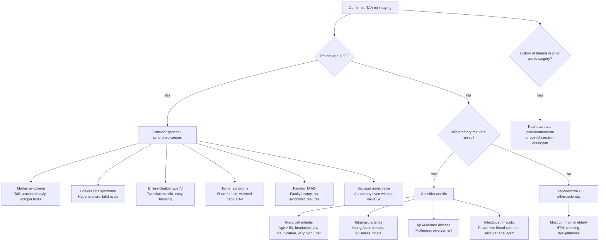

## Differential Diagnosis of Thoracic Aortic Aneurysm

When you encounter a patient with suspected TAA — or more commonly, when you encounter the *presenting symptoms* of TAA (chest/back pain, widened mediastinum on CXR, aortic regurgitation, hoarseness, dysphagia) — you need a systematic differential. Remember, most TAAs are asymptomatic and found incidentally, so the DDx really depends on the **clinical scenario** that brought the patient to attention.

Let's approach this logically by the **mode of presentation**.

---

### A. Differential Diagnosis When TAA Presents as a Mediastinal Mass / Widened Mediastinum on CXR

This is the most common scenario: a CXR done for another reason shows a widened mediastinum or a mediastinal mass. You need to differentiate TAA from other causes of mediastinal widening.

| Category | Differential | How to Differentiate from TAA |
|---|---|---|
| **Vascular** | ***Aortic dissection*** (acute aortic syndrome) [1][2] | Acute onset, tearing pain radiating to back, asymmetric BP/pulses. CT aortogram shows intimal flap + true/false lumen rather than simple aneurysmal dilatation. NB: dissection and aneurysm can coexist |
| | **Tortuous / unfolded aorta** (age-related aortic elongation) | Very common in elderly — the aorta elongates and unfolds, creating apparent widening on CXR. CT shows no true dilatation > 50% |
| | **Aortic pseudoaneurysm** (post-traumatic) [6] | History of trauma / deceleration injury. Located at aortic isthmus. CT shows contained rupture with mediastinal haematoma |
| **Neoplastic** | **Mediastinal lymphadenopathy** (lymphoma, metastatic carcinoma, sarcoidosis) | Lobulated mass, often multiple nodes. No continuity with aortic lumen on contrast CT. Biopsy may be needed |
| | **Thymoma / thymic carcinoma** | Anterior mediastinum. Not in continuity with aorta |
| | **Retrosternal goitre** | Continuous with thyroid on CT. Displaces trachea. Iodine uptake on nuclear scan |
| | **Neurogenic tumour** (schwannoma, neurofibroma) | Posterior mediastinum, paraspinal. Enhances differently from aorta on CT |
| **Other** | **Mediastinal haematoma** (without aneurysm — e.g., vertebral fracture, mediastinitis) | History of trauma, recent procedure, or infection. CT shows haematoma without aortic dilatation |
| | **Pericardial effusion** (can mimic widened cardiac silhouette/mediastinum) | Echocardiography diagnostic. Globular heart shadow on CXR |

<Callout title="Key Point">
A **widened mediastinum** on CXR is the classic radiological finding that should prompt you to think of both **TAA** and **aortic dissection** — but also of non-aortic causes. A **CT aortogram** rapidly differentiates these [3][6].
</Callout>

---

### B. Differential Diagnosis When TAA Presents with Chest or Back Pain

This is where it gets life-threatening. The key question: is this an **acute aortic emergency** or something else?

| Category | Differential | Key Distinguishing Features |
|---|---|---|
| **Aortic emergencies** | ***Acute aortic dissection*** [1][2] | ***Sudden onset, tearing pain, radiating to back***. ***Asymmetric BP & pulse between arms*** [1]. May cause ***MI, stroke, limb ischaemia, tamponade*** [1]. CT aortogram: intimal flap |
| | **Ruptured TAA** | Sudden severe chest/back pain + haemodynamic collapse. May present with haemothorax (left-sided) or tamponade (ascending). CT: contrast extravasation |
| | ***Intramural haematoma (IMH)*** [1] | Similar presentation to dissection. CT: crescentic high-attenuation thickening of aortic wall without intimal flap or false lumen flow |
| | ***Penetrating atherosclerotic ulcer (PAU)*** [1] | Elderly, atherosclerotic. CT: focal contrast-filled outpouching into aortic wall with surrounding haematoma |
| **Cardiac** | ***Acute coronary syndrome (ACS)*** [3][4] | ***Dull, constricting chest pain***, not tearing [4]. Troponin elevated. ECG changes. No mediastinal widening. **Important**: dissection from a TAA can occlude a coronary ostium → secondary MI, so always think of aortic pathology if MI + unusual features |
| | **Myopericarditis** [3] | Pleuritic, positional (better sitting forward). Diffuse ST elevation. Pericardial rub |
| **Pulmonary** | ***Pulmonary embolism (PE)*** [3] | Pleuritic pain, acute SOB, tachycardia. Risk factors for VTE. CT pulmonary angiogram diagnostic |
| | ***Tension / massive pneumothorax*** [3] | Sudden pleuritic pain, absent breath sounds, tracheal deviation. CXR diagnostic |
| | **Pneumonia** [3] | Fever, productive cough, consolidation on CXR |
| **GI** | ***GERD / oesophageal spasm*** [3] | Retrosternal burning, related to meals, relieved by antacids. Normal aorta on imaging |
| | **Boerhaave syndrome** (oesophageal perforation) | Severe retching/vomiting preceding pain. Pneumomediastinum on CXR. Contrast swallow diagnostic |
| **Musculoskeletal** | **Costochondritis, rib fracture** [3] | Reproducible with palpation. No mediastinal abnormality |
| **Spinal** | **Vertebral collapse / disc disease** | Back pain, neurological signs, bony tenderness. MRI spine diagnostic |

<Callout title="The 'Big Five' of Acute Chest Pain" type="error">
Never forget the five life-threatening causes of acute chest pain — you must rule these in or out urgently in every patient [3][4]:
1. **Acute coronary syndrome**
2. **Aortic dissection** (± ruptured TAA)
3. **Pulmonary embolism**
4. **Tension pneumothorax**
5. **Cardiac tamponade** (may be *caused by* ruptured ascending TAA or dissection)
</Callout>

---

### C. Differential Diagnosis When TAA Presents with Compressive Symptoms

| Symptom | DDx Besides TAA | How to Differentiate |
|---|---|---|
| ***Hoarseness*** (left RLN palsy) | **Lung carcinoma** (especially left apical / Pancoast), **mediastinal lymphadenopathy**, **thyroid carcinoma**, **post-thyroidectomy**, **idiopathic vocal cord palsy** | CT thorax shows whether the RLN is compressed by an aneurysm vs. tumour. Laryngoscopy confirms vocal cord palsy |
| **Dysphagia** | **Oesophageal carcinoma**, **stricture**, **achalasia**, **extrinsic compression by lymph nodes**, ***dysphagia lusoria*** (aberrant right subclavian artery), ***dysphagia aortica*** [5][9] | OGD for intraluminal causes. CT/barium swallow for extrinsic compression. Dysphagia aortica is specifically due to TAA compressing the oesophagus [5][9] |
| **Stridor / dyspnoea** | **Tracheal tumour**, **goitre**, **tracheomalacia**, **foreign body** | CT and bronchoscopy differentiate |
| **SVC syndrome** | **Lung carcinoma**, **lymphoma**, **mediastinal fibrosis**, **thrombosis (central line-related)** | CT with contrast defines the cause |

---

### D. Differential Diagnosis When TAA Presents with Aortic Regurgitation

When you find AR on echo, you must determine whether the problem is the **valve leaflets** or **aortic root/ascending aorta dilatation** — because the treatment differs fundamentally.

| Cause of AR | Key Features |
|---|---|
| **Aortic root / ascending aorta dilatation (TAA)** | Dilated root on echo/CT. Leaflets structurally normal but fail to coapt due to annular dilatation. Associated with ***Marfan syndrome***, ***syphilitic aortitis***, degenerative aneurysm [8] |
| **Rheumatic heart disease** | History of rheumatic fever, leaflet thickening/calcification, often with MS |
| **Infective endocarditis** | Fever, positive blood cultures, vegetations on echo, embolic phenomena |
| **Congenital bicuspid aortic valve** | Two leaflets on echo. May have both stenosis and regurgitation. Associated ascending aortopathy |
| **Ruptured sinus of Valsalva aneurysm** | Acute AR, continuous murmur, into RV or LV [8] |
| **Spondyloarthropathy** | Aortic root fibrosis → AR. Look for axSpA features (back pain, sacroiliitis, HLA-B27) [10] |

---

### E. Differential Diagnosis by Aetiology — "What Is Causing This Aneurysm?"

Once you've confirmed the TAA on imaging, the next question is: **why does this patient have a TAA?** This is important because the underlying aetiology determines surgical thresholds, surveillance intervals, and screening of family members.

---

### F. Systematic Framework for DDx — By Presentation Scenario

Here is a consolidated summary you can use as a clinical thinking tool:

| Presentation Scenario | Primary DDx to Consider | Most Dangerous "Must Not Miss" |
|---|---|---|
| **Incidental widened mediastinum on CXR** | TAA, aortic unfolding, mediastinal mass (lymphoma, thymoma, goitre) | TAA (risk of rupture/dissection) |
| **Acute severe chest/back pain** | Aortic dissection, ruptured TAA, ACS, PE, tension PTX, tamponade, Boerhaave | Aortic dissection / ruptured TAA |
| **Hoarseness + mediastinal abnormality** | TAA (Ortner syndrome), lung CA, mediastinal LN, thyroid CA | Lung carcinoma |
| **Progressive dysphagia** | Oesophageal CA, stricture, achalasia, ***dysphagia aortica*** from TAA [5][9], dysphagia lusoria | Oesophageal carcinoma |
| **New AR on echo** | Aortic root aneurysm (TAA), BAV, RHD, IE, syphilitic aortitis | IE (acute), TAA with dissection risk |
| **Young patient with aortic dilatation** | Marfan, Loeys-Dietz, BAV aortopathy, familial TAAD, Turner, Takayasu | Genetic cause (needs family screening + lower surgical threshold) |

---

### G. How to Differentiate TAA from Aortic Dissection — A Common Exam Pitfall

This is worth emphasizing because students often confuse these:

| Feature | Thoracic Aortic Aneurysm | Aortic Dissection |
|---|---|---|
| **Nature** | Chronic structural disease (dilated aorta) | Acute event (tear in aortic wall) |
| **Pain** | Usually painless; if painful, chronic dull ache | ***Sudden onset, tearing, maximal at onset, radiates to back*** [1][4] |
| **Onset** | Gradual (months-years) | Acute (seconds-minutes) |
| **Pulses** | Usually symmetric (unless thromboembolism) | ***Asymmetric BP & pulse*** [1] |
| **CT finding** | Dilated aorta, no intimal flap | ***Intimal flap, true + false lumen*** |
| **Relationship** | TAA is a **risk factor for** dissection | Dissection can **cause** subsequent aneurysm (chronic dissection → false lumen expansion) |
| **Emergency?** | Not usually (unless ruptured) | Always an emergency |

<Callout title="TAA and Dissection Can Coexist" type="error">
A patient with a known TAA can acutely dissect — indeed, pre-existing aneurysm is a **risk factor** for dissection [2]. If a patient with known TAA develops sudden severe pain, treat as dissection until proven otherwise. Additionally, Type B dissection managed medically requires lifelong surveillance because the false lumen can progressively dilate → **post-dissection aneurysm** → requiring late intervention [2].
</Callout>

---

> **High-Yield Summary for DDx:**
> - The DDx of TAA depends on how it presents: widened mediastinum, acute chest/back pain, compressive symptoms, AR, or incidental imaging finding.
> - The most critical differentiation is **TAA vs. acute aortic dissection** — different management urgency.
> - For acute chest/back pain: always consider the "Big Five" life-threatening causes (ACS, dissection, PE, tension PTX, tamponade).
> - For widened mediastinum: TAA vs. mediastinal mass vs. aortic unfolding.
> - Once TAA is confirmed, determine the **aetiology** (degenerative vs. genetic vs. inflammatory vs. infectious vs. post-traumatic) — this changes surgical thresholds and family screening.
> - ***Dysphagia aortica*** and ***Ortner syndrome (hoarseness from RLN compression)*** are characteristic compressive presentations of TAA [5][7][9].

<Callout title="High Yield Summary">

1. **Most TAAs are asymptomatic** — DDx arises when they present with pain, compression, AR, or as an incidental mediastinal finding.
2. **Acute chest/back pain DDx**: Aortic dissection, ACS, PE, tension PTX, tamponade — the "Big Five" [3][4].
3. **Widened mediastinum DDx**: TAA, dissection, mediastinal lymphadenopathy, thymoma, retrosternal goitre, aortic unfolding.
4. **Compressive symptom DDx**: Hoarseness → RLN palsy (TAA vs. lung CA vs. thyroid CA). Dysphagia → TAA (dysphagia aortica) vs. oesophageal CA vs. achalasia [5][9].
5. **AR DDx**: Root dilatation from TAA vs. leaflet disease (RHD, IE, BAV) [8].
6. **Young patient with TAA**: Always think genetic — Marfan, Loeys-Dietz, EDS IV, BAV aortopathy, familial TAAD, Turner syndrome → lower surgical thresholds + family screening.
7. **Aortitis causing TAA**: GCA (elderly, high ESR), Takayasu (young Asian female), IgG4-related, syphilitic [5][7].
8. **Mycotic aneurysm**: Fever + saccular aneurysm → non-typhoid Salmonella (Asia), S. aureus, Streptococcus [1].
9. TAA is a **risk factor for** dissection; chronic dissection can **cause** secondary TAA — they are related but distinct entities.

</Callout>

<ActiveRecallQuiz
  title="Active Recall - Differential Diagnosis of TAA"
  items={[
    {
      question: "A 72-year-old man presents with sudden-onset tearing chest pain radiating to the back and unequal arm blood pressures. What is your top differential, and how does CT aortogram differentiate it from a thoracic aortic aneurysm?",
      markscheme: "Top DDx: acute aortic dissection. CT aortogram shows intimal flap with true and false lumens in dissection, vs. simple aortic dilatation without intimal flap in TAA. NB: the two can coexist (dissection arising from a pre-existing TAA)."
    },
    {
      question: "Name the 'Big Five' life-threatening causes of acute chest pain that must be ruled out urgently.",
      markscheme: "1. Acute coronary syndrome (ACS). 2. Aortic dissection. 3. Pulmonary embolism (PE). 4. Tension pneumothorax. 5. Cardiac tamponade."
    },
    {
      question: "A patient with a known thoracic aortic aneurysm develops progressive hoarseness. What is the eponymous syndrome, what nerve is affected, and what other diagnosis must you exclude?",
      markscheme: "Ortner syndrome (cardiovocal syndrome). Left recurrent laryngeal nerve compressed by the aortic arch or proximal descending aortic aneurysm. Must exclude lung carcinoma (especially left apical/Pancoast tumour) and mediastinal lymphadenopathy as alternative causes of RLN palsy."
    },
    {
      question: "What is dysphagia aortica and what other cardiovascular causes of dysphagia should you know?",
      markscheme: "Dysphagia aortica: extrinsic oesophageal compression by a thoracic aortic aneurysm or enlarged/tortuous aorta. Other CVS causes: dysphagia lusoria (aberrant right subclavian artery compressing oesophagus) and dysphagia megalatriensis (left atrial enlargement compressing oesophagus)."
    },
    {
      question: "A 28-year-old woman with hypertelorism and bifid uvula is found to have ascending aortic dilatation of 4.2 cm. What genetic syndrome should you suspect, and why is the surgical threshold different from degenerative TAA?",
      markscheme: "Loeys-Dietz syndrome (TGFBR1/TGFBR2 mutations). Surgical threshold is lower (often 4.0-4.2 cm) because these patients have aggressive aneurysm growth and high dissection risk even at smaller diameters compared to degenerative TAA (threshold 5.5 cm)."
    },
    {
      question: "List three conditions in the acute aortic syndrome spectrum and briefly describe the CT finding for each.",
      markscheme: "1. Aortic dissection: intimal flap separating true and false lumens. 2. Intramural haematoma (IMH): crescentic high-attenuation thickening of aortic wall without intimal flap or false lumen flow. 3. Penetrating atherosclerotic ulcer (PAU): focal contrast-filled outpouching into the aortic wall with surrounding subadventitial haematoma."
    }
  ]}
/>

## References

[1] Senior notes: Maksim Surgery Notes.pdf (Ch 7.1, Aneurysm / AAA)
[2] Senior notes: Ryan Ho Cardiology.pdf (Section 4.5.2, Aortic Aneurysms)
[3] Senior notes: Ryan Ho Cardiology.pdf (Section 2.1, Chest Pain)
[4] Senior notes: Ryan Ho Fundamentals.pdf (Section 3.1.1, Chest Pain)
[5] Senior notes: Ryan Ho Rheumatology.pdf (Section 3.6.1, GCA and PMR; Section 3.6.2, Takayasu Arteritis)
[6] Senior notes: Ryan Ho Radiology.pdf (Acute Traumatic Aortic Injury)
[7] Lecture slides: GC 199. Pulsating abdominal mass aortic aneurysm.pdf
[8] Senior notes: Ryan Ho Cardiology.pdf (Section on Aortic Regurgitation)
[9] Senior notes: Ryan Ho GI.pdf (Section on Dysphagia, CVS causes)
[10] Senior notes: Ryan Ho Rheumatology.pdf (Section on Spondyloarthropathy, Cardiovascular manifestations)
